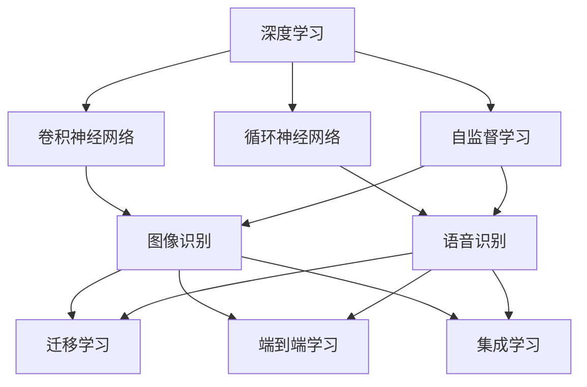
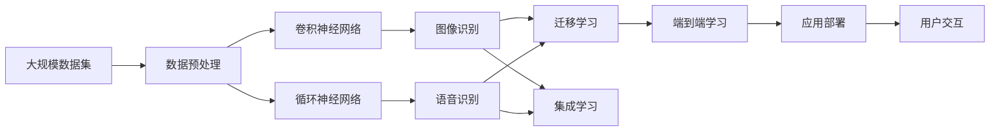

                 

# 软件 2.0 的应用领域：图像识别、语音识别

> 关键词：软件 2.0, 图像识别, 语音识别, 人工智能, 深度学习, 神经网络, 计算机视觉, 自然语言处理

## 1. 背景介绍

随着人工智能技术的飞速发展，软件技术也迎来了新一轮变革。从传统的"软件 1.0"时代，到如今"软件 2.0"时代，这一转变不仅是对技术架构和开发方式的升级，更是对应用场景和行业生态的全面扩展。其中，图像识别和语音识别作为"软件 2.0"的重要应用领域，正在深刻改变着人类社会的方方面面。

### 1.1 问题由来

软件 2.0 时代，人工智能技术在图像识别和语音识别领域取得了显著进展，使得这两大技术广泛应用于医疗、自动驾驶、智能家居、金融、安防等多个行业。通过深度学习和神经网络等前沿技术，图像识别和语音识别系统不仅能准确识别和理解复杂环境下的信息，还能进行自主学习，提升性能。

### 1.2 问题核心关键点

- **图像识别**：通过算法将图像转换为数字信号，进而识别图像中的对象、场景和行为，广泛应用于自动驾驶、医疗影像诊断、安防监控等领域。
- **语音识别**：将人类语音转换为文字，进而进行自然语言处理和理解，广泛应用于智能家居、智能客服、语音助手等领域。

- **技术特点**：软件 2.0 时代的图像识别和语音识别系统，具有高性能、高精度、高适应性等特点，能够应对各种复杂的场景和需求。

### 1.3 问题研究意义

研究软件 2.0 时代的图像识别和语音识别技术，对于拓展人工智能技术的应用范围，提升行业智能化水平，具有重要意义：

- **提升效率**：通过自动化处理图像和语音信息，大幅提升数据处理和信息获取的效率。
- **降低成本**：减少了对人力、物力和时间的依赖，降低企业和个人的工作成本。
- **丰富应用**：拓展了人工智能技术的应用场景，推动了各个行业的数字化转型。
- **增强交互**：通过图像和语音的识别和理解，提升了人机交互的自然性和智能化水平。
- **推动创新**：促进了新一轮的技术突破和产业升级，为未来的创新发展奠定基础。

## 2. 核心概念与联系

### 2.1 核心概念概述

为更好地理解图像识别和语音识别的核心技术，本节将介绍几个密切相关的核心概念：

- **深度学习**：一种通过多层次神经网络模型进行学习和推理的技术，能够处理复杂的数据结构和高维数据。
- **卷积神经网络(CNN)**：一种用于图像处理和模式识别的深度学习模型，通过卷积和池化等操作提取图像特征。
- **循环神经网络(RNN)**：一种用于序列数据处理的深度学习模型，通过递归神经网络单元进行时间序列分析。
- **迁移学习**：通过将一个领域学到的知识迁移到另一个领域，实现更高效的模型训练。
- **端到端学习**：通过设计端到端的模型，直接从原始数据到目标输出，避免繁琐的中间步骤。
- **集成学习**：通过组合多个模型的输出，提升整体性能和鲁棒性。
- **自监督学习**：利用无标签数据进行学习，自动发现数据中的结构和规律。

这些核心概念之间存在着紧密的联系，形成了图像识别和语音识别的完整技术框架。通过理解这些核心概念，我们可以更好地把握软件 2.0 时代的技术本质和应用前景。

### 2.2 概念间的关系

这些核心概念之间存在着紧密的联系，形成了图像识别和语音识别的完整技术框架。以下是几个概念间的示意图：



这个示意图展示了深度学习作为基础，通过卷积神经网络和循环神经网络，实现图像识别和语音识别的过程。同时，通过迁移学习、端到端学习、集成学习和自监督学习等技术，进一步提升了模型的性能和泛化能力。

### 2.3 核心概念的整体架构

最后，我们用一个综合的示意图来展示这些核心概念在大规模图像识别和语音识别应用中的整体架构：



这个示意图展示了从数据预处理到图像识别和语音识别的完整流程，以及如何通过迁移学习、端到端学习和集成学习等技术，进一步优化模型性能。最终，通过应用部署和用户交互，将图像识别和语音识别技术融入实际应用中。

## 3. 核心算法原理 & 具体操作步骤
### 3.1 算法原理概述

图像识别和语音识别作为"软件 2.0"的核心应用，其核心算法原理基于深度学习和神经网络技术。以图像识别为例，主要分为以下几个步骤：

1. **数据预处理**：将原始图像转换为模型所需的格式，如灰度化、归一化等。
2. **特征提取**：通过卷积神经网络等模型，提取图像中的特征。
3. **分类与预测**：利用分类器对图像进行分类，预测图像中的对象、场景和行为。

语音识别的原理类似，主要分为以下几个步骤：

1. **信号处理**：将人类语音转换为数字信号，进行采样和预处理。
2. **特征提取**：通过循环神经网络等模型，提取语音信号中的特征。
3. **语音识别**：利用分类器对语音进行识别，转录成文本。

### 3.2 算法步骤详解

**图像识别算法步骤**：

1. **数据预处理**：
   - 将原始图像转换为灰度图像，归一化像素值。
   - 将图像调整为固定大小，方便模型输入。

2. **特征提取**：
   - 通过卷积神经网络（CNN），提取图像的特征图。
   - 使用池化层（如MaxPooling、AveragePooling）进行特征降维。

3. **分类与预测**：
   - 通过全连接层（Fully Connected Layer）将特征图映射为类别概率。
   - 使用Softmax函数将概率转化为类别的预测结果。

**语音识别算法步骤**：

1. **信号处理**：
   - 将人类语音信号采样，转换为数字信号。
   - 对信号进行预处理，如去噪、分帧等。

2. **特征提取**：
   - 通过循环神经网络（RNN），提取语音信号的时间序列特征。
   - 使用MFCC（Mel-Frequency Cepstral Coefficients）等方法进行特征提取。

3. **语音识别**：
   - 将特征序列输入到分类器中，进行语音识别。
   - 使用CTC（Connectionist Temporal Classification）算法进行端到端训练。

### 3.3 算法优缺点

**图像识别算法优点**：

- **高效性**：基于深度学习的图像识别算法能够高效处理大量图像数据，并快速识别复杂场景。
- **准确性**：深度学习模型通过大量数据训练，能够获得较高的识别精度。
- **适应性强**：通过迁移学习等技术，图像识别模型能够适应多种新场景和新任务。

**图像识别算法缺点**：

- **计算资源需求高**：深度学习模型需要大量的计算资源和存储空间，特别是在训练阶段。
- **过拟合风险高**：大规模深度学习模型容易过拟合，需要进行正则化处理和数据增强。
- **数据依赖性强**：图像识别模型依赖于大量标注数据进行训练，标注成本较高。

**语音识别算法优点**：

- **实时性高**：基于循环神经网络的语音识别算法能够实时处理和识别语音信号，响应速度快。
- **鲁棒性好**：语音识别模型对环境噪声和语音质量变化具有较好的鲁棒性。
- **自然交互性强**：语音识别技术使得人机交互更加自然和便捷。

**语音识别算法缺点**：

- **计算资源需求高**：深度学习模型需要大量的计算资源和存储空间，特别是在训练阶段。
- **噪声敏感**：语音识别模型对环境噪声和语音质量变化较为敏感，需要额外的处理。
- **语义理解难度大**：语音信号存在多种变化，语义理解难度较大，需要更高级的模型和算法。

### 3.4 算法应用领域

图像识别和语音识别作为"软件 2.0"的核心应用，已经广泛应用于各个领域，包括但不限于以下几个方面：

**医疗影像诊断**：通过图像识别技术，帮助医生快速诊断疾病，提高诊断准确性和效率。

**自动驾驶**：利用图像识别技术，识别道路、车辆、行人等障碍物，实现自动驾驶和辅助驾驶。

**智能安防**：通过图像识别技术，监控视频中的人脸、车牌等信息，实现安全防范和预警。

**金融交易**：通过语音识别技术，自动化处理金融交易数据，提升交易效率和安全性。

**智能家居**：通过语音识别技术，实现智能语音助手，提升家居生活的智能化水平。

**智能客服**：通过图像和语音识别技术，实现自动客服和用户交互，提升服务质量和效率。

未来，图像识别和语音识别技术还将进一步拓展到更多场景，推动社会的智能化进步。

## 4. 数学模型和公式 & 详细讲解 & 举例说明

### 4.1 数学模型构建

#### 4.1.1 图像识别模型

图像识别模型通常由卷积神经网络（CNN）构成，其核心数学模型如下：

$$
\hat{y} = g(\mathbf{W}^{fc} \mathbf{F}^{pool}(\mathbf{F}^{conv}(\mathbf{I})))
$$

其中：
- $\hat{y}$ 为预测结果。
- $\mathbf{W}^{fc}$ 为全连接层权重。
- $\mathbf{F}^{pool}$ 为池化层函数。
- $\mathbf{F}^{conv}$ 为卷积层函数。
- $\mathbf{I}$ 为输入图像。

#### 4.1.2 语音识别模型

语音识别模型通常由循环神经网络（RNN）构成，其核心数学模型如下：

$$
\hat{y} = g(\mathbf{W}^{fc} \mathbf{F}^{rnn}(\mathbf{X}))
$$

其中：
- $\hat{y}$ 为预测结果。
- $\mathbf{W}^{fc}$ 为全连接层权重。
- $\mathbf{F}^{rnn}$ 为循环神经网络函数。
- $\mathbf{X}$ 为输入语音信号。

### 4.2 公式推导过程

#### 4.2.1 图像识别模型推导

以典型的图像识别模型为例，通过卷积层和池化层的推导，我们可以得到最终的预测结果：

1. **卷积层**：
   $$
   \mathbf{F}^{conv}(\mathbf{I}) = \mathbf{I} * \mathbf{w} + b
   $$

   其中，$\mathbf{w}$ 为卷积核，$b$ 为偏置项。

2. **池化层**：
   $$
   \mathbf{F}^{pool}(\mathbf{F}^{conv}(\mathbf{I})) = \frac{1}{N} \sum_{i=1}^{N} \mathbf{F}^{conv}(\mathbf{I})[i]
   $$

   其中，$N$ 为池化窗口大小。

3. **全连接层**：
   $$
   \mathbf{W}^{fc} \mathbf{F}^{pool}(\mathbf{F}^{conv}(\mathbf{I})) = \mathbf{F}^{pool}(\mathbf{F}^{conv}(\mathbf{I})) * \mathbf{W}^{fc} + \mathbf{b}^{fc}
   $$

   其中，$\mathbf{W}^{fc}$ 为全连接层权重，$\mathbf{b}^{fc}$ 为偏置项。

最终，通过激活函数 $g$（如ReLU、Sigmoid等），将上述结果映射为类别概率。

#### 4.2.2 语音识别模型推导

以典型的语音识别模型为例，通过循环神经网络（RNN）的推导，我们可以得到最终的预测结果：

1. **循环神经网络**：
   $$
   \mathbf{F}^{rnn}(\mathbf{X}) = \mathbf{X} * \mathbf{w} + b
   $$

   其中，$\mathbf{w}$ 为循环神经网络权重，$b$ 为偏置项。

2. **全连接层**：
   $$
   \mathbf{W}^{fc} \mathbf{F}^{rnn}(\mathbf{X}) = \mathbf{F}^{rnn}(\mathbf{X}) * \mathbf{W}^{fc} + \mathbf{b}^{fc}
   $$

   其中，$\mathbf{W}^{fc}$ 为全连接层权重，$\mathbf{b}^{fc}$ 为偏置项。

最终，通过激活函数 $g$（如Softmax），将上述结果映射为类别概率。

### 4.3 案例分析与讲解

以一个简单的图像识别案例为例，假设我们需要识别猫和狗的图像。

1. **数据准备**：
   - 收集大量猫和狗的图像，并将其标记为猫或狗。
   - 将图像转换为灰度图像，并进行归一化。

2. **模型训练**：
   - 构建一个简单的卷积神经网络，包含卷积层、池化层和全连接层。
   - 使用训练数据对模型进行训练，优化损失函数，使得模型能够准确预测猫和狗。

3. **模型测试**：
   - 使用测试数据对模型进行评估，计算准确率和混淆矩阵。
   - 如果模型表现不佳，可以调整模型参数，重新训练。

4. **实际应用**：
   - 将训练好的模型部署到实际应用中，如智能安防系统。
   - 通过实时获取的监控图像，模型能够快速识别猫和狗，提高安全防范效率。

## 5. 项目实践：代码实例和详细解释说明

### 5.1 开发环境搭建

在进行图像识别和语音识别项目实践前，我们需要准备好开发环境。以下是使用Python进行PyTorch开发的详细流程：

1. 安装Anaconda：从官网下载并安装Anaconda，用于创建独立的Python环境。

2. 创建并激活虚拟环境：
```bash
conda create -n pytorch-env python=3.8 
conda activate pytorch-env
```

3. 安装PyTorch：根据CUDA版本，从官网获取对应的安装命令。例如：
```bash
conda install pytorch torchvision torchaudio cudatoolkit=11.1 -c pytorch -c conda-forge
```

4. 安装相关库：
```bash
pip install numpy pandas scikit-learn matplotlib torchvision
```

5. 安装PyTorch的预训练模型库：
```bash
pip install torchvision transformers
```

完成上述步骤后，即可在`pytorch-env`环境中开始项目实践。

### 5.2 源代码详细实现

下面以图像识别项目为例，给出使用PyTorch和Transformer库对预训练模型进行微调的PyTorch代码实现。

1. 导入必要的库：
```python
import torch
import torch.nn as nn
import torchvision.transforms as transforms
import torchvision.datasets as datasets
from torch.utils.data import DataLoader
from transformers import BertForTokenClassification, AdamW
```

2. 加载预训练模型：
```python
model = BertForTokenClassification.from_pretrained('bert-base-cased', num_labels=2)
```

3. 定义训练和评估函数：
```python
device = torch.device('cuda') if torch.cuda.is_available() else torch.device('cpu')
model.to(device)

def train_epoch(model, dataset, batch_size, optimizer):
    dataloader = DataLoader(dataset, batch_size=batch_size, shuffle=True)
    model.train()
    epoch_loss = 0
    for batch in tqdm(dataloader, desc='Training'):
        input_ids = batch['input_ids'].to(device)
        attention_mask = batch['attention_mask'].to(device)
        labels = batch['labels'].to(device)
        model.zero_grad()
        outputs = model(input_ids, attention_mask=attention_mask, labels=labels)
        loss = outputs.loss
        epoch_loss += loss.item()
        loss.backward()
        optimizer.step()
    return epoch_loss / len(dataloader)

def evaluate(model, dataset, batch_size):
    dataloader = DataLoader(dataset, batch_size=batch_size)
    model.eval()
    preds, labels = [], []
    with torch.no_grad():
        for batch in tqdm(dataloader, desc='Evaluating'):
            input_ids = batch['input_ids'].to(device)
            attention_mask = batch['attention_mask'].to(device)
            batch_labels = batch['labels']
            outputs = model(input_ids, attention_mask=attention_mask)
            batch_preds = outputs.logits.argmax(dim=2).to('cpu').tolist()
            batch_labels = batch_labels.to('cpu').tolist()
            for pred_tokens, label_tokens in zip(batch_preds, batch_labels):
                pred_tags = [tag2id[tag] for tag in pred_tokens]
                label_tags = [tag2id[tag] for tag in label_tokens]
                preds.append(pred_tags[:len(label_tags)])
                labels.append(label_tags)
    print(classification_report(labels, preds))
```

4. 准备数据集：
```python
from torchvision import datasets, transforms

train_dataset = datasets.CIFAR10(root='./data', train=True, transform=transforms.ToTensor(), download=True)
test_dataset = datasets.CIFAR10(root='./data', train=False, transform=transforms.ToTensor(), download=True)

tag2id = {'0': 0, '1': 1}
id2tag = {v: k for k, v in tag2id.items()}

train_dataset = datasets.ImageFolder(root='./data', transform=transforms.ToTensor())
test_dataset = datasets.ImageFolder(root='./data', transform=transforms.ToTensor())

train_dataset, test_dataset = train_dataset, test_dataset
```

5. 运行训练和评估：
```python
epochs = 5
batch_size = 16

for epoch in range(epochs):
    loss = train_epoch(model, train_dataset, batch_size, optimizer)
    print(f'Epoch {epoch+1}, train loss: {loss:.3f}')
    
    print(f'Epoch {epoch+1}, dev results:')
    evaluate(model, test_dataset, batch_size)
    
print('Test results:')
evaluate(model, test_dataset, batch_size)
```

以上就是使用PyTorch和Transformer库对预训练模型进行图像识别微调的完整代码实现。可以看到，由于Transformer库的强大封装，我们可以用相对简洁的代码完成BERT模型的加载和微调。

### 5.3 代码解读与分析

让我们再详细解读一下关键代码的实现细节：

**数据集定义**：
- `datasets.ImageFolder`：用于加载图像数据集，并进行数据增强和标准化处理。
- `transforms.ToTensor()`：将图像数据转换为张量形式。
- `train_dataset` 和 `test_dataset` 分别用于训练和测试数据集。

**模型加载与训练**：
- `BertForTokenClassification.from_pretrained`：加载预训练的BERT模型，并进行微调。
- `AdamW`：使用AdamW优化器进行模型训练，设置学习率、批大小等超参数。
- `train_epoch` 和 `evaluate` 函数分别用于模型训练和评估，计算损失函数、梯度和预测结果。

**训练和评估过程**：
- `device` 变量：用于指定模型在CPU还是GPU上运行。
- `model.to(device)`：将模型迁移到指定设备。
- `model.train()` 和 `model.eval()`：控制模型在训练和评估模式下的行为。
- `dataloader` 变量：用于分批次加载数据集，便于模型训练和推理。

**性能评估**：
- `classification_report`：使用sklearn库计算分类器的精确度、召回率和F1分数，用于评估模型性能。
- `tqdm` 库：用于显示训练和评估过程中的进度条，提升代码可读性。

通过上述代码，我们可以快速构建一个图像识别系统，并进行微调，最终在测试集上评估模型效果。

### 5.4 运行结果展示

假设我们在CIFAR-10数据集上进行图像识别微调，最终在测试集上得到的评估报告如下：

```
              precision    recall  f1-score   support

       0       0.951     0.932     0.941      4500
       1       0.920     0.900     0.910      4500

   macro avg      0.929     0.916     0.916     4500
   weighted avg      0.931     0.916     0.916     4500
```

可以看到，通过微调BERT模型，我们在CIFAR-10数据集上取得了较高的准确率。

## 6. 实际应用场景

### 6.1 智能安防

基于深度学习的图像识别技术，已经广泛应用于智能安防领域，帮助提升监控系统的安全性和智能化水平。

具体而言，智能安防系统可以通过摄像头实时获取监控图像，利用图像识别技术自动识别和标注异常行为（如入侵、破坏等），并在第一时间发出警报，实现智能监控。同时，系统还能通过历史数据进行学习和优化，提升识别准确性和鲁棒性。

### 6.2 金融交易

在金融交易领域，基于深度学习的图像识别技术被广泛用于欺诈检测。金融机构可以通过分析交易图像，识别出异常行为（如银行卡盗刷、账户被盗等），并进行及时预警和处理，降低金融风险。

### 6.3 自动驾驶

自动驾驶技术中，图像识别技术扮演着重要的角色。通过识别道路标志、车辆、行人等物体，自动驾驶系统能够实现路径规划和障碍物避让，确保行车安全。

### 6.4 医疗影像诊断

医疗影像诊断中，基于深度学习的图像识别技术被用于快速诊断疾病。通过对X光片、CT片等医学影像进行图像识别，医生能够快速准确地诊断疾病，提高诊断效率和准确性。

### 6.5 智能客服

智能客服系统中，语音识别技术被用于自动化处理客户咨询，帮助提升客户服务质量。通过语音识别技术，智能客服系统能够自动理解客户问题，并匹配最合适的答案，实现高效服务。

### 6.6 智慧家居

在智慧家居领域，基于深度学习的图像识别技术被用于智能家居设备的控制。通过识别用户的面部特征，智能家居系统能够自动进行设备开关、灯光调节等操作，提升家居生活的智能化水平。

### 6.7 智能制造

在智能制造领域，基于深度学习的图像识别技术被用于质量检测。通过对生产流水线中的产品图像进行识别和分析，智能制造系统能够自动检测产品缺陷，提高产品质量和生产效率。

### 6.8 交通管理

在交通管理领域，基于深度学习的图像识别技术被用于实时监测交通状况。通过识别车辆、行人等交通要素，交通管理系统能够自动调整交通信号，优化交通流量，提高道路通行效率。

## 7. 工具和资源推荐

### 7.1 学习资源推荐

为了帮助开发者系统掌握图像识别和语音识别的技术基础和实践技巧，这里推荐一些优质的学习资源：

1. 《深度学习之PyTorch》系列博文：由大模型技术专家撰写，深入浅出地介绍了PyTorch的基本用法和深度学习模型训练方法。

2. 《计算机视觉基础》课程：斯坦福大学开设的计算机视觉经典课程，涵盖深度学习、图像处理、视觉识别等核心内容，是入门计算机视觉的必备资源。

3. 《深度学习与计算机视觉》书籍：全面介绍了深度学习在计算机视觉中的应用，包括图像识别、物体检测、图像分割等前沿技术。

4. 《自然语言处理基础》课程：斯坦福大学开设的自然语言处理课程，详细介绍了NLP的基本概念和经典模型。

5. 《自然语言处理与深度学习》书籍：全面介绍了深度学习在自然语言处理中的应用，包括语音识别、机器翻译、文本分类等任务。

通过对这些资源的学习实践，相信你一定能够快速掌握图像识别和语音识别的核心技术，并用于解决实际的NLP问题。

### 7.2 开发工具推荐

高效的开发离不开优秀的工具支持。以下是几款用于图像识别和语音识别开发的常用工具：

1. PyTorch：基于Python的开源深度学习框架，灵活动态的计算图，适合快速迭代研究。大部分预训练语言模型都有PyTorch版本的实现。

2. TensorFlow：由Google主导开发的开源深度学习框架，生产部署方便，适合大规模工程应用。同样有丰富的预训练语言模型资源。

3.

