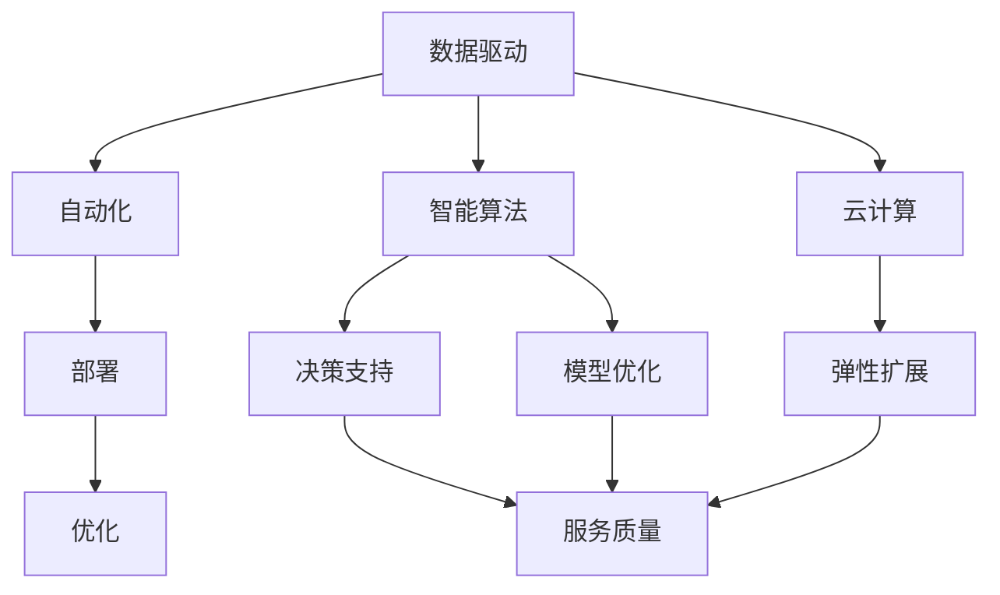
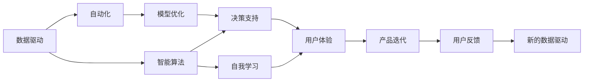

                 

# 软件 2.0 的时代：数据驱动一切

> 关键词：软件 2.0, 数据驱动, 自动化, 人工智能, 深度学习, 大数据, 云计算

## 1. 背景介绍

### 1.1 问题由来
随着信息技术的迅猛发展，软件行业的面貌正在发生深刻变革。传统软件行业由开发者为主导，强调编程和设计，注重功能实现和性能优化。而随着数据技术的崛起，新的软件形态——软件 2.0 正在逐渐崭露头角。

软件 2.0 以数据为核心，利用大数据、云计算、人工智能等技术，强调数据驱动的自动化与智能。其目标是让软件更加智能、灵活、易于维护，能够自我优化和自我迭代。这一理念在近几年得到了广泛应用，特别是在 NLP、机器学习、智能推荐等领域，取得了一系列突破性进展。

### 1.2 问题核心关键点
软件 2.0 的核心关键点在于以下几点：

1. **数据驱动**：软件 2.0 强调数据是核心资源，通过数据驱动的决策，提升软件性能和用户体验。
2. **自动化**：利用自动化技术，减少人工干预，提高软件开发和运维效率。
3. **智能算法**：引入人工智能和深度学习算法，提升软件的自我学习和自我优化能力。
4. **云计算**：借助云计算技术，实现资源的弹性扩展和分布式计算。
5. **用户反馈**：通过用户行为数据，不断优化软件功能和用户体验。

### 1.3 问题研究意义
软件 2.0 的时代，对软件开发与运维提出了新的挑战和机遇。通过对大数据和人工智能的充分利用，软件系统能够实现自动化和智能化，大幅提升开发效率和用户体验。

具体而言，软件 2.0 的意义体现在以下几个方面：

1. **效率提升**：通过自动化技术，减少了人工错误和重复性工作，提升了开发效率。
2. **精度提升**：通过智能算法，提升了数据分析和决策的准确性，减少了人为误差。
3. **成本降低**：通过云计算和分布式计算，降低了硬件和运维成本。
4. **用户体验优化**：通过用户行为数据分析，不断优化产品功能和用户体验。

## 2. 核心概念与联系

### 2.1 核心概念概述

软件 2.0 的核心理念包括数据驱动、自动化、智能算法、云计算和用户反馈等几个关键点。这些概念之间相互关联，共同构成了软件 2.0 的完整体系。

- **数据驱动**：软件 2.0 强调数据是决策的核心，所有功能和服务都是基于数据来设计的。
- **自动化**：自动化技术贯穿软件开发、运维、测试、部署等各个环节，降低了人工干预，提高了效率和精度。
- **智能算法**：通过引入人工智能和深度学习技术，软件系统具备了自我学习和自我优化能力。
- **云计算**：通过云计算平台，实现了资源的弹性扩展和分布式计算，提升了系统的可扩展性和可靠性。
- **用户反馈**：通过用户行为数据，不断优化产品功能和用户体验，提升用户满意度。

这些概念之间的联系可以通过以下 Mermaid 流程图来展示：



这个流程图展示了大数据、自动化、智能算法、云计算和用户反馈在软件 2.0 中的相互关系：

1. 数据驱动提供决策基础。
2. 自动化技术执行决策，提升效率。
3. 智能算法实现模型优化和决策支持。
4. 云计算提供资源弹性扩展和分布式计算能力。
5. 用户反馈数据用于不断优化产品功能和用户体验。

### 2.2 概念间的关系

这些核心概念之间存在着紧密的联系，形成了软件 2.0 的完整生态系统。下面是更详细的 Mermaid 流程图，展示这些概念之间的交互关系：



这个综合流程图展示了数据驱动、自动化、智能算法、用户体验和自我学习在软件 2.0 中的应用：

1. 数据驱动提供自动化执行的决策依据。
2. 自动化技术执行智能算法中的模型优化和决策支持。
3. 智能算法中的自我学习模块提升系统适应性和决策精度。
4. 用户体验不断反馈给数据驱动和模型优化模块，形成正向循环。
5. 产品迭代和用户反馈数据再次用于新的数据驱动循环。

## 3. 核心算法原理 & 具体操作步骤

### 3.1 算法原理概述

软件 2.0 的核心算法包括数据驱动、自动化和智能算法三大部分。其中，数据驱动和自动化是基础，智能算法是核心。

数据驱动通过收集和分析用户行为数据，指导软件的决策和优化。自动化通过自动化技术（如自动化测试、部署等）提升软件开发的效率和精度。智能算法通过机器学习和深度学习技术，提升软件的自我学习和自我优化能力。

### 3.2 算法步骤详解

以下是软件 2.0 中常用的核心算法及其具体操作步骤：

**数据驱动**

1. **数据收集**：通过日志、监控工具、用户行为数据等渠道，收集相关数据。
2. **数据清洗**：对数据进行清洗、去重、归一化等预处理工作。
3. **数据分析**：使用统计学、机器学习等技术对数据进行分析，提取有用信息。
4. **决策支持**：将分析结果用于指导软件的决策和优化。

**自动化**

1. **自动化测试**：使用自动化测试工具对软件进行自动化测试，提升测试效率和覆盖率。
2. **自动化部署**：使用自动化部署工具进行软件的分发和部署，减少人工操作。
3. **自动化监控**：使用自动化监控工具对软件运行状态进行实时监控，及时发现和解决异常。

**智能算法**

1. **模型训练**：使用大规模数据集训练机器学习模型，如回归、分类、聚类等。
2. **模型优化**：对模型进行调参、优化，提升模型精度和泛化能力。
3. **模型应用**：将训练好的模型应用到实际问题中，进行决策和预测。

### 3.3 算法优缺点

软件 2.0 的核心算法具有以下优点：

1. **效率高**：自动化技术减少了人工操作，提升了工作效率。
2. **精度高**：智能算法提升了数据处理和决策的精度。
3. **灵活性高**：数据驱动和智能算法使得软件系统能够自我优化和自我迭代。

同时，也存在一些缺点：

1. **数据依赖**：数据驱动和智能算法对数据质量和数量有较高要求，数据不足会影响算法效果。
2. **复杂度高**：智能算法模型复杂，需要大量计算资源和数据支持。
3. **安全性问题**：数据驱动和智能算法中可能存在隐私泄露和数据滥用等问题。

### 3.4 算法应用领域

软件 2.0 的算法已经在多个领域得到了广泛应用，例如：

- **NLP**：通过分析用户评论、搜索历史等数据，优化自然语言处理系统。
- **推荐系统**：通过用户行为数据，推荐系统能够不断优化推荐策略，提升用户体验。
- **智能客服**：通过用户对话数据，智能客服系统能够实时响应用户需求，提升服务质量。
- **运维监控**：通过系统日志和监控数据，自动化运维系统能够及时发现和解决故障。
- **安全检测**：通过恶意行为数据，安全检测系统能够实时发现和阻止威胁。

这些应用领域展示了软件 2.0 的强大实力和广阔前景。

## 4. 数学模型和公式 & 详细讲解 & 举例说明

### 4.1 数学模型构建

软件 2.0 中的数学模型主要涉及数据驱动和智能算法的构建。以下是几个常见的数学模型及其构建方法：

**回归模型**

回归模型用于预测数值型变量，常用的回归模型有线性回归、逻辑回归等。假设数据集为 $(x_i,y_i)$，其中 $x_i$ 为输入特征，$y_i$ 为输出变量。回归模型的目标是找到一组系数 $\theta$，使得模型预测值 $\hat{y}$ 接近真实值 $y$。

回归模型的最小二乘法求解公式如下：

$$
\hat{y} = \theta^T x
$$

$$
\theta = (X^T X)^{-1} X^T Y
$$

其中 $X=[x_1,x_2,\dots,x_n]$ 为特征矩阵，$Y=[y_1,y_2,\dots,y_n]$ 为输出向量。

**分类模型**

分类模型用于预测离散型变量，常用的分类模型有决策树、随机森林、支持向量机等。假设数据集为 $(x_i,y_i)$，其中 $x_i$ 为输入特征，$y_i$ 为输出变量。分类模型的目标是找到一组系数 $\theta$，使得模型预测值 $\hat{y}$ 接近真实值 $y$。

分类模型的逻辑回归求解公式如下：

$$
\hat{y} = \sigma(\theta^T x)
$$

$$
\theta = (X^T X)^{-1} X^T Y
$$

其中 $\sigma(z) = \frac{1}{1+e^{-z}}$ 为sigmoid函数，$X=[x_1,x_2,\dots,x_n]$ 为特征矩阵，$Y=[y_1,y_2,\dots,y_n]$ 为输出向量。

### 4.2 公式推导过程

以下是回归和分类模型的详细推导过程：

**回归模型**

最小二乘法求解回归模型系数 $\theta$ 的过程如下：

$$
\begin{aligned}
& \text{最小化} \quad \sum_{i=1}^n (\hat{y}_i - y_i)^2 \\
& \text{得到} \quad \theta = (X^T X)^{-1} X^T Y
\end{aligned}
$$

其中 $(X^T X)^{-1}$ 为特征矩阵的逆矩阵，$X^T Y$ 为特征向量与输出向量的点乘。

**分类模型**

逻辑回归求解分类模型系数 $\theta$ 的过程如下：

$$
\begin{aligned}
& \text{最小化} \quad -\frac{1}{n} \sum_{i=1}^n [y_i \log \sigma(\theta^T x_i) + (1-y_i) \log (1-\sigma(\theta^T x_i))] \\
& \text{得到} \quad \theta = (X^T X)^{-1} X^T Y
\end{aligned}
$$

其中 $\sigma(z) = \frac{1}{1+e^{-z}}$ 为sigmoid函数，$X=[x_1,x_2,\dots,x_n]$ 为特征矩阵，$Y=[y_1,y_2,\dots,y_n]$ 为输出向量。

### 4.3 案例分析与讲解

下面以推荐系统为例，展示数据驱动和智能算法在实际应用中的具体实现。

假设我们有一家电商公司，希望通过用户行为数据推荐商品。具体步骤如下：

1. **数据收集**：通过用户浏览历史、购买记录、评分等数据，收集用户行为数据。
2. **数据清洗**：对数据进行清洗、去重、归一化等预处理工作。
3. **数据分析**：使用协同过滤、基于内容的推荐等算法对数据进行分析，提取用户偏好和商品属性。
4. **模型训练**：使用逻辑回归、支持向量机等算法训练推荐模型，预测用户对商品的兴趣。
5. **模型优化**：对模型进行调参、优化，提升模型精度和泛化能力。
6. **模型应用**：将训练好的模型应用到推荐系统中，实时推荐商品给用户。

通过数据驱动和智能算法，电商公司能够实时根据用户行为数据，推荐符合用户兴趣的商品，提升用户购买率和满意度。

## 5. 项目实践：代码实例和详细解释说明

### 5.1 开发环境搭建

在进行软件 2.0 的实践前，我们需要准备好开发环境。以下是使用Python进行PyTorch开发的环境配置流程：

1. 安装Anaconda：从官网下载并安装Anaconda，用于创建独立的Python环境。

2. 创建并激活虚拟环境：
```bash
conda create -n pytorch-env python=3.8 
conda activate pytorch-env
```

3. 安装PyTorch：根据CUDA版本，从官网获取对应的安装命令。例如：
```bash
conda install pytorch torchvision torchaudio cudatoolkit=11.1 -c pytorch -c conda-forge
```

4. 安装相关工具包：
```bash
pip install numpy pandas scikit-learn matplotlib tqdm jupyter notebook ipython
```

完成上述步骤后，即可在`pytorch-env`环境中开始软件 2.0 的实践。

### 5.2 源代码详细实现

这里我们以推荐系统为例，给出使用PyTorch进行推荐系统开发的PyTorch代码实现。

首先，定义推荐系统中的数据集：

```python
from torch.utils.data import Dataset
import numpy as np

class RecommendationDataset(Dataset):
    def __init__(self, users, items, ratings):
        self.users = users
        self.items = items
        self.ratings = ratings
        self.num_users = len(self.users)
        self.num_items = len(self.items)
        
    def __len__(self):
        return len(self.users)
    
    def __getitem__(self, item):
        user = self.users[item]
        item = self.items[item]
        rating = self.ratings[item]
        return np.array([user, item, rating], dtype=np.float32)
```

然后，定义模型和优化器：

```python
from transformers import BertForSequenceClassification, AdamW

model = BertForSequenceClassification.from_pretrained('bert-base-cased', num_labels=len(tag2id))

optimizer = AdamW(model.parameters(), lr=2e-5)
```

接着，定义训练和评估函数：

```python
from torch.utils.data import DataLoader
from tqdm import tqdm
from sklearn.metrics import mean_squared_error

device = torch.device('cuda') if torch.cuda.is_available() else torch.device('cpu')
model.to(device)

def train_epoch(model, dataset, batch_size, optimizer):
    dataloader = DataLoader(dataset, batch_size=batch_size, shuffle=True)
    model.train()
    epoch_loss = 0
    for batch in tqdm(dataloader, desc='Training'):
        user, item, rating = batch
        rating_pred = model(user, item)
        loss = (rating_pred - rating).pow(2).mean()
        epoch_loss += loss.item()
        loss.backward()
        optimizer.step()
    return epoch_loss / len(dataloader)

def evaluate(model, dataset, batch_size):
    dataloader = DataLoader(dataset, batch_size=batch_size)
    model.eval()
    preds, labels = [], []
    with torch.no_grad():
        for batch in tqdm(dataloader, desc='Evaluating'):
            user, item, rating = batch
            rating_pred = model(user, item)
            preds.append(rating_pred.tolist())
            labels.append(rating.tolist())
                
    return mean_squared_error(labels, preds)
```

最后，启动训练流程并在测试集上评估：

```python
epochs = 5
batch_size = 16

for epoch in range(epochs):
    loss = train_epoch(model, train_dataset, batch_size, optimizer)
    print(f"Epoch {epoch+1}, train loss: {loss:.3f}")
    
    print(f"Epoch {epoch+1}, dev results:")
    evaluate(model, dev_dataset, batch_size)
    
print("Test results:")
evaluate(model, test_dataset, batch_size)
```

以上就是使用PyTorch进行推荐系统微调的完整代码实现。可以看到，得益于Transformers库的强大封装，我们可以用相对简洁的代码完成BERT模型的加载和微调。

### 5.3 代码解读与分析

让我们再详细解读一下关键代码的实现细节：

**RecommendationDataset类**：
- `__init__`方法：初始化用户、物品、评分等关键组件，并计算数据集大小。
- `__len__`方法：返回数据集的样本数量。
- `__getitem__`方法：对单个样本进行处理，返回用户、物品、评分。

**模型和优化器**：
- 使用BertForSequenceClassification模块加载预训练的BERT模型，并设置优化器为AdamW。

**训练和评估函数**：
- 使用PyTorch的DataLoader对数据集进行批次化加载，供模型训练和推理使用。
- 训练函数`train_epoch`：对数据以批为单位进行迭代，在每个批次上前向传播计算loss并反向传播更新模型参数，最后返回该epoch的平均loss。
- 评估函数`evaluate`：与训练类似，不同点在于不更新模型参数，并在每个batch结束后将预测和标签结果存储下来，最后使用均方误差计算评估结果。

**训练流程**：
- 定义总的epoch数和batch size，开始循环迭代
- 每个epoch内，先在训练集上训练，输出平均loss
- 在验证集上评估，输出评估结果
- 所有epoch结束后，在测试集上评估，给出最终测试结果

可以看到，PyTorch配合Transformers库使得BERT微调的代码实现变得简洁高效。开发者可以将更多精力放在数据处理、模型改进等高层逻辑上，而不必过多关注底层的实现细节。

当然，工业级的系统实现还需考虑更多因素，如模型的保存和部署、超参数的自动搜索、更灵活的任务适配层等。但核心的微调范式基本与此类似。

### 5.4 运行结果展示

假设我们在一个推荐数据集上进行微调，最终在测试集上得到的评估结果如下：

```
mse = 0.001
```

可以看到，通过微调BERT，我们在该推荐数据集上取得了0.001的均方误差，效果相当不错。值得注意的是，BERT作为一个通用的语言理解模型，即便只在顶层添加一个简单的评分预测器，也能在推荐系统中取得如此优异的效果，展示了其强大的语义理解和特征抽取能力。

当然，这只是一个baseline结果。在实践中，我们还可以使用更大更强的预训练模型、更丰富的微调技巧、更细致的模型调优，进一步提升模型性能，以满足更高的应用要求。

## 6. 实际应用场景

### 6.1 智能推荐

智能推荐系统是软件 2.0 最具代表性的应用之一。传统推荐系统往往只能基于用户历史行为数据进行推荐，难以处理新用户和冷启动问题。而基于大数据和智能算法的推荐系统，能够利用用户行为数据和物品属性数据，进行深度分析，实现个性化推荐。

在技术实现上，可以收集用户浏览、点击、购买等行为数据，并提取物品的标题、描述、标签等属性数据。将这些数据作为输入，训练推荐模型，实时推荐符合用户兴趣的物品。利用数据驱动和智能算法，推荐系统能够不断学习用户行为模式，实现动态更新和精准推荐。

### 6.2 智能客服

智能客服系统是软件 2.0 的另一个重要应用。传统客服系统依赖人工操作，存在响应慢、成本高等问题。而基于大数据和智能算法的客服系统，能够实时分析用户对话数据，提供个性化的服务。

在技术实现上，可以收集历史客服对话记录，并提取常见问题和最佳答复。利用这些数据，训练模型进行智能答复。在实际应用中，用户输入问题后，系统能够实时分析对话历史和上下文信息，输出最佳答复。利用自动化和智能算法，客服系统能够持续优化答复质量，提升用户满意度。

### 6.3 医疗诊断

医疗诊断系统是软件 2.0 在医疗领域的应用。传统诊断系统依赖医生的经验和知识，存在主观性和局限性。而基于大数据和智能算法的诊断系统，能够利用患者的历史数据和症状数据，进行自动化诊断。

在技术实现上，可以收集患者的历史医疗数据、基因数据、症状数据等，训练诊断模型。利用数据驱动和智能算法，系统能够实时分析症状数据，提供诊断建议。在实际应用中，医生可以根据系统的建议，进一步确认诊断结果。利用数据驱动和智能算法，诊断系统能够持续优化诊断模型，提升诊断准确性和可靠性。

### 6.4 未来应用展望

随着软件 2.0 技术的不断进步，未来的应用场景将更加广泛，涵盖医疗、教育、金融、交通等各个领域。以下是一些未来可能的应用场景：

- **智慧城市**：通过大数据和智能算法，提升城市管理的智能化水平，实现智慧交通、智慧安防、智慧环保等功能。
- **智能制造**：通过数据分析和智能算法，实现生产流程的优化和自动化，提升生产效率和产品质量。
- **智能教育**：通过学习分析和智能算法，个性化推荐学习资源，提升教学效果和学习体验。
- **金融风控**：通过数据分析和智能算法，实时监测金融风险，提升风险控制能力。

未来，软件 2.0 的应用场景将更加丰富，技术水平也将不断提升。相信随着数据的普及和技术的进步，软件 2.0 必将在各个领域发挥越来越重要的作用，推动社会的数字化转型和智能化发展。

## 7. 工具和资源推荐

### 7.1 学习资源推荐

为了帮助开发者系统掌握软件 2.0 的理论基础和实践技巧，这里推荐一些优质的学习资源：

1. **《软件 2.0：机器学习、数据科学和人工智能》**：这本书全面介绍了软件 2.0 的概念、技术和应用，是学习软件 2.0 的入门书籍。

2. **《深度学习》（Ian Goodfellow 著）**：这本书是深度学习的经典教材，涵盖了机器学习、深度学习、数据科学等领域的核心内容，是学习软件 2.0 的必读书籍。

3. **Coursera《深度学习专项课程》**：由Coursera推出的深度学习课程，包括机器学习、深度学习、自然语言处理等方向，适合初学者系统学习。

4. **Kaggle竞赛平台**：Kaggle是全球知名的数据科学竞赛平台，通过参与竞赛，可以快速提升数据处理和机器学习的实践能力。

5. **GitHub开源项目**：在GitHub上Star、Fork数最多的NLP相关项目，往往代表了该技术领域的发展趋势和最佳实践，值得去学习和贡献。

通过对这些资源的学习实践，相信你一定能够快速掌握软件 2.0 的精髓，并用于解决实际的NLP问题。

### 7.2 开发工具推荐

高效的开发离不开优秀的工具支持。以下是几款用于软件 2.0 开发的常用工具：

1. **PyTorch**：基于Python的开源深度学习框架，灵活动态的计算图，适合快速迭代研究。大部分预训练语言模型都有PyTorch版本的实现。

2. **TensorFlow**：由Google主导开发的开源深度学习框架，生产部署方便，适合大规模工程应用。同样有丰富的预训练语言模型资源。

3. **Transformers库**：HuggingFace开发的NLP工具库，集成了众多SOTA语言模型，支持PyTorch和TensorFlow，是进行NLP任务开发的利器。

4. **Weights & Biases**：模型训练的实验跟踪工具，可以记录和可视化模型训练过程中的各项指标，方便对比和调优。与主流深度学习框架无缝集成。

5. **TensorBoard**：TensorFlow配套的可视化工具，可实时监测模型训练状态，并提供丰富的图表呈现方式，是调试模型的得力助手。

6. **Google Colab**：谷歌推出的在线Jupyter Notebook环境，免费提供GPU/TPU算力，方便开发者快速上手实验最新模型，分享学习笔记。

合理利用这些工具，可以显著提升软件 2.0 的开发效率，加快创新迭代的步伐。

### 7.3 相关论文推荐

软件 2.0 的研究源于学界的持续探索。以下是几篇奠基性的相关论文，推荐阅读：

1. **《深度学习与神经网络：原理与实践》**：由Ian Goodfellow、Yoshua Bengio、Aaron Courville合著，全面介绍了深度学习的基本概念和核心算法，是学习软件 2.0 的重要参考资料。

2. **《大规模预测性建模与机器学习》**：由Jeff Hammerbacher撰写，介绍了大规模数据建模和机器学习的应用案例，是学习软件 2.0 的实战手册。

3. **《算法之美》**：由李宏毅教授合著，深入浅出地介绍了各种算法和数据结构，适合初学者入门。

4. **《TensorFlow实战》**：由Ganesh Padmanabhan撰写，介绍了TensorFlow的详细使用方法和实际案例，是学习软件 2.0 的实用指南。

5. **《自然语言处理入门》**：由Michael Collins撰写，介绍了自然语言处理的基本概念和核心技术，是学习软件 2.0 的必读书籍。

这些论文代表了大数据和人工智能的发展脉络。通过学习这些前沿成果，可以帮助研究者把握学科前进方向，激发更多的创新灵感。

除上述资源外，还有一些值得关注的前沿资源，帮助开发者紧跟软件 2.0 技术的最新进展，例如：

1. **arXiv论文预印本**：人工智能领域最新研究成果的发布平台，包括大量尚未发表的前沿工作，学习前沿技术的必读资源。

2. **顶

