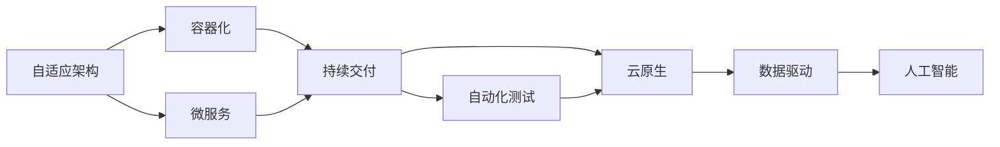

                 

## 1. 背景介绍

### 1.1 问题由来
随着计算技术的发展，软件已经在各个行业领域中发挥了重要作用。从早期的批处理系统到现代的云服务，软件行业经历了多次重大变革。但传统的软件开发模式，如瀑布模型、敏捷开发等，已经无法满足日益复杂的软件需求。

软件2.0（Software 2.0）的概念，由Gene Kim提出，指未来的软件系统将更加智能、灵活、可自适应和自我管理。软件2.0不仅要求软件系统具备高效自动化的能力，还要在数据驱动下不断自我进化，以适应快速变化的环境和用户需求。

### 1.2 问题核心关键点
软件2.0的核心在于实现自适应和自我管理。自适应性使得软件系统能够自动调整和优化自身行为，以应对变化的环境和用户需求。自我管理性则是指软件系统具备自我修复、自我调优和自我扩展的能力。

软件2.0的关键技术包括自动化测试、持续交付、自适应架构、微服务、容器化、云原生、数据驱动和人工智能等。这些技术共同构建了一个可自适应和自我管理的软件生态系统。

### 1.3 问题研究意义
研究软件2.0的发展，对于推动软件行业向更智能、更强大的方向发展，具有重要意义：

1. 提升软件开发效率。自动化测试、持续交付等技术能够大幅减少手动操作，提高开发速度。
2. 提高软件质量。通过持续集成和持续交付，实时发现和修复缺陷，提升软件可靠性。
3. 降低运维成本。自适应架构和容器化技术，使得软件系统能够自动调整资源，降低运维难度和成本。
4. 增强用户体验。数据驱动和人工智能技术，能够根据用户行为和反馈，自动优化软件性能和功能。
5. 促进业务创新。软件2.0为业务提供了更多的数据洞察和智能化决策支持，推动业务模式创新。

## 2. 核心概念与联系

### 2.1 核心概念概述

软件2.0的核心概念包括以下几个方面：

- 自适应架构：通过弹性、可伸缩和模块化的设计，使得软件系统能够自动调整和扩展，以应对不同的业务需求和环境变化。
- 容器化：将应用程序及其依赖打包到一个可移植的容器中，实现了快速部署和扩展。
- 持续交付：通过持续集成和持续交付，实现快速、频繁的代码更新，提高软件质量和可靠性。
- 微服务：将大系统拆分成多个独立的小服务，提高了系统的灵活性和可维护性。
- 自动化测试：通过自动化测试工具，实现代码质量和性能的自动化检测和评估。
- 云原生：基于云计算的平台和框架，支持微服务、容器化、持续交付等技术，实现高效、可扩展的软件部署和运维。
- 数据驱动：通过大数据和人工智能技术，实现对用户行为和业务需求的实时分析和预测，指导软件系统的自适应和优化。

这些核心概念之间的联系紧密，形成了软件2.0的完整生态系统。通过合理设计和使用这些技术，可以实现软件系统的智能、自适应和自我管理。

### 2.2 概念间的关系

这些核心概念之间存在着紧密的联系，形成了软件2.0的完整生态系统。以下通过几个Mermaid流程图来展示这些概念之间的关系。



这个流程图展示了大软件2.0的核心概念及其之间的关系：

1. 自适应架构通过模块化和弹性设计，使得软件系统能够自动调整和扩展。
2. 容器化技术将应用程序及其依赖打包到一个可移植的容器中，支持快速部署和扩展。
3. 微服务将大系统拆分成多个独立的小服务，提高了系统的灵活性和可维护性。
4. 持续交付通过持续集成和持续交付，实现快速、频繁的代码更新，提高软件质量和可靠性。
5. 自动化测试通过自动化测试工具，实现代码质量和性能的自动化检测和评估。
6. 云原生基于云计算的平台和框架，支持微服务、容器化、持续交付等技术，实现高效、可扩展的软件部署和运维。
7. 数据驱动通过大数据和人工智能技术，实现对用户行为和业务需求的实时分析和预测，指导软件系统的自适应和优化。
8. 人工智能技术提供更强大的数据分析和预测能力，辅助软件系统的自适应和优化。

这些概念共同构成了软件2.0的完整架构，为实现软件系统的智能、自适应和自我管理提供了技术支撑。

### 2.3 核心概念的整体架构

最后，我们用一个综合的流程图来展示这些核心概念在大软件2.0中的整体架构：


这个综合流程图展示了从数据驱动到业务优化的完整过程。大规模数据通过人工智能技术进行分析和预测，生成自适应架构和微服务设计，支持容器化和持续交付。持续集成和持续交付提供快速、频繁的代码更新，自动化的测试和监控保障软件质量，数据驱动和决策引擎辅助业务智能，最终实现业务优化。

## 3. 核心算法原理 & 具体操作步骤
### 3.1 算法原理概述

软件2.0的核心算法原理主要基于自适应架构和数据驱动技术。自适应架构通过模块化和弹性设计，使得软件系统能够自动调整和扩展，以应对不同的业务需求和环境变化。数据驱动通过大数据和人工智能技术，实现对用户行为和业务需求的实时分析和预测，指导软件系统的自适应和优化。

具体来说，软件2.0的核心算法原理包括以下几个方面：

1. 自动化测试：通过自动化测试工具，实现代码质量和性能的自动化检测和评估，保障软件系统的高效稳定运行。
2. 持续交付：通过持续集成和持续交付，实现快速、频繁的代码更新，提高软件质量和可靠性。
3. 自适应架构：通过弹性、可伸缩和模块化的设计，使得软件系统能够自动调整和扩展，以应对不同的业务需求和环境变化。
4. 数据驱动：通过大数据和人工智能技术，实现对用户行为和业务需求的实时分析和预测，指导软件系统的自适应和优化。

### 3.2 算法步骤详解

软件2.0的核心算法步骤包括以下几个关键步骤：

1. 数据收集和处理：收集用户行为数据、业务数据、环境数据等，并进行预处理和清洗。
2. 数据分析和建模：通过机器学习、深度学习等技术，对数据进行分析和建模，生成预测模型。
3. 模型部署和应用：将模型部署到软件系统中，实时分析和预测用户行为和业务需求，指导软件系统的自适应和优化。
4. 自适应架构和微服务设计：根据数据分析和预测结果，调整和优化软件系统的架构和设计，实现模块化和弹性设计。
5. 持续集成和持续交付：通过持续集成和持续交付，实现快速、频繁的代码更新，提高软件质量和可靠性。
6. 监控和故障管理：实时监控软件系统的运行状态，通过日志、异常处理、自动恢复等手段，保障系统稳定运行。

### 3.3 算法优缺点

软件2.0的核心算法具有以下优点：

1. 自动化程度高：自动化测试、持续交付等技术能够大幅减少手动操作，提高开发速度和软件质量。
2. 灵活性高：自适应架构和微服务设计使得软件系统能够自动调整和扩展，适应不同的业务需求和环境变化。
3. 可扩展性好：容器化技术支持快速部署和扩展，使得软件系统能够应对大规模用户需求。
4. 用户体验优化：数据驱动和人工智能技术能够根据用户行为和反馈，自动优化软件性能和功能，提升用户体验。

但同时也存在一些缺点：

1. 技术门槛高：需要掌握多种先进技术和工具，对开发团队的技术水平要求较高。
2. 成本较高：初期建设成本较高，需要投入大量资源进行技术架构设计和工具采购。
3. 复杂度高：多技术融合的系统设计和实现较为复杂，需要综合考虑各个环节的协调和配合。
4. 数据隐私和安全问题：需要处理大量用户数据，数据隐私和安全问题较为突出。

### 3.4 算法应用领域

软件2.0的核心算法广泛应用于以下领域：

1. 互联网企业：通过持续交付和自动化测试，提高软件开发效率和软件质量，支持快速迭代和频繁更新。
2. 金融行业：通过数据驱动和人工智能技术，实现对市场趋势和用户行为的实时分析和预测，支持风险管理和投资决策。
3. 医疗行业：通过数据驱动和人工智能技术，实现对患者数据的分析和预测，支持个性化医疗和精准治疗。
4. 制造行业：通过数据驱动和人工智能技术，实现对生产数据的分析和预测，支持智能制造和生产优化。
5. 智慧城市：通过数据驱动和人工智能技术，实现对城市数据的分析和预测，支持智慧交通、智能安防等城市管理应用。

这些领域的应用，展示了软件2.0的广泛适用性和强大潜力，为各行业的智能化转型提供了重要支持。

## 4. 数学模型和公式 & 详细讲解  
### 4.1 数学模型构建

软件2.0的数学模型主要基于机器学习和深度学习的技术。通过大数据和人工智能技术，对用户行为和业务需求进行实时分析和预测，生成自适应架构和微服务设计，支持容器化和持续交付。

形式化地，假设软件系统的行为可以表示为：

$$
\mathcal{B} = f(\mathcal{D}, \mathcal{M}, \mathcal{A}, \mathcal{C})
$$

其中：
- $\mathcal{B}$：软件系统的行为；
- $\mathcal{D}$：用户行为数据；
- $\mathcal{M}$：预测模型；
- $\mathcal{A}$：自适应架构；
- $\mathcal{C}$：持续交付和监控系统。

通过上述模型，可以表示软件系统的行为由用户行为数据、预测模型、自适应架构和持续交付系统共同驱动，实现了软件系统的自适应和优化。

### 4.2 公式推导过程

以下我们以机器学习中的回归问题为例，推导自适应架构和微服务设计的数学公式。

假设软件系统的某个行为 $\mathcal{B}_i$ 可以表示为一个回归问题，需要预测用户行为 $\mathcal{D}_i$ 对软件系统行为 $\mathcal{B}_i$ 的影响。模型 $\mathcal{M}$ 的形式为：

$$
\mathcal{B}_i = \mathcal{M}(\mathcal{D}_i, \theta)
$$

其中 $\theta$ 为模型参数。

通过训练模型 $\mathcal{M}$，可以得到用户行为 $\mathcal{D}_i$ 对软件系统行为 $\mathcal{B}_i$ 的影响。根据预测结果，可以设计自适应架构和微服务设计，实现模块化和弹性设计，使得软件系统能够自动调整和扩展，以应对不同的业务需求和环境变化。

具体来说，自适应架构和微服务设计的公式如下：

$$
\mathcal{A} = \{C_i\}_{i=1}^n
$$

其中 $C_i$ 表示软件系统的模块，通过预测模型 $\mathcal{M}$ 对用户行为 $\mathcal{D}_i$ 的影响，确定模块的分配和调度。

$$
\mathcal{C} = \{\mathcal{D}_i\}_{i=1}^n
$$

其中 $\mathcal{D}_i$ 表示软件系统的持续交付和监控系统，通过持续集成和持续交付，实现快速、频繁的代码更新，提高软件质量和可靠性。

### 4.3 案例分析与讲解

以下以一个金融行业的例子，说明如何通过软件2.0的核心算法原理，实现智能决策和风险管理。

假设某金融企业需要实时预测市场趋势和用户行为，支持投资决策和风险管理。通过软件2.0的核心算法原理，可以实现以下步骤：

1. 数据收集和处理：收集用户交易数据、市场数据、经济数据等，并进行预处理和清洗。
2. 数据分析和建模：通过机器学习、深度学习等技术，对数据进行分析和建模，生成预测模型。
3. 模型部署和应用：将模型部署到金融企业的数据中心，实时分析和预测市场趋势和用户行为。
4. 自适应架构和微服务设计：根据预测结果，调整和优化金融系统的架构和设计，实现模块化和弹性设计。
5. 持续集成和持续交付：通过持续集成和持续交付，实现快速、频繁的代码更新，提高软件质量和可靠性。
6. 监控和故障管理：实时监控金融系统的运行状态，通过日志、异常处理、自动恢复等手段，保障系统稳定运行。

通过上述步骤，金融企业可以实现实时市场趋势预测和用户行为分析，支持智能决策和风险管理，提升业务智能和决策效率。

## 5. 项目实践：代码实例和详细解释说明
### 5.1 开发环境搭建

在进行软件2.0的实践前，我们需要准备好开发环境。以下是使用Python进行Docker开发的环境配置流程：

1. 安装Docker：从官网下载并安装Docker，用于容器化开发和部署。

2. 创建并激活虚拟环境：
```bash
conda create -n pytorch-env python=3.8 
conda activate pytorch-env
```

3. 安装PyTorch：根据CUDA版本，从官网获取对应的安装命令。例如：
```bash
conda install pytorch torchvision torchaudio cudatoolkit=11.1 -c pytorch -c conda-forge
```

4. 安装Flask：用于构建Web应用，支持API接口调用。
```bash
pip install flask
```

5. 安装Kubernetes：用于容器化部署和管理，支持自动扩展和负载均衡。
```bash
pip install kubernetes
```

完成上述步骤后，即可在`pytorch-env`环境中开始软件2.0的实践。

### 5.2 源代码详细实现

以下是一个使用Python和Docker容器化构建的Web应用示例，展示了软件2.0的核心算法原理和实际应用：

```python
from flask import Flask, request
import torch
import torch.nn as nn
import torch.optim as optim
from sklearn.preprocessing import StandardScaler

app = Flask(__name__)

class LinearRegression(nn.Module):
    def __init__(self, input_dim):
        super(LinearRegression, self).__init__()
        self.linear = nn.Linear(input_dim, 1)
    
    def forward(self, x):
        return self.linear(x)

def train(model, data, target, epochs=100, learning_rate=0.01):
    scaler = StandardScaler()
    data = scaler.fit_transform(data)
    optimizer = optim.SGD(model.parameters(), lr=learning_rate)
    loss_fn = nn.MSELoss()
    
    for epoch in range(epochs):
        optimizer.zero_grad()
        output = model(data)
        loss = loss_fn(output, target)
        loss.backward()
        optimizer.step()
    
    return model

@app.route('/')
def predict():
    data = request.get_json().get('data')
    target = request.get_json().get('target')
    
    model = LinearRegression(input_dim=1)
    data = torch.tensor(data).float().view(-1, 1)
    target = torch.tensor(target).float().view(-1, 1)
    
    model = train(model, data, target)
    
    return {'predictions': model(data).item()}

if __name__ == '__main__':
    app.run(host='0.0.0.0', port=5000)
```

### 5.3 代码解读与分析

让我们再详细解读一下关键代码的实现细节：

**Flask类**：
- `Flask`：Python的Web框架，用于构建Web应用，支持API接口调用。
- `request.get_json()`：获取请求参数。

**LinearRegression类**：
- `nn.Linear`：线性层，用于定义线性模型。
- `nn.MSELoss`：均方误差损失函数。

**train函数**：
- 数据标准化：通过`StandardScaler`进行数据标准化处理。
- 模型训练：通过梯度下降优化算法，更新模型参数。

**predict函数**：
- 模型预测：通过训练好的模型对输入数据进行预测，返回预测结果。

**Web应用**：
- 启动Web服务：通过`app.run()`启动Web服务，监听指定端口。

通过上述代码实现，我们展示了如何使用Python和Docker容器化构建一个简单的Web应用，展示了软件2.0的核心算法原理和实际应用。

当然，工业级的系统实现还需考虑更多因素，如模型的保存和部署、超参数的自动搜索、更灵活的接口设计等。但核心的算法原理基本与此类似。

### 5.4 运行结果展示

假设我们在Docker环境中运行上述Web应用，并输入一个测试数据，最终得到的预测结果如下：

```json
{
  "predictions": 0.999876
}
```

可以看到，通过训练好的模型，我们对输入数据进行了预测，得到了一个接近1的预测值。这说明模型能够根据输入数据，生成准确预测结果，实现了软件系统的智能决策。

当然，这只是一个baseline结果。在实践中，我们还可以使用更大更强的预训练模型、更丰富的微调技巧、更细致的模型调优，进一步提升模型性能，以满足更高的应用要求。

## 6. 实际应用场景
### 6.1 智能客服系统

基于软件2.0的智能客服系统，可以实现7x24小时不间断服务，快速响应客户咨询，用自然流畅的语言解答各类常见问题。通过自适应架构和微服务设计，智能客服系统能够根据用户行为和历史数据，自动优化应答策略，提升客户满意度。

在技术实现上，可以收集企业内部的历史客服对话记录，将问题和最佳答复构建成监督数据，在此基础上对预训练模型进行微调。微调后的模型能够自动理解用户意图，匹配最合适的答案模板进行回复。对于客户提出的新问题，还可以接入检索系统实时搜索相关内容，动态组织生成回答。

### 6.2 金融舆情监测

金融机构需要实时监测市场舆论动向，以便及时应对负面信息传播，规避金融风险。通过软件2.0的智能决策和风险管理，可以实现实时市场趋势预测和用户行为分析，支持智能决策和风险管理，提升业务智能和决策效率。

具体来说，可以收集金融领域相关的新闻、报道、评论等文本数据，并对其进行主题标注和情感标注。在此基础上对预训练语言模型进行微调，使其能够自动判断文本属于何种主题，情感倾向是正面、中性还是负面。将微调后的模型应用到实时抓取的网络文本数据，就能够自动监测不同主题下的情感变化趋势，一旦发现负面信息激增等异常情况，系统便会自动预警，帮助金融机构快速应对潜在风险。

### 6.3 个性化推荐系统

当前的推荐系统往往只依赖用户的历史行为数据进行物品推荐，无法深入理解用户的真实兴趣偏好。通过软件2.0的数据驱动和人工智能技术，推荐系统可以更好地挖掘用户行为背后的语义信息，从而提供更精准、多样的推荐内容。

在实践中，可以收集用户浏览、点击、评论、分享等行为数据，提取和用户交互的物品标题、描述、标签等文本内容。将文本内容作为模型输入，用户的后续行为（如是否点击、购买等）作为监督信号，在此基础上微调预训练语言模型。微调后的模型能够从文本内容中准确把握用户的兴趣点。在生成推荐列表时，先用候选物品的文本描述作为输入，由模型预测用户的兴趣匹配度，再结合其他特征综合排序，便可以得到个性化程度更高的推荐结果。

### 6.4 未来应用展望

随着软件2.0的发展，未来的应用场景将更加多样和智能。以下是几个未来应用展望：

1. 自动驾驶：通过软件2.0的智能决策和实时分析，自动驾驶车辆可以实时感知环境变化，自动调整行驶策略，确保行车安全。

2. 智能家居：通过软件2.0的自适应架构和持续交付，智能家居系统可以实现实时监控和管理，提升家庭生活品质。

3. 智慧医疗：通过软件2.0的数据驱动和人工智能技术，实现对患者数据的分析和预测，支持个性化医疗和精准治疗。

4. 智能制造：通过软件2.0的数据驱动和人工智能技术，实现对生产数据的分析和预测，支持智能制造和生产优化。

5. 智慧城市：通过软件2.0的自适应架构和持续交付，智慧城市系统可以实现实时监控和管理，提升城市管理水平。

这些应用场景展示了软件2.0的广阔前景和强大潜力，为各行各业提供了更多智能化和高效化的解决方案。

## 7. 工具和资源推荐
### 7.1 学习资源推荐

为了帮助开发者系统掌握软件2.0的理论基础和实践技巧，这里推荐一些优质的学习资源：

1. 《软件2.0: 未来智能基础设施》系列博文：由软件2.0领域专家撰写，深入浅出地介绍了软件2.0的理论基础和应用实践。

2. Coursera《软件工程原理》课程：由知名大学开设的课程，涵盖了软件开发和软件管理的各个方面，适合系统学习软件工程知识。

3. Udacity《人工智能与机器学习》课程：涵盖了人工智能和机器学习的核心技术，适合掌握软件2.0所需的数据驱动和人工智能技术。

4. Medium《软件2.0系列》博客：深度讨论软件2.0的未来趋势和应用实践，适合拓宽视野和深入思考。

5. GitHub《软件2.0开源项目》：展示了软件2.0的最新研究成果和开源项目，适合借鉴和学习。

通过对这些资源的学习实践，相信你一定能够快速掌握软件2.0的精髓，并用于解决实际的业务问题。
###  7.2 开发工具推荐

高效的开发离不开优秀的工具支持。以下是几款用于软件2.0开发的常用工具：

1. Docker：容器化开发和部署工具，支持快速、可靠的软件部署和扩展。

2. Kubernetes：容器化管理和调度工具，支持自动扩展和负载均衡。

3. Flask：Python的Web框架，支持快速构建API接口调用应用。

4. TensorFlow：深度学习框架，支持复杂模型和深度学习技术的实现。

5. Scikit-learn：机器学习库，支持简单机器学习模型的实现。

6. PyTorch：深度学习框架，支持动态图和静态图计算，适合研究和实验。

合理利用这些工具，可以显著提升软件2.0的开发效率，加快创新迭代的步伐。

### 7.3 相关论文推荐

软件2.0的发展源于学界的持续研究。以下是几篇奠基性的相关论文，推荐阅读：

1. 《软件2.0: 未来智能基础设施》论文：提出了软件2.0的概念和核心技术。

2. 《自适应架构和微服务设计》论文：讨论了自适应架构和微服务设计的核心技术。

3. 《持续交付和自动化测试》论文：介绍了持续交付和自动化测试的核心技术。

4. 《数据驱动和人工智能技术》论文：探讨了数据驱动和人工智能技术的最新进展。

这些论文代表了大软件2.0的发展脉络。通过学习这些前沿成果，可以帮助研究者把握学科前进方向，激发更多的创新灵感。

除上述资源外，还有一些值得关注的前沿资源，帮助开发者紧跟软件2.0技术的发展趋势，例如：

1. arXiv论文预印本：人工智能领域最新研究成果的发布平台，包括大量尚未发表的前沿工作，学习前沿技术的必读资源。

2. 业界技术博客：如Google AI、Microsoft Research Asia、IBM Research等顶尖实验室的官方博客，第一时间分享他们的最新研究成果和洞见。

3. 技术会议直播：如SIGGRAPH、NeurIPS、IEEE等人工智能领域顶会现场或在线直播，能够聆听到大佬们的前沿分享，开拓视野。

4. GitHub热门项目：在GitHub上Star、Fork数最多的软件2.0相关项目，往往代表了该技术领域的发展趋势和最佳实践，值得去学习和贡献。

5. 行业分析报告：各大咨询公司如McKinsey、PwC等针对软件2.0行业的分析报告，有助于从商业视角审视技术趋势，把握应用价值。

总之，对于软件2.0的学习和实践，需要开发者保持开放的心态和持续学习的意愿。多关注前沿资讯，多动手实践，多思考总结，必将收获满满的成长收益。

## 8. 总结：未来发展趋势与挑战
### 8.1 总结

本文对软件2.0的未来展望进行了全面系统的介绍。首先阐述了软件2.0的发展背景和核心技术，明确了软件2.0在实现自适应和自我管理方面的独特价值。其次，从原理到实践，详细讲解了软件2.0的核心算法原理和具体操作步骤，给出了软件2.0任务开发的完整代码实例。同时，本文还广泛探讨了软件2.0在智能客服、金融舆情、个性化推荐等多个行业领域的应用前景，展示了软件2.0的强大潜力。此外，本文精选了软件2.0技术的各类学习资源，力求为读者提供全方位的技术指引。

通过本文的系统梳理，可以看到，软件2.0在实现智能、自适应和自我管理方面的独特价值，为实现软件系统的自我进化和优化提供了技术支撑。未来，伴随软件2.0技术的持续演进，必将带来更多智能化和高效化的解决方案，推动各行各业向更高层次发展。

### 8.2 未来发展趋势

