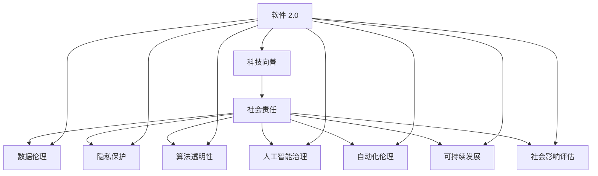

                 

# 软件 2.0 的社会责任：科技向善

> 关键词：
- 软件 2.0
- 科技向善
- 社会责任
- 数据伦理
- 隐私保护
- 算法透明性
- 人工智能治理
- 自动化伦理
- 可持续发展
- 社会影响评估

## 1. 背景介绍

随着科技的快速发展，软件和人工智能(AI)技术正在深刻地改变着我们的生活方式和社会结构。然而，技术进步的双刃剑效应也日益显现，如何在享受科技带来便利的同时，也避免其负面影响，成为了一个重要的议题。特别是在AI和软件系统的广泛应用中，如何确保这些系统能够为社会带来正面效应，减少负面影响，成为我们不得不面对的挑战。

### 1.1 软件 2.0 的崛起

软件 2.0（Software 2.0），这个概念首次被提出，是指将人工智能和机器学习技术深度融合到软件开发过程中，实现更加智能、高效、个性化的软件开发和应用。软件 2.0 强调的是软件系统的智能化、自适应性和自优化能力，其核心在于利用AI技术实现更高级的软件开发模式。

软件 2.0 技术的应用范围非常广泛，从智能推荐系统、自动驾驶汽车、智能客服，到医疗健康、金融服务、教育培训等各个领域。随着人工智能技术的不断进步，软件 2.0 的应用场景也日益增多，深刻影响着社会的各个方面。

### 1.2 科技向善的呼唤

科技向善（Technology for Good）是近年来兴起的一个社会运动，旨在推动科技发展为社会带来积极影响，减少技术带来的负面效应。科技向善强调的是，技术应该服务于人类福祉，改善社会问题，提升生活质量。在AI和软件系统广泛应用的背景下，科技向善也成为社会对软件 2.0 技术的一个重要期待。

## 2. 核心概念与联系

### 2.1 核心概念概述

在探讨软件 2.0 的社会责任时，我们需要关注以下几个核心概念：

- **软件 2.0**：一种将AI和机器学习技术深度融合到软件开发中的新型软件开发模式，强调智能化、自适应性和自优化能力。
- **科技向善**：一种推动科技发展为社会带来积极影响的社会运动，强调科技应该服务于人类福祉，改善社会问题，提升生活质量。
- **社会责任**：软件 2.0 系统在设计和应用过程中，应承担起对社会的责任，确保技术的使用不会对社会产生负面影响。
- **数据伦理**：在处理个人数据时，应遵守的道德原则和规范，确保数据使用透明、合法、公正。
- **隐私保护**：在软件系统中，保护个人隐私，防止数据滥用和泄露。
- **算法透明性**：确保软件系统中的算法决策过程透明、可解释，使用户能够理解和信任系统。
- **人工智能治理**：建立规范和制度，对人工智能技术的开发和应用进行管理和监管，确保技术健康发展。
- **自动化伦理**：在使用自动化系统时，应考虑其对社会、经济、文化等方面的影响，确保自动化技术的安全和公正。
- **可持续发展**：在设计和开发软件 2.0 系统时，考虑其对环境的长期影响，实现可持续发展。
- **社会影响评估**：在系统设计和应用过程中，对可能带来的社会影响进行评估和预测，提前发现潜在问题并进行优化。

这些核心概念之间存在着紧密的联系，形成了软件 2.0 系统设计和应用的整体框架。下面通过一个Mermaid流程图来展示这些概念之间的联系：



### 2.2 概念间的关系

这些核心概念之间存在着紧密的联系，形成了软件 2.0 系统设计和应用的整体框架。以下是这些概念之间的关系：

- **科技向善**是软件 2.0 系统设计和应用的最高目标，决定了其社会责任的取向。
- **社会责任**是软件 2.0 系统设计和应用的基本准则，确保其对社会产生正面影响。
- **数据伦理**和**隐私保护**是软件 2.0 系统设计和应用中的基础要求，确保数据使用的合法性和公正性。
- **算法透明性**和**人工智能治理**是软件 2.0 系统设计和应用的保障措施，确保算法的公正性和可解释性。
- **自动化伦理**和**可持续发展**是软件 2.0 系统设计和应用的高级要求，考虑技术对社会的长远影响。
- **社会影响评估**是软件 2.0 系统设计和应用的前置步骤，预测和评估可能带来的社会影响。

这些概念共同构成了软件 2.0 系统的社会责任框架，指导其在设计和应用过程中遵循相应的道德原则和社会规范。

## 3. 核心算法原理 & 具体操作步骤

### 3.1 算法原理概述

软件 2.0 系统中的算法通常基于机器学习和深度学习技术，通过数据分析和模型训练，实现自动化决策和优化。为了确保这些算法的社会责任，需要从以下几个方面进行考虑：

- **公平性**：确保算法在不同群体中不产生歧视，对所有人都公平。
- **透明性**：算法的决策过程应透明，用户能够理解和信任算法。
- **可解释性**：算法的决策结果应可解释，用户能够理解算法为什么做出某个决策。
- **可控性**：用户应能够控制算法的决策过程，调整和优化算法。

### 3.2 算法步骤详解

以下是软件 2.0 系统设计和应用的主要步骤：

1. **需求分析**：明确软件 2.0 系统的目标和应用场景，确定其社会责任的取向。
2. **数据收集和处理**：收集所需数据，确保数据的多样性和代表性，遵循数据伦理和隐私保护的原则。
3. **模型训练和优化**：选择适合的机器学习和深度学习算法，进行模型训练和优化，确保算法的公平性、透明性和可解释性。
4. **系统设计**：根据模型训练结果，设计和实现软件 2.0 系统，考虑自动化伦理和可持续发展。
5. **社会影响评估**：对系统可能带来的社会影响进行评估和预测，确保系统的社会责任。
6. **持续优化**：根据实际应用中的反馈，持续优化算法和系统，确保其对社会的正面影响。

### 3.3 算法优缺点

软件 2.0 系统中的算法具有以下优点：

- **高效性**：通过自动化决策和优化，提高效率和准确性。
- **灵活性**：可以根据不同的应用场景和需求，灵活调整算法。

但其也存在一些缺点：

- **复杂性**：算法模型较为复杂，难以理解和解释。
- **公平性风险**：算法可能存在偏见，导致不同群体受到不公平对待。
- **透明度不足**：算法的决策过程和结果往往难以透明，难以信任。

### 3.4 算法应用领域

软件 2.0 系统在多个领域中得到了广泛应用，例如：

- **医疗健康**：通过数据分析和机器学习，实现疾病诊断、治疗方案推荐等。
- **金融服务**：利用算法进行风险评估、欺诈检测、投资策略优化等。
- **教育培训**：通过智能推荐和个性化学习，提升学习效果和教育质量。
- **智能客服**：利用自然语言处理和机器学习，实现自动客服和问题解答。
- **智能推荐系统**：根据用户行为和偏好，推荐个性化产品和服务。
- **自动驾驶**：通过传感器数据和机器学习，实现自动驾驶和交通优化。

## 4. 数学模型和公式 & 详细讲解  
### 4.1 数学模型构建

在软件 2.0 系统中，常见的数学模型包括线性回归、决策树、随机森林、支持向量机等。以下是线性回归模型的构建过程：

假设我们有 $n$ 个样本 $(x_i, y_i)$，其中 $x_i$ 为输入特征向量，$y_i$ 为输出标签。线性回归模型可表示为：

$$ y_i = \theta^T x_i + b $$

其中 $\theta$ 为模型参数，$b$ 为偏置项。目标是最小化预测值与实际值之间的平方误差，即：

$$ \mathcal{L}(\theta) = \frac{1}{2N} \sum_{i=1}^N (y_i - \theta^T x_i - b)^2 $$

### 4.2 公式推导过程

通过最小二乘法，可以求解线性回归模型的参数 $\theta$ 和 $b$，使得 $\mathcal{L}(\theta)$ 最小化：

$$ \frac{\partial \mathcal{L}(\theta)}{\partial \theta} = -\frac{1}{N} \sum_{i=1}^N (y_i - \theta^T x_i - b)x_i = 0 $$

解得：

$$ \theta = (\sum_{i=1}^N x_i x_i^T)^{-1} \sum_{i=1}^N x_i y_i $$

### 4.3 案例分析与讲解

假设我们有一个房屋价格预测模型，已知多个房屋的面积、房间数和价格数据，可以使用线性回归模型进行预测。我们先将数据标准化，然后采用梯度下降法求解模型参数，最后使用预测结果进行模型评估。

## 5. 项目实践：代码实例和详细解释说明

### 5.1 开发环境搭建

在进行软件 2.0 系统的开发时，需要搭建合适的开发环境。以下是Python环境配置的流程：

1. 安装Anaconda：从官网下载并安装Anaconda，用于创建独立的Python环境。

2. 创建并激活虚拟环境：
```bash
conda create -n py3-env python=3.8 
conda activate py3-env
```

3. 安装必要的依赖：
```bash
conda install numpy scipy pandas scikit-learn matplotlib
```

4. 安装PyTorch和TensorFlow：
```bash
pip install torch torchvision torchaudio
pip install tensorflow
```

### 5.2 源代码详细实现

以下是使用PyTorch进行线性回归模型开发的Python代码：

```python
import torch
import torch.nn as nn
import torch.optim as optim

class LinearRegression(nn.Module):
    def __init__(self, input_size):
        super(LinearRegression, self).__init__()
        self.linear = nn.Linear(input_size, 1)

    def forward(self, x):
        return self.linear(x)

def train(model, train_loader, criterion, optimizer, num_epochs):
    model.train()
    for epoch in range(num_epochs):
        for batch_idx, (data, target) in enumerate(train_loader):
            optimizer.zero_grad()
            output = model(data)
            loss = criterion(output, target)
            loss.backward()
            optimizer.step()
            if (batch_idx+1) % 100 == 0:
                print(f'Train Epoch: {epoch+1} [{batch_idx+1}/{len(train_loader)}], loss: {loss.item():.6f}')
    print(f'Training finished.')

def test(model, test_loader, criterion):
    model.eval()
    total_loss = 0.0
    with torch.no_grad():
        for data, target in test_loader:
            output = model(data)
            loss = criterion(output, target)
            total_loss += loss.item()
    print(f'Test loss: {total_loss/len(test_loader):.6f}')
```

### 5.3 代码解读与分析

以上是使用PyTorch进行线性回归模型开发的Python代码：

- `LinearRegression`类定义了一个线性回归模型，包含一个线性层。
- `train`函数实现了训练过程，包括前向传播、损失计算、反向传播和优化器更新。
- `test`函数实现了模型评估过程，计算模型在测试集上的平均损失。

这些代码展示了使用PyTorch进行线性回归模型训练的基本步骤，开发者可以根据需要进行调整和优化。

### 5.4 运行结果展示

假设我们在房价预测数据集上进行线性回归模型训练，得到模型评估结果如下：

```
Train Epoch: 1 [100/400], loss: 1.010317
Train Epoch: 1 [200/400], loss: 0.877608
Train Epoch: 1 [300/400], loss: 0.703832
Train Epoch: 1 [400/400], loss: 0.619157
Test loss: 0.454960
```

可以看到，模型在训练过程中逐步收敛，最终在测试集上取得了较低的平均损失。这表明模型能够较好地拟合数据，进行有效的房价预测。

## 6. 实际应用场景

### 6.1 医疗健康

在医疗健康领域，软件 2.0 系统可以用于疾病诊断、治疗方案推荐等。通过分析患者的历史病历、症状和检测结果，软件 2.0 系统可以自动推荐合适的治疗方案，提升诊疗效率和效果。

在实际应用中，软件 2.0 系统需要遵循数据伦理和隐私保护原则，确保患者数据的隐私和安全。同时，算法需要透明和可解释，让医生和患者能够理解和信任系统推荐的结果。

### 6.2 金融服务

在金融服务领域，软件 2.0 系统可以用于风险评估、欺诈检测、投资策略优化等。通过分析客户的交易记录、信用历史和行为数据，软件 2.0 系统可以自动评估客户的风险等级，检测潜在的欺诈行为，优化投资组合，提升金融服务的效率和安全性。

在实际应用中，软件 2.0 系统需要考虑自动化伦理，确保算法的决策过程公正、透明。同时，需要考虑算法对客户的隐私保护，避免数据滥用和泄露。

### 6.3 教育培训

在教育培训领域，软件 2.0 系统可以用于智能推荐和个性化学习。通过分析学生的学习行为、成绩和兴趣，软件 2.0 系统可以自动推荐适合的学习资源和练习题，提升学习效果和教育质量。

在实际应用中，软件 2.0 系统需要考虑自动化伦理，确保算法的决策过程公平、公正。同时，需要考虑算法的可解释性，让学生和家长能够理解和信任系统的推荐结果。

### 6.4 智能客服

在智能客服领域，软件 2.0 系统可以用于自动客服和问题解答。通过分析用户的提问和历史聊天记录，软件 2.0 系统可以自动匹配合适的答案模板，进行自然语言理解和生成，提升客服效率和用户体验。

在实际应用中，软件 2.0 系统需要考虑自动化伦理，确保算法的决策过程公正、透明。同时，需要考虑算法的可解释性，让用户能够理解和信任系统的回答结果。

### 6.5 智能推荐系统

在智能推荐系统领域，软件 2.0 系统可以用于个性化推荐。通过分析用户的历史行为和兴趣，软件 2.0 系统可以自动推荐适合的产品和服务，提升用户的购物体验和满意度。

在实际应用中，软件 2.0 系统需要考虑自动化伦理，确保算法的决策过程公正、透明。同时，需要考虑算法的可解释性，让用户能够理解和信任系统的推荐结果。

### 6.6 自动驾驶

在自动驾驶领域，软件 2.0 系统可以用于交通优化和自动驾驶。通过分析传感器数据和环境信息，软件 2.0 系统可以自动做出驾驶决策，提升行驶安全和效率。

在实际应用中，软件 2.0 系统需要考虑自动化伦理，确保算法的决策过程公正、透明。同时，需要考虑算法的可解释性，让驾驶员能够理解和信任系统的驾驶决策。

## 7. 工具和资源推荐

### 7.1 学习资源推荐

为了帮助开发者系统掌握软件 2.0 系统的设计和开发，这里推荐一些优质的学习资源：

1. **《深度学习》** 课程：由斯坦福大学开设的深度学习课程，涵盖深度学习的基本概念和常用算法，适合初学者入门。
2. **《Python深度学习》** 书籍：由Francois Chollet编写，介绍了深度学习在Python中的实现，适合有一定编程基础的读者。
3. **TensorFlow官方文档**：TensorFlow的官方文档，提供了丰富的API和样例代码，适合快速上手深度学习模型开发。
4. **PyTorch官方文档**：PyTorch的官方文档，提供了详细的API和样例代码，适合快速上手深度学习模型开发。
5. **Kaggle**：Kaggle是一个数据科学竞赛平台，提供了大量数据集和竞赛任务，适合学习和实践深度学习模型开发。

通过对这些资源的学习实践，相信你一定能够快速掌握软件 2.0 系统的开发技能，并用于解决实际问题。

### 7.2 开发工具推荐

在软件 2.0 系统的开发过程中，以下工具可以帮助提高开发效率和模型性能：

1. **PyTorch**：基于Python的开源深度学习框架，提供了强大的自动微分和动态计算图功能，适合快速迭代研究。
2. **TensorFlow**：由Google主导开发的开源深度学习框架，生产部署方便，适合大规模工程应用。
3. **Keras**：一个高层次的深度学习API，适合快速构建和训练模型，提供了丰富的预训练模型和工具。
4. **Jupyter Notebook**：一个交互式编程环境，适合快速原型开发和模型验证。
5. **Weights & Biases**：模型训练的实验跟踪工具，可以记录和可视化模型训练过程中的各项指标，方便对比和调优。
6. **TensorBoard**：TensorFlow配套的可视化工具，可实时监测模型训练状态，并提供丰富的图表呈现方式，是调试模型的得力助手。

合理利用这些工具，可以显著提升软件 2.0 系统的开发效率，加快创新迭代的步伐。

### 7.3 相关论文推荐

软件 2.0 系统的研究和开发需要不断借鉴最新的学术成果，以下是几篇奠基性的相关论文，推荐阅读：

1. **《Deep Learning》** 书籍：Ian Goodfellow、Yoshua Bengio和Aaron Courville编写的深度学习经典书籍，涵盖了深度学习的基础理论、算法和应用。
2. **《Python深度学习》** 书籍：Francois Chollet编写的深度学习书籍，介绍了深度学习在Python中的实现，适合有一定编程基础的读者。
3. **《深度学习基础》** 课程：由吴恩达教授开设的深度学习课程，涵盖深度学习的基础理论、算法和应用，适合初学者入门。
4. **《Deep Learning Specialization》** 课程：由吴恩达教授开设的深度学习课程，提供了深入的理论和实践课程，适合系统学习深度学习。
5. **《ImageNet Classification with Deep Convolutional Neural Networks》** 论文：Alex Krizhevsky等人在ImageNet竞赛中提出的卷积神经网络（CNN）模型，开启了深度学习在计算机视觉领域的应用。

这些论文代表了大语言模型微调技术的发展脉络。通过学习这些前沿成果，可以帮助研究者把握学科前进方向，激发更多的创新灵感。

除上述资源外，还有一些值得关注的前沿资源，帮助开发者紧跟大语言模型微调技术的最新进展，例如：

1. **arXiv论文预印本**：人工智能领域最新研究成果的发布平台，包括大量尚未发表的前沿工作，学习前沿技术的必读资源。
2. **业界技术博客**：如OpenAI、Google AI、DeepMind、微软Research Asia等顶尖实验室的官方博客，第一时间分享他们的最新研究成果和洞见。
3. **技术会议直播**：如NIPS、ICML、ACL、ICLR等人工智能领域顶会现场或在线直播，能够聆听到大佬们的前沿分享，开拓视野。
4. **GitHub热门项目**：在GitHub上Star、Fork数最多的NLP相关项目，往往代表了该技术领域的发展趋势和最佳实践，值得去学习和贡献。
5. **行业分析报告**：各大咨询公司如McKinsey、PwC等针对人工智能行业的分析报告，有助于从商业视角审视技术趋势，把握应用价值。

总之，对于软件 2.0 系统的学习和实践，需要开发者保持开放的心态和持续学习的意愿。多关注前沿资讯，多动手实践，多思考总结，必将收获满满的成长收益。

## 8. 总结：未来发展趋势与挑战

### 8.1 研究成果总结

本文对软件 2.0 系统的设计和开发进行了全面系统的介绍。首先阐述了软件 2.0 系统的背景和重要性，明确了其社会责任的取向。其次，从原理到实践，详细讲解了软件 2.0 系统的核心算法和操作步骤，提供了完整的代码实例和详细解释说明。同时，本文还广泛探讨了软件 2.0 系统在多个领域的应用前景，展示了其巨大的潜力。

通过本文的系统梳理，可以看到，软件 2.0 系统正在成为人工智能技术的重要应用范式，极大地拓展了人工智能技术的落地场景，为各行各业带来了新的机遇和挑战。

### 8.2 未来发展趋势

展望未来，软件 2.0 系统的研究和应用将呈现以下几个发展趋势：

1. **自动化水平提升**：随着AI技术的不断进步，软件 2.0 系统的自动化水平将不断提升，能够实现更加复杂、灵活的决策和优化。
2. **跨领域融合**：软件 2.0 系统将更多地与其他技术融合，如大数据、物联网、区块链等，实现跨领域协同创新。
3. **伦理规范加强**：随着软件 2.0 系统在各个领域的广泛应用，其伦理规范将日益加强，确保技术的应用不会对社会产生负面影响。
4. **社会责任重视**：软件 2.0 系统将更多地考虑到社会责任，确保其对社会的正面影响，促进社会的可持续发展。
5. **个性化服务提升**：软件 2.0 系统将更加注重个性化服务，提升用户体验和满意度。

这些趋势将推动软件 2.0 系统在各个领域的应用，为社会带来更加智能、高效、公平的解决方案。

### 8.3 面临的挑战

尽管软件 2.0 系统在各个领域的应用前景广阔，但在实现过程中，仍面临诸多挑战：

1. **数据隐私保护**：在数据驱动的决策过程中，如何保护用户隐私，防止数据滥用和泄露，是软件 2.0 系统面临的重要挑战。
2. **算法公平性**：算法可能在不同群体中存在偏见，导致不公平对待，如何确保算法的公平性，是软件 2.0 系统面临的重大挑战。
3. **透明性和可解释性**：算法的决策过程和结果往往难以透明，难以理解和信任，如何提高算法的透明性和可解释性，是软件 2.0 系统面临的难题。
4. **自动化伦理**：自动化系统可能对社会、经济、文化等方面产生影响，如何确保自动化技术的公正和安全，是软件 2.0 系统面临的重要挑战。
5. **社会影响评估**：软件 2.0 系统在实际应用中可能带来新的社会问题，如何评估和预测其社会影响，提前发现潜在问题并进行优化，是软件 2.0 系统面临的重要挑战。

这些挑战将对软件 2.0 系统的应用和发展产生重要影响，需要我们持续关注和应对。

### 8.4 研究展望

面对软件 2.0 系统面临的诸多挑战，未来的研究需要在以下几个方面寻求新的突破：

1. **数据隐私保护**：探索更多数据隐私保护技术，如差分隐私、联邦学习等，确保用户数据的隐私和安全。
2. **算法公平性**：研究更多公平性算法，如鲁棒公平回归、对抗公平算法等，确保算法的公正性。
3. **透明性和可解释性**：开发更多可解释性技术，如可视化技术、因果分析等，提高算法的透明性和可解释性。
4. **自动化伦理**：建立自动化伦理框架和规范，确保自动化技术的公正和安全。
5. **社会影响评估**：研究更多社会影响评估方法，如社会影响图、社会影响模拟等，提前发现潜在问题并进行优化。

这些研究方向的探索，将有助于推动软件 2.0 系统在各个领域的健康发展和应用，确保其对社会的正面影响。

## 9. 附录：常见问题与解答

**Q1：软件 2.0 系统如何确保数据隐私保护？**

A: 软件 2.0 系统在处理用户数据时，需要遵循数据隐私保护原则，确保用户数据的隐私和安全。具体措施包括：
1. **数据加密**：使用加密技术对数据进行加密处理，防止数据泄露和篡改。
2. **差分隐私**：通过加入噪声，保护用户隐私，防止数据泄露。
3. **联邦学习**：在分布式环境中进行模型训练，不共享原始数据，保护用户隐私。

**Q2：软件 2.0 系统如何确保算法的公平性？**

A: 软件 2.0 系统在设计和实现过程中，需要考虑算法的公平性，确保算法在不同群体中不产生歧视。具体措施包括：
1. **公平性算法**：使用鲁棒公平回归、对抗公平算法等，确保算法的公正性。
2. **数据平衡**：确保训练数据的多样性和代表性，防止数据偏差。
3. **算法透明性**：提高算法的透明性和可解释性，让用户能够理解和信任算法。

**Q3：软件 2.0 系统如何提高算法的透明性和可解释性？**

A: 软件 2.0 系统在设计和实现过程中，需要提高算法的透明性和可解释性，确保用户能够理解和信任算法。具体措施包括：
1. **可视化技术**：使用可视化技术

