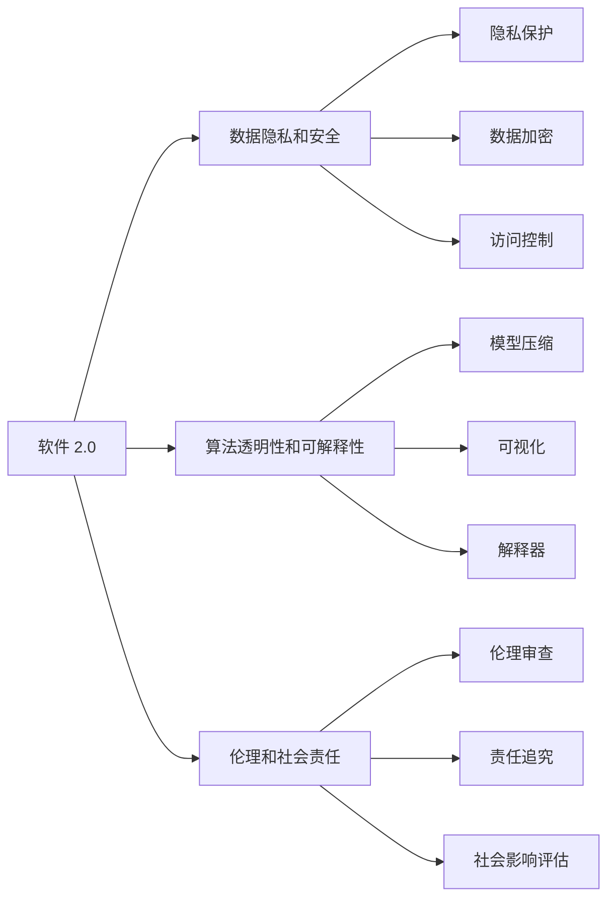

                 

# 软件 2.0 的社会责任：科技向善

在信息化时代，软件技术的发展已经深刻影响了人类的生产生活方式。从早期的机械编程到智能算法，软件技术不断突破创新，带来了前所未有的便利和效率。然而，软件技术的飞速发展也引发了一系列社会伦理、数据隐私和安全等问题，需要我们以更加审慎和负责任的态度去应对。本文将探讨软件 2.0 时代的技术社会责任，探讨如何在科技发展的浪潮中实现“科技向善”。

## 1. 背景介绍

### 1.1 软件技术的发展历史
软件技术的发展经历了几次重要的变革，每一次都带来了深远的影响。早期的人工智能时代，基于规则的专家系统风靡一时，但存在知识获取困难、扩展性差等问题。随后，面向对象的编程范式兴起，提高了软件的复用性和可维护性，但仍然难以处理复杂的系统结构。

进入21世纪，随着数据和计算资源的激增，机器学习和大数据分析技术蓬勃发展，推动了“软件 2.0”时代的到来。这一时代的特点是软件不再以“人”为中心，而是以“数据”为中心。软件系统能够自动地学习、适应和演化，成为人类与机器互动的桥梁。软件 2.0 时代的典型应用包括自然语言处理、计算机视觉、语音识别等。

### 1.2 软件 2.0 的挑战
尽管软件 2.0 带来了巨大的变革，但也面临着诸多挑战。首先是数据隐私和安全问题，如何在保护隐私的同时进行数据挖掘和分析，是一个复杂的难题。其次是算法透明性和可解释性，如何在保障数据安全和隐私的前提下，提高算法的透明性和可解释性，是一个重要的研究方向。最后是伦理和责任问题，如何确保软件系统的决策过程公平、公正、透明，是一个需要深入探讨的课题。

## 2. 核心概念与联系

### 2.1 核心概念概述

为了更好地理解软件 2.0 的社会责任，本节将介绍几个密切相关的核心概念：

- **软件 2.0**：指基于大数据和深度学习技术的自动化、自适应软件系统。与传统的软件 1.0（以人为中心的软件）不同，软件 2.0 更加依赖于数据和算法，能够自我学习和适应，提高系统的灵活性和智能性。

- **数据隐私和安全**：指在软件系统中保护用户数据的安全性和隐私性，防止数据泄露和滥用。涉及隐私保护、数据加密、访问控制等技术。

- **算法透明性和可解释性**：指在软件系统中保证算法的决策过程透明和可解释，让用户能够理解和信任系统的输出。涉及模型压缩、可视化、解释器等技术。

- **伦理和社会责任**：指软件系统在设计和应用过程中，应当遵循的伦理准则和社会责任，确保软件系统的决策和行为符合社会公正、公平和人道主义。涉及伦理审查、责任追究、社会影响评估等机制。

这些核心概念之间存在着紧密的联系，形成了一个整体的软件 2.0 社会责任框架。通过理解这些核心概念，我们可以更好地把握软件 2.0 技术的应用原则和伦理导向。

### 2.2 概念间的关系

这些核心概念之间存在着密切的联系，形成了软件 2.0 社会责任的整体框架。下面我通过几个Mermaid流程图来展示这些概念之间的关系：



这个流程图展示了软件 2.0 技术在应用过程中，如何涉及数据隐私、算法透明性和伦理责任等关键问题。数据隐私和安全是软件 2.0 应用的基础，算法透明性和可解释性是提升用户信任度的关键，而伦理和社会责任则是确保软件系统符合社会价值观的根本。

## 3. 核心算法原理 & 具体操作步骤

### 3.1 算法原理概述

软件 2.0 的核心算法主要包括机器学习和深度学习，其原理是通过大量数据训练模型，使其能够自动学习和适应新的数据。软件 2.0 系统通常包括以下步骤：

1. **数据收集和预处理**：从不同的数据源收集数据，进行清洗、去重、归一化等预处理，以提高数据质量。
2. **模型训练**：使用机器学习或深度学习算法训练模型，优化模型参数，使其能够准确预测或分类数据。
3. **模型部署**：将训练好的模型部署到实际应用中，进行预测或分类。
4. **监控和更新**：监控模型性能，根据新数据进行模型更新，以适应数据分布的变化。

### 3.2 算法步骤详解

以下是软件 2.0 系统实现的基本步骤：

1. **数据收集和预处理**
   - 从不同的数据源（如社交媒体、电商平台、医疗系统等）收集数据。
   - 进行数据清洗，去除噪声、缺失值等，保证数据质量。
   - 进行数据归一化、标准化等预处理，以便于后续建模。

2. **模型训练**
   - 选择合适的算法和模型结构，如随机森林、神经网络等。
   - 使用训练数据对模型进行训练，优化模型参数，使其能够准确预测或分类数据。
   - 使用验证数据评估模型性能，调整模型参数，防止过拟合。

3. **模型部署**
   - 将训练好的模型部署到实际应用中，如网站、移动应用等。
   - 提供API接口，供外部系统调用。
   - 实时监控模型性能，确保模型稳定运行。

4. **监控和更新**
   - 定期收集新数据，评估模型性能。
   - 根据新数据更新模型，保持模型的准确性和鲁棒性。
   - 引入持续学习和增量学习技术，使模型能够不断适应数据变化。

### 3.3 算法优缺点

软件 2.0 算法的优点包括：

- **高效性**：通过自动化学习和优化，提高了数据处理和模型训练的效率。
- **灵活性**：能够根据新数据进行模型更新，适应数据分布的变化。
- **智能性**：通过深度学习等技术，提升了系统的智能化水平。

缺点包括：

- **数据隐私和安全**：大规模数据收集和处理可能涉及隐私泄露和数据滥用问题。
- **算法透明性和可解释性**：复杂的模型难以解释其决策过程，用户难以信任。
- **伦理和社会责任**：算法的决策过程可能存在偏见和歧视，需要更多的伦理约束。

### 3.4 算法应用领域

软件 2.0 算法广泛应用于多个领域，如自然语言处理、计算机视觉、金融科技等。以下是几个典型的应用场景：

- **自然语言处理**：使用机器学习和深度学习算法，对文本进行情感分析、实体识别、机器翻译等。
- **计算机视觉**：使用深度学习算法，对图像进行分类、检测、分割等。
- **金融科技**：使用机器学习算法，进行信用评估、风险预测、欺诈检测等。

## 4. 数学模型和公式 & 详细讲解 & 举例说明

### 4.1 数学模型构建

软件 2.0 算法的核心模型通常基于机器学习或深度学习，其数学模型可以表示为：

$$ y = f(x; \theta) $$

其中，$y$ 为输出结果，$x$ 为输入数据，$\theta$ 为模型参数。常用的模型包括线性回归、逻辑回归、支持向量机、神经网络等。

### 4.2 公式推导过程

以线性回归模型为例，其目标是最小化预测值与真实值之间的误差平方和。数学表达式为：

$$ \min_{\theta} \sum_{i=1}^n (y_i - f(x_i; \theta))^2 $$

其中，$y_i$ 为真实值，$f(x_i; \theta)$ 为预测值。通过求偏导数，可以得到模型参数的更新公式：

$$ \theta = (X^TX)^{-1}X^Ty $$

其中，$X$ 为输入数据的特征矩阵，$y$ 为真实值向量。

### 4.3 案例分析与讲解

以情感分析为例，可以使用朴素贝叶斯分类器进行模型构建。假设有一个情感标注数据集，包含评论和其情感标签。可以使用朴素贝叶斯分类器训练模型，对新的评论进行情感分类。具体步骤如下：

1. 收集评论数据集，进行文本预处理。
2. 将文本转化为特征向量，如词袋模型、TF-IDF等。
3. 使用朴素贝叶斯算法训练模型，得到模型参数。
4. 使用训练好的模型对新的评论进行情感分类，得到预测结果。

## 5. 项目实践：代码实例和详细解释说明

### 5.1 开发环境搭建

在进行软件 2.0 项目的开发前，我们需要准备好开发环境。以下是使用Python进行PyTorch开发的环境配置流程：

1. 安装Anaconda：从官网下载并安装Anaconda，用于创建独立的Python环境。

2. 创建并激活虚拟环境：
```bash
conda create -n pytorch-env python=3.8 
conda activate pytorch-env
```

3. 安装PyTorch：根据CUDA版本，从官网获取对应的安装命令。例如：
```bash
conda install pytorch torchvision torchaudio cudatoolkit=11.1 -c pytorch -c conda-forge
```

4. 安装各类工具包：
```bash
pip install numpy pandas scikit-learn matplotlib tqdm jupyter notebook ipython
```

完成上述步骤后，即可在`pytorch-env`环境中开始项目实践。

### 5.2 源代码详细实现

这里我们以情感分析项目为例，给出使用PyTorch进行情感分析的代码实现。

首先，定义情感分析任务的输入数据处理函数：

```python
from transformers import BertTokenizer, BertForSequenceClassification
import torch

def process_data(texts, labels):
    tokenizer = BertTokenizer.from_pretrained('bert-base-uncased')
    inputs = tokenizer(texts, return_tensors='pt', padding=True, truncation=True)
    labels = torch.tensor(labels, dtype=torch.long)
    return inputs, labels

# 准备情感分析数据
train_texts, train_labels = load_train_data()
dev_texts, dev_labels = load_dev_data()
test_texts, test_labels = load_test_data()

# 处理数据
train_inputs, train_labels = process_data(train_texts, train_labels)
dev_inputs, dev_labels = process_data(dev_texts, dev_labels)
test_inputs, test_labels = process_data(test_texts, test_labels)
```

然后，定义模型和优化器：

```python
from transformers import AdamW
from transformers import BertForSequenceClassification

model = BertForSequenceClassification.from_pretrained('bert-base-uncased', num_labels=2)
optimizer = AdamW(model.parameters(), lr=2e-5)
```

接着，定义训练和评估函数：

```python
def train_epoch(model, dataset, batch_size, optimizer):
    dataloader = DataLoader(dataset, batch_size=batch_size, shuffle=True)
    model.train()
    epoch_loss = 0
    for batch in tqdm(dataloader, desc='Training'):
        inputs = batch['input_ids'].to(device)
        attention_mask = batch['attention_mask'].to(device)
        labels = batch['labels'].to(device)
        model.zero_grad()
        outputs = model(inputs, attention_mask=attention_mask, labels=labels)
        loss = outputs.loss
        epoch_loss += loss.item()
        loss.backward()
        optimizer.step()
    return epoch_loss / len(dataloader)

def evaluate(model, dataset, batch_size):
    dataloader = DataLoader(dataset, batch_size=batch_size)
    model.eval()
    preds, labels = [], []
    with torch.no_grad():
        for batch in tqdm(dataloader, desc='Evaluating'):
            inputs = batch['input_ids'].to(device)
            attention_mask = batch['attention_mask'].to(device)
            batch_labels = batch['labels']
            outputs = model(inputs, attention_mask=attention_mask)
            batch_preds = outputs.logits.argmax(dim=1).to('cpu').tolist()
            batch_labels = batch_labels.to('cpu').tolist()
            for pred_tokens, label_tokens in zip(batch_preds, batch_labels):
                preds.append(pred_tokens)
                labels.append(label_tokens)
                
    print(classification_report(labels, preds))
```

最后，启动训练流程并在测试集上评估：

```python
epochs = 5
batch_size = 16

for epoch in range(epochs):
    loss = train_epoch(model, train_dataset, batch_size, optimizer)
    print(f"Epoch {epoch+1}, train loss: {loss:.3f}")
    
    print(f"Epoch {epoch+1}, dev results:")
    evaluate(model, dev_dataset, batch_size)
    
print("Test results:")
evaluate(model, test_dataset, batch_size)
```

以上就是使用PyTorch对情感分析模型进行训练的完整代码实现。可以看到，借助预训练模型和高效工具库，项目开发变得更加便捷高效。

### 5.3 代码解读与分析

让我们再详细解读一下关键代码的实现细节：

**process_data函数**：
- 定义了数据预处理函数，使用BertTokenizer对文本进行分词和编码，并将标签转化为张量。

**train_epoch函数**：
- 定义了训练函数，使用DataLoader对数据进行批次化加载，在前向传播中计算损失并反向传播更新模型参数。

**evaluate函数**：
- 定义了评估函数，不更新模型参数，在每个批次结束后将预测和标签结果存储下来，最后使用classification_report对整个评估集的预测结果进行打印输出。

**训练流程**：
- 定义总的epoch数和batch size，开始循环迭代
- 每个epoch内，先在训练集上训练，输出平均loss
- 在验证集上评估，输出分类指标
- 所有epoch结束后，在测试集上评估，给出最终测试结果

可以看到，PyTorch配合Bert等预训练模型的封装，使得情感分析模型的开发变得更加高效。开发者可以更多地关注模型的核心算法和业务逻辑，而不必过多关注底层的实现细节。

## 6. 实际应用场景

### 6.1 智能客服系统

智能客服系统是软件 2.0 技术的一个重要应用场景。传统的客服系统需要大量人工处理客户咨询，高峰期响应速度慢，且难以保证服务质量。而基于软件 2.0 技术的智能客服系统，可以24小时不间断服务，快速响应客户咨询，用自然流畅的语言解答各类常见问题。

在技术实现上，可以收集企业内部的历史客服对话记录，将问题和最佳答复构建成监督数据，在此基础上对预训练模型进行微调。微调后的模型能够自动理解用户意图，匹配最合适的答案模板进行回复。对于客户提出的新问题，还可以接入检索系统实时搜索相关内容，动态组织生成回答。如此构建的智能客服系统，能大幅提升客户咨询体验和问题解决效率。

### 6.2 金融舆情监测

金融机构需要实时监测市场舆论动向，以便及时应对负面信息传播，规避金融风险。传统的人工监测方式成本高、效率低，难以应对网络时代海量信息爆发的挑战。基于软件 2.0 技术的文本分类和情感分析技术，为金融舆情监测提供了新的解决方案。

具体而言，可以收集金融领域相关的新闻、报道、评论等文本数据，并对其进行主题标注和情感标注。在此基础上对预训练语言模型进行微调，使其能够自动判断文本属于何种主题，情感倾向是正面、中性还是负面。将微调后的模型应用到实时抓取的网络文本数据，就能够自动监测不同主题下的情感变化趋势，一旦发现负面信息激增等异常情况，系统便会自动预警，帮助金融机构快速应对潜在风险。

### 6.3 个性化推荐系统

当前的推荐系统往往只依赖用户的历史行为数据进行物品推荐，无法深入理解用户的真实兴趣偏好。基于软件 2.0 技术的个性化推荐系统，可以更好地挖掘用户行为背后的语义信息，从而提供更精准、多样的推荐内容。

在实践中，可以收集用户浏览、点击、评论、分享等行为数据，提取和用户交互的物品标题、描述、标签等文本内容。将文本内容作为模型输入，用户的后续行为（如是否点击、购买等）作为监督信号，在此基础上微调预训练语言模型。微调后的模型能够从文本内容中准确把握用户的兴趣点。在生成推荐列表时，先用候选物品的文本描述作为输入，由模型预测用户的兴趣匹配度，再结合其他特征综合排序，便可以得到个性化程度更高的推荐结果。

### 6.4 未来应用展望

随着软件 2.0 技术的发展，其应用场景将更加广泛和深入。未来，软件 2.0 技术将在更多领域得到应用，为各行各业带来变革性影响。

在智慧医疗领域，基于软件 2.0 的医疗问答、病历分析、药物研发等应用将提升医疗服务的智能化水平，辅助医生诊疗，加速新药开发进程。

在智能教育领域，软件 2.0 技术可应用于作业批改、学情分析、知识推荐等方面，因材施教，促进教育公平，提高教学质量。

在智慧城市治理中，软件 2.0 技术可应用于城市事件监测、舆情分析、应急指挥等环节，提高城市管理的自动化和智能化水平，构建更安全、高效的未来城市。

此外，在企业生产、社会治理、文娱传媒等众多领域，基于软件 2.0 的人工智能应用也将不断涌现，为经济社会发展注入新的动力。相信随着技术的日益成熟，软件 2.0 技术将成为推动人工智能落地应用的重要范式，为构建人机协同的智能时代提供新的技术路径。

## 7. 工具和资源推荐

### 7.1 学习资源推荐

为了帮助开发者系统掌握软件 2.0 技术，这里推荐一些优质的学习资源：

1. 《深度学习》课程：斯坦福大学开设的深度学习课程，提供了全面的理论基础和实践案例，是入门深度学习的必备资源。
2. 《Python深度学习》书籍：由Francois Chollet撰写，深入浅出地介绍了如何使用Keras和TensorFlow进行深度学习开发。
3. 《动手学深度学习》：由李沐等人编写，提供了丰富的代码实现和动手实践，是理解深度学习技术的绝佳工具。
4. 《机器学习实战》书籍：由Peter Harrington撰写，提供了丰富的实践案例和代码实现，适合快速上手进行深度学习实践。

通过对这些资源的学习实践，相信你一定能够快速掌握软件 2.0 技术的精髓，并用于解决实际的业务问题。

### 7.2 开发工具推荐

高效的开发离不开优秀的工具支持。以下是几款用于软件 2.0 开发常用的工具：

1. PyTorch：基于Python的开源深度学习框架，灵活高效，适合快速迭代研究。
2. TensorFlow：由Google主导开发的开源深度学习框架，功能强大，适合大规模工程应用。
3. Weights & Biases：模型训练的实验跟踪工具，可以记录和可视化模型训练过程中的各项指标，方便对比和调优。
4. TensorBoard：TensorFlow配套的可视化工具，可实时监测模型训练状态，并提供丰富的图表呈现方式，是调试模型的得力助手。

合理利用这些工具，可以显著提升软件 2.0 项目的开发效率，加快创新迭代的步伐。

### 7.3 相关论文推荐

软件 2.0 技术的发展源于学界的持续研究。以下是几篇奠基性的相关论文，推荐阅读：

1. 《深度学习》：Ian Goodfellow等著作，全面介绍了深度学习的理论基础和实践方法。
2. 《机器学习》：Tom Mitchell等著作，介绍了机器学习的基本概念和算法。
3. 《计算机视觉：模型、学习和推理》：Simon Thangarajah著作，介绍了计算机视觉的基本概念和算法。
4. 《自然语言处理综论》：Daniel Jurafsky等著作，介绍了自然语言处理的基本概念和算法。

这些论文代表了大数据和深度学习技术的发展脉络，是深入理解软件 2.0 技术的必读书籍。

除上述资源外，还有一些值得关注的前沿资源，帮助开发者紧跟软件 2.0 技术的新进展，例如：

1. arXiv论文预印本：人工智能领域最新研究成果的发布平台，包括大量尚未发表的前沿工作，学习前沿技术的必读资源。
2. 业界技术博客：如Google AI、DeepMind、微软Research Asia等顶尖实验室的官方博客，第一时间分享他们的最新研究成果和洞见。
3. 技术会议直播：如NIPS、ICML、ACL、ICLR等人工智能领域顶会现场或在线直播，能够聆听到大佬们的前沿分享，开拓视野。
4. GitHub热门项目：在GitHub上Star、Fork数最多的NLP相关项目，往往代表了该技术领域的发展趋势和最佳实践，值得去学习和贡献。
5. 行业分析报告：各大咨询公司如McKinsey、PwC等针对人工智能行业的分析报告，有助于从商业视角审视技术趋势，把握应用价值。

总之，对于软件 2.0 技术的深入学习和实践，需要开发者保持开放的心态和持续学习的意愿。多关注前沿资讯，多动手实践，多思考总结，必将收获满满的成长收益。

## 8. 总结：未来发展趋势与挑战

### 8.1 总结

本文对软件 2.0 技术及其社会责任进行了全面系统的介绍。首先阐述了软件 2.0 技术的发展历史和主要应用场景，明确了其在提高生产效率和智能化水平方面的独特价值。其次，从原理到实践，详细讲解了软件 2.0 的算法步骤和具体实现，提供了情感分析任务的代码实现。同时，本文还探讨了软件 2.0 技术在实际应用中的伦理和社会责任问题，强调了其“科技向善”的社会责任。

通过本文的系统梳理，可以看到，软件 2.0 技术已经在各行各业得到了广泛应用，大大提升了系统的智能化水平和生产效率。然而，随之而来的数据隐私、算法透明性和伦理责任等问题，也需要我们以更加审慎和负责任的态度去应对。相信随着技术的不断发展，软件 2.0 技术必将在推动社会进步和构建智能时代中扮演越来越重要的角色。

### 8.2 未来发展趋势

展望未来，软件 2.0 技术将呈现以下几个发展趋势：

1. **数据驱动智能化**：软件 2.0 系统将更加依赖于大规模数据和深度学习算法，实现高效、自适应的智能化。
2. **跨领域融合**：软件 2.0 技术将与其他前沿技术如人工智能、区块链、物联网等进行深度融合，推动技术创新。
3. **伦理和社会责任**：软件 2.0 系统将更多考虑伦理和社会责任，确保其决策过程透明、公正、可解释。
4. **人机协同**：软件 2.0 系统将与人类更加紧密协同，提升用户体验和智能化水平。
5. **跨平台融合**：软件 2.0 技术将更加注重跨平台、跨设备的应用，实现无缝协作和无缝体验。

以上趋势凸显了软件 2.0 技术的广阔前景。这些方向的探索发展，必将进一步提升系统的智能化水平，为人类认知智能的进化带来深远影响。

### 8.3 面临的挑战

尽管软件 2.0 技术已经取得了瞩目成就，但在迈向更加智能化、普适化应用的过程中，它仍面临着诸多挑战：

1. **数据隐私和安全**：大规模数据收集和处理可能涉及隐私泄露和数据滥用问题。如何在保护隐私的同时进行数据挖掘和分析，是一个复杂的难题。
2. **算法透明性和可解释性**：复杂的模型难以解释其决策过程，用户难以信任。
3. **伦理和社会责任**：算法的决策过程可能存在偏见和歧视，需要更多的伦理约束。
4. **资源瓶颈**：大规模数据和深度学习模型对计算资源和存储空间的需求巨大，难以在普通硬件上实现高效运行。
5. **模型复杂性**：复杂的模型结构导致训练和推理效率低下，难以在实际应用中大规模部署。

### 8.4 未来突破

面对软件 2.0 技术面临的挑战，未来的研究需要在以下几个方面寻求新的突破：

1. **隐私保护技术**：开发更先进的隐私保护技术，如差分隐私、同态加密等，确保数据隐私和安全。
2. **模型压缩与优化**：开发更高效的模型压缩和优化技术，减少计算资源消耗，提高模型推理效率。
3. **可解释性技术**：开发更透明的可解释性技术，如模型可视化、解释器等，增强用户信任。
4. **跨领域融合**：开发跨领域融合技术，如多模态学习、知识图谱等，提升系统智能水平。
5. **伦理和社会责任机制**：建立更完善的伦理和社会责任机制，确保软件系统的决策过程透明、公正、可解释。

这些研究方向的探索，必将引领软件 2.0 技术迈向更高的台阶，为构建安全、可靠、可解释、可控的智能系统铺平道路。面向未来，软件 2.0 技术还需要与其他前沿技术进行更深入的融合，如知识表示、因果推理、强化学习等，多路径协同发力，共同推动自然语言理解和智能交互系统的进步。只有勇于创新、敢于突破，才能不断拓展软件 2.0 技术的边界，让智能技术更好地造福人类社会。

## 9. 附录：常见问题与解答

**Q1：软件 2.0 和软件 1.0 有什么区别？**

A: 软件 1.0 以“人”为中心，基于规则和手工编写的代码实现。软件 2.0 以“数据”为中心，基于深度学习和自动化算法实现。软件 2.0 系统能够自动学习和适应新

