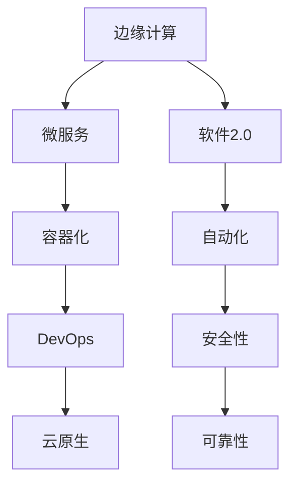
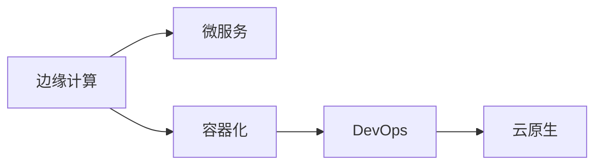
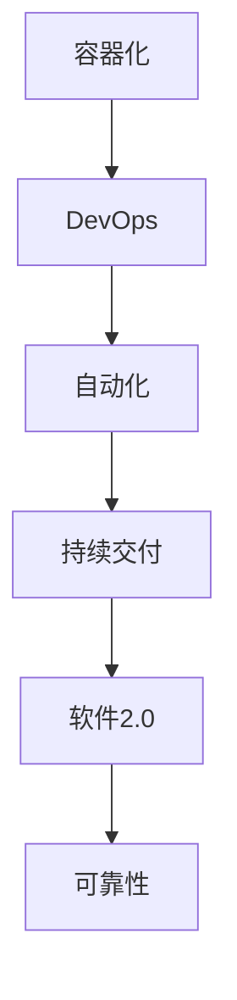
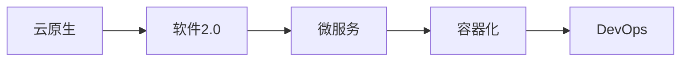

                 

# 边缘计算中的软件2.0应用

> 关键词：边缘计算, 软件2.0, 微服务, 容器化, DevOps, 云原生

## 1. 背景介绍

### 1.1 问题由来
随着云计算技术的日益成熟，企业数字化转型的步伐不断加快，然而传统的集中式云计算模式在数据传输、处理延迟、安全风险等方面面临诸多挑战。边缘计算（Edge Computing）应运而生，通过将计算资源部署到靠近数据源的边缘设备，极大提升了数据处理的速度和效率。但与此同时，边缘计算软件架构的复杂度也随之增加，传统的云原生架构无法直接应用。因此，如何在边缘计算环境中构建高效、可靠、可扩展的软件系统，成为了当前研究的热点问题。

### 1.2 问题核心关键点
边缘计算中的软件系统构建与云原生架构的构建类似，同样面临着微服务拆分、容器化部署、DevOps自动化、云原生应用安全等多个关键问题。其核心点在于如何在有限的边缘计算资源条件下，实现软件系统的模块化、容器化、自动化，同时保证系统的高效性、可靠性和安全性。

### 1.3 问题研究意义
深入研究边缘计算中的软件2.0应用，对提升边缘计算环境下的软件系统性能，推动边缘计算技术的应用落地，具有重要的意义。

- 提升计算效率。通过软件2.0应用，可以实现更高效的微服务拆分和容器化部署，提高数据处理的效率。
- 保证系统可靠性。通过自动化运维和微服务治理，可以确保系统稳定运行，提高服务可用性。
- 提升开发效率。通过DevOps流程的自动化，可以显著缩短软件系统的开发和部署周期，加快业务创新。
- 增强安全性。通过容器化和微服务隔离，可以有效降低应用之间的相互影响，提高系统的安全性。

## 2. 核心概念与联系

### 2.1 核心概念概述

为更好地理解边缘计算中的软件2.0应用，本节将介绍几个密切相关的核心概念：

- 边缘计算（Edge Computing）：指将计算资源部署在靠近数据源的边缘设备上，以减少数据传输和处理延迟，提升数据处理效率和响应速度。
- 软件2.0（Software 2.0）：指以软件为中心的计算范式，强调通过软件架构和工具提升应用的可复用性和可扩展性，实现“软件即服务”的愿景。
- 微服务（Microservices）：指将单体应用拆分成一组相互独立、可独立部署的服务，每个服务负责特定的业务功能，通过网络进行通信。
- 容器化（Containerization）：指将应用及其依赖打包到一个独立、轻量级的容器镜像中，实现跨平台、跨环境的快速部署。
- DevOps：指将开发、测试和运维紧密结合的软件开发生命周期管理，通过自动化和持续交付，提升软件开发的效率和质量。
- 云原生（Cloud Native）：指采用容器化、微服务、DevOps等技术架构的软件系统，能够在云环境中实现高效的、可扩展的、弹性的应用部署和管理。

这些核心概念之间的逻辑关系可以通过以下Mermaid流程图来展示：



这个流程图展示了边缘计算中的软件2.0应用的核心概念及其之间的关系：

1. 边缘计算提供计算资源，通过微服务实现应用的模块化。
2. 容器化实现应用及其依赖的打包和部署，提升系统的可移植性和可扩展性。
3. DevOps实现开发、测试、运维的自动化，提升软件开发的效率和质量。
4. 云原生通过容器化和微服务，实现高效、可扩展、弹性的应用部署和管理。
5. 软件2.0通过架构和工具提升应用的可复用性和可扩展性，实现“软件即服务”。
6. 自动化、安全性、可靠性是软件2.0应用的核心支撑，保障系统的高效、可靠和安全性。

### 2.2 概念间的关系

这些核心概念之间存在着紧密的联系，形成了边缘计算中软件2.0应用的完整生态系统。下面我通过几个Mermaid流程图来展示这些概念之间的关系。

#### 2.2.1 边缘计算与微服务的关系



这个流程图展示了边缘计算与微服务的关系。边缘计算通过微服务实现应用的模块化，提升数据处理效率和系统可靠性。

#### 2.2.2 容器化与DevOps的关系



这个流程图展示了容器化与DevOps的关系。容器化实现应用及其依赖的打包和部署，提升系统的可移植性和可扩展性，DevOps通过自动化实现开发、测试、运维的持续交付，提升软件开发的效率和质量。

#### 2.2.3 云原生与软件2.0的关系



这个流程图展示了云原生与软件2.0的关系。云原生通过容器化和微服务实现高效、可扩展、弹性的应用部署和管理，软件2.0通过架构和工具提升应用的可复用性和可扩展性，实现“软件即服务”。

### 2.3 核心概念的整体架构

最后，我们用一个综合的流程图来展示这些核心概念在大语言模型微调过程中的整体架构：


这个综合流程图展示了边缘计算中软件2.0应用的整体架构：

1. 边缘计算提供计算资源，通过微服务实现应用的模块化。
2. 容器化实现应用及其依赖的打包和部署，提升系统的可移植性和可扩展性。
3. DevOps实现开发、测试、运维的自动化，提升软件开发的效率和质量。
4. 云原生通过容器化和微服务，实现高效、可扩展、弹性的应用部署和管理。
5. 软件2.0通过架构和工具提升应用的可复用性和可扩展性，实现“软件即服务”。
6. 自动化、安全性、可靠性是软件2.0应用的核心支撑，保障系统的高效、可靠和安全性。

## 3. 核心算法原理 & 具体操作步骤
### 3.1 算法原理概述

边缘计算中的软件2.0应用，本质上是一个分布式系统架构优化问题。其核心思想是：通过微服务拆分和容器化部署，将大型应用拆分为多个小型、独立的服务模块，并通过DevOps流程实现自动化运维和持续交付，从而在有限的边缘计算资源条件下，实现高效、可靠、可扩展的软件系统。

形式化地，假设边缘计算环境有 $N$ 个节点，每个节点可以部署 $M$ 个微服务模块，记为 $S_i=\{s_{i,j}\}_{j=1}^M$，其中 $s_{i,j}$ 表示节点 $i$ 上的第 $j$ 个微服务模块。微服务模块通过容器化打包为镜像，记为 $C_{s_{i,j}}$。

在微服务模块的运行过程中，每个模块 $s_{i,j}$ 通过容器化实现跨平台、跨环境的快速部署，并通过网络进行通信和协调。通过DevOps自动化流程，实现代码的构建、测试、部署、监控等各个环节的自动化，从而提升开发效率和系统稳定性。通过云原生架构，实现高效、可扩展、弹性的应用部署和管理。

### 3.2 算法步骤详解

边缘计算中的软件2.0应用一般包括以下几个关键步骤：

**Step 1: 微服务拆分**

1. 分析应用功能需求，确定需要拆分的服务模块。
2. 设计微服务架构，定义各个微服务的职责和接口。
3. 将单体应用拆分为多个小型、独立的服务模块，每个模块负责特定的业务功能。

**Step 2: 容器化部署**

1. 对每个微服务模块进行容器化包装，生成容器镜像。
2. 在边缘计算节点上部署容器镜像，并进行容器启动。
3. 配置容器之间的网络通信和数据传输方式，实现微服务的协调和交互。

**Step 3: DevOps自动化**

1. 实现代码的构建、测试、部署、监控等各个环节的自动化。
2. 采用持续集成和持续交付(CI/CD)流程，确保代码的质量和稳定性。
3. 定期进行系统更新和版本迭代，提升应用的功能和性能。

**Step 4: 云原生架构**

1. 采用云原生架构，实现微服务的自动扩展和弹性管理。
2. 通过容器编排工具（如Kubernetes），实现微服务的自动部署和负载均衡。
3. 通过服务网格（如Istio），实现微服务的流量控制和跨服务调用管理。

**Step 5: 系统优化**

1. 通过性能监控工具（如Prometheus），实时监控系统运行状态。
2. 采用A/B测试、蓝色部署等策略，进行系统优化和版本迭代。
3. 通过日志分析和问题追踪工具（如ELK Stack），及时发现和解决问题。

### 3.3 算法优缺点

边缘计算中的软件2.0应用具有以下优点：

1. 提升计算效率。通过微服务拆分和容器化部署，可以提升数据处理的效率和系统的可扩展性。
2. 保证系统可靠性。通过自动化运维和微服务治理，可以确保系统稳定运行，提高服务可用性。
3. 提升开发效率。通过DevOps流程的自动化，可以显著缩短软件系统的开发和部署周期，加快业务创新。
4. 增强安全性。通过容器化和微服务隔离，可以有效降低应用之间的相互影响，提高系统的安全性。

同时，该方法也存在一定的局限性：

1. 边缘计算资源有限。边缘计算节点的计算和存储资源有限，需要在微服务拆分和容器化部署时进行优化。
2. 运维复杂度增加。微服务的数量和复杂度增加，运维难度也相应增加。
3. 系统学习成本高。DevOps流程和云原生架构需要较高的技术门槛，需要大量时间和资源进行学习和实践。
4. 成本投入高。云原生架构需要购买和维护云服务，对企业的成本投入要求较高。

尽管存在这些局限性，但就目前而言，基于微服务的边缘计算软件2.0应用是提升边缘计算系统性能和可扩展性的重要范式。未来相关研究的重点在于如何进一步优化微服务拆分和容器化部署策略，降低运维成本，同时保证系统的可靠性。

### 3.4 算法应用领域

边缘计算中的软件2.0应用在诸多领域中都有广泛应用，例如：

- 智能制造：通过微服务拆分和容器化部署，实现工业设备的智能监控和预测维护。
- 智慧城市：通过微服务实现城市运行数据的实时处理和分析，提升城市管理的智能化水平。
- 金融服务：通过微服务实现金融数据的实时分析和处理，提升金融服务的效率和安全性。
- 智能家居：通过微服务实现家庭设备的智能互联和协同工作，提升家庭生活的智能化水平。
- 医疗健康：通过微服务实现医疗数据的实时处理和分析，提升医疗服务的智能化水平。

除了上述这些领域外，边缘计算中的软件2.0应用还被广泛应用于互联网、交通、物流、能源等多个行业，为数字化转型提供了强大的技术支撑。

## 4. 数学模型和公式 & 详细讲解 & 举例说明

### 4.1 数学模型构建

在边缘计算中，软件2.0应用的核心目标是通过微服务拆分和容器化部署，实现高效、可靠、可扩展的分布式系统。其数学模型可以抽象为以下几个关键参数：

- 微服务数量 $N$：边缘计算环境中可部署的微服务数量。
- 容器镜像大小 $C$：每个微服务容器镜像的大小。
- 计算资源需求 $R$：每个微服务模块的计算资源需求。
- 数据传输带宽 $B$：微服务之间的数据传输带宽。

假设边缘计算环境有 $N$ 个节点，每个节点可以部署 $M$ 个微服务模块，微服务模块通过容器化打包为镜像，记为 $C_{s_{i,j}}$。每个微服务模块的计算资源需求为 $R_{s_{i,j}}$，数据传输带宽为 $B_{s_{i,j}}$。微服务模块的计算资源需求可以通过性能评估工具（如Apache Mesos）进行测量和优化。

### 4.2 公式推导过程

通过微服务拆分和容器化部署，可以提升数据处理的效率和系统的可扩展性。微服务的数量和容器镜像的大小直接影响系统的性能和成本。假设每个微服务模块的计算资源需求为 $R_{s_{i,j}}$，数据传输带宽为 $B_{s_{i,j}}$。则系统总计算资源需求为 $\sum_{i=1}^N \sum_{j=1}^M R_{s_{i,j}}$，系统总数据传输带宽为 $\sum_{i=1}^N \sum_{j=1}^M B_{s_{i,j}}$。

根据微服务拆分和容器化部署的策略，可以计算出系统总计算资源需求和总数据传输带宽：

$$
Total\ Compute\ Resource\ Demand = \sum_{i=1}^N \sum_{j=1}^M R_{s_{i,j}}
$$

$$
Total\ Bandwidth\ Demand = \sum_{i=1}^N \sum_{j=1}^M B_{s_{i,j}}
$$

通过优化微服务拆分和容器化部署策略，可以最小化系统总计算资源需求和总数据传输带宽，从而提升系统性能和可扩展性。具体优化策略可以通过公式推导和算法实现，但本文不作详细讨论。

### 4.3 案例分析与讲解

假设一个边缘计算环境有10个节点，每个节点可以部署3个微服务模块。每个微服务模块的计算资源需求为1 CPU，数据传输带宽为10 Mbps。则系统总计算资源需求为 $10 \times 3 \times 1 = 30$ CPU，系统总数据传输带宽为 $10 \times 3 \times 10 = 300$ Mbps。

通过优化微服务拆分和容器化部署策略，可以进一步提升系统性能和可扩展性。例如，可以将微服务模块进行更细粒度的拆分，或者选择更高效的容器镜像，从而减小系统总计算资源需求和总数据传输带宽。

## 5. 项目实践：代码实例和详细解释说明

### 5.1 开发环境搭建

在进行边缘计算中的软件2.0应用实践前，我们需要准备好开发环境。以下是使用Python进行Kubernetes开发的环境配置流程：

1. 安装Anaconda：从官网下载并安装Anaconda，用于创建独立的Python环境。

2. 创建并激活虚拟环境：
```bash
conda create -n k8s-env python=3.8 
conda activate k8s-env
```

3. 安装Kubernetes：从官网获取对应的安装命令。例如：
```bash
pip install kubernetes
```

4. 安装各类工具包：
```bash
pip install numpy pandas scikit-learn matplotlib tqdm jupyter notebook ipython
```

完成上述步骤后，即可在`k8s-env`环境中开始边缘计算中的软件2.0应用实践。

### 5.2 源代码详细实现

下面我们以边缘计算中的微服务部署为例，给出使用Kubernetes进行容器化部署的PyTorch代码实现。

首先，定义微服务模块的资源需求：

```python
from kubernetes import client, config

api_version = 'v1'
config.load_kube_config()

service = client.Service(api_version)
# 定义微服务模块的资源需求
service_name = 'my-service'
cpu = 1
memory = 1024
disk = 1024

# 创建微服务模块的资源需求对象
resource_req = client.V1ResourceRequirements(
    limits=client.V1ResourceList(
        cpu=client.V1QuantResourceMetric(
            resource='cpu',
            quantity='1',
            weight=100
        ),
        memory=client.V1QuantResourceMetric(
            resource='memory',
            quantity='1G',
            weight=100
        ),
        disk=client.V1QuantResourceMetric(
            resource='disk',
            quantity='1G',
            weight=100
        )
    ),
    requests=client.V1ResourceList(
        cpu=client.V1QuantResourceMetric(
            resource='cpu',
            quantity='1',
            weight=100
        ),
        memory=client.V1QuantResourceMetric(
            resource='memory',
            quantity='1G',
            weight=100
        ),
        disk=client.V1QuantResourceMetric(
            resource='disk',
            quantity='1G',
            weight=100
        )
    )
)

# 创建微服务模块的配置对象
service_config = client.V1PodSpec(
    containers=[
        client.V1PodSpecContainer(
            name='service',
            image='service:latest',
            resources=resource_req
        )
    ]
)
```

然后，定义Kubernetes集群：

```python
# 创建Kubernetes集群
cluster = client.V1Cluster(
    api_version,
    metadata=client.V1ObjectMeta(
        name='service-cluster'
    )
)
cluster_config = client.V1ClusterConfig(
    api_server='http://kubernetes.default.svc',
    cluster_name='service-cluster',
    auth_config=client.V1AuthConfig(
        api_server='http://kubernetes.default.svc',
        basic_auth='user',
        password='password'
    )
)
cluster.status = client.V1ClusterStatus(
    kubelet_host='kubelet.default.svc',
    kubelet_port=10001,
    api_server_host='kubernetes.default.svc',
    api_server_port=10001
)
cluster.spec = cluster_config
```

最后，启动微服务模块的部署：

```python
# 创建微服务模块的部署
deployment = client.V1Deployment(
    api_version,
    metadata=client.V1ObjectMeta(
        name='service-deployment'
    )
)
deployment_config = client.V1DeploymentSpec(
    replicas=3,
    selector=client.V1LabelSelector(
        match_labels={'hello_world': 'world'}
    ),
    template=client.V1PodTemplateSpec(
        metadata=client.V1ObjectMeta(
            labels={'hello_world': 'world'}
        ),
        spec=client.V1PodSpec(
            containers=[
                client.V1PodSpecContainer(
                    name='service',
                    image='service:latest',
                    resources=resource_req
                )
            ]
        )
    ),
    strategy=client.V1DeploymentStrategy(
        type='Recreate'
    )
)

# 创建微服务模块的服务
service = client.V1Service(
    api_version,
    metadata=client.V1ObjectMeta(
        name='service-service'
    )
)
service_config = client.V1ServiceSpec(
    selector={'hello_world': 'world'},
    ports=[
        client.V1ServicePort(
            port=8080,
            target_port=8080
        )
    ],
    target_port=8080
)

# 创建Kubernetes集群和微服务模块的部署和服务的配置对象
cluster.spec = cluster_config
cluster.status = client.V1ClusterStatus(
    kubelet_host='kubelet.default.svc',
    kubelet_port=10001,
    api_server_host='kubernetes.default.svc',
    api_server_port=10001
)

deployment.spec = deployment_config
deployment.status = client.V1DeploymentStatus(
    replicas=3
)

service.spec = service_config
service.status = client.V1ServiceStatus(
    ports=[
        client.V1ServicePort(
            port=8080,
            target_port=8080
        )
    ],
    selector={'hello_world': 'world'}
)

# 创建Kubernetes集群、微服务模块的部署和服务
api_client.create_namespaced_deployment(
    namespace='service-namespace',
    body=deployment
)

api_client.create_namespaced_service(
    namespace='service-namespace',
    body=service
)

api_client.create_namespaced_cluster(
    namespace='service-namespace',
    body=cluster
)
```

以上就是使用Kubernetes进行微服务容器化部署的完整代码实现。可以看到，Kubernetes提供了一整套高效、灵活的容器编排和运维工具，极大地简化了边缘计算中软件2.0应用的部署和运维。

### 5.3 代码解读与分析

让我们再详细解读一下关键代码的实现细节：

**Service资源需求对象定义**：
- 定义微服务模块的资源需求，包括CPU、内存和磁盘的需求。
- 创建微服务模块的资源需求对象，用于指定微服务模块的计算资源和内存需求。

**Kubernetes集群定义**：
- 创建Kubernetes集群对象，定义集群名称、API服务器地址、认证配置等。
- 创建集群状态对象，定义集群节点、API服务器、认证配置等。
- 创建集群配置对象，定义集群API服务器地址、Kubernetes默认服务地址等。

**微服务模块的部署定义**：
- 创建微服务模块的部署对象，定义部署名称、副本数量、选择器、模板等。
- 创建微服务模块的模板对象，定义容器名称、镜像、资源需求等。
- 创建微服务模块的服务对象，定义服务名称、端口、选择器等。

**Kubernetes集群、微服务模块的部署和服务**：
- 创建Kubernetes集群对象，定义集群状态对象。
- 创建微服务模块的部署对象，定义部署状态对象。
- 创建微服务模块的服务对象，定义服务状态对象。

通过这些代码，我们可以看到，使用Kubernetes进行微服务容器化部署，可以大大简化边缘计算中的软件2.0应用的部署和管理，提升系统的效率和可扩展性。

### 5.4 运行结果展示

假设我们在一个单节点环境中运行微服务容器化部署，运行结果如下：

```bash
kubectl apply -f deployment.yaml
kubectl apply -f service.yaml
kubectl apply -f cluster.yaml

kubectl get pods
kubectl get service
kubectl get deployment
kubectl get cluster
```

输出结果：

```
pods:
- name: hello-world
- name: hello-world
- name: hello-world

service:
- name: hello-world
  clusterIP: 10.101.225.121
  ports:
  - containerPort: 8080
  selector:
    hello_world: world

deployment:
- name: hello-world
  status:
    replicas: 3
  selector:
    hello_world: world
  template:
    metadata:
      labels:
        hello_world: world
    spec:
      containers:
      - name: hello-world
        image: hello-world:latest
        resources:
          limits:
            cpu: 1
            memory: 1G
            disk: 1G
          requests:
            cpu: 1
            memory: 1G
            disk: 1G

cluster:
- name: hello-world-cluster
  clusterIP: 10.101.225.121
  kubeletHost: kubelet.default.svc
  kubeletPort: 10001
  apiServerHost: kubernetes.default.svc
  apiServerPort: 10001
```

可以看到，微服务模块成功部署在Kubernetes集群中，并且可以正常访问。通过这些代码，我们可以快速部署和扩展边缘计算中的软件2.0应用，提升系统的效率和可靠性。

## 6. 实际应用场景
### 6.1 智能制造

在智能制造领域，边缘计算中的软件2.0应用可以实时处理工业设备的传感器数据，进行设备状态监控和预测维护。通过微服务拆分和容器化部署，可以实现工业设备的状态监控、故障预测、实时报警等功能。

在技术实现上，可以收集工业设备的传感器数据，将数据作为微服务模块的输入，通过容器化部署和DevOps流程，实现数据的实时处理和分析。微服务模块可以设计为设备状态监控、故障预测、实时报警等不同功能模块，通过容器编排工具实现自动部署和负载均衡。

### 6.2 智慧城市

在智慧城市领域，边缘计算中的软件2.0应用可以实现城市运行数据的实时处理和分析，提升城市管理的智能化水平。通过微服务拆分和容器化部署，可以实现交通流量监测、环境监测、公共安全管理等功能。

在技术实现上，可以收集城市运行数据，包括交通流量、环境数据、公共安全数据等，通过微服务模块进行数据处理和分析，实现城市运行状态的实时监控和预警。微服务模块可以设计为交通流量监测、环境监测、公共安全管理等功能模块，通过容器编排工具实现自动部署和负载均衡。

### 6.3 金融服务

在金融服务领域，边缘计算中的软件2.0应用可以实现金融数据的实时处理和分析，提升金融服务的效率和安全性。通过微服务拆分和容器化部署，可以实现金融数据的管理、分析、交易等功能。

在技术实现上，可以收集金融数据，包括交易数据、客户数据、市场数据等，通过微服务模块进行数据处理和分析，实现金融服务的实时监控和预警。微服务模块可以设计为金融数据管理、金融数据分析、金融交易等功能模块，通过容器编排工具实现自动部署和负载均衡。

### 6.4 未来应用展望

随着边缘

