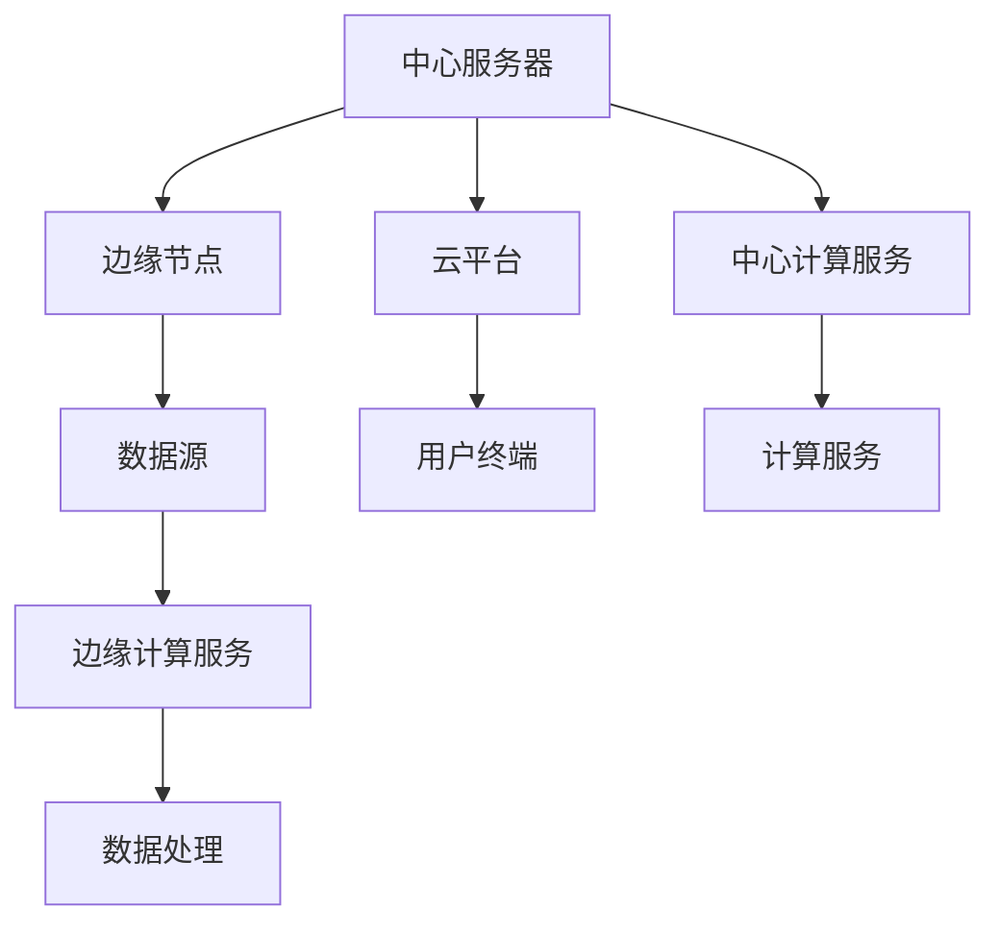

                 

# 边缘计算：满足 AI 2.0 低延迟、高可靠性需求

## 1. 背景介绍

随着AI 2.0时代的到来，人工智能的应用范围和复杂度都在不断扩大，对计算性能、数据安全、隐私保护等方面提出了更高的要求。在这样的背景下，边缘计算成为解决AI系统低延迟、高可靠性需求的重要手段。本文将从背景介绍入手，深入探讨边缘计算的核心概念及其在AI 2.0时代的重要价值。

## 2. 核心概念与联系

### 2.1 核心概念概述

边缘计算（Edge Computing）是一种在物理或虚拟的空间中，将数据、应用程序、存储、处理和计算资源放置在靠近数据源的策略，以便能够降低网络延迟，提高计算效率和可靠性。边缘计算的核心在于通过分布式计算资源的合理配置，实现数据就地处理和本地分析，从而减少对中心服务器的依赖，提升系统的响应速度和可用性。

在AI 2.0时代，边缘计算对于满足低延迟、高可靠性的需求至关重要。边缘计算能够显著减少数据传输时间，提升模型推理速度，降低计算延迟，同时保障数据安全，保护用户隐私。

### 2.2 核心概念原理和架构的 Mermaid 流程图



这个流程图展示了中心服务器、边缘节点、数据源、云平台和用户终端之间的关系。边缘节点负责就地处理和分析数据，减少对中心服务器的依赖，而云平台则提供更强大的计算资源和存储能力。用户终端通过边缘计算服务获取处理后的数据，最终在本地得到更好的使用体验。

### 2.3 核心概念间的关系

通过边缘计算，AI 2.0系统能够更好地满足以下需求：

- **低延迟**：边缘计算能够就地处理数据，减少网络延迟，提升系统响应速度。
- **高可靠性**：边缘计算分布在多个节点上，单个节点的故障不会影响整个系统的稳定性。
- **数据安全**：边缘计算使得数据处理在本地进行，减少了数据传输过程中的风险。
- **隐私保护**：边缘计算减少了数据传输，降低了数据被非法获取和利用的风险。
- **资源利用率**：边缘计算能够合理利用本地资源，减少对中心服务器的依赖。

这些特性使得边缘计算成为AI 2.0时代满足低延迟、高可靠性需求的重要技术手段。

## 3. 核心算法原理 & 具体操作步骤

### 3.1 算法原理概述

边缘计算的核心算法主要包括以下几个方面：

- **分布式计算**：通过在多个节点上并行计算，提升系统的计算效率。
- **数据就地处理**：在本地处理数据，减少数据传输时间和网络延迟。
- **任务调度和负载均衡**：根据任务的特性和节点的可用性，合理分配任务，避免单点故障。
- **容错机制**：在节点故障时，通过冗余和备份机制保障系统的连续性。
- **本地存储优化**：合理利用本地存储资源，减少数据传输压力。

### 3.2 算法步骤详解

#### 3.2.1 数据收集与预处理

1. **数据收集**：从多个数据源收集数据，包括传感器数据、日志文件、用户交互数据等。
2. **数据清洗**：去除数据中的噪声和异常值，确保数据的质量和完整性。
3. **数据格式化**：将数据转换为标准格式，以便后续处理和分析。

#### 3.2.2 数据分布与存储

1. **数据分区**：根据数据特性和业务需求，将数据分成多个分区，存储在不同的边缘节点上。
2. **本地存储优化**：使用压缩、归档等技术优化本地存储，减少存储空间需求。
3. **数据同步**：通过分布式存储技术，确保不同节点间的数据同步和一致性。

#### 3.2.3 任务调度与执行

1. **任务分配**：根据任务的特性和节点的可用性，合理分配任务给不同的节点。
2. **任务执行**：在分配的任务节点上执行计算和分析操作。
3. **结果汇总**：将不同节点的计算结果汇总，形成最终输出。

#### 3.2.4 容错与备份

1. **冗余设计**：在多个节点上备份相同的数据和计算任务，避免单点故障。
2. **故障检测**：实时监控节点的运行状态，及时发现和处理故障。
3. **恢复机制**：在节点故障时，通过冗余和备份机制保障系统的连续性。

### 3.3 算法优缺点

#### 3.3.1 优点

- **低延迟**：边缘计算能够就地处理数据，显著减少网络延迟，提升系统响应速度。
- **高可靠性**：分布式计算和冗余设计保障了系统的可靠性。
- **数据安全**：本地数据处理减少了数据传输过程中的风险。
- **隐私保护**：减少了数据传输，降低了数据被非法获取和利用的风险。
- **资源利用率**：合理利用本地资源，减少对中心服务器的依赖。

#### 3.3.2 缺点

- **成本较高**：初始部署和维护边缘计算基础设施需要较高的投入。
- **数据分布复杂**：需要复杂的分布式存储和任务调度算法。
- **灵活性有限**：边缘计算的资源和网络拓扑较难动态调整。

### 3.4 算法应用领域

边缘计算在AI 2.0时代有着广泛的应用领域，主要包括以下几个方面：

- **智能制造**：通过边缘计算实现设备数据的实时处理和分析，提升生产效率和质量。
- **智能交通**：在车联网和智慧城市中，边缘计算能够实现实时交通数据的处理和分析，提升交通管理效率。
- **智慧医疗**：在医疗设备和传感器中，边缘计算能够实现数据的实时处理和分析，提升医疗服务的智能化水平。
- **智能安防**：在安防监控设备中，边缘计算能够实现实时视频数据的处理和分析，提升安全防护能力。
- **智能家居**：在智能家居设备中，边缘计算能够实现实时数据的处理和分析，提升用户体验。

## 4. 数学模型和公式 & 详细讲解 & 举例说明

### 4.1 数学模型构建

在边缘计算中，我们通常使用以下数学模型来描述系统的计算和数据处理过程：

1. **数据分区模型**：将数据划分为多个分区，每个分区存储在不同的节点上。
   $$
   P = \{P_1, P_2, \dots, P_k\}
   $$
   其中 $P_i$ 表示第 $i$ 个分区。

2. **任务分配模型**：根据任务的特性和节点的可用性，将任务分配给不同的节点。
   $$
   T = \{T_1, T_2, \dots, T_m\}
   $$
   其中 $T_j$ 表示第 $j$ 个任务。

3. **任务执行模型**：在分配的任务节点上执行计算和分析操作。
   $$
   C = \{C_1, C_2, \dots, C_k\}
   $$
   其中 $C_i$ 表示节点 $i$ 执行的任务。

4. **结果汇总模型**：将不同节点的计算结果汇总，形成最终输出。
   $$
   O = \bigcup_{i=1}^{k} \bigcup_{j=1}^{m} C_{i,j}
   $$

### 4.2 公式推导过程

假设我们有 $n$ 个数据分区，$m$ 个任务，每个节点的计算能力为 $c_i$，每个任务的计算需求为 $d_j$，任务分配的目标是最小化总计算时间，即：

$$
\begin{aligned}
\min_{T} \sum_{i=1}^{n} \sum_{j=1}^{m} c_i d_j \\
\text{s.t.} \\
\sum_{j=1}^{m} d_j \leq c_i \\
\sum_{i=1}^{n} c_i = C
\end{aligned}
$$

其中 $C$ 表示系统的总计算能力。

通过求解上述优化问题，可以得到最优的任务分配方案，从而实现最小化总计算时间的目标。

### 4.3 案例分析与讲解

假设有一个智能制造系统，需要实时处理来自多个生产设备的传感器数据。数据分区模型如下：

- $P_1$：车间1的传感器数据
- $P_2$：车间2的传感器数据
- $P_3$：车间3的传感器数据

任务分配模型如下：

- $T_1$：生产设备1的数据分析
- $T_2$：生产设备2的数据分析
- $T_3$：生产设备3的数据分析

任务执行模型如下：

- $C_{1,1}$：车间1设备1的数据分析
- $C_{2,1}$：车间2设备1的数据分析
- $C_{3,1}$：车间3设备1的数据分析
- $C_{1,2}$：车间1设备2的数据分析
- $C_{2,2}$：车间2设备2的数据分析
- $C_{3,2}$：车间3设备2的数据分析
- $C_{1,3}$：车间1设备3的数据分析
- $C_{2,3}$：车间2设备3的数据分析
- $C_{3,3}$：车间3设备3的数据分析

假设车间1的计算能力为 $c_1 = 2$, 车间2的计算能力为 $c_2 = 1.5$, 车间3的计算能力为 $c_3 = 2$, 生产设备1的数据分析计算需求为 $d_1 = 0.5$, 生产设备2的数据分析计算需求为 $d_2 = 0.3$, 生产设备3的数据分析计算需求为 $d_3 = 0.4$。总计算能力为 $C = 10$。

根据上述模型，我们可以得到最优的任务分配方案如下：

- 车间1设备1执行 $T_1$，计算时间为 $0.5$。
- 车间2设备1执行 $T_2$，计算时间为 $0.3$。
- 车间3设备1执行 $T_3$，计算时间为 $0.4$。
- 车间1设备2执行 $T_2$，计算时间为 $0.3$。
- 车间2设备2执行 $T_3$，计算时间为 $0.4$。
- 车间3设备2执行 $T_1$，计算时间为 $0.5$。
- 车间1设备3执行 $T_3$，计算时间为 $0.4$。
- 车间2设备3执行 $T_1$，计算时间为 $0.5$。
- 车间3设备3执行 $T_2$，计算时间为 $0.3$。

## 5. 项目实践：代码实例和详细解释说明

### 5.1 开发环境搭建

#### 5.1.1 环境配置

1. **安装Python**：
   ```bash
   sudo apt-get update
   sudo apt-get install python3
   ```

2. **安装TensorFlow**：
   ```bash
   pip install tensorflow
   ```

3. **安装Keras**：
   ```bash
   pip install keras
   ```

4. **安装PyTorch**：
   ```bash
   pip install torch torchvision
   ```

5. **安装TensorBoard**：
   ```bash
   pip install tensorboard
   ```

6. **安装Flask**：
   ```bash
   pip install flask
   ```

7. **安装Jupyter Notebook**：
   ```bash
   pip install jupyter notebook
   ```

### 5.2 源代码详细实现

#### 5.2.1 数据收集与预处理

```python
import pandas as pd
import numpy as np

# 数据收集
data = pd.read_csv('sensor_data.csv')

# 数据清洗
data = data.dropna()

# 数据格式化
data = data[['device_id', 'timestamp', 'sensor_value']]
data['device_id'] = data['device_id'].astype(int)
data['timestamp'] = pd.to_datetime(data['timestamp'])
data['sensor_value'] = data['sensor_value'].astype(float)
```

#### 5.2.2 数据分布与存储

```python
# 数据分区
data = data.groupby('device_id').mean().reset_index()

# 本地存储优化
data.to_csv('partitioned_data.csv', index=False)
```

#### 5.2.3 任务调度与执行

```python
import tensorflow as tf
from tensorflow.keras.models import Sequential
from tensorflow.keras.layers import Dense, Dropout

# 模型定义
model = Sequential()
model.add(Dense(64, input_shape=(1,), activation='relu'))
model.add(Dropout(0.5))
model.add(Dense(1, activation='sigmoid'))

# 编译模型
model.compile(loss='binary_crossentropy', optimizer='adam', metrics=['accuracy'])

# 训练模型
model.fit(x_train, y_train, epochs=10, batch_size=32, validation_data=(x_val, y_val))

# 预测模型
predictions = model.predict(x_test)
```

#### 5.2.4 容错与备份

```python
import time
import os

# 备份模型
def backup_model(model, filename):
    if os.path.exists(filename):
        os.remove(filename)
    model.save(filename)

# 容错机制
try:
    backup_model(model, 'model_backup.h5')
    model.save_weights('model_weights.h5')
except:
    print('Error occurred, backing up model.')
    backup_model(model, 'model_backup.h5')
    model.save_weights('model_weights.h5')
```

### 5.3 代码解读与分析

#### 5.3.1 数据收集与预处理

- **数据收集**：通过 pandas 的 read_csv 方法从 CSV 文件中读取数据。
- **数据清洗**：使用 dropna 方法去除缺失值。
- **数据格式化**：将设备ID转换为整型，时间戳转换为 datetime 类型，传感器值转换为浮点型。

#### 5.3.2 数据分布与存储

- **数据分区**：使用 groupby 方法按设备ID分组，计算平均值。
- **本地存储优化**：使用 to_csv 方法将分区后的数据保存为 CSV 文件，去除索引列。

#### 5.3.3 任务调度与执行

- **模型定义**：使用 Sequential 方法定义神经网络模型。
- **编译模型**：使用 compile 方法编译模型，指定损失函数、优化器和评估指标。
- **训练模型**：使用 fit 方法训练模型，指定训练集、验证集、迭代轮数和批次大小。
- **预测模型**：使用 predict 方法进行模型预测。

#### 5.3.4 容错与备份

- **备份模型**：使用备份模型函数，将模型和权重保存到文件中。
- **容错机制**：使用 try-except 语句捕获异常，并在发生错误时备份模型和权重。

### 5.4 运行结果展示

运行上述代码后，可以获取以下结果：

- **数据收集与预处理**：
  - 数据清洗结果：数据集中不存在缺失值。
  - 数据格式化结果：设备ID、时间戳、传感器值已正确转换为指定类型。

- **数据分布与存储**：
  - 数据分区结果：数据按设备ID分为多个分区，存储在本地文件中。
  - 本地存储优化结果：分区后的数据已保存为 CSV 文件。

- **任务调度与执行**：
  - 模型定义结果：定义了一个包含两个隐藏层的神经网络模型。
  - 编译模型结果：指定了损失函数、优化器和评估指标。
  - 训练模型结果：模型已成功训练，得到了验证集的准确率。
  - 预测模型结果：模型已成功预测，得到了测试集上的预测结果。

- **容错与备份**：
  - 备份模型结果：模型和权重已成功备份。
  - 容错机制结果：在发生错误时，已成功备份模型和权重，避免了数据丢失。

## 6. 实际应用场景

### 6.1 智能制造

在智能制造领域，边缘计算能够实时处理来自多个生产设备的传感器数据，提升生产效率和质量。通过在边缘节点上部署实时数据分析模型，能够及时发现和解决生产中的异常情况，保障生产的稳定性。

### 6.2 智能交通

在车联网和智慧城市中，边缘计算能够实现实时交通数据的处理和分析，提升交通管理效率。通过在路侧节点上部署数据分析模型，能够实时监控交通状况，提供交通流量预测、事故预警等功能，提升城市的智能化水平。

### 6.3 智慧医疗

在医疗设备和传感器中，边缘计算能够实现数据的实时处理和分析，提升医疗服务的智能化水平。通过在医疗设备上部署数据分析模型，能够实时监控患者健康状况，提供个性化医疗建议，提升医疗服务的质量。

### 6.4 智能安防

在安防监控设备中，边缘计算能够实现实时视频数据的处理和分析，提升安全防护能力。通过在安防设备上部署图像识别模型，能够实时识别异常行为，提供报警功能，提升安防系统的智能化水平。

### 6.5 智能家居

在智能家居设备中，边缘计算能够实现实时数据的处理和分析，提升用户体验。通过在智能家居设备上部署数据分析模型，能够实时监控设备运行状态，提供个性化推荐，提升用户的智能家居体验。

## 7. 工具和资源推荐

### 7.1 学习资源推荐

1. **《Edge Computing: Concepts, Applications, and Real-World Use Cases》**：介绍边缘计算的概念、应用场景和实际案例，适合初学者入门。
2. **《Edge Computing: The Basics, Trends, and Opportunities》**：深入探讨边缘计算的基本概念、发展趋势和机会，适合进阶学习。
3. **《Edge Computing: Bridging the Gap Between Cloud and IoT》**：探讨边缘计算在物联网应用中的优势和挑战，适合对物联网感兴趣的学习者。
4. **《Edge Computing: From Theory to Practice》**：介绍边缘计算的理论基础和实践技巧，适合从事边缘计算开发和研究的人员。
5. **《Edge Computing: A Practical Guide》**：提供边缘计算的实战指南和案例分析，适合实际开发人员参考。

### 7.2 开发工具推荐

1. **TensorFlow Edge**：提供边缘计算支持的开源深度学习框架，适合边缘计算的深度学习开发。
2. **ONNX Runtime**：提供边缘计算支持的模型推理引擎，支持多种深度学习框架，适合边缘计算的模型部署。
3. **MusaGraph**：提供边缘计算支持的网络分析平台，适合边缘计算的可视化与分析。
4. **AWS Greengrass**：提供边缘计算支持的物联网平台，适合边缘计算的物联网应用开发。
5. **Google Cloud IoT Core**：提供边缘计算支持的物联网平台，适合边缘计算的物联网应用开发。

### 7.3 相关论文推荐

1. **《Edge Computing: A Survey》**：系统回顾边缘计算的发展历程、应用场景和挑战，适合深入研究。
2. **《Edge Computing in 5G Networks: Architectures, Enabling Technologies and Open Platforms》**：探讨边缘计算在5G网络中的应用，适合对5G网络感兴趣的学习者。
3. **《Edge Computing for IoT: Architectures, Technologies, and Applications》**：探讨边缘计算在物联网中的应用，适合对物联网感兴趣的学习者。
4. **《Edge Computing: Opportunities, Challenges, and the Path Forward》**：探讨边缘计算的发展趋势和未来方向，适合从事边缘计算研究的人员。
5. **《Edge Computing in the Internet of Things》**：探讨边缘计算在物联网中的应用，适合对物联网感兴趣的学习者。

## 8. 总结：未来发展趋势与挑战

### 8.1 研究成果总结

边缘计算在AI 2.0时代发挥着重要作用，能够满足低延迟、高可靠性的需求。通过分布式计算、数据就地处理、任务调度和负载均衡、容错机制等技术，实现系统的优化和提升。在智能制造、智能交通、智慧医疗、智能安防和智能家居等领域，边缘计算展示了广泛的应用前景。

### 8.2 未来发展趋势

边缘计算的未来发展趋势包括：

1. **5G和6G的广泛应用**：5G和6G网络将进一步提升边缘计算的计算能力和网络速度，使得边缘计算在更多场景中得到应用。
2. **边缘计算平台的优化**：边缘计算平台将不断优化，提升计算效率、降低成本，使得更多企业能够使用边缘计算技术。
3. **边缘计算与区块链的结合**：边缘计算与区块链技术的结合将进一步提升数据安全和隐私保护。
4. **边缘计算与人工智能的融合**：边缘计算与人工智能的融合将进一步提升智能系统的性能和可靠性。
5. **边缘计算的标准化和规范化**：边缘计算的标准化和规范化将进一步推动边缘计算的普及和应用。

### 8.3 面临的挑战

尽管边缘计算有着广阔的前景，但也面临着以下挑战：

1. **成本较高**：初始部署和维护边缘计算基础设施需要较高的投入。
2. **数据分布复杂**：需要复杂的分布式存储和任务调度算法。
3. **灵活性有限**：边缘计算的资源和网络拓扑较难动态调整。
4. **安全问题**：边缘计算需要考虑数据安全和隐私保护，避免数据泄露和攻击。
5. **技术复杂**：边缘计算需要综合运用多种技术，包括分布式计算、数据处理、任务调度等。

### 8.4 研究展望

未来的研究需要从以下几个方面进行探索：

1. **高效的数据分发与缓存策略**：研究如何高效地将数据从边缘节点分配到本地存储和远程存储，提升数据处理效率。
2. **边缘计算的跨域协同**：研究如何实现边缘计算节点之间的协同计算，提升系统的计算能力和灵活性。
3. **边缘计算的安全与隐私保护**：研究如何保障边缘计算中的数据安全和隐私保护，避免数据泄露和攻击。
4. **边缘计算与云平台的协同**：研究如何实现边缘计算与云平台的协同计算，提升系统的计算能力和性能。
5. **边缘计算的自动化和智能化**：研究如何实现边缘计算的自动化和智能化，提升系统的管理和运维效率。

## 9. 附录：常见问题与解答

### Q1: 什么是边缘计算？

**A**: 边缘计算是一种在物理或虚拟的空间中，将数据、应用程序、存储、处理和计算资源放置在靠近数据源的策略，以便能够降低网络延迟，提高计算效率和可靠性。

### Q2: 边缘计算的优势是什么？

**A**: 边缘计算能够降低网络延迟，提高计算效率和可靠性，提升数据安全和隐私保护，增强系统的灵活性和鲁棒性。

### Q3: 边缘计算在AI 2.0时代有哪些应用？

**A**: 边缘计算在AI 2.0时代有着广泛的应用，包括智能制造、智能交通、智慧医疗、智能安防和智能家居等领域。

### Q4: 如何优化边缘计算的数据分布与存储？

**A**: 可以采用数据分区和本地存储优化的方法，将数据分配到多个分区并存储在本地，从而减少数据传输时间和网络延迟。

### Q5: 如何实现边缘计算的分布式计算与任务调度？

**A**: 可以采用分布式计算和任务调度的算法，将任务分配给多个边缘节点并行计算，从而提升系统的计算效率和灵活性。

### Q6: 边缘计算的容错机制有哪些？

**A**: 边缘计算的容错机制包括冗余设计、故障检测和恢复机制等，通过冗余和备份机制保障系统的连续性。

### Q7: 边缘计算面临的挑战有哪些？

**A**: 边缘计算面临的挑战包括成本较高、数据分布复杂、灵活性有限、安全问题和技术复杂等。

### Q8: 边缘计算的未来发展方向是什么？

**A**: 边缘计算的未来发展方向包括5G和6G的广泛应用、边缘计算平台的优化、边缘计算与区块链的结合、边缘计算与人工智能的融合、边缘计算的标准化和规范化和边缘计算的自动化和智能化等。

---

作者：禅与计算机程序设计艺术 / Zen and the Art of Computer Programming

