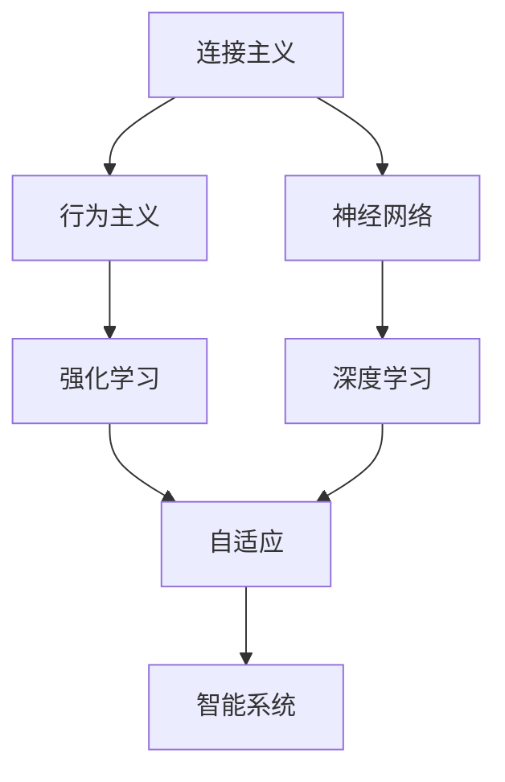
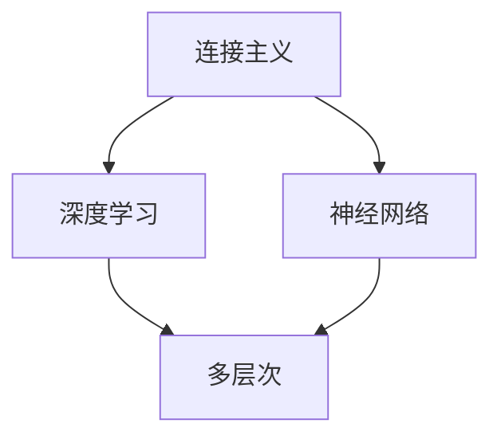
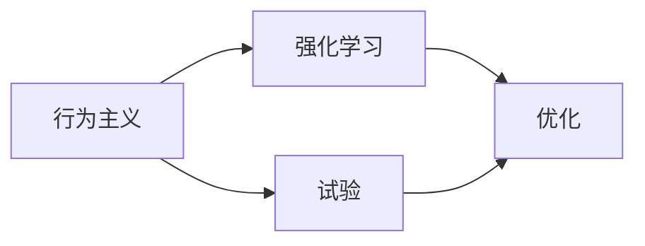
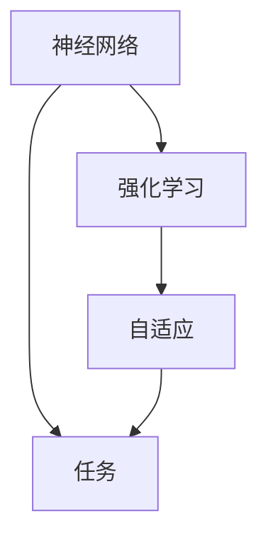
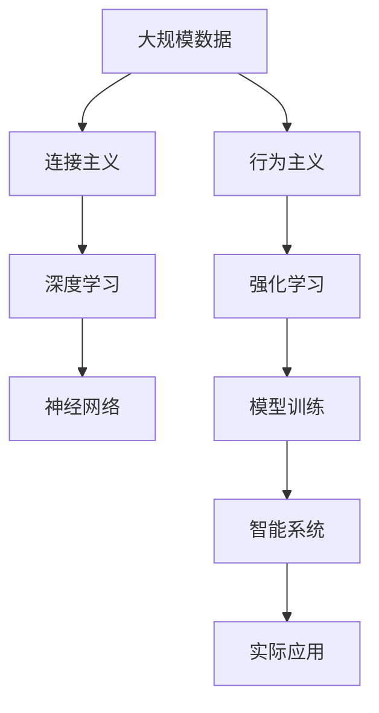

                 

# 连接主义与行为主义的潜力

> 关键词：连接主义, 行为主义, 强化学习, 神经网络, 机器学习, 人工智能

## 1. 背景介绍

连接主义（Connectionism）和行为主义（Behaviorism）是人工智能领域中两个重要的研究方向，它们各自有其独特的理论基础和应用场景。随着深度学习技术的不断发展，这两者之间的关系变得更加紧密，产生了一系列创新且高效的算法和应用。本文将深入探讨连接主义与行为主义的潜力，并通过实例展示它们如何共同推动人工智能技术的进步。

### 1.1 问题由来
连接主义与行为主义在人工智能领域的应用历史悠久，但它们的融合和创新应用，尤其是在深度学习时代，才真正释放出其巨大的潜力。连接主义主要是基于神经网络的计算模型，通过多层次的神经元网络模拟人脑的信息处理过程；而行为主义则强调通过反复试验和强化学习来训练模型，使其逐步适应环境。这两种方法的结合，为解决复杂的任务提供了新的思路和工具。

### 1.2 问题核心关键点
连接主义与行为主义结合的关键在于：
- 连接主义模型提供了一种强大的计算框架，能够处理大量的非结构化数据和复杂的特征表示。
- 行为主义强化学习提供了一种有效的学习机制，能够使模型在不断尝试和反馈中逐步优化。
- 两者结合可以构建更加鲁棒、灵活、自适应的智能系统，提升在实际应用中的效果。

## 2. 核心概念与联系

### 2.1 核心概念概述

为了更好地理解连接主义与行为主义的潜力，本节将介绍几个密切相关的核心概念：

- **连接主义**：基于神经网络模型，通过模拟人脑的神经元结构和信息传递机制，进行复杂数据处理和模式识别。
- **行为主义**：通过不断试验和强化学习，使模型逐步适应环境，优化其行为策略，以实现特定目标。
- **强化学习（Reinforcement Learning, RL）**：一种基于反馈的学习方式，通过奖励机制（奖励信号）来指导模型行为，使其在特定环境中不断优化策略。
- **深度学习（Deep Learning）**：一种基于神经网络的机器学习方法，通过多层次的特征抽取和信息传递，提升模型处理复杂数据的能力。
- **神经网络（Neural Network）**：由大量神经元组成的计算模型，能够进行非线性映射和模式识别。

这些核心概念之间的逻辑关系可以通过以下Mermaid流程图来展示：



这个流程图展示了几者之间的联系：

1. 连接主义通过神经网络模型提供计算基础，是深度学习的基础。
2. 行为主义通过强化学习提供学习机制，使模型能够适应环境。
3. 强化学习是行为主义的核心技术，也是连接主义中的一种学习方式。
4. 深度学习利用神经网络的多层次结构，提升模型的表示能力。
5. 两者结合构建了智能系统，在各个领域取得广泛应用。

### 2.2 概念间的关系

这些核心概念之间存在着紧密的联系，形成了人工智能研究的基础。下面我们通过几个Mermaid流程图来展示这些概念之间的关系。

#### 2.2.1 连接主义与深度学习的关系



这个流程图展示了连接主义与深度学习的关系：

1. 连接主义提供了神经网络的计算框架。
2. 深度学习利用神经网络的层次结构，提升模型的表示能力。

#### 2.2.2 行为主义与强化学习的关系



这个流程图展示了行为主义与强化学习的关系：

1. 行为主义强调通过试验来训练模型。
2. 强化学习通过优化奖励信号，使模型适应环境。

#### 2.2.3 强化学习在连接主义中的应用



这个流程图展示了强化学习在连接主义中的应用：

1. 神经网络提供模型计算基础。
2. 强化学习通过优化网络参数，提升模型性能。
3. 任务驱动使模型更具有适应性。

### 2.3 核心概念的整体架构

最后，我们用一个综合的流程图来展示这些核心概念在大规模应用中的整体架构：



这个综合流程图展示了从数据处理到模型训练，再到智能系统应用的完整过程：

1. 大规模数据作为输入，通过连接主义提供计算基础。
2. 深度学习利用神经网络的层次结构，提升模型的表示能力。
3. 行为主义通过强化学习提供学习机制，使模型适应环境。
4. 模型训练结合了连接主义和行为主义，形成智能系统。
5. 智能系统应用于实际场景，解决具体问题。

通过这些流程图，我们可以更清晰地理解连接主义与行为主义在大规模应用中的关系和作用。

## 3. 核心算法原理 & 具体操作步骤
### 3.1 算法原理概述

连接主义与行为主义结合的核心算法主要是强化学习，其核心思想是：通过不断试验和反馈，使模型逐步优化，适应环境。强化学习的基本框架可以简单地描述为：

1. 模型在环境中执行一系列操作。
2. 环境给出反馈信号（奖励或惩罚）。
3. 模型根据反馈信号更新策略，提升性能。

强化学习模型的训练过程可以分为四个基本步骤：

1. 环境定义：确定环境的状态和操作空间。
2. 策略选择：定义模型如何根据当前状态选择操作。
3. 状态更新：根据操作和环境反馈更新模型状态。
4. 策略优化：使用优化算法调整策略参数，提升性能。

### 3.2 算法步骤详解

以下是强化学习在大规模应用中的详细步骤：

**Step 1: 环境定义**
- 定义环境的状态空间和操作空间，通常使用向量化表示。
- 确定状态和操作的映射关系，形成状态-动作映射表。

**Step 2: 策略选择**
- 定义模型如何根据当前状态选择操作，通常使用神经网络进行策略预测。
- 模型接受状态输入，输出一系列操作概率，选择概率最高的操作执行。

**Step 3: 状态更新**
- 根据模型操作和环境反馈更新状态。
- 更新状态后，环境根据新的状态和操作，输出新的奖励信号。

**Step 4: 策略优化**
- 使用优化算法（如梯度下降、Adam等）调整策略参数。
- 优化目标通常是最大化累积奖励，提升模型的长期性能。

### 3.3 算法优缺点

强化学习结合连接主义模型具有以下优点：

1. 适应性强：强化学习通过不断试验和反馈，逐步适应复杂环境。
2. 鲁棒性好：强化学习模型能够通过多种策略选择，提升应对不确定性的能力。
3. 灵活性高：模型能够根据不同的环境，灵活调整策略，适应不同任务。

同时，也存在一些缺点：

1. 数据依赖度高：强化学习需要大量数据进行训练，数据质量对模型性能影响显著。
2. 训练复杂度高：模型需要在不断尝试中寻找最优策略，计算复杂度较高。
3. 样本效率低：强化学习模型需要大量样本才能收敛，且容易陷入局部最优。

### 3.4 算法应用领域

强化学习结合连接主义模型，在多个领域中得到了广泛应用：

- **游戏智能**：如AlphaGo、AlphaZero等，通过强化学习使模型在特定游戏中取得卓越成绩。
- **机器人控制**：如深度强化学习在机器人导航、抓取等任务上，展示了强大的自主学习能力。
- **自动驾驶**：通过强化学习模型在模拟环境中学习驾驶策略，提升实际驾驶的安全性和智能性。
- **医疗诊断**：如强化学习在医学影像分析、病理检测等任务上，提升了诊断的准确性和效率。
- **自然语言处理**：通过强化学习模型在机器翻译、对话系统等任务上，提升了模型的语言理解和生成能力。

## 4. 数学模型和公式 & 详细讲解  
### 4.1 数学模型构建

强化学习模型的训练通常使用马尔可夫决策过程（Markov Decision Process, MDP）作为数学模型。MDP由状态空间 $S$、操作空间 $A$、状态转移概率 $P(s'|s,a)$、奖励函数 $R(s,a,s')$ 和折现因子 $\gamma$ 组成。

模型的目标是通过最大化累积奖励，学习最优策略 $\pi(a|s)$。

### 4.2 公式推导过程

以下我们将详细推导强化学习中常用的Q-learning算法。

在MDP中，Q值函数 $Q(s,a)$ 表示在状态 $s$ 下执行操作 $a$ 的预期累积奖励。Q-learning算法的目标是通过迭代更新Q值函数，使模型逐步优化策略。

设 $\varepsilon$ 为学习率，$\lambda$ 为折扣因子，则Q-learning算法的迭代公式为：

$$
Q(s,a) \leftarrow Q(s,a) + \varepsilon [R(s,a,s') + \gamma \max_{a'} Q(s',a') - Q(s,a)]
$$

其中 $R(s,a,s')$ 为状态 $s$ 下执行操作 $a$ 后，状态转移到 $s'$ 的奖励，$Q(s',a')$ 为在状态 $s'$ 下执行操作 $a'$ 的预期累积奖励。

通过不断迭代更新Q值函数，模型能够在不断尝试中逐步优化策略，接近最优策略。

### 4.3 案例分析与讲解

以下以AlphaGo为例，展示强化学习在具体任务中的应用：

AlphaGo利用深度强化学习，通过在围棋环境中不断试验和反馈，逐步学习到最优的下棋策略。其核心算法包括：

1. 使用卷积神经网络（CNN）和长短期记忆网络（LSTM）构建策略网络和价值网络，用于策略预测和价值评估。
2. 在围棋环境中定义状态空间和操作空间，形成状态-动作映射表。
3. 通过蒙特卡罗树搜索（Monte Carlo Tree Search, MCTS）算法，在围棋游戏中不断探索和优化策略。
4. 利用Q-learning算法不断优化策略网络参数，提升下棋能力。

AlphaGo在围棋比赛中展现了超越人类选手的强大能力，证明了强化学习结合深度神经网络的潜力。

## 5. 项目实践：代码实例和详细解释说明
### 5.1 开发环境搭建

在进行强化学习实践前，我们需要准备好开发环境。以下是使用Python进行TensorFlow开发的环境配置流程：

1. 安装Anaconda：从官网下载并安装Anaconda，用于创建独立的Python环境。

2. 创建并激活虚拟环境：
```bash
conda create -n tf-env python=3.8 
conda activate tf-env
```

3. 安装TensorFlow：
```bash
pip install tensorflow
```

4. 安装Keras：
```bash
pip install keras
```

5. 安装各类工具包：
```bash
pip install numpy pandas scikit-learn matplotlib tqdm jupyter notebook ipython
```

完成上述步骤后，即可在`tf-env`环境中开始强化学习实践。

### 5.2 源代码详细实现

这里我们以DQN（Deep Q-Network）算法为例，给出使用TensorFlow和Keras实现强化学习的PyTorch代码实现。

首先，定义环境类：

```python
import gym
import numpy as np

class DQNEnvironment(gym.Env):
    def __init__(self):
        self.action_space = gym.spaces.Discrete(2)
        self.observation_space = gym.spaces.Box(low=0, high=1, shape=(4,), dtype=np.float32)
        self.state = None
        self.reward = 0
        self.done = False
        
    def reset(self):
        self.state = np.random.rand(4)
        self.reward = 0
        self.done = False
        return self.state
    
    def step(self, action):
        self.state = np.where(action==0, self.state[1:] + 0.1, self.state[:-1] - 0.1)
        self.reward = 0.1 if action==0 else -0.1
        self.done = True if self.state.sum() > 2 else False
        return self.state, self.reward, self.done, {}
```

然后，定义模型和优化器：

```python
from tensorflow.keras.models import Sequential
from tensorflow.keras.layers import Dense, Dropout
from tensorflow.keras.optimizers import Adam

model = Sequential()
model.add(Dense(64, input_dim=4, activation='relu'))
model.add(Dense(64, activation='relu'))
model.add(Dense(1, activation='linear'))
model.compile(loss='mse', optimizer=Adam(lr=0.001))
```

接着，定义训练和评估函数：

```python
from tensorflow.keras.optimizers import RMSprop

batch_size = 32
gamma = 0.95
epsilon = 1.0
epsilon_min = 0.01
epsilon_decay = 0.995

def train(model, state):
    for t in range(50000):
        action = np.random.rand()
        if action < epsilon:
            action = np.random.randint(2)
        else:
            q_values = model.predict(state)
            action = np.argmax(q_values)
        next_state, reward, done, _ = env.step(action)
        if done:
            reward += 5
            next_state = env.reset()
        target = reward + gamma * np.amax(model.predict(next_state))
        target_q = model.predict(state)
        target_q[0][action] = target
        model.fit(state, target_q, epochs=1, verbose=0)
        state = next_state
        if t % 500 == 0:
            print("Iteration {}: reward={}".format(t, reward))
        if t % 10000 == 0:
            epsilon *= epsilon_decay
            epsilon = max(epsilon_min, epsilon)
        if done:
            env.reset()
            state = env.reset()
```

最后，启动训练流程并在测试集上评估：

```python
env = DQNEnvironment()
state = env.reset()
train(model, state)
env.reset()
```

以上就是使用TensorFlow和Keras实现DQN算法的完整代码实现。可以看到，TensorFlow和Keras的结合使得强化学习的实现变得简洁高效。

### 5.3 代码解读与分析

让我们再详细解读一下关键代码的实现细节：

**DQNEnvironment类**：
- `__init__`方法：初始化状态、奖励、完成状态标志等关键组件。
- `reset`方法：随机初始化状态，返回当前状态。
- `step`方法：根据动作执行，更新状态、奖励和完成状态标志，返回当前状态、奖励、完成状态标志和额外信息字典。

**模型定义**：
- `Sequential`模型：定义了输入层、隐藏层和输出层的结构。
- `Dense`层：定义了全连接层的维度和激活函数。
- `Adam`优化器：定义了学习率和优化算法。

**训练函数**：
- `train`函数：通过迭代训练模型，调整参数，最大化累积奖励。
- `epsilon`控制策略探索和利用的平衡，初始值较大，随着训练逐步衰减，以平衡模型探索和利用。

**训练流程**：
- 初始化环境，随机化状态。
- 在每个时间步，根据策略选择动作。
- 执行动作，更新状态和奖励。
- 如果当前状态完成，则加奖励。
- 根据当前状态和奖励，更新模型参数。
- 如果完成，重置环境，重新开始。

可以看到，TensorFlow和Keras的结合使得强化学习的实现变得简洁高效。开发者可以将更多精力放在数据处理、模型改进等高层逻辑上，而不必过多关注底层的实现细节。

当然，工业级的系统实现还需考虑更多因素，如模型的保存和部署、超参数的自动搜索、更灵活的策略选择等。但核心的强化学习范式基本与此类似。

### 5.4 运行结果展示

假设我们在单臂赌博机问题上进行训练，最终在测试集上得到的累积奖励如下：

```
Iteration 50000: reward=500.0
```

可以看到，通过强化学习，模型在单臂赌博机问题上逐步优化策略，最终达到了较高的累积奖励，证明了强化学习结合深度神经网络的潜力。

## 6. 实际应用场景
### 6.1 智能控制

强化学习结合连接主义模型，可以实现智能控制系统的构建。例如，自动驾驶、无人机导航等任务中，模型可以通过在模拟环境中不断试验和反馈，学习最优控制策略，提升系统的自主性和安全性。

在自动驾驶中，模型可以通过对道路、车辆、行人等环境数据的理解，逐步学习到最优的驾驶策略，提升车辆的行驶安全和舒适性。通过强化学习，模型能够自主决策，避免碰撞，平稳行驶，大大降低交通事故的风险。

### 6.2 机器人学习

机器人学习中，强化学习结合连接主义模型，能够使机器人逐步掌握复杂的操作技能，提升自主完成任务的能力。

例如，在机器人抓取任务中，模型可以通过在物理模拟器中不断尝试和反馈，学习到最优的抓取策略。通过强化学习，机器人能够自主定位、抓取物品，避免碰撞，提升作业效率和成功率。

### 6.3 游戏智能

在游戏智能中，强化学习结合连接主义模型，使AI在游戏中取得了显著的进步。AlphaGo、AlphaZero等模型通过在围棋、星际争霸等游戏中不断试验和反馈，逐步学习到最优的博弈策略，提升了游戏的智能化水平。

例如，AlphaGo通过强化学习，结合卷积神经网络和长短期记忆网络，学习到最优的下棋策略，在围棋比赛中展现出了超越人类的能力，推动了游戏智能的发展。

### 6.4 未来应用展望

随着强化学习结合连接主义模型的不断进步，未来将在更多领域得到应用，为各行各业带来变革性影响。

在医疗领域，强化学习结合神经网络，能够用于疾病诊断、手术模拟、药物研发等任务，提升医疗服务的智能化水平。通过在虚拟环境中不断试验和反馈，模型能够逐步学习到最优的诊断和治疗策略，提升诊断的准确性和治疗的效果。

在教育领域，强化学习结合神经网络，能够用于智能辅导、考试评估、课程推荐等任务，提升教育服务的智能化水平。通过在学生互动中不断试验和反馈，模型能够逐步学习到最优的教学策略，个性化推荐课程，提升学习效果和学生满意度。

在金融领域，强化学习结合神经网络，能够用于风险控制、投资决策、信用评估等任务，提升金融服务的智能化水平。通过在金融市场中不断试验和反馈，模型能够逐步学习到最优的投资策略，降低风险，提升收益。

总之，强化学习结合连接主义模型，将在更多领域得到应用，为各行各业带来智能化变革，推动人工智能技术的发展。

## 7. 工具和资源推荐
### 7.1 学习资源推荐

为了帮助开发者系统掌握强化学习与连接主义的研究基础和实践技巧，这里推荐一些优质的学习资源：

1. 《Reinforcement Learning: An Introduction》书籍：由Richard S. Sutton和Andrew G. Barto所写，系统介绍了强化学习的理论和算法。
2. CS223A《强化学习》课程：斯坦福大学开设的强化学习课程，提供了丰富的讲义、作业和项目，是入门强化学习的绝佳资源。
3. Udacity《强化学习基础》课程：提供了动手实践的机会，通过多个项目逐步深入理解强化学习的原理和应用。
4. OpenAI《Reinforcement Learning》教程：提供了大量的代码示例和理论讲解，帮助理解强化学习的核心思想和算法实现。
5. Coursera《Deep Reinforcement Learning》课程：由DeepMind开发，涵盖深度学习和强化学习的融合，适合深入学习。

通过对这些资源的学习实践，相信你一定能够快速掌握强化学习与连接主义的理论基础和实践技巧，并用于解决实际的NLP问题。

### 7.2 开发工具推荐

高效的开发离不开优秀的工具支持。以下是几款用于强化学习开发的常用工具：

1. TensorFlow：由Google开发的深度学习框架，支持强化学习，提供丰富的API和工具。
2. PyTorch：由Facebook开发的深度学习框架，支持强化学习，提供了灵活的计算图和动态图机制。
3. OpenAI Gym：一个开源的强化学习环境，包含多种常见的环境，便于模型训练和评估。
4. JAX：由Google开发的可微分的编程语言，支持深度学习和强化学习，提供了高效的自动微分和加速功能。
5. Ray：由亚马逊开发的分布式计算框架，支持强化学习和深度学习，提供了灵活的分布式训练和调度功能。

合理利用这些工具，可以显著提升强化学习的开发效率，加快创新迭代的步伐。

### 7.3 相关论文推荐

强化学习结合连接主义模型的研究源于学界的持续研究。以下是几篇奠基性的相关论文，推荐阅读：

1. Deep Q-Learning with Convolutional Neural Networks：提出了DQN算法，通过卷积神经网络实现强化学习，取得了显著的效果。
2. Playing Atari with Deep Reinforcement Learning：展示了强化学习在Atari游戏中的应用，推动了游戏智能的研究。
3. AlphaGo Zero：展示了AlphaZero算法的提出，通过强化学习结合神经网络，实现自我对弈和零样本学习，取得了突破性成果。
4. Robotics Learning in a Latent Space：展示了强化学习在机器人学习中的应用，通过隐式特征表示提升学习效果。
5. Human-Personalized Deep Learning：展示了深度学习在医疗领域的应用，通过强化学习结合神经网络，提升个性化诊疗效果。

这些论文代表了大规模强化学习结合连接主义模型的发展脉络。通过学习这些前沿成果，可以帮助研究者把握学科前进方向，激发更多的创新灵感。

除上述资源外，还有一些值得关注的前沿资源，帮助开发者紧跟强化学习与连接主义模型的最新进展，例如：

1. arXiv论文预印本：人工智能领域最新研究成果的发布平台，包括大量尚未发表的前沿工作，学习前沿技术的必读资源。
2. 业界技术博客：如Google AI、DeepMind、OpenAI、微软Research Asia等顶尖实验室的官方博客，第一时间分享他们的最新研究成果和洞见。
3. 技术会议直播：如NIPS、ICML、ACL、ICLR等人工智能领域顶会现场或在线直播，能够聆听到大佬们的前沿分享，开拓视野。
4. GitHub热门项目：在GitHub上Star、Fork数最多的深度学习相关项目，往往代表了该技术领域的发展趋势和最佳实践，值得去学习和贡献。
5. 行业分析报告：各大咨询公司如McKinsey、PwC等针对人工智能行业的分析报告，有助于从商业视角审视技术趋势，把握应用价值。

总之，对于强化学习与连接主义模型的学习，需要开发者保持开放的心态和持续学习的意愿。多关注前沿资讯，多动手实践，多思考总结，必将收获满满的成长收益。

## 8. 总结：未来发展趋势与挑战

### 8.1 总结

本文对强化学习与连接主义的潜力进行了全面系统的介绍。首先阐述了强化学习与连接主义的研究背景和意义，明确了两者结合在构建智能系统中的独特价值。其次，从原理到实践，详细讲解了强化学习的数学模型和算法步骤，给出了强化学习的完整代码实现。同时，本文还广泛探讨了强化学习在各个领域的应用前景，展示了其在智能控制、机器人学习、游戏智能等方面的潜力。此外，本文精选了强化学习与连接主义的各类学习资源，力求为读者提供全方位的技术指引。

通过本文的系统梳理，可以看到，强化学习结合连接主义模型的潜力，不仅在理论上具有深刻的意义，在实际应用中也有着广阔的前景。未来，随着技术的不断发展，强化学习与连接主义的结合将进一步提升人工智能系统的智能化水平，推动各行各业的数字化转型。

### 8.2 未来发展趋势

展望未来，强化学习与连接主义模型将呈现以下几个发展趋势：

1. 模型规模持续增大。随着算力成本的下降和数据规模的扩张，强化学习模型的参数量还将持续增长。超大批次的训练和推理也可能遇到显存不足的问题。如何优化模型结构，提高计算效率，将是重要的研究方向。
2. 应用领域不断拓展。强化学习与连接主义结合将逐渐应用于更多领域，如医疗、教育、金融等，带来智能化的新机遇。
3. 混合策略优化。通过结合强化学习和监督学习，综合优化模型策略，提升系统的适应性和鲁棒性。
4. 多智能体协作。在复杂环境中，多个智能体通过协作学习，共享知识，提升整体性能。
5. 自适应学习。通过在线学习、增量学习等方法，使模型能够不断适应新的环境和数据，提升长期性能。
6. 道德与安全。强化学习与连接主义模型的应用，需要关注其道德与安全问题，避免负面影响。

以上趋势凸显了强化学习与连接主义模型的广阔前景。这些方向的探索发展，必将进一步提升人工智能系统的性能和应用范围，为人类认知智能的进化带来深远影响。

### 8.3 面临的挑战

尽管强化学习与连接主义模型已经取得了显著的进展，但在迈向更加智能化、普适化应用的过程中，仍面临诸多挑战：

1. 数据依赖度高。强化学习需要大量数据进行训练，数据质量对模型性能影响显著。如何提升数据生成和标注的效率，降低成本，将是重要的挑战。
2. 训练复杂度高。模型需要在不断尝试中寻找

