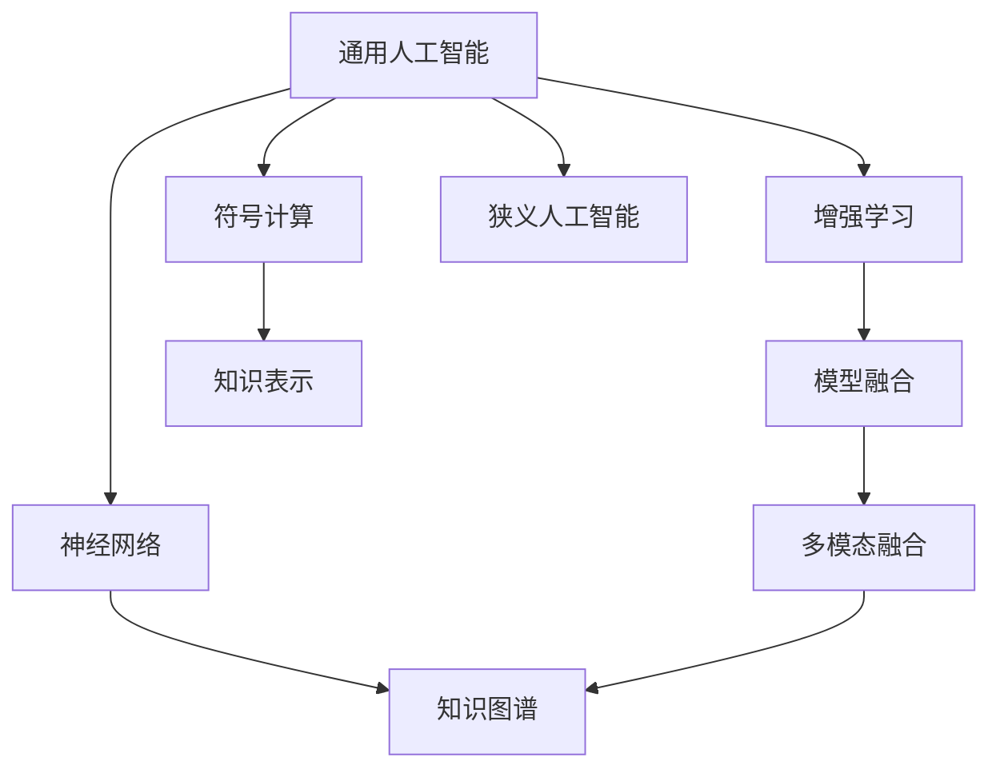
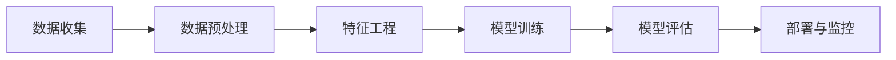
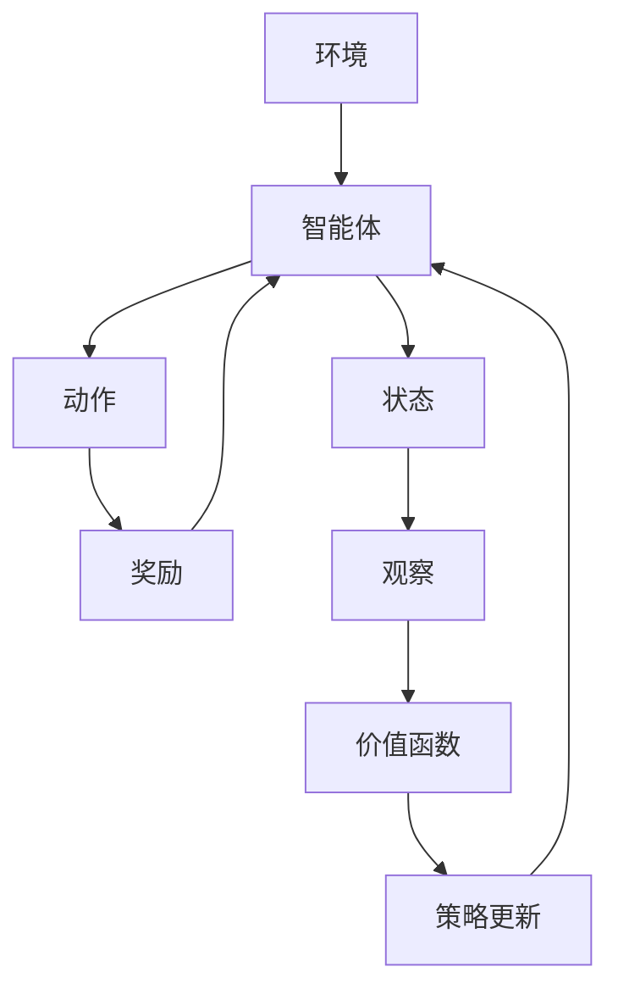
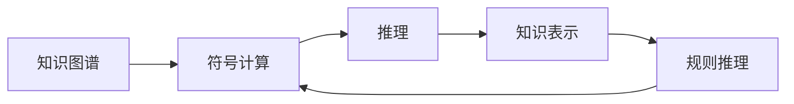
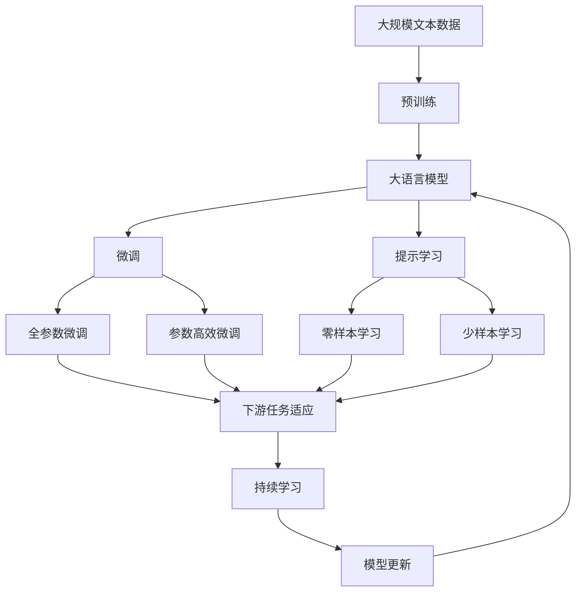

                 

# 通用人工智能的实现条件

## 1. 背景介绍

### 1.1 问题由来
通用人工智能（AGI）是人工智能（AI）领域的一个重要目标，旨在构建能够具备广泛的人类智能能力和理解能力的系统。它超越了狭义的机器学习，涵盖了推理、规划、感知、学习等人类智能的各个方面。通用人工智能的研究挑战巨大，其成果将对人类社会的进步产生深远影响。本文旨在探讨通用人工智能的实现条件，为该领域的研究和实践提供方向。

### 1.2 问题核心关键点
实现通用人工智能的关键在于解决以下几个核心问题：
1. **智能模型**：构建能够处理多领域、多模态信息的智能模型。
2. **知识图谱**：构建全面、精确的知识图谱，支持推理和泛化。
3. **自我学习**：设计自我学习和适应的机制，确保模型能够持续更新和优化。
4. **伦理道德**：确保模型行为符合人类价值观和伦理道德标准。
5. **人机协作**：实现人机协同，充分利用人类专长和机器高效。

### 1.3 问题研究意义
研究通用人工智能的实现条件，对于推动人工智能技术的发展和应用具有重要意义：

1. **加速技术进步**：明确通用人工智能的关键技术和难点，加速相关技术的研究和突破。
2. **提升应用范围**：通过解决特定问题，推动AI技术在更多领域的应用，如医疗、教育、金融等。
3. **保障社会安全**：确保AI技术的安全性和可控性，避免滥用和误用。
4. **促进经济发展**：通过AI技术提升生产力和效率，推动经济增长和社会进步。

## 2. 核心概念与联系

### 2.1 核心概念概述

为更好地理解通用人工智能的实现条件，本节将介绍几个密切相关的核心概念：

- **通用人工智能（AGI）**：指能够具备人类智慧所有能力的AI系统，包括语言理解、推理、感知、规划、学习、创造等。
- **狭义人工智能（Narrow AI）**：指在某一个特定领域内表现优于人类的AI系统，如图像识别、语音识别等。
- **增强学习（Reinforcement Learning）**：指通过奖励机制驱动AI系统不断改进和优化的学习方式。
- **符号计算（Symbolic Computation）**：指使用符号逻辑进行计算和推理的方法。
- **神经网络（Neural Network）**：指通过模拟人脑神经元网络实现计算和推理的AI模型。
- **模型融合（Model Fusion）**：指将多个模型的优势结合，提升AI系统的综合表现。

这些核心概念之间的逻辑关系可以通过以下Mermaid流程图来展示：



这个流程图展示了几大核心概念之间的联系：

1. 通用人工智能可以通过增强学习、符号计算和神经网络等技术实现。
2. 增强学习通过奖励机制驱动模型不断改进。
3. 符号计算通过知识表示进行推理和泛化。
4. 神经网络通过多层网络结构实现复杂的计算和推理。
5. 模型融合将多个模型的优势结合，提升综合表现。
6. 狭义人工智能在特定领域内表现优异。
7. 多模态融合结合了多种模态的信息，提升系统的感知能力。
8. 知识图谱通过知识表示实现推理和泛化。

### 2.2 概念间的关系

这些核心概念之间存在着紧密的联系，形成了通用人工智能的完整生态系统。下面我通过几个Mermaid流程图来展示这些概念之间的关系。

#### 2.2.1 通用人工智能的构建过程



这个流程图展示了构建通用人工智能系统的一般流程：

1. 数据收集：收集并标注大量数据，为模型训练提供数据支持。
2. 数据预处理：清洗、转换和标准化数据，使其适合模型训练。
3. 特征工程：设计有效的特征表示，提升模型的泛化能力。
4. 模型训练：通过选择合适的算法和模型结构，训练出初始模型。
5. 模型评估：使用评估指标评估模型的性能，并进行调优。
6. 部署与监控：将模型部署到实际应用中，并持续监控性能。

#### 2.2.2 增强学习的应用场景



这个流程图展示了增强学习的核心过程：

1. 智能体在环境中执行动作，并接收环境反馈。
2. 环境通过奖励机制评估动作的好坏。
3. 智能体通过观察当前状态，更新其策略。
4. 价值函数评估策略的优劣。
5. 策略更新机制驱动智能体不断改进。

#### 2.2.3 符号计算和知识图谱的联系



这个流程图展示了符号计算和知识图谱之间的联系：

1. 知识图谱通过知识表示建立结构化的知识库。
2. 符号计算通过规则推理进行推理和泛化。
3. 推理通过知识表示进行推理和泛化。
4. 规则推理通过符号计算实现逻辑推理。

### 2.3 核心概念的整体架构

最后，我们用一个综合的流程图来展示这些核心概念在大语言模型微调过程中的整体架构：



这个综合流程图展示了从预训练到微调，再到持续学习的完整过程。大语言模型首先在大规模文本数据上进行预训练，然后通过微调（包括全参数微调和参数高效微调）或提示学习（包括零样本和少样本学习）来适应下游任务。最后，通过持续学习技术，模型可以不断更新和适应新的任务和数据。 通过这些流程图，我们可以更清晰地理解通用人工智能的实现过程中各个核心概念的关系和作用。

## 3. 核心算法原理 & 具体操作步骤

### 3.1 算法原理概述

通用人工智能的实现条件涉及多个核心算法和技术，包括符号计算、神经网络、增强学习、知识图谱等。本节将详细探讨这些算法和技术的基本原理。

#### 3.1.1 符号计算

符号计算是通用人工智能实现中的重要技术之一，它通过使用符号逻辑进行推理和计算。符号计算的核心思想是使用符号表征数据，通过规则推理和逻辑运算实现复杂推理和计算。

- **知识表示**：将数据转化为符号形式，进行逻辑推理和泛化。
- **规则推理**：通过预定义的规则和逻辑进行推理和计算。
- **逻辑演算**：使用一阶逻辑、高阶逻辑等方法进行复杂的推理和计算。

#### 3.1.2 神经网络

神经网络是通用人工智能实现中的另一重要技术，通过模拟人脑神经元网络实现复杂的计算和推理。神经网络的核心思想是构建多层神经网络结构，通过反向传播算法更新权重和偏置，优化模型的表现。

- **前向传播**：将输入数据送入网络，逐层计算输出。
- **损失函数**：通过计算输出与真实标签的差异，衡量模型性能。
- **反向传播**：通过反向传播算法，计算损失函数的梯度，更新模型参数。
- **激活函数**：使用非线性激活函数增强模型的表达能力。
- **正则化**：通过L2正则、Dropout等方法防止过拟合。

#### 3.1.3 增强学习

增强学习是通用人工智能实现中的重要学习技术，通过奖励机制驱动模型不断改进。增强学习的核心思想是让智能体在环境中执行动作，通过环境反馈评估动作的好坏，并不断改进策略。

- **智能体**：指在环境中执行动作的主体。
- **环境**：指智能体执行动作的外部环境。
- **动作**：智能体在环境中执行的具体操作。
- **奖励**：环境对智能体执行动作的反馈。
- **策略**：智能体选择动作的策略。
- **价值函数**：评估策略的优劣。
- **策略更新**：通过奖励机制驱动策略不断改进。

#### 3.1.4 知识图谱

知识图谱是通用人工智能实现中的重要知识表示技术，通过结构化的知识库实现推理和泛化。知识图谱的核心思想是构建结构化的知识库，通过逻辑推理和规则推理实现复杂的推理和计算。

- **实体**：指知识图谱中的节点。
- **关系**：指知识图谱中的边。
- **事实**：指知识图谱中的数据。
- **推理**：通过知识图谱进行推理和泛化。
- **规则推理**：通过预定义的规则进行推理和计算。
- **查询**：通过查询知识图谱获取信息。
- **知识表示**：通过符号逻辑和结构化的数据表示知识。

### 3.2 算法步骤详解

通用人工智能的实现条件涉及多个核心算法和技术，下面详细介绍每个算法的详细步骤。

#### 3.2.1 符号计算

符号计算的主要步骤包括：

1. **知识收集**：收集领域内的知识，构建知识库。
2. **知识表示**：将知识转化为符号形式，进行逻辑推理和泛化。
3. **规则推理**：通过预定义的规则和逻辑进行推理和计算。
4. **逻辑演算**：使用一阶逻辑、高阶逻辑等方法进行复杂的推理和计算。
5. **模型评估**：使用评估指标评估模型的性能，并进行调优。

#### 3.2.2 神经网络

神经网络的主要步骤包括：

1. **数据收集**：收集并标注大量数据，为模型训练提供数据支持。
2. **数据预处理**：清洗、转换和标准化数据，使其适合模型训练。
3. **特征工程**：设计有效的特征表示，提升模型的泛化能力。
4. **模型选择**：选择合适的模型结构，如卷积神经网络（CNN）、循环神经网络（RNN）等。
5. **模型训练**：通过反向传播算法更新模型参数，优化模型的表现。
6. **模型评估**：使用评估指标评估模型的性能，并进行调优。
7. **模型部署**：将模型部署到实际应用中，并持续监控性能。

#### 3.2.3 增强学习

增强学习的主要步骤包括：

1. **环境设计**：设计环境，定义状态、动作和奖励。
2. **智能体设计**：设计智能体，选择合适的算法和模型。
3. **策略选择**：选择合适的策略，如深度Q网络（DQN）、策略梯度等。
4. **动作执行**：在环境中执行动作，并接收环境反馈。
5. **奖励评估**：通过奖励机制评估动作的好坏。
6. **策略更新**：通过奖励机制驱动策略不断改进。
7. **模型评估**：使用评估指标评估模型的性能，并进行调优。

#### 3.2.4 知识图谱

知识图谱的主要步骤包括：

1. **数据收集**：收集领域内的知识，构建知识库。
2. **实体识别**：识别知识图谱中的实体和关系。
3. **知识表示**：将知识转化为符号形式，进行逻辑推理和泛化。
4. **规则推理**：通过预定义的规则和逻辑进行推理和计算。
5. **逻辑演算**：使用一阶逻辑、高阶逻辑等方法进行复杂的推理和计算。
6. **模型评估**：使用评估指标评估模型的性能，并进行调优。

### 3.3 算法优缺点

通用人工智能的实现条件涉及多个核心算法和技术，每个算法和技术的优缺点如下：

#### 3.3.1 符号计算

优点：
1. 符号计算具有严格的逻辑推理能力，可以处理复杂的逻辑推理任务。
2. 符号计算的推理过程透明，易于理解和解释。
3. 符号计算具有广泛的适用范围，适用于各种领域和任务。

缺点：
1. 符号计算的推理过程繁琐，计算量较大。
2. 符号计算的数据处理能力较弱，难以处理大规模数据。
3. 符号计算的推理过程需要大量的人工干预，难以自动完成。

#### 3.3.2 神经网络

优点：
1. 神经网络具有强大的数据处理能力，适用于大规模数据的处理和分析。
2. 神经网络具有自适应能力，可以自动调整模型参数，优化模型性能。
3. 神经网络的推理过程快速，计算效率高。

缺点：
1. 神经网络需要大量的标注数据进行训练，标注成本高。
2. 神经网络的黑盒特性，难以理解和解释推理过程。
3. 神经网络容易出现过拟合问题，需要大量的数据和计算资源。

#### 3.3.3 增强学习

优点：
1. 增强学习具有自适应能力，可以自动调整策略，优化模型性能。
2. 增强学习的奖励机制，可以激励智能体进行有效的探索和优化。
3. 增强学习的计算效率高，适用于大规模数据的处理和分析。

缺点：
1. 增强学习的奖励设计复杂，难以准确评估动作的好坏。
2. 增强学习的训练过程需要大量的计算资源，训练成本高。
3. 增强学习容易陷入局部最优解，难以找到全局最优解。

#### 3.3.4 知识图谱

优点：
1. 知识图谱具有结构化的知识表示，可以处理大规模知识库。
2. 知识图谱的推理过程透明，易于理解和解释。
3. 知识图谱具有广泛的适用范围，适用于各种领域和任务。

缺点：
1. 知识图谱的构建和维护成本高，需要大量的人工干预。
2. 知识图谱的推理过程繁琐，计算量较大。
3. 知识图谱的数据更新和维护复杂，难以保持数据的实时性。

### 3.4 算法应用领域

通用人工智能的实现条件涉及多个核心算法和技术，这些算法和技术在各个领域中都有广泛的应用。

#### 3.4.1 符号计算

符号计算在知识工程、逻辑推理、人工智能等领域有广泛应用，如专家系统、知识管理系统、逻辑推理机等。

#### 3.4.2 神经网络

神经网络在图像识别、语音识别、自然语言处理等领域有广泛应用，如卷积神经网络（CNN）用于图像识别，循环神经网络（RNN）用于语音识别，长短期记忆网络（LSTM）用于自然语言处理等。

#### 3.4.3 增强学习

增强学习在自动驾驶、机器人控制、游戏AI等领域有广泛应用，如AlphaGo使用增强学习算法进行围棋对战。

#### 3.4.4 知识图谱

知识图谱在知识管理、自然语言处理、人工智能等领域有广泛应用，如知识图谱用于智能问答系统、推荐系统、搜索引擎等。

## 4. 数学模型和公式 & 详细讲解 & 举例说明

### 4.1 数学模型构建

通用人工智能的实现条件涉及多个核心算法和技术，这些算法和技术通常使用数学模型进行描述和分析。以下是一些关键的数学模型和公式。

#### 4.1.1 符号计算

符号计算的核心思想是使用符号逻辑进行推理和计算，以下是一些常用的符号计算模型：

1. **一阶逻辑推理**：
   - 公式：
   $$
   \forall x \in D, \forall y \in D, (x = y \rightarrow p(x,y))
   $$
   - 解释：对于任意的x、y，如果x等于y，则p(x,y)成立。

2. **高阶逻辑推理**：
   - 公式：
   $$
   \forall x \in D, \forall y \in D, (x = y \rightarrow p(x,y))
   $$
   - 解释：对于任意的x、y，如果x等于y，则p(x,y)成立。

#### 4.1.2 神经网络

神经网络的核心思想是构建多层网络结构，通过反向传播算法更新权重和偏置，优化模型的表现。以下是一些常用的神经网络模型：

1. **前向传播**：
   - 公式：
   $$
   y = f(Wx + b)
   $$
   - 解释：前向传播将输入数据x通过网络逐层计算，输出y。

2. **损失函数**：
   - 公式：
   $$
   L = \frac{1}{N} \sum_{i=1}^N (y_i - \hat{y_i})^2
   $$
   - 解释：损失函数计算模型输出与真实标签的差异。

3. **反向传播**：
   - 公式：
   $$
   \frac{\partial L}{\partial W} = \frac{\partial L}{\partial y} \frac{\partial y}{\partial z} \frac{\partial z}{\partial W}
   $$
   - 解释：反向传播计算损失函数的梯度，更新模型参数。

#### 4.1.3 增强学习

增强学习的核心思想是让智能体在环境中执行动作，通过环境反馈评估动作的好坏，并不断改进策略。以下是一些常用的增强学习模型：

1. **深度Q网络（DQN）**：
   - 公式：
   $$
   Q(s,a) = r + \gamma \max_a Q(s',a')
   $$
   - 解释：深度Q网络通过奖励机制驱动策略不断改进。

2. **策略梯度**：
   - 公式：
   $$
   \frac{\partial \log \pi(a|s)}{\partial \theta} = \frac{1}{N} \sum_{i=1}^N \frac{A_i}{\pi(a_i|s_i)}
   $$
   - 解释：策略梯度通过奖励机制驱动策略不断改进。

#### 4.1.4 知识图谱

知识图谱的核心思想是构建结构化的知识库，通过逻辑推理和规则推理实现复杂的推理和计算。以下是一些常用的知识图谱模型：

1. **实体识别**：
   - 公式：
   $$
   e = \text{Entity}(s)
   $$
   - 解释：实体识别通过模式匹配和分类算法识别知识图谱中的实体。

2. **关系识别**：
   - 公式：
   $$
   r = \text{Relation}(s)
   $$
   - 解释：关系识别通过模式匹配和分类算法识别知识图谱中的关系。

3. **推理**：
   - 公式：
   $$
   \text{Reason}(\mathcal{G}, r)
   $$
   - 解释：推理通过知识图谱进行推理和泛化。

### 4.2 公式推导过程

以下是一些关键公式的推导过程。

#### 4.2.1 符号计算

符号计算的推理过程可以使用一阶逻辑、高阶逻辑等方法进行推导。以下是一阶逻辑推理的推导过程：

1. **一阶逻辑推理**：
   - 公式：
   $$
   \forall x \in D, \forall y \in D, (x = y \rightarrow p(x,y))
   $$
   - 解释：对于任意的x、y，如果x等于y，则p(x,y)成立。

2. **一阶逻辑推理的推理规则**：
   - 公式：
   $$
   \infer[\forall\text{INTRODUCED}]
   $$
   - 解释：推导符号表示一阶逻辑推理的推理规则。

#### 4.2.2 神经网络

神经网络的推理过程可以使用前向传播、反向传播等方法进行推导。以下是前向传播的推导过程：

1. **前向传播**：
   - 公式：
   $$
   y = f(Wx + b)
   $$
   - 解释：前向传播将输入数据x通过网络逐层计算，输出y。

2. **前向传播的推导过程**：
   - 公式：
   $$
   h_1 = W_1x + b_1
   $$
   - 解释：计算第一层神经元的输出。

3. **前向传播的推导过程**：
   - 公式：
   $$
   h_2 = W_2h_1 + b_2
   $$
   - 解释：计算第二层神经元的输出。

#### 4.2.3 增强学习

增强学习的推理过程可以使用DQN、策略梯度等方法进行推导。以下是DQN的推导过程：

1. **深度Q网络（DQN）**：
   - 公式：
   $$
   Q(s,a) = r + \gamma \max_a Q(s',a')
   $$
   - 解释：深度Q网络通过奖励机制驱动策略不断改进。

2. **深度Q网络的推导过程**：
   - 公式：
   $$
   Q(s,a) = r + \gamma \max_a Q(s',a')
   $$
   - 解释：推导DQN的推理过程。

#### 4.2.4 知识图谱

知识图谱的推理过程可以使用规则推理、逻辑演算等方法进行推导。以下是规则推理的推导过程：

1. **规则推理**：
   - 公式：
   $$
   \text{Reason}(\mathcal{G}, r)
   $$
   - 解释：推理通过知识图谱进行推理和泛化。

2. **规则推理的推导过程**：
   - 公式：
   $$
   \infer[\text{QUERY}]
   $$
   - 解释：推导规则推理的推理过程。

### 4.3 案例分析与讲解

为了更好地理解通用人工智能的实现条件，本节将通过几个案例进行分析讲解。

#### 4.3.1 医疗诊断系统

医疗诊断系统是一个典型的通用人工智能应用场景，涉及符号计算、神经网络和增强学习等多种技术。

1. **符号计算**：构建知识图谱，表示疾病、症状、治疗等知识。
2. **神经网络**：使用卷积神经网络（CNN）进行图像识别，提取病灶特征。
3. **增强学习**：使用DQN算法进行决策优化，推荐最佳治疗方案。

#### 4.3.2 智能问答系统

智能问答系统是一个典型的通用人工智能应用场景，涉及符号计算、神经网络和知识图谱等多种技术。

1. **符号计算**：使用规则推理进行自然语言处理，理解用户意图。
2. **神经网络**：使用循环神经网络（RNN）进行对话生成，生成自然流畅的回复。
3. **知识图谱**：构建知识图谱，提供事实和规则支持。

#### 4.3.3 自动驾驶系统

自动驾驶系统是一个典型的通用人工智能应用场景，涉及符号计算、神经网络和增强学习等多种技术。

1. **符号计算**：构建知识图谱，表示交通规则、道路信息等知识。
2. **神经网络**：使用卷积神经网络（CNN）进行图像识别，检测道路标志、车辆等。
3. **增强学习**：使用DQN算法进行决策优化，实现智能驾驶。

## 5. 项目实践：代码实例和详细解释说明

### 5.1 开发环境搭建

在进行通用人工智能的实现条件研究时，我们需要准备好开发环境。以下是使用Python进行PyTorch开发的环境配置流程：

1. 安装Anaconda：从官网下载并安装Anaconda，用于创建独立的Python环境。

2. 创建并激活虚拟环境：
```bash
conda create -n pytorch-env python=3.8 
conda activate pytorch-env
```

3. 安装PyTorch：根据CUDA版本，从官网获取对应的安装命令。例如：
```bash
conda install pytorch torchvision torchaudio cudatoolkit=11.1 -c pytorch -c conda-forge
```

4. 安装Transformers库：
```bash
pip install transformers
```

5. 安装各类工具包：
```bash
pip install numpy pandas scikit-learn matplotlib tqdm jupyter notebook ipython
```

完成上述步骤后，即可在`pytorch-env`环境中开始通用人工智能的研究实践。

### 5.2 源代码详细实现

下面我以医疗诊断系统为例，给出使用Transformers库对BERT模型进行微调的PyTorch代码实现。

首先，定义医疗诊断系统的数据处理函数：

```python
from transformers import BertTokenizer
from torch.utils.data import Dataset
import torch

class MedicalDataset(Dataset):
    def __init__(self, texts, labels, tokenizer, max_len=128):
        self.text

