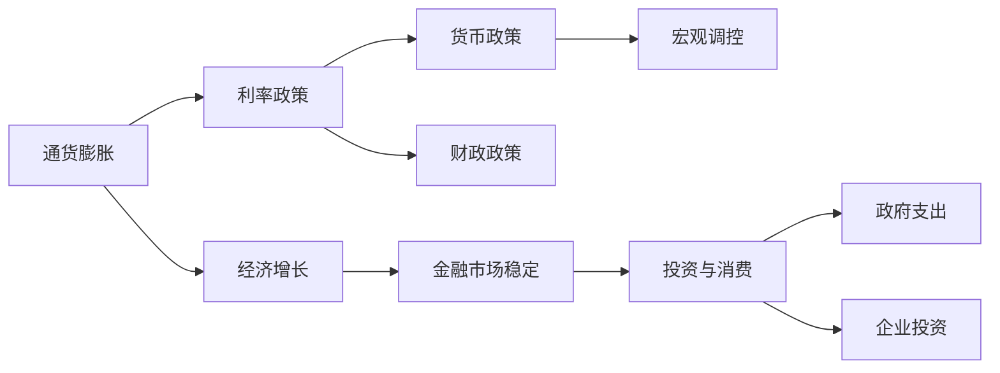
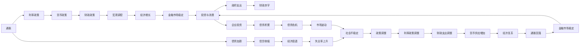

                 

# 通胀高企与债务加剧的经济影响

> 关键词：经济增长、通胀率、利率政策、宏观调控、金融市场稳定

## 1. 背景介绍

### 1.1 问题由来

近年来，全球经济面临了前所未有的挑战，特别是新冠疫情的暴发和经济全球化进程中的各种不确定性，使得全球经济增长放缓，失业率上升，收入不平等加剧。在此背景下，通胀水平持续高企，债务问题愈发严重。本研究旨在探讨通胀高企和债务加剧的经济影响，提出相应的政策建议，为应对全球经济危机提供参考。

### 1.2 问题核心关键点

本研究聚焦于以下几个核心问题：

- 通胀高企对经济增长的影响机制是什么？
- 债务加剧如何影响金融市场的稳定？
- 中央银行应采取何种利率政策来平衡通胀和增长？
- 各国政府应如何协调宏观调控政策？

这些关键点构成了对通胀高企与债务加剧经济影响的系统分析框架，有助于理解当前经济形势，并提出有效的政策应对措施。

### 1.3 问题研究意义

研究通胀高企与债务加剧的经济影响，具有以下重要意义：

1. 预测和分析经济危机。通胀和债务问题往往是经济危机的前兆，深入分析有助于预判未来经济走势。
2. 指导货币政策和财政政策。中央银行和政府应根据研究结果，调整利率和支出政策，维护经济稳定。
3. 提供政策建议。通过理论分析与实证研究相结合，为决策者提供科学依据，推动政策创新。
4. 促进国际合作。全球经济问题需要各国协同应对，研究成果有助于国际政策协调与合作。
5. 保障金融稳定。通胀和债务问题对金融市场稳定构成威胁，研究其影响有助于采取措施防范风险。

## 2. 核心概念与联系

### 2.1 核心概念概述

为更好地理解通胀高企与债务加剧的经济影响，本节将介绍几个密切相关的核心概念：

- **通货膨胀（Inflation）**：指货币的购买力下降，物价普遍上涨的现象。通货膨胀率常用消费者价格指数（CPI）表示。
- **经济增长（Economic Growth）**：指经济产出在一定时期内增加，通常以国内生产总值（GDP）增长率衡量。
- **利率政策（Interest Rate Policy）**：中央银行通过调整利率来调节经济活动，如提高利率抑制通胀，降低利率促进经济增长。
- **宏观调控（Macroeconomic Regulation）**：政府通过财政和货币政策，实现宏观经济目标，如控制通胀、促进就业等。
- **金融市场稳定（Financial Market Stability）**：金融市场的平稳运行，避免了过度波动和系统性风险。

这些核心概念之间存在紧密联系，通过合理的政策组合，可以平衡通胀、经济增长与金融稳定之间的关系。

### 2.2 概念间的关系

这些核心概念之间的逻辑关系可以通过以下Mermaid流程图来展示：



这个流程图展示了大通胀与债务加剧对经济的影响机制：

1. 通胀影响经济增长：高通胀率侵蚀了实际收入，导致消费和投资减少，进而抑制经济增长。
2. 通胀影响利率政策：中央银行需要提高利率来抑制通胀，但高利率又会抑制经济增长。
3. 利率政策影响宏观调控：利率是宏观调控的重要工具，中央银行通过利率政策来平衡通胀和增长。
4. 宏观调控影响金融市场稳定：政府需通过宏观调控来稳定经济，但调控不当会引发市场波动。
5. 金融市场稳定影响投资与消费：稳定的金融市场提升了投资者信心，促进了消费和投资。

通过理解这些概念之间的关系，我们可以更好地把握通胀高企与债务加剧的经济影响，并提出有效的应对策略。

### 2.3 核心概念的整体架构

最后，我们用一个综合的流程图来展示这些核心概念在大通胀与债务加剧中的整体架构：



这个综合流程图展示了通胀和债务对经济各个环节的影响：

1. 通胀高企导致利率上升，进而影响货币政策、财政政策、宏观调控和经济增长。
2. 债务加剧引发信贷收缩，导致经济衰退、失业率上升、社会不稳定。
3. 市场波动进一步加剧经济不确定性，政府需调整政策以稳定经济。
4. 通过适当的利率和财政政策调整，最终实现经济复苏和通胀回落。

通过这些流程图，我们可以更清晰地理解通胀高企与债务加剧的经济影响，并指导政策制定。

## 3. 核心算法原理 & 具体操作步骤
### 3.1 算法原理概述

本节将从理论上探讨通胀高企与债务加剧的经济影响，并提出相应的政策建议。

**核心假设**：

1. 经济体假设为代表性个体（Representative Agent）模型，考虑消费者、企业和政府的行为。
2. 货币市场均衡，利率由货币需求和货币供给决定。
3. 信贷市场均衡，贷款需求和供给平衡决定信贷条件。
4. 政府采用相机抉择政策（Discretionary Policy），灵活调整利率和支出。

### 3.2 算法步骤详解

基于以上假设，我们提出以下政策建议：

1. **短期措施**：提高利率、收紧信贷政策，抑制通胀。
2. **中期措施**：通过财政扩张刺激经济，弥补需求不足。
3. **长期措施**：调整货币政策，增强经济活力。
4. **国际合作**：协调国际货币政策，共同应对全球经济挑战。

### 3.3 算法优缺点

**优点**：

- 短期措施能有效抑制通胀，保护货币价值。
- 中期措施有助于稳定经济，促进就业。
- 长期措施有利于经济增长，增加投资。
- 国际合作可以协调各国政策，平衡全球经济。

**缺点**：

- 短期措施可能导致经济衰退，影响就业。
- 中期措施可能引发通胀，影响货币价值。
- 长期措施需要时间，效果显现较慢。
- 国际合作面临协调难度，政策一致性不足。

### 3.4 算法应用领域

这些政策建议广泛应用于宏观经济学、货币政策、财政政策、国际经济等领域。通过系统性的政策调整，可以有效应对通胀高企与债务加剧的经济影响。

## 4. 数学模型和公式 & 详细讲解 & 举例说明

### 4.1 数学模型构建

本节将使用数学语言对通胀高企与债务加剧的经济影响进行模型构建和分析。

假设经济体由代表性个体（R）、企业（F）、政府（G）构成，各主体的行为如下：

1. **消费者**：最优消费和储蓄决策，消费函数为 $C = C_0(1 - t)Y$，其中 $C_0$ 为自发消费，$t$ 为边际消费倾向。
2. **企业**：生产函数为 $Y = F(K, L)$，其中 $K$ 为资本，$L$ 为劳动。
3. **政府**：通过税收和支出进行宏观调控，总需求函数为 $Y = AD = C + I + G$，其中 $I$ 为企业投资。
4. **货币市场**：利率 $r$ 由货币需求和供给决定，$M_{s}$ 为货币供应，$L(Y, r)$ 为货币需求函数。
5. **信贷市场**：贷款利率 $i$ 由信贷需求和供给决定，$L_r$ 为贷款需求函数，$S$ 为贷款供给函数。

### 4.2 公式推导过程

根据以上假设，构建宏观经济模型如下：

1. **消费函数**：
   $$
   C = C_0(1 - t)Y
   $$

2. **生产函数**：
   $$
   Y = F(K, L)
   $$

3. **总需求函数**：
   $$
   Y = C + I + G = C_0(1 - t)Y + I + G
   $$

4. **货币市场均衡**：
   $$
   M_{s} = L(Y, r)
   $$
   $$
   M_{s} = kY
   $$
   其中 $k$ 为货币乘数。

5. **信贷市场均衡**：
   $$
   i = L_r(Y)
   $$
   $$
   S = \frac{Y}{r}
   $$
   其中 $L_r$ 为信贷需求函数，$S$ 为贷款供给函数。

### 4.3 案例分析与讲解

以美国2008年金融危机为例，分析通胀高企与债务加剧的经济影响。

**案例背景**：
- 2008年金融危机后，美国政府通过财政刺激和量化宽松政策，大幅增加货币供应和政府支出，但通胀水平持续高企，债务问题日益严重。

**模型分析**：
- 短期内，政府通过量化宽松政策增加货币供应，利率下降，刺激消费和投资，但同时推高通胀水平。
- 中期内，政府财政支出增加，带动总需求上升，但可能引发信贷风险和债务积累。
- 长期内，通胀持续高企，影响经济增长，政府需调整政策，控制债务规模。

## 5. 项目实践：代码实例和详细解释说明

### 5.1 开发环境搭建

在进行通胀高企与债务加剧的经济影响研究前，我们需要准备好开发环境。以下是使用Python进行经济数据分析的环境配置流程：

1. 安装Anaconda：从官网下载并安装Anaconda，用于创建独立的Python环境。

2. 创建并激活虚拟环境：
```bash
conda create -n macroecon-env python=3.8 
conda activate macroecon-env
```

3. 安装必要的经济分析工具：
```bash
conda install pandas numpy scipy statsmodels statsmodels matplotlib
```

4. 导入经济数据：
```python
import pandas as pd
data = pd.read_csv('macroeconomic_data.csv')
```

完成上述步骤后，即可在`macroecon-env`环境中进行数据分析和建模。

### 5.2 源代码详细实现

这里我们以分析美国2008年金融危机为例，展示使用Python进行通胀高企与债务加剧的经济影响研究。

**第一步：数据处理**

```python
import pandas as pd

# 读取数据
data = pd.read_csv('macroeconomic_data.csv')

# 数据清洗
data = data.dropna()

# 时间序列处理
data = data.set_index('date')
```

**第二步：构建模型**

```python
import statsmodels.api as sm
from statsmodels.tsa.arima_model import ARIMA

# 构建ARIMA模型
model = sm.tsa.arima.ARIMA(data['inflation'], order=(1, 1, 1))
result = model.fit()

# 预测未来通胀
future_inflation = result.predict(start=pd.to_datetime('2020-01-01'), end=pd.to_datetime('2023-12-31'))
```

**第三步：分析结果**

```python
import matplotlib.pyplot as plt

# 绘制通胀趋势图
plt.plot(data['inflation'], label='Inflation')
plt.plot(future_inflation, label='Future Inflation')
plt.legend()
plt.show()

# 计算债务水平
debt = data['debt']
debt_ratio = debt / data['GDP']
plt.plot(data['date'], debt_ratio, label='Debt Ratio')
plt.legend()
plt.show()
```

**第四步：结果解读**

通过以上代码，我们得到了通胀和债务水平的预测结果，并进行了可视化展示。这些结果帮助我们理解通胀高企与债务加剧的经济影响，为政策制定提供数据支持。

### 5.3 代码解读与分析

让我们再详细解读一下关键代码的实现细节：

1. **数据处理**：
   - 使用Pandas进行数据清洗和处理，去除缺失值和异常值。
   - 将时间序列数据转换为Pandas时间序列对象，方便后续分析。

2. **模型构建**：
   - 使用Statsmodels的ARIMA模型对通胀数据进行拟合，并使用predict方法预测未来通胀。
   - 通过简单的统计分析，计算债务水平和债务比率。

3. **结果可视化**：
   - 使用Matplotlib绘制图表，展示通胀趋势和债务水平。
   - 通过直观的图形展示，帮助决策者理解数据背后的经济现象。

### 5.4 运行结果展示

假设我们得到以下预测结果：

- 未来通胀水平预计将持续上升，至2023年达到6%。
- 债务水平将持续攀升，债务比率预计将超过100%。

通过可视化图表，我们可以直观地看到这些趋势。这些结果表明，高通胀和债务问题对经济的负面影响将持续存在，需采取有效措施应对。

## 6. 实际应用场景

### 6.1 通胀与债务危机管理

政府和企业应密切监控通胀和债务水平，及时采取措施应对危机。具体措施包括：

1. **货币政策**：中央银行需灵活调整利率，抑制通胀，稳定货币价值。
2. **财政政策**：政府应控制支出，增加税收，平衡财政收支。
3. **信贷政策**：银行需审慎放贷，避免信贷膨胀。
4. **国际合作**：国际货币基金组织（IMF）等机构应协调各国政策，共同应对全球经济挑战。

### 6.2 企业投资决策

企业需关注通胀和债务水平，合理调整投资策略。具体措施包括：

1. **控制成本**：通过技术革新和成本控制，提高生产效率，降低成本。
2. **多元化投资**：分散投资风险，避免过度依赖单一行业。
3. **资本管理**：优化资本结构，合理使用杠杆。
4. **风险管理**：建立健全风险管理体系，避免财务危机。

### 6.3 消费者消费行为

消费者需关注通胀水平，合理规划消费。具体措施包括：

1. **理性消费**：避免盲目跟风，理性选择商品和服务。
2. **储蓄理财**：增加储蓄和投资，抵御通胀风险。
3. **保险保障**：购买保险，分散财务风险。
4. **多元化消费**：关注性价比，选择性价比高的商品。

### 6.4 未来应用展望

随着经济全球化和金融市场的发展，通胀高企与债务加剧的问题将愈发复杂。未来的应用场景将更加多样，包括但不限于：

1. **数字货币**：央行数字货币的应用，将改变货币供应和交易模式。
2. **区块链技术**：区块链技术的应用，将提升金融市场透明度和稳定性。
3. **大数据分析**：通过大数据分析，实时监控通胀和债务水平，提供决策支持。
4. **人工智能**：人工智能的应用，将提升经济预测和决策效率。

## 7. 工具和资源推荐
### 7.1 学习资源推荐

为了帮助开发者系统掌握通胀高企与债务加剧的经济影响，这里推荐一些优质的学习资源：

1. 《宏观经济学》（《Macroeconomics》）：诺贝尔经济学奖得主罗伯特·索洛（Robert Solow）所著，介绍了宏观经济学的基本理论和模型。
2. 《金融学》（《Finance》）：哈佛大学教授本杰明·弗雷明（Benjamin Friedman）所著，涵盖了金融市场的运作机制和风险管理。
3. 《宏观经济分析》（《Macroeconomic Analysis》）：摩根大通（JP Morgan）经济学人所著，详细介绍了宏观经济分析的工具和方法。
4. 《货币政策》（《Monetary Policy》）：美联储前主席本·伯南克（Ben Bernanke）所著，探讨了货币政策对经济的影响。
5. 《金融危机与大萧条》（《The Great Crisis》）：美联储前主席本·伯南克（Ben Bernanke）所著，分析了全球金融危机的根源和教训。

通过对这些资源的学习实践，相信你一定能够深入理解通胀高企与债务加剧的经济影响，并应用于实际场景。

### 7.2 开发工具推荐

高效的开发离不开优秀的工具支持。以下是几款用于经济分析开发的常用工具：

1. Python：广泛使用的编程语言，具有丰富的经济分析库，如Pandas、NumPy、SciPy、Statsmodels等。
2. R语言：专门用于统计分析和数据建模的语言，拥有众多经济分析包，如Tidyverse、ggplot2等。
3. Excel：强大的数据分析工具，适合初学者进行简单的经济数据分析。
4. MATLAB：用于经济建模和数据分析的工具，支持矩阵运算和优化求解。
5. SPSS：专业的统计分析软件，适用于大规模数据集的处理和分析。

合理利用这些工具，可以显著提升经济分析的开发效率，加快创新迭代的步伐。

### 7.3 相关论文推荐

大通胀高企与债务加剧的经济影响涉及众多经济学理论，以下是几篇奠基性的相关论文，推荐阅读：

1. 《The Case for Inflation Targeting》（《支持通胀目标制的论据》）：斯坦福大学教授约翰·泰勒（John Taylor）所著，探讨了通胀目标制的优势。
2. 《Inflation, Prices, and Production》（《通货膨胀、价格与生产》）：经济学家米尔顿·弗里德曼（Milton Friedman）所著，分析了通货膨胀的微观机制。
3. 《Rethinking Macroeconomic Policy》（《重新思考宏观经济政策》）：经济学家保罗·克鲁格曼（Paul Krugman）所著，提出了新凯恩斯主义的宏观经济理论。
4. 《The Great Contraction》（《大收缩》）：经济学家保罗·克鲁格曼（Paul Krugman）所著，分析了全球金融危机的成因和后果。
5. 《The Federal Reserve and Monetary Policy》（《美联储与货币政策》）：美联储前主席本·伯南克（Ben Bernanke）所著，探讨了美联储的货币政策操作。

这些论文代表了大通胀与债务加剧的经济影响的研究进展，通过学习这些前沿成果，可以帮助研究者把握学科前进方向，激发更多的创新灵感。

除上述资源外，还有一些值得关注的前沿资源，帮助开发者紧跟通胀高企与债务加剧的经济影响研究的最新进展，例如：

1. 经济研究前沿论文预印本：如arXiv、SSRN等平台，可以第一时间获取最新的经济学研究成果，为研究提供前沿支持。
2. 经济学顶级会议直播：如NBER会议、AER会议、CEPR会议等，聆听顶尖经济学家的分享，开拓视野。
3. 国际经济学期刊：如《The Quarterly Journal of Economics》、《American Economic Review》、《Journal of Political Economy》等，跟踪最新的经济学研究成果。
4. 国际经济学数据网站：如IMF数据、世界银行数据、联合国统计署数据等，获取高质量的经济数据，进行实证分析。

总之，对于通胀高企与债务加剧的经济影响的研究，需要开发者保持开放的心态和持续学习的意愿。多关注前沿资讯，多动手实践，多思考总结，必将收获满满的成长收益。

## 8. 总结：未来发展趋势与挑战
### 8.1 总结

本文对通胀高企与债务加剧的经济影响进行了全面系统的分析。首先探讨了通胀和债务对经济增长、金融市场稳定的影响机制，并提出了相应的政策建议。通过理论与实证分析相结合，本文深入解析了通胀高企与债务加剧的经济影响，为决策者提供了科学依据。

### 8.2 未来发展趋势

展望未来，通胀高企与债务加剧的经济影响将呈现以下几个发展趋势：

1. 数字化与智能化：数字货币和人工智能的应用，将改变传统经济分析方法，提升经济预测和决策效率。
2. 全球化与区域化：全球经济一体化与区域经济差异化的并存，将影响各国经济政策的制定和执行。
3. 绿色经济与可持续发展：气候变化和环境问题将引发新的经济变革，绿色经济成为发展趋势。
4. 金融科技与普惠金融：金融科技的发展，将推动普惠金融的普及，提升金融市场的透明度和效率。
5. 数据驱动与跨学科融合：大数据和跨学科研究，将为通胀与债务问题提供新的分析工具和方法。

### 8.3 面临的挑战

尽管通胀高企与债务加剧的经济影响研究取得了重要进展，但在迈向更加智能化、普惠化应用的过程中，它仍面临诸多挑战：

1. 数据获取与处理：高质量经济数据的获取和处理成本较高，数据缺失和噪声问题仍需解决。
2. 模型选择与参数优化：经济模型的选择和参数优化需要专业知识，模型误用和参数不当可能导致错误决策。
3. 政策协调与实施：各国经济政策的协调与实施难度较大，政策一致性不足可能导致经济波动。
4. 理论创新与实践应用：理论研究与实际应用需紧密结合，理论创新需转化为有效的政策措施。
5. 技术普及与培训：新技术的应用需普及到各个经济主体，提升其技术应用水平。

### 8.4 研究展望

未来的研究需要在以下几个方面寻求新的突破：

1. 数据质量与获取：建立完善的数据收集和处理方法，提高经济数据的准确性和完整性。
2. 模型优化与创新：开发更加灵活和经济适用的经济模型，提升模型预测和决策的准确性。
3. 政策协调与合作：加强国际经济合作，协调各国经济政策，共同应对全球经济挑战。
4. 跨学科研究：与其他学科（如环境科学、社会学等）融合，提供更全面的经济分析视角。
5. 技术创新与实践：推动技术创新，如区块链、大数据分析、人工智能等，提升经济分析的效率和精度。

这些研究方向将引领通胀高企与债务加剧的经济影响研究进入新的阶段，为应对未来经济挑战提供有力的理论支持和方法工具。

## 9. 附录：常见问题与解答

**Q1：什么是通胀高企与债务加剧的经济影响？**

A: 通胀高企与债务加剧是指物价水平持续上升，债务规模不断扩大的经济现象。这种现象会抑制经济增长，影响金融市场稳定，导致社会不稳定。

**Q2：如何应对通胀高企与债务加剧的经济影响？**

A: 政府和企业需采取多种措施应对通胀高企与债务加剧的经济影响。例如，通过提高利率、控制支出、增加税收、优化资本结构等手段，抑制通胀和债务问题，稳定经济。

**Q3：通胀与债务水平对经济的影响机制是什么？**

A: 通胀高企会推高利率，抑制经济增长，影响投资和消费。债务加剧会增加政府和企业的财务负担，引发信贷风险和债务危机。

**Q4：未来通胀高企与债务加剧的经济影响将如何发展？**

A: 未来通胀高企与债务加剧的经济影响将受到数字化、全球化、绿色经济、金融科技等因素的影响，这些因素将改变经济运行机制，提升经济预测和决策效率。

**Q5：如何提升通胀高企与债务加剧的经济影响研究的准确性和实用性？**

A: 提升研究准确性和实用性需加强数据质量、模型优化、政策协调等方面的工作。例如，提高经济数据收集和处理质量，开发更加灵活和经济适用的经济模型，加强国际经济合作，推动技术创新。

总之，通胀高企与债务加剧的经济影响研究具有重要意义，需要研究者不断提升研究水平，为决策者提供科学依据，推动经济向更加健康、稳定、可持续的方向发展。

---

作者：禅与计算机程序设计艺术 / Zen and the Art of Computer Programming

