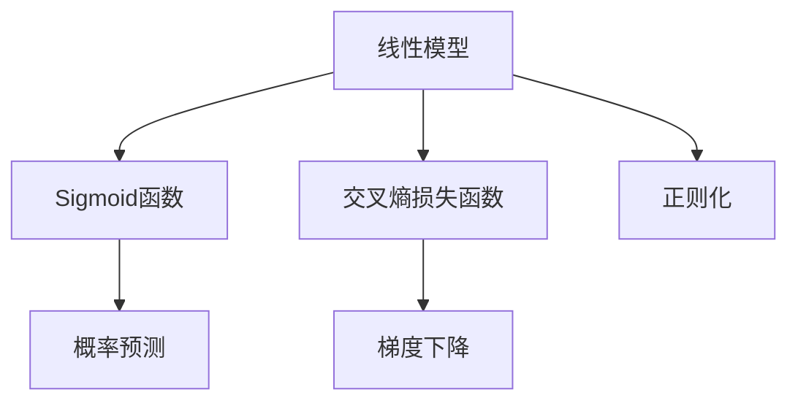
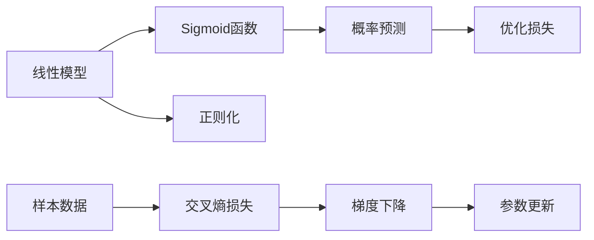
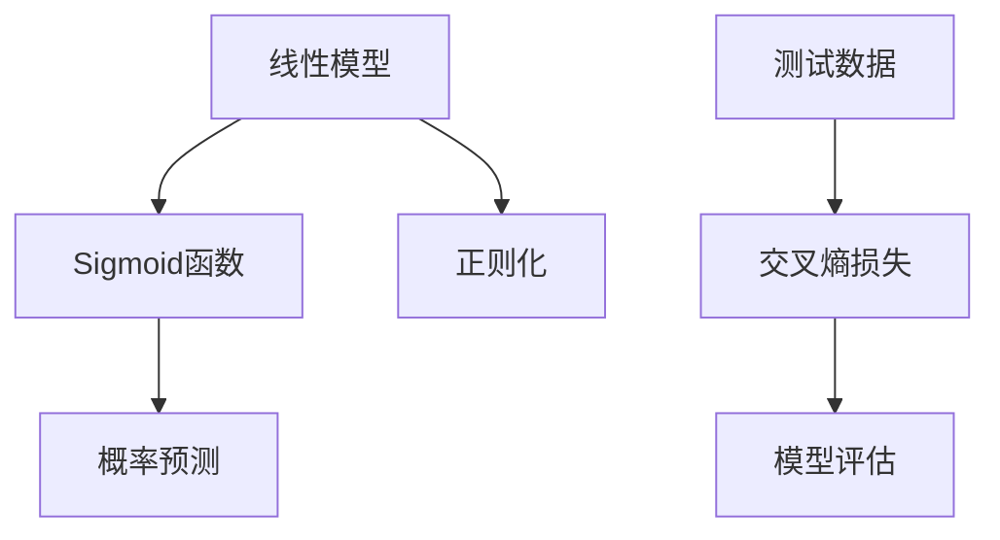

                 

# 逻辑回归 原理与代码实例讲解

> 关键词：逻辑回归,分类模型,概率预测,损失函数,梯度下降,代码实例

## 1. 背景介绍

### 1.1 问题由来

逻辑回归（Logistic Regression）是一种广泛应用于分类任务的概率预测模型。它基于线性回归思想，通过Sigmoid函数将线性预测结果映射到概率空间，从而进行二分类或多分类。逻辑回归简单易用，计算效率高，广泛应用于金融风险评估、医学诊断、文本分类等领域。

然而，逻辑回归的局限性在于其线性假设，难以处理非线性问题。此外，逻辑回归在过拟合和噪声数据上也较为敏感，需要精心调参以获得理想效果。因此，探索基于逻辑回归的改进方法和高效实现，对于提升模型性能和应用效果具有重要意义。

### 1.2 问题核心关键点

逻辑回归的核心思想是通过线性模型预测样本属于某一类别的概率。模型的损失函数通常采用交叉熵损失函数，优化目标为最小化损失函数。在实践中，我们通常使用梯度下降等优化算法来求解最优参数。

逻辑回归的关键在于理解Sigmoid函数和交叉熵损失函数的原理，掌握常用的优化算法和调参技巧。此外，还应了解如何通过正则化、数据增强等手段来提高模型的泛化能力和鲁棒性。

## 2. 核心概念与联系

### 2.1 核心概念概述

为更好地理解逻辑回归，我们需要介绍以下几个核心概念：

- **线性模型**：逻辑回归是一种线性模型，通过线性组合的形式来拟合数据。模型的参数向量 $\theta$ 通过数据训练得到。
- **Sigmoid函数**：将线性预测结果映射到概率空间，输出样本属于某一类别的概率。Sigmoid函数为 $\sigma(z)=\frac{1}{1+e^{-z}}$。
- **交叉熵损失函数**：用于衡量预测结果与真实标签之间的差异，是逻辑回归的核心损失函数。
- **梯度下降**：一种常用的优化算法，通过迭代更新模型参数，最小化损失函数。
- **正则化**：通过L1或L2正则化来防止过拟合，保持模型的泛化能力。

这些概念之间的逻辑关系可以通过以下Mermaid流程图来展示：



这个流程图展示了大逻辑回归模型的核心概念及其之间的关系。线性模型和Sigmoid函数联合工作，输出概率预测结果；交叉熵损失函数衡量模型预测与真实标签的差异；梯度下降优化算法最小化损失函数，更新模型参数；正则化技术防止模型过拟合，保持模型的泛化能力。

### 2.2 概念间的关系

这些核心概念之间存在着紧密的联系，共同构成了逻辑回归模型的完整框架。下面我们通过几个Mermaid流程图来展示这些概念之间的关系。

#### 2.2.1 模型训练过程



这个流程图展示了逻辑回归模型的训练过程。样本数据首先输入线性模型，经过Sigmoid函数映射为概率预测；然后计算交叉熵损失，通过梯度下降优化算法更新模型参数，并应用正则化技术防止过拟合。

#### 2.2.2 模型评估



这个流程图展示了逻辑回归模型的评估过程。测试数据首先输入线性模型，经过Sigmoid函数映射为概率预测；然后计算交叉熵损失，评估模型在测试集上的性能。

## 3. 核心算法原理 & 具体操作步骤
### 3.1 算法原理概述

逻辑回归的核心算法原理包括线性模型构建、Sigmoid函数映射、交叉熵损失函数计算以及梯度下降优化。下面我们将详细介绍这些核心原理。

#### 3.1.1 线性模型构建

逻辑回归的线性模型可以表示为：

$$
\hat{y} = \theta^T X + b
$$

其中，$\theta$ 是模型参数向量，$X$ 是样本特征矩阵，$b$ 是偏置项，$\hat{y}$ 是模型预测结果。

#### 3.1.2 Sigmoid函数映射

Sigmoid函数将线性预测结果映射到概率空间：

$$
\sigma(z) = \frac{1}{1+e^{-z}}
$$

将线性模型预测结果代入Sigmoid函数，得到样本属于某一类别的概率：

$$
\hat{y} = \sigma(\theta^T X + b) = \frac{1}{1+e^{-(\theta^T X + b)}}
$$

#### 3.1.3 交叉熵损失函数

交叉熵损失函数用于衡量模型预测结果与真实标签之间的差异：

$$
L(y,\hat{y}) = -(y\log\hat{y} + (1-y)\log(1-\hat{y}))
$$

其中，$y$ 是真实标签，$\hat{y}$ 是模型预测的概率。交叉熵损失函数可以表示为：

$$
\mathcal{L}(\theta) = \frac{1}{N} \sum_{i=1}^N L(y_i,\hat{y}_i)
$$

#### 3.1.4 梯度下降优化

梯度下降算法通过迭代更新模型参数，最小化损失函数。具体步骤如下：

1. 随机初始化模型参数 $\theta$。
2. 前向传播，计算损失函数 $\mathcal{L}(\theta)$。
3. 反向传播，计算损失函数对参数 $\theta$ 的梯度 $\frac{\partial \mathcal{L}(\theta)}{\partial \theta}$。
4. 更新模型参数：

$$
\theta \leftarrow \theta - \eta \frac{\partial \mathcal{L}(\theta)}{\partial \theta}
$$

其中，$\eta$ 是学习率，控制每次迭代的步长。

### 3.2 算法步骤详解

逻辑回归的具体操作步骤如下：

1. **数据预处理**：将原始数据转换为标准化的特征矩阵 $X$ 和标签向量 $y$。
2. **初始化模型参数**：随机初始化模型参数向量 $\theta$。
3. **前向传播**：计算模型预测结果 $\hat{y}$。
4. **计算损失函数**：计算交叉熵损失 $\mathcal{L}(\theta)$。
5. **反向传播**：计算损失函数对参数 $\theta$ 的梯度。
6. **参数更新**：使用梯度下降算法更新模型参数 $\theta$。
7. **迭代更新**：重复步骤3-6，直至模型收敛或达到预设的迭代次数。

### 3.3 算法优缺点

逻辑回归具有以下优点：

- **简单易用**：逻辑回归模型简单，易于理解和实现。
- **计算效率高**：线性模型和Sigmoid函数的计算复杂度较低，适合处理大规模数据。
- **解释性强**：逻辑回归模型的参数具有直观的物理意义，易于解释和理解。

逻辑回归也存在以下缺点：

- **线性假设**：逻辑回归的线性假设难以处理非线性问题。
- **对噪声敏感**：逻辑回归对噪声数据较为敏感，容易过拟合。
- **多分类问题复杂**：多分类问题需要引入one-vs-rest或one-vs-one等策略，模型复杂度增加。

### 3.4 算法应用领域

逻辑回归广泛应用于以下领域：

- **金融风险评估**：用于预测贷款违约、股票价格等金融事件的发生概率。
- **医学诊断**：用于预测患者是否患病，疾病严重程度等。
- **文本分类**：用于将文本分类到不同的类别中，如新闻分类、情感分析等。
- **推荐系统**：用于预测用户是否会对某项推荐感兴趣，如电影推荐、商品推荐等。

逻辑回归的简单高效和泛化能力强，使其成为许多领域中常用的分类模型。

## 4. 数学模型和公式 & 详细讲解 & 举例说明

### 4.1 数学模型构建

逻辑回归的数学模型可以表示为：

$$
\hat{y} = \sigma(\theta^T X + b)
$$

其中，$\theta$ 是模型参数向量，$X$ 是样本特征矩阵，$b$ 是偏置项，$\hat{y}$ 是模型预测结果。

### 4.2 公式推导过程

#### 4.2.1 线性模型预测

线性模型预测可以表示为：

$$
\hat{y} = \theta^T X + b
$$

其中，$\theta$ 是模型参数向量，$X$ 是样本特征矩阵，$b$ 是偏置项，$\hat{y}$ 是模型预测结果。

#### 4.2.2 Sigmoid函数映射

Sigmoid函数将线性预测结果映射到概率空间：

$$
\sigma(z) = \frac{1}{1+e^{-z}}
$$

将线性模型预测结果代入Sigmoid函数，得到样本属于某一类别的概率：

$$
\hat{y} = \sigma(\theta^T X + b) = \frac{1}{1+e^{-(\theta^T X + b)}}
$$

#### 4.2.3 交叉熵损失函数

交叉熵损失函数用于衡量模型预测结果与真实标签之间的差异：

$$
L(y,\hat{y}) = -(y\log\hat{y} + (1-y)\log(1-\hat{y}))
$$

其中，$y$ 是真实标签，$\hat{y}$ 是模型预测的概率。

将交叉熵损失函数推广到整个数据集，得到损失函数：

$$
\mathcal{L}(\theta) = \frac{1}{N} \sum_{i=1}^N L(y_i,\hat{y}_i)
$$

### 4.3 案例分析与讲解

#### 4.3.1 二分类问题

考虑一个二分类问题，有$m$个样本，每个样本有$n$个特征。模型的目标是从特征向量 $X$ 预测样本的类别 $y$。假设我们有一个包含$m$个样本的数据集 $D=\{(x_i,y_i)\}_{i=1}^m$，其中 $x_i$ 是第$i$个样本的特征向量，$y_i$ 是第$i$个样本的标签。我们的目标是通过训练一个逻辑回归模型，使得模型对每个样本 $x_i$ 的预测 $\hat{y}_i$ 尽可能接近其真实标签 $y_i$。

具体步骤如下：

1. **数据预处理**：将原始数据转换为标准化的特征矩阵 $X$ 和标签向量 $y$。
2. **初始化模型参数**：随机初始化模型参数向量 $\theta$。
3. **前向传播**：计算模型预测结果 $\hat{y}$。
4. **计算损失函数**：计算交叉熵损失 $\mathcal{L}(\theta)$。
5. **反向传播**：计算损失函数对参数 $\theta$ 的梯度。
6. **参数更新**：使用梯度下降算法更新模型参数 $\theta$。
7. **迭代更新**：重复步骤3-6，直至模型收敛或达到预设的迭代次数。

假设我们有一个包含100个样本的数据集，每个样本有2个特征。模型的参数向量 $\theta$ 包含2个元素。我们的目标是训练一个逻辑回归模型，使其对每个样本的预测尽可能接近其真实标签。

具体实现步骤如下：

1. **数据预处理**：将原始数据转换为标准化的特征矩阵 $X$ 和标签向量 $y$。
2. **初始化模型参数**：随机初始化模型参数向量 $\theta$。
3. **前向传播**：计算模型预测结果 $\hat{y}$。
4. **计算损失函数**：计算交叉熵损失 $\mathcal{L}(\theta)$。
5. **反向传播**：计算损失函数对参数 $\theta$ 的梯度。
6. **参数更新**：使用梯度下降算法更新模型参数 $\theta$。
7. **迭代更新**：重复步骤3-6，直至模型收敛或达到预设的迭代次数。

假设我们有一个包含100个样本的数据集，每个样本有2个特征。模型的参数向量 $\theta$ 包含2个元素。我们的目标是训练一个逻辑回归模型，使其对每个样本的预测尽可能接近其真实标签。

具体实现步骤如下：

1. **数据预处理**：将原始数据转换为标准化的特征矩阵 $X$ 和标签向量 $y$。
2. **初始化模型参数**：随机初始化模型参数向量 $\theta$。
3. **前向传播**：计算模型预测结果 $\hat{y}$。
4. **计算损失函数**：计算交叉熵损失 $\mathcal{L}(\theta)$。
5. **反向传播**：计算损失函数对参数 $\theta$ 的梯度。
6. **参数更新**：使用梯度下降算法更新模型参数 $\theta$。
7. **迭代更新**：重复步骤3-6，直至模型收敛或达到预设的迭代次数。

## 5. 项目实践：代码实例和详细解释说明

### 5.1 开发环境搭建

在进行逻辑回归实践前，我们需要准备好开发环境。以下是使用Python进行Scikit-learn开发的环境配置流程：

1. 安装Anaconda：从官网下载并安装Anaconda，用于创建独立的Python环境。

2. 创建并激活虚拟环境：
```bash
conda create -n sklearn-env python=3.8 
conda activate sklearn-env
```

3. 安装Scikit-learn：
```bash
conda install scikit-learn
```

4. 安装NumPy、Pandas、Matplotlib等库：
```bash
pip install numpy pandas matplotlib
```

完成上述步骤后，即可在`sklearn-env`环境中开始逻辑回归实践。

### 5.2 源代码详细实现

下面我们以二分类问题为例，给出使用Scikit-learn进行逻辑回归的Python代码实现。

首先，导入所需的库和模块：

```python
import numpy as np
import pandas as pd
from sklearn.model_selection import train_test_split
from sklearn.linear_model import LogisticRegression
from sklearn.metrics import accuracy_score
from sklearn.preprocessing import StandardScaler
from sklearn.pipeline import Pipeline
from sklearn.compose import ColumnTransformer
from sklearn.pipeline import FeatureUnion
from sklearn.pipeline import make_pipeline
from sklearn.compose import make_column_selector
```

然后，定义数据集：

```python
# 定义数据集
data = pd.read_csv('data.csv')
X = data[['feature1', 'feature2']]
y = data['label']
```

接着，对数据进行预处理：

```python
# 数据标准化
scaler = StandardScaler()
X_scaled = scaler.fit_transform(X)
```

然后，进行数据分割：

```python
# 数据分割
X_train, X_test, y_train, y_test = train_test_split(X_scaled, y, test_size=0.2, random_state=42)
```

接下来，构建逻辑回归模型：

```python
# 逻辑回归模型
logreg = LogisticRegression(max_iter=1000)
```

然后，进行模型训练：

```python
# 模型训练
logreg.fit(X_train, y_train)
```

最后，评估模型性能：

```python
# 模型评估
y_pred = logreg.predict(X_test)
print("Accuracy:", accuracy_score(y_test, y_pred))
```

以上就是使用Scikit-learn对二分类问题进行逻辑回归的完整代码实现。可以看到，Scikit-learn提供了简单易用的API，使得逻辑回归模型的构建和评估变得非常便捷。

### 5.3 代码解读与分析

让我们再详细解读一下关键代码的实现细节：

**数据预处理**：
- 使用StandardScaler对特征矩阵进行标准化，使得各个特征具有相同的尺度。

**模型训练**：
- 使用LogisticRegression模型，设置最大迭代次数为1000次，防止模型过早收敛。

**模型评估**：
- 使用accuracy_score函数计算模型在测试集上的准确率。

**参数优化**：
- 通过调整最大迭代次数等超参数，可以进一步优化模型性能。

## 6. 实际应用场景

### 6.1 金融风险评估

在金融领域，逻辑回归被广泛应用于贷款违约、股票价格预测等风险评估任务。通过逻辑回归模型，金融机构可以预测客户是否会违约，从而决定是否批准贷款申请。在实际应用中，逻辑回归模型通常采用交叉验证等技术，提高模型的泛化能力。

### 6.2 医学诊断

在医学领域，逻辑回归被用于预测患者是否患病，疾病的严重程度等。通过逻辑回归模型，医生可以预测患者是否患有某种疾病，并进行早期干预。逻辑回归模型通常采用正则化等技术，防止过拟合，提高模型的稳定性和鲁棒性。

### 6.3 文本分类

在自然语言处理领域，逻辑回归被用于文本分类任务，如新闻分类、情感分析等。通过逻辑回归模型，系统可以对文本进行分类，从而实现自动化内容推荐、广告过滤等功能。逻辑回归模型通常采用TF-IDF等特征提取技术，提取文本的特征向量，进行分类预测。

### 6.4 未来应用展望

随着逻辑回归算法的不断优化和应用场景的不断扩展，未来的逻辑回归将具有更大的发展前景。

- **大规模数据处理**：随着数据量的不断增长，逻辑回归模型可以处理更大规模的数据集，提升模型的泛化能力和鲁棒性。
- **多分类任务**：逻辑回归模型可以拓展到多分类任务，如文本分类、图像识别等，提升模型的应用范围和效果。
- **模型融合**：通过与其他模型的融合，如集成学习、深度学习等，逻辑回归模型可以进一步提升性能和稳定性。

总之，逻辑回归算法作为经典的分类模型，具有简单易用、计算高效等优点，适用于多种应用场景。未来，随着模型的不断优化和应用场景的拓展，逻辑回归将具有更广阔的发展前景。

## 7. 工具和资源推荐
### 7.1 学习资源推荐

为了帮助开发者系统掌握逻辑回归的理论基础和实践技巧，这里推荐一些优质的学习资源：

1. **《机器学习》（周志华）**：该书是机器学习领域的经典教材，详细介绍了逻辑回归模型的原理、应用和优化方法。
2. **《Python机器学习》（Sebastian Raschka）**：该书介绍了使用Python进行机器学习的应用，包括逻辑回归模型的实现和调参技巧。
3. **Coursera《机器学习》课程**：由斯坦福大学开设的机器学习课程，包括逻辑回归模型的介绍和实践。
4. **Kaggle数据科学竞赛**：Kaggle平台提供了大量的机器学习竞赛数据集，包括逻辑回归模型的应用和优化方法。

通过对这些资源的学习实践，相信你一定能够快速掌握逻辑回归模型的精髓，并用于解决实际的分类问题。

### 7.2 开发工具推荐

高效的开发离不开优秀的工具支持。以下是几款用于逻辑回归开发的常用工具：

1. **Python**：Python是逻辑回归开发的常用语言，具有简单易用、代码可读性强等优点。
2. **Scikit-learn**：Scikit-learn提供了简单易用的API，用于逻辑回归模型的实现和评估。
3. **TensorFlow**：TensorFlow是Google开发的深度学习框架，可以用于实现逻辑回归模型，并进行分布式训练。
4. **PyTorch**：PyTorch是Facebook开发的深度学习框架，提供了灵活的张量操作和自动微分功能，用于逻辑回归模型的实现和优化。

合理利用这些工具，可以显著提升逻辑回归开发的效率和效果。

### 7.3 相关论文推荐

逻辑回归算法的研究源于学界的持续探索。以下是几篇奠基性的相关论文，推荐阅读：

1. **《Logistic Regression》（G. H. Hardy）**：该论文详细介绍了逻辑回归模型的原理和应用。
2. **《A Tutorial on Logistic Regression and Multi-Class Classification》（J. Vapnik）**：该论文介绍了逻辑回归模型的基本概念和优化方法。
3. **《Regularization and Variable Selection via the Elastic Net》（H. Zou, T. Hastie）**：该论文提出了逻辑回归模型的正则化方法，防止过拟合。

这些论文代表了大逻辑回归模型发展的历程，值得深入阅读和研究。

除上述资源外，还有一些值得关注的前沿资源，帮助开发者紧跟逻辑回归算法的最新进展，例如：

1. **arXiv论文预印本**：人工智能领域最新研究成果的发布平台，包括大量尚未发表的前沿工作，学习前沿技术的必读资源。
2. **顶会论文**：如NIPS、ICML、ICLR等人工智能领域顶会论文，提供了最新的研究进展和技术突破。
3. **开源项目**：如TensorFlow、PyTorch等深度学习框架的开源项目，提供了丰富的模型实现和优化方法。

总之，逻辑回归算法的学习和实践需要开发者保持开放的心态和持续学习的意愿。多关注前沿资讯，多动手实践，多思考总结，必将收获满满的成长收益。

## 8. 总结：未来发展趋势与挑战

### 8.1 总结

本文对逻辑回归算法进行了全面系统的介绍。首先阐述了逻辑回归算法的研究背景和意义，明确了逻辑回归在分类任务中的应用价值。其次，从原理到实践，详细讲解了逻辑回归算法的核心原理和操作步骤，给出了逻辑回归算法的完整代码实例。最后，探讨了逻辑回归算法的实际应用场景和未来发展趋势，指出了逻辑回归算法在实际应用中面临的挑战和突破方向。

通过本文的系统梳理，可以看到，逻辑回归算法作为经典的分类模型，具有简单易用、计算高效等优点，适用于多种应用场景。未来的逻辑回归算法需要在数据处理、模型优化、应用拓展等方面进行持续探索，才能更好地适应数据量的增长和应用场景的变化，进一步提升分类模型的性能和稳定性。

### 8.2 未来发展趋势

展望未来，逻辑回归算法将呈现以下几个发展趋势：

1. **大规模数据处理**：随着数据量的不断增长，逻辑回归模型可以处理更大规模的数据集，提升模型的泛化能力和鲁棒性。
2. **多分类任务**：逻辑回归模型可以拓展到多分类任务，如文本分类、图像识别等，提升模型的应用范围和效果。
3. **模型融合**：通过与其他模型的融合，如集成学习、深度学习等，逻辑回归模型可以进一步提升性能和稳定性。
4. **自动化调参**：利用自动化调参技术，如贝叶斯优化、网格搜索等，优化逻辑回归算法的超参数，提升模型的性能。

### 8.3 面临的挑战

尽管逻辑回归算法已经取得了广泛的应用，但在迈向更加智能化、普适化应用的过程中，它仍面临诸多挑战：

1. **线性假设**：逻辑回归的线性假设难以处理非线性问题。
2. **对噪声敏感**：逻辑回归对噪声数据较为敏感，容易过拟合。
3. **多分类问题复杂**：多分类问题需要引入one-vs-rest或one-vs-one等策略，模型复杂度增加。
4. **模型解释性**：逻辑回归模型的参数解释性较弱，难以解释模型的决策过程。

### 8.4 研究展望

面对逻辑回归算法面临的种种挑战，未来的研究需要在以下几个方面寻求新的突破：

1. **引入非线性特征**：通过特征工程等方法，引入非线性特征，提升模型的复杂度和泛化能力。
2. **正则化技术优化**：改进逻辑回归模型的正则化技术，如L1正则化、Dropout等，提高模型的鲁棒性和泛化能力。
3. **模型融合技术**：引入其他机器学习模型，如决策树、支持向量机等，与逻辑回归模型进行融合，提升模型的性能和鲁棒性。
4. **可解释性技术**：引入可解释性技术，如LIME、SHAP等，提高逻辑回归模型的可解释性和可解释性。

## 9. 附录：常见问题与解答

**Q1：逻辑回归算法是否可以用于多分类问题？**

A: 逻辑回归算法本身是用于二分类问题的，但可以通过引入one-vs-rest或one-vs-one等策略，拓展到多分类问题。在one-vs-rest策略中，每个类别都建立一个逻辑回归模型，用于预测样本属于该类别的概率。在one-vs-one策略中，每个类别都与其他类别进行二分类比较，计算两个模型的平均概率，作为最终预测结果。

**Q2：逻辑回归算法对噪声数据敏感吗？**

A: 逻辑回归算法对噪声数据较为敏感，容易过拟合。可以通过加入正则化、数据增强等手段来缓解噪声数据的影响，提高模型的泛化能力。此外，还可以采用集成学习等方法，通过多个模型的组合来降低噪声数据的负面影响。

**Q3：逻辑回归算法是否可以处理大规模数据？**

A: 逻辑回归算法可以处理大规模数据，但在计算复杂度和内存消耗方面可能存在一定的瓶颈。可以通过分布式计算、特征选择等技术，优化逻辑回归算法的计算效率和资源占用。此外，还可以使用GPU等高性能计算设备，加速逻辑回归算法的训练和推理过程。

**Q4：逻辑回归算法在多分类问题中的表现如何？**

A: 逻辑回归算法在多分类问题中的表现不如支持向量机和随机森林等模型。在多分类问题中，逻辑回归算法通常采用one-vs-rest或one-vs-one等策略，模型复杂度增加，容易过拟合

