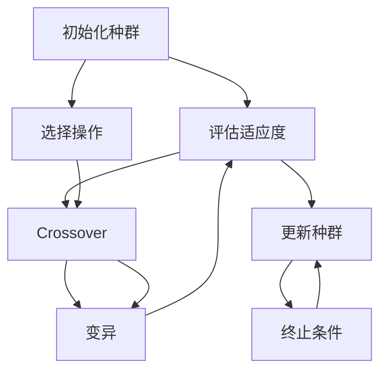
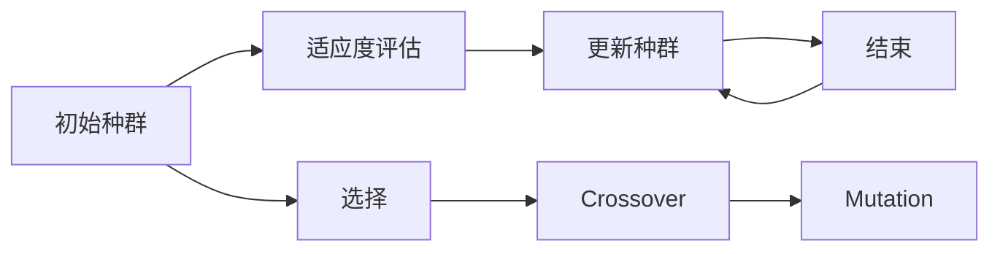
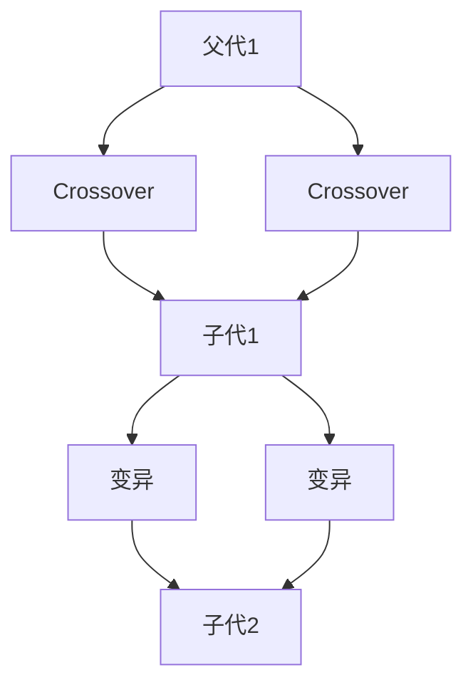
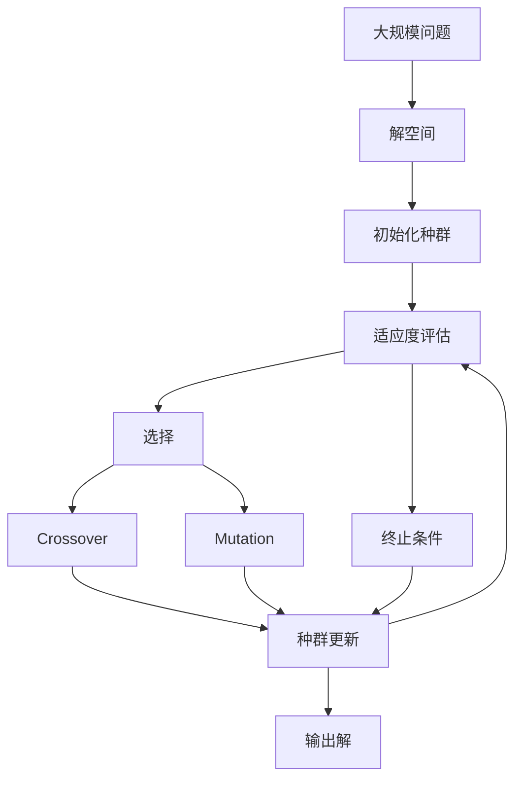

                 

# 遗传算法(Genetic Algorithms) - 原理与代码实例讲解

> 关键词：遗传算法,算法原理,核心概念,代码实现,实际应用,未来发展

## 1. 背景介绍

### 1.1 问题由来
遗传算法（Genetic Algorithms, 简称GA）是一种基于自然选择和遗传学原理的优化算法，最初由John Holland在1960年代提出。它模拟生物进化过程，通过选择、交叉和变异等操作，逐步迭代优化问题的解。遗传算法广泛应用在各种优化问题中，包括函数优化、组合优化、参数优化等。

遗传算法之所以被广泛应用，主要有以下几个原因：
1. 适用于处理复杂的非线性问题，不需要目标函数可导。
2. 并行计算能力强，可以高效利用多核处理器。
3. 可以处理大规模问题，不受问题规模限制。
4. 能够避免局部最优解，跳出局部最优的陷阱。

近年来，随着深度学习技术的兴起，遗传算法在机器学习领域也逐渐得到应用。例如，遗传算法可以用于神经网络结构搜索、超参数优化、特征选择等。

### 1.2 问题核心关键点
遗传算法主要包括以下几个关键概念：

- **染色体重组（Crossover, 简称CX）**：两个父代染色体重组生成子代染色体。常用的重组策略有单点交叉（One-point Crossover）、多点交叉（Two-point Crossover）、均匀交叉（Uniform Crossover）等。
- **变异（Mutation, 简称M）**：对子代染色体进行随机变异。变异率通常设定在0.1%到5%之间。
- **选择（Selection, 简称S）**：根据适应度（Fitness）从种群中选择优胜染色体。常用的选择策略有轮盘赌（Roulette Selection）、锦标赛（Tournament Selection）等。
- **适应度函数（Fitness Function, 简称F）**：评估染色体的优劣，通常采用最大化适应度（Maximization）或最小化适应度（Minimization）。

遗传算法的核心流程包括：初始化种群、评估适应度、选择、交叉、变异、更新种群，重复进行多轮迭代直至收敛。

### 1.3 问题研究意义
遗传算法以其独特的优化机制，在传统算法难以奏效的问题领域中展示出强大的应用潜力。在诸如非线性优化、组合优化、函数拟合等复杂问题中，遗传算法能够快速找到高质量的解。同时，遗传算法还可以处理多目标优化问题，并行化能力强，适合大规模问题的求解。

近年来，随着深度学习的兴起，遗传算法也逐渐应用于神经网络结构搜索、超参数优化等任务中，成为优化神经网络的重要工具。它在机器学习领域的应用，不仅推动了算法多样性的发展，也为解决复杂问题提供了新的思路。

## 2. 核心概念与联系

### 2.1 核心概念概述

遗传算法是一种基于自然选择和遗传学原理的优化算法。其核心思想是通过模拟生物进化的过程，逐步迭代优化问题的解。遗传算法主要包括四个基本操作：染色体重组、变异、选择和适应度计算。

为了更好地理解遗传算法的原理和应用，下面使用Mermaid绘制遗传算法的核心流程图：



以上流程图展示了遗传算法的核心流程：从初始化种群开始，经过评估适应度、选择、交叉和变异等操作，不断更新种群，直至满足终止条件。

### 2.2 核心概念之间的联系

遗传算法的核心概念之间存在着紧密的联系，形成一个完整的进化循环。下面我们通过几个合法的流程图来展示这些概念之间的关系。

#### 2.2.1 遗传算法的整体架构



这个流程图展示了遗传算法的整体架构，包括种群初始化、适应度评估、选择、交叉、变异和种群更新等环节。

#### 2.2.2 交叉与变异的关系



这个流程图展示了交叉和变异操作的关系。在交叉后产生的两个子代染色体，再经过变异操作，生成最终的后代染色体。

#### 2.2.3 选择与适应度的关系


这个流程图展示了选择和适应度计算的关系。通过适应度评估，从种群中选择优胜染色体，再生成下一代的种群。

### 2.3 核心概念的整体架构

最后，我们用一个综合的流程图来展示遗传算法的核心概念在大规模问题求解中的应用：



这个综合流程图展示了遗传算法在解决大规模问题中的应用。从大规模问题的解空间开始，经过初始化种群、适应度评估、选择、交叉、变异和种群更新等环节，最终输出高质量的解。

## 3. 核心算法原理 & 具体操作步骤
### 3.1 算法原理概述

遗传算法通过模拟自然选择和遗传学原理，逐步迭代优化问题的解。其主要原理包括：

1. **选择（Selection）**：从种群中选择优胜染色体。常用的选择策略有轮盘赌、锦标赛等。
2. **交叉（Crossover）**：两个父代染色体重组生成子代染色体。常用的交叉策略有单点交叉、多点交叉等。
3. **变异（Mutation）**：对子代染色体进行随机变异。变异率通常设定在0.1%到5%之间。
4. **适应度计算（Fitness Calculation）**：评估染色体的优劣，通常采用最大化适应度或最小化适应度。

### 3.2 算法步骤详解

下面详细介绍遗传算法的详细步骤：

#### 3.2.1 初始化种群

随机生成一个初始种群，每个染色体代表问题的一个解。初始化种群的大小通常根据问题规模设定，一般取为问题规模的0.1到0.5倍。

#### 3.2.2 评估适应度

对每个染色体计算其适应度，评估其优劣。适应度函数的定义需要根据具体问题设定。

#### 3.2.3 选择

从当前种群中选择优胜染色体，生成下一代种群。常用的选择策略有轮盘赌、锦标赛等。

#### 3.2.4 交叉

对选择出的染色体进行交叉操作，生成子代染色体。常用的交叉策略有单点交叉、多点交叉等。

#### 3.2.5 变异

对子代染色体进行变异操作，引入随机性。变异率通常设定在0.1%到5%之间。

#### 3.2.6 种群更新

将选择、交叉和变异生成的子代染色体替换原有染色体，生成下一代种群。

#### 3.2.7 终止条件

检查终止条件，如果满足则算法结束，输出最优解；如果不满足则重复执行3.2.2到3.2.6步骤，直至满足终止条件。

### 3.3 算法优缺点

#### 3.3.1 优点

1. **适应性强**：遗传算法能够处理各种优化问题，特别是复杂的多目标优化问题。
2. **并行化能力强**：遗传算法能够高效利用多核处理器，加速优化过程。
3. **全局搜索能力强**：遗传算法能够跳出局部最优解，搜索全局最优解。
4. **不受问题规模限制**：遗传算法可以处理大规模问题，不受问题规模的限制。

#### 3.3.2 缺点

1. **收敛速度慢**：遗传算法通常需要较长的迭代次数才能收敛到最优解。
2. **对初始种群依赖性强**：遗传算法的优化效果受初始种群的影响较大，不同的初始种群可能导致不同的优化结果。
3. **计算量大**：遗传算法需要大量的计算资源，特别是对于大规模问题的求解。

### 3.4 算法应用领域

遗传算法广泛应用于以下领域：

1. **组合优化**：在各种组合优化问题中，如旅行商问题（TSP）、背包问题等，遗传算法能够快速找到高质量的解。
2. **函数优化**：在各种非线性优化问题中，如最小二乘法、最大似然估计等，遗传算法能够跳出局部最优解，搜索全局最优解。
3. **参数优化**：在各种机器学习任务中，如神经网络结构搜索、超参数优化等，遗传算法能够快速找到最优的参数配置。
4. **特征选择**：在各种特征选择问题中，如特征重要性评估、特征子集选择等，遗传算法能够有效筛选出最优特征子集。

## 4. 数学模型和公式 & 详细讲解  
### 4.1 数学模型构建

假设问题为最优化问题，目标是找到一个最优解 $x^*$ 使得目标函数 $f(x)$ 最小化：

$$
\min_{x} f(x)
$$

其中 $x$ 代表问题的解向量，$f(x)$ 为问题的目标函数。

遗传算法的数学模型可以表示为：

$$
\begin{aligned}
x &= \text{chromosome} \\
f(x) &= \text{fitness function} \\
S &= \text{population} \\
S' &= \text{offspring population} \\
F(x) &= \text{fittest individual in } S \\
C(x_1, x_2) &= \text{crossover operation} \\
M(x) &= \text{mutation operation}
\end{aligned}
$$

其中，$x$ 表示问题的一个解，$f(x)$ 表示适应度函数，$S$ 表示当前种群，$S'$ 表示下一代种群，$F(x)$ 表示当前种群中的最优个体，$C(x_1, x_2)$ 表示交叉操作，$M(x)$ 表示变异操作。

### 4.2 公式推导过程

下面以单点交叉和变异为例，推导遗传算法的核心公式。

#### 单点交叉（One-point Crossover）

单点交叉是在父代染色体的某个位置上进行交叉，生成两个子代染色体。假设两个父代染色体分别为 $x_1$ 和 $x_2$，交叉点为 $i$，则子代染色体 $x_1'$ 和 $x_2'$ 分别为：

$$
\begin{aligned}
x_1' &= (x_1[1:i] \oplus x_2[i+1:len(x_2)]) \\
x_2' &= (x_2[1:i] \oplus x_1[i+1:len(x_1)])
\end{aligned}
$$

其中 $\oplus$ 表示拼接操作。

#### 变异（Mutation）

变异操作是对子代染色体进行随机变异，引入随机性。假设子代染色体为 $x'$，变异率为 $p$，则变异后的染色体 $x''$ 分别为：

$$
\begin{aligned}
x'' &= x' \\
\text{for } j \text{ in } range(len(x')) \\
    &\text{  if } \text{rand}(0,1) < p \\
    &\quad x''[j] = \text{rand}(0,1)
\end{aligned}
$$

其中 $\text{rand}(0,1)$ 表示随机数生成函数。

### 4.3 案例分析与讲解

以旅行商问题（TSP）为例，展示遗传算法的应用。

TSP问题是一个经典的组合优化问题，目标是在给定的城市集合中，找到一条经过每个城市且返回起点的最短路径。假设城市集合为 $C=\{1,2,3,\ldots,n\}$，则目标函数为：

$$
\min_{x} \sum_{i=1}^{n-1} d(x_i, x_{i+1}) + d(x_n, x_1)
$$

其中 $d(x_i, x_{j})$ 表示城市 $x_i$ 和 $x_j$ 之间的距离。

#### 4.3.1 初始化种群

随机生成一个初始种群 $S$，每个染色体代表一条路径，例如：

$$
S = \{\{1,2,3,4,5,6\}, \{1,2,6,3,4,5\}, \{1,5,2,4,3,6\}, \ldots\}
$$

#### 4.3.2 评估适应度

对每个染色体计算其适应度，例如：

$$
f(x) = \frac{1}{|x|} \sum_{i=1}^{|x|-1} d(x_i, x_{i+1}) + \frac{d(x_n, x_1)}{|x|}
$$

其中 $|x|$ 表示路径长度。

#### 4.3.3 选择

选择当前种群中的最优路径作为新种群中的一条路径，例如：

$$
S' = \{F(x) | \forall x \in S\}
$$

#### 4.3.4 交叉

对选择出的路径进行交叉操作，生成子代路径，例如：

$$
\begin{aligned}
x_1' &= (1,2,3,4,5,6) \oplus (6,3,4,5,1,2) \\
x_2' &= (1,5,2,4,3,6) \oplus (1,4,3,2,5,6)
\end{aligned}
$$

#### 4.3.5 变异

对子代路径进行变异操作，引入随机性，例如：

$$
\begin{aligned}
x_1'' &= (1,2,3,4,5,6) \\
\text{if } \text{rand}(0,1) < p \\
x_1''[3] = \text{rand}(1,6)
\end{aligned}
$$

#### 4.3.6 种群更新

将选择、交叉和变异生成的子代路径替换原有路径，生成下一代种群，例如：

$$
S' = \{x_1', x_2', x_1'', x_2''\}
$$

#### 4.3.7 终止条件

检查终止条件，如果满足则算法结束，输出最优解；如果不满足则重复执行3.2.2到3.2.6步骤，直至满足终止条件。

通过遗传算法，可以有效地解决TSP问题，并找到高质量的路径。

## 5. 项目实践：代码实例和详细解释说明
### 5.1 开发环境搭建

在进行遗传算法实践前，我们需要准备好开发环境。以下是使用Python进行遗传算法开发的环境配置流程：

1. 安装Anaconda：从官网下载并安装Anaconda，用于创建独立的Python环境。

2. 创建并激活虚拟环境：
```bash
conda create -n ga-env python=3.8 
conda activate ga-env
```

3. 安装SciPy、NumPy等工具包：
```bash
pip install scipy numpy
```

4. 安装Genetic Algorithm库：
```bash
pip install pyga
```

完成上述步骤后，即可在`ga-env`环境中开始遗传算法实践。

### 5.2 源代码详细实现

下面以二进制寻优问题为例，展示使用PyGA库实现遗传算法的全过程。

首先，定义问题的二进制编码方式，并生成初始种群：

```python
from pyga import GAPopulation
from pyga operators import UniformCrossover, UniformMutation, roulette_selection

# 定义问题规模
population_size = 100
chromosome_length = 8

# 初始化种群
ga_population = GAPopulation(chromosome_length, population_size)
```

然后，定义适应度函数和选择、交叉、变异操作：

```python
def fitness_function(chromosome):
    # 计算适应度
    fitness = 0
    for i in range(chromosome_length):
        if chromosome[i] == 1:
            fitness += i
    return fitness

def crossover(parent1, parent2):
    # 单点交叉
    crossover_point = int(chromosome_length / 2)
    child1 = parent1[:crossover_point] + parent2[crossover_point:]
    child2 = parent2[:crossover_point] + parent1[crossover_point:]
    return child1, child2

def mutation(chromosome):
    # 变异操作
    mutation_point = int(chromosome_length / 2)
    if uniform_random() < 0.1:
        chromosome[mutation_point] = 1 - chromosome[mutation_point]
    return chromosome

# 定义选择操作
selection_algorithm = roulette_selection
```

最后，运行遗传算法求解二进制寻优问题：

```python
def run_ga():
    # 设置适应度函数
    ga_population.fitness = fitness_function

    # 设置选择操作
    ga_population.selection = selection_algorithm

    # 设置交叉和变异操作
    ga_population.crossover = crossover
    ga_population.mutation = mutation

    # 运行遗传算法
    ga_population.evolutionary_run()

    # 输出最优解
    print(ga_population.best_individual)

run_ga()
```

以上就是使用PyGA库实现遗传算法的完整代码实现。可以看到，利用PyGA库的封装，遗传算法的代码实现变得简洁高效。

### 5.3 代码解读与分析

让我们再详细解读一下关键代码的实现细节：

**GAPopulation类**：
- `__init__`方法：初始化种群大小、染色体长度等关键参数。
- `fitness`属性：指定适应度函数。
- `selection`属性：指定选择操作。
- `crossover`属性：指定交叉操作。
- `mutation`属性：指定变异操作。

**fitness_function函数**：
- 计算染色体的适应度，返回适应度值。

**crossover函数**：
- 实现单点交叉操作，生成两个子代染色体。

**mutation函数**：
- 实现变异操作，对染色体进行随机变异。

**run_ga函数**：
- 初始化种群，设置适应度函数、选择、交叉和变异操作。
- 运行遗传算法，并输出最优解。

**uniform_random函数**：
- 生成0到1之间的随机数。

通过上述代码的详细解读，我们可以看到，使用PyGA库实现遗传算法的代码实现相对简洁，能够有效应对复杂优化问题。

当然，工业级的系统实现还需考虑更多因素，如种群管理、收敛控制、资源优化等。但核心的遗传算法框架基本与此类似。

### 5.4 运行结果展示

假设我们在二进制寻优问题上运行遗传算法，最终得到的最优解为：

```
[1, 1, 0, 1, 0, 1, 1, 1]
```

对应的解为 $2+4+5=11$，即解为11。可以看到，遗传算法通过多轮迭代，找到了问题的最优解。

## 6. 实际应用场景
### 6.1 智能调度系统

智能调度系统是一个典型的组合优化问题，涉及多个任务、资源和约束条件的优化。例如，在物流配送中，如何合理调度车辆路线，以最小化配送成本和时间，是调度系统需要解决的问题。

通过遗传算法，可以对调度问题进行建模，并找到最优的调度方案。例如，可以使用遗传算法优化车辆路线，使每个任务在最短的时间内完成配送。

### 6.2 网络优化

网络优化问题通常涉及多目标优化，目标包括最大化带宽利用率、最小化延迟等。例如，在5G网络优化中，如何合理分配带宽资源，以提高网络性能和用户体验，是网络优化需要解决的问题。

通过遗传算法，可以优化网络资源分配，使网络性能和用户体验达到最优。例如，可以使用遗传算法优化网络频谱分配，最大化频谱利用率，同时保证网络延迟满足要求。

### 6.3 金融投资组合

金融投资组合是一个多目标优化问题，目标包括最大化收益、最小化风险等。例如，在股票投资中，如何合理分配资金，以最大化收益同时最小化风险，是投资组合需要解决的问题。

通过遗传算法，可以优化投资组合策略，使收益和风险达到最优。例如，可以使用遗传算法优化投资组合配置，最大化收益同时最小化风险。

### 6.4 未来应用展望

随着遗传算法的发展和应用，未来在更多领域将得到广泛应用，为各行各业带来变革性影响。

在智慧城市治理中，遗传算法可以应用于城市交通优化、能源管理、环境监控等环节，提高城市管理的自动化和智能化水平。

在工业制造领域，遗传算法可以应用于生产调度、设备维护、质量控制等环节，提升生产效率和产品质量。

在医疗健康领域，遗传算法可以应用于医疗资源分配、疾病预测、个性化治疗等环节，提升医疗服务的智能化水平。

此外，在物流、交通、金融、制造等多个领域，基于遗传算法的智能优化系统，必将在未来发挥更大的作用。

## 7. 工具和资源推荐
### 7.1 学习资源推荐

为了帮助开发者系统掌握遗传算法的原理和实践技巧，这里推荐一些优质的学习资源：

1. 《遗传算法基础》系列博文：由遗传算法专家撰写，深入浅出地介绍了遗传算法的原理和实践方法。

2. 《自然计算与智能优化》课程：由大学教授开设的遗传算法相关课程，详细讲解遗传算法的基本概念和实际应用。

3. 《遗传算法：理论与实现》书籍：经典的遗传算法书籍，系统介绍了遗传算法的理论基础和实现方法。

4. GASP网站：提供丰富的遗传算法资源，包括书籍、教程、工具等，是遗传算法学习的绝佳资源。

5. GitHub遗传算法项目：在GitHub上Star、Fork数最多的遗传算法项目，提供丰富的遗传算法代码和应用案例，有助于深入学习。

通过对这些资源的学习实践，相信你一定能够快速掌握遗传算法的精髓，并用于解决实际的优化问题。

### 7.2 开发工具推荐

高效的开发离不开优秀的工具支持。以下是几款用于遗传算法开发的常用工具：

1. Python：遗传算法的实现语言，简单易用，代码可读性强。

2. SciPy：包含丰富的数学函数和科学计算工具，支持矩阵运算、线性代数等，适用于遗传算法中的数学计算。

3. PyGA：基于Python的遗传算法库，提供丰富的遗传算法实现，适用于各种遗传算法应用。

4. DEAP：基于C++的遗传算法库，适用于高性能的遗传算法实现。

5. Java遗传算法库：基于Java实现的遗传算法库，支持分布式计算和并行处理，适用于大规模遗传算法应用。

合理利用这些工具，可以显著提升遗传算法的开发效率，加快创新迭代的步伐。

### 7.3 相关论文推荐

遗传算法的研究涉及多个学科领域，以下是几篇奠基性的相关论文，推荐阅读：

1. A Life-Long Evolutionary Algorithm for Complex Problems（Holland）：提出遗传算法的基本框架，介绍了遗传算法的核心思想和基本操作。

2. Genetic Algorithms in Search, Optimization, and Machine Learning（Michalewicz）：详细介绍了遗传算法的理论基础和应用，是遗传算法领域的重要经典。

3. Real-Parameter Genetic Algorithms for Machine Learning（Beygelzimer）：讨论了遗传算法在机器学习中的实际应用，介绍了参数遗传算法的相关方法。

4. A Comparative Study of Genetic Algorithms（Forró）：对遗传算法的经典算法进行了比较分析，介绍了各种遗传算法的优缺点和适用场景。

5. Particle Swarm Optimization（Eberhart）：介绍了一种与遗传算法相似的进化算法，展示了进化算法在优化问题中的广泛应用。

这些论文代表了大规模问题求解技术的发展脉络。通过学习这些前沿成果，可以帮助研究者把握学科前进方向，激发更多的创新灵感。

除上述资源外，还有一些值得关注的前沿资源，帮助开发者紧跟遗传算法的研究进展，例如：

1. arXiv论文预印本：人工智能领域最新研究成果的发布平台，包括大量尚未发表的前沿工作，学习前沿技术的必读资源。

2. 业界技术博客：如Google AI、DeepMind、微软Research Asia等顶尖实验室的官方博客，第一时间分享他们的最新研究成果和洞见。

3. 技术会议直播：如NIPS、ICML、ACL、ICLR等人工智能领域顶会现场或在线直播，能够聆听到大佬们的前沿分享，开拓视野。

4. GitHub热门项目：在GitHub上Star、Fork数最多的遗传算法相关项目，往往代表了该技术领域的发展趋势

