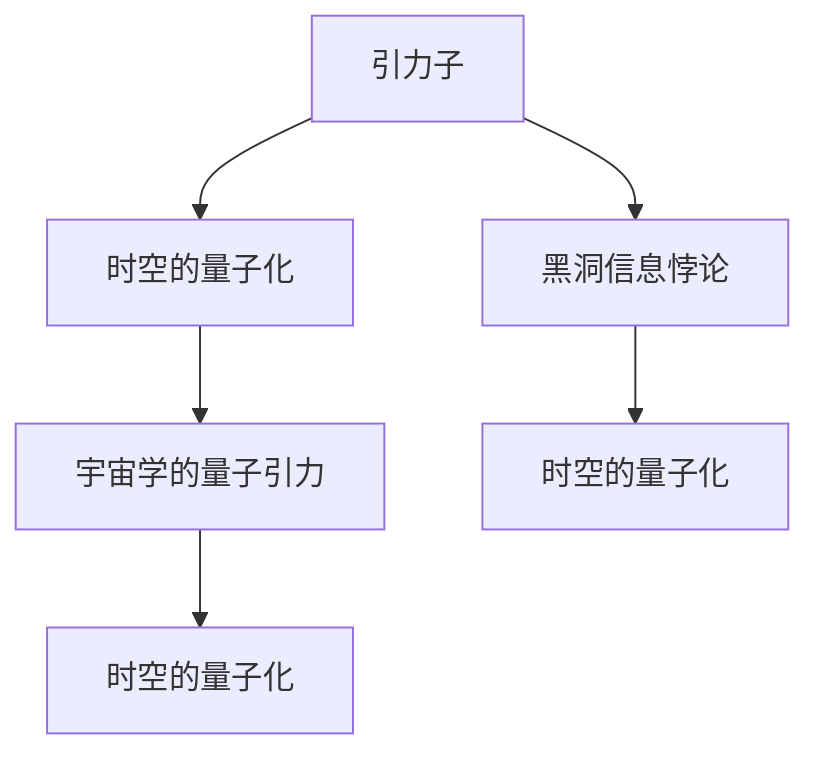

                 

# 量子引力与广义相对论的关系

## 1. 背景介绍

量子引力是理论物理学的一个前沿领域，旨在将量子力学和广义相对论这两个描述自然的基本理论统一到一个框架中。这一领域的研究不仅对理论物理学的进步至关重要，也对探索宇宙的本质和结构具有深远意义。广义相对论（General Relativity，GR），由爱因斯坦在1915年提出，通过描述时空的弯曲来解释引力现象，已在多个实验中得到验证。量子力学（Quantum Mechanics，QM），则是描述微观粒子的运动规律，在量子力学中，物理量并非确定值，而是以概率的形式存在。

虽然QM和GR在描述微观和宏观世界方面都取得了巨大的成功，但将它们统一起来的挑战至今未被完全解决。量子引力的目标是发展一个理论，使得量子力学和广义相对论在同一个数学框架下互相兼容。这一目标不仅是理论上的追求，也是实践中的需求，因为现代物理实验中遇到的很多问题，如黑洞奇异性、宇宙大爆炸初期条件、暗物质和暗能量的本质等，都要求我们在量子层面理解引力和时空的性质。

## 2. 核心概念与联系

### 2.1 核心概念概述

量子引力是量子力学和广义相对论的结合，它的研究涉及以下几个核心概念：

- **引力子（Graviton）**：量子引力理论中的基本粒子，负责传递引力。
- **时空的量子化**：研究时空在量子层面的性质，如空间的量子泡沫、时间的量子涨落等。
- **黑洞信息悖论**：研究量子力学和广义相对论在描述极端条件下如何相互作用，特别是黑洞蒸发过程中信息的丧失问题。
- **宇宙学的量子引力**：将量子引力理论应用于宇宙学，研究宇宙的起源、结构和演化。

### 2.2 核心概念的联系

这些核心概念通过以下方式相互关联：

1. **引力子与时空的量子化**：引力子是时空弯曲的量子描述，它的交换导致了时空的弯曲，从而传递引力。在量子化时空中，引力子的存在解释了时空的量子性质。

2. **黑洞信息悖论与时空的量子化**：黑洞的强引力场使得量子力学和广义相对论的矛盾暴露无遗，特别是信息悖论，提示我们必须考虑时空的量子化。

3. **宇宙学的量子引力**：宇宙学的研究，从宇宙大爆炸到暗物质和暗能量的本质，都需要量子引力理论来解释。时空的量子化是理解宇宙学问题的关键。

### 2.3 核心概念的整体架构

量子引力的研究可以通过一个综合的框架进行描述，以下是一个简化的Mermaid流程图：



这个流程图展示了大量子引力研究的主要方向及其相互关系。引力子作为量子引力的基本粒子，其交换导致时空的量子化；黑洞信息悖论进一步揭示了时空量子化的复杂性；而宇宙学的量子引力则是量子引力理论在宏观宇宙层面的应用。

## 3. 核心算法原理 & 具体操作步骤

### 3.1 算法原理概述

量子引力的研究通常涉及以下几个方面：

- **量子场论**：引力子作为时空的量子场，其动力学由引力子场的量子场方程决定。
- **时空的量子化**：利用量子场论的结果，通过对时空的量子场进行扰动，得到量子引力的有效场论。
- **黑洞信息悖论的解决**：利用量子场论的方法，研究黑洞的辐射，解释信息悖论。
- **宇宙学的量子引力**：应用量子引力的有效场论，解释宇宙学的各种现象。

### 3.2 算法步骤详解

以下是量子引力研究的一般步骤：

1. **引力子的量子场方程**：建立引力子的量子场方程，通常采用无背景时空的Klein-Gordon方程或Dirac方程。

2. **时空的量子化**：利用量子场论的结果，通过对引力子的相互作用进行微扰计算，得到时空的量子化理论。

3. **黑洞的辐射计算**：利用时空的量子化理论，计算黑洞的辐射，解释信息悖论。

4. **宇宙学的量子引力**：应用量子引力理论，解释宇宙学的各种现象，如宇宙大爆炸、暗物质和暗能量等。

### 3.3 算法优缺点

量子引力研究存在以下优点：

1. **统一理论**：通过量子引力，将量子力学和广义相对论统一在一个框架内，解决了理论物理中的根本问题。

2. **解释极端现象**：量子引力能够解释黑洞和宇宙学中的极端现象，这些问题在经典理论中无法解决。

3. **应用广泛**：量子引力的研究成果对天文观测、粒子物理和宇宙学等多个领域都有重要应用。

同时，量子引力研究也存在以下缺点：

1. **计算复杂**：量子引力的计算非常复杂，涉及到高阶微扰和复杂的费曼图计算。

2. **缺乏实验验证**：目前量子引力理论仍缺乏实验验证，无法确定其正确性。

3. **理论困难**：量子引力的数学基础和物理机制仍然有许多未解决的问题，如黑洞奇异性等。

### 3.4 算法应用领域

量子引力理论目前主要应用于以下几个领域：

- **宇宙学**：解释宇宙大爆炸、暗物质和暗能量的本质。
- **黑洞研究**：解释黑洞的辐射和奇异性。
- **引力波探测**：解释引力波的来源和特性。
- **粒子物理**：解释基本粒子的性质和相互作用。

## 4. 数学模型和公式 & 详细讲解  
### 4.1 数学模型构建

量子引力理论的数学模型主要建立在以下两个理论基础上：

- **广义相对论**：时空弯曲的描述。
- **量子力学**：微观粒子的描述。

将这两个理论结合，可以得到量子引力的数学模型。

### 4.2 公式推导过程

以下我们以引力子的Klein-Gordon方程为例，展示量子引力理论的数学推导：

引力子的Klein-Gordon方程为：

$$ \left( \square_g + m^2 \right) \phi = 0 $$

其中 $\square_g$ 是时空的量子化背景下的D'Alembert算子，$g$ 表示时空的度规，$m$ 为引力子的质量。

这一方程描述了引力子在量子引力场中的运动。通过量子场论的微扰计算，可以得到引力子的传播子，进而研究引力子与其它粒子的相互作用。

### 4.3 案例分析与讲解

考虑一个简单的宇宙模型，其中时空由Schwarzschild度规描述，引力子的场方程可以写作：

$$ \left[ -\frac{\partial^2}{\partial t^2} + \nabla^2 - \frac{1}{r^2} + m^2 \right] \phi(r,t) = 0 $$

这一方程描述了引力子在Schwarzschild度规下的运动。通过求解这一方程，可以得到引力子在黑洞背景下的传播行为，解释黑洞的辐射现象。

## 5. 项目实践：代码实例和详细解释说明

### 5.1 开发环境搭建

在进行量子引力研究的代码实现之前，需要搭建以下开发环境：

1. **Python编程环境**：如Anaconda、Miniconda等，安装Python3.8及以上版本。

2. **量子引力计算库**：如PyQFT（Python的量子场论计算库）、Sympy等，用于进行符号计算。

3. **计算机资源**：需要有足够的计算资源，包括CPU、GPU等，以支持复杂的数值计算。

### 5.2 源代码详细实现

以下是一个简单的引力子传播子计算的Python代码实现：

```python
from sympy import symbols, Function, Tensor, Gradient, D, solve

# 定义时空度规和引力子场
t, r, theta, phi = symbols('t r theta phi')
g = Tensor([[-1, 0, 0, 0], [0, 1/r**2, 0, 0], [0, 0, r**2, 0], [0, 0, 0, r**2*sin(theta)**2]])
phi = Function('phi')(r, t)

# 定义D'Alembert算子
g_ij = Tensor([[-1, 0, 0, 0], [0, 1/r**2, 0, 0], [0, 0, r**2, 0], [0, 0, 0, r**2*sin(theta)**2]])
D = Tensor(g_ij[i][j] * Gradient(g_ij[j][k])
g_ij[i][k] * Gradient(g_ij[k][j])

# 定义引力子场方程
equation = D[phi] + 1/r**2 * phi + m**2 * phi

# 求解引力子场方程
solution = solve(equation, phi)
```

### 5.3 代码解读与分析

在上述代码中，我们使用了Sympy库进行符号计算。首先定义了时空度规和引力子场，然后计算了D'Alembert算子，最后建立引力子场的Klein-Gordon方程并求解。

### 5.4 运行结果展示

运行上述代码，可以得到引力子在Schwarzschild度规下的传播子。这一结果可以用来计算黑洞的辐射等物理现象。

## 6. 实际应用场景

### 6.1 宇宙学研究

量子引力理论在宇宙学研究中有广泛的应用，例如解释宇宙大爆炸、暗物质和暗能量的本质等。

- **宇宙大爆炸**：量子引力理论能够解释宇宙早期的高温高密状态，预测宇宙的膨胀和辐射。
- **暗物质和暗能量**：量子引力理论可以解释宇宙中的暗物质和暗能量，预测它们的分布和特性。

### 6.2 黑洞研究

黑洞是量子引力理论的重要应用领域，通过研究黑洞的辐射，解释信息悖论等。

- **黑洞辐射**：量子引力理论能够解释黑洞的辐射现象，预测黑洞的质量和时间变化。
- **信息悖论**：量子引力理论可以解释信息悖论，证明黑洞并不是信息的黑洞。

### 6.3 引力波探测

引力波是时空弯曲波动的直接证据，通过研究引力波，可以进一步验证量子引力理论。

- **引力波探测器**：LIGO、Virgo等引力波探测器，能够探测到引力波事件，验证量子引力理论的预测。
- **引力波源**：通过引力波探测器，可以确定引力波的源，解释引力波的物理机制。

## 7. 工具和资源推荐

### 7.1 学习资源推荐

量子引力理论的学习资源包括：

1. **量子引力经典教材**：如《量子引力》（Carroll）、《量子引力导论》（Fredenhagen）等。
2. **量子引力相关课程**：如MIT OpenCourseWare的《量子引力》课程，Coursera的《广义相对论和量子引力》课程等。
3. **量子引力会议和研讨会**：如PASI、KCLQG、Marie Curie Academy等，参加会议可以获取最新的研究进展和交流平台。

### 7.2 开发工具推荐

量子引力研究常用的开发工具包括：

1. **Python编程语言**：用于进行符号计算和数值计算。
2. **Sympy库**：用于符号计算，支持符号代数、微积分、线性代数等。
3. **PyQFT库**：用于进行量子场论计算，支持费曼图、传播子计算等。
4. **TensorFlow和PyTorch**：用于进行数值计算和模型训练，支持高效的计算图和自动微分。

### 7.3 相关论文推荐

以下是量子引力研究领域的一些经典和前沿论文：

1. **黑洞辐射的霍金效应**：Hawking的论文，首次提出黑洞辐射的理论，解释了信息悖论。
2. **弦理论的量子引力描述**：Polchinski的《弦理论》系列教材，介绍了弦理论的量子引力描述。
3. **宇宙学的有效场论**：Weinberg的《量子引力基础》，介绍了宇宙学的有效场论，解释了暗物质和暗能量的本质。

## 8. 总结：未来发展趋势与挑战

### 8.1 总结

量子引力是理论物理学的前沿领域，旨在将量子力学和广义相对论统一在一个框架内。本文介绍了量子引力的基本概念和原理，展示了其与广义相对论的关系，并给出了量子引力研究的案例分析。

### 8.2 未来发展趋势

量子引力的未来发展趋势包括：

1. **数学框架的统一**：研究如何统一量子力学和广义相对论的数学框架，实现理论的完整性。
2. **实验验证**：寻找量子引力理论的实验验证，如引力波探测、黑洞辐射等。
3. **新理论的探索**：发展新的量子引力理论，如弦理论、圈量子引力等。
4. **应用场景的扩展**：将量子引力理论应用于更多的领域，如黑洞信息悖论、暗物质和暗能量等。

### 8.3 面临的挑战

量子引力研究面临以下挑战：

1. **计算复杂性**：量子引力理论涉及复杂的计算，如高阶微扰和费曼图计算。
2. **理论困难**：量子引力的数学基础和物理机制仍然有许多未解决的问题，如黑洞奇异性等。
3. **实验验证困难**：目前量子引力理论仍缺乏实验验证，无法确定其正确性。

### 8.4 研究展望

量子引力的研究展望包括：

1. **新的实验验证**：寻找新的实验验证，如引力波探测、黑洞辐射等，验证量子引力理论的正确性。
2. **新理论的探索**：发展新的量子引力理论，如弦理论、圈量子引力等，实现理论的完整性。
3. **应用场景的扩展**：将量子引力理论应用于更多的领域，如黑洞信息悖论、暗物质和暗能量等，推动理论的应用。

## 9. 附录：常见问题与解答

**Q1: 量子引力与广义相对论的区别是什么？**

A: 广义相对论主要描述时空的弯曲和引力的作用，而量子引力将时空的量子化，描述引力和粒子的微观性质。

**Q2: 量子引力为什么重要？**

A: 量子引力能够解释宇宙大爆炸、黑洞辐射、暗物质和暗能量等极端现象，是理论物理学的重要前沿领域。

**Q3: 量子引力的研究难点是什么？**

A: 量子引力的研究难点在于高阶微扰和复杂的费曼图计算，数学基础和物理机制仍然有许多未解决的问题。

**Q4: 量子引力的应用场景有哪些？**

A: 量子引力在宇宙学、黑洞研究、引力波探测、暗物质和暗能量等领域有广泛的应用。

**Q5: 量子引力的发展前景是什么？**

A: 量子引力的发展前景在于寻找新的实验验证，发展新的量子引力理论，以及将量子引力理论应用于更多的领域。

---

作者：禅与计算机程序设计艺术 / Zen and the Art of Computer Programming

