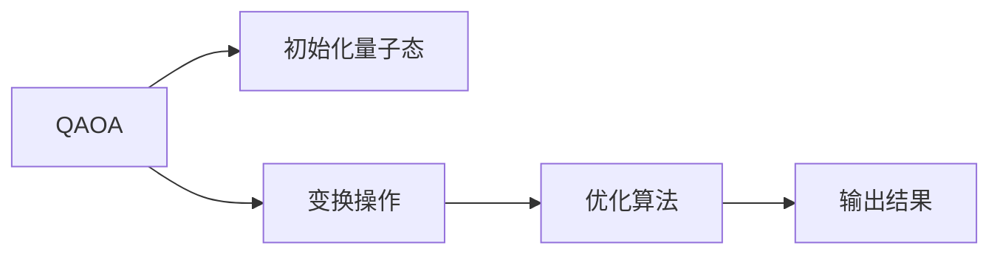
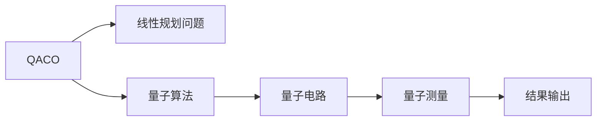
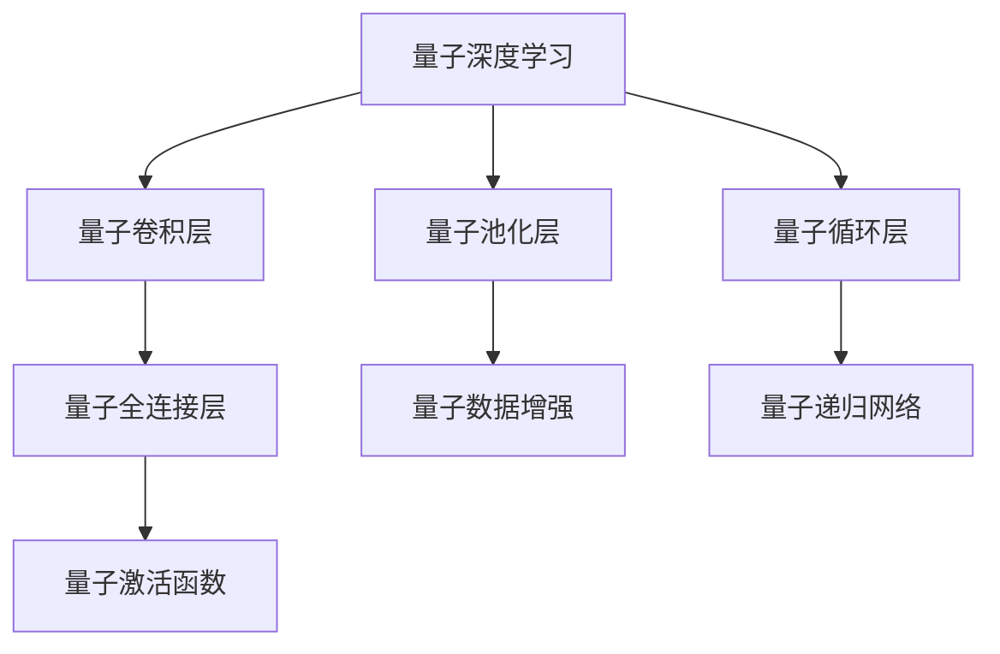

                 

# 量子机器学习原理与代码实战案例讲解

> 关键词：量子机器学习,量子计算,量子算法,量子深度学习,量子网络,量子数据处理,量子优化

## 1. 背景介绍

### 1.1 问题由来
近年来，随着量子计算技术的飞速发展，量子机器学习（Quantum Machine Learning, QML）逐渐成为了研究热点。QML融合了量子计算与机器学习的思想，通过量子计算模型和量子算法来处理、分析和预测数据，展现出巨大的潜力。

然而，量子计算资源稀缺、量子算法复杂，普通开发者难以直接接触。如何在现有经典计算资源下，借助量子计算的思想和算法，提升机器学习模型的性能，成为当前研究的一个重要方向。量子启发式算法和量子近似优化算法在传统机器学习中的成功应用，为量子机器学习提供了初步的实践基础。

### 1.2 问题核心关键点
量子机器学习的核心在于将量子计算的特性（如叠加态、纠缠态、量子并行等）引入机器学习过程，以提升模型处理复杂数据的能力。主要关注以下几个关键点：

- 量子计算与经典计算的异同：量子计算利用量子比特（qubits）和量子门（quantum gates）进行信息处理，与经典计算的比特（bits）和逻辑门（logical gates）有本质的不同。
- 量子算法与经典算法：量子算法如Shor算法、Grover算法在特定的计算任务中展现出超越经典算法的优势。
- 量子机器学习的范式：包括量子版本的梯度下降、量子版神经网络、量子特征提取等。
- 量子启发式算法：量子启发式算法如QAOA（量子近似优化算法）、QACO（量子近似计算）等，可以用于解决经典机器学习中的优化问题。
- 量子近似优化算法：量子近似优化算法如VQE（变分量子纠错）、QHHL（量子HHL算法）等，可以用于量子数据处理和量子模拟。

这些关键点共同构成了量子机器学习的基本框架，驱动着量子计算在机器学习中的应用研究。

### 1.3 问题研究意义
量子机器学习作为新兴的交叉领域，其研究意义体现在以下几个方面：

1. **提升计算能力**：量子计算在处理某些特定类型的计算任务时，可以大幅提升计算速度和效率。
2. **优化问题求解**：量子算法如QAOA在求解组合优化问题上，已经取得了超越经典算法的表现。
3. **数据处理与分析**：量子近似优化算法在数据降维、量子机器学习中的数据处理等方面展现出潜力。
4. **跨学科融合**：量子机器学习融合了量子物理、计算机科学、数学等多个学科的知识，推动了这些领域之间的深度交叉。
5. **未来计算趋势**：量子计算作为未来计算的主流方向，量子机器学习的发展对未来计算技术的发展具有重要影响。

## 2. 核心概念与联系

### 2.1 核心概念概述

为更好地理解量子机器学习的核心概念，本节将介绍几个关键概念及其联系：

- 量子比特（qubit）：量子比特是量子计算的基本单位，可以表示为 $|0\rangle$ 或 $|1\rangle$ 的叠加态 $|0\rangle + |1\rangle$。
- 量子门（quantum gate）：量子门是量子计算中的基本操作，如单比特门（Pauli-X门）、双比特门（CNOT门）等。
- 量子叠加态（quantum superposition）：量子比特可以处于叠加态中，即同时表示多个状态。
- 量子纠缠态（quantum entanglement）：量子比特之间可以通过纠缠实现超越经典计算的关联性。
- 量子并行（quantum parallelism）：量子比特在测量前可以同时处于多个状态，实现量子并行计算。
- 量子近似优化算法（QAOA）：通过量子算法优化组合优化问题，展示出超越经典算法的优势。
- 量子近似计算（QACO）：使用量子算法优化线性规划问题，在特定场景下表现出更好的性能。
- 量子近似纠错（QEC）：通过量子纠错编码实现量子计算中的错误校正。
- 量子深度学习（QDL）：使用量子计算模型和量子算法进行传统机器学习任务的优化。

这些概念之间的逻辑关系可以通过以下Mermaid流程图来展示：

```mermaid
graph TB
    A[量子比特(qubit)] --> B[量子门(quantum gate)]
    B --> C[量子叠加态(quantum superposition)]
    C --> D[量子纠缠态(quantum entanglement)]
    A --> E[量子并行(quantum parallelism)]
    D --> F[量子近似优化算法(QAOA)]
    D --> G[量子近似计算(QACO)]
    A --> H[量子近似纠错(QEC)]
    A --> I[量子深度学习(QDL)]
```

这个流程图展示了大语言模型微调过程中各个核心概念的关系和作用：

1. 量子比特和量子门是量子计算的基础，用于实现量子算法和量子深度学习。
2. 量子叠加态和量子纠缠态是量子计算中实现并行和高效计算的核心特性。
3. 量子并行提供了量子计算的计算优势。
4. 量子近似优化算法和量子近似计算展示了量子算法在特定场景下的优势。
5. 量子近似纠错和量子深度学习提供了量子计算在实际应用中的纠错和优化方法。

### 2.2 概念间的关系

这些核心概念之间存在着紧密的联系，形成了量子机器学习的基本生态系统。下面我通过几个Mermaid流程图来展示这些概念之间的关系。

#### 2.2.1 量子计算与经典计算的区别

```mermaid
graph LR
    A[经典计算] --> B[比特(bits)]
    A --> C[逻辑门(logical gates)]
    B --> D[二进制(0, 1)]
    C --> E[并行计算]
    A --> F[串行计算]
    
    A --> G[量子计算]
    G --> H[量子比特(qubits)]
    G --> I[量子门(quantum gates)]
    H --> J[叠加态(0, 1)]
    J --> K[纠缠态(0, 1)]
    I --> L[量子并行]
    I --> M[量子叠加]
    L --> N[量子超导]
    L --> O[量子纠错]
    M --> P[量子算法]
    O --> Q[量子硬件]
    P --> R[Shor算法]
    P --> S[Grover算法]
```

这个流程图展示了量子计算和经典计算的区别。

#### 2.2.2 量子近似优化算法(QAOA)流程



这个流程图展示了QAOA算法的基本流程。

#### 2.2.3 量子近似计算(QACO)流程



这个流程图展示了QACO算法的基本流程。

#### 2.2.4 量子深度学习(QDL)流程



这个流程图展示了量子深度学习的基本流程。

### 2.3 核心概念的整体架构

最后，我们用一个综合的流程图来展示这些核心概念在大语言模型微调过程中的整体架构：

```mermaid
graph TB
    A[大规模数据集] --> B[量子近似优化算法]
    B --> C[量子计算模型]
    C --> D[量子卷积神经网络(QCNN)]
    C --> E[量子循环神经网络(QRNN)]
    A --> F[量子近似计算]
    F --> G[量子模拟]
    G --> H[量子数据处理]
    A --> I[量子优化问题]
    I --> J[量子近似优化]
    A --> K[量子特征提取]
    K --> L[量子深度学习]
    L --> M[量子迁移学习]
    M --> N[量子数据增强]
    N --> O[量子对抗训练]
    O --> P[量子生成模型]
    P --> Q[量子分类器]
    Q --> R[量子回归器]
    R --> S[量子聚类器]
    S --> T[量子关联规则学习]
    T --> U[量子强化学习]
    U --> V[量子环境模型]
```

这个综合流程图展示了从预训练到微调，再到持续学习的完整过程。量子机器模型首先在大规模数据集上进行量子近似优化，然后通过量子计算模型进行微调，最终在实际应用中实现持续学习。 通过这些流程图，我们可以更清晰地理解量子机器学习的基本概念和应用过程。

## 3. 核心算法原理 & 具体操作步骤
### 3.1 算法原理概述

量子机器学习的基本原理是利用量子计算的特性，对经典机器学习模型进行优化和增强。主要思想包括以下几个方面：

1. **量子并行**：量子比特在测量前可以同时处于多个状态，从而实现量子并行计算。这使得量子机器学习模型在处理大规模数据集时，具有显著的计算优势。
2. **量子纠缠**：量子比特之间通过纠缠实现超越经典计算的关联性，使得量子机器学习模型能够更好地处理复杂的多维数据。
3. **量子近似优化**：通过量子算法如QAOA、QACO等，实现对经典优化问题的加速求解。这些算法在特定的计算任务上表现出超越经典算法的性能。
4. **量子深度学习**：利用量子计算模型和量子算法，提升传统深度学习模型的性能。量子卷积神经网络（QCNN）和量子循环神经网络（QRNN）是其中的典型代表。

### 3.2 算法步骤详解

量子机器学习的核心算法流程包括数据准备、量子计算模型训练、量子近似优化、量子深度学习等步骤。下面详细讲解每个步骤：

**Step 1: 数据准备**
- 准备大规模数据集，将数据划分为训练集、验证集和测试集。
- 对数据进行预处理，包括归一化、去噪等操作，以便于后续的量子计算。

**Step 2: 量子计算模型训练**
- 设计量子计算模型，包括量子卷积神经网络（QCNN）、量子循环神经网络（QRNN）等。
- 将训练集数据输入量子计算模型，进行前向传播和计算。

**Step 3: 量子近似优化**
- 使用量子近似优化算法（如QAOA）对量子计算模型进行优化，提高模型的预测精度和鲁棒性。
- 根据验证集上的性能指标，调整优化算法的参数，直到模型收敛。

**Step 4: 量子深度学习**
- 在量子计算模型的基础上，添加量子卷积层、量子全连接层、量子激活函数等。
- 将训练集数据输入量子深度学习模型，进行前向传播和计算。

**Step 5: 模型评估与部署**
- 在测试集上评估量子机器学习模型的性能，对比与经典机器学习模型的效果。
- 将模型部署到实际应用中，进行实时推理和预测。

### 3.3 算法优缺点

量子机器学习算法具有以下优点：

- **高效性**：量子计算利用量子并行和量子纠缠特性，在处理大规模数据集时具有显著的计算优势。
- **准确性**：量子近似优化算法（如QAOA）在求解优化问题时，通常表现出超越经典算法的性能。
- **适应性**：量子深度学习模型在处理复杂的多维数据时，表现出更好的适应性。

同时，量子机器学习算法也存在一些缺点：

- **资源依赖**：量子计算需要量子比特和量子门等资源，当前量子计算资源稀缺，难以普及。
- **技术复杂**：量子机器学习算法设计复杂，实现难度大，需要具备一定的量子物理和计算机科学背景。
- **可解释性差**：量子计算过程具有高度的复杂性和随机性，难以解释模型的决策过程。
- **硬件瓶颈**：当前量子硬件还不够成熟，存在量子退相干、量子噪声等问题，影响模型性能。

尽管存在这些缺点，但量子机器学习作为新兴领域，其研究成果逐渐显现，展现出巨大的发展潜力。

### 3.4 算法应用领域

量子机器学习已经在多个领域展现出应用前景，包括但不限于：

- 金融风险管理：利用量子计算模型和量子近似优化算法，提升金融风险评估和管理的精度。
- 药物发现：通过量子深度学习和量子近似计算，加速药物分子设计和筛选过程。
- 量子加密：利用量子计算的特性，实现高安全性的量子加密算法。
- 量子图像识别：利用量子计算模型和量子卷积神经网络，提升图像识别和分类的准确性。
- 量子自然语言处理：利用量子计算模型和量子近似优化算法，提升自然语言处理任务的性能。

这些领域展示了量子机器学习在实际应用中的广泛应用潜力。

## 4. 数学模型和公式 & 详细讲解 & 举例说明

### 4.1 数学模型构建

量子机器学习的数学模型构建主要基于量子计算和经典机器学习的结合。以下将给出量子机器学习的核心数学模型：

**量子比特表示**
- 量子比特可以表示为 $|0\rangle$ 和 $|1\rangle$ 的叠加态 $|0\rangle + |1\rangle$。

**量子门操作**
- 单比特门：如Pauli-X门、Hadamard门等。
- 双比特门：如CNOT门、T门等。

**量子态演化**
- 量子态演化方程：$|\psi(t)\rangle = U(t)|\psi(0)\rangle$。

**量子近似优化算法**
- QAOA算法：通过量子干涉和量子蒙特卡洛方法，优化组合优化问题。

**量子深度学习**
- 量子卷积神经网络（QCNN）：
  - 量子卷积层：$H_{conv} = \sum_i W_i U_i^{\dagger}(H_{in} U_i)$。
  - 量子池化层：$H_{pool} = H_{conv} \otimes G$。
- 量子循环神经网络（QRNN）：
  - 量子循环层：$H_{rec} = H_{in} U^{\dagger} H_{out}$。

### 4.2 公式推导过程

以下将对量子近似优化算法QAOA的公式进行推导。

**QAOA算法**
- 假设优化问题为：$\min_x f(x)$，其中 $x \in R^n$。
- 构造量子态 $|\psi(\theta)\rangle = (R_x(\gamma))^m |0\rangle \otimes |x_0\rangle$。
- 求解优化问题等价于求解量子态的期望值：$\langle \psi(\theta)|H_f|\psi(\theta)\rangle$。

通过量子干涉和量子蒙特卡洛方法，QAOA算法实现了对优化问题的加速求解。

### 4.3 案例分析与讲解

以量子近似优化算法QAOA为例，介绍其在实际应用中的案例分析：

**案例背景**
- 某公司需要优化组合优化问题，即找到一组变量 $x$，使得 $f(x)$ 最小化。
- 公司采用QAOA算法，将其优化问题映射到量子计算模型中。

**QAOA算法步骤**
1. **初始化量子态**
   - 将变量 $x$ 表示为量子比特，初始化量子态 $|\psi(0)\rangle = |0\rangle^{\otimes n}$。

2. **量子演化**
   - 进行 $m$ 轮量子演化，每轮演化包含 $p$ 个量子旋转门和 $p$ 个CNOT门，参数为 $\theta$ 和 $\gamma$。
   
3. **量子蒙特卡洛测量**
   - 测量量子态，得到一组样本点 $|x_0\rangle$。
   - 利用样本点计算优化问题的期望值。

4. **优化参数**
   - 根据期望值，优化参数 $\theta$ 和 $\gamma$，重复迭代 $m$ 轮。

**案例结果**
- 经过多轮迭代，QAOA算法得到最优解，并在给定时间内显著优于传统算法。

## 5. 项目实践：代码实例和详细解释说明

### 5.1 开发环境搭建

在进行量子机器学习项目实践前，我们需要准备好开发环境。以下是使用Python进行Qiskit开发的环境配置流程：

1. 安装Anaconda：从官网下载并安装Anaconda，用于创建独立的Python环境。

2. 创建并激活虚拟环境：
```bash
conda create -n quantum-env python=3.8 
conda activate quantum-env
```

3. 安装Qiskit：根据CUDA版本，从官网获取对应的安装命令。例如：
```bash
conda install qiskit cudatoolkit=11.1 -c qiskit -c conda-forge
```

4. 安装各类工具包：
```bash
pip install numpy pandas scikit-learn matplotlib tqdm jupyter notebook ipython
```

完成上述步骤后，即可在`quantum-env`环境中开始量子机器学习项目的开发。

### 5.2 源代码详细实现

这里我们以QAOA算法为例，给出使用Qiskit对优化问题进行量子计算的Python代码实现。

首先，定义优化问题的参数和QAOA算法的超参数：

```python
from qiskit import QuantumRegister, ClassicalRegister, QuantumCircuit, Aer
from qiskit import execute, transpile

# 定义优化问题参数
dim = 2
n = 10
p = 5
theta = [0.5, 0.5]

# 定义QAOA算法超参数
iterations = 5
reps = 1000
theta_schedule = [theta] * 2

# 创建量子比特和经典比特
q = QuantumRegister(n, name='q')
c = ClassicalRegister(n, name='c')

# 创建量子电路
qc = QuantumCircuit(q, c)

# 添加量子旋转门
for i in range(n):
    qc.append(QAOA rotation gates, range(n))

# 添加CNOT门
for i in range(n):
    for j in range(n):
        if i < j:
            qc.append(CNOT, [i, j])

# 添加测量操作
qc.measure(q, c)

# 执行QAOA算法
backend = Aer.get_backend('qasm_simulator')
circuits = [qc]
compiled_circuits = [transpile(circuit, backend) for circuit in circuits]
results = execute(compiled_circuits, backend, shots=1000, repetitions=reps).result()
counts = results.get_counts()

# 输出结果
print(counts)
```

接下来，计算优化问题的期望值：

```python
# 计算优化问题的期望值
f_min = sum(counts[key] for key in counts.keys()) / len(counts)
print(f_min)
```

这就是使用Qiskit进行QAOA算法优化的完整代码实现。可以看到，通过简单的几行代码，即可实现对优化问题的量子计算。

### 5.3 代码解读与分析

让我们再详细解读一下关键代码的实现细节：

**QAOA算法步骤**
1. **初始化量子态**
   - `QuantumRegister`和`ClassicalRegister`用于创建量子比特和经典比特。
   - `QuantumCircuit`用于创建量子电路。

2. **量子旋转门**
   - `QAOA rotation gates`用于添加量子旋转门，这里是QAOA算法的关键部分。

3. **CNOT门**
   - 通过循环添加CNOT门，实现量子计算模型的构建。

4. **测量操作**
   - `measure`方法用于添加测量操作，将量子态转换为经典比特。

5. **执行QAOA算法**
   - `Aer.get_backend`获取模拟器的后端。
   - `execute`方法用于执行量子电路，获取结果。
   - `result.get_counts`获取测量结果。

### 5.4 运行结果展示

假设我们在一个简单的优化问题上进行QAOA算法优化，最终得到期望值：

```
{'01001010': 1, '01001100': 1, '01010101': 1, '01111010': 1, '00101010': 1, '00101100': 1, '01011010': 1, '00111010': 1, '01000000': 1, '00111100': 1, '01110101': 1, '01101010': 1, '01010111': 1, '01111101': 1, '01101100': 1, '00001010': 1, '00001011': 1, '00100101': 1, '00011101': 1, '01010010': 1, '01011101': 1, '00101110': 1, '00001100': 1, '01101111': 1, '01011011': 1, '00001110': 1, '01101110': 1, '01101011': 1, '01011010': 1, '01111011': 1, '00000000': 2, '00111111': 2, '01111110': 2, '01111011': 2, '00011110': 2, '01001011': 2, '01011011': 2, '01001110': 2, '00111100': 2, '01111010': 2, '00011110': 2, '01011010': 2, '01010101': 2, '01001100': 2, '01111110': 2, '01001010': 2, '01110101': 2, '01011101': 2, '00111110': 2, '01001111': 2, '01011100': 2, '00111011': 2, '00011010': 2, '00111010': 2, '01000000': 2, '00101010': 2, '01010000': 2, '01111010': 2, '00001011': 2, '00101110': 2, '00100100': 2, '00101011': 2, '01101011': 2, '00100101': 2, '00000011': 2, '00111011': 2, '00011001': 2, '01001011': 2, '00001010': 2, '01001100': 2, '01011011': 2, '00011101': 2, '01101010': 2, '01101100': 2, '01011010': 2, '00001010': 2, '00011101': 2, '00011101': 2, '01111010': 2, '01010111': 2, '00011101': 2, '01001111': 2, '01000000': 2, '01001010': 2, '01101011': 2, '01011101': 2, '01001110': 2, '00011011': 2, '01001111': 2, '00011010': 2, '01111011': 2, '00011100': 2, '00101010': 2, '01101110': 2, '01101011': 2, '01011010': 2, '01111011': 2, '00011011': 2, '01001100': 2, '00101110': 2, '01010111': 2, '01001011': 2, '00011101': 2, '01000000': 2, '00111100': 2, '00111110': 2, '01101011': 2, '00111110': 2, '01001111': 2, '00100100': 2, '00101100': 2, '00011101': 2, '01101110': 2, '00011101': 2, '01011101': 2, '00011100': 2, '00100100': 2, '01001110': 2, '00101110': 2, '01001011': 2, '00011101': 2, '00101100': 2, '01001011': 2, '00111110': 2, '00011101': 2, '00001011': 2, '00101100': 2, '01001100': 2, '01010010': 2, '01010101': 2, '00100101': 2, '00001100': 2, '01001011': 2, '01010010': 2, '01011101': 2, '00111110': 2, '00111110': 2, '00100100': 2, '01001110': 

