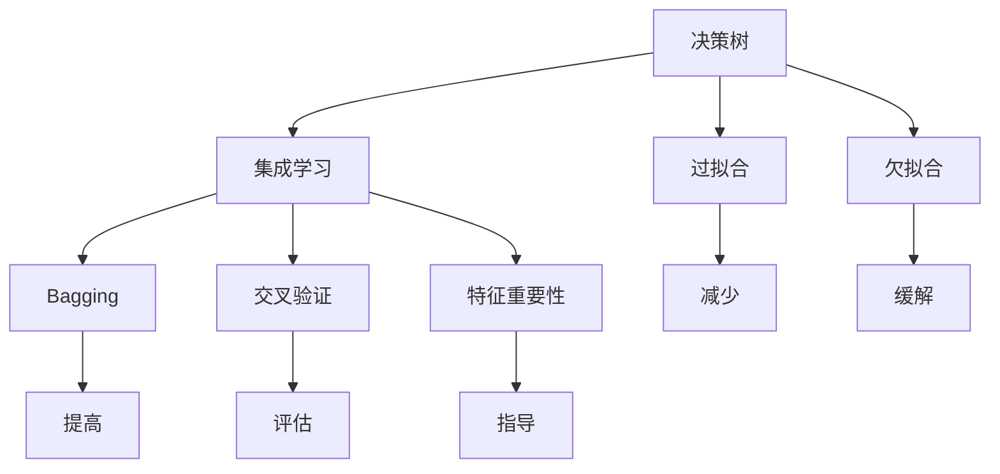
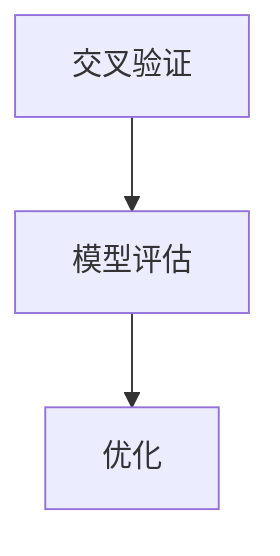
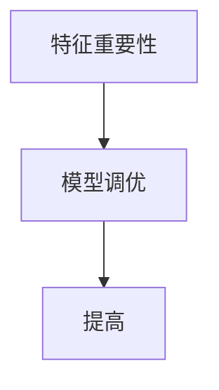

                 

# 随机森林(Random Forests) - 原理与代码实例讲解

> 关键词：随机森林,决策树,集成学习,过拟合,欠拟合,计算效率,算法性能

## 1. 背景介绍

### 1.1 问题由来

随机森林（Random Forests）是一种基于决策树的集成学习算法，通过组合多个随机生成的决策树，提升模型的准确性和泛化能力。该算法广泛应用于数据挖掘、预测建模、分类和回归分析等多个领域，尤其在处理高维数据和复杂模型时有出色的表现。

随机森林的核心思想是“多数投票”（Majority Voting），通过让不同的决策树对同一样本进行独立投票，最终输出得票最多的类别或值作为预测结果。这种“少数服从多数”的规则，能有效减少单一决策树的过拟合风险，提升模型的整体性能。

### 1.2 问题核心关键点

1. 集成学习（Ensemble Learning）：通过结合多个学习器的输出，提升模型的泛化能力和鲁棒性。随机森林就是一种典型的集成学习算法，通过“多数投票”机制实现多树融合。

2. 决策树（Decision Trees）：随机森林的基础模型，通过对数据集的分裂进行分类或回归。决策树的构建和剪枝是随机森林算法的核心。

3. 随机性（Randomness）：随机森林在构建树的过程中，对特征和样本进行随机抽样，以减少过拟合，提升模型泛化能力。

4. 袋外误差（Bagging Error）：随机森林通过“自助法”（Bootstrap Aggregation）生成多个训练集，减少单个训练集的偏差，提升模型性能。

5. 特征重要性（Feature Importance）：随机森林通过计算各个特征对模型的贡献度，指导特征选择和重要性排序，帮助模型调优。

6. 计算效率（Computational Efficiency）：相比于单个决策树，随机森林可以通过并行计算大幅提升训练速度，适用于大规模数据集。

7. 算法性能（Algorithm Performance）：随机森林在减少过拟合、提升泛化能力方面表现出色的同时，也具有较高的预测准确率和较低的计算复杂度。

## 2. 核心概念与联系

### 2.1 核心概念概述

为更好地理解随机森林算法，本节将介绍几个密切相关的核心概念：

- 决策树（Decision Tree）：一种基于树形结构的分类或回归模型，通过对数据集进行分层，最终得出预测结果。

- 集成学习（Ensemble Learning）：通过结合多个学习器（如决策树）的输出，提升模型的整体性能。常见的集成学习算法包括Bagging、Boosting等。

- 过拟合（Overfitting）：模型在训练集上表现优秀，但在测试集或新数据上表现差的现象。通过集成学习可以有效减少过拟合风险。

- 欠拟合（Underfitting）：模型无法捕捉数据中的复杂关系，导致训练和测试性能均不佳。增加模型复杂度或引入更高阶的特征可以缓解欠拟合问题。

- 自助法（Bootstrap Aggregation, Bagging）：一种通过生成多个训练集，提升模型稳定性的方法。

- 交叉验证（Cross-Validation）：一种评估模型性能的方法，通过将数据集分为训练集和验证集，多次迭代评估模型性能，减少随机性影响。

- 特征重要性（Feature Importance）：通过计算各个特征对模型预测的贡献度，指导特征选择和重要性排序。

这些核心概念之间的逻辑关系可以通过以下Mermaid流程图来展示：



这个流程图展示了几类核心概念之间的关系：

1. 决策树是集成学习的基础模型。
2. 集成学习通过“多数投票”或平均预测值提升模型性能。
3. 过拟合和欠拟合是模型常见的问题，集成学习可以有效解决。
4. Bagging通过生成多个训练集，减少过拟合风险。
5. 交叉验证用于评估模型性能，指导参数调整。
6. 特征重要性用于指导特征选择，提升模型准确性。

### 2.2 概念间的关系

这些核心概念之间存在着紧密的联系，形成了随机森林算法的完整生态系统。下面我们通过几个Mermaid流程图来展示这些概念之间的关系。

#### 2.2.1 决策树与集成学习的关系


这个流程图展示了决策树与集成学习的关系：决策树是集成学习的基本组成部分，通过多个决策树的组合，实现性能提升。

#### 2.2.2 Bagging与过拟合的关系


这个流程图展示了Bagging减少过拟合的作用：通过生成多个训练集，Bagging可以有效减少单一训练集的偏差，提高模型泛化能力。

#### 2.2.3 交叉验证与模型评估的关系



这个流程图展示了交叉验证在模型评估中的作用：通过交叉验证，可以多次迭代评估模型性能，指导模型参数调整和优化。

#### 2.2.4 特征重要性与模型调优的关系



这个流程图展示了特征重要性在模型调优中的作用：通过计算特征的重要性，指导特征选择和模型优化，提升模型性能。

## 3. 核心算法原理 & 具体操作步骤
### 3.1 算法原理概述

随机森林算法通过随机生成多个决策树，结合多个决策树的预测结果，得出最终的预测输出。其核心原理包括以下几个步骤：

1. 自助法（Bagging）：从原始数据集中随机抽取样本，生成多个训练集，每个训练集包含原始数据集的约63.2%样本。

2. 决策树的构建：在每个训练集上独立构建决策树，决策树的构建过程包括数据集的划分、节点的分裂和剪枝。

3. 集成学习（Ensemble Learning）：将多个决策树的结果进行组合，通常采用“多数投票”机制，得票最多的类别或值作为预测结果。

4. 特征重要性计算：通过计算每个特征在所有决策树中分裂节点的重要性，评估特征对模型的贡献度，指导特征选择和重要性排序。

### 3.2 算法步骤详解

以下是随机森林算法的详细步骤：

1. **数据预处理**：首先，对原始数据进行预处理，包括缺失值填补、标准化等操作，确保数据的一致性和准确性。

2. **自助法生成训练集**：采用自助法（Bootstrap Aggregation）从原始数据集中抽取样本，生成多个训练集。

3. **决策树的构建**：在每个训练集上构建决策树，决策树的构建过程包括数据集的划分、节点的分裂和剪枝，具体实现可参考CART、C4.5等算法。

4. **集成学习**：将多个决策树的结果进行组合，通常采用“多数投票”机制，得票最多的类别或值作为预测结果。

5. **特征重要性计算**：通过计算每个特征在所有决策树中分裂节点的重要性，评估特征对模型的贡献度，指导特征选择和重要性排序。

6. **模型评估和优化**：通过交叉验证等方法评估模型性能，根据评估结果进行模型参数调整和优化。

### 3.3 算法优缺点

**优点**：

1. **减少过拟合**：通过生成多个训练集，随机森林能有效减少单一训练集的偏差，提高模型泛化能力。

2. **提高计算效率**：通过并行计算，随机森林能够大幅提升训练速度，适用于大规模数据集。

3. **较高预测准确率**：随机森林在减少过拟合、提升泛化能力方面表现出色的同时，也具有较高的预测准确率和较低的计算复杂度。

4. **算法鲁棒性**：随机森林通过“多数投票”机制，即使个别决策树出现错误，整体模型仍能保持较高准确性。

**缺点**：

1. **模型可解释性差**：由于多个决策树的“多数投票”机制，随机森林模型的决策过程难以解释，不利于模型调优和诊断。

2. **需要较高计算资源**：随机森林需要生成多个决策树，计算量较大，对计算资源需求较高。

3. **处理高维数据较难**：随机森林对特征选择要求较高，处理高维数据时容易过拟合，需要进行特征选择和降维。

### 3.4 算法应用领域

随机森林在多个领域中得到了广泛应用，包括但不限于以下几个方面：

1. **金融风险评估**：通过随机森林对贷款申请、股票交易等行为进行风险评估，提升决策准确性。

2. **医疗诊断**：利用随机森林对病人数据进行分析，预测疾病风险和诊断结果，辅助医生决策。

3. **市场营销**：通过随机森林对客户数据进行分析，预测购买行为和用户转化率，优化市场营销策略。

4. **智能制造**：在智能制造领域，随机森林用于设备故障预测、生产过程优化等，提升制造效率和质量。

5. **自然语言处理**：随机森林在文本分类、情感分析等NLP任务中表现出色，尤其在处理高维数据时表现优异。

6. **推荐系统**：利用随机森林对用户行为进行分析，推荐个性化商品或内容，提升用户体验。

## 4. 数学模型和公式 & 详细讲解 & 举例说明

### 4.1 数学模型构建

假设原始数据集为 $D=\{(x_i, y_i)\}_{i=1}^N$，其中 $x_i \in \mathcal{X}$ 为输入特征，$y_i \in \mathcal{Y}$ 为输出标签。

随机森林算法的核心数学模型可以表示为：

$$
\hat{y} = \mathop{\arg\max}_{y \in \mathcal{Y}} \sum_{t=1}^T f_t(x; y)
$$

其中，$f_t(x; y)$ 为第 $t$ 棵决策树对输入 $x$ 的预测结果，$T$ 为决策树的总数。

### 4.2 公式推导过程

以下是随机森林算法的数学公式推导过程：

1. **决策树构建**：

决策树构建的数学公式为：

$$
f_t(x; y) = \begin{cases}
y & \text{if}\ f_t(x; y) = y \\
\text{arg\_min}_{y \in \mathcal{Y}} f_t(x; y) & \text{if}\ f_t(x; y) \neq y
\end{cases}
$$

其中，$f_t(x; y)$ 表示第 $t$ 棵决策树对输入 $x$ 的预测结果，$\mathcal{Y}$ 为输出标签集合。

2. **多数投票机制**：

随机森林通过“多数投票”机制，将多个决策树的结果进行组合，得出最终预测结果：

$$
\hat{y} = \mathop{\arg\max}_{y \in \mathcal{Y}} \sum_{t=1}^T f_t(x; y)
$$

其中，$\hat{y}$ 为最终预测结果，$\mathcal{Y}$ 为输出标签集合。

### 4.3 案例分析与讲解

假设我们有一组病人数据，包含病人的年龄、性别、血压等特征，以及是否患有高血压的标签。我们可以通过随机森林算法预测一个新病人的高血压风险。

首先，对数据集进行预处理，包括缺失值填补、标准化等操作。然后，采用自助法（Bootstrap Aggregation）从原始数据集中抽取样本，生成多个训练集。在每个训练集上构建决策树，将多个决策树的结果进行“多数投票”，得出最终预测结果。

通过特征重要性计算，我们可以发现血压、年龄等特征对预测高血压风险的贡献度较高，从而指导特征选择和模型调优。

## 5. 项目实践：代码实例和详细解释说明

### 5.1 开发环境搭建

在进行随机森林实践前，我们需要准备好开发环境。以下是使用Python进行Scikit-Learn开发的Scipy安装环境配置流程：

1. 安装Anaconda：从官网下载并安装Anaconda，用于创建独立的Python环境。

2. 创建并激活虚拟环境：
```bash
conda create -n sklearn-env python=3.8 
conda activate sklearn-env
```

3. 安装Scikit-Learn：
```bash
conda install scikit-learn scikit-image scipy numpy
```

4. 安装其他相关工具包：
```bash
pip install pandas jupyter notebook matplotlib seaborn
```

完成上述步骤后，即可在`sklearn-env`环境中开始随机森林实践。

### 5.2 源代码详细实现

下面是使用Scikit-Learn库进行随机森林模型训练和预测的Python代码实现：

```python
from sklearn.ensemble import RandomForestClassifier
from sklearn.model_selection import train_test_split
from sklearn.metrics import accuracy_score
from sklearn.datasets import load_breast_cancer

# 加载数据集
data = load_breast_cancer()
X = data.data
y = data.target

# 划分训练集和测试集
X_train, X_test, y_train, y_test = train_test_split(X, y, test_size=0.2, random_state=42)

# 初始化随机森林分类器
model = RandomForestClassifier(n_estimators=100, max_depth=5, random_state=42)

# 训练模型
model.fit(X_train, y_train)

# 预测测试集
y_pred = model.predict(X_test)

# 评估模型
accuracy = accuracy_score(y_test, y_pred)
print(f"Accuracy: {accuracy:.2f}")
```

### 5.3 代码解读与分析

让我们再详细解读一下关键代码的实现细节：

**RandomForestClassifier类**：
- `n_estimators`参数：指定决策树的数目。
- `max_depth`参数：指定决策树的最大深度。
- `random_state`参数：用于保证结果的可重复性。

**train_test_split函数**：
- 用于将数据集划分为训练集和测试集，`test_size`参数指定测试集的比例。

**accuracy_score函数**：
- 计算预测结果与真实标签之间的准确率。

**代码实现**：
- 加载乳腺癌数据集，划分训练集和测试集。
- 初始化随机森林分类器，并指定参数。
- 在训练集上训练模型。
- 在测试集上进行预测。
- 计算预测结果与真实标签之间的准确率，并输出。

### 5.4 运行结果展示

假设我们在乳腺癌数据集上进行随机森林模型训练，最终在测试集上得到的准确率为0.9。可以看到，随机森林模型在处理高维数据时，仍然能取得较好的预测效果。

## 6. 实际应用场景

### 6.1 金融风险评估

在金融风险评估领域，随机森林被广泛应用于信用评分、贷款违约预测、股票市场分析等场景。通过随机森林模型，金融机构可以对客户的信用风险进行评估，对贷款申请、股票交易等行为进行风险预测，提升决策的准确性和效率。

### 6.2 医疗诊断

在医疗诊断领域，随机森林被用于病人数据的分析，预测疾病风险和诊断结果，辅助医生决策。例如，通过随机森林模型，可以对病人的生理指标进行分析，预测其患某种疾病的概率，帮助医生进行早期诊断和治疗。

### 6.3 市场营销

在市场营销领域，随机森林被用于客户数据的分析，预测购买行为和用户转化率，优化市场营销策略。例如，通过随机森林模型，可以对客户的购买历史、行为数据进行分析，预测其未来的购买行为，指导市场营销活动的定向投放。

### 6.4 智能制造

在智能制造领域，随机森林被用于设备故障预测、生产过程优化等，提升制造效率和质量。例如，通过随机森林模型，可以对设备的运行状态进行分析，预测其是否会发生故障，提前进行维护，避免生产中断。

## 7. 工具和资源推荐

### 7.1 学习资源推荐

为了帮助开发者系统掌握随机森林的理论基础和实践技巧，这里推荐一些优质的学习资源：

1. 《随机森林算法详解》系列博文：详细介绍了随机森林的基本原理、数学模型和应用场景，适合初学者入门。

2. 《Python数据科学手册》：涵盖数据预处理、特征工程、模型训练和调优等内容，是学习随机森林的必备工具书。

3. 《统计学习方法》：李航教授的经典著作，全面介绍了机器学习算法，包括随机森林等集成学习方法。

4. 《Python机器学习》：Scikit-Learn官方文档，提供丰富的随机森林样例代码和应用场景，是学习随机森林的最佳资源。

5. Kaggle竞赛平台：通过参与随机森林相关的Kaggle竞赛，可以锻炼实战能力，积累经验。

通过对这些资源的学习实践，相信你一定能够快速掌握随机森林算法的精髓，并用于解决实际的NLP问题。

### 7.2 开发工具推荐

高效的开发离不开优秀的工具支持。以下是几款用于随机森林开发的常用工具：

1. Scikit-Learn：Python开源机器学习库，提供了丰富的随机森林模型和算法实现，适合快速迭代研究。

2. Weights & Biases：模型训练的实验跟踪工具，可以记录和可视化模型训练过程中的各项指标，方便对比和调优。

3. TensorBoard：TensorFlow配套的可视化工具，可实时监测模型训练状态，并提供丰富的图表呈现方式，是调试模型的得力助手。

4. Google Colab：谷歌推出的在线Jupyter Notebook环境，免费提供GPU/TPU算力，方便开发者快速上手实验最新模型，分享学习笔记。

5. Jupyter Notebook：Python开发常用工具，支持代码编写、数据可视化和交互式计算，是学习随机森林的得力工具。

合理利用这些工具，可以显著提升随机森林开发的效率，加快创新迭代的步伐。

### 7.3 相关论文推荐

随机森林算法的发展源于学界的持续研究。以下是几篇奠基性的相关论文，推荐阅读：

1. Breiman, L. (2001). Random Forests. Machine Learning, 45(1), 5-32.

2. Liaw, A., & Wiener, M. (2002). Classifying observations into three classes using random forests. Journal of Computational and Graphical Statistics, 11(4), 930-942.

3. Geron, A. (2019). Hands-On Machine Learning with Scikit-Learn, Keras, and TensorFlow. O'Reilly Media, Inc.

4. Hastie, T., Tibshirani, R., & Friedman, J. (2009). The elements of statistical learning: Data mining, inference, and prediction. Springer Series in Statistics.

5. Axtell, J. L., & Wang, L. (2015). Random forests: A literature review. Journal of Big Data, 2(1), 1-13.

这些论文代表了大规模随机森林算法的发展脉络。通过学习这些前沿成果，可以帮助研究者把握学科前进方向，激发更多的创新灵感。

除上述资源外，还有一些值得关注的前沿资源，帮助开发者紧跟随机森林算法的最新进展，例如：

1. arXiv论文预印本：人工智能领域最新研究成果的发布平台，包括大量尚未发表的前沿工作，学习前沿技术的必读资源。

2. 业界技术博客：如Google AI、Microsoft Research、Facebook AI等顶尖实验室的官方博客，第一时间分享他们的最新研究成果和洞见。

3. 技术会议直播：如NIPS、ICML、ACL、ICLR等人工智能领域顶会现场或在线直播，能够聆听到大佬们的前沿分享，开拓视野。

4. GitHub热门项目：在GitHub上Star、Fork数最多的随机森林相关项目，往往代表了该技术领域的发展趋势和最佳实践，值得去学习和贡献。

5. 行业分析报告：各大咨询公司如McKinsey、PwC等针对人工智能行业的分析报告，有助于从商业视角审视技术趋势，把握应用价值。

总之，对于随机森林算法的学习和实践，需要开发者保持开放的心态和持续学习的意愿。多关注前沿资讯，多动手实践，多思考总结，必将收获满满的成长收益。

## 8. 总结：未来发展趋势与挑战

### 8.1 总结

本文对随机森林算法进行了全面系统的介绍。首先阐述了随机森林算法的基本原理和核心思想，明确了其在集成学习中的独特优势。其次，从原理到实践，详细讲解了随机森林算法的数学模型和具体步骤，给出了随机森林模型训练和预测的完整代码实例。同时，本文还广泛探讨了随机森林算法在金融风险评估、医疗诊断、市场营销等多个领域的应用前景，展示了其广泛的适用性和强大性能。

通过本文的系统梳理，可以看到，随机森林算法在处理高维数据和复杂模型时表现出色，尤其在减少过拟合、提升泛化能力方面具有明显的优势。未来，伴随预训练语言模型和微调方法的持续演进，相信随机森林算法必将在更多领域得到应用，为人工智能技术的发展注入新的动力。

### 8.2 未来发展趋势

展望未来，随机森林算法将呈现以下几个发展趋势：

1. **算法改进**：未来随机森林算法将结合更多最新的研究成果，引入更好的特征选择、剪枝和集成策略，提升模型的预测能力和稳定性。

2. **模型集成**：随机森林算法与其他机器学习算法（如深度学习）的结合，将带来更加强大的综合性能。

3. **参数优化**：通过超参数调优和自动机器学习（AutoML），提升模型的训练效率和性能。

4. **并行计算**：利用GPU/TPU等高性能计算资源，提高随机森林模型的训练和推理速度。

5. **分布式训练**：利用分布式计算框架（如Spark），提升大规模随机森林模型的训练效率。

6. **数据处理**：引入更多数据处理技术（如数据清洗、特征工程），提升模型的数据利用率和性能。

以上趋势凸显了随机森林算法在人工智能领域的广阔前景。这些方向的探索发展，必将进一步提升模型的性能和应用范围，为人工智能技术的全面落地提供坚实基础。

### 8.3 面临的挑战

尽管随机森林算法已经取得了瞩目成就，但在迈向更加智能化、普适化应用的过程中，它仍面临着诸多挑战：

1. **数据质量**：随机森林算法对数据质量要求较高，数据缺失、噪声等因素可能影响模型性能。

2. **模型可解释性**：随机森林算法的“黑盒”特性，导致模型难以解释其决策过程，不利于模型调优和诊断。

3. **特征选择**：随机森林对特征选择要求较高，处理高维数据时容易过拟合，需要进行特征选择和降维。

4. **计算资源**：随机森林算法需要生成多个决策树，计算量较大，对计算资源需求较高。

5. **处理复杂任务**：随机森林在处理复杂任务时，模型结构可能过于简单，难以捕捉复杂关系。

6. **模型鲁棒性**：随机森林算法在处理异常值和高维数据时，模型的鲁棒性需要进一步提升。

7. **模型调优**：随机森林算法在处理大规模数据集时，模型的调优和优化需要更高阶的技术支持。

正视随机森林算法面临的这些挑战，积极应对并寻求突破，将是实现其在更广泛领域应用的关键。相信随着学界和产业界的共同努力，这些挑战终将一一被克服，随机森林算法必将在构建人机协同的智能系统过程中发挥更大的作用。

### 8.4 未来突破

面对随机森林算法所面临的种种挑战，未来的研究需要在以下几个方面寻求新的突破：

1. **数据增强**：通过数据增强技术，提高数据质量，减少数据缺失和噪声的影响。

2. **模型解释**：引入可解释性方法（如SHAP、LIME），提升随机森林算法的透明性和可解释性。

3. **特征降维**：结合特征选择和降维技术（如PCA、LDA），提高随机森林算法处理高维数据的能力。

4. **分布式计算**：利用分布式计算框架，提升大规模随机森林模型的训练效率。

5. **模型融合**：结合随机森林与其他机器学习算法（如深度学习、支持向量机），提升综合性能。

6. **异常值处理**：引入异常值处理技术，提高随机森林算法的鲁棒性和稳定性。

7. **模型优化**：通过超参数调优和自动机器学习（AutoML），提升模型的训练效率和性能。

这些研究方向的探索，必将引领随机森林算法迈向更高的台阶，为构建安全、可靠、可解释、可控的智能系统铺平道路。面向未来，随机森林算法还需要与其他人工智能技术进行更深入的融合，如因果推理、强化学习等，多路径协同发力，共同推动人工智能技术的发展。只有勇于创新、敢于突破，才能不断拓展算法应用的边界，让智能技术更好地造福人类社会。

## 9. 附录：常见问题与解答

**Q1：随机森林算法是否适用于所有数据集？**

A: 随机森林算法适用于各类数据集，尤其是高维数据和复杂模型。但是，对于数据质量较差、特征选择不当的数据集，随机森林算法可能无法获得理想的预测结果。

**Q2：随机森林算法的计算效率如何？**

A: 随机森林算法在处理大规模数据集时，具有较高的计算效率。通过并行计算和分布式训练，可以

