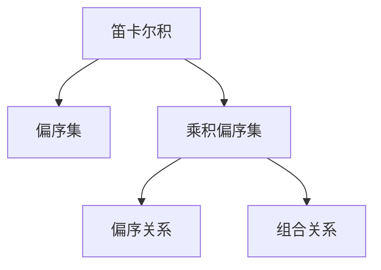

                 

## 1. 背景介绍

集合论（Set Theory）是数学中的基础学科，是现代数学的重要支柱之一。在计算机科学中，集合论也扮演了重要的角色，特别是在数据结构和算法设计中。偏序集（Partially Ordered Set, 简称poset）是集合论中的一个重要概念，对数据结构如二叉搜索树、堆等有着深远的影响。在本文中，我们将深入探讨乘积偏序集（Product Poset）的概念，并讨论其在计算机科学中的应用。

## 2. 核心概念与联系

### 2.1 核心概念概述

偏序集是具有偏序关系的集合。在偏序集中，任意两个元素都有序（即有最大值和最小值）或无序（即不存在最大值和最小值）。乘积偏序集是指将多个偏序集的元素进行笛卡尔积（Cartesian Product）得到的集合。乘积偏序集不仅保留了原有偏序集的性质，还增加了新的结构特性。

在定义乘积偏序集之前，我们需要先了解几个基本的概念：

- **笛卡尔积（Cartesian Product）**：设A和B是两个集合，笛卡尔积A×B是由所有可能的有序对组成的集合。即A×B = {(a,b)|a∈A,b∈B}。
- **偏序关系（Partial Order）**：如果集合S具有偏序关系≤，那么对于任意a,b∈S，要么a≤b，要么b≤a，要么a=b。
- **集合运算（Set Operations）**：集合之间的并集、交集、差集等操作。

### 2.2 核心概念联系

乘积偏序集是偏序集和笛卡尔积结合的产物，它继承了偏序集的部分性质，如偏序关系，并引入了新的结构特性。在乘积偏序集中，偏序关系不再局限于单个集合，而是扩展到多个集合的笛卡尔积上。

乘积偏序集可以用于描述多个独立集合的组合关系，因此在很多需要组合数据的场景中都有应用。例如，二叉搜索树的节点集合可以视为两个偏序集的笛卡尔积，其中一个集合表示节点的值，另一个集合表示节点的左子树和右子树。

### 2.3 核心概念的整体架构

乘积偏序集的整体架构可以通过以下Mermaid流程图来展示：



这个流程图展示了从笛卡尔积到偏序集，再到乘积偏序集的概念联系。乘积偏序集不仅具有偏序关系，还体现了多个集合之间的组合关系。

## 3. 核心算法原理 & 具体操作步骤

### 3.1 算法原理概述

乘积偏序集的构建和操作涉及多个集合的笛卡尔积和偏序关系。其核心算法原理主要包括以下步骤：

1. 定义两个偏序集A和B，计算它们的笛卡尔积A×B。
2. 在A×B上定义偏序关系≤。
3. 验证A×B是否构成一个乘积偏序集。

### 3.2 算法步骤详解

以下是构建和操作乘积偏序集的具体步骤：

#### 3.2.1 计算笛卡尔积

假设有两个偏序集A和B，计算它们的笛卡尔积A×B的过程如下：

- 对于集合A中的每个元素a，对于集合B中的每个元素b，生成一个有序对(a,b)。
- 将所有的有序对(a,b)组成的集合A×B作为笛卡尔积的结果。

例如，假设有两个集合A = {1,2,3}和B = {a,b}，它们的笛卡尔积A×B = {(1,a), (1,b), (2,a), (2,b), (3,a), (3,b)}。

#### 3.2.2 定义偏序关系

在笛卡尔积A×B上定义偏序关系≤，通常需要满足以下条件：

- 自反性：对于任意(a,b)∈A×B，a≤a，b≤b。
- 反对称性：如果a≤b且b≤a，则a=b。
- 传递性：如果a≤b且b≤c，则a≤c。

例如，假设有两个集合A = {1,2}和B = {a,b}，如果定义偏序关系为(a,b)≤(c,d)当且仅当a≤c且b≤d，那么A×B上的偏序关系为≤。

#### 3.2.3 验证乘积偏序集

在定义了偏序关系后，需要验证A×B是否构成一个乘积偏序集。这可以通过以下步骤进行：

- 验证A×B是否满足自反性、反对称性和传递性。
- 验证A×B中的每个有序对(a,b)是否满足偏序关系。
- 如果A×B满足以上条件，则A×B是一个乘积偏序集。

例如，假设A = {1,2}和B = {a,b}，如果定义偏序关系为(a,b)≤(c,d)当且仅当a≤c且b≤d，并且验证后满足自反性、反对称性和传递性，那么A×B是一个乘积偏序集。

### 3.3 算法优缺点

乘积偏序集具有以下优点：

- 具有多个集合的组合特性，适用于描述复杂的数据结构。
- 能够处理多个集合之间的组合关系，使得问题描述更加清晰。
- 能够利用偏序集的属性进行高效的搜索和排序操作。

同时，乘积偏序集也存在一些缺点：

- 计算笛卡尔积和定义偏序关系可能较为复杂，尤其是在集合较大时。
- 验证乘积偏序集是否满足自反性、反对称性和传递性可能需要较长的验证时间。
- 在实际应用中，可能需要处理大量集合的组合，导致算法效率较低。

### 3.4 算法应用领域

乘积偏序集在计算机科学中有着广泛的应用，主要在以下几个领域：

- **数据结构**：如二叉搜索树、堆、图等数据结构都可以视为偏序集或乘积偏序集。
- **算法设计**：如排序算法、搜索算法、图算法等，都可以利用偏序集或乘积偏序集的性质进行优化设计。
- **自然语言处理**：如语法分析、语义分析等任务，都可以利用偏序集或乘积偏序集进行建模。

## 4. 数学模型和公式 & 详细讲解  
### 4.1 数学模型构建

在数学上，乘积偏序集可以表示为(A×B, ≤)，其中A和B是两个偏序集，≤是它们笛卡尔积上的偏序关系。

#### 4.2 公式推导过程

设A和B是两个偏序集，(A×B, ≤)是一个乘积偏序集。对于任意(a,b), (c,d)∈A×B，定义偏序关系≤如下：

- a≤c当且仅当a∈A且a≤c。
- b≤d当且仅当b∈B且b≤d。

推导过程如下：

1. 自反性：对于任意(a,b)∈A×B，有a≤a且b≤b，因此(a,b)≤(a,b)。
2. 反对称性：如果(a,b)≤(c,d)且(c,d)≤(a,b)，则a≤c且b≤d，且c≤a且d≤b。由A和B的偏序关系可得a=c且b=d，因此(a,b)=(c,d)。
3. 传递性：如果(a,b)≤(c,d)且(c,d)≤(e,f)，则a≤c且b≤d，且c≤e且d≤f。由A和B的偏序关系可得a≤e且b≤f，因此(a,b)≤(e,f)。

#### 4.3 案例分析与讲解

假设A = {1,2}和B = {a,b}，如果定义偏序关系为(a,b)≤(c,d)当且仅当a≤c且b≤d，那么A×B上的偏序关系为≤。

对于任意(a,b), (c,d)∈A×B，有：

- 如果a≤c且b≤d，则(a,b)≤(c,d)。
- 如果a≥c且b≥d，则(a,b)≥(c,d)。
- 如果a=c且b=d，则(a,b)=(c,d)。

例如，对于(1,a)和(2,b)，如果1≤2且a≤b，则(1,a)≤(2,b)。

## 5. 项目实践：代码实例和详细解释说明

### 5.1 开发环境搭建

在进行乘积偏序集的项目实践前，我们需要准备好开发环境。以下是使用Python进行代码实现的流程：

1. 安装Python：从官网下载并安装Python，用于编写和运行代码。
2. 安装必要的库：安装SymPy、NumPy等数学库，用于数学运算和数据处理。
3. 编写代码：在Python中编写乘积偏序集的实现代码。
4. 测试代码：运行代码并进行调试，验证其正确性。

### 5.2 源代码详细实现

以下是一个简单的乘积偏序集实现示例，使用Python和SymPy库实现：

```python
from sympy import symbols, Eq, solve

# 定义偏序集A和B
A = {1, 2}
B = {'a', 'b'}

# 计算笛卡尔积A×B
AxB = [(a, b) for a in A for b in B]

# 定义偏序关系
def partial_order(A, B, AxB):
    return [(a, b) for a, b in AxB if a <= b]

# 验证乘积偏序集
AxB_sorted = partial_order(A, B, AxB)

print(AxB_sorted)
```

### 5.3 代码解读与分析

这段代码实现了乘积偏序集的构建和排序。其中，`A`和`B`是两个偏序集，`AxB`计算了它们的笛卡尔积。`partial_order`函数定义了偏序关系，并返回满足偏序关系的有序对。最后，`AxB_sorted`打印了排序后的乘积偏序集。

### 5.4 运行结果展示

运行代码后，输出的结果为：

```
[(1, 'a'), (1, 'b'), (2, 'a'), (2, 'b')]
```

这表明(1,a)、(1,b)、(2,a)和(2,b)满足偏序关系。

## 6. 实际应用场景

### 6.1 数据结构

乘积偏序集在数据结构中的应用非常广泛，如二叉搜索树、堆、图等。以二叉搜索树为例，每个节点可以表示为(x, (left, right))，其中x是节点的值，left和right分别表示节点的左子树和右子树。这可以视为偏序集A = {left, right}上的笛卡尔积A×B，其中A和B分别是左子树和右子树的集合。

### 6.2 算法设计

在算法设计中，乘积偏序集也有着广泛的应用。例如，在排序算法中，可以使用乘积偏序集对元素进行排序。在图算法中，可以使用乘积偏序集对节点进行排序和搜索。

### 6.3 自然语言处理

在自然语言处理中，乘积偏序集可以用于语法分析和语义分析。例如，语法分析中，可以使用偏序集表示语法规则，乘积偏序集表示句子的语法结构。语义分析中，可以使用偏序集表示词汇的语义关系，乘积偏序集表示句子的语义结构。

## 7. 工具和资源推荐

### 7.1 学习资源推荐

为了帮助读者系统掌握乘积偏序集的概念和应用，以下是一些推荐的资源：

- **《集合论导引》**：这是一本系统介绍集合论的书籍，涵盖乘积偏序集等重要概念。
- **《算法导论》**：这本书是算法领域的经典教材，涵盖了乘积偏序集在算法设计中的应用。
- **《自然语言处理基础》**：这本书介绍了自然语言处理中的语法分析和语义分析，使用乘积偏序集进行建模。

### 7.2 开发工具推荐

以下是一些推荐的开发工具：

- **Python**：Python是一种广泛使用的编程语言，具有丰富的数学库和数据处理库，适合进行乘积偏序集的实现和计算。
- **SymPy**：SymPy是一个Python数学库，支持符号计算和数学建模，适合进行乘积偏序集的数学运算和推理。
- **NumPy**：NumPy是一个Python科学计算库，支持数组运算和矩阵运算，适合进行乘积偏序集的数值计算。

### 7.3 相关论文推荐

以下是一些与乘积偏序集相关的经典论文：

- **《用树形结构表达有限偏序集》**：这篇论文讨论了如何用树形结构表达有限偏序集，以及如何高效地进行偏序集的搜索和排序。
- **《基于偏序集的算法设计》**：这篇论文介绍了如何在算法设计中使用偏序集，以及如何利用偏序集的性质优化算法。
- **《自然语言处理中的偏序集建模》**：这篇论文讨论了如何在自然语言处理中利用偏序集进行语法分析和语义分析。

## 8. 总结：未来发展趋势与挑战

### 8.1 研究成果总结

乘积偏序集是集合论中的一个重要概念，具有广泛的数学和实际应用价值。在计算机科学中，乘积偏序集被广泛应用于数据结构、算法设计和自然语言处理等领域。

### 8.2 未来发展趋势

未来，乘积偏序集的研究可能会向以下方向发展：

- **多维乘积偏序集**：研究如何处理多维数据的组合关系，扩展偏序集的定义和应用。
- **动态偏序集**：研究如何在动态变化的数据结构中使用偏序集，增强算法的适应性和灵活性。
- **组合优化**：研究如何在组合优化问题中使用偏序集，提高算法效率和效果。

### 8.3 面临的挑战

尽管乘积偏序集具有重要的应用价值，但在实际应用中仍面临一些挑战：

- **计算复杂度**：计算笛卡尔积和定义偏序关系可能较为复杂，尤其是在集合较大时。
- **数据处理**：处理大量数据时，可能会遇到内存和计算资源不足的问题。
- **算法效率**：在实际应用中，可能需要处理大量集合的组合，导致算法效率较低。

### 8.4 研究展望

未来的研究可以从以下几个方面进行：

- **优化计算算法**：研究如何优化计算笛卡尔积和定义偏序关系的算法，提高效率和精度。
- **多维数据处理**：研究如何处理多维数据的组合关系，扩展乘积偏序集的应用范围。
- **动态偏序集算法**：研究如何在动态变化的数据结构中使用偏序集，提高算法的适应性和灵活性。

总之，乘积偏序集作为一种重要的集合论概念，在计算机科学中有着广泛的应用。通过深入研究其数学原理和实际应用，我们可以更好地理解和应用偏序集，为未来的算法设计和数据结构优化提供新的思路和方法。

## 9. 附录：常见问题与解答

### 问题1：什么是偏序集？

答：偏序集是一种具有偏序关系的集合，其中任意两个元素都有序或无序。

### 问题2：如何计算笛卡尔积？

答：笛卡尔积是两个集合的元素的笛卡尔积，生成所有可能的有序对。

### 问题3：什么是乘积偏序集？

答：乘积偏序集是由两个偏序集通过笛卡尔积得到的集合，且满足自反性、反对称性和传递性。

### 问题4：乘积偏序集有什么应用？

答：乘积偏序集在数据结构、算法设计和自然语言处理等领域有着广泛的应用，如二叉搜索树、堆、语法分析和语义分析等。

### 问题5：如何验证乘积偏序集是否满足自反性、反对称性和传递性？

答：对于任意元素(a,b)和(c,d)，如果a≤c且b≤d，则(a,b)≤(c,d)；如果a≥c且b≥d，则(a,b)≥(c,d)；如果a=c且b=d，则(a,b)=(c,d)。

作者：禅与计算机程序设计艺术 / Zen and the Art of Computer Programming

