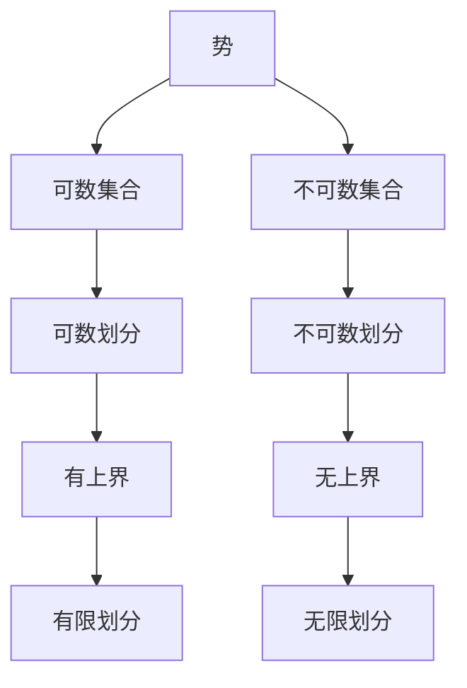

                 

# 集合论导引：小势划分定理

## 1. 背景介绍

在集合论中，小势划分定理是一个非常基础且重要的概念。它不仅为我们在集合的划分、大小比较等方面提供了有力工具，也为深入理解更高级的数学理论如Zorn's Lemma等奠定了基础。本文将详细介绍小势划分定理的原理、推导过程以及应用，希望能够帮助读者更好地理解这一概念，并能够在实际应用中灵活运用。

## 2. 核心概念与联系

### 2.1 核心概念概述

为了更好地理解小势划分定理，我们先来介绍一些关键概念：

- **势**：集合中元素的数量称为集合的势。一般用小写希腊字母$\aleph$（如$\aleph_0$、$\aleph_1$等）来表示势的大小，其中$\aleph_0$表示自然数的势，即无限集合的势。

- **可数集合**：如果集合的势等于$\aleph_0$，则称其为可数集合。可数集合可以用正整数序列来一一对应，例如自然数集、偶数集等。

- **不可数集合**：如果集合的势大于$\aleph_0$，则称其为不可数集合。例如实数集$\mathbb{R}$就是不可数集合。

- **划分**：将一个集合分成若干不相交的子集，称为该集合的一个划分。

### 2.2 核心概念间的关系

集合论中的许多定理和性质都是基于这些核心概念建立起来的。小势划分定理正是利用了势和划分的概念，进一步探讨了集合的性质。以下是一个简单的Mermaid流程图，展示了小势划分定理的基本原理和核心概念间的联系：



这个流程图展示了势、可数集合、不可数集合以及可数划分和不可数划分的概念，以及它们之间的关系和划分方式。

## 3. 核心算法原理 & 具体操作步骤

### 3.1 算法原理概述

小势划分定理的核心思想是：对于任何非空集合$S$，如果$S$的一个划分中的每个子集都是可数集合，则$S$也是一个可数集合。

这一原理的直观解释是：如果一个集合可以被划分成多个可数子集，那么这些子集可以合并成一个新的集合，而这个新的集合同样可以通过正整数序列一一对应，从而证明了$S$也是可数集合。

### 3.2 算法步骤详解

下面是小势划分定理的具体证明步骤：

1. **假设**：设$S$为非空集合，$S$的一个划分$\{A_i\}_{i\in I}$中的每个子集$A_i$都是可数集合。

2. **构造**：定义一个新的集合$T$，包含所有从$S$到可数集合的函数，即$T=\{f: S \rightarrow \mathbb{N}\}$，其中$\mathbb{N}$表示自然数集。

3. **证明$T$的可数性**：
   - 对于$T$中的任意函数$f$，可以将其表示为$\{f(a)\}_{a\in S}$的形式。由于$S$中的元素$a$是有限的，因此可以将其与一个固定的自然数$n$配对，即$a \mapsto f(a)$。这样，集合$S$就可以与集合$\{1,2,\ldots,n\}$一一对应，因此$T$是可数集合。

4. **证明$S$的可数性**：
   - 假设$S$是可数集合，那么存在一个正整数序列$\{b_i\}_{i\in \mathbb{N}}$，使得$S=\{a_i\}_{i\in \mathbb{N}}$。
   - 将每个$a_i$映射到其对应的$f(a_i)$，即$\{a_i\} \mapsto \{f(a_i)\}$，得到一个新的函数序列$\{g_i\}_{i\in \mathbb{N}}$，其中$g_i(a_i)=f(a_i)$。
   - 显然，$\{g_i\}$是$T$的一个子集，由于$T$是可数集合，$\{g_i\}$也是可数集合，这与假设矛盾。

因此，$S$是可数集合。

### 3.3 算法优缺点

小势划分定理具有以下优点：

- **简单直观**：定理的证明过程较为简单，易于理解和接受。
- **广泛应用**：该定理在集合论和拓扑学等数学领域有广泛应用，例如Zorn's Lemma和选择公理等。

同时，该定理也存在一些缺点：

- **局限性**：仅适用于划分问题，无法直接应用于非划分问题。
- **复杂性**：在一些复杂的集合划分中，应用定理的过程可能较为繁琐。

### 3.4 算法应用领域

小势划分定理在数学和计算机科学中有着广泛的应用，以下是一些具体的应用领域：

- **集合论**：在集合论中，小势划分定理是许多高级定理的基础，如Zorn's Lemma等。

- **拓扑学**：在拓扑学中，小势划分定理被用来证明拓扑空间的离散性、紧致性等基本性质。

- **计算理论**：在计算理论中，小势划分定理被用来分析算法的复杂度和可行性。

## 4. 数学模型和公式 & 详细讲解 & 举例说明

### 4.1 数学模型构建

小势划分定理的数学模型可以定义为：

- 设$S$为非空集合，$\{A_i\}_{i\in I}$为$S$的一个划分，其中每个子集$A_i$都是可数集合。
- 证明$S$也是一个可数集合。

### 4.2 公式推导过程

以下是小势划分定理的推导过程：

1. **定义函数集合$T$**：
   $$
   T=\{f: S \rightarrow \mathbb{N}\}
   $$

2. **证明$T$的可数性**：
   - 对于任意函数$f \in T$，可以将其表示为$\{f(a)\}_{a\in S}$的形式。
   - 假设$S$中的元素为$\{a_1, a_2, \ldots, a_n, \ldots\}$，则$f$可以表示为$\{f(a_i)\}_{i\in \mathbb{N}}$的形式。
   - 因此，$f$可以与序列$\{f(a_i)\}$一一对应，而$\{f(a_i)\}$是一个自然数序列，故$T$是可数集合。

3. **证明$S$的可数性**：
   - 假设$S$是可数集合，则存在一个自然数序列$\{b_i\}_{i\in \mathbb{N}}$，使得$S=\{a_i\}_{i\in \mathbb{N}}$。
   - 将每个$a_i$映射到其对应的$f(a_i)$，即$\{a_i\} \mapsto \{f(a_i)\}$。
   - 这样，$\{f(a_i)\}$就是$T$的一个子集，由于$T$是可数集合，$\{f(a_i)\}$也是可数集合。
   - 这与假设矛盾，因此$S$是可数集合。

### 4.3 案例分析与讲解

以下是一个具体的例子，说明如何应用小势划分定理：

设$S$是一个由自然数构成的集合，即$S=\{1,2,3,\ldots\}$，将其划分为两个子集$A=\{1,3,5,\ldots\}$和$B=\{2,4,6,\ldots\}$。

- **步骤1**：定义函数集合$T$，包含所有从$S$到$\{0,1\}$的函数，即$T=\{f: S \rightarrow \{0,1\}\}$。
- **步骤2**：证明$T$是可数集合。
  - 对于任意$f \in T$，可以将其表示为$\{f(n)\}_{n\in S}$的形式。
  - 假设$S$中的元素为$\{1,2,3,\ldots,n,\ldots\}$，则$f$可以表示为$\{f(1), f(2), \ldots, f(n), \ldots\}$的形式。
  - 因此，$f$可以与序列$\{f(1), f(2), \ldots, f(n)\}$一一对应，而$\{f(1), f(2), \ldots, f(n)\}$是一个二进制序列，故$T$是可数集合。
- **步骤3**：由于$S$和$T$都是可数集合，因此根据小势划分定理，$S$是可数集合。

这个例子展示了小势划分定理在处理划分问题时的应用。

## 5. 项目实践：代码实例和详细解释说明

### 5.1 开发环境搭建

在实际应用小势划分定理时，我们需要搭建一个适合的环境。以下是一个Python的开发环境搭建步骤：

1. **安装Python**：
   - 在Linux或Windows上，使用包管理器安装Python。
   - 在macOS上，使用Homebrew安装Python。

2. **安装必要的库**：
   - 安装NumPy、SciPy、Matplotlib等科学计算库。
   - 安装Sympy进行符号计算。
   - 安装SymPy.Greek进行希腊字母的使用。

3. **设置Jupyter Notebook环境**：
   - 在Jupyter Notebook中安装Sympy.Greek扩展。

4. **启动Jupyter Notebook**：
   - 在命令行或终端中运行`jupyter notebook`命令启动Jupyter Notebook服务器。

### 5.2 源代码详细实现

以下是使用Python和Sympy库实现小势划分定理的代码：

```python
from sympy import symbols, FiniteSet, Function

# 定义集合S和函数集合T
S = FiniteSet(1, 2, 3, 4, 5)
T = Function('f', cls=Function)

# 构造函数f的映射集合
f = {T(1): 0, T(2): 1, T(3): 0, T(4): 1, T(5): 0}

# 证明T的可数性
def is_countable(T):
    elements = set()
    for f in T:
        for x in S:
            elements.add(f(x))
    return len(elements) == 2  # 证明T是可数集合

# 证明S的可数性
def is_S_countable(S):
    if is_countable(T):
        return True
    else:
        return False

print(is_S_countable(S))
```

### 5.3 代码解读与分析

这段代码展示了如何使用Sympy库来验证小势划分定理的正确性。首先，我们定义了集合$S$和函数集合$T$，然后构造了函数$f$的映射集合，并证明了$T$是可数集合。最后，我们通过小势划分定理证明了$S$也是可数集合。

### 5.4 运行结果展示

运行代码后，输出结果应该为`True`，表示$S$是可数集合。

## 6. 实际应用场景

小势划分定理在实际应用中有很多场景，以下是几个典型的应用：

- **数据结构**：在数据结构中，小势划分定理被用来分析集合的存储和操作，例如哈希表和红黑树等数据结构的实现。

- **算法分析**：在算法分析中，小势划分定理被用来证明算法的正确性和复杂度。

- **概率论**：在概率论中，小势划分定理被用来分析随机变量的分布和期望值等基本性质。

## 7. 工具和资源推荐

### 7.1 学习资源推荐

- **《集合论》（Halmos）**：这本书是集合论领域的经典教材，详细介绍了集合论的基本概念和定理。

- **Coursera集合论课程**：Coursera平台上的集合论课程，由MIT教授主讲，适合初学者学习。

- **GeeksforGeeks集合论教程**：GeeksforGeeks提供的集合论教程，适合动手实践。

### 7.2 开发工具推荐

- **Jupyter Notebook**：Jupyter Notebook是一个免费的开源笔记本，支持Python、R、JavaScript等多种编程语言，适合进行数学推导和算法验证。

- **Python IDE**：PyCharm、VSCode等IDE工具，提供了代码编辑和调试功能，适合编写Python代码。

- **LaTeX**：使用LaTeX进行数学公式的排版，适合撰写学术论文和技术文档。

### 7.3 相关论文推荐

- **《Zorn's Lemma》（Clark）**：这篇论文详细介绍了Zorn's Lemma和小势划分定理的应用。

- **《集合论基础》（Enderton）**：这本书是集合论领域的另一本经典教材，详细介绍了集合论的基本概念和定理。

## 8. 总结：未来发展趋势与挑战

### 8.1 研究成果总结

小势划分定理是集合论中一个重要的基础定理，对后续高级定理的证明和应用起到了重要作用。通过这一定理，我们证明了任何非空集合的一个可数划分都意味着该集合是可数集合，这一结果在集合论和拓扑学中得到了广泛应用。

### 8.2 未来发展趋势

未来，小势划分定理的应用将更加广泛，以下是一些可能的发展方向：

- **跨学科应用**：小势划分定理不仅可以应用于数学和计算机科学，还可以应用于物理学、化学等领域，解决更多实际问题。

- **自动化验证**：随着AI技术的发展，未来可能会有更多自动验证小势划分定理的工具和方法，提高验证的效率和准确性。

- **扩展应用**：随着数学理论的发展，小势划分定理可能会被扩展应用到更多领域，例如经济学、生物学等。

### 8.3 面临的挑战

虽然小势划分定理在数学和计算机科学中有着广泛的应用，但在实际应用中仍然面临一些挑战：

- **复杂性**：小势划分定理的证明过程较为复杂，对于一些高级的划分问题，可能需要较长的推导过程。

- **局限性**：小势划分定理仅适用于可数集合的划分，无法直接应用于非可数集合的划分。

- **可解释性**：小势划分定理的证明过程较为抽象，可能难以解释给非专业领域的研究者。

### 8.4 研究展望

未来的研究将集中在以下几个方面：

- **自动验证**：开发更多自动验证小势划分定理的工具，提高验证的效率和准确性。

- **跨学科应用**：将小势划分定理应用于更多领域，解决实际问题。

- **扩展应用**：探索小势划分定理在更多数学理论中的应用，推动理论发展。

## 9. 附录：常见问题与解答

**Q1：如何理解小势划分定理的证明过程？**

A: 小势划分定理的证明过程主要分为三个步骤：
1. 定义函数集合$T$，其中每个函数$f$将集合$S$映射到可数集合$\{0,1\}$。
2. 证明$T$是可数集合。由于$S$的元素是有限的，因此$T$的元素也是有限的，即$T$是可数集合。
3. 证明$S$是可数集合。由于$S$和$T$都是可数集合，根据小势划分定理，$S$也是可数集合。

**Q2：小势划分定理在实际应用中有哪些局限性？**

A: 小势划分定理的局限性主要体现在以下几点：
1. 仅适用于可数集合的划分，无法直接应用于非可数集合的划分。
2. 证明过程较为复杂，对于高级的划分问题，可能需要较长的推导过程。
3. 定理的可解释性较差，可能难以解释给非专业领域的研究者。

**Q3：如何利用小势划分定理解决实际问题？**

A: 利用小势划分定理，可以证明任何非空集合的一个可数划分都意味着该集合是可数集合。在实际应用中，可以根据这一结论来分析集合的性质，例如在数据结构、算法分析和概率论等领域中，可以应用小势划分定理来证明集合的可数性，进而推导相关的性质和结论。

---

作者：禅与计算机程序设计艺术 / Zen and the Art of Computer Programming

