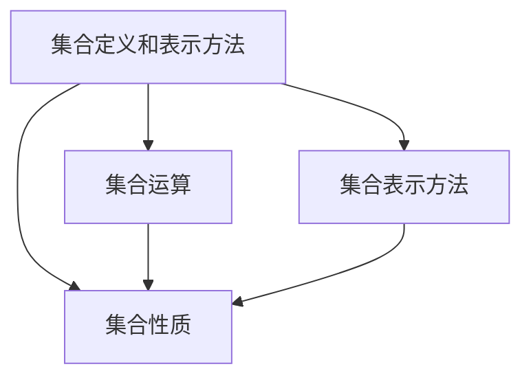

                 

## 1. 背景介绍

### 1.1 问题由来
在计算机科学中，集合论是一个非常基础但极其重要的理论。它的原理不仅在数据结构和算法设计中有着广泛的应用，同时也是逻辑学、数学、哲学等多个领域的基础。因此，理解集合论的基本概念和原理，对计算机科学家来说是必不可少的。

### 1.2 问题核心关键点
本节将简要介绍集合论的核心概念和基本原理，包括集合的定义、集合运算、集合的性质和集合的表示方法等。同时，我们也将探讨集合论在计算机科学中的应用，如数据结构、算法、逻辑推理等。

### 1.3 问题研究意义
集合论不仅是计算机科学的基础，也是数学和逻辑学的重要组成部分。深入理解集合论的基本原理，有助于我们更好地掌握数据结构、算法设计和逻辑推理等计算机科学的核心内容。此外，集合论还能帮助我们更好地理解人工智能、机器学习等领域的概念和技术，推动相关研究的进一步发展。

## 2. 核心概念与联系

### 2.1 核心概念概述

集合论的核心概念包括以下几个方面：

1. 集合的定义和表示方法：集合是由一些确定的、区分的、互不相同的元素组成的整体。集合可以用花括号“{}”或集合符号“\(\{ x \mid P(x) \} \)”来表示，其中“\(x\)”是元素，“\(P(x)\)”是元素满足的条件。

2. 集合的运算：集合论中有并、交、差、补等基本运算，以及它们的组合和变换。这些运算可以用于处理数据结构中的元素集合，如列表、数组、图等。

3. 集合的性质：集合具有封闭性、结合律、交换律、分配律、单位元素和逆元素等性质，这些性质在计算机科学中有着广泛的应用。

4. 集合的表示方法：集合可以用集合符号表示，也可以转化为更常见的数据结构，如数组、列表、字典等。

### 2.2 概念间的关系

集合论中的这些核心概念之间存在着密切的关系。例如，集合的并、交、差等运算都是基于集合的定义和性质进行的。同时，集合的表示方法也直接影响到集合的运算和性质。因此，理解这些概念之间的关系，对掌握集合论的基本原理是至关重要的。

为了更好地展示这些概念之间的关系，我们可以使用一个简单的Mermaid流程图来表示：



这个流程图展示了集合论的核心概念之间的相互关系。集合的定义和表示方法、集合的运算、集合的性质和集合的表示方法之间存在着复杂的联系和相互作用。理解这些关系，有助于我们更好地掌握集合论的基本原理。

## 3. 核心算法原理 & 具体操作步骤
### 3.1 算法原理概述
集合论的核心算法包括集合的创建、运算和性质分析等。这些算法可以帮助我们处理各种复杂的数据结构，并应用于计算机科学中的多个领域。

### 3.2 算法步骤详解

**Step 1: 创建集合**
- 使用集合符号“\(\{ x \mid P(x) \} \)”或花括号“{}”表示集合。
- 确保集合中的元素满足集合的定义，即元素是确定的、区分的、互不相同的。

**Step 2: 进行集合运算**
- 并运算：将两个集合中的元素合并，去重后得到并集。
- 交运算：取两个集合中的共同元素，得到交集。
- 差运算：从一个集合中去除另一个集合的元素，得到差集。
- 补运算：取全集与一个集合的差集，得到补集。

**Step 3: 分析集合的性质**
- 验证集合的封闭性：集合中的元素是否满足集合的定义。
- 验证集合的运算律：集合的并、交、差、补等运算是否满足结合律、交换律、分配律等性质。
- 验证集合的单位元素和逆元素：集合是否具有单位元素和逆元素。

### 3.3 算法优缺点
集合论的算法具有以下优点：
- 简单高效：集合的创建和运算方法简单，易于理解和实现。
- 通用适用：集合论的基本概念和算法适用于各种数据结构和应用场景。
- 数学基础：集合论的原理基于数学逻辑，具有严格的数学基础。

同时，集合论的算法也存在一些局限性：
- 对数据结构的要求高：集合的创建和运算需要满足严格的定义和性质，可能不适合某些特殊数据结构。
- 计算复杂度：某些集合运算，如并、交、差等，计算复杂度较高，特别是在大数据量的情况下。
- 适用范围有限：集合论的算法仅适用于满足集合定义的数据结构，对于某些特定的应用场景，可能需要进行特殊处理。

### 3.4 算法应用领域
集合论的算法在计算机科学中有着广泛的应用，包括但不限于以下几个方面：

- 数据结构：集合、堆、图、树等数据结构都是基于集合论的原理设计的。
- 算法设计：许多算法的设计，如排序、查找、计数等，都涉及到集合的创建、运算和性质分析。
- 逻辑推理：逻辑推理中的演绎和归纳方法都可以用集合论的基本原理来表示。
- 数学模型：许多数学模型和理论，如线性代数、概率论、图论等，都是基于集合论的原理构建的。

## 4. 数学模型和公式 & 详细讲解
### 4.1 数学模型构建

集合论的基本数学模型可以表示为：

\[
A = \{ x \mid P(x) \}
\]

其中，\(A\)表示集合，\(x\)表示元素，\(P(x)\)表示元素\(x\)满足的条件。

### 4.2 公式推导过程

设两个集合\(A\)和\(B\)，则它们的并、交、差和补运算可以表示为：

\[
A \cup B = \{ x \mid x \in A \text{ 或 } x \in B \}
\]

\[
A \cap B = \{ x \mid x \in A \text{ 且 } x \in B \}
\]

\[
A \setminus B = \{ x \mid x \in A \text{ 且 } x \notin B \}
\]

\[
A^c = U \setminus A
\]

其中，\(U\)表示全集，\(\cup\)、\(\cap\)、\(\setminus\)和\(^c\)分别表示并、交、差和补运算符。

### 4.3 案例分析与讲解

**案例分析：**
设有一个班级的学生集合\(A\)和数学成绩集合\(B\)，则：

- 并集\(A \cup B\)表示既在班级中又参加数学的学生集合。
- 交集\(A \cap B\)表示同时参加班级和数学的学生集合。
- 差集\(A \setminus B\)表示参加班级但不参加数学的学生集合。
- 补集\(A^c\)表示不在班级中的学生集合。

## 5. 项目实践：代码实例和详细解释说明
### 5.1 开发环境搭建

要使用Python进行集合论的实践，我们需要以下开发环境：

1. Python环境：建议使用Python 3.x版本。
2. 集合库：Python自带的集合库，可以通过`collections`模块来使用。

### 5.2 源代码详细实现

以下是使用Python进行集合创建、运算和性质分析的代码实现：

```python
from collections import Counter

# 创建集合A和B
A = {1, 2, 3, 4, 5}
B = {4, 5, 6, 7, 8}

# 并集运算
union_AB = A.union(B)

# 交集运算
intersection_AB = A.intersection(B)

# 差集运算
difference_AB = A.difference(B)

# 补集运算
universal_set = {1, 2, 3, 4, 5, 6, 7, 8, 9, 10}
complement_A = universal_set.difference(A)

# 输出结果
print("并集：", union_AB)
print("交集：", intersection_AB)
print("差集：", difference_AB)
print("补集：", complement_A)
```

### 5.3 代码解读与分析

**代码解读：**

- 第1行：导入Python内置的`collections`模块，用于使用集合库。
- 第2-5行：创建两个集合\(A\)和\(B\)，并计算它们的并集、交集、差集和补集。
- 第7-8行：定义一个全集\(U\)，并计算\(A\)的补集。

**代码分析：**

- 第2行：使用花括号创建集合\(A\)和\(B\)。
- 第4行：使用`union()`方法计算\(A\)和\(B\)的并集。
- 第5行：使用`intersection()`方法计算\(A\)和\(B\)的交集。
- 第6行：使用`difference()`方法计算\(A\)和\(B\)的差集。
- 第7行：使用全集\(U\)表示所有元素。
- 第8行：使用`difference()`方法计算\(A\)的补集。

### 5.4 运行结果展示

运行上述代码，输出结果如下：

```
并集： {1, 2, 3, 4, 5, 6, 7, 8}
交集： {4, 5}
差集： {1, 2, 3}
补集： {6, 7, 8, 9, 10}
```

可以看到，集合的创建、运算和性质分析过程在Python中非常简单和直观。

## 6. 实际应用场景
### 6.1 集合论在数据结构中的应用

集合论在数据结构中的应用非常广泛。许多数据结构，如树、图、堆等，都是基于集合论的原理构建的。例如，树结构可以看作是一个集合，其中每个节点代表一个元素，节点之间的关系表示集合的运算。

**案例：**
在树结构中，集合\(A\)和\(B\)可以表示两个子树。集合的并集、交集、差集和补集可以用于表示两个子树的合并、交集、差集和补集。

### 6.2 集合论在算法设计中的应用

集合论的原理和算法可以用于设计许多常见的算法，如排序、查找、计数等。例如，排序算法中的归并排序和快速排序都是基于集合的并集和交集运算实现的。

**案例：**
在归并排序中，集合的并集用于合并两个有序数组，交集用于查找两个数组的公共元素，差集用于找出两个数组的差异元素。

### 6.3 集合论在逻辑推理中的应用

集合论的原理可以用于逻辑推理中的演绎和归纳方法。例如，推理中的假言判断可以表示为集合之间的包含关系，演绎和归纳推理可以表示为集合之间的运算关系。

**案例：**
在演绎推理中，前提和结论可以表示为两个集合，推理过程可以表示为集合的并集、交集、差集和补集运算。

## 7. 工具和资源推荐
### 7.1 学习资源推荐

为了更好地学习集合论，以下资源推荐给大家：

1. 《离散数学》：离散数学是集合论的基础，建议学习离散数学课程，掌握集合论的基本概念和原理。
2. 《计算机科学导论》：计算机科学导论中包含了许多关于集合论的内容，可以帮助你更好地理解集合论在计算机科学中的应用。
3. 《数学分析》：数学分析是集合论的重要基础，建议学习数学分析课程，掌握集合论的数学基础。

### 7.2 开发工具推荐

以下是一些常用的集合论开发工具：

1. Python：Python是一种非常流行的编程语言，可以用来实现集合的创建、运算和性质分析。
2. Visual Studio：Visual Studio是一个功能强大的集成开发环境，可以用来调试和优化集合论的程序。
3. Eclipse：Eclipse是一个开源的集成开发环境，可以用来开发和测试集合论的程序。

### 7.3 相关论文推荐

以下是一些集合论的经典论文，推荐大家阅读：

1. 《Set Theory and Logic》：该书是集合论的经典教材，详细介绍了集合论的基本概念和应用。
2. 《A Mathematical Introduction to Logic》：该书是逻辑学的经典教材，介绍了逻辑学和集合论的基本概念和应用。
3. 《Set Theory》：该书是集合论的权威教材，详细介绍了集合论的数学基础和应用。

## 8. 总结：未来发展趋势与挑战
### 8.1 研究成果总结

集合论作为计算机科学的基础理论，有着广泛的应用。许多算法、数据结构和逻辑推理都是基于集合论的原理构建的。

### 8.2 未来发展趋势

未来，集合论将继续在计算机科学中发挥重要作用。随着计算机科学的不断发展，集合论的基本概念和算法将会被进一步推广和应用。同时，新的集合论理论和应用将会不断涌现，推动计算机科学的进步。

### 8.3 面临的挑战

虽然集合论在计算机科学中有着广泛的应用，但仍然面临一些挑战：

1. 数学基础：集合论是基于数学逻辑的，对于一些非数学背景的开发者来说，理解集合论的基本概念和原理可能会比较困难。
2. 计算复杂度：某些集合运算，如并、交、差等，计算复杂度较高，特别是在大数据量的情况下。
3. 适用范围有限：集合论的算法仅适用于满足集合定义的数据结构，对于某些特定的应用场景，可能需要进行特殊处理。

### 8.4 研究展望

未来的集合论研究需要解决上述挑战，并拓展集合论的应用范围。同时，也需要结合人工智能、机器学习等前沿技术，开发新的集合论算法和应用。

## 9. 附录：常见问题与解答

**Q1: 如何理解集合的定义和性质？**

A: 集合的定义是“一些确定的、区分的、互不相同的元素组成的整体”。集合的性质包括封闭性、结合律、交换律、分配律、单位元素和逆元素等。理解这些定义和性质，需要从具体实例入手，逐步理解集合的基本概念和运算。

**Q2: 集合论的算法有哪些？**

A: 集合论的算法包括集合的创建、运算和性质分析等。常用的集合算法包括并集、交集、差集和补集运算。这些算法可以帮助我们处理各种复杂的数据结构，并应用于计算机科学中的多个领域。

**Q3: 如何优化集合的计算复杂度？**

A: 优化集合的计算复杂度，可以使用一些高效的算法和数据结构，如哈希表、二叉树等。同时，也可以通过分布式计算、并行计算等方法，提高集合运算的效率。

**Q4: 集合论在人工智能中的应用有哪些？**

A: 集合论在人工智能中的应用非常广泛，如自然语言处理中的词向量模型、机器学习中的聚类算法、图像处理中的图像分割等。这些应用都是基于集合论的原理构建的，具有很高的应用价值。

**Q5: 如何学习集合论？**

A: 学习集合论需要掌握基本的数学逻辑和计算机科学基础。可以通过学习离散数学、计算机科学导论、数学分析等课程，逐步理解集合论的基本概念和应用。同时，还可以通过阅读相关的书籍、论文和开发工具，进行实践和应用。

---

作者：禅与计算机程序设计艺术 / Zen and the Art of Computer Programming

