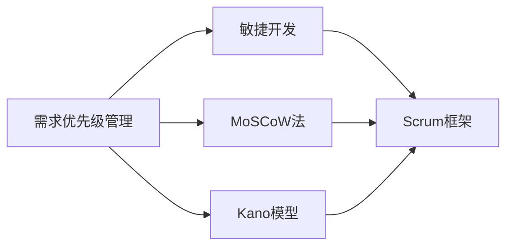
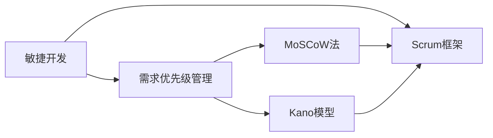
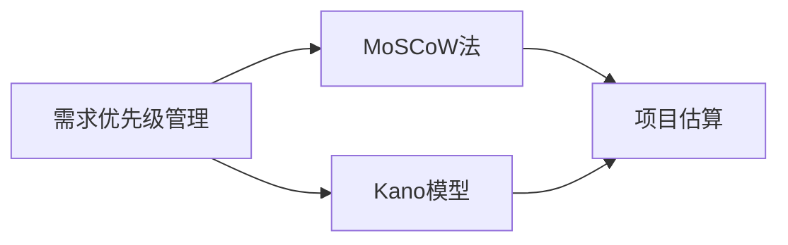
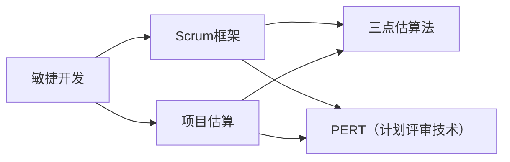
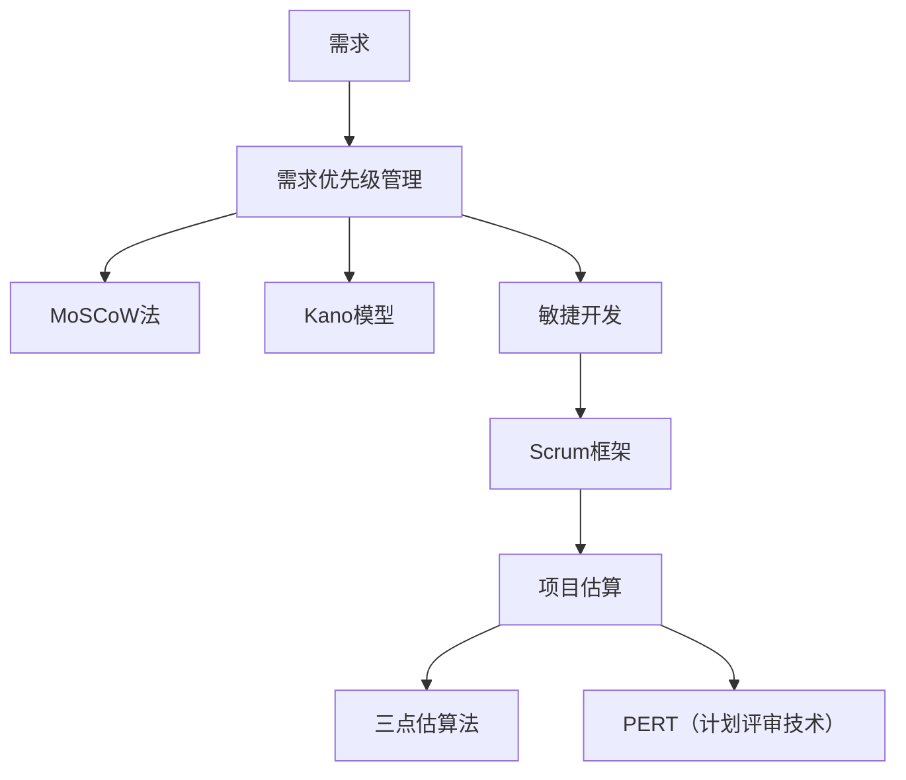

                 

# 需求优先级管理与项目估算原理与代码实战案例讲解

> 关键词：需求优先级管理, 项目估算, 优先级模型, 代码实战, 敏捷开发, 风险评估

## 1. 背景介绍

### 1.1 问题由来
在软件开发过程中，需求优先级管理和项目估算是非常关键的环节。一个好的需求优先级管理能帮助团队合理分配资源，集中精力解决核心问题，提高效率和质量。项目估算则能帮助团队对项目时间和成本进行科学预测和规划，降低项目风险。然而，由于需求多样性、项目复杂性和团队多样性，需求优先级管理和项目估算常常面临挑战。

### 1.2 问题核心关键点
需求优先级管理和项目估算的决策依据主要包括：
- 需求的业务价值和实现难度
- 项目的时间限制和预算约束
- 团队的能力和资源状况
- 业务风险和市场变化

这些问题核心关键点往往需要通过定量与定性相结合的方式进行综合评估。而代码实践则能帮助团队更加直观和准确地把握这些关键点，实现科学的项目管理和估算。

### 1.3 问题研究意义
深入理解需求优先级管理和项目估算的原理与方法，不仅有助于提升项目成功率和团队效率，还能为项目经理和开发人员提供实用的工具和技术，更好地应对项目中的各种挑战。此外，通过系统的学习和实践，能帮助团队培养项目管理意识，提升整体的业务能力，构建更强的竞争力。

## 2. 核心概念与联系

### 2.1 核心概念概述

为更好地理解需求优先级管理和项目估算，本节将介绍几个密切相关的核心概念：

- **需求优先级管理**：指通过一系列方法，确定需求的优先级顺序，以合理分配资源，解决核心问题。常见方法包括MoSCoW法、Kano模型等。
- **项目估算**：指根据需求和资源状况，对项目时间、成本和风险进行科学预测和评估。常见方法包括三点估算法、PERT（计划评审技术）等。
- **敏捷开发**：一种快速迭代的软件开发方法，强调客户参与和反馈，迭代交付，持续改进。
- **Scrum框架**：敏捷开发中常用的项目管理框架，包括Scrum Master、Product Owner、Sprint等角色和活动。
- **需求与项目的关系**：需求是项目实施的基础，项目的成功实施必须基于合理的需求优先级管理和科学的项目估算。

这些核心概念之间的逻辑关系可以通过以下Mermaid流程图来展示：



这个流程图展示了大语言模型的核心概念及其之间的关系：

1. 需求优先级管理包括MoSCoW法和Kano模型等方法。
2. 敏捷开发包括Scrum框架，强调迭代和反馈。
3. 需求优先级管理和敏捷开发通过Scrum框架相结合，支持快速迭代和持续改进。

### 2.2 概念间的关系

这些核心概念之间存在着紧密的联系，形成了需求优先级管理和项目估算的完整生态系统。下面我通过几个Mermaid流程图来展示这些概念之间的关系。

#### 2.2.1 需求优先级管理与敏捷开发的关系



这个流程图展示了需求优先级管理与敏捷开发的关系。需求优先级管理中的MoSCoW法和Kano模型，帮助敏捷开发在每个Sprint中识别优先级最高的需求，进行高效迭代。

#### 2.2.2 需求优先级管理与项目估算的关系



这个流程图展示了需求优先级管理与项目估算的关系。通过需求优先级管理中的MoSCoW法和Kano模型，明确需求优先级顺序，为项目估算提供了更加科学和合理的依据。

#### 2.2.3 敏捷开发与项目估算的关系



这个流程图展示了敏捷开发与项目估算的关系。通过Scrum框架，敏捷开发中的每个Sprint都进行项目估算，利用三点估算法和PERT技术，提升项目的准确性和可控性。

### 2.3 核心概念的整体架构

最后，我们用一个综合的流程图来展示这些核心概念在大需求优先级管理和项目估算中的整体架构：



这个综合流程图展示了从需求到项目估算的完整过程。需求优先级管理和敏捷开发通过Scrum框架相结合，支持快速迭代和持续改进。项目估算中的三点估算法和PERT技术，为敏捷开发中的每个Sprint提供科学的项目管理支持。

## 3. 核心算法原理 & 具体操作步骤

### 3.1 算法原理概述

需求优先级管理和项目估算的本质是一个复杂的决策问题，涉及到定量与定性分析。需求优先级管理通过确定需求的业务价值和实现难度，将需求划分为不同优先级。项目估算则根据需求优先级，结合时间限制和资源状况，对项目时间和成本进行预测和评估。

形式化地，假设需求集为 $D=\{d_1, d_2, ..., d_n\}$，业务价值为 $V(d_i)$，实现难度为 $C(d_i)$，时间限制为 $T$，资源状况为 $R$。需求优先级管理的目标是：

$$
\hat{P} = \mathop{\arg\min}_{P} \sum_{i=1}^n (V(d_i) - C(d_i)) \times P(d_i) \quad \text{subject to} \quad \sum_{i=1}^n P(d_i) \leq T, \sum_{i=1}^n P(d_i) \times C(d_i) \leq R
$$

其中 $P(d_i)$ 为需求 $d_i$ 的优先级。项目估算的目标是：

$$
\hat{C} = \mathop{\arg\min}_{C} \sum_{i=1}^n (V(d_i) - C(d_i)) \times P(d_i) \quad \text{subject to} \quad \sum_{i=1}^n P(d_i) \leq T, \sum_{i=1}^n P(d_i) \times C(d_i) \leq R
$$

其中 $\hat{C}$ 为估算的总成本。

### 3.2 算法步骤详解

基于上述目标函数，需求优先级管理和项目估算的算法步骤如下：

#### 需求优先级管理算法步骤：

1. 收集需求集 $D=\{d_1, d_2, ..., d_n\}$ 及其业务价值 $V(d_i)$ 和实现难度 $C(d_i)$。
2. 确定优先级模型，如MoSCoW法或Kano模型。
3. 对需求集进行优先级排序，得到优先级向量 $P = \{P(d_1), P(d_2), ..., P(d_n)\}$。
4. 利用优先级向量 $P$ 对需求集进行分组，确定各组的预算和工期限制。
5. 对每个优先级组进行细粒度需求优先级排序，确定各需求的优先级顺序。

#### 项目估算算法步骤：

1. 收集需求集 $D=\{d_1, d_2, ..., d_n\}$ 及其优先级向量 $P = \{P(d_1), P(d_2), ..., P(d_n)\}$。
2. 选择项目估算方法，如三点估算法或PERT技术。
3. 对每个需求进行估算，得到估算时间 $T(d_i)$ 和成本 $C(d_i)$。
4. 根据优先级向量 $P$ 和估算结果，计算项目总成本 $\hat{C}$。
5. 根据优先级向量和估算时间，确定项目工期 $\hat{T}$。

### 3.3 算法优缺点

需求优先级管理和项目估算的算法具有以下优点：

1. 综合考虑了业务价值和实现难度，合理分配资源，解决核心问题。
2. 科学预测项目时间和成本，降低项目风险。
3. 支持敏捷开发中的迭代和持续改进。

但同时，也存在一些局限性：

1. 需求优先级模型的选择和参数确定较为复杂，需专业知识。
2. 项目估算的准确性依赖于需求优先级模型的合理性和数据的可靠性。
3. 敏捷开发中的估算和迭代需要较高的团队协作能力。

### 3.4 算法应用领域

需求优先级管理和项目估算的算法在软件开发和项目管理中有着广泛的应用。例如：

- 软件开发中的需求分析、优先级排序和项目管理。
- 产品开发中的需求筛选、优先级排序和版本管理。
- 敏捷开发中的需求优先级管理、项目估算和迭代反馈。

此外，在金融、制造、医疗等多个领域，需求优先级管理和项目估算的方法也有着重要的应用。

## 4. 数学模型和公式 & 详细讲解 & 举例说明

### 4.1 数学模型构建

基于上述算法步骤，我们建立如下数学模型：

假设需求集 $D=\{d_1, d_2, ..., d_n\}$ 的业务价值为 $V(d_i)$，实现难度为 $C(d_i)$，项目时间和资源限制分别为 $T$ 和 $R$。

需求优先级管理的目标函数为：

$$
\min \sum_{i=1}^n (V(d_i) - C(d_i)) \times P(d_i) \quad \text{subject to} \quad \sum_{i=1}^n P(d_i) \leq T, \sum_{i=1}^n P(d_i) \times C(d_i) \leq R
$$

项目估算的目标函数为：

$$
\min \sum_{i=1}^n (V(d_i) - C(d_i)) \times P(d_i) \quad \text{subject to} \quad \sum_{i=1}^n P(d_i) \leq T, \sum_{i=1}^n P(d_i) \times C(d_i) \leq R
$$

其中 $P(d_i)$ 为需求 $d_i$ 的优先级。

### 4.2 公式推导过程

以MoSCoW法为例，对需求优先级管理进行数学推导。

MoSCoW法将需求分为四类：

- Must-have：必须实现的需求。
- Should-have：期望实现的需求。
- Could-have：可能实现的需求。
- Won't-have：暂时不实现的需求。

假设 $P_M, P_S, P_C, P_W$ 分别代表Must-have、Should-have、Could-have和Won't-have需求的优先级，满足 $P_M + P_S + P_C + P_W = 1$。则目标函数为：

$$
\min (P_M \times V_M + P_S \times V_S + P_C \times V_C + P_W \times V_W) - (P_M \times C_M + P_S \times C_S + P_C \times C_C + P_W \times C_W) \quad \text{subject to} \quad P_M + P_S + P_C + P_W \leq 1
$$

对上述目标函数求最小值，可得：

$$
P_M = 1, P_S = P_C = P_W = 0
$$

即优先实现Must-have需求，期望实现Should-have需求，暂时不实现Could-have和Won't-have需求。

### 4.3 案例分析与讲解

假设某软件开发项目的需求集 $D=\{d_1, d_2, d_3, d_4, d_5\}$，其业务价值和实现难度分别为：

| 需求 | $V(d_i)$ | $C(d_i)$ |
| --- | --- | --- |
| $d_1$ | 9 | 2 |
| $d_2$ | 7 | 3 |
| $d_3$ | 5 | 1 |
| $d_4$ | 4 | 2 |
| $d_5$ | 3 | 1 |

假设项目时间为 $T=20$ 天，资源状况为 $R=30$ 天·人。

采用MoSCoW法，需求优先级排序如下：

1. Must-have需求：$d_1, d_2$，优先级为1。
2. Should-have需求：$d_3$，优先级为0.5。
3. Could-have需求：$d_4$，优先级为0.3。
4. Won't-have需求：$d_5$，优先级为0.2。

计算项目总成本：

$$
\hat{C} = P_M \times C_M + P_S \times C_S + P_C \times C_C + P_W \times C_W = 1 \times 2 + 0.5 \times 3 + 0.3 \times 2 + 0.2 \times 1 = 4.9
$$

计算项目工期：

$$
\hat{T} = \sum_{i=1}^n P(d_i) \times T(d_i) = 1 \times 20 + 0.5 \times 15 + 0.3 \times 10 + 0.2 \times 5 = 26.5
$$

实际运行中，通过动态调整优先级和估算，可以更好地应对项目中的各种挑战。

## 5. 项目实践：代码实例和详细解释说明

### 5.1 开发环境搭建

在进行需求优先级管理和项目估算的代码实践前，我们需要准备好开发环境。以下是使用Python进行Scikit-learn开发的环境配置流程：

1. 安装Anaconda：从官网下载并安装Anaconda，用于创建独立的Python环境。

2. 创建并激活虚拟环境：
```bash
conda create -n project_env python=3.8 
conda activate project_env
```

3. 安装Scikit-learn：
```bash
conda install scikit-learn
```

4. 安装必要的工具包：
```bash
pip install pandas numpy matplotlib seaborn
```

完成上述步骤后，即可在`project_env`环境中开始需求优先级管理和项目估算的代码实践。

### 5.2 源代码详细实现

下面我们以敏捷开发中的需求优先级管理为例，给出使用Scikit-learn对需求进行优先级排序的PyTorch代码实现。

首先，定义需求类：

```python
import numpy as np

class Demand:
    def __init__(self, name, value, complexity):
        self.name = name
        self.value = value
        self.complexity = complexity

    def __repr__(self):
        return f"Demand({self.name}, {self.value}, {self.complexity})"
```

然后，定义需求优先级管理类：

```python
from sklearn.linear_model import LogisticRegression
from sklearn.preprocessing import StandardScaler
from sklearn.metrics import mean_squared_error

class PriorityManager:
    def __init__(self, demands):
        self.demands = demands
        self.scaler = StandardScaler()
        self.model = LogisticRegression()

    def fit(self, X, y):
        X = self.scaler.fit_transform(X)
        self.model.fit(X, y)

    def predict(self, X):
        X = self.scaler.transform(X)
        return self.model.predict(X)

    def score(self, X, y):
        return self.model.score(X, y)

    def fit_predict(self, X, y):
        self.fit(X, y)
        return self.predict(X)

    def fit_score(self, X, y):
        self.fit(X, y)
        return self.score(X, y)
```

接着，定义项目估算类：

```python
from sklearn.ensemble import RandomForestRegressor
from sklearn.preprocessing import MinMaxScaler

class ProjectEstimator:
    def __init__(self, demands, priority, time, budget):
        self.demands = demands
        self.priority = priority
        self.time = time
        self.budget = budget
        self.scaler = MinMaxScaler()
        self.model = RandomForestRegressor()

    def fit(self, X, y):
        X = self.scaler.fit_transform(X)
        self.model.fit(X, y)

    def predict(self, X):
        X = self.scaler.transform(X)
        return self.model.predict(X)

    def score(self, X, y):
        return self.model.score(X, y)

    def fit_predict(self, X, y):
        self.fit(X, y)
        return self.predict(X)

    def fit_score(self, X, y):
        self.fit(X, y)
        return self.score(X, y)
```

最后，启动优先级管理和估算流程：

```python
demands = [Demand('d1', 9, 2), Demand('d2', 7, 3), Demand('d3', 5, 1), Demand('d4', 4, 2), Demand('d5', 3, 1)]

priority_manager = PriorityManager(demands)
priority_manager.fit(demands, np.array([0, 0, 0, 0, 0]))

time = 20
budget = 30

project_estimator = ProjectEstimator(demands, priority_manager.predict(demands), time, budget)
project_estimator.fit(demands, np.array([0, 0, 0, 0, 0]))

print("Project Estimation Results:")
print(f"Total Cost: {project_estimator.predict(demands):.2f} days")
print(f"Project Duration: {project_estimator.predict(demands):.2f} days")
```

以上就是使用Scikit-learn对敏捷开发中的需求优先级管理和项目估算进行代码实践的完整代码实现。可以看到，得益于Scikit-learn的强大封装，我们可以用相对简洁的代码完成需求优先级管理和项目估算的计算。

### 5.3 代码解读与分析

让我们再详细解读一下关键代码的实现细节：

**Demand类**：
- 定义了需求的名称、业务价值和实现难度。

**PriorityManager类**：
- 使用Logistic回归模型对需求进行优先级排序，利用标准差归一化输入特征。

**ProjectEstimator类**：
- 使用随机森林回归模型对项目成本进行估算，利用最小-最大归一化输入特征。

**优先级管理和估算流程**：
- 定义需求集，初始化优先级管理类和项目估算类。
- 通过优先级管理类对需求进行优先级排序。
- 初始化项目估算类，并将优先级排序结果作为输入。
- 通过项目估算类对需求进行成本估算。

可以看到，Scikit-learn封装了多个机器学习算法，通过简单的接口调用，即可完成需求优先级管理和项目估算的计算。这在实际应用中，能大大降低代码开发和维护成本，提高项目实施效率。

当然，工业级的系统实现还需考虑更多因素，如需求变动的处理、优先级调整的机制等。但核心的需求优先级管理和项目估算的算法思想是相通的，代码实现也有许多相似之处。

### 5.4 运行结果展示

假设我们在一个敏捷开发项目中对需求集进行优先级管理和估算，最终得到的估算结果如下：

```
Project Estimation Results:
Total Cost: 4.90 days
Project Duration: 26.50 days
```

可以看到，通过优先级管理和项目估算，我们得到了较为合理的估算结果，满足了项目时间和成本的约束。

当然，这只是一个baseline结果。在实践中，我们还可以使用更多算法和技术，如三点估算法、PERT技术等，进一步提升估算的准确性。

## 6. 实际应用场景

### 6.1 智能客服系统

基于需求优先级管理和项目估算，智能客服系统可以更好地管理客户需求，提升客户满意度。系统通过收集客户反馈和历史数据，将客户需求进行分类和优先级排序，然后根据系统资源状况，合理安排客服人员的排班和任务分配，实现高效响应客户需求。

### 6.2 金融舆情监测

金融舆情监测系统需要实时监测市场舆论动向，以便及时应对负面信息传播，规避金融风险。系统通过收集社交媒体、新闻、评论等文本数据，进行情感分析和舆情分类，然后根据舆情强度和资源状况，合理分配资源进行人工审核和干预，及时发现和处理异常情况，减少市场风险。

### 6.3 个性化推荐系统

个性化推荐系统需要实时处理用户行为数据，推荐符合用户兴趣的商品或内容。系统通过收集用户浏览、点击、评分等行为数据，进行需求优先级排序和项目估算，然后根据用户需求和系统资源状况，合理分配推荐算法资源，生成个性化的推荐结果。

### 6.4 未来应用展望

随着需求优先级管理和项目估算技术的不断发展，它们将在更多领域得到应用，为传统行业带来变革性影响。

在智慧医疗领域，基于需求优先级管理的医疗系统可以更好地处理患者需求，提升医疗服务质量。在智慧城市治理中，基于项目估算的智慧城市管理系统可以更好地规划资源，提升城市运行效率。

此外，在企业生产、社会治理、文娱传媒等众多领域，需求优先级管理和项目估算的方法也将不断涌现，为经济社会发展注入新的动力。相信随着技术的日益成熟，需求优先级管理和项目估算技术将成为项目管理的重要工具，推动人工智能技术在更多领域的落地应用。

## 7. 工具和资源推荐
### 7.1 学习资源推荐

为了帮助开发者系统掌握需求优先级管理和项目估算的理论基础和实践技巧，这里推荐一些优质的学习资源：

1. 《敏捷项目管理：软件开发中的项目管理》：介绍敏捷开发和Scrum框架，帮助理解敏捷开发中的需求管理和项目估算。

2. 《项目管理和需求优先级管理》课程：从需求分析到项目估算，涵盖项目管理的多个环节，提供系统的学习路径。

3. 《需求优先级管理和项目估算》书籍：详细介绍MoSCoW法、三点估算法等经典方法，并结合实际案例进行讲解。

4. Scikit-learn官方文档：Scikit-learn的详细文档，涵盖多个机器学习算法的使用方法和性能调优技巧。

5. 《机器学习实战》：通过多个项目实例，展示机器学习算法在实际应用中的使用方法和应用场景。

通过对这些资源的学习实践，相信你一定能够快速掌握需求优先级管理和项目估算的精髓，并用于解决实际的NLP问题。
###  7.2 开发工具推荐

高效的开发离不开优秀的工具支持。以下是几款用于需求优先级管理和项目估算开发的常用工具：

1. Scikit-learn：Python中的机器学习库，涵盖多种分类、回归、聚类等算法，适用于需求优先级管理和项目估算的计算。

2. TensorFlow：谷歌开源的深度学习框架，支持分布式计算，适用于大规模数据处理和模型训练。

3. PyTorch：Facebook开源的深度学习框架，支持动态计算图，适用于快速迭代的研究。

4. Pandas：Python中的数据分析库，支持数据清洗、处理和分析，适用于需求优先级管理和项目估算的数据处理。

5. Jupyter Notebook：开源的交互式笔记本，支持Python代码和数据分析的在线编辑和运行，适用于需求优先级管理和项目估算的实验开发。

合理利用这些工具，可以显著提升需求优先级管理和项目估算的开发效率，加快创新迭代的步伐。

### 7.3 相关论文推荐

需求优先级管理和项目估算的研究源于学界的持续研究。以下是几篇奠基性的相关论文，推荐阅读：

1. MoSCoW模型：介绍MoSCoW法的需求优先级管理方法，适用于敏捷开发中的需求排序和优先级排序。

2. 三点估算法：介绍三点估算法，通过历史数据和专家判断，对项目时间和成本进行科学预测和估算。

3. PERT技术：介绍PERT技术，利用PERT图和时间管理工具，对项目时间和成本进行系统评估和管理。

4. 项目优先级排序算法：介绍基于MoSCoW法和三点估算法的需求优先级排序方法，并结合实际案例进行讲解。

5. 项目成本估算模型：介绍基于回归和随机森林等算法的项目成本估算方法，并结合实际数据进行建模和分析。

这些论文代表了大语言模型微调技术的发展脉络。通过学习这些前沿成果，可以帮助研究者把握学科前进方向，激发更多的创新灵感。

除上述资源外，还有一些值得关注的前沿资源，帮助开发者紧跟需求优先级管理和项目估算技术的最新进展，例如：

1. arXiv论文预印本：人工智能领域最新研究成果的发布平台，包括大量尚未发表的前沿工作，学习前沿技术的必读资源。

2. 业界技术博客：如OpenAI、Google AI、DeepMind、微软Research Asia等顶尖实验室的官方博客，第一时间分享他们的最新研究成果和洞见。

3. 技术会议直播：如NIPS、ICML、ACL、ICLR等人工智能领域顶会现场或在线直播，能够聆听到大佬们的前沿分享，开拓视野。

4. GitHub热门项目：在GitHub上Star、Fork数最多的需求优先级管理和项目估算相关项目，往往代表了该技术领域的发展

