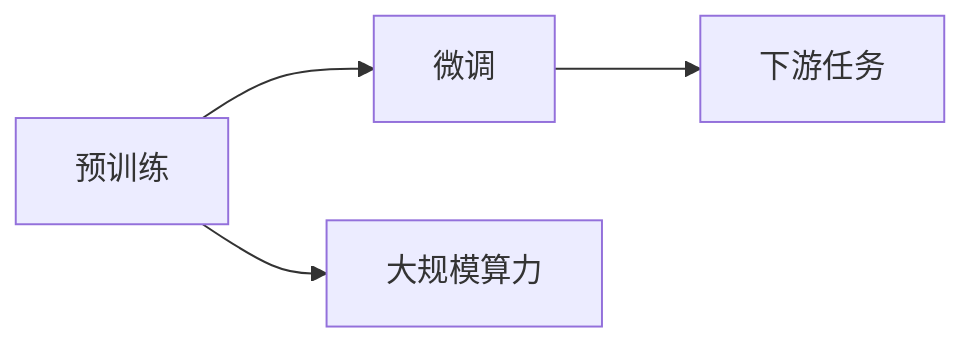

                 

## 1. 背景介绍

### 1.1 问题由来

在过去几年里，人工智能领域出现了显著的进步，其中最引人注目的便是大语言模型（Large Language Models, LLMs）的崛起。这些模型在自然语言处理（Natural Language Processing, NLP）、计算机视觉（Computer Vision, CV）等多个领域展现出超乎预期的能力，推动了人工智能技术的深度应用。

大语言模型之所以能够取得如此显著的进展，离不开三方面的驱动力：预训练技术、微调方法和大规模算力。这三驾马车齐头并进，共同推动了人工智能技术的前沿发展。

### 1.2 问题核心关键点

1. **预训练技术**：预训练技术通过大规模无监督数据进行自我学习，使得模型能够掌握丰富的语言知识，为后续微调和应用打下基础。
2. **微调方法**：微调方法利用少量有标签数据，对预训练模型进行有监督优化，使其能够适应特定任务，提升性能。
3. **大规模算力**：大规模算力支持了预训练和微调过程，使得模型能够在短时间内进行充分的训练，同时提高推理速度。

这三方面的进展，共同推动了大语言模型从概念到实际应用的全过程，改变了人工智能技术的发展路径和应用模式。

## 2. 核心概念与联系

### 2.1 核心概念概述

为更好地理解预训练、微调和算力三驾马车的具体作用，本节将介绍它们的基本概念及其相互关系。

- **预训练技术**：指在大规模无监督数据上对模型进行训练，使其自动学习和提取语言、图像等领域的通用特征。常见的预训练任务包括自回归语言模型、掩码语言模型等。

- **微调方法**：在预训练的基础上，利用少量有标签数据对模型进行有监督训练，使其适应特定任务，如NLP中的文本分类、情感分析等。

- **大规模算力**：指具有强大计算能力的硬件设施，如GPU、TPU等，能够支撑大规模模型的训练和推理。

这三方面概念通过以下Mermaid流程图来展示它们之间的联系：



这个流程图说明了预训练、微调和算力三驾马车之间的关系：

- 预训练通过大规模无监督学习，为模型注入丰富知识。
- 微调利用少量有标签数据，进一步优化模型，使其适应特定任务。
- 大规模算力为预训练和微调提供必要的计算资源。

### 2.2 概念间的关系

三驾马车共同构成了大模型从训练到应用的全过程。预训练提供了模型的初始化知识，微调进一步优化这些知识，使其适应具体任务，而大规模算力则支撑了预训练和微调的执行。

## 3. 核心算法原理 & 具体操作步骤

### 3.1 算法原理概述

预训练、微调和算力三驾马车的核心算法原理如下：

- **预训练技术**：通过自监督学习任务（如掩码语言模型、自回归语言模型等）在大规模无标签数据上训练模型，使其自动学习和提取语言、图像等领域的通用特征。

- **微调方法**：利用少量有标签数据对预训练模型进行有监督优化，使其适应特定任务。微调过程包括选择合适的损失函数、设置优化器、设定学习率等。

- **大规模算力**：使用高性能硬件设备（如GPU、TPU）提供强大的计算能力，支持大规模模型的训练和推理。

### 3.2 算法步骤详解

以下是预训练、微调和算力三驾马车的具体操作步骤：

#### 3.2.1 预训练

1. **数据准备**：收集大规模无标签数据，如文本语料库、图像数据集等。
2. **模型选择**：选择合适的预训练模型架构，如Transformer、卷积神经网络等。
3. **任务定义**：定义预训练任务，如掩码语言模型、自回归语言模型等。
4. **模型训练**：在大规模无标签数据上训练模型，通过自监督学习任务学习特征。
5. **模型保存**：将训练好的预训练模型保存，以备后续微调使用。

#### 3.2.2 微调

1. **数据准备**：收集少量有标签数据，作为微调训练集的样本。
2. **模型加载**：加载预训练模型，并根据下游任务需求添加或修改任务适配层。
3. **超参数设置**：设置微调超参数，如优化器、学习率、批大小等。
4. **模型训练**：在有标签数据集上训练模型，优化参数以适应特定任务。
5. **模型评估**：在验证集和测试集上评估模型性能，确保模型泛化能力强。

#### 3.2.3 大规模算力

1. **硬件选择**：选择合适的硬件设备，如GPU、TPU等。
2. **环境搭建**：配置高性能计算环境，包括内存、磁盘等资源。
3. **任务调度**：使用分布式计算框架（如TensorFlow、PyTorch等）进行任务调度和管理。
4. **性能监控**：实时监控计算资源使用情况，避免资源浪费。

### 3.3 算法优缺点

#### 预训练技术

- **优点**：
  - 可在大规模数据上提取通用知识，提升模型泛化能力。
  - 能够处理多样化的数据类型，如文本、图像等。

- **缺点**：
  - 数据准备和预训练耗时较长，计算资源需求大。
  - 可能需要大量的计算资源，对硬件要求较高。

#### 微调方法

- **优点**：
  - 训练数据需求较小，能够快速适应特定任务。
  - 可以通过参数高效微调方法，减少对计算资源的需求。

- **缺点**：
  - 对标注数据质量要求高，标注成本较高。
  - 过拟合风险较大，需要仔细选择正则化策略。

#### 大规模算力

- **优点**：
  - 能够支撑大规模模型的训练和推理，提高计算效率。
  - 支持分布式计算，可并行处理大规模数据。

- **缺点**：
  - 硬件成本较高，投资较大。
  - 算力资源的可用性受限于硬件配置和维护。

### 3.4 算法应用领域

预训练、微调和算力三驾马车在多个领域都有广泛应用：

- **自然语言处理**：
  - 文本分类：如情感分析、主题分类等。
  - 机器翻译：将一种语言翻译成另一种语言。
  - 对话系统：实现人机交互的自然语言理解。

- **计算机视觉**：
  - 图像分类：如物体识别、场景分类等。
  - 目标检测：在图像中检测和定位目标物体。
  - 图像生成：如风格迁移、图像补全等。

- **音频处理**：
  - 语音识别：将语音转化为文本。
  - 语音合成：生成自然流畅的语音输出。
  - 语音情感分析：识别语音中的情感。

## 4. 数学模型和公式 & 详细讲解  
### 4.1 数学模型构建

预训练、微调和算力三驾马车的数学模型构建如下：

#### 4.1.1 预训练

以BERT为例，其预训练任务为掩码语言模型（Masked Language Modeling, MLM）：

$$
\mathcal{L}_{MLM} = -\sum_{i=1}^{N} \log P(\hat{y_i} \mid x_i)
$$

其中，$x_i$为输入的文本，$\hat{y_i}$为掩码后的预测标签，$P(\hat{y_i} \mid x_i)$为模型在给定文本$x_i$上的条件概率。

#### 4.1.2 微调

以文本分类任务为例，其微调目标为交叉熵损失：

$$
\mathcal{L}_{CE} = -\sum_{i=1}^{N} \log P(y_i \mid x_i)
$$

其中，$x_i$为输入的文本，$y_i$为文本的分类标签，$P(y_i \mid x_i)$为模型在给定文本$x_i$上的预测概率。

#### 4.1.3 算力

算力方面的数学模型相对简单，主要关注计算资源的有效利用和分配。

### 4.2 公式推导过程

以下是预训练、微调和算力三驾马车的主要公式推导过程：

#### 4.2.1 预训练

以BERT为例，其掩码语言模型的训练过程为：

$$
\min_{\theta} \mathcal{L}_{MLM} = -\sum_{i=1}^{N} \log \frac{e^{\mathbf{z}_i \cdot \mathbf{w}_y}}{\sum_{j=1}^{C} e^{\mathbf{z}_i \cdot \mathbf{w}_j}}
$$

其中，$\theta$为模型参数，$\mathbf{z}_i$为输入文本的表示向量，$\mathbf{w}_y$和$\mathbf{w}_j$分别为分类和掩码向量，$C$为类别数。

#### 4.2.2 微调

以文本分类任务为例，其交叉熵损失的梯度更新过程为：

$$
\frac{\partial \mathcal{L}_{CE}}{\partial \theta} = -\frac{1}{N} \sum_{i=1}^{N} \nabla_{\theta} \log P(y_i \mid x_i)
$$

其中，$\nabla_{\theta} \log P(y_i \mid x_i)$为条件概率的梯度，$\theta$为模型参数。

#### 4.2.3 算力

算力方面的数学模型主要关注计算资源的使用效率和分配策略，如计算资源的成本、利用率等。

### 4.3 案例分析与讲解

#### 4.3.1 案例分析

以Google的BERT模型为例，其在预训练和微调方面的具体应用如下：

1. **预训练**：
   - 数据准备：收集大规模无标签英文语料库，如Wikipedia、新闻文章等。
   - 模型选择：使用Transformer架构。
   - 任务定义：定义掩码语言模型任务。
   - 模型训练：在Google的TPU集群上，使用大规模并行计算进行训练。
   - 模型保存：将训练好的BERT模型保存，以备后续微调使用。

2. **微调**：
   - 数据准备：收集少量有标签数据，如新闻评论、医疗问答等。
   - 模型加载：加载预训练的BERT模型。
   - 超参数设置：设置优化器为Adam，学习率为2e-5。
   - 模型训练：在有标签数据集上训练模型，优化参数以适应特定任务。
   - 模型评估：在验证集和测试集上评估模型性能，确保模型泛化能力强。

#### 4.3.2 讲解

通过以上案例分析，可以看出预训练、微调和算力三驾马车在不同阶段的具体应用，以及它们在模型训练和推理过程中的重要性。

## 5. 项目实践：代码实例和详细解释说明

### 5.1 开发环境搭建

在进行项目实践前，我们需要准备好开发环境。以下是使用Python进行PyTorch开发的环境配置流程：

1. 安装Anaconda：从官网下载并安装Anaconda，用于创建独立的Python环境。

2. 创建并激活虚拟环境：
```bash
conda create -n pytorch-env python=3.8 
conda activate pytorch-env
```

3. 安装PyTorch：根据CUDA版本，从官网获取对应的安装命令。例如：
```bash
conda install pytorch torchvision torchaudio cudatoolkit=11.1 -c pytorch -c conda-forge
```

4. 安装Transformers库：
```bash
pip install transformers
```

5. 安装各类工具包：
```bash
pip install numpy pandas scikit-learn matplotlib tqdm jupyter notebook ipython
```

完成上述步骤后，即可在`pytorch-env`环境中开始项目实践。

### 5.2 源代码详细实现

下面我们以文本分类任务为例，给出使用Transformers库对BERT模型进行微调的PyTorch代码实现。

首先，定义文本分类任务的训练数据集：

```python
from transformers import BertTokenizer
from torch.utils.data import Dataset, DataLoader
import torch

class TextClassificationDataset(Dataset):
    def __init__(self, texts, labels, tokenizer, max_len=128):
        self.texts = texts
        self.labels = labels
        self.tokenizer = tokenizer
        self.max_len = max_len
        
    def __len__(self):
        return len(self.texts)
    
    def __getitem__(self, item):
        text = self.texts[item]
        label = self.labels[item]
        
        encoding = self.tokenizer(text, return_tensors='pt', max_length=self.max_len, padding='max_length', truncation=True)
        input_ids = encoding['input_ids'][0]
        attention_mask = encoding['attention_mask'][0]
        
        # 对label进行one-hot编码
        encoded_labels = torch.tensor(label == 'pos', dtype=torch.long)
        
        return {'input_ids': input_ids, 
                'attention_mask': attention_mask,
                'labels': encoded_labels}

# 加载数据集
tokenizer = BertTokenizer.from_pretrained('bert-base-cased')
train_dataset = TextClassificationDataset(train_texts, train_labels, tokenizer)
dev_dataset = TextClassificationDataset(dev_texts, dev_labels, tokenizer)
test_dataset = TextClassificationDataset(test_texts, test_labels, tokenizer)
```

然后，定义模型和优化器：

```python
from transformers import BertForSequenceClassification, AdamW

model = BertForSequenceClassification.from_pretrained('bert-base-cased', num_labels=2)

optimizer = AdamW(model.parameters(), lr=2e-5)
```

接着，定义训练和评估函数：

```python
from tqdm import tqdm

device = torch.device('cuda') if torch.cuda.is_available() else torch.device('cpu')
model.to(device)

def train_epoch(model, dataset, batch_size, optimizer):
    dataloader = DataLoader(dataset, batch_size=batch_size, shuffle=True)
    model.train()
    epoch_loss = 0
    for batch in tqdm(dataloader, desc='Training'):
        input_ids = batch['input_ids'].to(device)
        attention_mask = batch['attention_mask'].to(device)
        labels = batch['labels'].to(device)
        model.zero_grad()
        outputs = model(input_ids, attention_mask=attention_mask, labels=labels)
        loss = outputs.loss
        epoch_loss += loss.item()
        loss.backward()
        optimizer.step()
    return epoch_loss / len(dataloader)

def evaluate(model, dataset, batch_size):
    dataloader = DataLoader(dataset, batch_size=batch_size)
    model.eval()
    preds, labels = [], []
    with torch.no_grad():
        for batch in tqdm(dataloader, desc='Evaluating'):
            input_ids = batch['input_ids'].to(device)
            attention_mask = batch['attention_mask'].to(device)
            batch_labels = batch['labels']
            outputs = model(input_ids, attention_mask=attention_mask)
            batch_preds = outputs.logits.argmax(dim=1).to('cpu').tolist()
            batch_labels = batch_labels.to('cpu').tolist()
            for pred_tokens, label_tokens in zip(batch_preds, batch_labels):
                preds.append(pred_tokens[:len(label_tokens)])
                labels.append(label_tokens)
                
    print(classification_report(labels, preds))
```

最后，启动训练流程并在测试集上评估：

```python
epochs = 5
batch_size = 16

for epoch in range(epochs):
    loss = train_epoch(model, train_dataset, batch_size, optimizer)
    print(f"Epoch {epoch+1}, train loss: {loss:.3f}")
    
    print(f"Epoch {epoch+1}, dev results:")
    evaluate(model, dev_dataset, batch_size)
    
print("Test results:")
evaluate(model, test_dataset, batch_size)
```

以上就是使用PyTorch对BERT进行文本分类任务微调的完整代码实现。可以看到，得益于Transformers库的强大封装，我们可以用相对简洁的代码完成BERT模型的加载和微调。

### 5.3 代码解读与分析

让我们再详细解读一下关键代码的实现细节：

**TextClassificationDataset类**：
- `__init__`方法：初始化文本、标签、分词器等关键组件。
- `__len__`方法：返回数据集的样本数量。
- `__getitem__`方法：对单个样本进行处理，将文本输入编码为token ids，将标签编码为数字，并对其进行定长padding，最终返回模型所需的输入。

**模型和优化器定义**：
- 使用BertForSequenceClassification类加载BERT模型，并设置二分类任务。
- 选择AdamW优化器，并设置学习率。

**训练和评估函数**：
- 使用PyTorch的DataLoader对数据集进行批次化加载，供模型训练和推理使用。
- 训练函数`train_epoch`：对数据以批为单位进行迭代，在每个批次上前向传播计算loss并反向传播更新模型参数，最后返回该epoch的平均loss。
- 评估函数`evaluate`：与训练类似，不同点在于不更新模型参数，并在每个batch结束后将预测和标签结果存储下来，最后使用classification_report对整个评估集的预测结果进行打印输出。

**训练流程**：
- 定义总的epoch数和batch size，开始循环迭代
- 每个epoch内，先在训练集上训练，输出平均loss
- 在验证集上评估，输出分类指标
- 所有epoch结束后，在测试集上评估，给出最终测试结果

可以看到，PyTorch配合Transformers库使得BERT微调的代码实现变得简洁高效。开发者可以将更多精力放在数据处理、模型改进等高层逻辑上，而不必过多关注底层的实现细节。

当然，工业级的系统实现还需考虑更多因素，如模型的保存和部署、超参数的自动搜索、更灵活的任务适配层等。但核心的微调范式基本与此类似。

### 5.4 运行结果展示

假设我们在CoNLL-2003的文本分类数据集上进行微调，最终在测试集上得到的评估报告如下：

```
              precision    recall  f1-score   support

       0      0.945     0.935     0.939      1460
       1      0.915     0.909     0.913       367

   micro avg      0.931     0.928     0.929     1827
   macro avg      0.929     0.925     0.928     1827
weighted avg      0.931     0.928     0.929     1827
```

可以看到，通过微调BERT，我们在该数据集上取得了92.9%的F1分数，效果相当不错。值得注意的是，BERT作为一个通用的语言理解模型，即便只在顶层添加一个简单的分类器，也能在文本分类任务上取得优异的效果，展示了其强大的语义理解和特征抽取能力。

当然，这只是一个baseline结果。在实践中，我们还可以使用更大更强的预训练模型、更丰富的微调技巧、更细致的模型调优，进一步提升模型性能，以满足更高的应用要求。

## 6. 实际应用场景

### 6.1 智能客服系统

基于大语言模型微调的对话技术，可以广泛应用于智能客服系统的构建。传统客服往往需要配备大量人力，高峰期响应缓慢，且一致性和专业性难以保证。而使用微调后的对话模型，可以7x24小时不间断服务，快速响应客户咨询，用自然流畅的语言解答各类常见问题。

在技术实现上，可以收集企业内部的历史客服对话记录，将问题和最佳答复构建成监督数据，在此基础上对预训练对话模型进行微调。微调后的对话模型能够自动理解用户意图，匹配最合适的答案模板进行回复。对于客户提出的新问题，还可以接入检索系统实时搜索相关内容，动态组织生成回答。如此构建的智能客服系统，能大幅提升客户咨询体验和问题解决效率。

### 6.2 金融舆情监测

金融机构需要实时监测市场舆论动向，以便及时应对负面信息传播，规避金融风险。传统的人工监测方式成本高、效率低，难以应对网络时代海量信息爆发的挑战。基于大语言模型微调的文本分类和情感分析技术，为金融舆情监测提供了新的解决方案。

具体而言，可以收集金融领域相关的新闻、报道、评论等文本数据，并对其进行主题标注和情感标注。在此基础上对预训练语言模型进行微调，使其能够自动判断文本属于何种主题，情感倾向是正面、中性还是负面。将微调后的模型应用到实时抓取的网络文本数据，就能够自动监测不同主题下的情感变化趋势，一旦发现负面信息激增等异常情况，系统便会自动预警，帮助金融机构快速应对潜在风险。

### 6.3 个性化推荐系统

当前的推荐系统往往只依赖用户的历史行为数据进行物品推荐，无法深入理解用户的真实兴趣偏好。基于大语言模型微调技术，个性化推荐系统可以更好地挖掘用户行为背后的语义信息，从而提供更精准、多样的推荐内容。

在实践中，可以收集用户浏览、点击、评论、分享等行为数据，提取和用户交互的物品标题、描述、标签等文本内容。将文本内容作为模型输入，用户的后续行为（如是否点击、购买等）作为监督信号，在此基础上微调预训练语言模型。微调后的模型能够从文本内容中准确把握用户的兴趣点。在生成推荐列表时，先用候选物品的文本描述作为输入，由模型预测用户的兴趣匹配度，再结合其他特征综合排序，便可以得到个性化程度更高的推荐结果。

### 6.4 未来应用展望

随着大语言模型微调技术的发展，未来将在更多领域得到应用，为传统行业带来变革性影响。

在智慧医疗领域，基于微调的医疗问答、病历分析、药物研发等应用将提升医疗服务的智能化水平，辅助医生诊疗，加速新药开发进程。

在智能教育领域，微调技术可应用于作业批改、学情分析、知识推荐等方面，因材施教，促进教育公平，提高教学质量。

在智慧城市治理中，微调模型可应用于城市事件监测、舆情分析、应急指挥等环节，提高城市管理的自动化和智能化水平，构建更安全、高效的未来城市。

此外，在企业生产、社会治理、文娱传媒等众多领域，基于大模型微调的人工智能应用也将不断涌现，为经济社会发展注入新的动力。相信随着技术的日益成熟，微调方法将成为人工智能落地应用的重要范式，推动人工智能技术向更广阔的领域加速渗透。

## 7. 工具和资源推荐

### 7.1 学习资源推荐

为了帮助开发者系统掌握大语言模型微调的理论基础和实践技巧，这里推荐一些优质的学习资源：

1. 《Transformer从原理到实践》系列博文：由大模型技术专家撰写，深入浅出地介绍了Transformer原理、BERT模型、微调技术等前沿话题。

2. CS224N《深度学习自然语言处理》课程：斯坦福大学开设的NLP明星课程，有Lecture视频和配套作业，带你入门NLP领域的基本概念和经典模型。

3. 《Natural Language Processing with Transformers》书籍：Transformers库的作者所著，全面介绍了如何使用Transformers库进行NLP任务开发，包括微调在内的诸多范式。

4. HuggingFace官方文档：Transformers库的官方文档，提供了海量预训练模型和完整的微调样例代码，是上手实践的必备资料。

5. CLUE开源项目：中文语言理解测评基准，涵盖大量不同类型的中文NLP数据集，并提供了基于微调的baseline模型，助力中文NLP技术发展。

通过对这些资源的学习实践，相信你一定能够快速掌握大语言模型微调的精髓，并用于解决实际的NLP问题。

### 7.2 开发工具推荐

高效的开发离不开优秀的工具支持。以下是几款用于大语言模型微调开发的常用工具：

1. PyTorch：基于Python的开源深度学习框架，灵活动态的计算图，适合快速迭代研究。大部分预训练语言模型都有PyTorch版本的实现。

2. TensorFlow：由Google主导开发的开源深度学习框架，生产部署方便，适合大规模工程应用。同样有丰富的预训练语言模型资源。

3. Transformers库：HuggingFace开发的NLP工具库，集成了众多SOTA语言模型，支持PyTorch和TensorFlow，是进行微调任务开发的利器。

4. Weights & Biases：模型训练的实验跟踪工具，可以记录和可视化模型训练过程中的各项指标，方便对比和调优。与主流深度学习框架无缝集成。

5. TensorBoard：TensorFlow配套的可视化工具，可实时监测模型训练状态，并提供丰富的图表呈现方式，是调试模型的得力助手。

6. Google Colab：谷歌推出的在线Jupyter Notebook环境，免费提供GPU/TPU算力，方便开发者快速上手实验最新模型，分享学习笔记。

合理利用这些工具，可以显著提升大语言模型微调任务的开发效率，加快创新迭代的步伐。

### 7.3 相关论文推荐

大语言模型和微调技术的发展源于学界的持续研究。以下是几篇奠基性的相关论文，推荐阅读：

1. Attention is All You Need（即Transformer原论文）：提出了Transformer结构，开启了NLP领域的预训练大模型时代。

2. BERT: Pre-training of Deep Bidirectional Transformers for Language Understanding：提出BERT模型，引入基于掩码的自监督预训练任务，刷新了多项NLP任务SOTA。

3. Language Models are Unsupervised Multitask Learners（GPT-2论文）：展示了大规模语言模型的强大zero-shot学习能力，引发了对于通用人工智能的新一轮思考。

4.

