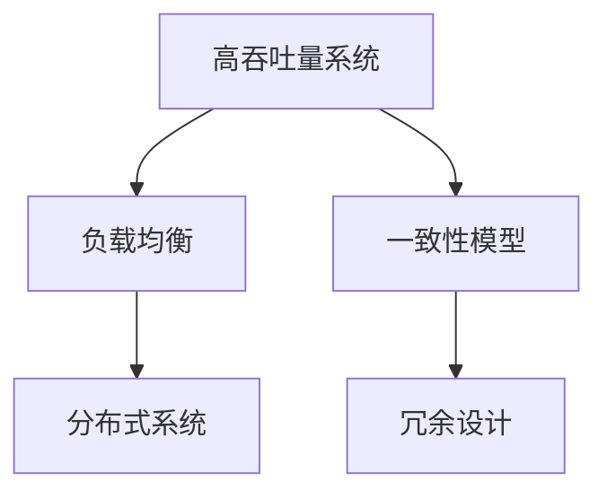
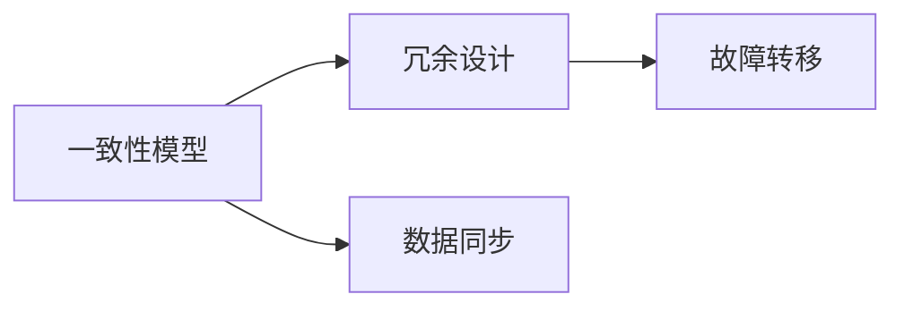
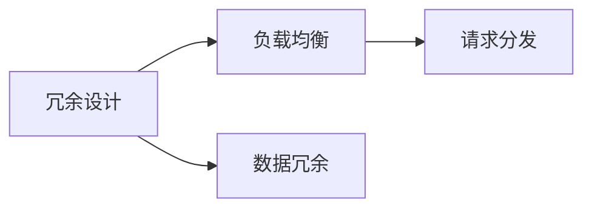

                 

# 高吞吐量系统设计的实际案例

> 关键词：高吞吐量系统,系统设计,实际案例,性能优化,系统架构,案例分析

## 1. 背景介绍

### 1.1 问题由来
在信息化时代，高吞吐量系统（High Throughput System）的应用场景愈发广泛，如互联网服务、金融交易、大数据处理、工业控制等领域。这些系统需要能够处理大量并发请求，且对响应时间和系统稳定性有着极高的要求。高吞吐量系统的设计，不仅要求具备强大的计算能力，还需要优化的系统架构和高效的数据处理技术，以确保其在高负载场景下的稳定运行。

### 1.2 问题核心关键点
高吞吐量系统设计的核心在于优化系统架构、提升计算能力、保证数据一致性和系统可靠性。其主要关注点包括：

- **系统架构设计**：合理分配系统资源，保证负载均衡和系统扩展性。
- **计算能力优化**：使用高效的计算算法和数据结构，减少计算资源占用。
- **数据一致性保证**：实现数据的同步更新和跨节点一致性，防止数据丢失和异常。
- **系统可靠性增强**：采用冗余设计、故障转移机制等手段，提升系统的高可用性。

### 1.3 问题研究意义
高吞吐量系统设计的成功与否，直接影响到应用系统的用户体验和服务质量。一个性能优良、可靠性强的高吞吐量系统，可以大幅提升业务效率，降低运营成本，满足用户对实时性和稳定性的需求。

## 2. 核心概念与联系

### 2.1 核心概念概述

为了更好地理解高吞吐量系统设计的关键点，本节将介绍几个关键概念及其联系：

- **高吞吐量系统（High Throughput System）**：能够处理大量并发请求，具有高效数据处理能力，能够在高负载条件下保持稳定运行的系统。
- **负载均衡（Load Balancing）**：通过合理分配请求，使每个节点的工作负载趋于均衡，提高系统的吞吐量和稳定性。
- **分布式系统（Distributed System）**：由多个相互独立的节点组成，通过网络相互通信的系统，能够提供高可用性和可扩展性。
- **一致性模型（Consistency Model）**：定义数据一致性的级别和处理方式，如CAP定理。
- **冗余设计（Redundancy Design）**：通过增加系统节点或数据副本，增强系统的可靠性和容错能力。

这些概念之间存在紧密的联系，构成了高吞吐量系统设计的整体框架。下面通过一个简单的Mermaid流程图来展示这些概念之间的联系：



这个流程图展示了高吞吐量系统的几个关键组成部分及其关系：

1. 高吞吐量系统通过负载均衡将请求分配到多个节点。
2. 分布式系统通过节点间的通信协作，提高系统的扩展性和可靠性。
3. 一致性模型定义了数据一致性标准，如CAP定理中的三种选择。
4. 冗余设计通过增加节点或数据副本，增强系统的容错能力。

### 2.2 概念间的关系

这些核心概念之间有着复杂而紧密的关系，共同构成了高吞吐量系统设计的完整体系。下面我们通过几个Mermaid流程图来展示这些概念之间的关系。

#### 2.2.1 系统架构与负载均衡


这个流程图展示了系统架构与负载均衡之间的关系：

1. 系统架构通过数据分片，将数据分散到多个节点上。
2. 负载均衡通过请求分发，将请求均匀分配到各个节点，避免单节点过载。

#### 2.2.2 一致性模型与冗余设计



这个流程图展示了一致性模型与冗余设计之间的关系：

1. 一致性模型通过数据同步，保证数据在多个节点之间的一致性。
2. 冗余设计通过故障转移机制，确保系统在节点故障时仍能正常运行。

#### 2.2.3 冗余设计与负载均衡



这个流程图展示了冗余设计与负载均衡之间的关系：

1. 冗余设计通过数据冗余，增加系统的容错能力。
2. 负载均衡通过请求分发，使冗余数据节点均衡分担请求，避免热点节点过载。

## 3. 核心算法原理 & 具体操作步骤
### 3.1 算法原理概述

高吞吐量系统设计的核心算法原理主要包括负载均衡算法、分布式事务处理、数据一致性算法等。这些算法通过优化系统架构、提升计算能力和保证数据一致性，共同实现了系统的稳定高效运行。

#### 3.1.1 负载均衡算法

负载均衡算法通过合理分配请求，使每个节点的工作负载趋于均衡，提高系统的吞吐量和稳定性。常见的负载均衡算法包括轮询算法、随机算法、最少连接数算法等。

#### 3.1.2 分布式事务处理算法

分布式事务处理算法通过保证数据的一致性，确保在多个节点之间的事务处理能够正确同步和提交。常见的分布式事务处理算法包括两阶段提交算法（2PC）、分布式事务协议（如TCC、SAGA）等。

#### 3.1.3 数据一致性算法

数据一致性算法通过定义一致性级别和处理方式，确保数据在多个节点之间的一致性。常见的数据一致性算法包括乐观锁、悲观锁、时间戳等。

### 3.2 算法步骤详解

高吞吐量系统设计的一般流程包括以下几个关键步骤：

**Step 1: 系统架构设计**

1. 确定系统的规模和负载预期。
2. 设计系统的层次结构，包括服务层、数据层、存储层等。
3. 选择合适的负载均衡和分布式通信协议。
4. 规划系统的扩展性和容灾设计。

**Step 2: 计算能力优化**

1. 选择合适的计算资源和硬件平台。
2. 优化算法和数据结构，减少计算资源占用。
3. 引入缓存机制，减少重复计算。

**Step 3: 数据一致性实现**

1. 选择合适的数据一致性模型。
2. 实现数据同步和冲突处理机制。
3. 设计故障转移和数据备份策略。

**Step 4: 系统部署和测试**

1. 部署系统至生产环境。
2. 进行负载压力测试，评估系统性能。
3. 根据测试结果进行优化调整。

### 3.3 算法优缺点

高吞吐量系统设计的主要优点包括：

- 系统高可用性：通过冗余设计和故障转移机制，保证系统的高可靠性。
- 可扩展性：通过分布式设计和负载均衡算法，支持系统的规模扩展。
- 高性能：通过计算能力优化和数据一致性算法，实现系统的高吞吐量。

同时，该方法也存在一些局限性：

- 初始设计成本高：系统架构设计和算法实现复杂，需要大量时间和资源。
- 技术门槛高：需要具备较高的系统设计和算法优化能力。
- 复杂度高：系统架构和算法实现复杂，难以维护和调试。

### 3.4 算法应用领域

高吞吐量系统设计在多个领域得到了广泛应用，包括但不限于：

- **互联网服务**：如电商平台、社交网络、在线视频等。
- **金融交易**：如股票交易、支付系统、保险业务等。
- **大数据处理**：如数据仓库、数据流处理、数据分析等。
- **工业控制**：如智能制造、智慧能源、智能交通等。

## 4. 数学模型和公式 & 详细讲解  
### 4.1 数学模型构建

高吞吐量系统设计涉及多个方面的数学模型，主要包括负载均衡模型、分布式事务处理模型和数据一致性模型。

#### 4.1.1 负载均衡模型

负载均衡算法可以通过数学模型进行建模，例如轮询算法（Round Robin）的数学模型如下：

$$
S_i = \sum_{j=1}^{N} A_j / N \text{, where } A_j = \{R_j \in S_{N}\} \text{, and } N \in [2,+\infty)
$$

其中，$S_i$ 表示节点 $i$ 的负载，$A_j$ 表示请求集合中的请求数，$N$ 表示节点的数量。

#### 4.1.2 分布式事务处理模型

分布式事务处理模型可以通过数学模型进行建模，例如两阶段提交算法的数学模型如下：

$$
\text{事务 } T = \{X_i \text{, } T_i\}, i \in [1,N]
$$

$$
\text{协调器 } C \text{ 接受事务 } T \text{, 执行如下操作: }
$$

1. 接收所有参与节点的事务提交请求。
2. 如果所有节点的事务提交请求都成功，则提交事务；否则，回滚事务。

#### 4.1.3 数据一致性模型

数据一致性模型可以通过数学模型进行建模，例如乐观锁的数学模型如下：

$$
L = L_0 + \sum_{i=1}^{N} L_i
$$

其中，$L$ 表示系统中的数据版本，$L_0$ 表示初始版本，$L_i$ 表示节点 $i$ 中的数据版本。

### 4.2 公式推导过程

下面我们以轮询算法和两阶段提交算法为例，详细讲解它们的公式推导过程。

#### 4.2.1 轮询算法

轮询算法（Round Robin）是一种简单的负载均衡算法，其核心思想是按照顺序轮询请求，将请求均匀分配到各个节点。

假设系统有 $N$ 个节点，每个节点处理请求的速度为 $v_i$，请求到达的速率为 $r$，则轮询算法的负载均衡公式推导如下：

1. 假设请求到达节点 $i$ 的平均时间为 $t_i$，则请求到达节点 $i$ 的平均负载 $L_i = r \cdot t_i$。
2. 根据轮询算法的原理，每个节点处理请求的速度相同，即 $v_i = v_j$，因此每个节点的平均负载 $L_i = L_j$。
3. 根据系统总负载的定义，$L = \sum_{i=1}^{N} L_i$。

通过数学模型，我们可以得到轮询算法的负载均衡公式：

$$
L = \sum_{i=1}^{N} r \cdot t_i = N \cdot \frac{r}{v} \cdot \sum_{i=1}^{N} t_i
$$

#### 4.2.2 两阶段提交算法

两阶段提交算法（Two-Phase Commit, 2PC）是一种经典的分布式事务处理算法，其核心思想是分两阶段提交事务：第一阶段（准备阶段）检测事务的一致性；第二阶段（提交阶段）提交事务。

假设系统有 $N$ 个参与节点，每个节点的提交请求数量为 $n_i$，协调器的准备请求数量为 $n_C$，则两阶段提交算法的数学模型如下：

1. 准备阶段：协调器向所有参与节点发送准备请求，节点返回准备结果。如果所有节点都返回准备成功，则进入提交阶段；否则，回滚事务。
2. 提交阶段：协调器向所有参与节点发送提交请求，节点执行提交操作。如果所有节点都提交成功，则提交事务；否则，回滚事务。

通过数学模型，我们可以得到两阶段提交算法的公式：

$$
\text{事务 } T = \{X_i \text{, } T_i\}, i \in [1,N]
$$

$$
\text{协调器 } C \text{ 接受事务 } T \text{, 执行如下操作: }
$$

1. 接收所有参与节点的事务提交请求。
2. 如果所有节点的事务提交请求都成功，则提交事务；否则，回滚事务。

## 5. 项目实践：代码实例和详细解释说明
### 5.1 开发环境搭建

在进行高吞吐量系统设计实践前，我们需要准备好开发环境。以下是使用Python进行Django开发的环境配置流程：

1. 安装Anaconda：从官网下载并安装Anaconda，用于创建独立的Python环境。

2. 创建并激活虚拟环境：
```bash
conda create -n django-env python=3.8 
conda activate django-env
```

3. 安装Django：
```bash
pip install django
```

4. 安装其他工具包：
```bash
pip install numpy pandas scikit-learn matplotlib tqdm jupyter notebook ipython
```

完成上述步骤后，即可在`django-env`环境中开始高吞吐量系统设计的开发实践。

### 5.2 源代码详细实现

我们以一个高吞吐量电商网站的订单处理系统为例，给出使用Django进行系统设计的PyTorch代码实现。

首先，定义订单数据模型：

```python
from django.db import models

class Order(models.Model):
    user = models.ForeignKey(User, on_delete=models.CASCADE)
    product = models.CharField(max_length=200)
    quantity = models.IntegerField()
    total_price = models.DecimalField(max_digits=10, decimal_places=2)
    status = models.CharField(max_length=20)
    created_at = models.DateTimeField(auto_now_add=True)
    updated_at = models.DateTimeField(auto_now=True)
```

然后，定义订单处理相关的视图和控制器：

```python
from django.http import HttpResponse

def order_create(request):
    if request.method == 'POST':
        product = request.POST.get('product')
        quantity = int(request.POST.get('quantity'))
        total_price = float(request.POST.get('total_price'))
        status = request.POST.get('status')
        
        order = Order.objects.create(user=request.user, product=product, quantity=quantity, total_price=total_price, status=status)
        return HttpResponse(f"Order created successfully: {order.id}")
```

接着，定义订单处理相关的页面模板和静态文件：

```html
<!-- order.html -->
<!DOCTYPE html>
<html>
<head>
    <title>Order Create</title>
</head>
<body>
    <h1>Create a New Order</h1>
    <form method="POST" action="">
        
        <label for="product">Product:</label>
        <input type="text" id="product" name="product"><br>
        <label for="quantity">Quantity:</label>
        <input type="number" id="quantity" name="quantity"><br>
        <label for="total_price">Total Price:</label>
        <input type="text" id="total_price" name="total_price"><br>
        <label for="status">Status:</label>
        <select id="status" name="status">
            <option value="Pending">Pending</option>
            <option value="Shipped">Shipped</option>
            <option value="Delivered">Delivered</option>
        </select><br>
        <input type="submit" value="Submit">
    </form>
</body>
</html>
```

最后，启动Django开发服务器，测试订单处理系统：

```bash
python manage.py runserver
```

在浏览器中访问 `http://127.0.0.1:8000`，测试订单处理系统，可以看到订单创建成功后的页面提示。

### 5.3 代码解读与分析

让我们再详细解读一下关键代码的实现细节：

**订单数据模型**：
- `models.Model`：定义了一个基本的Django模型，包含了字段和自动字段（如`created_at`和`updated_at`）。
- `ForeignKey`：定义了一个外键，将订单与用户关联。

**订单处理视图**：
- `order_create`函数：处理订单创建请求，通过POST方法获取订单信息，创建订单，并返回成功提示。

**订单处理模板**：
- `order.html`：定义了订单创建的HTML页面模板，使用Python模板语法生成页面内容。
- `<form>`标签：定义了表单，通过POST方法将订单信息提交到服务器。

**Django开发服务器**：
- `runserver`命令：启动Django开发服务器，监听请求，返回页面内容。

通过以上代码，我们可以看到Django的高效和易用性。使用Django，可以快速搭建一个高吞吐量电商网站订单处理系统，并进行高可用性和性能优化。

当然，在实际应用中，还需要考虑更多因素，如系统的扩展性、安全性、稳定性等。合理利用Django的扩展功能和框架工具，可以显著提升系统设计和开发的效率，确保系统的高效稳定运行。

## 6. 实际应用场景
### 6.1 电商网站

高吞吐量系统设计在电商网站的订单处理系统中得到了广泛应用。电商网站需要处理大量的订单请求，对系统的高吞吐量和低延迟有很高的要求。

在技术实现上，可以采用分布式架构和负载均衡技术，将订单请求分散到多个服务器节点处理。同时，引入缓存机制，减少重复计算，提高系统的响应速度。

此外，电商网站还需要确保订单数据的一致性，防止订单状态不一致的情况发生。可以使用分布式事务处理技术，确保订单数据的原子提交。

### 6.2 金融交易

金融交易系统是高吞吐量系统设计的典型应用场景之一。金融交易系统需要处理大量的交易请求，对系统的稳定性和可靠性有着极高的要求。

在技术实现上，可以采用冗余设计和故障转移机制，保证系统的可靠性。同时，引入高并发的计算算法和数据结构，确保系统的吞吐量。

此外，金融交易系统还需要确保交易数据的准确性和一致性。可以使用一致性模型和数据同步技术，确保交易数据的正确性和一致性。

### 6.3 大数据处理

大数据处理系统是高吞吐量系统设计的另一个重要应用场景。大数据处理系统需要处理海量的数据请求，对系统的扩展性和可维护性有很高的要求。

在技术实现上，可以采用分布式架构和负载均衡技术，将数据请求分散到多个节点处理。同时，引入高效的计算算法和数据结构，优化数据处理速度。

此外，大数据处理系统还需要确保数据的一致性和完整性。可以使用一致性模型和数据同步技术，确保数据的一致性和完整性。

## 7. 工具和资源推荐
### 7.1 学习资源推荐

为了帮助开发者系统掌握高吞吐量系统设计的理论基础和实践技巧，这里推荐一些优质的学习资源：

1. 《高吞吐量系统设计》系列博文：由高吞吐量系统专家撰写，深入浅出地介绍了系统架构、负载均衡、分布式事务处理等核心技术。

2. CS390课程《分布式系统》：斯坦福大学开设的分布式系统课程，涵盖网络协议、分布式算法等核心内容，是系统设计的入门必选。

3. 《高吞吐量系统设计》书籍：全面介绍了高吞吐量系统设计的理论和实践，结合大量实际案例，帮助你快速上手。

4. 官方文档：主要高吞吐量系统框架（如Django、Flask等）的官方文档，提供了详细的API使用和配置指南。

5. Kaggle数据集：Kaggle平台上的各种数据集和比赛，提供了丰富的练习资源，帮助你实践高吞吐量系统设计。

通过对这些资源的学习实践，相信你一定能够快速掌握高吞吐量系统设计的精髓，并用于解决实际的系统问题。

### 7.2 开发工具推荐

高效的开发离不开优秀的工具支持。以下是几款用于高吞吐量系统设计开发的常用工具：

1. Django：Python全栈Web框架，易于上手，提供了丰富的扩展功能和模板引擎。

2. Flask：Python轻量级Web框架，灵活性高，适合微服务架构和API开发。

3. Redis：高并发、高可扩展的内存数据存储系统，适合缓存和分布式锁等应用场景。

4. Gunicorn：Python Web服务开发和运行工具，支持高并发的HTTP服务器，适合Django和Flask应用。

5. Celery：Python分布式任务队列，支持异步任务处理，适合高并发任务处理。

合理利用这些工具，可以显著提升高吞吐量系统设计的开发效率，快速实现高效的业务系统。

### 7.3 相关论文推荐

高吞吐量系统设计的核心技术不断发展，涉及领域广泛。以下是几篇经典的相关论文，推荐阅读：

1. 《Distributed Algorithms》：由Leslie Lamport撰写的经典著作，介绍了分布式算法的核心思想和实现方法。

2. 《Understanding Distributed Systems》：由William Vieweg Jr.和Jim Winegrant合著的经典教材，深入讲解了分布式系统的各个方面。

3. 《High Throughput Computing for Scientific Data Processing》：介绍了高吞吐量计算的核心技术，如分布式存储、任务调度等。

4. 《Distributed Data-Parallel Algorithms》：介绍了分布式数据并行计算的核心算法和实现方法，适合高吞吐量数据分析应用。

5. 《Consensus Algorithms》：介绍了分布式一致性算法，如Paxos、Raft等，是分布式事务处理的理论基础。

这些论文代表了大吞吐量系统设计的理论前沿，帮助你深入理解系统的核心技术。

## 8. 总结：未来发展趋势与挑战

### 8.1 总结

本文对高吞吐量系统设计进行了全面系统的介绍。首先阐述了高吞吐量系统设计的背景和意义，明确了其在高负载场景下保证系统稳定性和高效性的独特价值。其次，从原理到实践，详细讲解了系统架构设计、计算能力优化、数据一致性实现等核心步骤，给出了高吞吐量系统设计的完整代码实例。同时，本文还广泛探讨了高吞吐量系统在电商网站、金融交易、大数据处理等诸多领域的应用前景，展示了高吞吐量系统的广泛适用性和卓越性能。

通过本文的系统梳理，可以看到，高吞吐量系统设计不仅涉及系统架构和算法优化，还涵盖了负载均衡、分布式事务处理、数据一致性等核心技术。这些技术共同构成了高吞吐量系统的完整架构，为其在高负载场景下的稳定高效运行提供了有力保障。

### 8.2 未来发展趋势

展望未来，高吞吐量系统设计将呈现以下几个发展趋势：

1. 系统架构的微服务化：采用微服务架构，提升系统的灵活性和扩展性。
2. 计算能力的云化：引入云计算平台，通过弹性扩展，提升系统的计算能力。
3. 数据一致性的弱一致性：在性能要求更高的场景下，引入弱一致性模型，提升系统的吞吐量。
4. 智能化的系统管理：引入AI和机器学习技术，实现系统的自动调优和异常检测。
5. 分布式事务处理的跨云化：在多云环境中部署分布式事务处理，提升系统的可靠性和可扩展性。

以上趋势凸显了高吞吐量系统设计的广阔前景。这些方向的探索发展，必将进一步提升系统的性能和应用范围，为各行各业提供更为高效、可靠、可扩展的服务支持。

### 8.3 面临的挑战

尽管高吞吐量系统设计已经取得了瞩目成就，但在迈向更加智能化、普适化应用的过程中，它仍面临着诸多挑战：

1. 系统复杂性高：高吞吐量系统设计涉及多个技术领域，需要协调一致，技术门槛高。
2. 可扩展性不足：高吞吐量系统需要高并发、高可靠、高一致性，系统扩展复杂。
3. 技术更新快：系统架构和技术实现需要不断更新，以应对不断变化的业务需求。
4. 安全性问题：高吞吐量系统需要处理大量敏感数据，数据安全和隐私保护问题突出。
5. 性能优化难：系统架构和算法优化难度大，需要大量的实验和调试。

### 8.4 未来突破

面对高吞吐量系统设计所面临的挑战，未来的研究需要在以下几个方面寻求新的突破：

1. 引入自动化工具：通过自动化测试和部署工具，降低系统开发和维护的难度。
2. 引入AI和机器学习：通过AI和机器学习技术，实现系统的自动调优和异常检测。
3. 引入区块链技术：通过区块链技术，提升系统的可靠性和一致性。
4. 引入微服务架构：通过微服务架构，提升系统的扩展性和可维护性。
5. 引入弱一致性模型：在性能要求更高的场景下，引入弱一致性模型，提升系统的吞吐量。

这些研究方向的探索，必将引领高吞吐量系统设计技术迈向更高的台阶，为构建高可靠性、高性能的系统提供更为有力支持。只有勇于创新、敢于突破，才能不断拓展高吞吐量系统的边界，让高性能的系统为更多行业提供强大支撑。

## 9. 附录：常见问题与解答

**Q1：如何优化高吞吐量系统的性能？**

A: 优化高吞吐量系统的性能需要从多个方面入手：

1. 合理设计系统架构：采用分布式架构和负载均衡算法，提升系统的吞吐量和稳定性。
2. 优化算法和数据结构：使用高效的计算算法和数据结构，减少计算资源占用。
3. 引入缓存机制：使用缓存技术，减少重复计算，提高系统的响应速度。
4. 使用异步处理：采用异步任务处理，提升系统的并行能力和吞吐量。
5. 优化数据库性能：优化数据库的查询和读写性能，减少数据库的负载压力。

**Q2：高吞吐量系统设计有哪些关键技术？**

A: 高吞吐量系统设计涉及多个关键技术，包括：

1. 系统架构设计：合理分配系统资源，保证负载均衡和系统扩展性。
2. 计算能力优化：使用高效的计算算法和数据结构，减少

