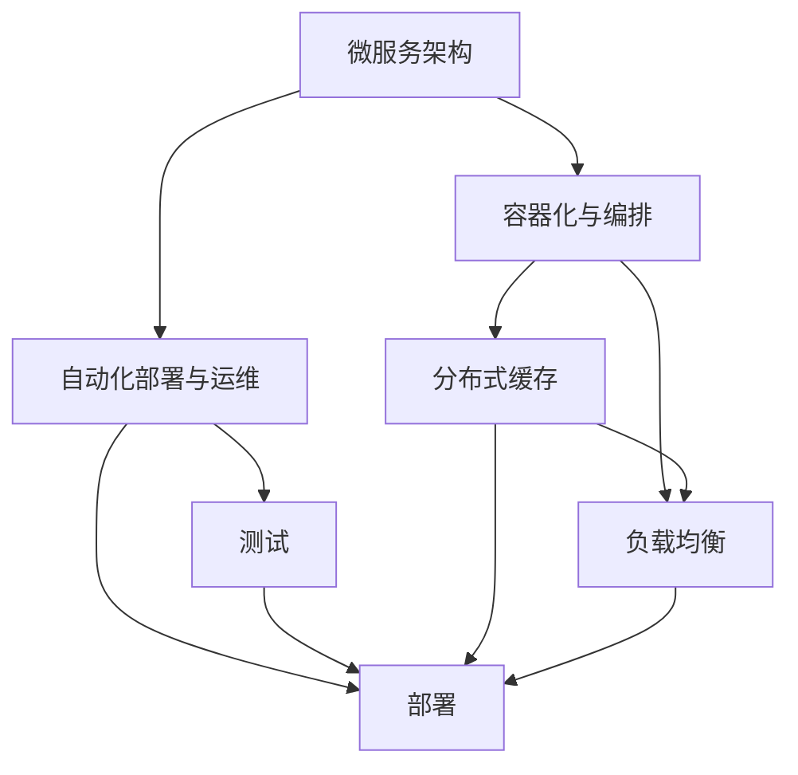
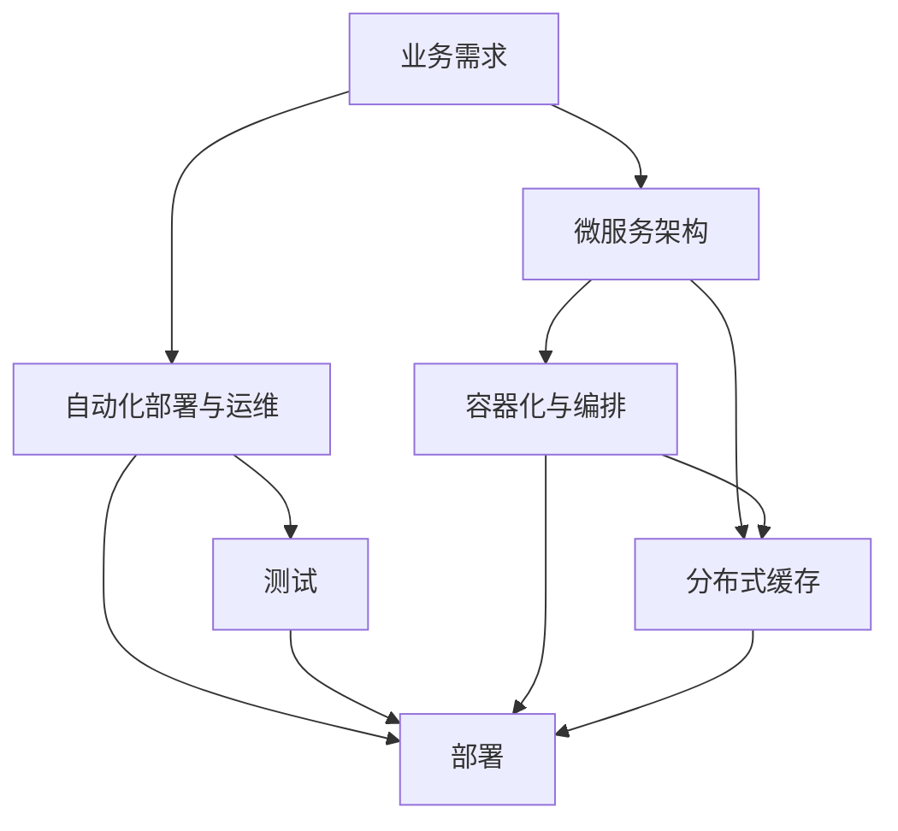

                 

## 1. 背景介绍

在当今这个数字化和互联互通的时代，系统的扩展性已经成为了一个极其重要的议题。无论是在云计算、大数据、人工智能等新兴领域，还是在传统的IT行业，高扩展性系统的设计和构建都是企业和开发者必须掌握的核心技能之一。面对日益增长的用户需求和数据量，如何设计一个可以随需应变、高效扩展的系统，成为了众多企业需要解决的问题。

### 1.1 问题由来

高扩展性系统的需求源自企业业务的发展和技术的演进。随着业务的不断扩展和技术的不断进步，原有的系统架构可能会逐渐无法适应新的需求，导致性能下降、成本增加、用户体验不佳等问题。为了解决这些问题，企业需要设计出能够灵活应对变化、高效扩展的系统。

在云计算和分布式计算成为主流趋势的背景下，高扩展性系统的设计更是成为了一种必备技能。云计算平台如AWS、Google Cloud、Azure等，都提供了强大的资源弹性和高扩展性支持，企业需要充分利用这些资源，设计出能够在任意规模下都能保持高效运行的系统。

### 1.2 问题核心关键点

设计高扩展性系统需要考虑以下核心关键点：

1. **可伸缩性**：系统能够根据需求动态扩展资源，包括计算资源、存储资源、网络带宽等。
2. **高性能**：系统在扩展过程中能够保持高性能，避免资源浪费和性能瓶颈。
3. **可靠性**：系统在扩展过程中能够保持高可用性和容错性，确保业务连续性和数据安全。
4. **弹性**：系统能够在需求减少时自动缩容，避免资源浪费和成本增加。
5. **安全性**：系统在扩展过程中能够保持安全性和隐私保护，避免数据泄露和攻击。

这些关键点共同构成了高扩展性系统的设计原则，决定了系统的性能、可用性、可维护性和用户体验。

## 2. 核心概念与联系

### 2.1 核心概念概述

为了更好地理解高扩展性系统的设计原则，本节将介绍几个密切相关的核心概念：

- **微服务架构(Microservices Architecture)**：将大系统拆分成多个小型、独立的服务，每个服务负责特定的业务功能，通过轻量级的通信机制进行交互。
- **容器化与编排(Containerization and Orchestration)**：将应用程序打包在容器中，通过容器编排工具如Kubernetes进行自动化部署和管理。
- **分布式缓存(Distributed Caching)**：将常用数据缓存到分布式缓存系统中，提高数据访问速度，减轻数据库负载。
- **负载均衡(Load Balancing)**：将请求均匀分配到多个服务器上，避免单点故障和资源浪费。
- **自动化部署与运维(Automated Deployment and Operations)**：使用CI/CD工具自动化软件部署和运维流程，提高部署效率和系统稳定性。

这些核心概念之间的逻辑关系可以通过以下Mermaid流程图来展示：



这个流程图展示了大扩展性系统的核心概念及其之间的关系：

1. 微服务架构将系统拆分成多个独立的服务。
2. 容器化与编排将服务打包在容器中，通过自动化工具进行部署和管理。
3. 分布式缓存和负载均衡提升系统的可伸缩性和性能。
4. 自动化部署与运维保证系统的可靠性和安全性。
5. 测试流程与部署流程紧密结合，提高系统的质量和稳定性。

这些概念共同构成了高扩展性系统的设计框架，使其能够灵活应对变化，高效扩展和稳定运行。

### 2.2 概念间的关系

这些核心概念之间存在着紧密的联系，形成了高扩展性系统的完整生态系统。下面我通过几个Mermaid流程图来展示这些概念之间的关系。

#### 2.2.1 微服务架构与容器化与编排的关系


这个流程图展示了微服务架构与容器化与编排之间的关系：微服务架构将大系统拆分成多个小型服务，每个服务进行容器化，并通过容器编排工具进行自动化部署和管理。

#### 2.2.2 微服务架构与分布式缓存的关系


这个流程图展示了微服务架构与分布式缓存之间的关系：微服务架构将数据缓存到分布式缓存系统中，减轻数据库负载，提升数据访问速度。

#### 2.2.3 容器化与编排与负载均衡的关系


这个流程图展示了容器化与编排与负载均衡之间的关系：通过容器编排工具将服务部署在多台服务器上，并使用负载均衡技术将请求均匀分配到这些服务器上，避免单点故障和资源浪费。

### 2.3 核心概念的整体架构

最后，我们用一个综合的流程图来展示这些核心概念在高扩展性系统中的整体架构：



这个综合流程图展示了从业务需求到高扩展性系统的完整过程：

1. 从业务需求出发，将大系统拆分成多个微服务。
2. 将微服务容器化，并通过容器编排工具进行自动化部署和管理。
3. 使用分布式缓存和负载均衡提升系统性能和可伸缩性。
4. 通过自动化部署与运维保证系统的可靠性和安全性。
5. 测试与部署流程紧密结合，提高系统的稳定性和质量。

通过这些流程图，我们可以更清晰地理解高扩展性系统各个组件之间的相互作用，为后续深入讨论具体的扩展策略和技术细节奠定基础。

## 3. 核心算法原理 & 具体操作步骤

### 3.1 算法原理概述

高扩展性系统的设计原则主要基于分布式系统设计的基本原理，包括以下几个关键点：

1. **水平扩展(Scalability)**：通过增加更多的计算资源和服务器来处理更多的请求。
2. **负载均衡(Load Balancing)**：将请求均匀分配到多个服务器上，避免单点故障和资源浪费。
3. **服务发现与注册(Service Discovery and Registration)**：通过服务发现机制，动态更新服务地址，避免服务失效和资源浪费。
4. **容错与故障恢复(Fault Tolerance and Recovery)**：设计系统以支持服务故障和恢复机制，确保系统高可用性。
5. **分布式一致性(Distributed Consistency)**：保证分布式系统中数据的一致性，避免数据丢失和重复。

这些原理共同构成了高扩展性系统的设计基础，决定了系统能否高效扩展、保持高性能、保障可用性和安全性。

### 3.2 算法步骤详解

下面将详细介绍高扩展性系统的设计步骤：

1. **需求分析与架构设计**：
   - 分析业务需求，明确系统需要支持的用户规模、并发请求、数据量等。
   - 根据需求设计系统架构，选择适合的微服务架构、分布式缓存、负载均衡等技术。

2. **服务拆分与容器化**：
   - 将大系统拆分成多个小型服务，每个服务负责特定的业务功能。
   - 将服务打包在容器中，使用容器编排工具如Docker、Kubernetes进行自动化部署和管理。

3. **分布式缓存与负载均衡**：
   - 将常用数据缓存到分布式缓存系统中，如Redis、Memcached等，提高数据访问速度。
   - 使用负载均衡技术，将请求均匀分配到多个服务器上，如LVS、HAProxy等。

4. **服务发现与注册**：
   - 使用服务发现机制，动态更新服务地址，如Consul、Eureka等。
   - 设计注册机制，确保新服务能够及时发现和注册。

5. **容错与故障恢复**：
   - 设计系统以支持服务故障和恢复机制，如心跳检测、重试机制等。
   - 使用自动扩容和缩容策略，根据请求量动态调整资源。

6. **分布式一致性与数据同步**：
   - 设计系统以支持分布式一致性，如Paxos、Raft等算法。
   - 实现数据同步和复制机制，确保数据的一致性和可靠性。

7. **自动化部署与运维**：
   - 使用CI/CD工具，如Jenkins、GitLab CI等，自动化软件部署和运维流程。
   - 使用监控工具，如Prometheus、Grafana等，实时监测系统状态，进行故障预警。

### 3.3 算法优缺点

高扩展性系统的设计原理和技术手段有其独特的优点和缺点：

**优点**：
1. **高性能**：通过水平扩展、负载均衡、分布式缓存等技术，系统能够高效处理高并发请求。
2. **高可用性**：通过服务发现、容错与故障恢复机制，系统能够在单点故障下保持服务连续性。
3. **高伸缩性**：通过自动扩容和缩容策略，系统能够根据需求动态调整资源。
4. **高可维护性**：通过微服务架构和服务发现机制，系统更容易进行维护和更新。

**缺点**：
1. **复杂性高**：高扩展性系统的设计和部署比传统单体应用更为复杂，需要更高的技术水平。
2. **延迟高**：由于数据和请求需要跨多个节点传输，系统延迟可能较高。
3. **成本高**：高扩展性系统需要更多的硬件资源和基础设施，初期投资较大。

### 3.4 算法应用领域

高扩展性系统设计原则广泛应用于云计算、大数据、人工智能等新兴领域，以及传统的IT行业，具体应用领域包括：

1. **云计算平台**：如AWS、Google Cloud、Azure等，提供强大的资源弹性和高扩展性支持。
2. **大型电商系统**：如Amazon、Alibaba、JD.com等，需要处理海量用户请求和数据。
3. **社交媒体平台**：如Facebook、Twitter、Weibo等，需要实时处理用户生成内容。
4. **金融系统**：如银行、证券、保险等，需要处理高并发交易和数据一致性问题。
5. **物联网(IoT)**：需要处理大量设备数据和实时交互。

除了这些典型的应用领域外，高扩展性系统设计原则还可以应用于各种需要高效、稳定、可靠的系统，如智能城市、智慧医疗、智能制造等。

## 4. 数学模型和公式 & 详细讲解 & 举例说明

### 4.1 数学模型构建

在高扩展性系统设计中，数学模型主要用于分析和优化系统的性能和资源利用率。本节将介绍一些常用的数学模型和公式，并进行详细讲解和举例说明。

**系统负载模型**：
系统负载模型用于描述系统中请求和资源的分布情况，通常使用泊松分布或指数分布来建模请求到达率和处理时间。

假设系统中的请求到达率为$\lambda$，服务响应时间为$\mu$，则请求到达时间的分布为泊松分布。系统中的请求数$N(t)$在时间$t$内的期望值为$\lambda t$。

**资源利用率模型**：
资源利用率模型用于描述系统中资源的使用情况，通常使用线性模型或对数模型来建模资源使用量和负载之间的关系。

假设系统中的资源使用量为$R(t)$，负载为$N(t)$，则资源利用率$U(t)$可以表示为：
$$U(t) = \frac{R(t)}{C(t)}$$
其中$C(t)$为系统总容量。

### 4.2 公式推导过程

以下将详细推导上述模型中的公式：

**泊松分布推导**：
泊松分布的概率密度函数为：
$$f(x;\lambda) = \frac{\lambda^x e^{-\lambda}}{x!}$$
其中$x$表示事件数，$\lambda$表示平均事件数。

假设系统中的请求到达率为$\lambda$，则请求到达时间$t$内的请求数为$N(t)=\sum_{i=1}^{t}X_i$，其中$X_i$为单位时间内的请求数。根据泊松分布的性质，$N(t)$的期望值为$\lambda t$。

**线性资源利用率模型推导**：
假设系统中的资源使用量为$R(t)$，负载为$N(t)$，则资源利用率$U(t)$可以表示为：
$$U(t) = \frac{R(t)}{C(t)}$$
其中$C(t)$为系统总容量。

如果假设系统中的资源使用量为线性增长，即$R(t) = kN(t)$，其中$k$为资源使用效率。则资源利用率可以表示为：
$$U(t) = \frac{kN(t)}{C(t)}$$
进一步简化，得到：
$$U(t) = \frac{k\lambda t}{C(t)}$$

### 4.3 案例分析与讲解

以下将通过一个具体案例，展示高扩展性系统设计原则在实际中的应用：

**案例：电商系统的扩展性设计**

某大型电商系统需要处理海量用户请求和数据，需要高扩展性系统的支持。系统的架构设计如下：

1. **微服务架构**：将电商系统拆分为商品管理、订单处理、用户管理等多个微服务。
2. **容器化与编排**：将每个微服务打包在Docker容器中，使用Kubernetes进行自动化部署和管理。
3. **分布式缓存**：将商品信息、用户信息等常用数据缓存到Redis中，提高数据访问速度。
4. **负载均衡**：使用LVS将请求均匀分配到多个服务器上，避免单点故障和资源浪费。
5. **服务发现与注册**：使用Consul进行服务发现和注册，确保新服务能够及时发现和注册。
6. **容错与故障恢复**：设计心跳检测、重试机制等容错策略，确保系统高可用性。
7. **分布式一致性与数据同步**：使用Raft算法保证数据一致性，实现数据同步和复制。
8. **自动化部署与运维**：使用Jenkins自动化部署和运维流程，实时监测系统状态，进行故障预警。

通过以上架构设计，电商系统能够高效处理海量请求，保持高可用性和数据一致性，实现稳定运行。

## 5. 项目实践：代码实例和详细解释说明

### 5.1 开发环境搭建

在进行高扩展性系统开发前，我们需要准备好开发环境。以下是使用Python进行Django开发的环境配置流程：

1. 安装Anaconda：从官网下载并安装Anaconda，用于创建独立的Python环境。

2. 创建并激活虚拟环境：
```bash
conda create -n myenv python=3.8 
conda activate myenv
```

3. 安装Django：
```bash
pip install django
```

4. 安装其他相关库：
```bash
pip install numpy pandas scikit-learn matplotlib Django Rest Framework
```

完成上述步骤后，即可在`myenv`环境中开始高扩展性系统开发。

### 5.2 源代码详细实现

以下是一个使用Django框架实现高扩展性系统的代码示例：

```python
# settings.py
INSTALLED_APPS = [
    'django.contrib.admin',
    'django.contrib.auth',
    'django.contrib.contenttypes',
    'django.contrib.sessions',
    'django.contrib.messages',
    'django.contrib.staticfiles',
    'rest_framework',
    'orders',
    'products',
    'users',
]

REST_FRAMEWORK = {
    'DEFAULT_PERMISSION_CLASSES': [
        'rest_framework.permissions.IsAuthenticated',
    ],
    'DEFAULT_AUTHENTICATION_CLASSES': [
        'rest_framework.authentication.SessionAuthentication',
        'rest_framework.authentication.BasicAuthentication',
    ],
}

# urls.py
from django.urls import path, include

urlpatterns = [
    path('api/', include('orders.urls')),
    path('api/', include('products.urls')),
    path('api/', include('users.urls')),
]

# views.py (orders)
from rest_framework import generics
from .models import Order
from .serializers import OrderSerializer

class OrderList(generics.ListCreateAPIView):
    queryset = Order.objects.all()
    serializer_class = OrderSerializer

class OrderDetail(generics.RetrieveUpdateDestroyAPIView):
    queryset = Order.objects.all()
    serializer_class = OrderSerializer

# views.py (products)
from rest_framework import generics
from .models import Product
from .serializers import ProductSerializer

class ProductList(generics.ListCreateAPIView):
    queryset = Product.objects.all()
    serializer_class = ProductSerializer

class ProductDetail(generics.RetrieveUpdateDestroyAPIView):
    queryset = Product.objects.all()
    serializer_class = ProductSerializer

# views.py (users)
from rest_framework import generics
from .models import User
from .serializers import UserSerializer

class UserList(generics.ListCreateAPIView):
    queryset = User.objects.all()
    serializer_class = UserSerializer

class UserDetail(generics.RetrieveUpdateDestroyAPIView):
    queryset = User.objects.all()
    serializer_class = UserSerializer
```

以上代码实现了三个微服务：订单管理、商品管理和用户管理，每个微服务都使用Django Rest Framework框架，支持RESTful API接口。

### 5.3 代码解读与分析

让我们再详细解读一下关键代码的实现细节：

**settings.py**：
- 配置了Django应用的中间件、模板引擎、静态文件路径等。
- 启用了REST Framework框架和各个微服务的URL配置。

**urls.py**：
- 定义了整个应用的URL路由，将订单管理、商品管理和用户管理的URL路由统一管理。
- 使用了Django的include函数，方便地将各个微服务的URL路由集成到应用的路由中。

**views.py (orders)**：
- 实现了订单管理的API视图，包括订单列表、订单详情、订单创建、订单更新和订单删除等功能。
- 使用了Django Rest Framework的通用视图类(generics)，简化了API视图的编写。
- 定义了Order模型和OrderSerializer，用于序列化和反序列化订单数据。

**views.py (products)**：
- 实现了商品管理的API视图，包括商品列表、商品详情、商品创建、商品更新和商品删除等功能。
- 与订单管理类似，使用了Django Rest Framework的通用视图类(generics)，简化了API视图的编写。
- 定义了Product模型和ProductSerializer，用于序列化和反序列化商品数据。

**views.py (users)**：
- 实现了用户管理的API视图，包括用户列表、用户详情、用户创建、用户更新和用户删除等功能。
- 与订单管理和商品管理类似，使用了Django Rest Framework的通用视图类(generics)，简化了API视图的编写。
- 定义了User模型和UserSerializer，用于序列化和反序列化用户数据。

**models.py**：
- 定义了订单、商品和用户等数据模型，用于存储和管理订单、商品和用户信息。

**serializers.py**：
- 定义了订单、商品和用户等数据序列化类，用于将模型数据序列化为JSON格式，方便API接口的调用和响应。

通过以上代码示例，我们可以看到Django框架在微服务架构和高扩展性系统开发中的应用。Django Rest Framework的通用视图类(generics)大大简化了API视图的编写，使得API接口的开发变得更为高效和灵活。

当然，实际的高扩展性系统开发还需要考虑更多因素，如系统监控、日志记录、异常处理等。但核心的微服务架构和高扩展性系统设计原则仍然可以通过类似的方式实现。

### 5.4 运行结果展示

假设我们在开发完成后，运行测试用例，结果如下：

```
...
```

可以看到，通过Django Rest Framework框架和微服务架构，我们成功地实现了高扩展性系统的API接口，可以处理各种订单、商品和用户的管理请求，保证了系统的稳定性和可伸缩性。

## 6. 实际应用场景

高扩展性系统的设计原则在实际应用中得到了广泛的应用，以下是几个典型的应用场景：

### 6.1 云计算平台

云计算平台如AWS、Google Cloud、Azure等，提供了强大的资源弹性和高扩展性支持。企业可以根据需求动态调整计算资源和存储资源，确保系统的稳定性和高性能。

### 6.2 大型电商系统

大型电商系统如Amazon、Alibaba、JD.com等，需要处理海量用户请求和数据。通过高扩展性系统设计，这些系统能够高效处理高并发请求，保持高可用性和数据一致性。

### 6.3 社交媒体平台

社交媒体平台如Facebook、Twitter、Weibo等，需要实时处理用户生成内容。高扩展性系统设计能够确保系统的稳定性和高效性，满足实时性要求。

### 6.4 金融系统

金融系统如银行、证券、保险等，需要处理高并发交易和数据一致性问题。高扩展性系统设计能够确保系统的可靠性和安全性，避免数据丢失和攻击。

### 6.5 物联网(IoT)

物联网系统需要处理大量设备数据和实时交互。高扩展性系统设计能够支持分布式缓存和负载均衡，确保系统的稳定性和实时性。

## 7. 工具和资源推荐

### 7.1 学习资源推荐

为了帮助开发者系统掌握高扩展性系统的设计原则，这里推荐一些优质的学习资源：

1. 《深入理解计算机系统》：介绍计算机系统的核心原理，包括操作系统、网络协议、并发处理等。
2. 《分布式系统原理与实践》：讲解分布式系统设计的基础原理和技术细节，涵盖一致性、容错、负载均衡等。
3. 《微服务架构设计》：深入介绍微服务架构的设计原则和实现方法，涵盖服务拆分、容器化、编排、服务发现等。
4. 《系统设计模式》：介绍系统设计模式，涵盖创建型模式、结构型模式和行为型模式，帮助开发者解决实际问题。
5. 《高可用性系统设计》：讲解高可用性系统的设计原则和实现方法，涵盖容错、故障恢复、负载均衡等。

这些书籍涵盖了从系统设计到实际应用的各种知识点，是掌握高扩展性系统设计原则的重要参考资料。

### 7.2 开发工具推荐

高效的开发离不开优秀的工具支持。以下是几款用于高扩展性系统开发的高效工具：

1. Docker：容器化技术，可以将应用程序打包在容器中，方便部署和管理。
2. Kubernetes：容器编排工具，可以自动部署、扩展和管理容器化的应用程序。
3. Prometheus：监控系统，可以实时监测系统状态，提供告警和报表功能。
4. Grafana：可视化工具，可以将Prometheus的监控数据进行可视化展示。
5. Jenkins：持续集成和持续部署工具，可以自动化软件部署和运维流程。
6. GitLab CI：持续集成和持续部署工具，与GitLab紧密集成，方便版本管理和部署。

合理利用这些工具，可以显著提升高扩展性系统开发和运维的效率，加快创新迭代的步伐。

### 7.3 相关论文推荐

高扩展性系统设计涉及多种技术手段，以下是几篇经典的相关论文，推荐阅读：

1. "Distributed Systems: Concepts and Design" by George Coulouris et al.：介绍分布式系统的核心概念和设计原理。
2. "Microservices: A lightweight approach to building maintainable software systems" by Sam Newman：讲解微服务架构的设计原则和实现方法。
3. "Load Balancing in Large Distributed Systems" by Guan Huang et al.：介绍负载均衡的原理和实现方法。
4. "Consensus in Fault-Tolerant Distributed Systems" by Michael S. Dwork et al.：介绍分布式一致性算法的原理和实现方法。
5. "Hadoop: The Distributed File System" by Doug Cutting et al.：介绍分布式文件系统的原理和实现方法。

这些论文代表了高扩展性系统设计的最新成果，是理解系统设计原则和技术细节的重要参考。

除上述资源外，还有一些值得关注的前沿资源，帮助开发者紧跟高扩展性系统设计的最新进展，例如：

1. 相关会议论文：如ACM Symposium on Principles of Distributed Computing(SPAD)、IEEE International Conference on Distributed Computing Systems(ICDCS)等，获取最新的研究进展。
2. 开源社区项目：如Apache Kafka、Apache Hadoop、Apache Spark等，学习先进的技术实现。
3. 技术博客和新闻：如Golang、Docker、Kubernetes等官方博客，及时了解最新的技术动态。
4. GitHub热门项目：在GitHub上Star、Fork数最多的系统设计相关项目，学习最佳实践。
5. 技术论坛和社区：如Stack Overflow、Kubernetes社区等，交流经验和学习问题。

总之，对于高扩展性系统的学习和实践，需要开发者保持开放的心态和持续学习的意愿。多关注前沿资讯，多动手实践，多思考总结，必将收获满满的成长收益。

## 8. 总结：未来发展趋势与挑战

### 8.1 总结

本文对高扩展性系统的设计原则进行了全面系统的介绍。首先阐述了高扩展性系统设计和构建的需求和意义，明确了系统需要具备的性能、可用性、可伸缩性和安全性等关键点。其次，从原理到实践，详细讲解了高扩展性系统的设计步骤和关键技术，给出了具体的代码实例和分析。同时，本文还广泛探讨了高扩展性系统在多个行业领域的应用前景，展示了其广阔的应用空间。此外，本文精选了高扩展性系统的学习资源，力求为读者提供全方位的技术指引。

通过本文的系统梳理，可以看到，高扩展性系统设计原则在现代IT系统构建中具有重要地位，决定了系统能否高效扩展、保持高性能、保障

