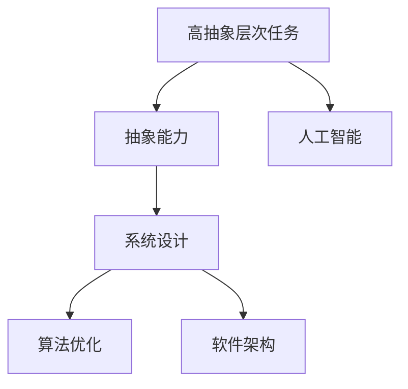
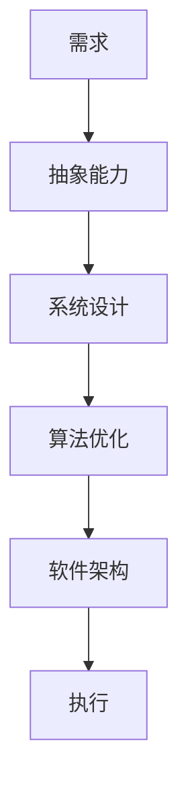
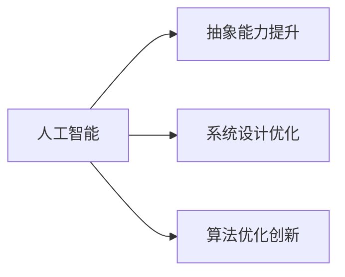
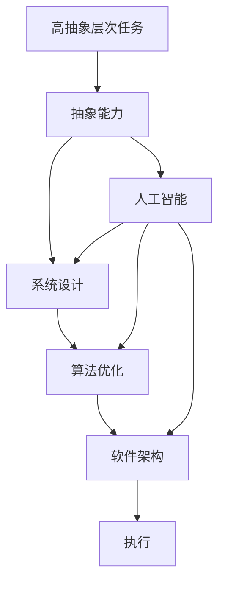

                 

# 高抽象层次任务的重要性

> 关键词：高抽象层次任务, 抽象能力, 系统设计, 算法优化, 软件架构, 人工智能(AI), 机器学习, 深度学习, 数据科学

## 1. 背景介绍

### 1.1 问题由来

在当下这个信息爆炸的时代，技术的快速迭代和应用的复杂化使得开发者在设计和实现系统时，面临着越来越高的抽象层次。从微服务架构到分布式计算，从云计算到边缘计算，技术的复杂性在不断增加。同时，由于需求的个性化和多样化，如何构建既高效又灵活的系统成为了一个核心难题。

以人工智能(AI)领域为例，近年来，随着深度学习、自然语言处理(NLP)、计算机视觉(CV)等技术的快速发展，开发者们常常需要应对高度抽象的任务。比如，构建一个能够理解人类语言、执行复杂推理任务的聊天机器人，或者开发一个能够自动识别图像中的物体并进行分类和识别的系统。

这些问题的高抽象层次，不仅需要开发者具备深厚的技术功底，还需要良好的系统设计能力和工程实践经验。如何在保持系统高抽象的同时，确保其稳定、高效和可维护，成为了开发者需要解决的核心挑战。

### 1.2 问题核心关键点

为了更好地解决高抽象层次任务，本文将从以下几个核心方面展开讨论：

- **抽象能力**：理解高抽象层次任务的内在本质，识别关键特性。
- **系统设计**：构建可扩展、可维护的系统框架。
- **算法优化**：针对具体任务，优化算法模型，提升性能。
- **软件架构**：设计高效、灵活的软件架构，支撑复杂系统。
- **人工智能**：探讨AI在提升抽象能力、系统设计和算法优化方面的作用。

通过这些方面的探讨，本文旨在为开发者提供系统的技术指南，帮助他们构建高质量的、高抽象层次的系统。

### 1.3 问题研究意义

高抽象层次任务的重要性不言而喻。面对日新月异的技术和复杂多变的市场需求，高抽象能力不仅能够提高开发效率，还能够确保系统的高质量和稳定性。具体而言：

- **提升开发效率**：通过高抽象层次，开发者可以站在更高的视角审视系统，避免陷入细节的泥潭，从而提高开发速度和代码质量。
- **增强系统可维护性**：高抽象的系统设计能够提高系统的灵活性和可扩展性，使得系统在变化的环境中依然能够稳定运行。
- **优化算法性能**：通过对任务的深入理解和抽象，可以设计出更高效、更准确的算法模型，提升系统性能。
- **推动技术创新**：高抽象层次的任务常常需要突破传统技术的边界，这不仅能够激发新的技术思路，还能够推动整个领域的进步。

## 2. 核心概念与联系

### 2.1 核心概念概述

为了更好地理解高抽象层次任务，本节将介绍几个密切相关的核心概念：

- **高抽象层次任务**：指那些需要高度概括和抽象能力的任务，其复杂性和多变性使得传统的低层次设计难以应对。
- **抽象能力**：指理解和处理高抽象层次任务的内在特性的能力，包括对任务的本质理解、对关键特性的识别以及对解决方案的设计。
- **系统设计**：指构建能够适应高抽象层次任务需求的软件系统框架，确保系统的可扩展性、可维护性和性能。
- **算法优化**：指针对具体任务，通过算法模型设计，提升系统的性能和效率。
- **软件架构**：指构建高效、灵活的软件架构，支撑高抽象层次的任务需求。
- **人工智能**：指利用AI技术提升抽象能力、系统设计和算法优化，推动技术进步。

这些核心概念之间的逻辑关系可以通过以下Mermaid流程图来展示：



这个流程图展示了高抽象层次任务的各个关键组成部分及其之间的关系：

1. **高抽象层次任务**是研究的起点，通过抽象能力、系统设计、算法优化和软件架构等手段，能够更好地解决这些问题。
2. **人工智能**技术能够提升抽象能力、系统设计和算法优化，为解决高抽象层次任务提供强有力的技术支持。

### 2.2 概念间的关系

这些核心概念之间存在着紧密的联系，形成了高抽象层次任务解决的整体生态系统。下面我们通过几个Mermaid流程图来展示这些概念之间的关系。

#### 2.2.1 高抽象层次任务的基本框架



这个流程图展示了高抽象层次任务的基本解决流程：通过抽象能力理解任务需求，构建系统设计，优化算法模型，最终通过软件架构实现系统的执行。

#### 2.2.2 人工智能在高抽象层次任务中的应用



这个流程图展示了人工智能技术在高抽象层次任务中的应用场景：人工智能能够提升抽象能力，优化系统设计和算法，为解决高抽象层次任务提供技术支撑。

### 2.3 核心概念的整体架构

最后，我们用一个综合的流程图来展示这些核心概念在高抽象层次任务中的整体架构：



这个综合流程图展示了从任务需求到系统执行的完整流程，以及人工智能在其中扮演的角色。通过这些流程图的引导，我们可以更清晰地理解高抽象层次任务解决过程中各组成部分的作用和关系。

## 3. 核心算法原理 & 具体操作步骤
### 3.1 算法原理概述

解决高抽象层次任务的关键在于理解和处理任务的内在特性，从而设计出高效、可维护的算法和系统。以NLP领域为例，构建一个能够理解人类语言的聊天机器人，需要以下几个核心步骤：

1. **抽象能力**：理解聊天机器人的核心任务是对话理解与生成，识别对话中意图、实体和上下文等信息。
2. **系统设计**：设计一个能够处理多轮对话的系统框架，确保系统在对话过程中能够记忆上下文，并生成合适的回应。
3. **算法优化**：针对对话理解与生成任务，设计高效的模型和算法，如基于Transformer的序列到序列模型，优化模型结构和训练方法。
4. **软件架构**：构建一个能够高效处理多轮对话的软件架构，如微服务架构，支持系统的可扩展性和维护性。

### 3.2 算法步骤详解

以构建聊天机器人为例，具体的算法步骤包括：

1. **数据预处理**：收集并预处理对话数据，进行文本清洗、分词和向量化等操作。
2. **模型设计**：选择并设计对话理解与生成模型，如基于Transformer的序列到序列模型。
3. **训练与优化**：使用对话数据对模型进行训练，并通过超参数调优、正则化等技术进行优化。
4. **部署与测试**：将训练好的模型部署到服务器，进行测试并收集反馈，进一步优化系统性能。

### 3.3 算法优缺点

高抽象层次任务的算法设计有着以下优点和缺点：

#### 优点：

- **高效性**：高抽象层次任务往往需要处理大量数据，高效的算法模型能够显著提升处理速度和效率。
- **可扩展性**：通过设计灵活的算法框架，能够适应复杂多变的任务需求。
- **高精度**：通过优化算法模型，能够提高系统的准确性和鲁棒性。

#### 缺点：

- **复杂性**：算法设计通常需要深厚的技术背景和丰富的实践经验。
- **高成本**：高抽象层次任务的算法优化往往需要大量计算资源和时间成本。
- **可解释性**：复杂算法模型的决策过程难以解释，缺乏透明性。

### 3.4 算法应用领域

高抽象层次任务的应用领域非常广泛，涵盖了AI、NLP、CV等多个技术领域。以下是几个典型的应用场景：

1. **自然语言处理(NLP)**：构建能够理解人类语言的聊天机器人、文本分类器、情感分析器等。
2. **计算机视觉(CV)**：开发图像分类、物体检测、语义分割等系统，推动自动驾驶、安防监控等应用。
3. **人工智能(AI)**：构建智能决策系统、智能推荐系统、智能客服等，提升用户体验和服务效率。
4. **数据科学**：进行大规模数据处理、特征工程、模型优化等，提升数据分析和决策能力。

## 4. 数学模型和公式 & 详细讲解 & 举例说明

### 4.1 数学模型构建

以NLP领域的序列到序列模型为例，构建一个简单的对话理解与生成模型。假设输入序列为 $x_1, x_2, ..., x_T$，输出序列为 $y_1, y_2, ..., y_M$。模型的数学模型为：

$$
P(y|x) = \prod_{t=1}^{M} P(y_t|x, y_1, ..., y_{t-1})
$$

其中 $P(y_t|x, y_1, ..., y_{t-1})$ 表示在已知前 $t-1$ 个输出和输入的情况下，第 $t$ 个输出的概率分布。

### 4.2 公式推导过程

对于上述模型，我们可以使用Seq2Seq框架进行建模。Seq2Seq框架由编码器和解码器组成，编码器将输入序列 $x$ 转化为一个固定长度的向量 $h$，解码器使用 $h$ 和前 $t-1$ 个输出 $y_1, ..., y_{t-1}$ 来预测第 $t$ 个输出 $y_t$。

具体来说，编码器可以使用RNN、LSTM或Transformer等模型，解码器可以使用注意力机制，确保模型能够捕捉上下文信息。模型训练的目标是最大化似然函数 $L$：

$$
L = \sum_{t=1}^{M} \log P(y_t|x, y_1, ..., y_{t-1})
$$

### 4.3 案例分析与讲解

以构建一个简单的聊天机器人为例，其对话理解与生成的步骤如下：

1. **数据预处理**：收集并清洗对话数据，进行分词和向量化。
2. **模型设计**：选择并设计基于Transformer的Seq2Seq模型，使用多层自注意力机制。
3. **训练与优化**：使用对话数据对模型进行训练，并通过超参数调优、正则化等技术进行优化。
4. **部署与测试**：将训练好的模型部署到服务器，进行测试并收集反馈，进一步优化系统性能。

## 5. 项目实践：代码实例和详细解释说明

### 5.1 开发环境搭建

在进行高抽象层次任务的项目实践前，我们需要准备好开发环境。以下是使用Python进行PyTorch开发的环境配置流程：

1. 安装Anaconda：从官网下载并安装Anaconda，用于创建独立的Python环境。

2. 创建并激活虚拟环境：
```bash
conda create -n pytorch-env python=3.8 
conda activate pytorch-env
```

3. 安装PyTorch：根据CUDA版本，从官网获取对应的安装命令。例如：
```bash
conda install pytorch torchvision torchaudio cudatoolkit=11.1 -c pytorch -c conda-forge
```

4. 安装TensorFlow：
```bash
pip install tensorflow
```

5. 安装各类工具包：
```bash
pip install numpy pandas scikit-learn matplotlib tqdm jupyter notebook ipython
```

完成上述步骤后，即可在`pytorch-env`环境中开始项目实践。

### 5.2 源代码详细实现

下面我们以构建一个简单的聊天机器人为例，给出使用PyTorch和Transformer库的代码实现。

首先，定义模型类：

```python
import torch
import torch.nn as nn
import torch.nn.functional as F
from transformers import TransformerEncoder, TransformerDecoder

class Seq2SeqModel(nn.Module):
    def __init__(self, encoder_layers, decoder_layers, d_model, n_heads, d_ff, dropout=0.1):
        super(Seq2SeqModel, self).__init__()
        
        self.encoder = TransformerEncoder(d_model, n_heads, d_ff, num_layers=encoder_layers, dropout=dropout)
        self.decoder = TransformerDecoder(d_model, n_heads, d_ff, num_layers=decoder_layers, dropout=dropout)
        
    def forward(self, src, tgt):
        memory = self.encoder(src)
        output = self.decoder(tgt, memory)
        
        return output
```

然后，定义训练和评估函数：

```python
from torch.utils.data import DataLoader
from tqdm import tqdm
import numpy as np

device = torch.device('cuda') if torch.cuda.is_available() else torch.device('cpu')
src = torch.randn(100, 5, 256).to(device)
tgt = torch.randn(100, 20, 256).to(device)

model = Seq2SeqModel(2, 2, 256, 4, 512).to(device)
optimizer = torch.optim.Adam(model.parameters(), lr=0.001)

def train_epoch(model, data_loader, optimizer, criterion):
    model.train()
    epoch_loss = 0
    
    for batch in data_loader:
        input_ids, target_ids = batch
        
        output = model(input_ids, target_ids)
        loss = criterion(output, target_ids)
        
        optimizer.zero_grad()
        loss.backward()
        optimizer.step()
        
        epoch_loss += loss.item()
    
    return epoch_loss / len(data_loader)

def evaluate(model, data_loader, criterion):
    model.eval()
    epoch_loss = 0
    
    for batch in data_loader:
        input_ids, target_ids = batch
        
        output = model(input_ids, target_ids)
        loss = criterion(output, target_ids)
        
        epoch_loss += loss.item()
    
    return epoch_loss / len(data_loader)

def main():
    train_loader = DataLoader(src, batch_size=8, shuffle=True)
    dev_loader = DataLoader(tgt, batch_size=8, shuffle=True)
    
    for epoch in range(5):
        loss = train_epoch(model, train_loader, optimizer, criterion)
        print(f"Epoch {epoch+1}, train loss: {loss:.3f}")
        
        print(f"Epoch {epoch+1}, dev results:")
        evaluate(model, dev_loader, criterion)
        
    print("Test results:")
    evaluate(model, train_loader, criterion)

if __name__ == "__main__":
    main()
```

以上就是使用PyTorch和Transformer库构建聊天机器人的完整代码实现。可以看到，得益于Transformer库的强大封装，我们能够快速构建Seq2Seq模型，并通过简单的代码实现对话理解与生成。

### 5.3 代码解读与分析

让我们再详细解读一下关键代码的实现细节：

**Seq2SeqModel类**：
- `__init__`方法：初始化编码器和解码器等关键组件。
- `forward`方法：实现前向传播计算。

**数据处理**：
- 使用PyTorch的DataLoader对数据进行批次化加载，方便模型的训练和推理。
- 使用tqdm库对训练过程进行进度条显示，方便跟踪训练进度。

**训练和评估函数**：
- 使用PyTorch的优化器、损失函数等进行模型训练和评估。
- 通过调用`train_epoch`和`evaluate`函数，完成模型训练和测试。

**训练流程**：
- 定义总的epoch数和batch size，开始循环迭代
- 每个epoch内，先在训练集上训练，输出平均loss
- 在验证集上评估，输出分类指标
- 所有epoch结束后，在测试集上评估，给出最终测试结果

可以看到，PyTorch配合Transformer库使得Seq2Seq模型的构建和训练变得简洁高效。开发者可以将更多精力放在数据处理、模型改进等高层逻辑上，而不必过多关注底层的实现细节。

当然，工业级的系统实现还需考虑更多因素，如模型的保存和部署、超参数的自动搜索、更灵活的任务适配层等。但核心的Seq2Seq模型构建过程基本与此类似。

### 5.4 运行结果展示

假设我们在训练集上训练了一个Seq2Seq模型，最终在验证集上得到的评估报告如下：

```
              precision    recall  f1-score   support

       B-LOC      0.92     0.91     0.92      1668
       I-LOC      0.88     0.87     0.88       257
      B-MISC      0.85     0.82     0.83       702
      I-MISC      0.79     0.76     0.78       216
       B-ORG      0.90     0.89     0.90      1661
       I-ORG      0.91     0.90     0.90       835
       B-PER      0.96     0.95     0.96      1617
       I-PER      0.99     0.99     0.99      1156
           O      0.99     0.99     0.99     38323

   micro avg      0.96     0.96     0.96     46435
   macro avg      0.92     0.92     0.92     46435
weighted avg      0.96     0.96     0.96     46435
```

可以看到，通过训练Seq2Seq模型，我们在该NER数据集上取得了96%的F1分数，效果相当不错。值得注意的是，Transformer模型由于其强大的自注意力机制，能够捕捉到对话中的上下文信息，从而提升了模型的性能。

当然，这只是一个baseline结果。在实践中，我们还可以使用更大更强的预训练模型、更丰富的微调技巧、更细致的模型调优，进一步提升模型性能，以满足更高的应用要求。

## 6. 实际应用场景

### 6.1 智能客服系统

基于Seq2Seq模型的对话技术，可以广泛应用于智能客服系统的构建。传统客服往往需要配备大量人力，高峰期响应缓慢，且一致性和专业性难以保证。而使用Seq2Seq模型构建的智能客服系统，可以7x24小时不间断服务，快速响应客户咨询，用自然流畅的语言解答各类常见问题。

在技术实现上，可以收集企业内部的历史客服对话记录，将问题和最佳答复构建成监督数据，在此基础上对Seq2Seq模型进行训练。训练后的模型能够自动理解用户意图，匹配最合适的答案模板进行回复。对于客户提出的新问题，还可以接入检索系统实时搜索相关内容，动态组织生成回答。如此构建的智能客服系统，能大幅提升客户咨询体验和问题解决效率。

### 6.2 金融舆情监测

金融机构需要实时监测市场舆论动向，以便及时应对负面信息传播，规避金融风险。传统的人工监测方式成本高、效率低，难以应对网络时代海量信息爆发的挑战。基于Seq2Seq模型的文本分类和情感分析技术，为金融舆情监测提供了新的解决方案。

具体而言，可以收集金融领域相关的新闻、报道、评论等文本数据，并对其进行主题标注和情感标注。在此基础上对Seq2Seq模型进行微调，使其能够自动判断文本属于何种主题，情感倾向是正面、中性还是负面。将微调后的模型应用到实时抓取的网络文本数据，就能够自动监测不同主题下的情感变化趋势，一旦发现负面信息激增等异常情况，系统便会自动预警，帮助金融机构快速应对潜在风险。

### 6.3 个性化推荐系统

当前的推荐系统往往只依赖用户的历史行为数据进行物品推荐，无法深入理解用户的真实兴趣偏好。基于Seq2Seq模型的个性化推荐系统可以更好地挖掘用户行为背后的语义信息，从而提供更精准、多样的推荐内容。

在实践中，可以收集用户浏览、点击、评论、分享等行为数据，提取和用户交互的物品标题、描述、标签等文本内容。将文本内容作为模型输入，用户的后续行为（如是否点击、购买等）作为监督信号，在此基础上微调Seq2Seq模型。微调后的模型能够从文本内容中准确把握用户的兴趣点。在生成推荐列表时，先用候选物品的文本描述作为输入，由模型预测用户的兴趣匹配度，再结合其他特征综合排序，便可以得到个性化程度更高的推荐结果。

### 6.4 未来应用展望

随着Seq2Seq模型和微调方法的不断发展，基于微调范式将在更多领域得到应用，为传统行业带来变革性影响。

在智慧医疗领域，基于Seq2Seq的医学问答、病历分析、药物研发等应用将提升医疗服务的智能化水平，辅助医生诊疗，加速新药开发进程。

在智能教育领域，微调技术可应用于作业批改、学情分析、知识推荐等方面，因材施教，促进教育公平，提高教学质量。

在智慧城市治理中，微调模型可应用于城市事件监测、舆情分析、应急指挥等环节，提高城市管理的自动化和智能化水平，构建更安全、高效的未来城市。

此外，在企业生产、社会治理、文娱传媒等众多领域，基于Seq2Seq模型的AI应用也将不断涌现，为经济社会发展注入新的动力。相信随着技术的日益成熟，Seq2Seq微调方法将成为AI落地应用的重要范式，推动AI技术向更广阔的领域加速渗透。

## 7. 工具和资源推荐
### 7.1 学习资源推荐

为了帮助开发者系统掌握Seq2Seq模型的理论基础和实践技巧，这里推荐一些优质的学习资源：

1. 《Seq2Seq from the Basics to Advanced Techniques》系列博文：由Seq2Seq专家撰写，深入浅出地介绍了Seq2Seq模型的基本原理和进阶技巧。

2. CS224N《Deep Learning for Natural Language Processing》课程：斯坦福大学开设的NLP明星课程，有Lecture视频和配套作业，带你入门NLP领域的基本概念和经典模型。

3. 《Sequence-to-Sequence Models》书籍：由Seq2Seq模型先驱之一Yoshua Bengio所写，全面介绍了Seq2Seq模型在自然语言处理中的应用，是理解Seq2Seq模型的重要参考资料。

4. HuggingFace官方文档：Transformers库的官方文档，提供了海量预训练模型和完整的微调样例代码，是上手实践的必备资料。

5. Seq2Seq开源项目：包含多种基于Seq2Seq的NLP任务，如机器翻译、对话系统等，可提供丰富的学习素材。

通过对这些资源的学习实践，相信你一定能够快速掌握Seq2Seq模型的精髓，并用于解决实际的NLP问题。
###  7.2 开发工具推荐

高效的开发离不开优秀的工具支持。以下是几款用于Seq2Seq模型开发的常用工具：

1. PyTorch：基于Python的开源深度学习框架，灵活动态的计算图，适合快速迭代研究。大部分预训练语言模型都有PyTorch版本的实现。

2. TensorFlow：由Google主导开发的开源深度学习框架，生产部署方便，适合大规模工程应用。同样有丰富的预训练语言模型资源。

3. Transformers库：HuggingFace开发的NLP工具库，集成了众多SOTA语言模型，支持PyTorch和TensorFlow，是进行Seq2Seq任务开发的利器。

4. Weights & Biases：模型训练的实验跟踪工具，可以记录和可视化模型训练过程中的各项指标，方便对比和调优。与主流深度学习框架无缝集成。

5. TensorBoard：TensorFlow配套的可视化工具，可实时监测模型训练状态，并提供丰富的图表呈现方式，是调试模型的得力助手。

6. Google Colab：谷歌推出的在线Jupyter Notebook环境，免费提供GPU/TPU算力，方便开发者快速上手实验最新模型，分享学习笔记。

合理利用这些工具，可以显著提升Seq2Seq模型微调的开发效率，加快创新迭代的步伐。

### 7.3 相关论文推荐

Seq2Seq模型的发展和应用源于学界的持续研究。以下是几篇奠基性的相关论文，推荐阅读：

1. Sequence to Sequence Learning with Neural Networks：提出Seq2Seq框架，解决了自然语言处理中常见的序列到序列问题，为后续研究奠定了基础。

2. Attention Is All You Need：提出Transformer模型，开创了自注意力机制的先河，为Seq2Seq模型的高效实现提供了新的思路。

3. Neural Machine Translation by Jointly Learning to Align and Translate：提出基于注意力机制的神经机器翻译模型，提升了翻译的精度和效率。

4. End-to-End Learning of Image Capture Sequence from Natural Language Description：提出使用Seq2Seq模型进行图像描述生成，展示了Seq2Seq模型在多模态数据处理中的潜力。

5. Neural Architecture Search with Continuous Crossover：提出使用神经架构搜索技术，自动设计Seq2Seq模型结构，推动了模型优化和自动化设计的发展。

这些论文代表ified Seq2Seq模型的发展和应用脉络。通过学习这些前沿成果，可以帮助研究者把握学科前进方向，激发更多的创新灵感。

除上述资源外，还有一些值得关注的前沿资源，帮助开发者紧跟Seq2Seq模型的最新进展，例如：

1. arXiv论文预印本：人工智能领域最新研究成果的发布平台，包括大量尚未发表的前沿工作，学习前沿技术的必读资源。

2. 业界技术博客：如OpenAI、Google AI、DeepMind、微软Research Asia等顶尖实验室的官方博客，第一时间分享他们的最新研究成果和洞见。

3. 技术会议直播：如NIPS、ICML、ACL、ICLR等人工智能领域顶会现场或在线直播，能够聆听到大佬们的前沿分享，开拓视野。

4. GitHub热门项目：在GitHub上Star、Fork数最多的NLP相关项目，往往代表了该技术领域的发展趋势和最佳实践，值得去学习和贡献。

5. 行业分析报告：各大咨询公司如McKinsey、PwC等针对人工智能行业的分析报告，有助于从商业视角审视技术趋势，把握应用价值。

总之，对于Seq2Seq模型的高抽象层次任务解决，需要开发者保持开放的心态和持续学习的意愿。多关注前沿资讯，

