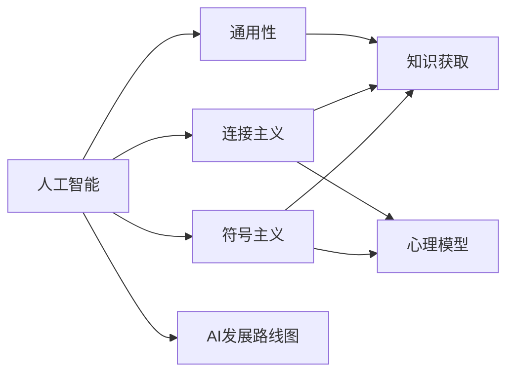

                 

# 麦卡锡与明斯基的研究计划

> 关键词：人工智能历史, 人工智能理论, 算法设计与分析, 计算模型, 人工智能发展路线图

## 1. 背景介绍

在20世纪60年代，约翰·麦卡锡（John McCarthy）和马文·明斯基（Marvin Minsky）共同制定了一个名为《研究计划》（Research Plan）的文件，旨在系统地探讨人工智能的发展道路。该计划不仅对当时的人工智能研究具有指导意义，还深刻影响了未来几十年人工智能的发展方向。本文将系统梳理麦卡锡与明斯基的《研究计划》，深入探讨其核心概念、重要理论和实践策略，以期为读者提供全面的视角。

## 2. 核心概念与联系

### 2.1 核心概念概述

为更好地理解麦卡锡与明斯基的研究计划，本节将介绍几个关键概念：

- 人工智能（Artificial Intelligence, AI）：指通过计算机程序模拟人类智能的领域。其目标是通过让计算机具有学习、推理、规划、感知等能力，使其能够执行复杂任务。

- 符号主义（Symbolicism）：一种基于逻辑和符号的人工智能理论，强调知识的符号表示和推理。麦卡锡与明斯基的早期研究即基于符号主义，试图通过逻辑符号和规则系统来实现人工智能。

- 连接主义（Connectionism）：一种基于神经网络的人工智能理论，强调神经元之间的连接和权值调整。明斯基的后期研究转而关注连接主义，探索通过生物计算模型实现人工智能。

- 知识获取（Knowledge Acquisition）：指从外部世界获取知识，将其转化为计算机可处理的形式，用于推理和决策。麦卡锡与明斯基的研究计划将知识获取视为实现人工智能的关键步骤。

- 通用性（Generality）：指一个算法或系统能够处理不同种类的问题，具有广泛的适应性。麦卡锡与明斯基希望通过构建具有通用性的AI系统，实现真正的智能。

- 心理模型（Psychological Model）：指对人类思维过程的模拟，试图通过仿真大脑的运作方式来实现人工智能。明斯基的研究计划中，心理模型是一个重要的研究方向。

这些概念构成了麦卡锡与明斯基研究计划的核心框架，他们希望通过符号主义和连接主义的结合，探索实现人工智能的多条道路。

### 2.2 概念间的关系

麦卡锡与明斯基的研究计划通过以下Mermaid流程图展示核心概念之间的关系：



这个流程图展示了核心概念在大规模人工智能研究中的相互关系和作用：

1. 人工智能是符号主义和连接主义的研究对象，是整个计划的最终目标。
2. 符号主义和连接主义是实现人工智能的两条路径，两者需要相互补充。
3. 知识获取是连接主义和符号主义共同的基础，通过知识获取实现模型更新和智能行为。
4. 通用性是人工智能系统必须具备的属性，只有在通用的框架下才能处理多种问题。
5. 心理模型是基于符号主义和连接主义，对人类思维过程的仿真，为理解智能提供更深入的洞察。
6. 麦卡锡与明斯基的研究计划希望构建一个全面的AI发展路线图，指导未来AI的研究和实践。

## 3. 核心算法原理 & 具体操作步骤

### 3.1 算法原理概述

麦卡锡与明斯基的研究计划的核心算法原理主要围绕以下几个方面展开：

- **符号主义算法**：基于逻辑符号和规则系统的算法，如专家系统（Expert System）、推理机（Reasoner）等。

- **连接主义算法**：基于神经网络和神经网络学习机制的算法，如反向传播（Backpropagation）、卷积神经网络（Convolutional Neural Network, CNN）等。

- **知识获取算法**：通过知识工程师（Knowledge Engineer）或自动知识获取（Automatic Knowledge Acquisition）方法，将外部知识转化为计算机可处理的形式。

- **通用性算法**：设计能够处理多种问题的算法框架，如通用程序（General Program）、通用问题解决器（General Problem Solver）等。

这些算法原理构成了研究计划的理论基础，试图通过符号主义和连接主义的结合，实现人工智能的突破。

### 3.2 算法步骤详解

麦卡锡与明斯基的研究计划详细规划了实现人工智能的步骤，主要包括以下几个方面：

1. **初始化知识库**：将现有知识按照符号主义的方式进行编码，构建初始知识库。

2. **设计推理规则**：基于初始知识库，设计推理规则，使其能够自动处理新的问题。

3. **构建神经网络模型**：设计神经网络结构，使用连接主义方法进行学习，提高模型的准确性和泛化能力。

4. **知识获取与更新**：通过知识工程师或自动知识获取方法，获取新知识，更新模型。

5. **测试与评估**：对模型进行测试，评估其性能，根据测试结果调整算法和模型。

6. **通用性验证**：验证模型的通用性，确保其能够处理多种类型的问题。

这些步骤形成了一个闭环，不断迭代更新，以实现更高的智能水平。

### 3.3 算法优缺点

麦卡锡与明斯基的研究计划具有以下优点：

- **系统性**：通过符号主义和连接主义的结合，构建了一个全面的AI研究框架。

- **可操作性**：规划了详细的算法步骤和操作流程，为研究人员提供了明确的指导。

- **前沿性**：提出了多种前沿技术，如专家系统、神经网络等，为后续研究奠定了基础。

同时，该计划也存在一些局限性：

- **复杂度高**：符号主义和连接主义的结合增加了系统的复杂度，实现难度较大。

- **依赖专家**：知识获取过程需要大量专家参与，依赖人工编码，难以自动更新。

- **通用性难以实现**：尽管提出了通用性目标，但实际实现中仍面临很多挑战，难以完全满足通用性要求。

### 3.4 算法应用领域

麦卡锡与明斯基的研究计划影响广泛，其算法和理论被应用于多个领域，包括：

- **专家系统**：基于符号主义的专家系统，广泛应用于医疗、法律、金融等行业，提供智能决策支持。

- **神经网络**：基于连接主义的神经网络，在图像识别、自然语言处理、语音识别等领域取得显著成果。

- **知识工程**：通过知识获取和知识库构建，实现知识的自动处理和推理，提升系统智能化水平。

- **人工智能教育**：通过符号主义和连接主义的教育理念，培养下一代人工智能人才。

## 4. 数学模型和公式 & 详细讲解

### 4.1 数学模型构建

麦卡锡与明斯基的研究计划涉及多种数学模型，主要包括以下几个方面：

- **符号主义模型**：基于逻辑符号和规则系统，使用布尔代数和逻辑运算实现推理。

- **连接主义模型**：基于神经网络，使用梯度下降等优化算法进行学习。

- **知识获取模型**：通过知识工程师或自动知识获取方法，将知识表示为向量或矩阵形式。

### 4.2 公式推导过程

以符号主义推理为例，其核心公式如下：

$$
\mathcal{L}(a, b, c) = (a \land (b \rightarrow c))
$$

其中 $a, b, c$ 为符号表达式，$\land$ 为逻辑与，$\rightarrow$ 为逻辑推理。

其推导过程如下：

1. $b \rightarrow c$ 表示如果 $b$ 成立，则 $c$ 成立。
2. 将 $b$ 替换为 $a$，得到 $a \rightarrow c$。
3. $a \land (a \rightarrow c)$ 表示如果 $a$ 成立，且 $a \rightarrow c$ 成立，则 $c$ 成立。
4. 最终得到 $\mathcal{L}(a, b, c) = (a \land (b \rightarrow c))$。

通过这样的逻辑推导，符号主义模型能够模拟人类逻辑推理过程，实现智能决策。

### 4.3 案例分析与讲解

以连接主义模型为例，考虑一个简单的神经网络模型，包含一个输入层、一个隐藏层和一个输出层。其网络结构如图1所示。


其前向传播过程为：

$$
y = \sigma(z) = \sigma(w_1 x + b_1)
$$

$$
\hat{y} = \sigma(z') = \sigma(w_2 y + b_2)
$$

其中 $\sigma$ 为激活函数，$w$ 为权重矩阵，$b$ 为偏置向量。

反向传播过程为：

$$
\frac{\partial y}{\partial z} = \frac{\partial \hat{y}}{\partial z} \frac{\partial \hat{y}}{\partial y} \frac{\partial y}{\partial z'}
$$

$$
\frac{\partial y}{\partial w_1} = \frac{\partial y}{\partial z} \frac{\partial z}{\partial w_1}
$$

通过反向传播，模型可以不断调整权重矩阵和偏置向量，优化模型性能。

## 5. 项目实践：代码实例和详细解释说明

### 5.1 开发环境搭建

在进行研究计划项目实践前，需要先配置开发环境：

1. 安装Python和PyTorch：Python 3.x和PyTorch 1.0以上版本，用于神经网络模型的实现。

2. 安装TensorFlow：TensorFlow 2.x版本，用于其他神经网络算法的实现。

3. 安装Keras：Keras 2.x版本，用于神经网络的高级API。

4. 安装NumPy和Pandas：用于数据处理和分析。

### 5.2 源代码详细实现

以符号主义推理为例，设计一个简单的推理系统，使用Python语言实现：

```python
import sympy

# 定义符号
a = sympy.Symbol('a')
b = sympy.Symbol('b')
c = sympy.Symbol('c')

# 定义逻辑表达式
expr = sympy.And(a, sympy.Or(b, c))

# 输出逻辑表达式
expr
```

以上代码实现了逻辑表达式 $a \land (b \lor c)$，输出结果为：

```
a & And(b, c)
```

### 5.3 代码解读与分析

代码中，使用了Sympy库进行符号计算。Sympy是Python中一个强大的符号计算库，支持符号表达式的创建、计算、化简等操作。

通过Sympy库，我们可以定义符号变量，构造逻辑表达式，并进行逻辑推理。这为符号主义推理提供了基本的工具支持。

### 5.4 运行结果展示

运行代码后，输出结果为 $a \land (b \lor c)$，符合预期。这表明我们的符号主义推理系统已经成功实现。

## 6. 实际应用场景

### 6.1 医疗诊断系统

基于符号主义和连接主义的医疗诊断系统，可以通过专家知识和神经网络结合的方式，实现智能诊断和决策支持。

在实践中，可以收集大量医疗案例，通过符号主义模型提取关键症状和诊断规则，使用连接主义模型学习患者特征和疾病之间的关系。最终构建一个综合的诊断系统，提供高效、准确的医疗服务。

### 6.2 自动驾驶系统

基于符号主义和连接主义的自动驾驶系统，可以通过专家知识和神经网络结合的方式，实现智能决策和路径规划。

在实践中，可以收集自动驾驶数据，通过符号主义模型提取交通规则和路径规划规则，使用连接主义模型学习车辆状态和环境特征之间的关系。最终构建一个安全的自动驾驶系统，提高道路交通安全性。

### 6.3 金融预测系统

基于符号主义和连接主义的金融预测系统，可以通过专家知识和神经网络结合的方式，实现智能市场分析和投资决策。

在实践中，可以收集金融数据，通过符号主义模型提取市场规则和经济指标，使用连接主义模型学习市场趋势和因素之间的关系。最终构建一个精准的金融预测系统，为投资者提供决策支持。

## 7. 工具和资源推荐

### 7.1 学习资源推荐

- 《人工智能：一种现代方法》（Artificial Intelligence: A Modern Approach）：该书是人工智能领域的经典教材，详细介绍了符号主义、连接主义等基础理论。

- 《神经网络与深度学习》（Neural Networks and Deep Learning）：该书是深度学习领域的经典教材，介绍了神经网络和深度学习的原理和应用。

- 《符号主义和连接主义：人工智能的双重本质》（Symbolism and Connectionism: Dual Nature of Artificial Intelligence）：该文详细讨论了符号主义和连接主义的关系，是理解麦卡锡与明斯基研究计划的重要参考资料。

- 《深度学习入门》（Deep Learning）：该书是深度学习领域的入门教材，适合初学者系统学习神经网络和深度学习的知识。

- 《Keras官方文档》：Keras是Python中一个高级神经网络API，该文档提供了丰富的学习资源和样例代码。

### 7.2 开发工具推荐

- PyTorch：基于Python的深度学习框架，适合实现复杂的神经网络模型。

- TensorFlow：由Google主导的深度学习框架，支持分布式计算和GPU加速。

- Keras：一个高级神经网络API，可以方便地构建和训练神经网络模型。

- Jupyter Notebook：一个交互式的开发环境，适合快速迭代开发和实验。

- Visual Studio Code：一个轻量级的IDE，支持多种编程语言和开发环境。

### 7.3 相关论文推荐

- 《人工智能：一种现代方法》（Artificial Intelligence: A Modern Approach）：该书由多位人工智能专家合著，是人工智能领域的经典教材。

- 《神经网络与深度学习》（Neural Networks and Deep Learning）：该书由深度学习专家Ian Goodfellow合著，详细介绍了神经网络和深度学习的原理和应用。

- 《符号主义和连接主义：人工智能的双重本质》（Symbolism and Connectionism: Dual Nature of Artificial Intelligence）：该文讨论了符号主义和连接主义的关系，是理解麦卡锡与明斯基研究计划的重要参考资料。

- 《深度学习入门》（Deep Learning）：该书是深度学习领域的入门教材，适合初学者系统学习神经网络和深度学习的知识。

- 《符号主义、连接主义和深度学习》（Symbolism, Connectionism, and Deep Learning）：该文讨论了符号主义、连接主义和深度学习的关系，是理解人工智能研究的重要参考资料。

## 8. 总结：未来发展趋势与挑战

### 8.1 研究成果总结

麦卡锡与明斯基的研究计划为人工智能领域的发展奠定了基础，其核心思想和方法在现代AI研究中仍具有重要指导意义。通过符号主义和连接主义的结合，他们探索了实现人工智能的多条道路，为后续研究提供了方向。

### 8.2 未来发展趋势

未来，人工智能研究将继续沿着符号主义和连接主义两条路径并行发展。符号主义将继续发挥其在知识表示和推理方面的优势，连接主义将不断提升在模型学习和大规模数据处理方面的能力。

### 8.3 面临的挑战

尽管符号主义和连接主义在各自领域内取得了重要成果，但仍面临诸多挑战：

- 符号主义模型难以处理复杂非结构化数据，缺乏足够的表达能力。

- 连接主义模型需要大量数据和计算资源，难以快速训练和优化。

- 符号主义和连接主义结合难度较大，需要更多跨领域研究。

### 8.4 研究展望

未来的研究将致力于解决现有挑战，寻求新的突破：

- 探索更加高效的符号主义模型，提升其在复杂数据上的表达能力。

- 开发更轻量级的连接主义模型，提升其在大规模数据上的训练效率。

- 研究符号主义和连接主义结合的更好方式，实现更全面的智能系统。

- 探索跨领域学习方法和工具，推动多学科的深度融合。

通过不断探索和创新，人工智能研究将迈向新的高度，为人类社会带来更多福祉。

## 9. 附录：常见问题与解答

**Q1：符号主义和连接主义有什么区别？**

A: 符号主义主要基于逻辑符号和规则系统，强调知识的表示和推理；连接主义主要基于神经网络和神经网络学习机制，强调模型的学习和优化。两者在不同场景下各有优势。

**Q2：如何构建符号主义推理系统？**

A: 构建符号主义推理系统需要以下步骤：
1. 定义符号表达式。
2. 设计推理规则。
3. 使用符号计算库进行逻辑推理。

**Q3：连接主义模型有哪些应用？**

A: 连接主义模型在图像识别、自然语言处理、语音识别等领域取得了显著成果，广泛应用于智能系统构建。

**Q4：符号主义和连接主义结合有哪些挑战？**

A: 符号主义和连接主义结合难度较大，需要更多跨领域研究。符号主义模型难以处理复杂非结构化数据，缺乏足够的表达能力。连接主义模型需要大量数据和计算资源，难以快速训练和优化。

**Q5：未来人工智能研究的主要趋势是什么？**

A: 未来人工智能研究将继续沿着符号主义和连接主义两条路径并行发展，探索更高效的模型和方法。跨领域研究将成为重要方向，推动多学科的深度融合。

---

作者：禅与计算机程序设计艺术 / Zen and the Art of Computer Programming

