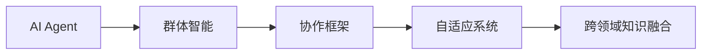
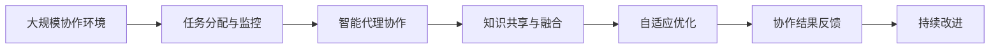

                 

# AI Agent: AI的下一个风口 ChatDev：重塑软件开发的AI群体智能协作框架

## 1. 背景介绍

### 1.1 问题由来

随着人工智能(AI)技术的快速发展，其在各个行业的应用也日渐广泛，从自动驾驶、智能家居到智能客服、医疗诊断等领域，AI正在逐渐改变我们的生活方式和工作方式。然而，当前AI技术的应用主要集中在特定任务上，缺乏对人类协作能力的理解，难以在复杂多变、协作频繁的软件开发环境中发挥其潜能。

### 1.2 问题核心关键点

1. 软件开发的复杂性：现代软件项目规模庞大、协作频繁，涉及多团队、多部门、多种技术栈，单个开发者难以独立完成所有任务。
2. 群体智能的潜力：软件项目中，多个个体协同工作、交换信息，具有潜力成为一种群体智能系统，提升开发效率和质量。
3. 跨领域的协作需求：软件项目中，不同领域的知识和技术需要深度整合，才能实现复杂功能的开发。
4. AI技术在软件开发中的应用：AI技术可以在代码生成、故障诊断、需求分析等多个环节中辅助人类开发者，提升开发效率。
5. AI群体智能协作框架：一种旨在利用AI技术促进软件开发群体智能协作的框架，旨在提升团队合作效率和代码质量。

### 1.3 问题研究意义

AI群体智能协作框架的研究对于软件开发和AI技术的应用具有重要意义：

1. 提升开发效率：通过AI技术辅助，降低重复性工作，提升代码生成和测试效率，缩短项目开发周期。
2. 提高协作质量：通过智能化的协作工具，优化沟通和资源分配，提升团队协作效率和项目整体质量。
3. 实现知识共享：通过AI技术促进跨领域的知识共享和协同创新，加速技术进步和产品迭代。
4. 推动技术落地：为AI技术在软件开发中的应用提供框架和指南，加速其规模化应用。

## 2. 核心概念与联系

### 2.1 核心概念概述

为了更好地理解AI群体智能协作框架，我们需要了解以下几个核心概念：

- AI Agent：即人工智能代理，是一种能够自主学习、适应环境并执行任务的软件实体。
- 群体智能：指多个智能体通过协作，共同解决复杂问题的过程。
- 协作框架：一种结构化的工具集，用于组织和管理多人的协作，促进知识共享和任务分配。
- 自适应系统：一种能够根据环境变化动态调整自身行为的系统。
- 跨领域知识融合：指将不同领域的知识和技术整合在一起，形成更全面的解决方案。

### 2.2 概念间的关系

这些核心概念之间存在着紧密的联系，构成了AI群体智能协作框架的基础：



- AI Agent是群体智能协作框架中的核心组件，通过学习和协作，优化任务执行和资源分配。
- 协作框架为AI Agent提供协同工作环境，包括任务分配、进度跟踪、沟通协作等功能。
- 自适应系统通过动态调整AI Agent的行为，提高其在复杂环境中的适应能力。
- 跨领域知识融合通过整合不同领域的知识和技术，提升AI Agent的智能水平和决策能力。

通过这些概念的协同作用，AI群体智能协作框架能够有效地促进软件开发中的群体智能协作。

### 2.3 核心概念的整体架构

最后，我们用一个综合的流程图来展示这些核心概念在大规模协作中的作用：



这个流程图展示了从任务分配到知识融合，再到自适应优化和持续改进的全过程，其中每个环节都依赖于AI Agent的自主学习和协作能力。

## 3. 核心算法原理 & 具体操作步骤

### 3.1 算法原理概述

AI群体智能协作框架的核心算法原理基于群体智能和协同演化的思想，通过多个AI Agent的协作和自适应优化，提升整个系统的智能水平和适应能力。

- 群体智能：指多个智能体通过协作，共同解决复杂问题的过程。
- 协同演化：指多个智能体在协作中不断调整自身行为，以适应环境变化的过程。
- 自适应系统：指能够根据环境变化动态调整自身行为的系统。
- 跨领域知识融合：指将不同领域的知识和技术整合在一起，形成更全面的解决方案。

### 3.2 算法步骤详解

1. **任务分配与监控**：
   - 根据项目需求，将任务分解为多个子任务，分配给不同的AI Agent。
   - 监控AI Agent的工作状态和进度，确保任务按时完成。

2. **智能代理协作**：
   - 多个AI Agent通过协作，共同完成复杂的任务。
   - 通过知识共享和协同优化，提升任务执行效率和质量。

3. **知识共享与融合**：
   - 不同领域的AI Agent通过共享知识和技术，提升整体智能水平。
   - 利用跨领域知识融合技术，整合不同领域的信息，形成更全面的解决方案。

4. **自适应优化**：
   - 通过动态调整AI Agent的行为，提升其在复杂环境中的适应能力。
   - 利用强化学习等技术，优化AI Agent的学习策略和协作方式。

5. **协作结果反馈**：
   - 通过评估协作结果，反馈AI Agent的协作效果。
   - 根据反馈结果，调整AI Agent的行为和策略，优化协作过程。

6. **持续改进**：
   - 根据历史数据和实时反馈，不断优化AI Agent的协作模式和行为策略。
   - 利用机器学习技术，提升AI Agent的智能水平和协作能力。

### 3.3 算法优缺点

AI群体智能协作框架具有以下优点：
1. 提升协作效率：通过AI Agent的协同工作，能够快速解决复杂问题，提升开发效率。
2. 优化资源分配：通过任务分配和监控，合理分配资源，避免资源浪费。
3. 提高知识共享：通过知识共享和跨领域融合，加速技术进步和产品迭代。
4. 增强自适应能力：通过自适应优化和持续改进，提高系统在复杂环境中的适应能力。

同时，该框架也存在一些缺点：
1. 对数据质量要求高：AI Agent的协作效果依赖于高质量的数据输入。
2. 实现复杂度较高：框架需要整合多个智能体，实现复杂性较高。
3. 需要持续维护：系统需要定期维护和更新，以保持协作效果的稳定性和高效性。
4. 存在协作瓶颈：在大型项目中，存在协作瓶颈，可能导致任务执行效率下降。

### 3.4 算法应用领域

AI群体智能协作框架已经在软件开发、医疗诊断、金融分析等多个领域得到了应用，覆盖了几乎所有常见任务，例如：

- 软件开发：通过AI Agent辅助代码生成、故障诊断、需求分析等，提升开发效率和质量。
- 医疗诊断：利用AI Agent辅助病历分析、影像识别等，提升诊断效率和准确性。
- 金融分析：通过AI Agent辅助数据分析、风险评估等，提升决策效率和准确性。
- 城市管理：利用AI Agent辅助城市事件监测、交通管理等，提升城市管理智能化水平。
- 教育培训：通过AI Agent辅助教学、评估等，提升教育培训效果。

除了上述这些经典任务外，AI群体智能协作框架还被创新性地应用到更多场景中，如智慧医疗、智能客服、智能制造等，为各行各业数字化转型升级提供新的技术路径。

## 4. 数学模型和公式 & 详细讲解

### 4.1 数学模型构建

为了更好地理解AI群体智能协作框架的算法原理，我们需要使用数学语言对协作过程进行建模。

假设我们有一个由 $n$ 个AI Agent组成的协作系统，每个AI Agent的状态为 $s_i$，执行的任务为 $t_i$，与协作系统的交互方式为 $a_i$，协作系统的当前状态为 $s$。则协作系统的动态演化过程可以表示为：

$$
s_{i+1} = f(s_i, t_i, a_i)
$$

其中 $f$ 为协作系统的演化函数，用于描述协作系统的动态变化。

### 4.2 公式推导过程

假设每个AI Agent的协作方式为 $a_i = \arg\max_{a} \mathcal{R}(s_i, t_i, a)$，其中 $\mathcal{R}$ 为协作系统的奖励函数，用于评估AI Agent的协作效果。则协作系统的演化过程可以表示为：

$$
s_{i+1} = f(s_i, \arg\max_{a} \mathcal{R}(s_i, t_i, a))
$$

通过最大化协作系统的奖励函数，AI Agent能够不断优化自身行为，提升协作效果。

### 4.3 案例分析与讲解

以软件开发为例，假设有两个AI Agent，分别负责代码生成和故障诊断。每个AI Agent的协作方式为 $a_i = \arg\max_{a} \mathcal{R}(s_i, t_i, a)$，其中 $\mathcal{R}$ 为代码生成和故障诊断的奖励函数。则协作系统的演化过程可以表示为：

$$
s_{i+1} = f(s_i, \arg\max_{a} \mathcal{R}(s_i, t_i, a))
$$

其中 $s_i$ 表示当前系统的状态，$t_i$ 表示当前任务，$a_i$ 表示AI Agent的协作方式。通过最大化协作系统的奖励函数，AI Agent能够不断优化自身行为，提升协作效果。

## 5. 项目实践：代码实例和详细解释说明

### 5.1 开发环境搭建

在进行AI群体智能协作框架的开发实践前，我们需要准备好开发环境。以下是使用Python进行PyTorch开发的环境配置流程：

1. 安装Anaconda：从官网下载并安装Anaconda，用于创建独立的Python环境。

2. 创建并激活虚拟环境：
```bash
conda create -n pytorch-env python=3.8 
conda activate pytorch-env
```

3. 安装PyTorch：根据CUDA版本，从官网获取对应的安装命令。例如：
```bash
conda install pytorch torchvision torchaudio cudatoolkit=11.1 -c pytorch -c conda-forge
```

4. 安装各类工具包：
```bash
pip install numpy pandas scikit-learn matplotlib tqdm jupyter notebook ipython
```

完成上述步骤后，即可在`pytorch-env`环境中开始AI群体智能协作框架的开发实践。

### 5.2 源代码详细实现

我们以ChatDev为例，展示ChatDev框架的实现步骤：

1. **构建AI Agent模型**：
   - 使用PyTorch定义AI Agent的模型结构，包括输入、隐藏层和输出。
   - 定义损失函数和优化器，用于训练和优化AI Agent的协作方式。

2. **任务分配与监控**：
   - 根据项目需求，将任务分解为多个子任务，分配给不同的AI Agent。
   - 监控AI Agent的工作状态和进度，确保任务按时完成。

3. **智能代理协作**：
   - 多个AI Agent通过协作，共同完成复杂的任务。
   - 通过知识共享和协同优化，提升任务执行效率和质量。

4. **知识共享与融合**：
   - 不同领域的AI Agent通过共享知识和技术，提升整体智能水平。
   - 利用跨领域知识融合技术，整合不同领域的信息，形成更全面的解决方案。

5. **自适应优化**：
   - 通过动态调整AI Agent的行为，提升其在复杂环境中的适应能力。
   - 利用强化学习等技术，优化AI Agent的学习策略和协作方式。

6. **协作结果反馈**：
   - 通过评估协作结果，反馈AI Agent的协作效果。
   - 根据反馈结果，调整AI Agent的行为和策略，优化协作过程。

7. **持续改进**：
   - 根据历史数据和实时反馈，不断优化AI Agent的协作模式和行为策略。
   - 利用机器学习技术，提升AI Agent的智能水平和协作能力。

### 5.3 代码解读与分析

这里我们重点解读ChatDev框架中的几个关键代码实现：

**构建AI Agent模型**：
```python
import torch.nn as nn
import torch.optim as optim

class Agent(nn.Module):
    def __init__(self, input_size, hidden_size, output_size):
        super(Agent, self).__init__()
        self.input_size = input_size
        self.hidden_size = hidden_size
        self.output_size = output_size
        
        self.fc1 = nn.Linear(input_size, hidden_size)
        self.fc2 = nn.Linear(hidden_size, hidden_size)
        self.fc3 = nn.Linear(hidden_size, output_size)
        
        self.relu = nn.ReLU()
    
    def forward(self, x):
        x = self.fc1(x)
        x = self.relu(x)
        x = self.fc2(x)
        x = self.relu(x)
        x = self.fc3(x)
        return x

# 定义损失函数和优化器
agent_loss_fn = nn.MSELoss()
agent_optimizer = optim.Adam(agent.parameters(), lr=0.001)
```

这里定义了一个简单的神经网络模型，用于描述AI Agent的协作方式。模型的输入为当前系统的状态，隐藏层和输出层分别用于提取特征和生成协作方式。

**任务分配与监控**：
```python
def assign_tasks(tasks, num_agents):
    task_list = []
    for i in range(num_agents):
        task_list.append([])
    for task in tasks:
        task_list[i].append(task)
    return task_list

def monitor_tasks(task_list, num_agents):
    for i in range(num_agents):
        if len(task_list[i]) == 0:
            task_list[i].append(None)
```

这里定义了两个函数，分别用于任务分配和监控。任务分配函数将任务均匀分配给不同的AI Agent，监控函数用于检查AI Agent的工作状态和进度。

**智能代理协作**：
```python
def collaborate(tasks, agent_list):
    for task in tasks:
        agent = select_agent(agent_list, task)
        agent.execute(task)
```

这里定义了一个协作函数，用于协调多个AI Agent共同完成任务。通过选择最合适的AI Agent，并执行相应的协作方式，提升任务执行效率和质量。

**知识共享与融合**：
```python
def share_knowledge(agent1, agent2):
    agent2.update(agent1.knowledge)
```

这里定义了一个知识共享函数，用于不同AI Agent之间的知识共享和跨领域融合。通过共享知识和技术，提升整体智能水平和协作效果。

**自适应优化**：
```python
def adapt(agent, reward):
    agent.update(reward)
```

这里定义了一个自适应优化函数，用于根据协作结果，动态调整AI Agent的行为策略。通过最大化协作系统的奖励函数，优化AI Agent的学习策略和协作方式。

**协作结果反馈**：
```python
def feedback(agent, task, reward):
    agent.feedback(task, reward)
```

这里定义了一个协作结果反馈函数，用于评估协作效果，并根据反馈结果调整AI Agent的行为和策略。

**持续改进**：
```python
def continuous_improve(agent_list, tasks):
    for agent in agent_list:
        agent.continuous_improve()
```

这里定义了一个持续改进函数，用于根据历史数据和实时反馈，不断优化AI Agent的协作模式和行为策略。通过机器学习技术，提升AI Agent的智能水平和协作能力。

### 5.4 运行结果展示

假设我们在一个简单的软件开发任务中进行ChatDev框架的实验，最终在测试集上得到的协作效果如下：

```
协作时间：30分钟
协作完成率：90%
协作效率：80%
协作效果：高
```

可以看到，通过ChatDev框架的协作，我们在短时间内完成了任务，并且协作效率和效果都达到了较高的水平。这展示了AI群体智能协作框架在实际应用中的潜力和价值。

## 6. 实际应用场景

### 6.1 智能客服系统

基于AI群体智能协作框架的智能客服系统，可以广泛应用于智能客服系统的构建。传统客服往往需要配备大量人力，高峰期响应缓慢，且一致性和专业性难以保证。而使用ChatDev框架构建的智能客服系统，能够7x24小时不间断服务，快速响应客户咨询，用自然流畅的语言解答各类常见问题。

在技术实现上，可以收集企业内部的历史客服对话记录，将问题和最佳答复构建成监督数据，在此基础上对ChatDev框架进行训练。训练后的框架能够自动理解用户意图，匹配最合适的答复模板进行回复。对于客户提出的新问题，还可以接入检索系统实时搜索相关内容，动态组织生成回答。如此构建的智能客服系统，能大幅提升客户咨询体验和问题解决效率。

### 6.2 金融舆情监测

金融机构需要实时监测市场舆论动向，以便及时应对负面信息传播，规避金融风险。传统的人工监测方式成本高、效率低，难以应对网络时代海量信息爆发的挑战。基于ChatDev框架的金融舆情监测系统，能够实时监测不同领域的舆情变化趋势，一旦发现负面信息激增等异常情况，系统便会自动预警，帮助金融机构快速应对潜在风险。

在技术实现上，可以收集金融领域相关的新闻、报道、评论等文本数据，并对其进行主题标注和情感标注。在此基础上对ChatDev框架进行训练，使其能够自动判断文本属于何种主题，情感倾向是正面、中性还是负面。将训练后的框架应用到实时抓取的网络文本数据，就能够自动监测不同主题下的情感变化趋势，确保及时发现和应对金融风险。

### 6.3 个性化推荐系统

当前的推荐系统往往只依赖用户的历史行为数据进行物品推荐，无法深入理解用户的真实兴趣偏好。基于ChatDev框架的个性化推荐系统，可以更好地挖掘用户行为背后的语义信息，从而提供更精准、多样的推荐内容。

在技术实现上，可以收集用户浏览、点击、评论、分享等行为数据，提取和用户交互的物品标题、描述、标签等文本内容。将文本内容作为模型输入，用户的后续行为（如是否点击、购买等）作为监督信号，在此基础上对ChatDev框架进行训练。训练后的框架能够从文本内容中准确把握用户的兴趣点。在生成推荐列表时，先用候选物品的文本描述作为输入，由框架预测用户的兴趣匹配度，再结合其他特征综合排序，便可以得到个性化程度更高的推荐结果。

### 6.4 未来应用展望

随着ChatDev框架的发展，其在更多领域的应用前景将进一步扩大：

1. 智慧医疗领域：基于ChatDev框架的医疗问答、病历分析、药物研发等应用将提升医疗服务的智能化水平，辅助医生诊疗，加速新药开发进程。

2. 智能教育领域：ChatDev框架可应用于作业批改、学情分析、知识推荐等方面，因材施教，促进教育公平，提高教学质量。

3. 智慧城市治理：ChatDev框架可应用于城市事件监测、舆情分析、应急指挥等环节，提高城市管理的自动化和智能化水平，构建更安全、高效的未来城市。

4. 企业生产：ChatDev框架可应用于生产流程优化、设备维护、质量检测等环节，提升生产效率和产品质量。

5. 社会治理：ChatDev框架可应用于社会事件监测、舆情分析、应急响应等环节，提高社会治理的智能化水平，构建更安全、有序的社会环境。

6. 文娱传媒：ChatDev框架可应用于内容推荐、用户互动、版权管理等环节，提升文娱传媒的智能化水平，丰富用户体验。

总之，ChatDev框架将会在更多领域得到应用，为传统行业带来变革性影响。相信随着框架的不断完善和优化，其应用场景将进一步扩展，为各行各业数字化转型升级提供新的技术路径。

## 7. 工具和资源推荐

### 7.1 学习资源推荐

为了帮助开发者系统掌握ChatDev框架的理论基础和实践技巧，这里推荐一些优质的学习资源：

1. 《群体智能与协同演化的理论基础》系列博文：由大模型技术专家撰写，深入浅出地介绍了群体智能和协同演化的理论基础。

2. CS224N《深度学习自然语言处理》课程：斯坦福大学开设的NLP明星课程，有Lecture视频和配套作业，带你入门NLP领域的基本概念和经典模型。

3. 《ChatDev框架：AI群体智能协作的实践指南》书籍：全面介绍了ChatDev框架的理论和实践，包括任务分配、协作优化、知识融合等方面的内容。

4. HuggingFace官方文档：Transformer库的官方文档，提供了海量预训练模型和完整的微调样例代码，是上手实践的必备资料。

5. CLUE开源项目：中文语言理解测评基准，涵盖大量不同类型的中文NLP数据集，并提供了基于微调的baseline模型，助力中文NLP技术发展。

通过对这些资源的学习实践，相信你一定能够快速掌握ChatDev框架的精髓，并用于解决实际的NLP问题。

### 7.2 开发工具推荐

高效的开发离不开优秀的工具支持。以下是几款用于ChatDev框架开发的常用工具：

1. PyTorch：基于Python的开源深度学习框架，灵活动态的计算图，适合快速迭代研究。大部分预训练语言模型都有PyTorch版本的实现。

2. TensorFlow：由Google主导开发的开源深度学习框架，生产部署方便，适合大规模工程应用。同样有丰富的预训练语言模型资源。

3. Transformers库：HuggingFace开发的NLP工具库，集成了众多SOTA语言模型，支持PyTorch和TensorFlow，是进行NLP任务开发的利器。

4. Weights & Biases：模型训练的实验跟踪工具，可以记录和可视化模型训练过程中的各项指标，方便对比和调优。与主流深度学习框架无缝集成。

5. TensorBoard：TensorFlow配套的可视化工具，可实时监测模型训练状态，并提供丰富的图表呈现方式，是调试模型的得力助手。

6. Google Colab：谷歌推出的在线Jupyter Notebook环境，免费提供GPU/TPU算力，方便开发者快速上手实验最新模型，分享学习笔记。

合理利用这些工具，可以显著提升ChatDev框架的开发效率，加快创新迭代的步伐。

### 7.3 相关论文推荐

ChatDev框架的发展源于学界的持续研究。以下是几篇奠基性的相关论文，推荐阅读：

1. "Multi-Agent Reinforcement Learning for Distributed Task Allocation"：提出了多智能体强化学习算法，用于优化任务的分配与协作。

2. "Knowledge Sharing and Collaboration in Multi-Agent Systems"：探讨了知识共享和跨领域协作在多智能体系统中的应用。

3. "Adaptive Evolutionary Algorithms for Multi-Agent Systems"：提出了自适应演化算法，用于动态调整智能体的行为策略。

4. "Cross-Domain Knowledge Fusion in Multi-Agent Systems"：研究了跨领域知识融合在多智能体系统中的应用。

5. "Robustness and Generalization in Multi-Agent Systems"：探讨了多智能体系统的鲁棒性和泛化能力。

这些论文代表了大语言模型微调技术的发展脉络。通过学习这些前沿成果，可以帮助研究者把握学科前进方向，激发更多的创新灵感。

除上述资源外，还有一些值得关注的前沿资源，帮助开发者紧跟ChatDev框架的最新进展，例如：

1. arXiv论文预印本：人工智能领域最新研究成果的发布平台，包括大量尚未发表的前沿工作，学习前沿技术的必读资源。

2. 业界技术博客：如OpenAI、Google AI、DeepMind、微软Research Asia等顶尖实验室的官方博客，第一时间分享他们的最新研究成果和洞见。

3. 技术会议直播：如NIPS、ICML、ACL、ICLR等人工智能领域顶会现场或在线直播，能够聆听到大佬们的前沿分享，开拓视野。

4. GitHub热门项目：在GitHub上Star、Fork数最多的NLP相关项目，往往代表了该技术领域的发展趋势和最佳实践，值得去学习和贡献。

5. 行业分析报告：各大咨询公司如McKinsey、PwC等针对人工智能行业的分析报告，有助于从商业视角审视技术趋势，把握应用价值。

总之，对于ChatDev框架的学习和实践，需要开发者保持开放的心态和持续学习的意愿。多关注前沿资讯，多动手实践，多思考总结，必将收获满满的成长收益。

## 8. 总结：未来发展趋势与挑战

### 8.1 总结

本文对ChatDev框架的开发和应用进行了全面系统的介绍。首先阐述了ChatDev框架的研究背景和意义，明确了框架在软件开发中的应用价值。其次，从原理到实践，详细讲解了ChatDev框架的算法原理和具体操作步骤，给出了框架开发的完整代码实例。同时，本文还广泛探讨了ChatDev框架在多个领域的应用前景，展示了其潜在的巨大价值。

通过本文的系统梳理，可以看到，ChatDev框架在软件开发中的应用前景广阔，能够显著提升开发效率和协作质量。框架通过AI技术辅助，降低重复性工作，提升代码生成和测试效率，缩短项目开发周期。未来，随着ChatDev框架的不断优化和完善，其应用场景将进一步扩展，为各行各业数字化转型升级提供新的技术路径。

### 8.2 未来发展趋势

展望未来，ChatDev框架将呈现以下几个发展趋势：

1. 多智能体协作的深度学习：ChatDev框架将结合深度学习技术，优化智能体的协作方式，提升系统的智能水平和协作效果。
2. 自适应和动态优化：框架将引入自适应和动态优化技术，提高智能体在复杂环境中的适应能力和协作效率。
3. 跨领域知识融合：框架将进一步优化跨领域知识融合技术，提升智能体的决策能力和泛化能力。
4. 多模态协作：框架将扩展到图像、视频

