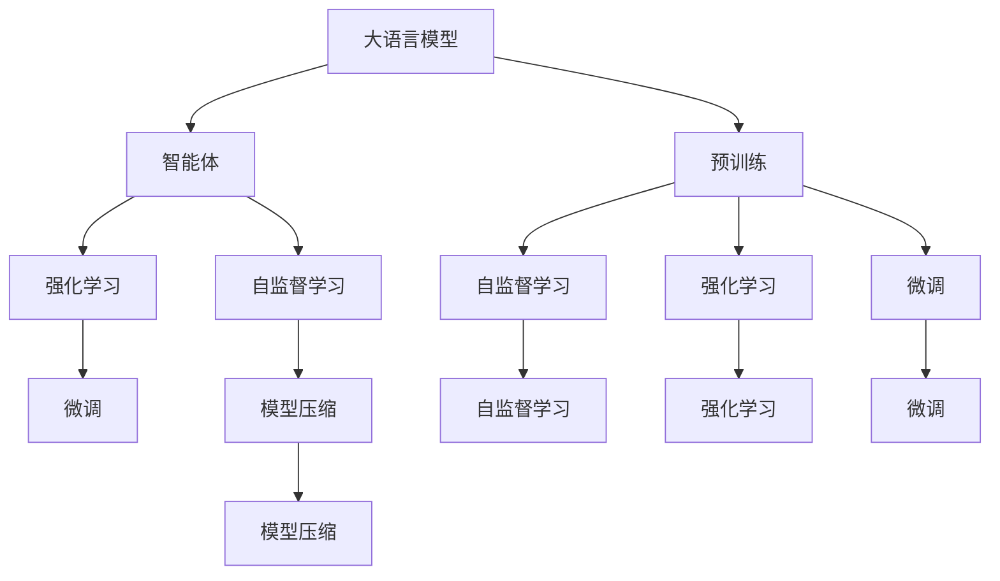
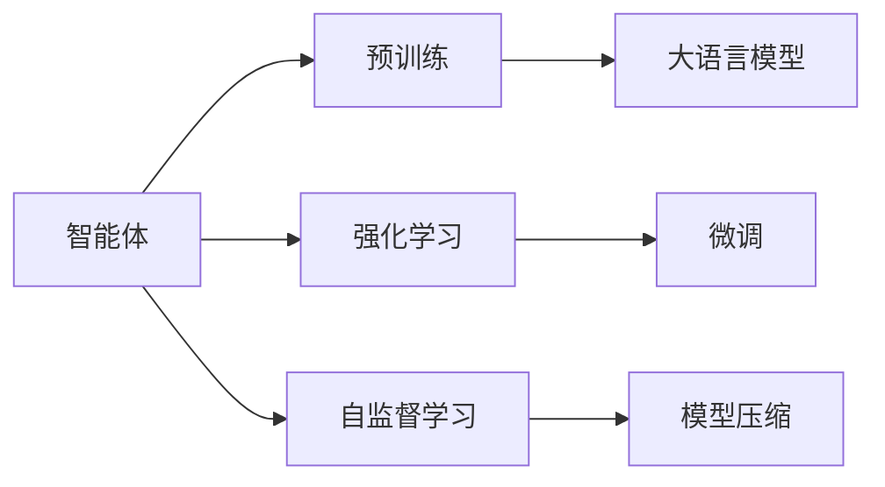
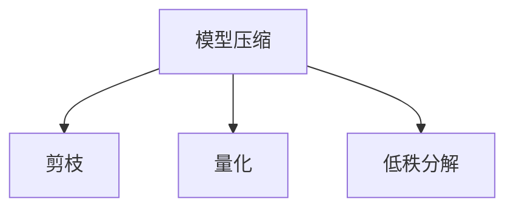
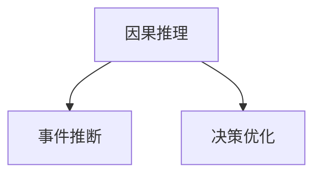
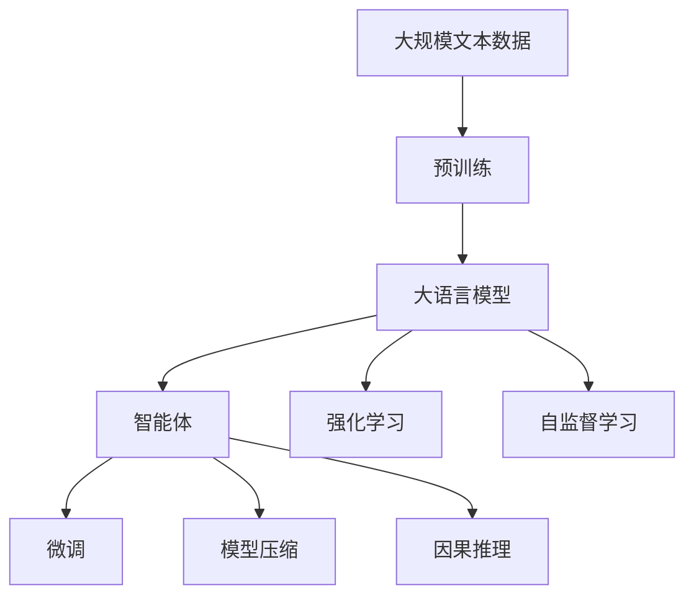

                 

# AI Agent: AI的下一个风口 大模型驱动的智能体

> 关键词：大语言模型, 智能体(Agent), 强化学习, 自监督学习, 预训练, 自然语言处理(NLP), 模型压缩, 微调, 因果推理

## 1. 背景介绍

### 1.1 问题由来
随着深度学习技术的迅猛发展，人工智能(AI)正从规则驱动向数据驱动、智能体驱动的阶段迈进。在传统的基于规则的AI系统中，专家需要花费大量精力编写规则，限制了AI系统的应用范围和效果。而智能体驱动的AI系统则更加注重数据和算法的融合，通过数据训练提升AI的自主决策能力。

AI智能体已经在多个领域取得了显著成效。例如，智能推荐系统、自动驾驶汽车、机器人、个性化教育、智慧城市等。未来，随着深度学习技术的进一步成熟，AI智能体将更广泛地应用于各行各业，驱动AI技术的全面发展。

### 1.2 问题核心关键点
AI智能体主要包括两种范式：强化学习(RL)和自监督学习(SSL)。强化学习通过与环境交互学习最优策略，自监督学习则通过无监督预训练学习模型表示。其中，基于大语言模型的智能体范式兼具两者的优点，能够自动学习语言表示，并能够通过少量标注数据进行微调，提升对特定任务的理解。

智能体的核心目标是通过学习获得更优的决策策略，在实际环境中表现优异。其关键在于如何构建一个能够有效学习、决策和适应环境变化的智能体。

### 1.3 问题研究意义
研究大模型驱动的智能体，对于拓展AI技术的边界，提升AI系统的自主决策能力，加速AI技术的产业化进程，具有重要意义：

1. 降低应用开发成本。智能体能够自主学习优化策略，显著减少从头开发所需的数据、计算和人力等成本投入。
2. 提升决策效果。智能体通过学习最优策略，能够获得更优的决策效果，提高系统的智能水平。
3. 加速开发进度。standing on the shoulders of giants，智能体能够快速适应任务需求，缩短开发周期。
4. 带来技术创新。智能体驱动的AI系统为专家智能体推理机制和交互方式的研究提供新的方向。
5. 赋能产业升级。智能体技术更容易被各行各业所采用，为传统行业数字化转型升级提供新的技术路径。

## 2. 核心概念与联系

### 2.1 核心概念概述

为更好地理解基于大模型驱动的智能体方法，本节将介绍几个密切相关的核心概念：

- 大语言模型(Large Language Model, LLM)：以自回归(如GPT)或自编码(如BERT)模型为代表的大规模预训练语言模型。通过在大规模无标签文本语料上进行预训练，学习通用的语言知识和表示。

- 智能体(Agent)：能够在复杂环境中自主学习、决策和适应环境的自主智能系统。智能体可以是虚拟的或物理的，能够在多个领域应用，如机器人、自动驾驶、游戏等。

- 强化学习(Reinforcement Learning, RL)：通过与环境交互学习最优策略的过程。智能体根据环境反馈调整策略，最大化长期奖励。

- 自监督学习(Self-supervised Learning, SSL)：通过无监督数据学习模型表示的过程。自监督学习能够自动发现数据中的有用信息，无需人工标注。

- 预训练(Pre-training)：指在大规模无标签文本语料上，通过自监督学习任务训练通用语言模型的过程。常见的预训练任务包括言语建模、遮挡语言模型等。

- 微调(Fine-tuning)：指在预训练模型的基础上，使用下游任务的少量标注数据，通过有监督地训练优化模型在该任务上的性能。通常只需要调整顶层分类器或解码器，并以较小的学习率更新全部或部分的模型参数。

- 模型压缩(Model Compression)：指在保证模型性能的前提下，通过模型剪枝、量化、低秩分解等方法减少模型参数和计算资源消耗。

- 因果推理(Causal Reasoning)：指通过逻辑推断和因果分析，理解事件间的因果关系，做出合理决策的过程。

这些核心概念之间的逻辑关系可以通过以下Mermaid流程图来展示：



这个流程图展示了大模型驱动的智能体的核心概念及其之间的关系：

1. 大语言模型通过预训练获得基础能力。
2. 智能体基于大语言模型的表示，通过强化学习和自监督学习不断优化策略。
3. 微调用于在特定任务上提升智能体的性能。
4. 模型压缩优化智能体的资源消耗。
5. 因果推理用于理解和优化智能体的决策过程。

这些核心概念共同构成了大模型驱动的智能体的学习和应用框架，使其能够在各种场景下发挥强大的自主学习、决策和适应能力。通过理解这些核心概念，我们可以更好地把握大模型驱动的智能体的工作原理和优化方向。

### 2.2 概念间的关系

这些核心概念之间存在着紧密的联系，形成了大模型驱动的智能体的完整生态系统。下面我通过几个Mermaid流程图来展示这些概念之间的关系。

#### 2.2.1 智能体的学习范式



这个流程图展示了智能体的学习范式，包括预训练、强化学习和自监督学习等。智能体通过预训练获得基础表示，然后通过强化学习不断优化策略，并使用自监督学习提高模型泛化能力。

#### 2.2.2 预训练-微调的关系


这个流程图展示了预训练和微调之间的关系。预训练使得智能体能够自动学习通用的语言表示，而微调则用于在特定任务上提升智能体的性能。

#### 2.2.3 模型压缩方法



这个流程图展示了模型压缩的主要方法，包括剪枝、量化和低秩分解等。这些方法用于减少模型的参数量和计算资源消耗，优化智能体的资源利用率。

#### 2.2.4 因果推理的应用



这个流程图展示了因果推理在智能体中的应用。因果推理用于理解事件间的因果关系，帮助智能体做出更合理的决策。

### 2.3 核心概念的整体架构

最后，我们用一个综合的流程图来展示这些核心概念在大模型驱动的智能体微调过程中的整体架构：



这个综合流程图展示了从预训练到智能体微调，再到因果推理的整体过程。大语言模型首先在大规模文本数据上进行预训练，然后通过强化学习和自监督学习不断优化智能体策略。最后，使用微调进一步提升智能体在特定任务上的性能，并进行模型压缩优化资源消耗，同时利用因果推理优化决策过程。

通过这些流程图，我们可以更清晰地理解大模型驱动的智能体微调过程中各个核心概念的关系和作用，为后续深入讨论具体的微调方法和技术奠定基础。

## 3. 核心算法原理 & 具体操作步骤
### 3.1 算法原理概述

基于大模型的智能体微调，本质上是一个通过有监督学习提升模型策略的过程。其核心思想是：将预训练的大模型视作一个强大的"特征提取器"，通过下游任务的少量标注数据进行微调，使得智能体学习到针对特定任务的最优策略。

形式化地，假设预训练智能体的策略表示为 $f_{\theta}(s)$，其中 $s$ 为环境状态，$\theta$ 为预训练得到的策略参数。给定下游任务 $T$ 的标注数据集 $D=\{(s_i,a_i)\}_{i=1}^N$，智能体的优化目标是最小化策略在标注数据上的误差，即：

$$
\theta^* = \mathop{\arg\min}_{\theta} \mathcal{L}(f_{\theta},D)
$$

其中 $\mathcal{L}$ 为针对任务 $T$ 设计的损失函数，用于衡量智能体策略与标注数据的匹配程度。常见的损失函数包括交叉熵损失、政策梯度损失等。

通过梯度下降等优化算法，智能体不断更新策略参数 $\theta$，最小化损失函数 $\mathcal{L}$，使得智能体策略 $f_{\theta}(s)$ 与标注数据匹配。由于 $\theta$ 已经通过预训练获得了较好的初始化，因此即便在小规模数据集 $D$ 上进行微调，也能较快收敛到理想的策略参数 $\theta^*$。

### 3.2 算法步骤详解

基于大模型的智能体微调一般包括以下几个关键步骤：

**Step 1: 准备预训练模型和数据集**
- 选择合适的预训练智能体模型 $f_{\theta}$ 作为初始化策略，如BERT、GPT等。
- 准备下游任务 $T$ 的标注数据集 $D$，划分为训练集、验证集和测试集。一般要求标注数据与预训练数据的分布不要差异过大。

**Step 2: 设计任务策略**
- 根据任务类型，设计合适的策略输出，如分类任务、序列生成任务等。
- 对于分类任务，策略通常为输出每个状态对应的行动概率分布。
- 对于序列生成任务，策略通常为输出下一个状态的行动概率分布。

**Step 3: 设置微调超参数**
- 选择合适的优化算法及其参数，如 AdamW、SGD 等，设置学习率、批大小、迭代轮数等。
- 设置正则化技术及强度，包括权重衰减、Dropout、Early Stopping 等。
- 确定冻结预训练参数的策略，如仅微调顶层，或全部参数都参与微调。

**Step 4: 执行梯度训练**
- 将训练集数据分批次输入智能体，前向传播计算损失函数。
- 反向传播计算策略梯度，根据设定的优化算法和学习率更新策略参数。
- 周期性在验证集上评估智能体性能，根据性能指标决定是否触发 Early Stopping。
- 重复上述步骤直到满足预设的迭代轮数或 Early Stopping 条件。

**Step 5: 测试和部署**
- 在测试集上评估微调后策略 $f_{\hat{\theta}}$ 的性能，对比微调前后的效果提升。
- 使用微调后的策略对新样本进行推理预测，集成到实际的应用系统中。
- 持续收集新的数据，定期重新微调策略，以适应数据分布的变化。

以上是基于大模型的智能体微调的一般流程。在实际应用中，还需要针对具体任务的特点，对微调过程的各个环节进行优化设计，如改进训练目标函数，引入更多的正则化技术，搜索最优的超参数组合等，以进一步提升智能体性能。

### 3.3 算法优缺点

基于大模型的智能体微调方法具有以下优点：
1. 简单高效。只需准备少量标注数据，即可对预训练模型进行快速适配，获得较大的性能提升。
2. 通用适用。适用于各种NLP下游任务，包括分类、匹配、生成等，设计简单的任务策略即可实现微调。
3. 参数高效。利用参数高效微调技术，在固定大部分预训练参数的情况下，仍可取得不错的提升。
4. 效果显著。在学术界和工业界的诸多任务上，基于微调的方法已经刷新了最先进的性能指标。

同时，该方法也存在一定的局限性：
1. 依赖标注数据。智能体微调的效果很大程度上取决于标注数据的质量和数量，获取高质量标注数据的成本较高。
2. 迁移能力有限。当目标任务与预训练数据的分布差异较大时，智能体的微调性能提升有限。
3. 负面效果传递。预训练模型的固有偏见、有害信息等，可能通过微调传递到下游任务，造成负面影响。
4. 可解释性不足。智能体微调模型的决策过程通常缺乏可解释性，难以对其推理逻辑进行分析和调试。

尽管存在这些局限性，但就目前而言，基于大模型的智能体微调方法仍然是大规模语言模型应用的主流范式。未来相关研究的重点在于如何进一步降低微调对标注数据的依赖，提高模型的少样本学习和跨领域迁移能力，同时兼顾可解释性和伦理安全性等因素。

### 3.4 算法应用领域

基于大模型的智能体微调方法在NLP领域已经得到了广泛的应用，覆盖了几乎所有常见任务，例如：

- 文本分类：如情感分析、主题分类、意图识别等。通过微调使策略学习文本-标签映射。
- 命名实体识别：识别文本中的人名、地名、机构名等特定实体。通过微调使策略掌握实体边界和类型。
- 关系抽取：从文本中抽取实体之间的语义关系。通过微调使策略学习实体-关系三元组。
- 问答系统：对自然语言问题给出答案。将问题-答案对作为微调数据，训练策略学习匹配答案。
- 机器翻译：将源语言文本翻译成目标语言。通过微调使策略学习语言-语言映射。
- 文本摘要：将长文本压缩成简短摘要。将文章-摘要对作为微调数据，使策略学习抓取要点。
- 对话系统：使机器能够与人自然对话。将多轮对话历史作为上下文，微调策略进行回复生成。

除了上述这些经典任务外，大模型智能体微调也被创新性地应用到更多场景中，如可控文本生成、常识推理、代码生成、数据增强等，为NLP技术带来了全新的突破。随着预训练模型和微调方法的不断进步，相信NLP技术将在更广阔的应用领域大放异彩。

## 4. 数学模型和公式 & 详细讲解  
### 4.1 数学模型构建

本节将使用数学语言对基于大模型的智能体微调过程进行更加严格的刻画。

记预训练智能体的策略为 $f_{\theta}(s)$，其中 $\theta$ 为预训练得到的策略参数。假设微调任务的训练集为 $D=\{(s_i,a_i)\}_{i=1}^N, s_i \in \mathcal{S}$，$a_i \in \mathcal{A}$，$\mathcal{S}$ 为环境状态空间，$\mathcal{A}$ 为行动空间。

定义智能体 $f_{\theta}$ 在数据样本 $(s,a)$ 上的损失函数为 $\ell(f_{\theta}(s),a)$，则在数据集 $D$ 上的经验风险为：

$$
\mathcal{L}(\theta) = \frac{1}{N} \sum_{i=1}^N \ell(f_{\theta}(s_i),a_i)
$$

智能体的优化目标是最小化经验风险，即找到最优策略：

$$
\theta^* = \mathop{\arg\min}_{\theta} \mathcal{L}(\theta)
$$

在实践中，我们通常使用基于梯度的优化算法（如SGD、Adam等）来近似求解上述最优化问题。设 $\eta$ 为学习率，$\lambda$ 为正则化系数，则策略的更新公式为：

$$
\theta \leftarrow \theta - \eta \nabla_{\theta}\mathcal{L}(\theta) - \eta\lambda\theta
$$

其中 $\nabla_{\theta}\mathcal{L}(\theta)$ 为损失函数对策略参数 $\theta$ 的梯度，可通过反向传播算法高效计算。

### 4.2 公式推导过程

以下我们以二分类任务为例，推导交叉熵损失函数及其梯度的计算公式。

假设智能体策略 $f_{\theta}(s)$ 在状态 $s$ 上的行动概率分布为 $p(a|s) = f_{\theta}(s)$，真实行动 $a \in \{0,1\}$。则二分类交叉熵损失函数定义为：

$$
\ell(f_{\theta}(s),a) = -a\log f_{\theta}(s) - (1-a)\log (1-f_{\theta}(s))
$$

将其代入经验风险公式，得：

$$
\mathcal{L}(\theta) = -\frac{1}{N}\sum_{i=1}^N [a_i\log f_{\theta}(s_i)+(1-a_i)\log(1-f_{\theta}(s_i))]
$$

根据链式法则，损失函数对策略参数 $\theta$ 的梯度为：

$$
\frac{\partial \mathcal{L}(\theta)}{\partial \theta_k} = -\frac{1}{N}\sum_{i=1}^N \left(\frac{a_i}{f_{\theta}(s_i)}-\frac{1-a_i}{1-f_{\theta}(s_i)}\right) \frac{\partial f_{\theta}(s_i)}{\partial \theta_k}
$$

其中 $\frac{\partial f_{\theta}(s_i)}{\partial \theta_k}$ 可进一步递归展开，利用自动微分技术完成计算。

在得到损失函数的梯度后，即可带入策略更新公式，完成策略的迭代优化。重复上述过程直至收敛，最终得到适应下游任务的最优策略 $\theta^*$。

## 5. 项目实践：代码实例和详细解释说明
### 5.1 开发环境搭建

在进行智能体微调实践前，我们需要准备好开发环境。以下是使用Python进行PyTorch开发的环境配置流程：

1. 安装Anaconda：从官网下载并安装Anaconda，用于创建独立的Python环境。

2. 创建并激活虚拟环境：
```bash
conda create -n pytorch-env python=3.8 
conda activate pytorch-env
```

3. 安装PyTorch：根据CUDA版本，从官网获取对应的安装命令。例如：
```bash
conda install pytorch torchvision torchaudio cudatoolkit=11.1 -c pytorch -c conda-forge
```

4. 安装Transformers库：
```bash
pip install transformers
```

5. 安装各类工具包：
```bash
pip install numpy pandas scikit-learn matplotlib tqdm jupyter notebook ipython
```

完成上述步骤后，即可在`pytorch-env`环境中开始微调实践。

### 5.2 源代码详细实现

下面我以命名实体识别(NER)任务为例，给出使用Transformers库对BERT模型进行智能体微调的PyTorch代码实现。

首先，定义NER任务的数据处理函数：

```python
from transformers import BertTokenizer
from torch.utils.data import Dataset
import torch

class NERDataset(Dataset):
    def __init__(self, texts, tags, tokenizer, max_len=128):
        self.texts = texts
        self.tags = tags
        self.tokenizer = tokenizer
        self.max_len = max_len
        
    def __len__(self):
        return len(self.texts)
    
    def __getitem__(self, item):
        text = self.texts[item]
        tags = self.tags[item]
        
        encoding = self.tokenizer(text, return_tensors='pt', max_length=self.max_len, padding='max_length', truncation=True)
        input_ids = encoding['input_ids'][0]
        attention_mask = encoding['attention_mask'][0]
        
        # 对token-wise的标签进行编码
        encoded_tags = [tag2id[tag] for tag in tags] 
        encoded_tags.extend([tag2id['O']] * (self.max_len - len(encoded_tags)))
        labels = torch.tensor(encoded_tags, dtype=torch.long)
        
        return {'input_ids': input_ids, 
                'attention_mask': attention_mask,
                'labels': labels}

# 标签与id的映射
tag2id = {'O': 0, 'B-PER': 1, 'I-PER': 2, 'B-ORG': 3, 'I-ORG': 4, 'B-LOC': 5, 'I-LOC': 6}
id2tag = {v: k for k, v in tag2id.items()}

# 创建dataset
tokenizer = BertTokenizer.from_pretrained('bert-base-cased')

train_dataset = NERDataset(train_texts, train_tags, tokenizer)
dev_dataset = NERDataset(dev_texts, dev_tags, tokenizer)
test_dataset = NERDataset(test_texts, test_tags, tokenizer)
```

然后，定义策略模型和优化器：

```python
from transformers import BertForTokenClassification, AdamW

model = BertForTokenClassification.from_pretrained('bert-base-cased', num_labels=len(tag2id))

optimizer = AdamW(model.parameters(), lr=2e-5)
```

接着，定义训练和评估函数：

```python
from torch.utils.data import DataLoader
from tqdm import tqdm
from sklearn.metrics import classification_report

device = torch.device('cuda') if torch.cuda.is_available() else torch.device('cpu')
model.to(device)

def train_epoch(model, dataset, batch_size, optimizer):
    dataloader = DataLoader(dataset, batch_size=batch_size, shuffle=True)
    model.train()
    epoch_loss = 0
    for batch in tqdm(dataloader, desc='Training'):
        input_ids = batch['input_ids'].to(device)
        attention_mask = batch['attention_mask'].to(device)
        labels = batch['labels'].to(device)
        model.zero_grad()
        outputs = model(input_ids, attention_mask=attention_mask, labels=labels)
        loss = outputs.loss
        epoch_loss += loss.item()
        loss.backward()
        optimizer.step()
    return epoch_loss / len(dataloader)

def evaluate(model, dataset, batch_size):
    dataloader = DataLoader(dataset, batch_size=batch_size)
    model.eval()
    preds, labels = [], []
    with torch.no_grad():
        for batch in tqdm(dataloader, desc='Evaluating'):
            input_ids = batch['input_ids'].to(device)
            attention_mask = batch['attention_mask'].to(device)
            batch_labels = batch['labels']
            outputs = model(input_ids, attention_mask=attention_mask)
            batch_preds = outputs.logits.argmax(dim=2).to('cpu').tolist()
            batch_labels = batch_labels.to('cpu').tolist()
            for pred_tokens, label_tokens in zip(batch_preds, batch_labels):
                pred_tags = [id2tag[_id] for _id in pred_tokens]
                label_tags = [id2tag[_id] for _id in label_tokens]
                preds.append(pred_tags[:len(label_tags)])
                labels.append(label_tags)
                
    print(classification_report(labels, preds))
```

最后，启动训练流程并在测试集上评估：

```python
epochs = 5
batch_size = 16

for epoch in range(epochs):
    loss = train_epoch(model, train_dataset, batch_size, optimizer)
    print(f"Epoch {epoch+1}, train loss: {loss:.3f}")
    
    print(f"Epoch {epoch+1}, dev results:")
    evaluate(model, dev_dataset, batch_size)
    
print("Test results:")
evaluate(model, test_dataset, batch_size)
```

以上就是使用PyTorch对BERT进行命名实体识别任务智能体微调的完整代码实现。可以看到，得益于Transformers库的强大封装，我们可以用相对简洁的代码完成BERT模型的加载和微调。

### 5.3 代码解读与分析

让我们再详细解读一下关键代码的实现细节：

**NERDataset类**：
- `__init__`方法：初始化文本、标签、分词器等关键组件。
- `__len__`方法：返回数据集的样本数量。
- `__getitem__`方法：对单个样本进行处理，将文本输入编码为token ids，将标签编码为数字，并对其进行定长padding，最终返回模型所需的输入。

**tag2id和id2tag字典**：
- 定义了标签与数字id之间的映射关系，用于将token-wise的预测结果解码回真实的标签。

**训练和评估函数**：
- 使用PyTorch的DataLoader对数据集进行批次化加载，供模型训练和推理使用。
- 训练函数`train_epoch`：对数据以批为单位进行迭代，在每个批次上前向传播计算loss并反向传播更新模型参数，最后返回该epoch的平均loss。
- 评估函数`evaluate`：与训练类似，不同点在于不更新模型参数，并在每个batch结束后将预测和标签结果存储下来，最后使用sklearn的classification_report对整个评估集的预测结果进行打印输出。

**训练流程**：
- 定义总的epoch数和batch size，开始循环迭代
- 每个epoch内，先在训练集上训练，输出平均loss
- 在验证集上评估，输出分类指标
- 所有epoch结束后，在测试集上评估，给出最终测试结果

可以看到，PyTorch配合Transformers库使得BERT智能体微调的代码实现变得简洁高效。

