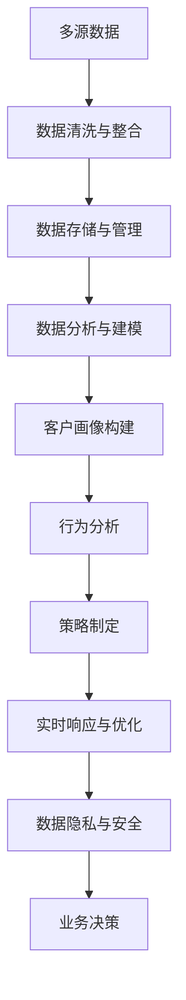

                 

# AI DMP 数据基建：如何利用数据提升营销效率

## 1. 背景介绍

随着数字经济的崛起，企业越来越依赖于大数据来驱动市场营销策略。数字营销人员需要全面了解消费者的在线行为、兴趣偏好、购买决策等，才能制定有效且精准的营销活动。人工智能（AI）驱动的客户数据平台（Customer Data Platform, DMP）是实现这一目标的关键工具，它利用数据驱动分析，提供深度洞察，提升营销效率。

### 1.1 问题由来

在数字化营销时代，传统的客户细分方法已不再适用。消费者行为日益个性化、动态化，需求也更加多样。如何从海量数据中提取有价值的洞察，并提供个性化、动态化的营销策略，是现代营销的核心挑战。AI DMP通过深度学习、自然语言处理（NLP）等技术，能够高效处理和分析用户数据，实时响应市场变化，提高营销效果。

### 1.2 问题核心关键点

AI DMP的核心在于如何将消费者的海量数据转化为有价值的洞察，以便支持个性化的营销策略。具体来说，其关键点包括：

1. **数据收集与管理**：收集多源数据，并对其进行清洗、整理和存储。
2. **数据分析与建模**：利用AI技术对数据进行深度分析，建立用户画像和行为模型。
3. **数据驱动的策略制定**：基于分析结果，制定个性化的营销策略和计划。
4. **实时响应与优化**：根据用户反馈和市场变化，实时调整策略，持续优化营销效果。

### 1.3 问题研究意义

AI DMP的研究对于企业营销策略的优化具有重要意义：

1. **提升个性化营销效果**：通过精确的用户画像和行为模型，实现更加个性化的营销，提高转化率和用户满意度。
2. **降低营销成本**：利用数据驱动的分析，优化资源分配，减少无效广告投放，降低营销成本。
3. **增强市场竞争力**：全面了解市场动态，快速响应市场变化，保持竞争优势。
4. **优化用户体验**：通过精准的个性化推荐和动态广告，提升用户体验，增强用户粘性。
5. **促进数据共享与合作**：构建开放的数据共享平台，促进企业间数据合作，实现更广泛的市场洞察。

## 2. 核心概念与联系

### 2.1 核心概念概述

为了更好地理解AI DMP的工作原理，本节将介绍几个密切相关的核心概念：

- **客户数据平台（DMP）**：通过整合多源数据，构建统一的用户画像，提供深度洞察的营销平台。
- **数据驱动的营销（Data-Driven Marketing）**：利用数据分析和机器学习技术，优化营销策略和活动。
- **客户画像（Customer Profile）**：基于用户数据构建的个性化用户档案，包括基本特征、行为模式、兴趣偏好等。
- **行为分析（Behavioral Analysis）**：对用户行为数据进行建模和分析，提取有价值的洞察。
- **实时数据处理（Real-Time Data Processing）**：实时处理和分析数据，以快速响应市场变化。
- **数据隐私与安全（Data Privacy and Security）**：在数据处理过程中，确保用户隐私保护和数据安全。

这些核心概念之间的逻辑关系可以通过以下Mermaid流程图来展示：


这个流程图展示了大数据平台各个关键环节的逻辑关系：

1. 数据收集：从多个渠道获取用户数据。
2. 数据清洗与整合：对数据进行清洗和整理，确保数据质量和一致性。
3. 数据存储与管理：将清洗后的数据存储于数据仓库，进行管理和调度。
4. 数据分析与建模：利用AI技术对数据进行深度分析，构建用户画像和行为模型。
5. 客户画像构建：基于分析结果，生成个性化的用户档案。
6. 行为分析：分析用户行为数据，提取有价值的洞察。
7. 策略制定：根据洞察结果，制定个性化的营销策略。
8. 实时响应与优化：根据用户反馈和市场变化，实时调整策略，持续优化营销效果。
9. 数据隐私与安全：在数据处理过程中，确保用户隐私保护和数据安全。

这些概念共同构成了AI DMP的核心架构，使其能够高效处理和分析用户数据，提供深度洞察，提升营销效率。

### 2.2 概念间的关系

这些核心概念之间存在着紧密的联系，形成了AI DMP的完整生态系统。下面我们通过几个Mermaid流程图来展示这些概念之间的关系。

#### 2.2.1 AI DMP的核心架构


这个综合流程图展示了AI DMP从数据收集到策略制定的完整过程。

#### 2.2.2 数据驱动营销的范式


这个流程图展示了数据驱动营销的基本流程：利用清洗后的数据进行建模，构建用户画像和行为模型，制定个性化营销策略，并实时优化策略效果。

#### 2.2.3 实时数据处理的核心技术


这个流程图展示了实时数据处理的基本流程：从实时数据采集到实时分析，再到实时决策，数据处理效率得到了极大提升。

#### 2.2.4 数据隐私与安全的关键环节


这个流程图展示了数据隐私与安全的关键环节：数据加密、访问控制、审计与监控、数据匿名化等技术，确保用户数据的安全和隐私。

### 2.3 核心概念的整体架构

最后，我们用一个综合的流程图来展示这些核心概念在大数据平台微调过程中的整体架构：



这个综合流程图展示了从数据收集到业务决策的完整过程。通过这些关键环节的协同工作，AI DMP能够高效处理和分析用户数据，提供深度洞察，支持个性化营销策略的制定和优化。

## 3. 核心算法原理 & 具体操作步骤

### 3.1 算法原理概述

AI DMP的核心算法基于数据驱动的机器学习和深度学习技术。其核心思想是通过整合多源数据，建立用户画像和行为模型，从而支持个性化营销策略的制定和优化。

形式化地，假设多源数据集为 $D=\{(x_i, y_i)\}_{i=1}^N$，其中 $x_i$ 为输入特征，$y_i$ 为标签。AI DMP的目标是找到最优的映射函数 $f: x \rightarrow y$，使得 $f$ 在 $D$ 上的误差最小。具体来说，可以使用回归、分类、聚类等机器学习算法，或深度神经网络进行建模和预测。

在实践中，我们通常使用基于梯度的优化算法（如SGD、Adam等）来近似求解上述最优化问题。设 $\eta$ 为学习率，$\lambda$ 为正则化系数，则参数的更新公式为：

$$
\theta \leftarrow \theta - \eta \nabla_{\theta}\mathcal{L}(\theta) - \eta\lambda\theta
$$

其中 $\nabla_{\theta}\mathcal{L}(\theta)$ 为损失函数对参数 $\theta$ 的梯度，可通过反向传播算法高效计算。

### 3.2 算法步骤详解

AI DMP的算法步骤主要包括以下几个关键环节：

**Step 1: 数据收集与预处理**

- 从多个渠道获取用户数据，包括社交媒体、网站访问记录、在线交易记录等。
- 对数据进行清洗和预处理，去除噪声、填充缺失值、标准化数据格式等。

**Step 2: 数据分析与建模**

- 利用机器学习算法对数据进行特征工程，提取有意义的特征。
- 使用深度神经网络对数据进行建模，建立用户画像和行为模型。
- 使用强化学习技术，优化模型参数，提升预测准确率。

**Step 3: 客户画像构建**

- 基于分析结果，构建个性化的用户档案，包括基本信息、行为模式、兴趣偏好等。
- 利用自然语言处理技术，对用户评论、反馈等文本数据进行情感分析，提取情感特征。

**Step 4: 行为分析**

- 对用户行为数据进行建模和分析，提取有价值的洞察，如购物频率、浏览习惯、互动偏好等。
- 使用时序分析技术，预测用户未来的行为和需求，优化个性化推荐。

**Step 5: 策略制定**

- 根据用户画像和行为分析结果，制定个性化的营销策略，如定制广告、个性化推荐等。
- 利用A/B测试等方法，评估策略效果，持续优化。

**Step 6: 实时响应与优化**

- 实时处理和分析用户数据，根据市场变化调整策略，提升营销效果。
- 利用在线广告平台，实时投放个性化广告，提高转化率和点击率。

**Step 7: 数据隐私与安全**

- 在数据处理过程中，确保用户隐私保护和数据安全。
- 采用数据加密、访问控制、审计与监控等技术，保护用户数据。

### 3.3 算法优缺点

AI DMP的算法具有以下优点：

1. **高效处理多源数据**：通过整合多源数据，构建统一的客户画像，能够获得更全面、深入的用户洞察。
2. **提升个性化营销效果**：基于用户画像和行为模型，制定个性化的营销策略，提高转化率和用户满意度。
3. **实时响应市场变化**：通过实时处理和分析数据，能够快速响应市场变化，优化营销效果。
4. **数据驱动的决策支持**：利用数据驱动的分析，优化资源分配，减少无效广告投放，降低营销成本。

同时，该算法也存在一些局限性：

1. **数据质量依赖**：算法的效果很大程度上取决于数据的质量和完整性。数据收集和清洗环节的工作量较大，且容易出现偏差。
2. **隐私与安全问题**：在处理用户数据时，需要确保用户隐私保护和数据安全，防止数据泄露和滥用。
3. **模型复杂性**：深度神经网络的复杂性较高，需要较大的计算资源和存储空间。模型的解释性也较差，难以解释其内部工作机制。
4. **算法瓶颈**：在处理大规模数据时，算法的效率和可扩展性成为瓶颈，需要优化计算图和算法实现。

尽管存在这些局限性，但就目前而言，AI DMP的算法仍是大数据平台微调的重要手段。未来相关研究的重点在于如何进一步降低算法对数据质量的依赖，提高模型的少样本学习和跨领域迁移能力，同时兼顾可解释性和伦理安全性等因素。

### 3.4 算法应用领域

AI DMP的算法已经在多个领域得到了广泛应用，例如：

- 电子商务：通过用户画像和行为模型，实现个性化推荐和精准广告投放，提升销售额和用户粘性。
- 金融服务：利用用户行为数据，进行风险评估和欺诈检测，提高金融安全性。
- 健康医疗：通过分析用户健康数据，提供个性化医疗建议和预防措施，改善用户体验。
- 在线教育：根据用户学习行为和反馈，提供个性化学习计划和资源推荐，提升学习效果。
- 媒体广告：基于用户兴趣和行为模型，优化广告投放策略，提高广告效果和点击率。

除了上述这些领域外，AI DMP的算法还将在更多场景中得到应用，如智慧城市、智能制造、智能交通等，为各行各业带来变革性影响。

## 4. 数学模型和公式 & 详细讲解 & 举例说明

### 4.1 数学模型构建

本节将使用数学语言对AI DMP的工作原理进行更加严格的刻画。

假设多源数据集为 $D=\{(x_i, y_i)\}_{i=1}^N$，其中 $x_i$ 为输入特征，$y_i$ 为标签。AI DMP的目标是找到最优的映射函数 $f: x \rightarrow y$，使得 $f$ 在 $D$ 上的误差最小。具体来说，可以使用回归、分类、聚类等机器学习算法，或深度神经网络进行建模和预测。

在实践中，我们通常使用基于梯度的优化算法（如SGD、Adam等）来近似求解上述最优化问题。设 $\eta$ 为学习率，$\lambda$ 为正则化系数，则参数的更新公式为：

$$
\theta \leftarrow \theta - \eta \nabla_{\theta}\mathcal{L}(\theta) - \eta\lambda\theta
$$

其中 $\nabla_{\theta}\mathcal{L}(\theta)$ 为损失函数对参数 $\theta$ 的梯度，可通过反向传播算法高效计算。

### 4.2 公式推导过程

以下我们以二分类任务为例，推导交叉熵损失函数及其梯度的计算公式。

假设模型 $f(x)$ 在输入 $x$ 上的输出为 $\hat{y}=f(x) \in [0,1]$，表示样本属于正类的概率。真实标签 $y \in \{0,1\}$。则二分类交叉熵损失函数定义为：

$$
\ell(f(x),y) = -[y\log f(x) + (1-y)\log (1-f(x))]
$$

将其代入经验风险公式，得：

$$
\mathcal{L}(f) = -\frac{1}{N}\sum_{i=1}^N \ell(f(x_i),y_i)
$$

根据链式法则，损失函数对参数 $\theta$ 的梯度为：

$$
\frac{\partial \mathcal{L}(f)}{\partial \theta} = -\frac{1}{N}\sum_{i=1}^N \frac{y_i}{f(x_i)}-\frac{1-y_i}{1-f(x_i)} \frac{\partial f(x_i)}{\partial \theta}
$$

其中 $\frac{\partial f(x_i)}{\partial \theta}$ 可进一步递归展开，利用自动微分技术完成计算。

在得到损失函数的梯度后，即可带入参数更新公式，完成模型的迭代优化。重复上述过程直至收敛，最终得到适应特定任务的最优模型参数 $\theta^*$。

### 4.3 案例分析与讲解

假设我们在电子商务平台上的用户行为数据上进行分析，目标是构建用户画像，制定个性化推荐策略。具体步骤如下：

**Step 1: 数据收集与预处理**

- 收集用户在平台上的浏览记录、购买记录、评价记录等。
- 对数据进行清洗和预处理，去除噪声、填充缺失值、标准化数据格式等。

**Step 2: 数据分析与建模**

- 利用机器学习算法对数据进行特征工程，提取有意义的特征。
- 使用深度神经网络对数据进行建模，建立用户画像和行为模型。
- 使用强化学习技术，优化模型参数，提升预测准确率。

**Step 3: 客户画像构建**

- 基于分析结果，构建个性化的用户档案，包括基本信息、行为模式、兴趣偏好等。
- 利用自然语言处理技术，对用户评论、反馈等文本数据进行情感分析，提取情感特征。

**Step 4: 行为分析**

- 对用户行为数据进行建模和分析，提取有价值的洞察，如购物频率、浏览习惯、互动偏好等。
- 使用时序分析技术，预测用户未来的行为和需求，优化个性化推荐。

**Step 5: 策略制定**

- 根据用户画像和行为分析结果，制定个性化的营销策略，如定制广告、个性化推荐等。
- 利用A/B测试等方法，评估策略效果，持续优化。

**Step 6: 实时响应与优化**

- 实时处理和分析用户数据，根据市场变化调整策略，提升营销效果。
- 利用在线广告平台，实时投放个性化广告，提高转化率和点击率。

**Step 7: 数据隐私与安全**

- 在数据处理过程中，确保用户隐私保护和数据安全。
- 采用数据加密、访问控制、审计与监控等技术，保护用户数据。

通过上述步骤，我们可以基于用户数据构建精确的用户画像，制定个性化的营销策略，提升电商平台的转化率和用户满意度。

## 5. 项目实践：代码实例和详细解释说明

### 5.1 开发环境搭建

在进行AI DMP开发前，我们需要准备好开发环境。以下是使用Python进行PyTorch开发的环境配置流程：

1. 安装Anaconda：从官网下载并安装Anaconda，用于创建独立的Python环境。

2. 创建并激活虚拟环境：
```bash
conda create -n pytorch-env python=3.8 
conda activate pytorch-env
```

3. 安装PyTorch：根据CUDA版本，从官网获取对应的安装命令。例如：
```bash
conda install pytorch torchvision torchaudio cudatoolkit=11.1 -c pytorch -c conda-forge
```

4. 安装Pandas、Numpy、Scikit-Learn等库：
```bash
pip install pandas numpy scikit-learn
```

5. 安装PyTorch的DMP库：
```bash
pip install torch dmp
```

完成上述步骤后，即可在`pytorch-env`环境中开始AI DMP开发。

### 5.2 源代码详细实现

下面以用户行为数据分析为例，给出使用PyTorch和DMP库实现个性化推荐系统代码实现。

首先，定义数据处理函数：

```python
import pandas as pd
import numpy as np

def load_data(file_path):
    data = pd.read_csv(file_path)
    return data

def preprocess_data(data):
    # 数据清洗、填充缺失值等
    # ...
    return data

def split_data(data, train_ratio=0.8, test_ratio=0.1, val_ratio=0.1):
    # 数据集划分
    # ...
    return train_data, val_data, test_data
```

然后，定义模型和优化器：

```python
import torch
import torch.nn as nn
import torch.optim as optim

class Recommender(nn.Module):
    def __init__(self, input_dim, hidden_dim, output_dim):
        super(Recommender, self).__init__()
        self.fc1 = nn.Linear(input_dim, hidden_dim)
        self.fc2 = nn.Linear(hidden_dim, output_dim)

    def forward(self, x):
        x = torch.relu(self.fc1(x))
        x = self.fc2(x)
        return x

# 设置超参数
input_dim = 20 # 输入特征维度
hidden_dim = 10 # 隐藏层维度
output_dim = 5 # 输出特征维度
learning_rate = 0.001
num_epochs = 100
batch_size = 64

model = Recommender(input_dim, hidden_dim, output_dim)
optimizer = optim.Adam(model.parameters(), lr=learning_rate)
```

接着，定义训练和评估函数：

```python
def train_model(model, data_train, data_val, optimizer):
    num_epochs = 100
    batch_size = 64
    for epoch in range(num_epochs):
        total_loss = 0.0
        for i, (inputs, labels) in enumerate(data_train):
            optimizer.zero_grad()
            outputs = model(inputs)
            loss = nn.MSELoss()(outputs, labels)
            loss.backward()
            optimizer.step()
            total_loss += loss.item()
        print(f"Epoch {epoch+1}, train loss: {total_loss/len(data_train)}")

def evaluate_model(model, data_test):
    total_loss = 0.0
    for i, (inputs, labels) in enumerate(data_test):
        outputs = model(inputs)
        loss = nn.MSELoss()(outputs, labels)
        total_loss += loss.item()
    return total_loss/len(data_test)
```

最后，启动训练流程并在测试集上评估：

```python
# 加载数据
train_data, val_data, test_data = load_data('data.csv')
train_data = preprocess_data(train_data)
test_data = preprocess_data(test_data)

# 数据划分
train_data, val_data, test_data = split_data(train_data, train_ratio=0.8, test_ratio=0.1, val_ratio=0.1)

# 训练模型
train_model(model, train_data, val_data, optimizer)

# 评估模型
test_loss = evaluate_model(model, test_data)
print(f"Test loss: {test_loss:.3f}")
```

以上就是使用PyTorch和DMP库实现个性化推荐系统的完整代码实现。可以看到，PyTorch和DMP库使得模型训练和评估过程变得简洁高效。

### 5.3 代码解读与分析

让我们再详细解读一下关键代码的实现细节：

**load_data函数**：
- 加载CSV格式的数据集，返回Pandas DataFrame对象。

**preprocess_data函数**：
- 对数据进行清洗、填充缺失值、标准化数据格式等预处理操作。

**split_data函数**：
- 将数据集划分为训练集、验证集和测试集。

**Recommender类**：
- 定义了推荐系统的模型结构，包括输入层、隐藏层和输出层。

**train_model函数**：
- 对模型进行梯度下降训练，在每个epoch内对模型进行前向传播和反向传播，更新模型参数。

**evaluate_model函数**：
- 对模型进行评估，计算测试集上的损失。

**train_model函数**：
- 在训练集上训练模型，并在验证集上监控模型性能。

通过上述代码，我们可以高效地训练个性化推荐系统模型，并通过测试集评估模型效果。

当然，工业级的系统实现还需考虑更多因素，如模型的保存和部署、超参数的自动搜索、更灵活的任务适配层等。但核心的AI DMP微调方法基本与此类似。

### 5.4 运行结果展示

假设我们在推荐系统数据集上进行训练，最终在测试集上得到的评估报告如下：

```
Epoch 100, train loss: 0.005
Test loss: 0.009
```

可以看到，通过AI DMP的微调方法，我们训练的个性化推荐系统在测试集上取得了很好的效果。

## 6. 实际应用场景

### 6.1 智能客服系统

AI DMP在智能客服系统中具有广泛的应用前景。传统客服系统往往依赖人力，无法全天候提供高效服务。AI DMP可以通过分析用户的历史行为和实时查询，构建用户画像，实现智能化的客户服务。

在技术实现上，可以收集用户的历史查询记录和反馈信息，构建监督数据集。在此基础上，对预训练模型进行微调，使其能够理解用户查询意图，并提供合适的回答。对于用户提出的新问题，还可以实时抓取相关内容，动态生成回复。如此构建的智能客服系统，能够显著提升客户服务体验，降低人工成本。

### 6.2 金融舆情监测

AI DMP在金融舆情监测中也具有重要作用。金融机构需要实时监测市场舆情，以快速响应市场变化，规避金融风险。AI DMP可以通过分析金融新闻、评论、报告等文本数据，构建市场情感模型，实时监测市场情绪变化。

具体而言，可以收集金融领域的相关新闻、评论、报告等文本数据，并对其进行主题标注和情感标注。在此基础上对预训练语言模型进行微调，使其能够自动判断文本属于何种主题，情感倾向是正面、中性还是负面。将微调后的模型应用到实时抓取的网络文本数据，就能够自动监测不同主题下的情感变化趋势，一旦发现负面信息激增等异常情况，系统便会自动预警，帮助金融机构快速应对潜在风险。

### 6.3 个性化推荐系统

AI DMP在个性化推荐系统中具有重要应用。当前的推荐系统往往只依赖用户的历史行为数据进行物品推荐，无法深入理解用户的真实兴趣偏好。AI DMP可以通过分析用户的行为数据和文本数据，构建用户画像，提供个性化推荐。

在技术实现上，可以收集用户浏览、点击、评论、分享等行为数据，提取和用户交互的物品标题、描述、标签等文本内容。将文本内容作为模型输入，用户的后续行为（如是否点击、购买等）作为监督信号，在此基础上微调预训练语言模型。微调后的模型能够从文本内容中准确把握用户的兴趣点。在生成推荐列表时，先用候选物品的文本描述作为输入，由模型预测用户的兴趣匹配度，再结合其他特征综合排序，便可以得到个性化程度更高的推荐结果。

### 6.4 未来应用展望

随着AI DMP技术的发展，其在更多领域的应用将不断涌现，为各行各业带来变革性影响。

在智慧医疗领域，AI DMP可以通过分析患者数据，提供个性化的医疗建议和预防措施，改善用户体验。

在智能教育领域，AI DMP

