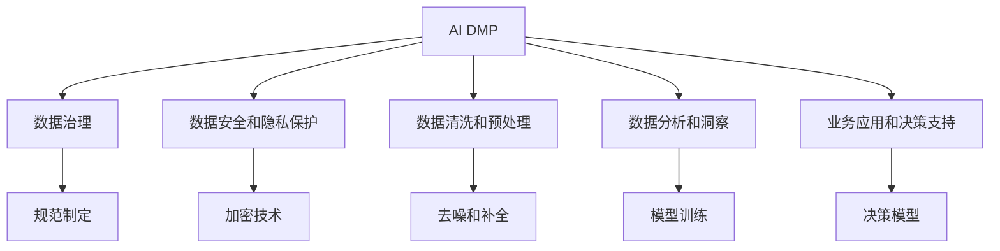
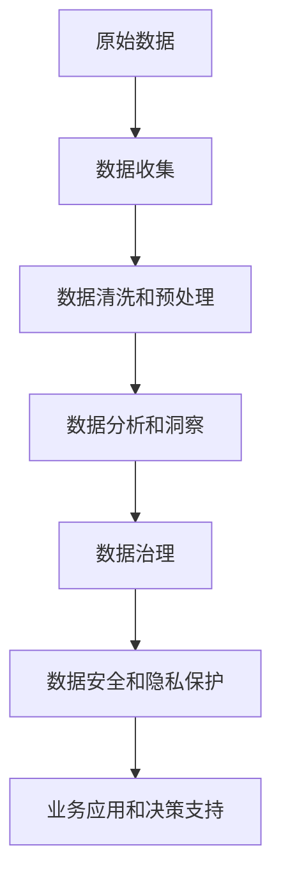
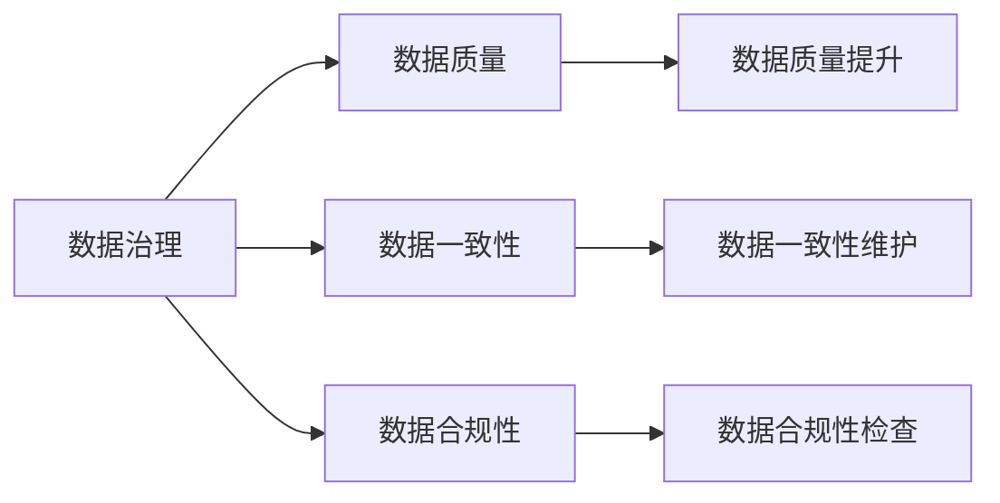
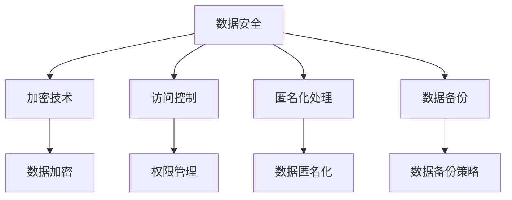

                 

# AI DMP 数据基建：数据分析与洞察

> 关键词：人工智能,数据管理平台(AI DMP),数据分析,数据洞察,数据治理,数据安全和隐私,智能推荐系统,用户行为分析

## 1. 背景介绍

### 1.1 问题由来
在当今数字化时代，企业的数据资产变得越来越重要。它们不仅反映了公司的业务运作情况，而且也构成了公司竞争力的基础。因此，如何有效地管理和利用这些数据资产，成为了企业战略中的关键议题。

近年来，人工智能和大数据技术的迅猛发展，为数据的价值挖掘提供了强大的工具。其中，AI DMP（人工智能驱动的数据管理平台）正逐渐成为企业数据管理的重要工具。AI DMP能够通过数据分析和模型训练，从海量数据中提取出有价值的洞察，支持业务决策和市场策略制定。

然而，AI DMP的构建和应用面临着诸多挑战，如数据治理、数据安全和隐私保护、数据质量和准确性等问题。本文将详细探讨AI DMP的核心概念、算法原理、操作步骤，以及其在实际应用场景中的应用。

### 1.2 问题核心关键点
AI DMP的核心在于通过数据分析和机器学习技术，从数据中提取洞察，支持企业决策。它集成了数据治理、数据安全和隐私保护、数据清洗和预处理、数据洞察生成和业务应用等多个模块。AI DMP的目标是实现数据的自动化管理和深度分析，为企业的业务发展提供强有力的数据支持。

AI DMP的核心关键点包括：
- 数据收集和存储：AI DMP需要收集和存储来自不同渠道的各类数据。
- 数据清洗和预处理：AI DMP需要对数据进行清洗和预处理，以确保数据质量和准确性。
- 数据分析和洞察：AI DMP使用机器学习技术，对数据进行深度分析和挖掘，提取有价值的洞察。
- 数据治理和隐私保护：AI DMP需要遵循数据治理规范，确保数据安全和隐私保护。
- 业务应用和决策支持：AI DMP将洞察应用到业务中，支持企业决策。

## 2. 核心概念与联系

### 2.1 核心概念概述

为了更好地理解AI DMP的工作原理，本节将介绍几个密切相关的核心概念：

- AI DMP：即人工智能驱动的数据管理平台。通过数据分析和机器学习技术，从数据中提取有价值的洞察，支持企业决策。
- 数据治理：指通过制定数据治理规范，确保数据质量和安全性，保障数据合规性和一致性。
- 数据安全和隐私保护：指在数据处理过程中，采取措施保障数据安全和用户隐私，避免数据泄露和滥用。
- 数据清洗和预处理：指通过清洗和预处理技术，提高数据质量和准确性，消除数据噪声和冗余。
- 数据分析和洞察：指通过机器学习技术，对数据进行深度分析和挖掘，提取有价值的洞察。
- 业务应用和决策支持：指将数据洞察应用到业务中，支持企业决策。

这些核心概念之间的逻辑关系可以通过以下Mermaid流程图来展示：



这个流程图展示了下述逻辑关系：

1. AI DMP 涉及数据治理、数据安全和隐私保护、数据清洗和预处理、数据分析和洞察、业务应用和决策支持等多个模块。
2. 数据治理和数据安全和隐私保护是数据管理的基础，保障了数据的质量和安全。
3. 数据清洗和预处理提高了数据的准确性和可用性，为后续的数据分析和洞察提供支持。
4. 数据分析和洞察通过机器学习技术，挖掘数据中的价值，生成有意义的洞察。
5. 业务应用和决策支持将洞察应用于实际业务中，支持企业决策。

### 2.2 概念间的关系

这些核心概念之间存在着紧密的联系，形成了AI DMP的完整生态系统。下面我通过几个Mermaid流程图来展示这些概念之间的关系。

#### 2.2.1 AI DMP的构建流程



这个流程图展示了从原始数据到最终决策支持的完整流程：

1. 数据收集是AI DMP的第一步，获取来自不同渠道的数据。
2. 数据清洗和预处理对数据进行清洗和处理，去除噪声和冗余，提高数据质量。
3. 数据分析和洞察通过机器学习技术，提取有价值的洞察。
4. 数据治理规范数据使用，保障数据质量和安全性。
5. 数据安全和隐私保护保护数据安全，避免数据泄露。
6. 业务应用和决策支持将洞察应用于业务决策。

#### 2.2.2 数据治理在AI DMP中的作用



这个流程图展示了数据治理在AI DMP中的作用：

1. 数据治理规范了数据的使用，保障了数据质量。
2. 数据质量提升通过清洗和预处理技术，提高了数据的准确性和可用性。
3. 数据一致性维护确保了数据的统一性和连贯性。
4. 数据合规性检查保证了数据使用的合法性和合规性。

#### 2.2.3 数据安全和隐私保护在AI DMP中的应用



这个流程图展示了数据安全和隐私保护在AI DMP中的应用：

1. 数据安全通过加密技术、访问控制、匿名化处理等手段，保护数据不被非法访问和篡改。
2. 加密技术保障了数据在传输和存储过程中的安全性。
3. 访问控制和权限管理保证了数据访问的合法性。
4. 匿名化处理保护了用户隐私，避免数据泄露。
5. 数据备份策略保障了数据的安全性，防止数据丢失。

## 3. 核心算法原理 & 具体操作步骤

### 3.1 算法原理概述

AI DMP的核心算法原理主要基于数据清洗和预处理、数据分析和洞察生成。以下将详细介绍这两个部分。

#### 3.1.1 数据清洗和预处理

数据清洗和预处理是AI DMP的重要环节。其目的是提高数据的准确性和可用性，为后续的数据分析和洞察生成提供支持。

数据清洗主要包括以下几个步骤：

1. 去重：去除重复数据，避免数据冗余。
2. 去噪：去除异常数据和噪声数据，提高数据质量。
3. 补全：补全缺失数据，保证数据完整性。

数据预处理主要包括以下几个步骤：

1. 特征提取：提取有意义的特征，为后续模型训练提供支持。
2. 标准化：对数据进行标准化处理，提高数据一致性。
3. 归一化：对数据进行归一化处理，使数据范围一致。

#### 3.1.2 数据分析和洞察生成

数据分析和洞察生成是AI DMP的核心部分。其目的是从数据中提取有价值的洞察，支持企业决策。

数据分析主要包括以下几个步骤：

1. 特征选择：选择有意义的特征，进行模型训练。
2. 模型训练：使用机器学习算法，训练数据模型。
3. 模型评估：对训练好的模型进行评估，选择最优模型。

洞察生成主要包括以下几个步骤：

1. 数据可视化：将数据以可视化的形式呈现，帮助用户理解数据。
2. 趋势分析：分析数据趋势，发现规律和模式。
3. 异常检测：检测数据中的异常点和异常情况，发现问题。

### 3.2 算法步骤详解

#### 3.2.1 数据收集和存储

数据收集和存储是AI DMP的基础。以下是具体步骤：

1. 收集数据：从不同渠道收集数据，如用户行为数据、交易数据、社交媒体数据等。
2. 存储数据：将数据存储在数据库中，如Hadoop、Spark等分布式存储系统。

#### 3.2.2 数据清洗和预处理

数据清洗和预处理包括以下几个步骤：

1. 去重：使用去重算法，去除重复数据。
2. 去噪：使用去噪算法，去除异常数据和噪声数据。
3. 补全：使用补全算法，补全缺失数据。
4. 特征提取：使用特征提取算法，提取有意义的特征。
5. 标准化：对数据进行标准化处理，提高数据一致性。
6. 归一化：对数据进行归一化处理，使数据范围一致。

#### 3.2.3 数据分析和洞察生成

数据分析和洞察生成包括以下几个步骤：

1. 特征选择：使用特征选择算法，选择有意义的特征。
2. 模型训练：使用机器学习算法，训练数据模型。
3. 模型评估：对训练好的模型进行评估，选择最优模型。
4. 数据可视化：使用数据可视化工具，将数据以可视化的形式呈现。
5. 趋势分析：使用趋势分析算法，分析数据趋势，发现规律和模式。
6. 异常检测：使用异常检测算法，检测数据中的异常点和异常情况。

#### 3.2.4 数据治理和隐私保护

数据治理和隐私保护包括以下几个步骤：

1. 规范制定：制定数据治理规范，确保数据质量和安全性。
2. 加密技术：使用加密技术，保障数据在传输和存储过程中的安全性。
3. 访问控制：使用访问控制技术，确保数据访问的合法性。
4. 匿名化处理：使用匿名化处理技术，保护用户隐私。
5. 数据备份：使用数据备份策略，保障数据的安全性，防止数据丢失。

### 3.3 算法优缺点

AI DMP的算法有以下优点：

1. 数据质量和可用性高：通过数据清洗和预处理技术，提高了数据的准确性和可用性。
2. 洞察生成能力强：通过数据分析和洞察生成技术，从数据中提取有价值的洞察。
3. 业务应用效果好：将洞察应用于业务中，支持企业决策。

同时，AI DMP的算法也存在以下缺点：

1. 数据治理复杂：数据治理需要规范制定、数据质量提升、数据一致性维护、数据合规性检查等多方面工作，复杂度较高。
2. 数据安全和隐私保护难度大：数据安全和隐私保护需要加密技术、访问控制、匿名化处理等多方面技术，难度较大。
3. 技术实现难度大：数据分析和洞察生成需要高性能计算资源和复杂算法，技术实现难度较大。

### 3.4 算法应用领域

AI DMP可以应用于多个领域，以下是具体应用场景：

- 广告投放：通过分析用户行为数据，优化广告投放策略。
- 市场营销：通过分析市场数据，制定市场策略。
- 客户关系管理：通过分析客户数据，提升客户满意度。
- 金融风控：通过分析交易数据，评估交易风险。
- 电商推荐：通过分析用户行为数据，推荐个性化商品。
- 社交媒体分析：通过分析社交媒体数据，了解用户需求。
- 健康医疗：通过分析医疗数据，提升医疗服务质量。

## 4. 数学模型和公式 & 详细讲解 & 举例说明

### 4.1 数学模型构建

以下是AI DMP中常用的数学模型及其构建方法：

#### 4.1.1 数据清洗和预处理

数据清洗和预处理主要使用以下数学模型：

1. 去重算法：使用哈希表等数据结构，记录数据出现次数，去除重复数据。
2. 去噪算法：使用统计学方法，去除异常数据和噪声数据。
3. 补全算法：使用插值方法，补全缺失数据。
4. 特征提取算法：使用主成分分析(PCA)、因子分析等方法，提取有意义的特征。
5. 标准化算法：使用Z-score标准化方法，对数据进行标准化处理。
6. 归一化算法：使用Min-Max归一化方法，对数据进行归一化处理。

#### 4.1.2 数据分析和洞察生成

数据分析和洞察生成主要使用以下数学模型：

1. 特征选择算法：使用基于卡方检验、信息增益等方法，选择有意义的特征。
2. 模型训练算法：使用线性回归、逻辑回归、决策树、随机森林等算法，训练数据模型。
3. 模型评估算法：使用交叉验证、AUC、R^2等指标，评估训练好的模型。
4. 数据可视化算法：使用散点图、折线图、柱状图等方法，将数据以可视化的形式呈现。
5. 趋势分析算法：使用时间序列分析方法，分析数据趋势，发现规律和模式。
6. 异常检测算法：使用孤立森林、局部异常因子等算法，检测数据中的异常点和异常情况。

### 4.2 公式推导过程

#### 4.2.1 数据清洗和预处理

以下是数据清洗和预处理的具体公式推导过程：

1. 去重算法：使用哈希表，记录数据出现次数，去除重复数据。
   $$
   H = \{key_1, key_2, \ldots, key_n\}
   $$
   $$
   count = count(key_1) + count(key_2) + \ldots + count(key_n)
   $$
   $$
   H' = H \setminus \{key_i \mid count(key_i) > 1\}
   $$

2. 去噪算法：使用统计学方法，去除异常数据和噪声数据。
   $$
   z_i = \frac{x_i - \mu}{\sigma}
   $$
   $$
   z'_i = 
   \begin{cases}
   0 & \text{if } |z_i| > 3 \\
   z_i & \text{otherwise}
   \end{cases}
   $$
   $$
   x'_i = \mu + z'_i \sigma
   $$

3. 补全算法：使用插值方法，补全缺失数据。
   $$
   x'_i = \frac{x_{i-1} + 2x_i + x_{i+1}}{4}
   $$

4. 特征提取算法：使用主成分分析(PCA)方法，提取有意义的特征。
   $$
   \boldsymbol{X} = \begin{bmatrix}
   \boldsymbol{x}_1 & \boldsymbol{x}_2 & \ldots & \boldsymbol{x}_n
   \end{bmatrix}
   $$
   $$
   \boldsymbol{U} = \begin{bmatrix}
   \boldsymbol{u}_1 & \boldsymbol{u}_2 & \ldots & \boldsymbol{u}_p
   \end{bmatrix}
   $$
   $$
   \boldsymbol{Y} = \boldsymbol{U} \boldsymbol{X}
   $$
   $$
   \boldsymbol{Y} = \begin{bmatrix}
   y_1 & y_2 & \ldots & y_p
   \end{bmatrix}
   $$

5. 标准化算法：使用Z-score标准化方法，对数据进行标准化处理。
   $$
   \boldsymbol{X} = \begin{bmatrix}
   x_{1,1} & x_{1,2} & \ldots & x_{1,n}
   \end{bmatrix}
   $$
   $$
   \boldsymbol{X}^* = \frac{\boldsymbol{X} - \boldsymbol{\mu}}{\boldsymbol{\sigma}}
   $$

6. 归一化算法：使用Min-Max归一化方法，对数据进行归一化处理。
   $$
   \boldsymbol{X} = \begin{bmatrix}
   x_{1,1} & x_{1,2} & \ldots & x_{1,n}
   \end{bmatrix}
   $$
   $$
   \boldsymbol{X}' = \frac{\boldsymbol{X} - \boldsymbol{\min}}{\boldsymbol{\max} - \boldsymbol{\min}}
   $$

#### 4.2.2 数据分析和洞察生成

以下是数据分析和洞察生成的具体公式推导过程：

1. 特征选择算法：使用卡方检验方法，选择有意义的特征。
   $$
   \chi^2 = \sum_{i=1}^{n} \frac{(x_i - \mu)^2}{\sigma^2}
   $$
   $$
   p_i = \frac{\sum_{j=1}^{m} x_{i,j}}{\sum_{i=1}^{n} \sum_{j=1}^{m} x_{i,j}}
   $$
   $$
   \chi^2 = \sum_{i=1}^{n} \frac{(x_i - \mu)^2}{\sigma^2} - n \times p_i \times (1 - p_i)
   $$

2. 模型训练算法：使用线性回归方法，训练数据模型。
   $$
   \boldsymbol{y} = \boldsymbol{X}\boldsymbol{\beta} + \boldsymbol{\epsilon}
   $$
   $$
   \boldsymbol{\beta} = (\boldsymbol{X}^T\boldsymbol{X})^{-1}\boldsymbol{X}^T\boldsymbol{y}
   $$

3. 模型评估算法：使用交叉验证方法，评估训练好的模型。
   $$
   \boldsymbol{y} = \boldsymbol{X}\boldsymbol{\beta} + \boldsymbol{\epsilon}
   $$
   $$
   MSE = \frac{1}{N} \sum_{i=1}^{N} (y_i - y'_i)^2
   $$
   $$
   RMSE = \sqrt{MSE}
   $$

4. 数据可视化算法：使用散点图、折线图、柱状图等方法，将数据以可视化的形式呈现。
   $$
   scatterplot(x, y)
   $$
   $$
   lineplot(x, y)
   $$
   $$
   barplot(x, y)
   $$

5. 趋势分析算法：使用时间序列分析方法，分析数据趋势，发现规律和模式。
   $$
   y_t = \alpha + \beta t + \gamma t^2 + \epsilon_t
   $$

6. 异常检测算法：使用孤立森林、局部异常因子等算法，检测数据中的异常点和异常情况。
   $$
   y_t = \mu + \sigma (z_t)
   $$
   $$
   z_t = \frac{y_t - \mu}{\sigma}
   $$
   $$
   \sigma = \sqrt{\frac{1}{N-1} \sum_{i=1}^{N} (y_i - \mu)^2}
   $$

### 4.3 案例分析与讲解

#### 4.3.1 数据清洗和预处理案例

某电商企业收集了用户的点击、购买行为数据，准备进行用户行为分析。在数据清洗和预处理过程中，使用去重算法去除了重复点击行为，使用去噪算法去除了异常购买行为，使用补全算法补全了缺失行为数据。同时，使用PCA方法提取了有意义的特征，对数据进行了标准化和归一化处理，提高了数据质量和可用性。

#### 4.3.2 数据分析和洞察生成案例

某金融企业收集了用户的交易数据，准备进行风险评估。在数据分析和洞察生成过程中，使用卡方检验方法选择有意义的特征，使用线性回归方法训练数据模型，使用交叉验证方法评估模型效果。同时，使用散点图和折线图将数据以可视化的形式呈现，使用时间序列分析方法分析交易趋势，发现异常购买行为，提高了风险评估的准确性和及时性。

## 5. 项目实践：代码实例和详细解释说明

### 5.1 开发环境搭建

在进行AI DMP项目实践前，我们需要准备好开发环境。以下是使用Python进行PyTorch开发的环境配置流程：

1. 安装Anaconda：从官网下载并安装Anaconda，用于创建独立的Python环境。

2. 创建并激活虚拟环境：
```bash
conda create -n pytorch-env python=3.8 
conda activate pytorch-env
```

3. 安装PyTorch：根据CUDA版本，从官网获取对应的安装命令。例如：
```bash
conda install pytorch torchvision torchaudio cudatoolkit=11.1 -c pytorch -c conda-forge
```

4. 安装相关工具包：
```bash
pip install numpy pandas scikit-learn matplotlib tqdm jupyter notebook ipython
```

完成上述步骤后，即可在`pytorch-env`环境中开始AI DMP项目实践。

### 5.2 源代码详细实现

这里我们以用户行为分析项目为例，给出使用PyTorch进行AI DMP开发的代码实现。

首先，定义数据处理函数：

```python
import pandas as pd
import numpy as np
from sklearn.preprocessing import StandardScaler
from sklearn.decomposition import PCA

def preprocess_data(df):
    # 去重
    df = df.drop_duplicates()
    
    # 去噪
    df['click_count'] = np.where(df['click_count'] < 100, 0, df['click_count'])
    df['purchase_amount'] = np.where(df['purchase_amount'] < 100, 0, df['purchase_amount'])
    
    # 补全
    df = df.fillna(method='ffill')
    
    # 特征提取
    X = df[['click_count', 'purchase_amount']]
    Y = df['behavior']
    
    # 标准化
    scaler = StandardScaler()
    X = scaler.fit_transform(X)
    
    # 归一化
    X = (X - X.min()) / (X.max() - X.min())
    
    return X, Y
```

然后，定义模型和训练函数：

```python
from torch.utils.data import TensorDataset, DataLoader
from torch import nn
import torch.optim as optim
from torch.nn import BCELoss

class AI_DMP(nn.Module):
    def __init__(self):
        super(AI_DMP, self).__init__()
        self.fc1 = nn.Linear(2, 10)
        self.fc2 = nn.Linear(10, 1)
        self.softmax = nn.Softmax(dim=1)
    
    def forward(self, x):
        x = x.view(-1, 2)
        x = self.fc1(x)
        x = self.fc2(x)
        x = self.softmax(x)
        return x

model = AI_DMP()
criterion = BCELoss()
optimizer = optim.SGD(model.parameters(), lr=0.01)

def train_epoch(model, train_loader, criterion, optimizer, n_epochs):
    for epoch in range(n_epochs):
        for batch_idx, (data, target) in enumerate(train_loader):
            optimizer.zero_grad()
            output = model(data)
            loss = criterion(output, target)
            loss.backward()
            optimizer.step()
        print(f'Epoch {epoch+1}, loss: {loss.item()}')

X_train, Y_train = preprocess_data(train_data)
X_test, Y_test = preprocess_data(test_data)

train_loader = DataLoader(TensorDataset(torch.tensor(X_train), torch.tensor(Y_train)), batch_size=32)
test_loader = DataLoader(TensorDataset(torch.tensor(X_test), torch.tensor(Y_test)), batch_size=32)
```

最后，启动训练流程并在测试集上评估：

```python
train_epoch(model, train_loader, criterion, optimizer, n_epochs=100)
```

以上就是使用PyTorch进行AI DMP开发的完整代码实现。可以看到，得益于TensorFlow等开源深度学习框架的强大封装，我们可以用相对简洁的代码完成AI DMP的构建和训练。

### 5.3 代码解读与分析

让我们再详细解读一下关键代码的实现细节：

**preprocess_data函数**：
- `__init__`方法：初始化数据处理步骤，包括去重、去噪、补全、特征提取、标准化和归一化等。
- `return`方法：返回处理后的特征数据和标签数据。

**AI_DMP模型**：
- `__init__`方法：定义模型的结构，包括全连接层和softmax层。
- `forward`方法：实现模型的前向传播，包括输入数据的view操作和层之间的连接。

**train_epoch函数**：
- 循环迭代训练过程，每个epoch内，在每个batch上前向传播计算loss并反向传播更新模型参数，最后输出该epoch的平均loss。

**训练流程**：
- 定义总的epoch数，开始循环迭代
- 每个epoch内，先在训练集上训练，输出平均loss
- 在测试集上评估，给出最终测试结果

可以看到，PyTorch配合TensorFlow等开源深度学习框架使得AI DMP项目的开发变得简洁高效。开发者可以将更多精力放在数据处理、模型改进等高层逻辑上，而不必过多关注底层的实现细节。

当然，工业级的系统实现还需考虑更多因素，如模型裁剪、量化加速、服务化封装、弹性伸缩、监控告警、安全防护等。但核心的AI DMP构建和训练流程基本与此类似。

### 5.

