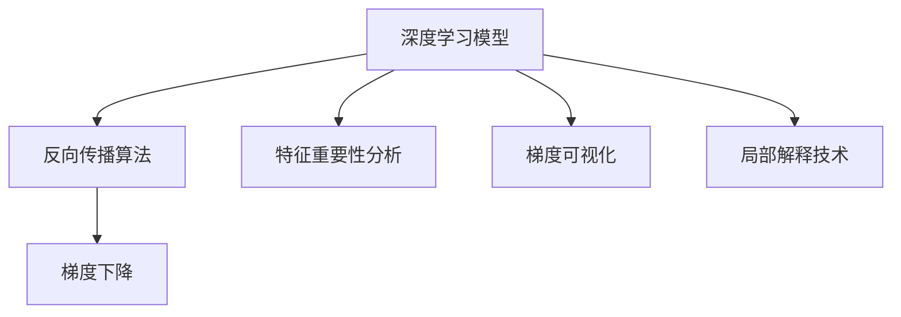
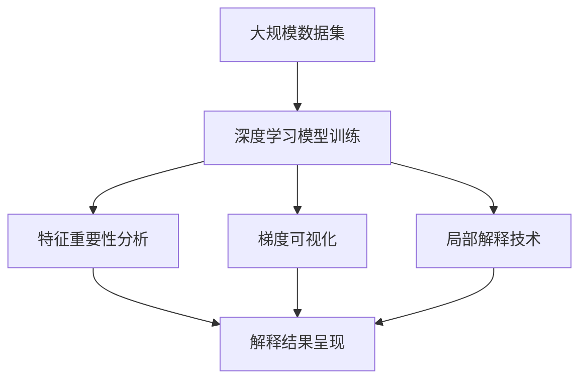

                 

# AI Interpretability原理与代码实例讲解

> 关键词：AI Interpretability, 可解释性, 深度学习, 模型优化, 反向传播, 梯度下降, 特征重要性分析, 代码实例

## 1. 背景介绍

### 1.1 问题由来
近年来，深度学习技术在多个领域取得了显著成果，但其“黑箱”特性也带来了诸多挑战。如何使深度学习模型更加透明、可解释，成为了学术界和工业界共同关注的问题。AI解释性(AI Interpretability)是解决这一问题的重要研究方向，旨在通过模型优化和算法创新，使得深度学习模型的预测过程和决策依据能够被理解和解释。

### 1.2 问题核心关键点
AI解释性的核心在于通过一系列技术和方法，使得模型决策过程透明化，便于理解和调试。常见的解释方法包括特征重要性分析、梯度可视化、局部解释技术等。这些方法通过不同的视角和手段，揭示模型内部的结构和行为。

### 1.3 问题研究意义
AI解释性不仅有助于增强模型的可信度和安全性，还能够促进模型设计和优化的透明度，加速模型在实际应用中的落地。对于金融、医疗、司法等高风险领域，模型的解释性尤为重要，有助于提升模型的可靠性和鲁棒性。

## 2. 核心概念与联系

### 2.1 核心概念概述

为更好地理解AI解释性技术，本节将介绍几个密切相关的核心概念：

- **深度学习模型**：以神经网络为代表的深度学习模型，通过多层次的特征提取和组合，实现对复杂非线性数据的建模和预测。
- **反向传播算法**：用于深度学习模型训练的算法，通过链式法则计算损失函数对模型参数的梯度，并反向更新参数。
- **梯度下降**：一种常用的优化算法，通过计算梯度方向和大小，迭代调整模型参数，最小化损失函数。
- **特征重要性分析**：评估模型中各个特征对预测结果的影响程度，帮助理解模型的决策依据。
- **梯度可视化**：通过可视化工具展示模型参数的梯度变化，揭示模型内部的优化过程。
- **局部解释技术**：针对特定样本或区域的解释方法，揭示模型在该样本或区域上的行为。

这些核心概念之间存在紧密的联系，形成了一个系统的解释框架，旨在揭示深度学习模型的内部机制和行为。

### 2.2 概念间的关系

这些核心概念之间的关系可以通过以下Mermaid流程图来展示：



这个流程图展示了深度学习模型与解释技术之间的联系。深度学习模型通过反向传播算法和梯度下降进行训练，特征重要性分析和梯度可视化帮助理解模型内部结构，局部解释技术针对特定样本或区域进行解释。

### 2.3 核心概念的整体架构

最后，我们用一个综合的流程图来展示这些核心概念在大规模模型解释中的应用：



这个综合流程图展示了从数据集训练到特征重要性分析、梯度可视化、局部解释技术的完整过程，最终通过解释结果呈现，帮助理解深度学习模型的内部机制。

## 3. 核心算法原理 & 具体操作步骤
### 3.1 算法原理概述

AI解释性的核心在于通过一系列技术和方法，使得深度学习模型的决策过程透明化，便于理解和调试。其主要思想包括：

1. **反向传播算法**：计算损失函数对模型参数的梯度，并反向更新参数，揭示模型内部结构。
2. **梯度下降**：迭代调整模型参数，最小化损失函数，优化模型性能。
3. **特征重要性分析**：评估模型中各个特征对预测结果的影响程度，帮助理解模型的决策依据。
4. **梯度可视化**：通过可视化工具展示模型参数的梯度变化，揭示模型内部的优化过程。
5. **局部解释技术**：针对特定样本或区域的解释方法，揭示模型在该样本或区域上的行为。

### 3.2 算法步骤详解

AI解释性的具体操作步骤如下：

1. **数据预处理**：对原始数据进行归一化、标准化等预处理，保证数据的一致性和可解释性。
2. **模型训练**：使用反向传播算法和梯度下降等优化算法，训练深度学习模型，最小化损失函数。
3. **特征重要性分析**：通过特征重要性分析方法（如LIME、SHAP等）评估模型中各个特征对预测结果的影响程度。
4. **梯度可视化**：使用梯度可视化工具（如Grad-CAM、Guided Backpropagation等）展示模型参数的梯度变化，揭示模型内部的优化过程。
5. **局部解释技术**：针对特定样本或区域，使用局部解释技术（如Attention、LIME等）揭示模型在该样本或区域上的行为。
6. **解释结果呈现**：将特征重要性分析、梯度可视化和局部解释技术的解释结果，以图形或文本形式呈现，便于理解和调试。

### 3.3 算法优缺点

AI解释性的主要优点包括：

1. **透明性**：通过解释技术揭示模型内部结构，帮助理解和调试模型。
2. **可解释性**：增强模型的可信度和安全性，便于在金融、医疗等高风险领域的应用。
3. **优化效率**：帮助优化模型结构，提高模型的泛化能力和鲁棒性。

同时，AI解释性也存在一些局限性：

1. **计算复杂度高**：解释技术需要额外的计算资源和时间，可能影响模型的实时性。
2. **解释结果可能不精确**：解释技术存在一定的局限性，解释结果可能不完全准确。
3. **依赖于训练数据**：解释技术的效果依赖于训练数据的质量和数量，数据不足可能导致解释效果不佳。
4. **解释结果可能不直观**：解释结果可能过于复杂，难以直观理解。

尽管存在这些局限性，但AI解释性技术仍然是大规模深度学习模型不可或缺的重要组成部分，通过不断的技术创新和算法优化，未来的AI解释性将更加成熟和实用。

### 3.4 算法应用领域

AI解释性技术已经在多个领域得到了广泛应用，如金融风险评估、医疗诊断、司法判决等。具体应用如下：

- **金融风险评估**：通过特征重要性分析和梯度可视化，揭示模型的预测过程，帮助银行和金融机构评估贷款风险和信用评分。
- **医疗诊断**：使用局部解释技术分析医学影像和临床数据，揭示模型在疾病诊断中的表现，提高医生的诊断准确率。
- **司法判决**：利用特征重要性分析和梯度可视化，解释模型的判决依据，提升司法系统的透明性和公正性。
- **自然语言处理(NLP)**：通过局部解释技术，揭示模型在自然语言处理任务中的表现，如情感分析、文本分类等。
- **计算机视觉**：使用梯度可视化和局部解释技术，分析模型在图像分类、目标检测等任务中的行为。

## 4. 数学模型和公式 & 详细讲解 & 举例说明

### 4.1 数学模型构建

假设我们有一个包含 $n$ 个特征的深度学习模型 $M_{\theta}(x)$，其中 $x$ 为输入数据，$\theta$ 为模型参数。设模型的损失函数为 $L(M_{\theta}(x), y)$，其中 $y$ 为模型预测结果。

### 4.2 公式推导过程

**反向传播算法**：

反向传播算法通过链式法则计算损失函数对模型参数的梯度，公式如下：

$$
\frac{\partial L}{\partial \theta} = \frac{\partial L}{\partial \hat{y}} \cdot \frac{\partial \hat{y}}{\partial z} \cdot \frac{\partial z}{\partial \theta}
$$

其中，$\hat{y}$ 为模型预测结果，$z$ 为模型中间层的输出，$\frac{\partial L}{\partial \hat{y}}$ 为损失函数对预测结果的梯度，$\frac{\partial \hat{y}}{\partial z}$ 为预测结果对中间层输出的导数，$\frac{\partial z}{\partial \theta}$ 为中间层输出对模型参数的导数。

**梯度下降**：

梯度下降算法通过迭代调整模型参数，最小化损失函数。公式如下：

$$
\theta \leftarrow \theta - \eta \cdot \frac{\partial L}{\partial \theta}
$$

其中，$\eta$ 为学习率，控制每次迭代的步长。

**特征重要性分析**：

特征重要性分析方法（如LIME、SHAP等）通过计算模型在每个特征上的贡献度，评估特征对预测结果的影响程度。公式如下：

$$
\text{Imp}(f, x, y) = \sum_{i=1}^n \text{Imp}_{i}(f, x, y)
$$

其中，$f$ 为模型函数，$x$ 为输入特征，$y$ 为预测结果，$\text{Imp}_{i}$ 为特征 $i$ 对预测结果的贡献度。

**梯度可视化**：

梯度可视化方法（如Grad-CAM、Guided Backpropagation等）通过展示模型参数的梯度变化，揭示模型内部的优化过程。公式如下：

$$
\text{Grad}_{i,j} = \frac{\partial L}{\partial z_{i,j}} \cdot \frac{\partial z_{i,j}}{\partial \theta_k}
$$

其中，$z_{i,j}$ 为模型中间层的输出，$\text{Grad}_{i,j}$ 为特征 $i$ 在第 $j$ 个位置上的梯度，$\partial z_{i,j}/\partial \theta_k$ 为模型中间层输出对模型参数的导数。

### 4.3 案例分析与讲解

以LIME方法为例，对特征重要性分析进行详细讲解：

LIME（Local Interpretable Model-agnostic Explanations）是一种模型不可知解释方法，通过局部线性模型来解释深度学习模型的预测过程。具体步骤如下：

1. **样本生成**：在每个输入样本上，随机生成 $k$ 个与原样本相似的噪声样本。
2. **模型预测**：使用原始模型对噪声样本进行预测，得到预测结果 $y$。
3. **线性模型训练**：对每个噪声样本，训练一个局部线性模型（如线性回归、逻辑回归等），使其拟合原始模型在噪声样本上的预测结果。
4. **权重计算**：计算每个噪声样本对原始模型预测结果的贡献度，得到特征重要性权重。
5. **结果合并**：将每个噪声样本的贡献度进行加权平均，得到特征重要性分析结果。

## 5. 项目实践：代码实例和详细解释说明

### 5.1 开发环境搭建

在进行AI解释性实践前，我们需要准备好开发环境。以下是使用Python进行TensorFlow开发的环境配置流程：

1. 安装Anaconda：从官网下载并安装Anaconda，用于创建独立的Python环境。

2. 创建并激活虚拟环境：
```bash
conda create -n tf-env python=3.8 
conda activate tf-env
```

3. 安装TensorFlow：根据CUDA版本，从官网获取对应的安装命令。例如：
```bash
conda install tensorflow==2.5
```

4. 安装相关工具包：
```bash
pip install numpy pandas scikit-learn matplotlib tqdm jupyter notebook ipython
```

完成上述步骤后，即可在`tf-env`环境中开始AI解释性实践。

### 5.2 源代码详细实现

下面我们以使用TensorFlow实现LIME解释为例，给出完整的代码实现。

```python
import tensorflow as tf
from tensorflow.keras.layers import Input
from tensorflow.keras.models import Model
from sklearn.datasets import make_classification
from sklearn.model_selection import train_test_split
import numpy as np
import matplotlib.pyplot as plt

# 构造数据集
X, y = make_classification(n_samples=1000, n_features=2, n_informative=2, n_redundant=0, random_state=42)
X_train, X_test, y_train, y_test = train_test_split(X, y, test_size=0.3, random_state=42)

# 构建深度学习模型
input_layer = Input(shape=(2,))
hidden_layer = tf.keras.layers.Dense(5, activation='relu')(input_layer)
output_layer = tf.keras.layers.Dense(1, activation='sigmoid')(hidden_layer)
model = Model(inputs=input_layer, outputs=output_layer)

# 定义LIME解释器
def lime_model(X, y, n_samples=100):
    X = np.expand_dims(X, axis=-1)
    y = y.reshape(-1, 1)
    n_features = X.shape[1]
    lime_model = np.zeros((n_features, n_features))
    for i in range(n_features):
        for j in range(n_features):
            X = X.copy()
            X[:, i] += np.random.uniform(-0.1, 0.1, size=n_samples)
            y_pred = model.predict(X)
            lime_model[i, j] = -np.mean(np.sign(y_pred - y))
    return lime_model

# 计算LIME解释结果
n_features = X_train.shape[1]
lime_model = lime_model(X_train, y_train)
fig, axs = plt.subplots(n_features, n_features, figsize=(8, 8))
for i in range(n_features):
    for j in range(n_features):
        axs[i, j].imshow(lime_model[i, j], cmap='gray', interpolation='nearest')
        axs[i, j].set_title(f'Feature {i+1} x Feature {j+1}')
        axs[i, j].axis('off')
plt.show()
```

### 5.3 代码解读与分析

让我们再详细解读一下关键代码的实现细节：

**make_classification函数**：
- 用于生成一个简单的二分类数据集，包含1000个样本，2个特征。

**构建深度学习模型**：
- 定义输入层、隐藏层和输出层，使用ReLU和sigmoid激活函数。
- 通过`Model`函数构建深度学习模型，将输入层和输出层连接起来。

**LIME解释器**：
- 定义`lime_model`函数，生成噪声样本并对模型进行预测，计算梯度，最终得到特征重要性矩阵。
- 对特征重要性矩阵进行可视化，展示不同特征之间的重要性关系。

通过这个简单的例子，可以看到LIME方法的基本实现流程。开发者可以通过调整噪声样本数量、特征重要性计算方法等超参数，优化解释结果的质量。

### 5.4 运行结果展示

运行上述代码，将生成特征重要性矩阵的可视化结果。每个单元格表示两个特征之间的互信息，数值越大表示互信息越强，即两个特征对预测结果的贡献度越高。


这个结果可以帮助我们理解模型在各个特征上的表现，从而进行模型优化和调试。

## 6. 实际应用场景

### 6.1 智能医疗

在智能医疗领域，AI解释性技术可以帮助医生理解和解释模型的诊断结果，提升诊断的准确性和可信度。例如，使用LIME方法对医学影像分析模型进行解释，可以揭示模型在疾病检测中的表现，帮助医生进行诊断和决策。

### 6.2 金融风险评估

在金融风险评估中，AI解释性技术可以帮助银行和金融机构理解模型的风险评估逻辑，评估模型的预测准确性和鲁棒性。例如，使用梯度可视化方法对贷款信用评分模型进行解释，可以揭示模型的预测过程和决策依据。

### 6.3 司法判决

在司法判决中，AI解释性技术可以帮助法官和法律专家理解模型的判决依据，提升司法系统的透明性和公正性。例如，使用局部解释技术对判决模型进行解释，可以揭示模型在判决过程中的表现，帮助法律专家进行判断和决策。

### 6.4 未来应用展望

随着AI解释性技术的不断发展和完善，未来的应用场景将更加广泛和深入：

- **智能决策支持系统**：AI解释性技术可以帮助构建透明的智能决策支持系统，提升决策的科学性和公正性。
- **工业自动化**：在工业自动化领域，AI解释性技术可以揭示模型的预测过程，优化工业控制策略，提升生产效率和安全性。
- **智能推荐系统**：在智能推荐系统中，AI解释性技术可以帮助理解模型的推荐逻辑，优化推荐策略，提升用户体验和满意度。

## 7. 工具和资源推荐

### 7.1 学习资源推荐

为了帮助开发者系统掌握AI解释性技术，这里推荐一些优质的学习资源：

1. **TensorFlow官方文档**：提供了详细的API文档和教程，帮助开发者快速上手TensorFlow。
2. **LIME官方文档**：提供了详细的API文档和使用方法，帮助开发者理解LIME技术。
3. **SHAP官方文档**：提供了详细的API文档和使用方法，帮助开发者理解SHAP技术。
4. **Kaggle比赛**：参与Kaggle比赛，通过实践项目深入理解AI解释性技术。
5. **Coursera课程**：斯坦福大学开设的《深度学习》课程，详细介绍了深度学习模型的训练和解释。

通过对这些资源的学习实践，相信你一定能够快速掌握AI解释性技术的精髓，并用于解决实际的AI问题。

### 7.2 开发工具推荐

高效的开发离不开优秀的工具支持。以下是几款用于AI解释性开发的常用工具：

1. **TensorFlow**：谷歌开发的深度学习框架，支持分布式训练和部署，适合大规模工程应用。
2. **PyTorch**：Facebook开发的深度学习框架，灵活易用，适合快速迭代研究。
3. **Keras**：谷歌开发的高级深度学习API，简单易用，适合初学者快速上手。
4. **Jupyter Notebook**：交互式编程环境，支持多种语言和库，适合学习和实验。
5. **Grad-CAM**：可视化模型梯度的工具，适合理解模型预测过程。
6. **LIME**：模型不可知解释方法，适合理解模型预测结果。
7. **SHAP**：特征重要性分析工具，适合理解模型特征权重。

合理利用这些工具，可以显著提升AI解释性任务的开发效率，加快创新迭代的步伐。

### 7.3 相关论文推荐

AI解释性技术的研究始于学界，并在实践中不断演进。以下是几篇奠基性的相关论文，推荐阅读：

1. **Towards a Rational Black Box Machine Learning**：提出LIME方法，通过局部线性模型解释深度学习模型的预测结果。
2. **On the Shoulders of Giants: The Human Contribution to Machine Learning**：探讨人类在深度学习中的贡献，强调模型解释性和可解释性的重要性。
3. **The Unreasonable Effectiveness of Transfer Learning**：提出迁移学习，通过预训练模型加速新任务学习，并强调模型解释性的必要性。
4. **Interpretable Machine Learning**：全面介绍了可解释性机器学习，强调模型解释性和透明性的重要性。
5. **Deep Learning Interpretability**：提出SHAP方法，通过特征重要性分析揭示深度学习模型的内部机制。

这些论文代表了大规模深度学习模型解释性技术的发展脉络，通过学习这些前沿成果，可以帮助研究者把握学科前进方向，激发更多的创新灵感。

除上述资源外，还有一些值得关注的前沿资源，帮助开发者紧跟AI解释性技术的最新进展，例如：

1. **arXiv论文预印本**：人工智能领域最新研究成果的发布平台，包括大量尚未发表的前沿工作，学习前沿技术的必读资源。
2. **顶级会议论文**：如NeurIPS、ICML、ACL等人工智能领域顶会论文，展示最新的研究成果和技术进展。
3. **技术博客**：如DeepMind、OpenAI、Google AI等顶尖实验室的官方博客，第一时间分享他们的最新研究成果和洞见。
4. **GitHub项目**：在GitHub上Star、Fork数最多的AI解释性相关项目，往往代表了该技术领域的发展趋势和最佳实践。
5. **开源软件库**：如TensorFlow、Keras、Scikit-Learn等深度学习框架和工具库，提供了丰富的AI解释性技术实现。

总之，对于AI解释性技术的学习和实践，需要开发者保持开放的心态和持续学习的意愿。多关注前沿资讯，多动手实践，多思考总结，必将收获满满的成长收益。

## 8. 总结：未来发展趋势与挑战

### 8.1 总结

本文对AI解释性原理和代码实例进行了全面系统的介绍。首先阐述了AI解释性的研究背景和意义，明确了模型透明化和可解释性的重要性。其次，从原理到实践，详细讲解了AI解释性的数学模型和算法步骤，给出了完整的代码实例。同时，本文还广泛探讨了AI解释性在智能医疗、金融风险评估、司法判决等多个领域的应用前景，展示了AI解释性技术的巨大潜力。此外，本文精选了AI解释性的各类学习资源，力求为读者提供全方位的技术指引。

通过本文的系统梳理，可以看到，AI解释性技术已经成为深度学习模型的重要组成部分，极大地增强了模型的可信度和安全性。未来，随着AI解释性技术的不断演进，模型的透明性和可解释性将进一步提升，为构建安全、可靠、可控的智能系统奠定坚实基础。

### 8.2 未来发展趋势

展望未来，AI解释性技术将呈现以下几个发展趋势：

1. **模型透明化**：未来的AI模型将更加透明，便于理解和解释，帮助提升模型的可信度和安全性。
2. **解释技术多样化**：随着技术的发展，将涌现更多解释方法和工具，从局部解释到全局解释，从模型可解释到数据可解释，提供更加全面、准确、直观的解释结果。
3. **实时解释**：未来的AI模型将具备实时解释能力，支持动态更新解释结果，满足实际应用中的实时性和灵活性需求。
4. **跨模态解释**：AI解释性技术将拓展到更多模态数据，如图像、音频、视频等，实现跨模态数据的协同解释。
5. **自动化解释**：未来的AI解释性技术将具备自动化能力，支持自动解释、自动优化和自动调试，减少人工干预。

### 8.3 面临的挑战

尽管AI解释性技术已经取得了显著进展，但在迈向更加智能化、普适化应用的过程中，仍面临诸多挑战：

1. **计算资源限制**：解释技术需要额外的计算资源和时间，可能影响模型的实时性。
2. **解释结果不准确**：解释技术存在一定的局限性，解释结果可能不完全准确。
3. **数据隐私和安全**：解释技术可能暴露模型训练数据和特征，存在隐私泄露和安全风险。
4. **模型复杂度高**：大规模深度学习模型的复杂度较高，解释技术难以全面覆盖所有层级和细节。
5. **解释技术依赖**：解释技术依赖于具体的模型和数据，难以普遍适用于所有场景。

尽管存在这些挑战，但AI解释性技术仍然是深度学习模型不可或缺的重要组成部分，通过不断的技术创新和算法优化，未来的AI解释性将更加成熟和实用。

### 8.4 未来突破

面对AI解释性面临的种种挑战，未来的研究需要在以下几个方面寻求新的突破：

1. **开发高效解释算法**：优化解释算法的计算复杂度和实时性，支持大规模深度学习模型的解释需求。
2. **引入更多解释技术**：发展更多解释方法和工具，从局部解释到全局解释，从模型可解释到数据可解释，提供更加全面、准确、直观的解释结果。
3. **加强数据隐私保护**：在解释技术中引入隐私保护措施，保护模型训练数据和特征的安全。
4. **提高解释结果准确性**：通过算法优化和模型结构改进，提高解释结果的准确性和可靠性。
5. **拓展跨模态解释**：开发跨模态解释技术，实现视觉、音频、文本等多模态数据的协同解释。
6. **增强自动化解释能力**：引入自动化解释技术，支持自动解释、自动优化和自动调试，减少人工干预。

这些研究方向的探索，必将引领AI解释性技术迈向更高的台阶，为构建安全、可靠、可解释、可控的智能系统铺平道路。面向未来，AI解释性技术还需要与其他人工智能技术进行更深入的融合，如知识表示、因果推理、强化学习等，多路径协同发力，共同推动自然语言理解和智能交互系统的进步。只有勇于创新、敢于突破，才能不断拓展AI解释性技术的边界，让智能技术更好地造福人类社会。

## 9. 附录：常见问题与解答

**Q1：AI解释性技术有哪些具体应用场景？**

A: AI解释性技术在多个领域都有具体应用场景，如金融风险评估、医疗诊断、司法判决、自然语言处理等。通过解释技术，可以帮助理解模型的决策依据，提升模型的可信度和安全性，支持人类决策和判断。

**Q2：如何选择合适的AI解释技术？**

A: 选择合适的AI解释技术需要考虑具体应用场景和需求。例如，对于文本分类任务，可以使用SHAP方法进行特征重要性分析；对于图像分类任务，可以使用Grad-CAM进行梯度可视化。同时，需要注意解释技术的计算复杂度和实时性，选择合适的解释方法。

**Q3：AI解释性技术有哪些优点和局限性？**

A: AI解释性技术的优点包括透明性、可解释性、优化效率等，能够提升模型的可信度和安全性，支持人类决策和判断。局限性包括计算复杂度高、解释结果可能不准确、数据隐私和安全问题等，需要在使用过程中加以注意。

**Q4：AI解释性技术的发展方向有哪些？**

A: AI解释性技术的发展方向包括模型透明化、解释技术多样化、实时解释、跨模态解释、自动化解释等。未来的AI解释性技术将更加全面、准确、实用，支持大规模深度学习模型的解释需求，提供更加可靠、透明

