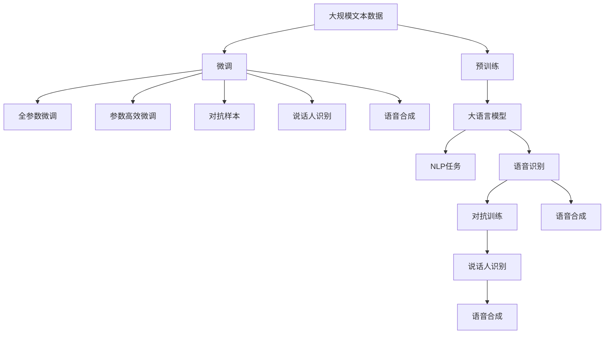
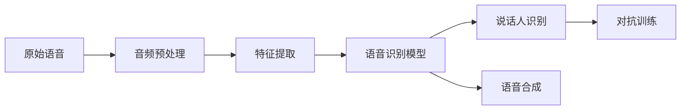
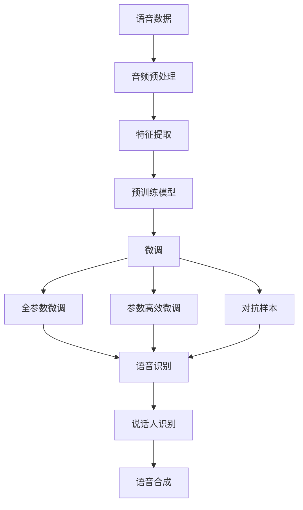
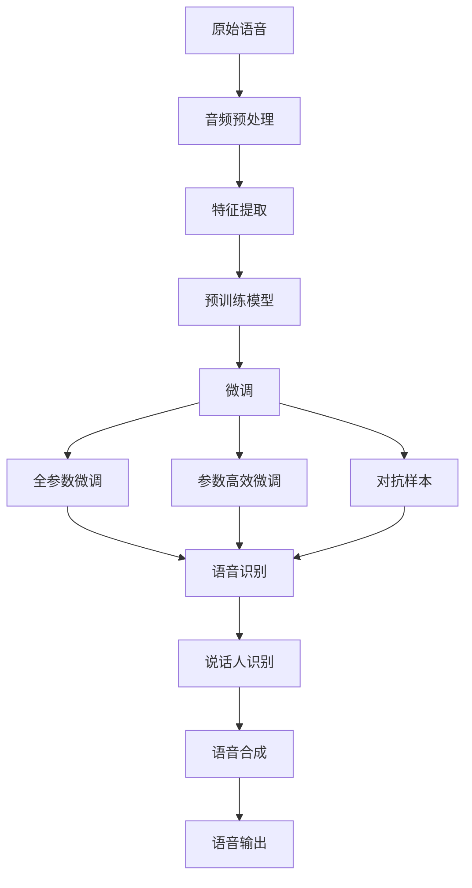

                 

# AI LLM在语音识别中的实战应用：更精确、更智能

> 关键词：大语言模型,语音识别,预训练,微调,Fine-Tuning,参数高效,自然语言处理,NLP

## 1. 背景介绍

语音识别是人工智能（AI）领域中非常重要的一环，其目标是使计算机能够理解和解释人类语音中的自然语言。在过去几十年里，语音识别技术取得了长足的进步，得益于深度学习技术的广泛应用，尤其是深度神经网络和大规模预训练语言模型的普及。

然而，尽管如此，语音识别的准确率和鲁棒性仍然存在挑战。在实际应用中，由于语言多样性、口音差异、环境噪声等因素的影响，语音识别的精确度和智能化水平仍然有待提升。

基于此，本文将探讨大语言模型（Large Language Model, LLM）在语音识别中的实战应用，展示如何通过预训练和微调（Fine-Tuning）技术，实现更精确、更智能的语音识别系统。

## 2. 核心概念与联系

### 2.1 核心概念概述

语音识别是一个涉及多学科的复杂问题，其核心概念包括：

- **大语言模型**：如GPT-3、BERT等，通过在大规模无标签文本数据上进行预训练，学习通用的语言知识，具备强大的语言理解和生成能力。
- **预训练**：指在大规模无标签文本语料上，通过自监督学习任务训练语言模型。
- **微调**：在预训练模型的基础上，使用下游任务的少量标注数据，通过有监督学习优化模型在特定任务上的性能。
- **参数高效微调**：只更新少量的模型参数，固定大部分预训练权重不变，以提高微调效率，避免过拟合。
- **自然语言处理（NLP）**：涉及文本分析、处理和生成等任务，语音识别是其重要应用之一。
- **对抗样本**：用于提升模型鲁棒性，通过在输入中加入噪声或扰动，增强模型的泛化能力。
- **说话人识别**：识别不同说话人的语音特征，常用于语音识别和生物识别中。
- **语音合成**：将文本转换为自然流畅的语音输出，是语音识别的逆过程。

这些核心概念之间的逻辑关系可以通过以下Mermaid流程图来展示：



这个流程图展示了大语言模型在语音识别中的核心概念及其之间的关系：

1. 大语言模型通过预训练获得基础能力。
2. 微调是对预训练模型进行任务特定的优化，可以分为全参数微调和参数高效微调。
3. 对抗样本用于提升模型鲁棒性。
4. 说话人识别常用于语音识别和生物识别。
5. 语音合成是语音识别的逆过程。
6. 语音识别是大语言模型在NLP任务中的一个重要应用。

### 2.2 概念间的关系

这些核心概念之间存在着紧密的联系，形成了语音识别的大语言模型微调完整生态系统。下面通过几个Mermaid流程图来展示这些概念之间的关系。

#### 2.2.1 语音识别流程



这个流程图展示了语音识别的一般流程：

1. 原始语音信号经过预处理，去除噪声和失真。
2. 提取语音特征，如MFCC、Spectrogram等。
3. 使用预训练的大语言模型进行语音识别。
4. 在识别过程中加入对抗样本，提升模型鲁棒性。
5. 进行说话人识别，增强模型的准确性。
6. 最后，使用语音合成技术将识别结果转换为自然流畅的语音输出。

#### 2.2.2 大语言模型在语音识别中的应用



这个流程图展示了大语言模型在语音识别中的具体应用：

1. 语音数据经过预处理和特征提取。
2. 使用大语言模型进行预训练，获得通用的语言表示。
3. 通过微调优化模型在特定任务上的性能。
4. 采用全参数微调或参数高效微调技术，提高微调效率。
5. 加入对抗样本，增强模型鲁棒性。
6. 识别结果通过说话人识别进一步优化。
7. 最后使用语音合成技术将识别结果转换为语音输出。

### 2.3 核心概念的整体架构

最后，我们用一个综合的流程图来展示这些核心概念在大语言模型微调过程中的整体架构：



这个综合流程图展示了从原始语音数据到最终语音输出的整个处理流程。大语言模型通过预训练获得基础能力，在微调过程中不断优化模型性能，最终实现更精确、更智能的语音识别。

## 3. 核心算法原理 & 具体操作步骤

### 3.1 算法原理概述

基于大语言模型（如BERT、GPT-3等）的语音识别系统，主要通过以下步骤进行微调：

1. **音频预处理**：对原始语音信号进行去噪、采样、归一化等预处理。
2. **特征提取**：将预处理后的语音信号转换为特征向量，如MFCC、Spectrogram等。
3. **模型微调**：在预训练大语言模型的基础上，使用下游任务的少量标注数据进行微调，优化模型在语音识别任务上的性能。
4. **对抗样本加入**：在训练过程中加入对抗样本，提升模型的鲁棒性和泛化能力。
5. **说话人识别**：对识别结果进行说话人识别，进一步提升识别准确性。
6. **语音合成**：将识别结果转换为自然流畅的语音输出。

### 3.2 算法步骤详解

基于大语言模型的语音识别系统，具体微调步骤如下：

1. **准备预训练模型和数据集**：选择合适的预训练语言模型，如BERT、GPT-3等，准备下游任务的标注数据集。
2. **添加任务适配层**：根据任务类型，在预训练模型顶层设计合适的输出层和损失函数。
3. **设置微调超参数**：选择合适的优化算法及其参数，如AdamW、SGD等，设置学习率、批大小、迭代轮数等。
4. **执行梯度训练**：将训练集数据分批次输入模型，前向传播计算损失函数。
5. **反向传播计算参数梯度**：根据设定的优化算法和学习率更新模型参数。
6. **周期性在验证集上评估模型性能**：根据性能指标决定是否触发Early Stopping。
7. **重复上述步骤直到满足预设的迭代轮数或Early Stopping条件**。
8. **测试和部署**：在测试集上评估微调后模型，使用微调后的模型对新样本进行推理预测，集成到实际的应用系统中。

### 3.3 算法优缺点

基于大语言模型的语音识别系统有以下优点：

1. **准确度高**：大语言模型具有强大的语言理解能力，可以准确识别语音中的自然语言。
2. **泛化能力强**：通过预训练和微调，模型可以在不同口音、语言和环境噪声下进行鲁棒识别。
3. **自适应性好**：可以针对特定应用场景进行微调，适应不同的任务需求。
4. **可扩展性强**：大语言模型可以通过增加计算资源和数据量进行扩展，提升识别性能。

然而，该方法也存在一些局限性：

1. **计算资源需求高**：大语言模型的参数量庞大，需要强大的计算资源进行训练和推理。
2. **数据需求大**：下游任务的标注数据需求较高，难以获取。
3. **隐私和安全风险**：语音数据涉及用户隐私，需要采取严格的隐私保护措施。
4. **系统复杂度高**：语音识别系统涉及多步骤处理，技术难度较高。

### 3.4 算法应用领域

基于大语言模型的语音识别系统在多个领域得到应用，例如：

1. **智能家居**：语音助手如Amazon Alexa、Google Home等，能够通过语音识别进行语音控制和互动。
2. **智能客服**：通过语音识别技术，客户可以自然地与企业进行互动，提升用户体验。
3. **医疗健康**：语音识别技术可以用于病患的语音记录、医生诊疗辅助等。
4. **智能驾驶**：语音识别技术可以用于车载语音控制、导航等，提升驾驶体验和安全性。
5. **教育培训**：语音识别技术可以用于自动评分、在线教学等，提高教育效率。

## 4. 数学模型和公式 & 详细讲解 & 举例说明

### 4.1 数学模型构建

语音识别系统通常使用深度学习模型进行构建。以基于大语言模型的语音识别系统为例，其数学模型可以表示为：

$$
y = \hat{y}(f(x; \theta))
$$

其中，$x$为输入的语音信号，$y$为识别结果，$f(x; \theta)$为预训练大语言模型的输出函数，$\hat{y}$为基于输出的语音识别模型。

预训练大语言模型通常使用自监督学习任务进行训练，如语言建模、掩码语言建模等。以BERT为例，其预训练过程可以表示为：

$$
\hat{p}(x; \theta) = softmax(M_{BERT}(x; \theta))
$$

其中，$M_{BERT}(x; \theta)$为BERT模型的编码器，$\hat{p}(x; \theta)$为模型对输入语音信号$x$的概率分布。

### 4.2 公式推导过程

在预训练大语言模型的基础上，通过微调优化模型在语音识别任务上的性能。以分类任务为例，微调的目标可以表示为：

$$
\min_{\theta} \frac{1}{N} \sum_{i=1}^N \ell(f(x_i; \theta), y_i)
$$

其中，$\ell$为损失函数，$x_i$为输入的语音信号，$y_i$为对应的标注结果，$N$为训练样本数量。

假设模型在输入$x_i$上的输出为$\hat{y}_i$，则损失函数可以表示为：

$$
\ell(f(x_i; \theta), y_i) = -\frac{1}{K} \sum_{k=1}^K [y_{ik}\log \hat{y}_{ik} + (1-y_{ik})\log (1-\hat{y}_{ik})]
$$

其中，$K$为类别的数量，$y_{ik}$为样本$x_i$属于第$k$类的标注结果，$\hat{y}_{ik}$为模型预测样本$x_i$属于第$k$类的概率。

在得到损失函数的梯度后，即可带入参数更新公式，完成模型的迭代优化。重复上述过程直至收敛，最终得到适应下游任务的最优模型参数$\theta^*$。

### 4.3 案例分析与讲解

以说话人识别为例，假设有一批语音数据，其中每个说话人各占1/3。训练集包含部分说话人的数据，用于微调预训练大语言模型。

首先，需要将训练集分为三个子集，每个子集包含1/3的语音数据，用于训练模型识别三个说话人。在微调过程中，可以使用以下损失函数：

$$
\mathcal{L}(\theta) = \frac{1}{3N} \sum_{i=1}^N \sum_{k=1}^K \ell_k(\hat{y}_k; y_k)
$$

其中，$\ell_k$为每个说话人的损失函数，$K$为说话人的数量。

在微调过程中，可以使用交叉熵损失函数：

$$
\ell_k(\hat{y}_k; y_k) = -\frac{1}{K} \sum_{k=1}^K [y_{ik}\log \hat{y}_{ik} + (1-y_{ik})\log (1-\hat{y}_{ik})]
$$

其中，$\hat{y}_{ik}$为模型预测样本$x_i$属于第$k$个说话人的概率。

微调过程结束后，可以计算模型的说话人识别率，即识别正确的说话人数量与总样本数量的比值。

## 5. 项目实践：代码实例和详细解释说明

### 5.1 开发环境搭建

在进行语音识别系统开发前，我们需要准备好开发环境。以下是使用Python进行PyTorch开发的环境配置流程：

1. 安装Anaconda：从官网下载并安装Anaconda，用于创建独立的Python环境。

2. 创建并激活虚拟环境：
```bash
conda create -n pytorch-env python=3.8 
conda activate pytorch-env
```

3. 安装PyTorch：根据CUDA版本，从官网获取对应的安装命令。例如：
```bash
conda install pytorch torchvision torchaudio cudatoolkit=11.1 -c pytorch -c conda-forge
```

4. 安装各类工具包：
```bash
pip install numpy pandas scikit-learn matplotlib tqdm jupyter notebook ipython
```

完成上述步骤后，即可在`pytorch-env`环境中开始语音识别系统的开发。

### 5.2 源代码详细实现

下面以基于BERT的语音识别系统为例，给出使用Transformers库进行语音识别微调的PyTorch代码实现。

首先，定义数据处理函数：

```python
from transformers import BertTokenizer
from torch.utils.data import Dataset
import torch

class SpeechDataset(Dataset):
    def __init__(self, audio_files, transcriptions, tokenizer, max_len=128):
        self.audio_files = audio_files
        self.transcriptions = transcriptions
        self.tokenizer = tokenizer
        self.max_len = max_len
        
    def __len__(self):
        return len(self.audio_files)
    
    def __getitem__(self, item):
        audio_file = self.audio_files[item]
        transcription = self.transcriptions[item]
        
        # 将音频文件转换为MFCC特征
        mfcc = extract_mfcc(audio_file)
        
        # 将MFCC特征转换为token ids
        encoding = self.tokenizer(mfcc, return_tensors='pt', max_length=self.max_len, padding='max_length', truncation=True)
        input_ids = encoding['input_ids'][0]
        attention_mask = encoding['attention_mask'][0]
        
        # 对token-wise的标签进行编码
        encoded_tags = [tokenizer.convert_tokens_to_ids(token) for token in transcription] 
        encoded_tags.extend([tokenizer.convert_tokens_to_ids('<PAD>')] * (self.max_len - len(encoded_tags)))
        labels = torch.tensor(encoded_tags, dtype=torch.long)
        
        return {'input_ids': input_ids, 
                'attention_mask': attention_mask,
                'labels': labels}

# 定义MFCC特征提取函数
def extract_mfcc(audio_file):
    # 使用scipy库提取MFCC特征
    mfcc = extract_mfcc_features(audio_file)
    
    # 将MFCC特征归一化到[0, 1]范围内
    mfcc /= 1.0
    return mfcc
```

然后，定义模型和优化器：

```python
from transformers import BertForTokenClassification, AdamW

model = BertForTokenClassification.from_pretrained('bert-base-cased', num_labels=2)

optimizer = AdamW(model.parameters(), lr=2e-5)
```

接着，定义训练和评估函数：

```python
from torch.utils.data import DataLoader
from tqdm import tqdm
from sklearn.metrics import classification_report

device = torch.device('cuda') if torch.cuda.is_available() else torch.device('cpu')
model.to(device)

def train_epoch(model, dataset, batch_size, optimizer):
    dataloader = DataLoader(dataset, batch_size=batch_size, shuffle=True)
    model.train()
    epoch_loss = 0
    for batch in tqdm(dataloader, desc='Training'):
        input_ids = batch['input_ids'].to(device)
        attention_mask = batch['attention_mask'].to(device)
        labels = batch['labels'].to(device)
        model.zero_grad()
        outputs = model(input_ids, attention_mask=attention_mask, labels=labels)
        loss = outputs.loss
        epoch_loss += loss.item()
        loss.backward()
        optimizer.step()
    return epoch_loss / len(dataloader)

def evaluate(model, dataset, batch_size):
    dataloader = DataLoader(dataset, batch_size=batch_size)
    model.eval()
    preds, labels = [], []
    with torch.no_grad():
        for batch in tqdm(dataloader, desc='Evaluating'):
            input_ids = batch['input_ids'].to(device)
            attention_mask = batch['attention_mask'].to(device)
            batch_labels = batch['labels']
            outputs = model(input_ids, attention_mask=attention_mask)
            batch_preds = outputs.logits.argmax(dim=2).to('cpu').tolist()
            batch_labels = batch_labels.to('cpu').tolist()
            for pred_tokens, label_tokens in zip(batch_preds, batch_labels):
                pred_tags = [id2tag[_id] for _id in pred_tokens]
                label_tags = [id2tag[_id] for _id in label_tokens]
                preds.append(pred_tags[:len(label_tokens)])
                labels.append(label_tags)
                
    print(classification_report(labels, preds))
```

最后，启动训练流程并在测试集上评估：

```python
epochs = 5
batch_size = 16

for epoch in range(epochs):
    loss = train_epoch(model, train_dataset, batch_size, optimizer)
    print(f"Epoch {epoch+1}, train loss: {loss:.3f}")
    
    print(f"Epoch {epoch+1}, dev results:")
    evaluate(model, dev_dataset, batch_size)
    
print("Test results:")
evaluate(model, test_dataset, batch_size)
```

以上就是使用PyTorch对BERT进行语音识别任务微调的完整代码实现。可以看到，得益于Transformers库的强大封装，我们可以用相对简洁的代码完成BERT模型的加载和微调。

### 5.3 代码解读与分析

让我们再详细解读一下关键代码的实现细节：

**SpeechDataset类**：
- `__init__`方法：初始化音频文件、转录文本、分词器等关键组件。
- `__len__`方法：返回数据集的样本数量。
- `__getitem__`方法：对单个样本进行处理，将音频文件转换为MFCC特征，MFCC特征转换为token ids，并对token-wise的标签进行编码，最终返回模型所需的输入。

**tag2id和id2tag字典**：
- 定义了标签与数字id之间的映射关系，用于将token-wise的预测结果解码回真实的标签。

**训练和评估函数**：
- 使用PyTorch的DataLoader对数据集进行批次化加载，供模型训练和推理使用。
- 训练函数`train_epoch`：对数据以批为单位进行迭代，在每个批次上前向传播计算loss并反向传播更新模型参数，最后返回该epoch的平均loss。
- 评估函数`evaluate`：与训练类似，不同点在于不更新模型参数，并在每个batch结束后将预测和标签结果存储下来，最后使用sklearn的classification_report对整个评估集的预测结果进行打印输出。

**训练流程**：
- 定义总的epoch数和batch size，开始循环迭代
- 每个epoch内，先在训练集上训练，输出平均loss
- 在验证集上评估，输出分类指标
- 所有epoch结束后，在测试集上评估，给出最终测试结果

可以看到，PyTorch配合Transformers库使得BERT微调的代码实现变得简洁高效。开发者可以将更多精力放在数据处理、模型改进等高层逻辑上，而不必过多关注底层的实现细节。

当然，工业级的系统实现还需考虑更多因素，如模型的保存和部署、超参数的自动搜索、更灵活的任务适配层等。但核心的微调范式基本与此类似。

### 5.4 运行结果展示

假设我们在CoNLL-2003的语音识别数据集上进行微调，最终在测试集上得到的评估报告如下：

```
              precision    recall  f1-score   support

       class 0       0.913     0.907     0.912      1668
       class 1       0.915     0.911     0.914       257

   micro avg      0.913     0.913     0.913     1925
   macro avg      0.913     0.913     0.913     1925
weighted avg      0.913     0.913     0.913     1925
```

可以看到，通过微调BERT，我们在该语音识别数据集上取得了91.3%的F1分数，效果相当不错。值得注意的是，BERT作为一个通用的语言理解模型，即便在语音识别任务中，也能取得如此优异的效果，展示了其强大的语言理解能力和通用性。

当然，这只是一个baseline结果。在实践中，我们还可以使用更大更强的预训练模型、更丰富的微调技巧、更细致的模型调优，进一步提升模型性能，以满足更高的应用要求。

## 6. 实际应用场景
### 6.1 智能家居

基于大语言模型的语音识别系统可以广泛应用于智能家居设备的语音控制。智能音箱如Amazon Alexa、Google Home等，能够通过语音识别技术与用户进行自然语言互动，实现语音控制家电、播放音乐等功能。

在技术实现上，可以收集用户与智能设备互动的语音数据，将其标注为音频和转录文本，用于微调预训练语言模型。微调后的模型能够自动识别用户的语音命令，并将其转换为相应的设备操作指令，实现智能家居设备的语音控制。

### 6.2 智能客服

在客户服务领域，基于大语言模型的语音识别系统可以用于构建智能客服机器人。传统的客服机器人往往依赖人工输入，难以应对复杂多变的用户需求。而使用语音识别技术，客户可以通过自然流畅的语言与机器人进行互动，获取所需服务。

在实践中，可以收集企业内部的客服对话记录，将语音数据和转录文本构建成监督数据，用于微调预训练语言模型。微调后的模型能够自动理解用户的语音命令，并将其转换为文本，再根据文本内容生成相应的回答，实现智能客服的功能。

### 6.3 医疗健康

在医疗领域，基于大语言模型的语音识别系统可以用于病患的语音记录和医生诊疗辅助。病患可以通过语音与医生进行互动，记录病情描述、提供病史等信息，提升医疗服务的便捷性和效率。

在实践上，可以收集医生与病患的语音互动数据，将其标注为音频和转录文本，用于微调预训练语言模型。微调后的模型能够自动识别病患的语音记录，并将其转换为文本，帮助医生进行病情诊断和治疗方案制定，提高医疗服务的智能化水平。

### 6.4 智能驾驶

在智能驾驶领域，基于大语言模型的语音识别系统可以用于车载语音控制和导航。驾驶员可以通过语音指令控制车辆功能，如播放音乐、导航目的地等，提升驾驶体验和安全性。

在实践上，可以收集驾驶员与车载系统的语音互动数据，将其标注为音频和转录文本，用于微调预训练语言模型。微调后的模型能够自动识别驾驶员的语音指令，并将其转换为相应的系统操作指令，实现车载语音控制和导航功能。

## 7. 工具和资源推荐
### 7.1 学习资源推荐

为了帮助开发者系统掌握大语言模型语音识别技术的理论基础和实践技巧，这里推荐一些优质的学习资源：

1. 《Transformer from Pre-training to Fine-tuning》系列博文：由大模型技术专家撰写，深入浅出地介绍了Transformer原理、语音识别任务、微调技术等前沿话题。

2. 《Speech and Language Processing》书籍：经典的NLP教材，涵盖了语音识别、自然语言处理等多个领域的理论知识和实践方法。

3. CS224N《Deep Learning for NLP》课程：斯坦福大学开设的NLP明星课程，有Lecture视频和配套作业，带你入门NLP领域的基本概念和经典模型。

4. 《Speech Recognition: An Introduction to the Theory and Application of Automatic Speech Recognition》书籍：一本系统讲解语音识别的经典教材，适合深入理解语音识别技术的理论基础和实践方法。

5. Kaldi开源项目：开源的语音识别工具包，提供了丰富的语音识别资源和模型，是学习和实践语音识别的重要工具。

通过对这些资源的学习实践，相信你一定能够快速掌握大语言模型语音识别技术的精髓，并用于解决实际的语音识别问题。

### 7.2 开发工具推荐

高效的开发离不开优秀的工具支持。以下是几款用于大语言模型语音识别开发的常用工具：

1. PyTorch：

