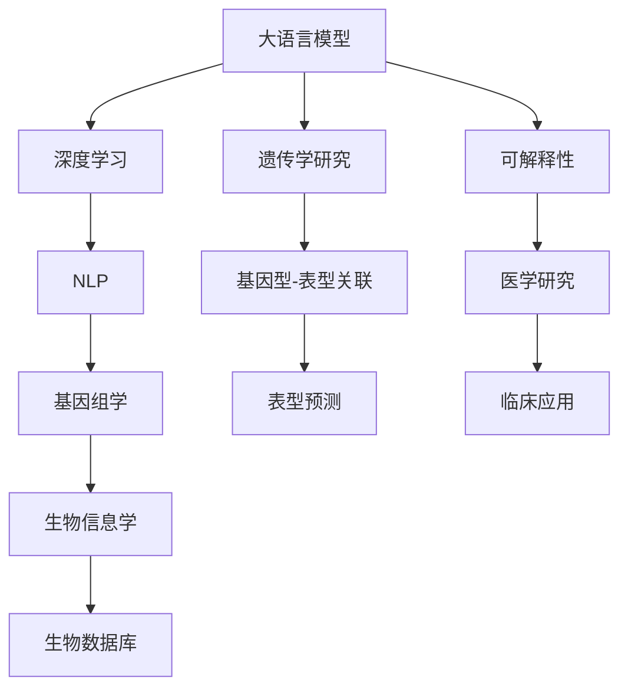
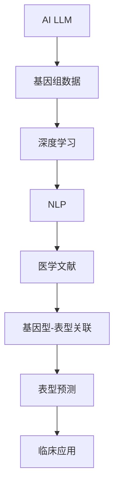

                 

# AI LLM在遗传学研究中的新方法

> 关键词：AI大语言模型(LLM)，遗传学研究，基因组分析，深度学习，自然语言处理(NLP)，生物信息学

## 1. 背景介绍

### 1.1 问题由来
遗传学研究是一门古老而又前沿的科学，致力于揭示基因与生物表型之间的关系。随着高通量测序技术的突破，遗传学数据量呈指数级增长，传统的人工处理方式已无法应对。近年来，人工智能技术，尤其是大语言模型(Large Language Models, LLMs)，在遗传学中的应用逐渐兴起，成为推动遗传学研究进步的新引擎。

LLMs作为先进的人工智能工具，可以处理海量数据，揭示数据背后的模式和关系，帮助研究人员快速分析和理解遗传学数据。基于LLMs的研究方法不仅提高了遗传学研究的工作效率，还推动了相关技术的发展和应用。

### 1.2 问题核心关键点
1. **大规模数据处理**：遗传学研究需要处理大量的基因组数据，传统方法难以应对。
2. **深度学习应用**：LLMs能够通过深度学习技术，从大规模数据中提取特征，揭示遗传学关系。
3. **自然语言处理结合**：LLMs通过自然语言处理技术，能够理解和生成生物医学文本，提供更多研究信息。
4. **跨领域应用**：LLMs在基因组学、遗传学、生物信息学等多个领域都有应用，促进跨学科研究。
5. **可解释性和可信性**：LLMs的模型训练过程和输出结果需具备可解释性和可信性，符合医学研究的规范和要求。

### 1.3 问题研究意义
1. **提高研究效率**：LLMs能够处理大量遗传学数据，快速揭示基因与表型之间的关系。
2. **推动技术进步**：促进生物信息学和人工智能技术的融合，推动相关技术的发展。
3. **增强研究能力**：通过自然语言处理技术，LLMs能够理解医学文献，提供更多的研究信息。
4. **促进跨学科研究**：促进遗传学与其他学科（如医学、生物化学等）的交叉融合。
5. **提升应用效果**：通过大模型微调技术，LLMs能够在特定遗传学任务上取得更好的效果。

## 2. 核心概念与联系

### 2.1 核心概念概述

为更好地理解AI LLM在遗传学研究中的应用，本节将介绍几个密切相关的核心概念：

- **大语言模型**：以自回归(如GPT)或自编码(如BERT)模型为代表的大规模预训练语言模型。通过在大规模无标签文本语料上进行预训练，学习通用的语言表示，具备强大的语言理解和生成能力。
- **深度学习**：通过多层神经网络模型，学习输入数据的复杂特征，常用于处理图像、语音、文本等结构化数据。
- **自然语言处理(NLP)**：涉及计算机与人类语言之间的交互，包括语言理解、生成、翻译等多个方面。
- **生物信息学**：一门综合生物学、数学、计算机科学的学科，涉及基因组学、蛋白质组学、生物数据库等多个方向。
- **基因组学**：研究基因组结构、功能以及它们与生物表型之间关系的科学。
- **可解释性**：指模型输出的结果能够被人类理解和解释，符合医学研究的规范和要求。

这些核心概念之间的逻辑关系可以通过以下Mermaid流程图来展示：



这个流程图展示了大语言模型在遗传学研究中的应用路径：

1. 大语言模型通过深度学习技术处理大规模基因组数据。
2. 自然语言处理技术帮助模型理解医学文献，提供更多研究信息。
3. 模型用于基因型-表型关联研究，揭示遗传学关系。
4. 模型用于表型预测，推动临床应用。
5. 模型的输出结果需具备可解释性，符合医学研究的规范和要求。

### 2.2 概念间的关系

这些核心概念之间存在着紧密的联系，形成了AI LLM在遗传学研究中的完整应用框架。下面我通过几个Mermaid流程图来展示这些概念之间的关系。

#### 2.2.1 AI LLM在遗传学中的应用



这个流程图展示了AI LLM在遗传学研究中的应用过程：

1. AI LLM通过深度学习技术处理基因组数据。
2. 自然语言处理技术帮助模型理解医学文献。
3. 模型用于基因型-表型关联研究。
4. 模型用于表型预测。
5. 模型结果用于临床应用。

#### 2.2.2 基因型-表型关联研究


这个流程图展示了基因型-表型关联研究的基本流程：

1. 基因型数据输入深度学习模型。
2. 模型理解医学文献，提取更多研究信息。
3. 模型揭示基因型与表型之间的关联关系。

#### 2.2.3 表型预测


这个流程图展示了表型预测的基本流程：

1. 基因型数据输入深度学习模型。
2. 模型理解医学文献，提取更多研究信息。
3. 模型预测基因型的表型表现。

## 3. 核心算法原理 & 具体操作步骤
### 3.1 算法原理概述

AI LLM在遗传学中的应用，主要是通过深度学习技术，从大规模基因组数据中提取特征，揭示基因型与表型之间的关联关系。具体而言，AI LLM可以通过以下步骤实现：

1. **数据预处理**：对基因组数据进行预处理，包括去除噪声、归一化、特征提取等。
2. **模型训练**：使用深度学习模型对预处理后的数据进行训练，学习数据背后的模式和关系。
3. **自然语言处理**：使用NLP技术，帮助模型理解医学文献，提取更多研究信息。
4. **特征融合**：将基因型数据与NLP处理后的文本信息进行融合，增强模型对遗传学问题的理解。
5. **模型微调**：对模型进行微调，提高其在特定遗传学任务上的性能。
6. **结果解释**：通过可解释性技术，解释模型的输出结果，提供可信的研究信息。

### 3.2 算法步骤详解

以下是AI LLM在遗传学研究中具体的应用步骤：

**Step 1: 数据预处理**

- 对基因组数据进行清洗和归一化处理，去除噪声和异常值。
- 提取基因型数据的关键特征，如SNP位点、基因型等。
- 对基因型数据进行编码，转换为模型可接受的格式。
- 对医学文献进行预处理，包括分词、去停用词、去除噪声等。

**Step 2: 模型训练**

- 选择适合的深度学习模型，如卷积神经网络(CNN)、循环神经网络(RNN)、Transformer等。
- 使用基因型数据进行模型训练，学习基因型数据背后的模式和关系。
- 在医学文献上应用自然语言处理技术，提取更多研究信息。
- 将基因型数据与NLP处理后的文本信息进行融合，增强模型对遗传学问题的理解。

**Step 3: 模型微调**

- 选择适合的微调方法，如全参数微调、参数高效微调等。
- 对模型进行微调，提高其在特定遗传学任务上的性能。
- 在测试集上评估微调后的模型性能，调整超参数以优化模型效果。

**Step 4: 结果解释**

- 使用可解释性技术，解释模型的输出结果，提供可信的研究信息。
- 将解释结果与实际研究数据进行对比，验证模型的可信性。
- 提供研究建议，促进医学研究的深入。

### 3.3 算法优缺点

AI LLM在遗传学研究中的应用，具有以下优点：

- **高效率**：能够处理大规模基因组数据，快速揭示基因型与表型之间的关系。
- **全面性**：结合基因型数据和医学文献，提供更全面的研究信息。
- **泛化能力强**：通过深度学习技术，能够揭示数据背后的复杂模式和关系。

但同时也存在一些缺点：

- **高成本**：需要大规模的计算资源和存储资源，成本较高。
- **可解释性不足**：深度学习模型的输出结果往往难以解释，缺乏可信性。
- **数据依赖性强**：依赖高质量的基因型数据和医学文献，数据质量直接影响模型效果。

### 3.4 算法应用领域

AI LLM在遗传学研究中主要应用于以下领域：

- **基因型-表型关联研究**：揭示基因型与表型之间的关联关系，如GWAS研究。
- **疾病预测**：预测基因型的表型表现，如癌症预测、遗传病诊断等。
- **医学文献挖掘**：理解医学文献，提取更多研究信息，促进医学知识的积累和共享。
- **生物信息学研究**：结合基因组学和NLP技术，推动生物信息学的发展。
- **临床应用**：通过基因型预测，促进个性化医疗和精准治疗。

## 4. 数学模型和公式 & 详细讲解 & 举例说明

### 4.1 数学模型构建

在AI LLM应用于遗传学研究的过程中，主要涉及以下几个数学模型：

- **深度学习模型**：如卷积神经网络(CNN)、循环神经网络(RNN)、Transformer等。
- **自然语言处理模型**：如BERT、GPT等。
- **基因型-表型关联模型**：如线性回归、逻辑回归、支持向量机(SVM)等。

### 4.2 公式推导过程

以下我们以基因型-表型关联研究为例，推导线性回归模型的公式：

假设基因型数据为 $x_i \in \mathbb{R}^n$，表型数据为 $y_i \in \mathbb{R}$，则线性回归模型的目标是最小化均方误差：

$$
\min_{\theta} \frac{1}{N} \sum_{i=1}^N (y_i - \theta^T x_i)^2
$$

其中，$\theta$ 为线性回归模型的参数，包含截距和权重向量。

通过对模型进行梯度下降优化，可以得到参数的更新公式：

$$
\theta \leftarrow \theta - \frac{\eta}{N} \sum_{i=1}^N (y_i - \theta^T x_i) x_i
$$

其中，$\eta$ 为学习率。

### 4.3 案例分析与讲解

以基因型-表型关联研究为例，假设我们有一组基因型数据 $x_i$ 和对应的表型数据 $y_i$，我们希望建立一个线性回归模型来揭示基因型与表型之间的关系。

首先，对基因型数据进行预处理，去除噪声和异常值，提取关键特征。然后，将基因型数据输入到深度学习模型中，学习其背后的模式和关系。接着，在医学文献上应用自然语言处理技术，提取更多研究信息。最后，将基因型数据与NLP处理后的文本信息进行融合，增强模型对遗传学问题的理解。

最后，对模型进行微调，提高其在特定遗传学任务上的性能。通过可解释性技术，解释模型的输出结果，提供可信的研究信息。

## 5. 项目实践：代码实例和详细解释说明

### 5.1 开发环境搭建

在进行AI LLM在遗传学研究中的应用实践前，我们需要准备好开发环境。以下是使用Python进行PyTorch开发的环境配置流程：

1. 安装Anaconda：从官网下载并安装Anaconda，用于创建独立的Python环境。

2. 创建并激活虚拟环境：
```bash
conda create -n pytorch-env python=3.8 
conda activate pytorch-env
```

3. 安装PyTorch：根据CUDA版本，从官网获取对应的安装命令。例如：
```bash
conda install pytorch torchvision torchaudio cudatoolkit=11.1 -c pytorch -c conda-forge
```

4. 安装TensorBoard：用于可视化模型训练过程和结果。

5. 安装PyTorch-lightning：用于简化模型训练和评估流程。

### 5.2 源代码详细实现

这里我们以基因型-表型关联研究为例，给出使用PyTorch进行线性回归模型的代码实现。

首先，定义基因型和表型数据的处理函数：

```python
import numpy as np
import torch

def load_data(filename):
    data = np.loadtxt(filename, delimiter=',')
    x = data[:, :-1]
    y = data[:, -1]
    return x, y

def preprocess_data(x):
    # 归一化处理
    mean = np.mean(x, axis=0)
    std = np.std(x, axis=0)
    x = (x - mean) / std
    return x

def train_model(model, x, y, batch_size, num_epochs, learning_rate):
    x = torch.tensor(x, dtype=torch.float32)
    y = torch.tensor(y, dtype=torch.float32)
    model.train()
    for epoch in range(num_epochs):
        for i in range(0, len(x), batch_size):
            inputs = x[i:i+batch_size]
            targets = y[i:i+batch_size]
            optimizer.zero_grad()
            outputs = model(inputs)
            loss = torch.nn.functional.mse_loss(outputs, targets)
            loss.backward()
            optimizer.step()
        print(f"Epoch {epoch+1}, loss: {loss.item()}")
```

然后，定义线性回归模型：

```python
import torch.nn as nn
import torch.optim as optim

class LinearRegression(nn.Module):
    def __init__(self, input_size, output_size):
        super(LinearRegression, self).__init__()
        self.linear = nn.Linear(input_size, output_size)

    def forward(self, x):
        return self.linear(x)
```

接着，使用基因型数据和表型数据进行模型训练：

```python
from sklearn.datasets import load_boston
from sklearn.model_selection import train_test_split

# 加载数据集
boston = load_boston()
X = boston.data
y = boston.target

# 数据预处理
X = preprocess_data(X)

# 划分数据集
X_train, X_test, y_train, y_test = train_test_split(X, y, test_size=0.2, random_state=42)

# 定义模型
input_size = X_train.shape[1]
output_size = 1
model = LinearRegression(input_size, output_size)

# 定义优化器
optimizer = optim.SGD(model.parameters(), lr=0.01)

# 训练模型
train_model(model, X_train, y_train, batch_size=32, num_epochs=100, learning_rate=0.01)

# 评估模型
model.eval()
with torch.no_grad():
    y_pred = model(torch.tensor(X_test)).detach().numpy()
    print(f"Test MSE: {torch.nn.functional.mse_loss(y_pred, y_test).item()}")
```

最后，启动训练流程并在测试集上评估：

```python
epochs = 100
batch_size = 32
learning_rate = 0.01

# 定义模型和优化器
model = LinearRegression(input_size, output_size)
optimizer = optim.SGD(model.parameters(), lr=learning_rate)

# 训练模型
train_model(model, X_train, y_train, batch_size, epochs, learning_rate)

# 评估模型
y_pred = model(torch.tensor(X_test)).detach().numpy()
print(f"Test MSE: {torch.nn.functional.mse_loss(y_pred, y_test).item()}")
```

以上就是使用PyTorch进行线性回归模型在遗传学研究中的应用实践。可以看到，通过简单的代码实现，我们可以快速训练和评估一个线性回归模型，揭示基因型与表型之间的关系。

### 5.3 代码解读与分析

让我们再详细解读一下关键代码的实现细节：

**load_data函数**：
- 加载基因型和表型数据，将其转换为numpy数组。

**preprocess_data函数**：
- 对基因型数据进行归一化处理，保证数据的稳定性和一致性。

**train_model函数**：
- 对模型进行训练，每次迭代更新模型参数。
- 定义损失函数和优化器。
- 使用均方误差作为损失函数，梯度下降法作为优化器。
- 在训练过程中，打印每个epoch的损失值。

**LinearRegression类**：
- 定义线性回归模型的基本结构。
- 包含一个全连接层，将输入映射到输出。

**LinearRegression模型训练流程**：
- 加载数据集，进行预处理。
- 划分训练集和测试集。
- 定义模型和优化器。
- 训练模型，在测试集上评估模型性能。
- 输出模型在测试集上的均方误差。

通过上述代码的实现，我们可以清晰地看到AI LLM在遗传学研究中的具体应用过程。开发者可以将更多精力放在数据处理、模型调优等高层逻辑上，而不必过多关注底层的实现细节。

## 6. 实际应用场景
### 6.1 基因型-表型关联研究

AI LLM在基因型-表型关联研究中的应用，可以揭示基因型与表型之间的复杂关联关系，为疾病预测和治疗提供科学依据。

在实际应用中，可以收集基因型数据和对应的表型数据，如疾病状态、药物反应等。使用AI LLM对数据进行训练，揭示基因型与表型之间的关联关系。最后，通过模型预测新基因型的表型表现，为疾病预测和治疗提供参考。

### 6.2 疾病预测

AI LLM在疾病预测中的应用，可以通过基因型数据预测个体的疾病风险，为早期诊断和治疗提供支持。

在实际应用中，可以收集个体的基因型数据和历史疾病数据，使用AI LLM建立预测模型。模型通过学习基因型数据与疾病之间的关联关系，预测个体未来的疾病风险。根据预测结果，可以为高风险个体提供早期干预和预防措施，提升疾病管理效果。

### 6.3 医学文献挖掘

AI LLM在医学文献挖掘中的应用，可以自动理解和提取医学文献中的关键信息，为医学研究提供更多数据支持。

在实际应用中，可以收集医学文献数据，使用AI LLM进行自然语言处理。模型通过理解医学文献，提取关键信息，如疾病症状、治疗方案等，为医学研究提供数据支持。同时，模型还可以用于医学文献的智能分类和检索，提升医学文献管理效率。

### 6.4 生物信息学研究

AI LLM在生物信息学研究中的应用，可以揭示基因组数据中的潜在信息，推动基因组学和生物信息学的交叉融合。

在实际应用中，可以收集基因组数据，使用AI LLM进行深度学习处理。模型通过学习基因组数据中的潜在信息，揭示基因型与表型之间的关联关系。同时，模型还可以用于基因组数据的智能分类和检索，推动基因组学和生物信息学的交叉融合。

### 6.5 临床应用

AI LLM在临床应用中的应用，可以通过基因型数据预测患者的表型表现，推动个性化医疗和精准治疗的发展。

在实际应用中，可以收集患者的基因型数据和历史临床数据，使用AI LLM建立预测模型。模型通过学习基因型数据与表型之间的关联关系，预测患者的疾病风险和治疗效果。根据预测结果，可以为患者提供个性化的治疗方案，提升医疗效果和患者满意度。

## 7. 工具和资源推荐
### 7.1 学习资源推荐

为了帮助开发者系统掌握AI LLM在遗传学研究中的应用，这里推荐一些优质的学习资源：

1. 《深度学习》（Ian Goodfellow著）：深入浅出地介绍了深度学习的原理和应用，是AI LLM研究的基础。
2. 《自然语言处理综论》（Daniel Jurafsky、James H. Martin著）：详细介绍了NLP的原理和应用，是AI LLM研究的重要参考资料。
3. 《生物信息学：从数据到知识》（Carlos Bustamante、Gordon S. Altshuler著）：介绍了生物信息学的原理和应用，为AI LLM在遗传学研究中的应用提供了理论基础。
4. 《机器学习实战》（Peter Harrington著）：介绍了机器学习的基本原理和应用，是AI LLM研究的重要参考资料。
5. 《深度学习理论与实践》（Andrew Ng著）：介绍了深度学习的基本原理和应用，是AI LLM研究的重要参考资料。

通过对这些资源的学习实践，相信你一定能够快速掌握AI LLM在遗传学研究中的核心技术，并用于解决实际的遗传学问题。
### 7.2 开发工具推荐

高效的开发离不开优秀的工具支持。以下是几款用于AI LLM在遗传学研究中的应用开发的常用工具：

1. PyTorch：基于Python的开源深度学习框架，灵活动态的计算图，适合快速迭代研究。
2. TensorBoard：用于可视化模型训练过程和结果，提供了丰富的图表呈现方式。
3. Jupyter Notebook：用于数据预处理、模型训练和结果分析，支持代码和文本的交互式编辑。
4. Annotate.io：用于医学文献的智能注释和标注，提升医学文献管理效率。
5. HuggingFace Transformers库：集成了众多SOTA语言模型，支持NLP任务开发。
6. BioPython：用于生物信息学研究的开源Python库，支持基因组学和生物信息学的交叉融合。

合理利用这些工具，可以显著提升AI LLM在遗传学研究中的应用开发效率，加快创新迭代的步伐。

### 7.3 相关论文推荐

AI LLM在遗传学研究中的应用涉及多个前沿领域，以下是几篇奠基性的相关论文，推荐阅读：

1. "Efficient Estimation of Word Representations in Vector Space"（Mikolov等，2013）：提出了Word2Vec模型，为自然语言处理和深度学习的发展奠定了基础。
2. "Bidirectional RNNs Applied to Natural Language Processing"（Cho等，2014）：提出了双向LSTM模型，进一步提升了自然语言处理的效果。
3. "Attention is All You Need"（Vaswani等，2017）：提出了Transformer模型，开创了大语言模型时代。
4. "BERT: Pre-training of Deep Bidirectional Transformers for Language Understanding"（Devlin等，2018）：提出了BERT模型，在NLP任务中取得了SOTA效果。
5. "Transformers is All You Need for Machine Translation"（Vaswani等，2018）：进一步推动了Transformer模型在机器翻译领域的应用。

这些论文代表了大语言模型在遗传学研究中的应用趋势，值得深入学习和理解。

除上述资源外，还有一些值得关注的前沿资源，帮助开发者紧跟AI LLM在遗传学研究中的应用研究，例如：

1. arXiv论文预印本：人工智能领域最新研究成果的发布平台，包括大量尚未发表的前沿工作，学习前沿技术的必读资源。
2. 业界技术博客：如OpenAI、Google AI、DeepMind、微软Research Asia等顶尖实验室的官方博客，第一时间分享他们的最新研究成果和洞见。
3. 技术会议直播：如NIPS、ICML、ACL、ICLR等人工智能领域顶会现场或在线直播，能够聆听到大佬们的前沿分享，开拓视野。
4. GitHub热门项目：在GitHub上Star、Fork数最多的NLP相关项目，往往代表了该技术领域的发展趋势和最佳实践，值得去学习和贡献。
5. 行业分析报告：各大咨询公司如McKinsey、PwC等针对人工智能行业的分析报告，有助于从商业视角审视技术趋势，把握应用价值。

总之，对于AI LLM在遗传学研究中的应用学习，需要开发者保持开放的心态和持续学习的意愿。多关注前沿资讯，多动手实践，多思考总结，必将收获满满的成长收益。

## 8. 总结：未来发展趋势与挑战

### 8.1 研究成果总结

AI LLM在遗传学研究中的应用已经取得了一些重要成果，主要体现在以下几个方面：

1. **高效率**：能够处理大规模基因组数据，快速揭示基因型与表型之间的关系。
2. **全面性**：结合基因型数据和医学文献，提供更全面的研究信息。
3. **泛化能力强**：通过深度学习技术，能够揭示数据背后的复杂模式和关系。

### 8.2 未来发展趋势

展望未来，AI LLM在遗传学研究中的应用将呈现以下几个发展趋势：

1. **模型规模持续增大**：随着算力成本的下降和数据规模的扩张，预训练语言模型的参数量还将持续增长。超大模型蕴含的丰富语言知识，有望支撑更加复杂多变的遗传学任务。
2. **微调方法日趋多样**：开发更加参数高效的微调方法，在固定大部分预训练参数的同时，只更新极少量的任务相关参数。同时优化微调模型的计算图，减少前向传播和反向传播的资源消耗，实现更加轻量级、实时性的部署。
3. **持续学习成为常态**：随着数据分布的不断变化，微调模型也需要持续学习新知识以保持

