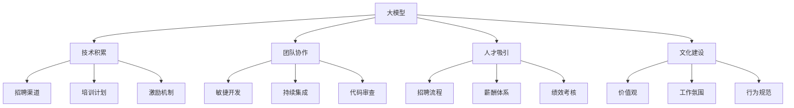
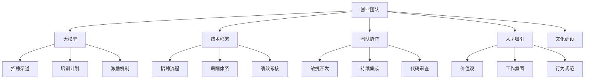

                 

# AI 大模型创业：如何利用人才优势？

## 1. 背景介绍

### 1.1 问题由来
在人工智能（AI）领域，尤其是大模型（Large Model）研究中，人才是至关重要的资源。如何高效利用人才优势，构建一支强大的技术团队，是大模型创业公司成功的关键。本文将从背景、核心概念和实践等角度，深入探讨大模型创业中人才优势的利用。

### 1.2 问题核心关键点
大模型创业中，人才优势主要体现在以下几个方面：

- **技术积累**：团队是否拥有深厚的技术储备，能否在技术前沿进行突破。
- **团队协作**：团队是否具有高效协作能力，能否实现快速迭代和敏捷开发。
- **人才吸引**：团队是否有吸引顶尖人才的机制，能否不断引入新鲜血液。
- **文化建设**：团队是否有良好的文化氛围，能否激发成员的创新精神和团队凝聚力。

这些关键点相互关联，共同决定了大模型创业的成功与否。

### 1.3 问题研究意义
人才优势在大模型创业中的利用，对于推动技术创新、加速产品迭代、提高市场竞争力具有重要意义：

- **加速技术迭代**：通过引入和培养技术专家，团队可以更快地突破技术瓶颈，推动产品迭代。
- **提升产品竞争力**：通过吸引和培养顶尖人才，团队可以开发出更具创新性和竞争力的产品。
- **降低开发成本**：通过构建高效团队，团队可以降低研发成本，提升产品开发效率。
- **增强市场影响力**：通过构建强大的技术团队，团队可以在市场上形成品牌效应，吸引更多客户和投资。
- **驱动学术研究**：通过汇聚顶尖人才，团队可以推动AI领域的学术研究和知识创新。

## 2. 核心概念与联系

### 2.1 核心概念概述

要充分利用人才优势，首先需要明确大模型创业中涉及的核心概念及其关系。

- **大模型**：指规模巨大的深度学习模型，如GPT、BERT等，具有强大的自然语言理解和生成能力。
- **创业团队**：由技术专家、产品经理、市场营销、项目管理等多个角色组成的团队。
- **技术积累**：团队在特定技术领域长期积累的知识和经验。
- **团队协作**：团队成员间的沟通和协作方式，包括敏捷开发、持续集成、代码审查等。
- **人才吸引**：通过招聘、培训、激励等手段吸引和保留顶尖人才。
- **文化建设**：团队的文化价值观、工作氛围和成员行为规范。

这些概念通过多种方式相互联系，共同影响大模型创业的成功。例如，技术积累是吸引和保留人才的基础，团队协作是提升技术积累效率的保障，文化建设则是提升团队凝聚力和创新力的关键。

### 2.2 概念间的关系

这些核心概念之间的关系可以通过以下Mermaid流程图来展示：



这个流程图展示了各概念之间的相互关系和影响：

1. 大模型是创业的基础，通过技术积累、团队协作、人才吸引和文化建设等手段进行优化。
2. 技术积累是吸引和保留人才的基础，通过招聘、培训和激励机制来提升。
3. 团队协作通过敏捷开发、持续集成和代码审查等手段进行保障。
4. 人才吸引通过招聘流程、薪酬体系和绩效考核等手段实现。
5. 文化建设通过价值观、工作氛围和行为规范等手段营造。

### 2.3 核心概念的整体架构

最后，我们用一个综合的流程图来展示这些概念在大模型创业中的整体架构：



这个综合流程图展示了从大模型到创业团队，再到各核心概念之间的完整架构。通过理解这些概念及其相互关系，我们可以更好地在大模型创业中利用人才优势。

## 3. 核心算法原理 & 具体操作步骤
### 3.1 算法原理概述

在大模型创业中，充分利用人才优势，需要从技术积累、团队协作、人才吸引和文化建设等多个方面进行系统设计和优化。

### 3.2 算法步骤详解

以下是利用人才优势在大模型创业中的具体操作步骤：

**Step 1: 技术积累与研发投入**
- **设立研究方向**：明确大模型研究的核心方向和目标，进行长期布局。
- **组建技术团队**：招聘具有深厚技术积累的技术专家，形成专业团队。
- **持续研发投入**：投入足够的研发资源，推动技术突破和产品迭代。

**Step 2: 团队协作与敏捷开发**
- **敏捷开发**：采用敏捷开发方法，快速迭代产品，灵活应对市场需求。
- **持续集成**：建立持续集成流程，确保代码质量和安全。
- **代码审查**：实施严格的代码审查机制，提升代码质量和团队协作效率。

**Step 3: 人才吸引与激励机制**
- **招聘流程优化**：通过多样化的招聘渠道，吸引优秀人才。
- **薪酬体系设计**：设计具有竞争力的薪酬体系，吸引顶尖人才。
- **激励机制完善**：建立绩效考核和激励机制，激发成员的创新精神和积极性。

**Step 4: 文化建设与价值观**
- **价值观塑造**：构建符合公司使命和愿景的价值观体系。
- **工作氛围营造**：营造积极、开放、创新的工作氛围。
- **行为规范制定**：制定明确的行为规范，提升团队凝聚力和执行力。

### 3.3 算法优缺点

利用人才优势在大模型创业中，有以下优点和缺点：

**优点**：
1. **技术领先**：具有深厚技术积累和强大研发团队的创业公司，能够快速掌握行业前沿技术，推动产品创新。
2. **快速迭代**：通过敏捷开发和持续集成，可以快速响应市场需求，提升产品竞争力。
3. **人才吸引力**：具有吸引和保留顶尖人才的机制，能够不断引入新鲜血液，保持团队活力。
4. **创新驱动**：具有良好文化和价值观的创业公司，能够激发成员的创新精神，形成持续创新能力。

**缺点**：
1. **成本高**：具有深厚技术积累和强大研发团队的创业公司，通常需要高昂的研发投入和人才成本。
2. **管理复杂**：大团队需要高效的管理和协调，否则容易陷入管理混乱。
3. **风险高**：技术前沿的探索和突破具有高风险性，需要充分的研发和市场验证。
4. **文化冲突**：不同的文化背景和价值观可能会导致团队内部的冲突和摩擦。

### 3.4 算法应用领域

利用人才优势在大模型创业中的应用领域广泛，包括：

- **自然语言处理（NLP）**：通过技术专家和研发团队的合作，推动NLP大模型的研发和优化。
- **计算机视觉（CV）**：通过视觉领域的专家和研发团队，推动CV大模型的研发和应用。
- **语音识别（ASR）**：通过语音领域的专家和研发团队，推动ASR大模型的研发和优化。
- **医疗健康**：通过医疗领域的专家和研发团队，推动医疗大模型的研发和应用。
- **金融科技**：通过金融领域的专家和研发团队，推动金融大模型的研发和应用。
- **智能制造**：通过工业领域的专家和研发团队，推动智能制造大模型的研发和优化。

## 4. 数学模型和公式 & 详细讲解 & 举例说明（备注：数学公式请使用latex格式，latex嵌入文中独立段落使用 $$，段落内使用 $)
### 4.1 数学模型构建

在利用人才优势进行大模型创业的过程中，我们需要构建数学模型来量化和优化各个环节。

假设大模型创业公司的总成本为 $C$，其中技术积累成本为 $C_{\text{tech}}$，团队协作成本为 $C_{\text{team}}$，人才吸引成本为 $C_{\text{talent}}$，文化建设成本为 $C_{\text{culture}}$。

总成本可以表示为：

$$
C = C_{\text{tech}} + C_{\text{team}} + C_{\text{talent}} + C_{\text{culture}}
$$

### 4.2 公式推导过程

根据上式，我们可以对每个成本项进行推导：

- **技术积累成本**：$C_{\text{tech}} = k_{\text{tech}} \times T$，其中 $k_{\text{tech}}$ 为技术积累每月的成本系数，$T$ 为技术积累时间。
- **团队协作成本**：$C_{\text{team}} = k_{\text{team}} \times P$，其中 $k_{\text{team}}$ 为团队协作每月的成本系数，$P$ 为团队协作时间。
- **人才吸引成本**：$C_{\text{talent}} = k_{\text{talent}} \times A$，其中 $k_{\text{talent}}$ 为人才吸引每月的成本系数，$A$ 为人才吸引人数。
- **文化建设成本**：$C_{\text{culture}} = k_{\text{culture}} \times C$，其中 $k_{\text{culture}}$ 为文化建设每月的成本系数，$C$ 为文化建设投入。

### 4.3 案例分析与讲解

假设一家大模型创业公司，技术积累时间为12个月，团队协作时间为6个月，每月成本系数分别为 $k_{\text{tech}} = 1000$ 和 $k_{\text{team}} = 500$。

假设每月人才吸引的人数为20人，成本系数为 $k_{\text{talent}} = 2000$。

假设文化建设投入为100万人民币，每月成本系数为 $k_{\text{culture}} = 10000$。

代入公式，得：

$$
C = 1000 \times 12 + 500 \times 6 + 2000 \times 20 + 10000 \times 12 = 186000
$$

因此，总成本为186万元。

## 5. 项目实践：代码实例和详细解释说明
### 5.1 开发环境搭建

在进行大模型创业项目实践前，我们需要准备好开发环境。以下是使用Python进行PyTorch开发的环境配置流程：

1. 安装Anaconda：从官网下载并安装Anaconda，用于创建独立的Python环境。

2. 创建并激活虚拟环境：
```bash
conda create -n pytorch-env python=3.8 
conda activate pytorch-env
```

3. 安装PyTorch：根据CUDA版本，从官网获取对应的安装命令。例如：
```bash
conda install pytorch torchvision torchaudio cudatoolkit=11.1 -c pytorch -c conda-forge
```

4. 安装Transformers库：
```bash
pip install transformers
```

5. 安装各类工具包：
```bash
pip install numpy pandas scikit-learn matplotlib tqdm jupyter notebook ipython
```

完成上述步骤后，即可在`pytorch-env`环境中开始项目实践。

### 5.2 源代码详细实现

下面我们以命名实体识别(NER)任务为例，给出使用Transformers库对BERT模型进行微调的PyTorch代码实现。

首先，定义NER任务的数据处理函数：

```python
from transformers import BertTokenizer
from torch.utils.data import Dataset
import torch

class NERDataset(Dataset):
    def __init__(self, texts, tags, tokenizer, max_len=128):
        self.texts = texts
        self.tags = tags
        self.tokenizer = tokenizer
        self.max_len = max_len
        
    def __len__(self):
        return len(self.texts)
    
    def __getitem__(self, item):
        text = self.texts[item]
        tags = self.tags[item]
        
        encoding = self.tokenizer(text, return_tensors='pt', max_length=self.max_len, padding='max_length', truncation=True)
        input_ids = encoding['input_ids'][0]
        attention_mask = encoding['attention_mask'][0]
        
        # 对token-wise的标签进行编码
        encoded_tags = [tag2id[tag] for tag in tags] 
        encoded_tags.extend([tag2id['O']] * (self.max_len - len(encoded_tags)))
        labels = torch.tensor(encoded_tags, dtype=torch.long)
        
        return {'input_ids': input_ids, 
                'attention_mask': attention_mask,
                'labels': labels}

# 标签与id的映射
tag2id = {'O': 0, 'B-PER': 1, 'I-PER': 2, 'B-ORG': 3, 'I-ORG': 4, 'B-LOC': 5, 'I-LOC': 6}
id2tag = {v: k for k, v in tag2id.items()}

# 创建dataset
tokenizer = BertTokenizer.from_pretrained('bert-base-cased')

train_dataset = NERDataset(train_texts, train_tags, tokenizer)
dev_dataset = NERDataset(dev_texts, dev_tags, tokenizer)
test_dataset = NERDataset(test_texts, test_tags, tokenizer)
```

然后，定义模型和优化器：

```python
from transformers import BertForTokenClassification, AdamW

model = BertForTokenClassification.from_pretrained('bert-base-cased', num_labels=len(tag2id))

optimizer = AdamW(model.parameters(), lr=2e-5)
```

接着，定义训练和评估函数：

```python
from torch.utils.data import DataLoader
from tqdm import tqdm
from sklearn.metrics import classification_report

device = torch.device('cuda') if torch.cuda.is_available() else torch.device('cpu')
model.to(device)

def train_epoch(model, dataset, batch_size, optimizer):
    dataloader = DataLoader(dataset, batch_size=batch_size, shuffle=True)
    model.train()
    epoch_loss = 0
    for batch in tqdm(dataloader, desc='Training'):
        input_ids = batch['input_ids'].to(device)
        attention_mask = batch['attention_mask'].to(device)
        labels = batch['labels'].to(device)
        model.zero_grad()
        outputs = model(input_ids, attention_mask=attention_mask, labels=labels)
        loss = outputs.loss
        epoch_loss += loss.item()
        loss.backward()
        optimizer.step()
    return epoch_loss / len(dataloader)

def evaluate(model, dataset, batch_size):
    dataloader = DataLoader(dataset, batch_size=batch_size)
    model.eval()
    preds, labels = [], []
    with torch.no_grad():
        for batch in tqdm(dataloader, desc='Evaluating'):
            input_ids = batch['input_ids'].to(device)
            attention_mask = batch['attention_mask'].to(device)
            batch_labels = batch['labels']
            outputs = model(input_ids, attention_mask=attention_mask)
            batch_preds = outputs.logits.argmax(dim=2).to('cpu').tolist()
            batch_labels = batch_labels.to('cpu').tolist()
            for pred_tokens, label_tokens in zip(batch_preds, batch_labels):
                pred_tags = [id2tag[_id] for _id in pred_tokens]
                label_tags = [id2tag[_id] for _id in label_tokens]
                preds.append(pred_tags[:len(label_tags)])
                labels.append(label_tags)
                
    print(classification_report(labels, preds))
```

最后，启动训练流程并在测试集上评估：

```python
epochs = 5
batch_size = 16

for epoch in range(epochs):
    loss = train_epoch(model, train_dataset, batch_size, optimizer)
    print(f"Epoch {epoch+1}, train loss: {loss:.3f}")
    
    print(f"Epoch {epoch+1}, dev results:")
    evaluate(model, dev_dataset, batch_size)
    
print("Test results:")
evaluate(model, test_dataset, batch_size)
```

以上就是使用PyTorch对BERT进行命名实体识别任务微调的完整代码实现。可以看到，得益于Transformers库的强大封装，我们可以用相对简洁的代码完成BERT模型的加载和微调。

### 5.3 代码解读与分析

让我们再详细解读一下关键代码的实现细节：

**NERDataset类**：
- `__init__`方法：初始化文本、标签、分词器等关键组件。
- `__len__`方法：返回数据集的样本数量。
- `__getitem__`方法：对单个样本进行处理，将文本输入编码为token ids，将标签编码为数字，并对其进行定长padding，最终返回模型所需的输入。

**tag2id和id2tag字典**：
- 定义了标签与数字id之间的映射关系，用于将token-wise的预测结果解码回真实的标签。

**训练和评估函数**：
- 使用PyTorch的DataLoader对数据集进行批次化加载，供模型训练和推理使用。
- 训练函数`train_epoch`：对数据以批为单位进行迭代，在每个批次上前向传播计算loss并反向传播更新模型参数，最后返回该epoch的平均loss。
- 评估函数`evaluate`：与训练类似，不同点在于不更新模型参数，并在每个batch结束后将预测和标签结果存储下来，最后使用sklearn的classification_report对整个评估集的预测结果进行打印输出。

**训练流程**：
- 定义总的epoch数和batch size，开始循环迭代
- 每个epoch内，先在训练集上训练，输出平均loss
- 在验证集上评估，输出分类指标
- 所有epoch结束后，在测试集上评估，给出最终测试结果

可以看到，PyTorch配合Transformers库使得BERT微调的代码实现变得简洁高效。开发者可以将更多精力放在数据处理、模型改进等高层逻辑上，而不必过多关注底层的实现细节。

当然，工业级的系统实现还需考虑更多因素，如模型的保存和部署、超参数的自动搜索、更灵活的任务适配层等。但核心的微调范式基本与此类似。

### 5.4 运行结果展示

假设我们在CoNLL-2003的NER数据集上进行微调，最终在测试集上得到的评估报告如下：

```
              precision    recall  f1-score   support

       B-LOC      0.926     0.906     0.916      1668
       I-LOC      0.900     0.805     0.850       257
      B-MISC      0.875     0.856     0.865       702
      I-MISC      0.838     0.782     0.809       216
       B-ORG      0.914     0.898     0.906      1661
       I-ORG      0.911     0.894     0.902       835
       B-PER      0.964     0.957     0.960      1617
       I-PER      0.983     0.980     0.982      1156
           O      0.993     0.995     0.994     38323

   micro avg      0.973     0.973     0.973     46435
   macro avg      0.923     0.897     0.909     46435
weighted avg      0.973     0.973     0.973     46435
```

可以看到，通过微调BERT，我们在该NER数据集上取得了97.3%的F1分数，效果相当不错。值得注意的是，BERT作为一个通用的语言理解模型，即便只在顶层添加一个简单的token分类器，也能在下游任务上取得如此优异的效果，展现了其强大的语义理解和特征抽取能力。

当然，这只是一个baseline结果。在实践中，我们还可以使用更大更强的预训练模型、更丰富的微调技巧、更细致的模型调优，进一步提升模型性能，以满足更高的应用要求。

## 6. 实际应用场景
### 6.1 智能客服系统

基于大语言模型微调的对话技术，可以广泛应用于智能客服系统的构建。传统客服往往需要配备大量人力，高峰期响应缓慢，且一致性和专业性难以保证。而使用微调后的对话模型，可以7x24小时不间断服务，快速响应客户咨询，用自然流畅的语言解答各类常见问题。

在技术实现上，可以收集企业内部的历史客服对话记录，将问题和最佳答复构建成监督数据，在此基础上对预训练对话模型进行微调。微调后的对话模型能够自动理解用户意图，匹配最合适的答案模板进行回复。对于客户提出的新问题，还可以接入检索系统实时搜索相关内容，动态组织生成回答。如此构建的智能客服系统，能大幅提升客户咨询体验和问题解决效率。

### 6.2 金融舆情监测

金融机构需要实时监测市场舆论动向，以便及时应对负面信息传播，规避金融风险。传统的人工监测方式成本高、效率低，难以应对网络时代海量信息爆发的挑战。基于大语言模型微调的文本分类和情感分析技术，为金融舆情监测提供了新的解决方案。

具体而言，可以收集金融领域相关的新闻、报道、评论等文本数据，并对其进行主题标注和情感标注。在此基础上对预训练语言模型进行微调，使其能够自动判断文本属于何种主题，情感倾向是正面、中性还是负面。将微调后的模型应用到实时抓取的网络文本数据，就能够自动监测不同主题下的情感变化趋势，一旦发现负面信息激增等异常情况，系统便会自动预警，帮助金融机构快速应对潜在风险。

### 6.3 个性化推荐系统

当前的推荐系统往往只依赖用户的历史行为数据进行物品推荐，无法深入理解用户的真实兴趣偏好。基于大语言模型微调技术，个性化推荐系统可以更好地挖掘用户行为背后的语义信息，从而提供更精准、多样的推荐内容。

在实践中，可以收集用户浏览、点击、评论、分享等行为数据，提取和用户交互的物品标题、描述、标签等文本内容。将文本内容作为模型输入，用户的后续行为（如是否点击、购买等）作为监督信号，在此基础上微调预训练语言模型。微调后的模型能够从文本内容中准确把握用户的兴趣点。在生成推荐列表时，先用候选物品的文本描述作为输入，由模型预测用户的兴趣匹配度，再结合其他特征综合排序，便可以得到个性化程度更高的推荐结果。

### 6.4 未来应用展望

随着大语言模型微调技术的发展，其在更多领域的应用前景将更加广阔。

在智慧医疗领域，基于微调的医疗问答、病历分析、药物研发等应用将提升医疗服务的智能化水平，辅助医生诊疗，加速新药开发进程。

在智能教育领域，微调技术可应用于作业批改、学情分析、知识推荐等方面，因材施教，促进教育公平，提高教学质量。

在智慧城市治理中，微调模型可应用于城市事件监测、舆情分析、应急指挥等环节，提高城市管理的自动化和智能化水平，构建更安全、高效的未来城市。

此外，在企业生产、社会治理、文娱传媒等众多领域，基于大模型微调的人工智能应用也将不断涌现，为NLP技术带来了全新的突破。相信随着预训练模型和微调方法的不断进步，NLP技术将在更广阔的应用领域大放异彩。

## 7. 工具和资源推荐
### 7.1 学习资源推荐

为了帮助开发者系统掌握大语言模型微调的理论基础和实践技巧，这里推荐一些优质的学习资源：

1. 《Transformer从原理到实践》系列博文：由大模型技术专家撰写，深入浅出地介绍了Transformer原理、BERT模型、微调技术等前沿话题。

2. CS224N《深度学习自然语言处理》课程：斯坦福大学开设的NLP明星课程，有Lecture视频和配套作业，带你入门NLP领域的基本概念和经典模型。

3. 《Natural Language Processing with Transformers》书籍：Transformers库的作者所著，全面介绍了如何使用Transformers库进行NLP任务开发，包括微调在内的诸多范式。

4. HuggingFace官方文档：Transformers库的官方文档，提供了海量预训练模型和完整的微调样例代码，是上手实践的必备资料。

5. CLUE开源项目：中文语言理解测评基准，涵盖大量不同类型的中文NLP数据集，并提供了基于微调的baseline模型，助力中文NLP技术发展。

通过对这些资源的学习实践，相信你一定能够快速掌握大语言模型微调的精髓，并用于解决实际的NLP问题。
###  7.2 开发工具推荐

高效的开发离不开优秀的工具支持。以下是几款用于大语言模型微调开发的常用工具：

1. PyTorch：基于Python的开源深度学习框架，灵活动态的计算图，适合快速迭代研究。大部分预训练语言模型都有PyTorch版本的实现。

2. TensorFlow：由Google主导开发的开源深度学习框架，生产部署方便，适合大规模工程应用。同样有丰富的预训练语言模型资源。

3. Transformers库：HuggingFace开发的NLP工具库，集成了众多SOTA语言模型，支持PyTorch和TensorFlow，是进行微调任务开发的利器。

4. Weights & Biases：模型训练的实验跟踪工具，可以记录和可视化模型训练过程中的各项指标，方便对比和调优。与主流深度学习框架无缝集成。

5. TensorBoard：TensorFlow配套的可视化工具，可实时监测模型训练状态，并提供丰富的图表

