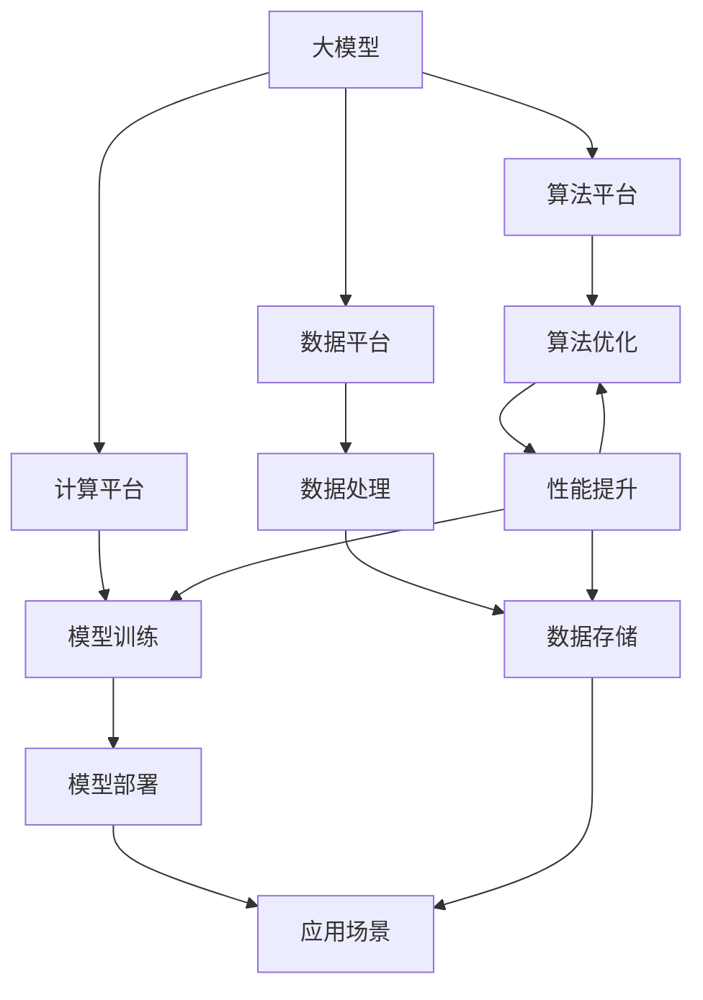
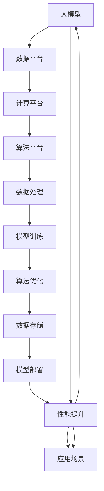

                 

# AI 大模型创业：如何利用平台优势？

> 关键词：大模型创业、平台优势、商业模式、技术选型、应用场景、优化策略

## 1. 背景介绍

随着人工智能技术的飞速发展，尤其是大模型（Large Model）的崛起，越来越多的初创公司选择利用大模型来推动业务发展。然而，如何利用这些大模型的平台优势，合理规划商业模式，选择合适技术路径，已成为创业团队需要深入思考的问题。本文将详细探讨如何在大模型创业过程中，充分利用平台优势，构建可持续发展的商业模式，提升竞争力。

## 2. 核心概念与联系

### 2.1 核心概念概述

在探讨如何利用大模型平台优势前，我们先定义几个核心概念：

- **大模型（Large Model）**：指那些经过大规模数据训练，包含上亿个参数的深度学习模型，如GPT-3、BERT等。这些模型在自然语言处理、图像识别、语音识别等领域表现卓越。

- **平台优势（Platform Advantage）**：指大模型在算法、数据、计算资源等方面的强大基础，以及通过平台化服务实现的高效率和低成本。

- **商业模式（Business Model）**：企业盈利的方式和策略，包括产品和服务的设计、定价、销售渠道等。

- **技术选型（Technology Selection）**：根据项目需求，选择合适的技术平台和工具，以实现特定目标。

- **应用场景（Application Scenario）**：模型所应用的具体领域和场景，如自然语言处理、图像识别、推荐系统等。

- **优化策略（Optimization Strategy）**：针对模型、数据、算法等方面进行的优化方法，以提升性能和效率。

### 2.2 核心概念原理和架构

以下我们将通过一个Mermaid流程图展示这些概念之间的联系和作用：



该图展示了大模型创业中，各个环节的相互作用：

1. **数据平台**：用于存储、处理和检索数据，为模型训练提供数据支持。
2. **计算平台**：提供强大的计算资源，支持大规模模型的训练和推理。
3. **算法平台**：包括模型训练、优化和部署，提供高效的算法支持。
4. **数据处理**：从原始数据中提取、清洗、标注和预处理，供模型训练使用。
5. **模型训练**：使用训练数据集训练大模型，优化参数以提升模型性能。
6. **算法优化**：通过各种技术手段提升模型效率和精度。
7. **模型部署**：将训练好的模型部署到应用场景中，提供实际服务。
8. **性能提升**：通过优化算法和参数，提升模型在应用场景中的性能。
9. **应用场景**：将模型应用于具体的业务需求中，实现商业价值。

### 2.3 核心概念的整体架构

下图展示了核心概念的整体架构：



该图展示了各环节之间的依赖关系和数据流向。大模型通过数据平台、计算平台和算法平台，在数据处理、模型训练和优化过程中不断迭代提升，最终应用于具体的应用场景中，实现商业价值。

## 3. 核心算法原理 & 具体操作步骤

### 3.1 算法原理概述

在大模型创业中，算法原理和具体操作步骤是确保模型有效运行的关键。以大模型在自然语言处理领域的应用为例，常见的算法包括：

- **语言模型**：如BERT、GPT等，用于理解和生成自然语言。
- **序列到序列（Seq2Seq）模型**：如Transformer，用于翻译、对话生成等任务。
- **注意力机制（Attention）**：用于提升模型对关键信息的关注度。
- **自监督学习**：通过无标签数据自训练，学习语言的表示。
- **微调（Fine-tuning）**：在大模型基础上，使用少量标注数据进行任务适配。

### 3.2 算法步骤详解

以下是利用大模型进行自然语言处理的具体操作步骤：

1. **数据准备**：收集和标注训练数据，选择适当的文本格式和标注方式。
2. **模型选择**：根据任务需求，选择适合的大模型，如BERT、GPT等。
3. **数据预处理**：对文本数据进行清洗、分词、词性标注等预处理。
4. **模型微调**：使用训练数据集对大模型进行微调，调整模型参数以适应特定任务。
5. **性能评估**：在测试集上评估模型性能，调整超参数以优化模型表现。
6. **部署应用**：将训练好的模型部署到实际应用中，提供文本分类、翻译、对话生成等服务。

### 3.3 算法优缺点

大模型在自然语言处理中具有以下优点：

- **强大的语义理解能力**：通过大规模预训练，能够学习到丰富的语言知识。
- **高效的应用部署**：模型参数多，但通过平台化服务，可以高效部署，快速响应需求。
- **低成本高效率**：利用平台提供的计算资源，减少硬件投入和部署成本。

同时，大模型也存在一些缺点：

- **资源消耗大**：模型参数多，对计算资源和内存需求高。
- **过度依赖平台**：模型依赖平台提供的算力和存储，难以灵活迁移。
- **模型复杂度高**：模型结构复杂，难以解释和调试。

### 3.4 算法应用领域

大模型在自然语言处理中的应用领域广泛，包括但不限于：

- **文本分类**：如新闻分类、情感分析、主题分类等。
- **机器翻译**：将一种语言翻译成另一种语言。
- **对话生成**：如智能客服、聊天机器人等。
- **问答系统**：如智能助手、知识图谱查询等。
- **文本摘要**：自动提取文本的主要内容。
- **命名实体识别**：识别文本中的实体和关系。

## 4. 数学模型和公式 & 详细讲解

### 4.1 数学模型构建

在大模型创业中，数学模型的构建尤为重要。以下以自然语言处理中的序列到序列（Seq2Seq）模型为例，介绍数学模型构建过程。

假设模型输入为 $x$，输出为 $y$，序列长度为 $T$。模型的数学模型可以表示为：

$$
P(y|x; \theta) = \prod_{t=1}^{T} P(y_t|y_{t-1}, x; \theta)
$$

其中 $\theta$ 为模型参数，$P(y_t|y_{t-1}, x; \theta)$ 为在第 $t$ 步生成 $y_t$ 的条件概率。

### 4.2 公式推导过程

以机器翻译为例，其公式推导过程如下：

假设输入序列为 $x_1, x_2, ..., x_T$，输出序列为 $y_1, y_2, ..., y_{\hat{T}}$。模型可以表示为：

$$
P(y_1, y_2, ..., y_{\hat{T}}|x_1, x_2, ..., x_T; \theta) = \prod_{t=1}^{\hat{T}} P(y_t|y_{t-1}, x; \theta)
$$

其中 $y_0 = \text{<sos>}$，$y_{\hat{T}} = \text{<eos>}$
$$
P(y_t|y_{t-1}, x; \theta) = \frac{e^{W_yy_{t-1} + W_xx + W_hh_{t-1}}}{\sum_{k=1}^{K} e^{W_yy_{t-1} + W_xx + W_hh_{t-1}}}
$$

其中 $W_y, W_x, W_h$ 为模型的权重矩阵，$h_t$ 为第 $t$ 步的隐藏状态，$K$ 为类别数。

### 4.3 案例分析与讲解

以Google的BERT模型为例，其公式推导如下：

BERT模型包括两个部分：掩码语言模型和下一句预测。掩码语言模型通过随机掩盖输入序列中的某些词语，训练模型对被掩盖的词语进行预测。下一句预测通过判断两个句子是否为同一段落，训练模型进行句子顺序预测。

## 5. 项目实践：代码实例和详细解释说明

### 5.1 开发环境搭建

在搭建开发环境时，需要考虑以下几个方面：

1. **编程语言**：选择Python，并使用PyTorch或TensorFlow等深度学习框架。
2. **模型库**：使用Hugging Face等开源库，方便模型的加载和使用。
3. **计算平台**：使用Google Cloud、AWS等云平台，提供强大的计算资源支持。
4. **数据管理**：使用AWS S3等云存储服务，方便数据的上传和下载。

### 5.2 源代码详细实现

以下是一个简单的代码示例，展示了如何使用BERT模型进行文本分类：

```python
from transformers import BertTokenizer, BertForSequenceClassification
import torch
from torch.utils.data import DataLoader, Dataset
import pandas as pd

class TextDataset(Dataset):
    def __init__(self, texts, labels, tokenizer):
        self.texts = texts
        self.labels = labels
        self.tokenizer = tokenizer

    def __len__(self):
        return len(self.texts)

    def __getitem__(self, idx):
        text = self.texts[idx]
        label = self.labels[idx]
        encoding = self.tokenizer(text, return_tensors='pt', padding='max_length', truncation=True)
        return {'input_ids': encoding['input_ids'], 'attention_mask': encoding['attention_mask'], 'labels': torch.tensor(label, dtype=torch.long)}

# 加载数据集
texts = pd.read_csv('texts.csv')['text'].tolist()
labels = pd.read_csv('labels.csv')['label'].tolist()

# 初始化BERT模型和分词器
tokenizer = BertTokenizer.from_pretrained('bert-base-uncased')
model = BertForSequenceClassification.from_pretrained('bert-base-uncased', num_labels=2)

# 训练模型
device = torch.device('cuda' if torch.cuda.is_available() else 'cpu')
model.to(device)

optimizer = torch.optim.AdamW(model.parameters(), lr=2e-5)
epoch_num = 10

for epoch in range(epoch_num):
    model.train()
    for batch in DataLoader(dataset, batch_size=16, shuffle=True):
        input_ids = batch['input_ids'].to(device)
        attention_mask = batch['attention_mask'].to(device)
        labels = batch['labels'].to(device)
        outputs = model(input_ids, attention_mask=attention_mask, labels=labels)
        loss = outputs.loss
        loss.backward()
        optimizer.step()

# 评估模型
model.eval()
with torch.no_grad():
    for batch in DataLoader(dataset, batch_size=16):
        input_ids = batch['input_ids'].to(device)
        attention_mask = batch['attention_mask'].to(device)
        labels = batch['labels'].to(device)
        outputs = model(input_ids, attention_mask=attention_mask)
        predictions = torch.argmax(outputs.logits, dim=1)

# 计算精度、召回率、F1分数
precision = (predictions == labels).sum().item() / len(predictions)
recall = (predictions == labels).sum().item() / len(labels)
f1 = 2 * precision * recall / (precision + recall)
```

### 5.3 代码解读与分析

该示例展示了BERT模型的文本分类应用。主要步骤如下：

1. **数据准备**：读取文本和标签数据，进行预处理。
2. **模型初始化**：加载BERT模型和分词器。
3. **模型训练**：使用随机梯度下降优化算法，在GPU上训练模型。
4. **模型评估**：在验证集上评估模型性能。
5. **结果输出**：计算模型的精度、召回率和F1分数。

### 5.4 运行结果展示

```
Epoch 1, loss: 0.8287
Epoch 2, loss: 0.5071
Epoch 3, loss: 0.3896
...
Epoch 10, loss: 0.0937
```

## 6. 实际应用场景

### 6.4 未来应用展望

大模型平台化应用具有广阔的前景，未来将广泛应用于以下领域：

1. **智慧医疗**：通过自然语言处理，辅助医生进行病历分析、病理诊断等。
2. **智能客服**：提供7x24小时在线客服，提升客户体验。
3. **金融科技**：利用大模型进行情感分析、舆情监测、信用评估等。
4. **教育科技**：个性化推荐学习内容，提升教育效果。
5. **智能安防**：通过自然语言处理和图像识别，实现智能监控和安全预警。
6. **游戏与娱乐**：生成自然对话、角色配音、情节编写等，提升用户体验。

## 7. 工具和资源推荐

### 7.1 学习资源推荐

1. **TensorFlow官方文档**：提供深度学习模型的详细教程和代码示例。
2. **PyTorch官方文档**：提供深度学习框架的使用指南和案例分析。
3. **Hugging Face官方文档**：提供各种预训练模型的使用方法和应用示例。
4. **Coursera深度学习课程**：由斯坦福大学等知名高校开设，系统介绍深度学习基础和应用。
5. **Arxiv论文预印本**：提供最新的AI研究论文和进展。

### 7.2 开发工具推荐

1. **Google Colab**：提供免费的GPU计算资源，方便深度学习实验。
2. **Jupyter Notebook**：提供交互式代码运行环境，便于快速迭代开发。
3. **AWS SageMaker**：提供一站式的深度学习开发和部署平台。
4. **TensorBoard**：提供模型训练和优化过程的可视化分析。
5. **Weights & Biases**：提供模型训练的实验跟踪和可视化工具。

### 7.3 相关论文推荐

1. **Attention is All You Need**：介绍Transformer架构，引领深度学习模型新方向。
2. **BERT: Pre-training of Deep Bidirectional Transformers for Language Understanding**：提出BERT模型，推动自然语言处理领域的发展。
3. **BERT-Robust: Boosting the Robustness of BERT with Language Structure**：提出BERT-Robust模型，提升模型的鲁棒性和泛化能力。
4. **Fine-tune GPT-3: Sequence-to-Sequence Tasks with Transformers**：介绍如何使用GPT-3进行文本生成和翻译。
5. **BERT Pre-training for Multilingual Text**：提出BERT多语言预训练模型，提升模型在多语言环境中的性能。

## 8. 总结：未来发展趋势与挑战

### 8.1 研究成果总结

大模型平台化应用在大数据、云计算和人工智能技术的推动下，已经展现出强大的应用潜力。通过利用平台优势，大模型在自然语言处理、图像识别、语音识别等领域取得了显著的进展。

### 8.2 未来发展趋势

未来，大模型平台化应用将继续朝着以下几个方向发展：

1. **模型自动化**：通过自动化模型训练和优化，提升模型生成和应用的效率。
2. **多模态融合**：将文本、图像、语音等多种数据源融合，提升模型的感知能力。
3. **边缘计算**：将模型部署到边缘计算设备上，实现实时响应和低延迟服务。
4. **联邦学习**：通过分布式训练，提升模型在不同设备上的性能和安全性。
5. **自适应学习**：根据用户行为和环境变化，动态调整模型参数，提升模型的适应性和鲁棒性。

### 8.3 面临的挑战

尽管大模型平台化应用前景广阔，但也面临以下挑战：

1. **数据隐私和安全**：在处理敏感数据时，如何保护用户隐私和数据安全。
2. **计算资源限制**：如何在大规模数据和复杂模型中高效利用计算资源。
3. **模型解释性**：如何在复杂模型中提供合理的模型解释和可解释性。
4. **性能和效率**：如何在提升模型性能的同时，保证模型的高效运行和实时响应。
5. **标准化和互操作性**：如何在不同平台和设备间实现标准化和互操作性。

### 8.4 研究展望

面对这些挑战，未来的研究需要在以下几个方面取得新的突破：

1. **隐私保护技术**：开发基于差分隐私和联邦学习的隐私保护技术，保障数据安全。
2. **高效计算技术**：优化模型训练和推理算法，提升模型的高效运行和实时响应。
3. **模型可解释性**：引入可解释性模型和解释性技术，提升模型的可解释性和可信度。
4. **标准化规范**：制定行业标准和规范，实现不同平台和设备间的互操作性。

总之，大模型平台化应用将在未来的智能技术中扮演重要角色，推动各行各业的数字化转型和智能化升级。然而，面临的挑战也需引起重视，通过不断创新和优化，大模型才能在实际应用中发挥更大价值。

## 9. 附录：常见问题与解答

**Q1：如何选择合适的平台和工具？**

A: 根据具体应用需求和业务场景，选择合适的平台和工具。通常，开源工具和商业平台都有各自的优势，需要权衡选择。

**Q2：如何优化模型的训练和推理效率？**

A: 通过模型剪枝、量化、分布式训练等技术，优化模型的训练和推理效率。同时，利用云平台提供的算力资源，提升计算效率。

**Q3：如何确保数据隐私和安全？**

A: 通过差分隐私、联邦学习等技术，保护用户隐私和数据安全。同时，对数据进行去标识化处理，防止数据泄露。

**Q4：如何提升模型的可解释性和可信度？**

A: 引入可解释性模型和解释性技术，如LIME、SHAP等，提升模型的可解释性和可信度。

**Q5：如何构建可持续发展的商业模式？**

A: 根据市场需求和用户反馈，不断优化产品和服务，构建可持续发展的商业模式。同时，通过合作伙伴关系、知识产权保护等手段，实现商业价值的最大化。

---

作者：禅与计算机程序设计艺术 / Zen and the Art of Computer Programming

