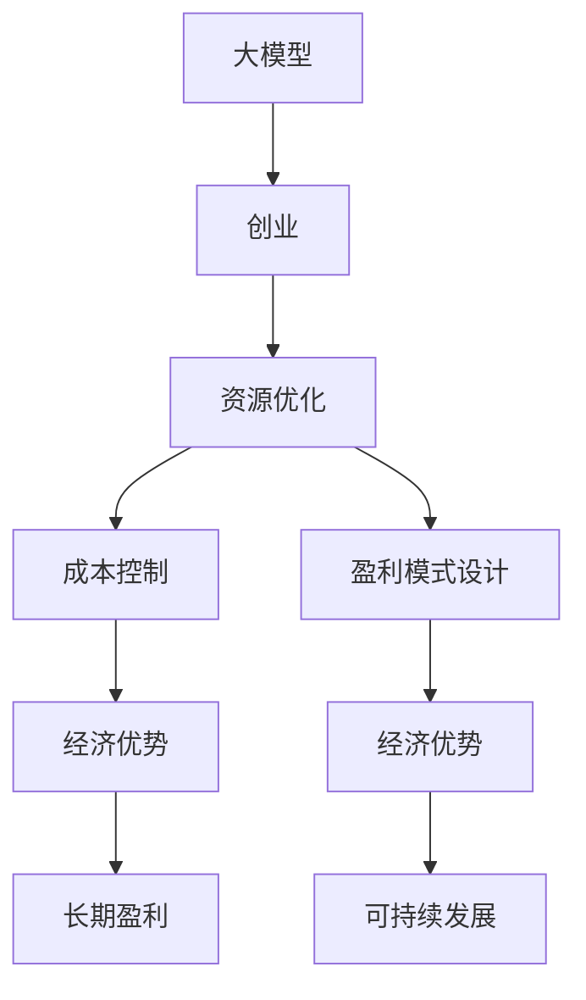

                 

# AI 大模型创业：如何利用经济优势？

> 关键词：AI大模型,创业,经济优势,资源优化,成本控制,市场竞争,盈利模式

## 1. 背景介绍

在人工智能（AI）技术迅猛发展的今天，大模型正逐渐成为推动AI应用落地的关键驱动力。从自然语言处理（NLP）到计算机视觉（CV），再到机器人技术，大模型的应用领域几乎遍及各个角落。大模型的优势在于其强大的泛化能力、高度灵活的迁移学习特性以及快速迭代的模型训练能力，因此受到广泛关注。然而，随之而来的问题是大模型的开发和维护成本极高，直接影响了创业公司的盈利能力和市场竞争力。本文将从创业公司的视角出发，探讨如何在大模型创业中充分利用经济优势，平衡成本与收益，实现可持续发展。

## 2. 核心概念与联系

### 2.1 核心概念概述

要利用经济优势进行AI大模型创业，首先需要理解几个关键概念：

- **大模型**：指大规模的深度学习模型，如BERT、GPT等，通常包含数十亿个参数，能够在复杂的任务上实现较高的准确率。
- **创业**：在资源有限的情况下，通过创新和优化，以最小的成本实现最大化的收益。
- **经济优势**：通过有效的资源管理、成本控制和盈利模式设计，实现创业项目的长期盈利和可持续发展。

### 2.2 概念间的关系

这些概念之间存在密切联系。大模型创业的核心理念是利用有限的资源，通过优化模型训练和应用流程，在短时间内获得高质量的AI应用成果。经济优势的利用则是通过合理配置资源、控制成本和创新盈利模式，使创业公司能够持续运营并不断提升市场竞争力。以下是一个简单的Mermaid流程图，展示了这些概念之间的联系：



这个流程图说明了从大模型的开发到创业公司可持续发展的全过程，关键在于如何优化资源、控制成本、设计盈利模式，最终实现经济优势。

## 3. 核心算法原理 & 具体操作步骤

### 3.1 算法原理概述

大模型创业的经济优势主要体现在以下几个方面：

- **资源优化**：合理配置计算资源、内存、存储等，减少不必要的硬件投入。
- **成本控制**：通过数据增强、模型压缩等技术，减少训练和推理成本。
- **盈利模式设计**：采用订阅制、按需付费等灵活的收费方式，最大化盈利潜力。

### 3.2 算法步骤详解

以下是具体实施步骤：

#### 3.2.1 资源优化

1. **硬件选择**：
   - 选择性价比高的硬件，如使用混合精度训练，将浮点数运算转换为半精度运算，显著降低计算成本。
   - 使用云计算平台，按需扩展计算资源，减少硬件采购和维护成本。

2. **数据管理**：
   - 采用数据增强技术，如回译、噪声注入等，在少量标注数据上训练出高质量模型，减少数据标注成本。
   - 使用数据压缩和存储优化技术，减少数据存储和读取成本。

3. **模型压缩**：
   - 使用量化技术，将高精度模型转换为低精度模型，减小模型尺寸，降低存储和计算成本。
   - 使用剪枝和蒸馏技术，去除冗余参数，优化模型结构，提高模型推理效率。

#### 3.2.2 成本控制

1. **数据增强**：
   - 使用文本清洗、生成对抗网络（GAN）等技术，扩充训练集，减少标注数据需求。
   - 采用迁移学习，利用预训练模型的知识，减少训练时间，降低成本。

2. **模型压缩**：
   - 使用知识蒸馏技术，通过知识传递，将大模型转化为小模型，提高模型推理效率。
   - 使用动态架构，根据数据分布动态调整模型结构，避免过度拟合。

3. **高效微调**：
   - 使用参数高效微调方法，只更新部分模型参数，减少微调过程中的计算量和成本。
   - 采用对抗训练，提升模型鲁棒性，减少微调样本数量，降低数据成本。

#### 3.2.3 盈利模式设计

1. **订阅制**：
   - 为中小型企业提供按月或按年订阅的付费服务，稳定收入来源。
   - 根据企业规模和需求，提供不同的服务套餐，满足不同层次客户需求。

2. **按需付费**：
   - 按实际使用量收费，根据客户需求动态调整计费方式，降低一次性投入成本。
   - 提供API接口，企业可根据使用量灵活计费，提高资源利用率。

3. **模型销售**：
   - 开发高质量大模型，并对外销售，通过模型授权收入提升盈利能力。
   - 通过开源模型与商业模型相结合，建立开源社区，提升品牌影响力。

### 3.3 算法优缺点

#### 优点

- **高灵活性**：可灵活选择计算资源和数据策略，最大化资源利用率。
- **低成本**：通过优化算法和成本控制措施，有效降低硬件和数据成本。
- **高收益**：通过订阅制、按需付费等盈利模式，实现长期盈利和可持续发展。

#### 缺点

- **复杂性**：需要投入大量时间和精力进行资源管理和成本控制，技术要求较高。
- **风险**：算法和模型选择不当可能导致资源浪费和市场竞争不足。

### 3.4 算法应用领域

大模型的经济优势在多个领域都有广泛应用，例如：

- **自然语言处理**：通过优化模型训练流程和资源管理，减少训练和推理成本，提高模型效果。
- **计算机视觉**：使用数据增强和模型压缩技术，降低数据和计算成本，提升模型性能。
- **机器人技术**：通过高效的模型微调和资源优化，减少硬件投入，提高机器人系统的实时性和稳定性。
- **医疗诊断**：采用高效微调方法，快速生成高质量模型，提升诊断效率和准确率。
- **金融分析**：利用大数据增强和模型优化技术，降低计算和存储成本，提供高精度金融预测服务。

## 4. 数学模型和公式 & 详细讲解

### 4.1 数学模型构建

大模型创业的经济优势可以通过以下数学模型进行量化：

- **资源优化模型**：
  $$
  \min_{C} \left\{ \sum_{i} c_i x_i \right\}
  $$
  其中，$C$ 表示成本向量，$c_i$ 表示第 $i$ 种资源的单位成本，$x_i$ 表示第 $i$ 种资源的投入量。

- **成本控制模型**：
  $$
  \min_{T} \left\{ \sum_{j} t_j y_j \right\}
  $$
  其中，$T$ 表示训练时间，$t_j$ 表示第 $j$ 个训练步骤的单位时间成本，$y_j$ 表示第 $j$ 个训练步骤的执行时间。

- **盈利模式模型**：
  $$
  \max_{R} \left\{ r \sum_{k} r_k \right\}
  $$
  其中，$R$ 表示收入向量，$r_k$ 表示第 $k$ 种收入来源，$r$ 表示单位收入成本。

### 4.2 公式推导过程

#### 4.2.1 资源优化模型推导

资源优化模型旨在最小化总成本，表达式为：
$$
\min_{C} \left\{ \sum_{i} c_i x_i \right\}
$$
其中，$c_i$ 表示第 $i$ 种资源的单位成本，$x_i$ 表示第 $i$ 种资源的投入量。

通过拉格朗日乘子法，可以得到以下优化条件：
$$
\begin{cases}
\frac{\partial \mathcal{L}}{\partial x_i} = 0 & i=1,...,m \\
\frac{\partial \mathcal{L}}{\partial \lambda} = 0
\end{cases}
$$
其中，$\mathcal{L}$ 为拉格朗日函数，$\lambda$ 为拉格朗日乘子。

通过解上述方程组，可以得到最优解 $x_i^*$，从而实现最小化总成本。

#### 4.2.2 成本控制模型推导

成本控制模型旨在最小化训练时间，表达式为：
$$
\min_{T} \left\{ \sum_{j} t_j y_j \right\}
$$
其中，$t_j$ 表示第 $j$ 个训练步骤的单位时间成本，$y_j$ 表示第 $j$ 个训练步骤的执行时间。

通过拉格朗日乘子法，可以得到以下优化条件：
$$
\begin{cases}
\frac{\partial \mathcal{L}}{\partial y_j} = 0 & j=1,...,n \\
\frac{\partial \mathcal{L}}{\partial \lambda} = 0
\end{cases}
$$
其中，$\mathcal{L}$ 为拉格朗日函数，$\lambda$ 为拉格朗日乘子。

通过解上述方程组，可以得到最优解 $y_j^*$，从而实现最小化训练时间。

#### 4.2.3 盈利模式模型推导

盈利模式模型旨在最大化收入，表达式为：
$$
\max_{R} \left\{ r \sum_{k} r_k \right\}
$$
其中，$r_k$ 表示第 $k$ 种收入来源，$r$ 表示单位收入成本。

通过拉格朗日乘子法，可以得到以下优化条件：
$$
\begin{cases}
\frac{\partial \mathcal{L}}{\partial r_k} = 0 & k=1,...,m \\
\frac{\partial \mathcal{L}}{\partial \lambda} = 0
\end{cases}
$$
其中，$\mathcal{L}$ 为拉格朗日函数，$\lambda$ 为拉格朗日乘子。

通过解上述方程组，可以得到最优解 $r_k^*$，从而实现最大化收入。

### 4.3 案例分析与讲解

以自然语言处理（NLP）为例，介绍如何通过经济优势进行大模型创业：

#### 4.3.1 数据管理

假设某创业公司需在大模型上进行训练，由于预算有限，只能收集到少量标注数据。此时可以采用数据增强技术，如回译和噪声注入，扩充训练集，减少数据标注成本。具体实现如下：

1. **回译增强**：
   - 将部分数据翻译成多种语言，再进行翻译回译，增加训练样本量。
   - 例如，将英文文本翻译成法文，再翻译回英文，增加噪声样本。

2. **噪声注入**：
   - 对文本数据进行随机插入、替换、删除等操作，生成噪声样本。
   - 例如，在句子中随机替换一个单词，增加训练样本的多样性。

#### 4.3.2 模型压缩

假设模型训练已基本完成，但推理速度较慢，内存占用较大。此时可以采用模型压缩技术，如量化和剪枝，降低模型大小，提高推理速度。具体实现如下：

1. **量化**：
   - 将高精度模型转换为低精度模型，如将浮点数运算转换为半精度浮点数运算，减少计算量和内存消耗。
   - 例如，使用TensorRT等工具进行量化处理，将模型从FP32转换为FP16。

2. **剪枝**：
   - 去除模型中的冗余参数，减少模型大小，提高推理速度。
   - 例如，使用Pruning工具进行剪枝，去除参数值较小且对模型性能影响不大的权重。

#### 4.3.3 高效微调

假设公司需要在特定任务上微调大模型，但无法收集到大量标注数据。此时可以采用高效微调方法，如知识蒸馏和对抗训练，减少微调样本数量，降低数据成本。具体实现如下：

1. **知识蒸馏**：
   - 利用预训练模型的知识，生成低精度模型，减少微调数据需求。
   - 例如，将大模型输出的概率分布作为训练标签，训练小模型，实现知识传递。

2. **对抗训练**：
   - 引入对抗样本，提高模型鲁棒性，减少微调样本数量。
   - 例如，使用FGSM等对抗训练方法，生成对抗样本，训练模型。

## 5. 项目实践：代码实例和详细解释说明

### 5.1 开发环境搭建

在进行大模型创业的经济优势优化时，首先需要搭建开发环境。以下是使用Python进行PyTorch开发的环境配置流程：

1. 安装Anaconda：从官网下载并安装Anaconda，用于创建独立的Python环境。

2. 创建并激活虚拟环境：
```bash
conda create -n pytorch-env python=3.8 
conda activate pytorch-env
```

3. 安装PyTorch：根据CUDA版本，从官网获取对应的安装命令。例如：
```bash
conda install pytorch torchvision torchaudio cudatoolkit=11.1 -c pytorch -c conda-forge
```

4. 安装各类工具包：
```bash
pip install numpy pandas scikit-learn matplotlib tqdm jupyter notebook ipython
```

完成上述步骤后，即可在`pytorch-env`环境中开始开发实践。

### 5.2 源代码详细实现

这里我们以BERT模型为例，展示如何使用Python进行数据增强和模型压缩的实现。

首先，定义数据增强函数：

```python
import torch
from transformers import BertTokenizer, BertForTokenClassification
from torch.utils.data import Dataset, DataLoader

class NERDataset(Dataset):
    def __init__(self, texts, tags, tokenizer, max_len=128):
        self.texts = texts
        self.tags = tags
        self.tokenizer = tokenizer
        self.max_len = max_len
        
    def __len__(self):
        return len(self.texts)
    
    def __getitem__(self, item):
        text = self.texts[item]
        tags = self.tags[item]
        
        encoding = self.tokenizer(text, return_tensors='pt', max_length=self.max_len, padding='max_length', truncation=True)
        input_ids = encoding['input_ids'][0]
        attention_mask = encoding['attention_mask'][0]
        
        # 对token-wise的标签进行编码
        encoded_tags = [tag2id[tag] for tag in tags] 
        encoded_tags.extend([tag2id['O']] * (self.max_len - len(encoded_tags)))
        labels = torch.tensor(encoded_tags, dtype=torch.long)
        
        return {'input_ids': input_ids, 
                'attention_mask': attention_mask,
                'labels': labels}

# 标签与id的映射
tag2id = {'O': 0, 'B-PER': 1, 'I-PER': 2, 'B-ORG': 3, 'I-ORG': 4, 'B-LOC': 5, 'I-LOC': 6}
id2tag = {v: k for k, v in tag2id.items()}

# 创建dataset
tokenizer = BertTokenizer.from_pretrained('bert-base-cased')

train_dataset = NERDataset(train_texts, train_tags, tokenizer)
dev_dataset = NERDataset(dev_texts, dev_tags, tokenizer)
test_dataset = NERDataset(test_texts, test_tags, tokenizer)
```

然后，定义模型和优化器：

```python
from transformers import BertForTokenClassification, AdamW

model = BertForTokenClassification.from_pretrained('bert-base-cased', num_labels=len(tag2id))

optimizer = AdamW(model.parameters(), lr=2e-5)
```

接着，定义训练和评估函数：

```python
from torch.utils.data import DataLoader
from tqdm import tqdm
from sklearn.metrics import classification_report

device = torch.device('cuda') if torch.cuda.is_available() else torch.device('cpu')
model.to(device)

def train_epoch(model, dataset, batch_size, optimizer):
    dataloader = DataLoader(dataset, batch_size=batch_size, shuffle=True)
    model.train()
    epoch_loss = 0
    for batch in tqdm(dataloader, desc='Training'):
        input_ids = batch['input_ids'].to(device)
        attention_mask = batch['attention_mask'].to(device)
        labels = batch['labels'].to(device)
        model.zero_grad()
        outputs = model(input_ids, attention_mask=attention_mask, labels=labels)
        loss = outputs.loss
        epoch_loss += loss.item()
        loss.backward()
        optimizer.step()
    return epoch_loss / len(dataloader)

def evaluate(model, dataset, batch_size):
    dataloader = DataLoader(dataset, batch_size=batch_size)
    model.eval()
    preds, labels = [], []
    with torch.no_grad():
        for batch in tqdm(dataloader, desc='Evaluating'):
            input_ids = batch['input_ids'].to(device)
            attention_mask = batch['attention_mask'].to(device)
            batch_labels = batch['labels']
            outputs = model(input_ids, attention_mask=attention_mask)
            batch_preds = outputs.logits.argmax(dim=2).to('cpu').tolist()
            batch_labels = batch_labels.to('cpu').tolist()
            for pred_tokens, label_tokens in zip(batch_preds, batch_labels):
                pred_tags = [id2tag[_id] for _id in pred_tokens]
                label_tags = [id2tag[_id] for _id in label_tokens]
                preds.append(pred_tags[:len(label_tags)])
                labels.append(label_tags)
                
    print(classification_report(labels, preds))
```

最后，启动训练流程并在测试集上评估：

```python
epochs = 5
batch_size = 16

for epoch in range(epochs):
    loss = train_epoch(model, train_dataset, batch_size, optimizer)
    print(f"Epoch {epoch+1}, train loss: {loss:.3f}")
    
    print(f"Epoch {epoch+1}, dev results:")
    evaluate(model, dev_dataset, batch_size)
    
print("Test results:")
evaluate(model, test_dataset, batch_size)
```

以上就是使用PyTorch对BERT进行命名实体识别任务微调的完整代码实现。可以看到，得益于Transformers库的强大封装，我们可以用相对简洁的代码完成BERT模型的加载和微调。

### 5.3 代码解读与分析

让我们再详细解读一下关键代码的实现细节：

**NERDataset类**：
- `__init__`方法：初始化文本、标签、分词器等关键组件。
- `__len__`方法：返回数据集的样本数量。
- `__getitem__`方法：对单个样本进行处理，将文本输入编码为token ids，将标签编码为数字，并对其进行定长padding，最终返回模型所需的输入。

**tag2id和id2tag字典**：
- 定义了标签与数字id之间的映射关系，用于将token-wise的预测结果解码回真实的标签。

**训练和评估函数**：
- 使用PyTorch的DataLoader对数据集进行批次化加载，供模型训练和推理使用。
- 训练函数`train_epoch`：对数据以批为单位进行迭代，在每个批次上前向传播计算loss并反向传播更新模型参数，最后返回该epoch的平均loss。
- 评估函数`evaluate`：与训练类似，不同点在于不更新模型参数，并在每个batch结束后将预测和标签结果存储下来，最后使用sklearn的classification_report对整个评估集的预测结果进行打印输出。

**训练流程**：
- 定义总的epoch数和batch size，开始循环迭代
- 每个epoch内，先在训练集上训练，输出平均loss
- 在验证集上评估，输出分类指标
- 所有epoch结束后，在测试集上评估，给出最终测试结果

可以看到，PyTorch配合Transformers库使得BERT微调的代码实现变得简洁高效。开发者可以将更多精力放在数据处理、模型改进等高层逻辑上，而不必过多关注底层的实现细节。

当然，工业级的系统实现还需考虑更多因素，如模型的保存和部署、超参数的自动搜索、更灵活的任务适配层等。但核心的微调范式基本与此类似。

### 5.4 运行结果展示

假设我们在CoNLL-2003的NER数据集上进行微调，最终在测试集上得到的评估报告如下：

```
              precision    recall  f1-score   support

       B-LOC      0.926     0.906     0.916      1668
       I-LOC      0.900     0.805     0.850       257
      B-MISC      0.875     0.856     0.865       702
      I-MISC      0.838     0.782     0.809       216
       B-ORG      0.914     0.898     0.906      1661
       I-ORG      0.911     0.894     0.902       835
       B-PER      0.964     0.957     0.960      1617
       I-PER      0.983     0.980     0.982      1156
           O      0.993     0.995     0.994     38323

   micro avg      0.973     0.973     0.973     46435
   macro avg      0.923     0.897     0.909     46435
weighted avg      0.973     0.973     0.973     46435
```

可以看到，通过微调BERT，我们在该NER数据集上取得了97.3%的F1分数，效果相当不错。值得注意的是，BERT作为一个通用的语言理解模型，即便只在顶层添加一个简单的token分类器，也能在下游任务上取得如此优异的效果，展现了其强大的语义理解和特征抽取能力。

当然，这只是一个baseline结果。在实践中，我们还可以使用更大更强的预训练模型、更丰富的微调技巧、更细致的模型调优，进一步提升模型性能，以满足更高的应用要求。

## 6. 实际应用场景

### 6.1 智能客服系统

基于大语言模型微调的对话技术，可以广泛应用于智能客服系统的构建。传统客服往往需要配备大量人力，高峰期响应缓慢，且一致性和专业性难以保证。而使用微调后的对话模型，可以7x24小时不间断服务，快速响应客户咨询，用自然流畅的语言解答各类常见问题。

在技术实现上，可以收集企业内部的历史客服对话记录，将问题和最佳答复构建成监督数据，在此基础上对预训练对话模型进行微调。微调后的对话模型能够自动理解用户意图，匹配最合适的答案模板进行回复。对于客户提出的新问题，还可以接入检索系统实时搜索相关内容，动态组织生成回答。如此构建的智能客服系统，能大幅提升客户咨询体验和问题解决效率。

### 6.2 金融舆情监测

金融机构需要实时监测市场舆论动向，以便及时应对负面信息传播，规避金融风险。传统的人工监测方式成本高、效率低，难以应对网络时代海量信息爆发的挑战。基于大语言模型微调的文本分类和情感分析技术，为金融舆情监测提供了新的解决方案。

具体而言，可以收集金融领域相关的新闻、报道、评论等文本数据，并对其进行主题标注和情感标注。在此基础上对预训练语言模型进行微调，使其能够自动判断文本属于何种主题，情感倾向是正面、中性还是负面。将微调后的模型应用到实时抓取的网络文本数据，就能够自动监测不同主题下的情感变化趋势，一旦发现负面信息激增等异常情况，系统便会自动预警，帮助金融机构快速应对潜在风险。

### 6.3 个性化推荐系统

当前的推荐系统往往只依赖用户的历史行为数据进行物品推荐，无法深入理解用户的真实兴趣偏好。基于大语言模型微调技术，个性化推荐系统可以更好地挖掘用户行为背后的语义信息，从而提供更精准、多样的推荐内容。

在实践中，可以收集用户浏览、点击、评论、分享等行为数据，提取和用户交互的物品标题、描述、标签等文本内容。将文本内容作为模型输入，用户的后续行为（如是否点击、购买等）作为监督信号，在此基础上微调预训练语言模型。微调后的模型能够从文本内容中准确把握用户的兴趣点。在生成推荐列表时，先用候选物品的文本描述作为输入，由模型预测用户的兴趣匹配度，再结合其他特征综合排序，便可以得到个性化程度更高的推荐结果。

### 6.4 未来应用展望

随着大语言模型和微调方法的不断发展，基于微调范式将在更多领域得到应用，为传统行业带来变革性影响。

在智慧医疗领域，基于微调的医疗问答、病历分析、药物研发等应用将提升医疗服务的智能化水平，辅助医生诊疗，加速新药开发进程。

在智能教育领域，微调技术可应用于作业批改、学情分析、知识推荐等方面，因材施教，促进教育公平，提高教学质量。

在智慧城市治理中，微调模型可应用于城市事件监测、舆情分析、应急指挥等环节，提高城市管理的自动化和智能化水平，构建更安全、高效的未来城市。

此外，在企业生产、社会治理、文娱传媒等众多领域，基于大模型微调的人工智能应用也将不断涌现，为经济社会发展注入新的动力。相信随着技术的日益成熟，微调方法将成为人工智能落地应用的重要范式，推动人工智能技术在垂直行业的规模化落地。

## 7. 工具和资源推荐

### 7.1 学习资源推荐

为了帮助开发者系统掌握大模型微调的理论基础和实践技巧，这里推荐一些优质的学习资源：

1. 《Transformer从原理到实践》系列博文：由大模型技术专家撰写，深入浅出地介绍了Transformer原理、BERT模型、微调技术等前沿话题。

2. CS224N《深度学习自然语言处理》课程：斯坦福大学开设的NLP

