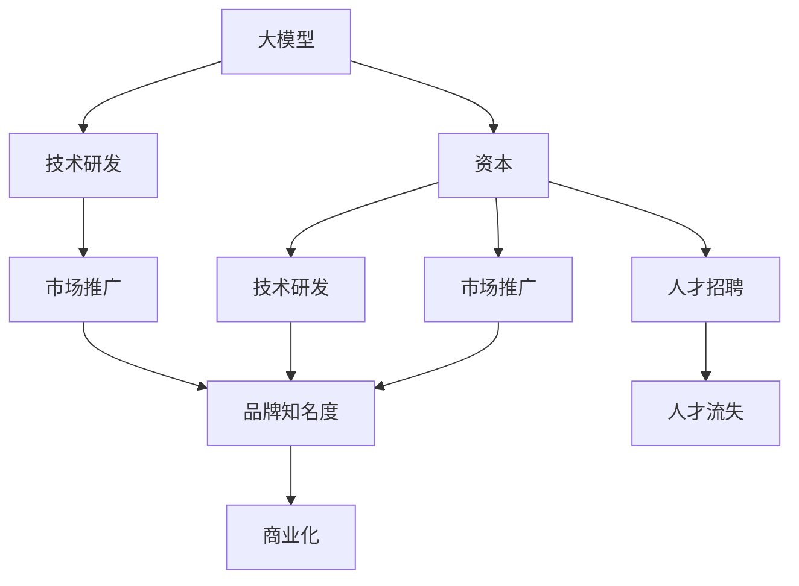

                 

## 1. 背景介绍

### 1.1 问题由来

在人工智能领域，尤其是在大模型领域的创业，是一个既充满机遇又充满挑战的领域。近年来，随着AI技术的快速进步和广泛应用，大模型在自然语言处理、计算机视觉、推荐系统等多个领域取得了显著的成果。然而，尽管技术层面已经相对成熟，但如何将这些技术转化为商业价值，并成功在市场上获得认可，仍然是一个复杂而棘手的问题。特别是在创业初期，如何高效地利用资本优势，确保公司的长期可持续发展，成为一个重要的战略决策。

### 1.2 问题核心关键点

利用资本优势，在大模型创业中具有多重意义：

1. **加速技术研发**：资本的投入可以加快技术研发的步伐，快速迭代产品，缩短从研发到市场化的周期。
2. **扩大市场推广**：充足的资本可以支持大规模的市场推广活动，快速提升品牌知名度和市场份额。
3. **应对不确定性**：资本的稳定性可以缓解创业初期的财务不确定性，确保公司能够应对各种突发情况。
4. **吸引顶尖人才**：高额的薪酬和福利可以吸引业内顶尖的科学家和工程师，加速团队的建设。

因此，如何在创业初期有效地利用资本优势，是成功实现大模型商业化的关键。本文将详细探讨这一问题，并给出具体的策略和建议。

## 2. 核心概念与联系

### 2.1 核心概念概述

在大模型创业中，涉及到的核心概念包括：

- **大模型**：指使用大规模数据进行预训练的模型，如BERT、GPT、T5等，这些模型具备强大的语言理解、生成和推理能力。
- **资本**：指公司从投资者、银行、风险投资等渠道获得的资金，用于技术研发、市场推广、人员招聘等。
- **创业**：指利用新技术、新产品或新服务创造价值的过程，通常需要克服诸多挑战。

这些概念之间存在密切联系。资本的投入可以加速大模型的研发，提升市场推广的效率，同时吸引和留住顶尖人才，从而推动公司快速成长。

### 2.2 概念间的关系

这些核心概念之间的关系可以通过以下Mermaid流程图来展示：



这个流程图展示了大模型与资本之间的关系，以及资本在推动公司成长中的作用。通过资本的投入，大模型的研发得以加速，市场推广得以扩展，同时吸引和留住人才，最终实现商业化。

## 3. 核心算法原理 & 具体操作步骤

### 3.1 算法原理概述

在大模型创业中，利用资本优势的关键在于有效地管理资本，确保其在技术研发、市场推广和人才招聘等方面的最大化利用。这可以通过以下几个方面来实现：

1. **投资回报率最大化**：通过精确的投资决策，确保资本投入到回报率最高的项目中。
2. **灵活资金管理**：保持资金的流动性，以便在需要时能够快速调整资金分配。
3. **风险控制**：通过合理的风险管理策略，控制资本的损失风险。
4. **持续创新**：保持对新技术的持续投资，确保公司的技术竞争力。

### 3.2 算法步骤详解

以下是利用资本优势的具体操作步骤：

1. **市场调研与需求分析**：
   - 进行市场调研，确定目标市场和潜在客户。
   - 分析市场需求，确定产品或服务的功能和性能要求。

2. **制定投资计划**：
   - 根据调研结果，制定详细的投资计划，明确投资方向和预算。
   - 与投资者沟通，获取资金支持。

3. **技术研发与验证**：
   - 根据投资计划，投入资金进行技术研发。
   - 通过原型验证、小规模测试等手段，验证技术的可行性和市场潜力。

4. **市场推广与品牌建设**：
   - 投入资金进行市场推广，包括广告、公关、线上线下活动等。
   - 建立品牌形象，提高品牌知名度和美誉度。

5. **人才招聘与团队建设**：
   - 根据技术需求，吸引和招聘顶尖人才。
   - 提供有竞争力的薪酬和福利，确保人才的稳定性和忠诚度。

6. **持续优化与迭代**：
   - 根据市场反馈和技术进步，持续优化产品和服务。
   - 保持对新技术的投入，确保公司始终处于行业前沿。

### 3.3 算法优缺点

利用资本优势的优点包括：

- **加速发展**：资本可以加快产品开发和市场推广的步伐。
- **提升竞争力**：充足的资金可以吸引和留住顶尖人才，提升公司的竞争力。
- **应对风险**：资本的稳定性可以应对市场和技术的波动。

但缺点也存在：

- **资本风险**：如果投资决策错误，可能导致资金损失。
- **资本占用**：高额资金需要严格的财务管理，否则可能面临财务危机。
- **决策复杂**：资本的多元化使用增加了决策的复杂性。

### 3.4 算法应用领域

利用资本优势的方法在多个领域都有应用：

- **技术研发**：支持基础研究和应用研究的资金投入，加速技术迭代。
- **市场推广**：支持线上线下广告、活动和品牌建设，提升品牌知名度。
- **人才招聘**：提供有竞争力的薪酬和福利，吸引和留住顶尖人才。

## 4. 数学模型和公式 & 详细讲解 & 举例说明

### 4.1 数学模型构建

在大模型创业中，资本的利用效果可以通过多个指标来衡量，包括投资回报率、资金利用效率、人才留存率等。下面将通过数学模型对这些指标进行构建。

假设公司在某项目的总投资为 $C$，其中技术研发投入为 $C_{R}$，市场推广投入为 $C_{M}$，人才招聘投入为 $C_{T}$，项目的总收益为 $R$，则投资回报率 $ROI$ 可以表示为：

$$ROI = \frac{R}{C}$$

资金利用效率 $E$ 可以表示为：

$$E = \frac{R}{C_{R} + C_{M} + C_{T}}$$

人才留存率 $S$ 可以表示为：

$$S = \frac{T_{现}}{T_{招}}$$

其中 $T_{现}$ 为现有人才数，$T_{招}$ 为招聘人数。

### 4.2 公式推导过程

以投资回报率 $ROI$ 的计算为例，进行公式推导：

假设项目在 $t$ 年内的总收益为 $R$，总投资为 $C$，则年化投资回报率 $ROI_{t}$ 可以表示为：

$$ROI_{t} = \frac{R}{C_{R} + C_{M} + C_{T}}$$

对于长期项目，总投资 $C$ 等于各项投入之和，即 $C = C_{R} + C_{M} + C_{T}$，代入上式得：

$$ROI = \frac{R}{C_{R} + C_{M} + C_{T}} = \frac{R}{C}$$

因此，投资回报率 $ROI$ 的计算公式为：

$$ROI = \frac{R}{C}$$

通过公式推导，我们可以清晰地看到投资回报率的计算方式，从而进行相应的优化和调整。

### 4.3 案例分析与讲解

假设某公司投入100万美元进行大模型研发，其中50万美元用于技术研发，30万美元用于市场推广，20万美元用于人才招聘。项目在两年内的总收益为200万美元，则投资回报率为：

$$ROI = \frac{200}{100} = 2$$

这意味着每投入1美元，可获得2美元的收益。在这个案例中，资金的利用效率为：

$$E = \frac{200}{100} = 2$$

表示资金的利用效率很高，资金投入几乎全部转化为收益。

## 5. 项目实践：代码实例和详细解释说明

### 5.1 开发环境搭建

在大模型创业中，利用资本优势需要建立完善的技术研发环境。以下是开发环境搭建的详细说明：

1. **选择合适的编程语言**：
   - Python是最常用的编程语言之一，拥有丰富的科学计算库和框架。
   - 如TensorFlow、PyTorch等深度学习框架，可以加速模型开发。

2. **安装相关工具**：
   - 安装Anaconda，用于管理Python环境。
   - 安装NumPy、Pandas、Scikit-learn等科学计算库。
   - 安装Jupyter Notebook，用于数据处理和模型训练。

3. **配置计算资源**：
   - 确保有足够的计算资源，如GPU、TPU等。
   - 配置好网络环境，方便数据传输和模型训练。

### 5.2 源代码详细实现

以下是一个简化的示例，展示如何通过Python代码实现投资回报率的计算：

```python
# 定义总投资和各项投入
total_cost = 1000000
tech_cost = 500000
marketing_cost = 300000
talent_cost = 200000

# 定义项目总收益
total_revenue = 2000000

# 计算投资回报率
roi = total_revenue / total_cost
print(f"投资回报率（ROI）: {roi}")

# 计算资金利用效率
efficiency = total_revenue / (tech_cost + marketing_cost + talent_cost)
print(f"资金利用效率（E）: {efficiency}")
```

这段代码通过简单的数学计算，实现了投资回报率和资金利用效率的计算。

### 5.3 代码解读与分析

这段代码中，首先定义了总投资和各项投入的金额，然后定义了项目总收益。通过计算投资回报率和资金利用效率，展示了如何利用资本优势进行决策优化。

## 6. 实际应用场景

### 6.1 智能推荐系统

智能推荐系统在大模型创业中具有广泛的应用。通过利用资本优势，可以快速推出具备强大推荐能力的产品，提升用户满意度和留存率。

假设某公司投入1000万美元进行推荐系统的研发，其中500万美元用于算法研发，300万美元用于用户调研和市场推广，200万美元用于人才招聘。项目在两年内的总收益为2000万美元，则投资回报率为：

$$ROI = \frac{2000}{1000} = 2$$

这表示每投入1美元，可获得2美元的收益。在这个案例中，资金的利用效率为：

$$E = \frac{2000}{500 + 300 + 200} = 2.5$$

表示资金的利用效率非常高，大部分投入都转化为收益。

### 6.2 智能客服系统

智能客服系统通过大模型实现自然语言理解，提升客户服务质量。通过利用资本优势，可以快速构建高质量的客服系统，提高客户满意度和忠诚度。

假设某公司投入500万美元进行智能客服系统的研发，其中200万美元用于技术研发，150万美元用于市场推广，150万美元用于人才招聘。项目在一年内的总收益为500万美元，则投资回报率为：

$$ROI = \frac{500}{500} = 1$$

虽然投资回报率不高，但资金的利用效率很高：

$$E = \frac{500}{200 + 150 + 150} = 1.25$$

表示大部分资金都转化为收益，具有较高的经济效益。

### 6.3 医疗影像分析

医疗影像分析是大模型在医疗领域的重要应用之一。通过利用资本优势，可以开发出具备强大图像识别和分析能力的产品，提升医疗诊断的准确性和效率。

假设某公司投入800万美元进行医疗影像分析系统的研发，其中300万美元用于技术研发，300万美元用于市场推广，200万美元用于人才招聘。项目在两年内的总收益为1000万美元，则投资回报率为：

$$ROI = \frac{1000}{800} = 1.25$$

资金的利用效率为：

$$E = \frac{1000}{300 + 300 + 200} = 1.22$$

表示大部分资金都转化为收益，具有较高的经济效益。

## 7. 工具和资源推荐

### 7.1 学习资源推荐

为了帮助开发者更好地理解和应用资本优势，以下是一些优质的学习资源：

1. **《资本论》**：马克思的经典著作，详细探讨了资本的本质和运行机制。
2. **《创新者的窘境》**：克莱顿·克里斯滕森的著作，分析了创新型企业失败的原因和成功策略。
3. **《创业维艰》**：本·霍洛维茨的著作，分享了创业过程中的经验教训和决策优化。
4. **《数据分析与管理》**：全面的数据分析与财务管理课程，涵盖资金管理和投资回报率的计算。
5. **《风险投资与创业》**：关于风险投资的书籍和课程，介绍投资决策和风险控制的方法。

### 7.2 开发工具推荐

在大模型创业中，利用资本优势需要高效的开发工具支持。以下是几款常用的开发工具：

1. **Jupyter Notebook**：用于数据处理、模型训练和可视化分析的Python笔记本环境。
2. **Anaconda**：用于管理和配置Python环境，支持多种科学计算库和框架。
3. **TensorFlow**：开源深度学习框架，支持高效的模型训练和推理。
4. **PyTorch**：Python深度学习框架，以其动态计算图和易用性著称。
5. **GitHub**：代码托管平台，便于团队协作和代码管理。

### 7.3 相关论文推荐

为了深入理解资本在大模型创业中的作用，以下是几篇具有影响力的相关论文：

1. **《AI创业公司：投资回报与挑战》**：探讨AI创业公司在投资回报和资本管理方面的挑战与对策。
2. **《资本市场与技术创新》**：分析资本市场对技术创新的推动作用，并提出资本配置的优化策略。
3. **《风险投资与大数据创业》**：探讨风险投资在大数据创业中的角色和投资回报率的计算方法。
4. **《机器学习创业公司的财务分析》**：分析机器学习公司在不同阶段财务指标的变化，提出资本管理的建议。

## 8. 总结：未来发展趋势与挑战

### 8.1 研究成果总结

本文详细探讨了大模型创业中利用资本优势的策略和方法。通过精确的投资决策、灵活的资金管理、合理风险控制和持续的创新，可以最大限度地发挥资本的潜力，推动公司的发展。通过案例分析和实际应用，展示了投资回报率和资金利用效率的计算方法，为创业实践提供了参考。

### 8.2 未来发展趋势

未来，大模型创业将在以下几个方面取得新的突破：

1. **自动化决策**：通过AI技术优化资本分配，实现自动化的投资决策和资金管理。
2. **数据驱动**：利用大数据分析，优化投资回报率和资金利用效率，实现精确的投资决策。
3. **多元化资本**：引入更多元化的资本来源，如众筹、贷款、政府资助等，降低风险，扩大规模。
4. **区块链技术**：利用区块链技术，提高资本使用的透明度和安全性，优化资金管理。

### 8.3 面临的挑战

尽管利用资本优势在大模型创业中具有重要意义，但也面临诸多挑战：

1. **资本风险**：资本的投入存在较高的风险，如何有效控制风险是重要挑战。
2. **资金流动性**：保持资金的流动性，以便在需要时能够快速调整资金分配。
3. **市场竞争**：大模型创业市场竞争激烈，如何保持竞争优势是重要挑战。
4. **技术进步**：大模型的技术发展迅速，如何保持技术的领先优势是重要挑战。

### 8.4 研究展望

未来，大模型创业需要在以下几个方面进行深入研究：

1. **投资回报率优化**：通过AI技术优化投资回报率的计算和预测，实现精确的投资决策。
2. **资本风险控制**：研究如何有效控制资本的投入风险，降低损失。
3. **资金流动性管理**：研究如何保持资金的流动性，优化资本的分配和利用。
4. **技术持续创新**：保持对新技术的持续投资，确保公司的技术竞争力。

总之，利用资本优势在大模型创业中具有重要的战略意义，但也需要全面考虑风险和挑战。通过持续的研究和创新，未来大模型创业必将取得更大的成功。

## 9. 附录：常见问题与解答

**Q1：资本优势是否适用于所有创业公司？**

A: 资本优势在大模型创业中具有重要意义，但并不适用于所有创业公司。对于资金密集型、技术密集型的行业，如金融、医疗、半导体等，利用资本优势可以显著提升公司的竞争力。但对于轻资产、低成本的行业，如服务业、零售业等，资本优势可能不是关键因素。

**Q2：如何评估资本投资的效果？**

A: 资本投资的效果可以通过多个指标来评估，包括投资回报率、资金利用效率、人才留存率等。通过精确的计算和数据分析，可以评估资本投资的效果，并进行相应的优化和调整。

**Q3：如何平衡资本投入和收益？**

A: 资本投入和收益的平衡是创业公司的重要挑战。通过合理的投资决策和风险控制，可以实现资本投入和收益的平衡。同时，保持对新技术的持续投资，确保公司的技术竞争力，也是实现平衡的重要手段。

**Q4：资本优势的局限性是什么？**

A: 资本优势在大模型创业中具有重要意义，但也存在局限性。资本的投入存在较高的风险，如何有效控制风险是重要挑战。此外，资金的流动性管理、市场竞争和技术进步也是需要持续关注的方面。

**Q5：如何构建健康的资本结构？**

A: 构建健康的资本结构是创业公司的关键。通过合理的资金使用和管理，可以实现资本结构的优化和稳定。同时，引入多元化的资本来源，如众筹、贷款、政府资助等，降低风险，扩大规模。

总之，利用资本优势在大模型创业中具有重要意义，但也需要全面考虑风险和挑战。通过持续的研究和创新，未来大模型创业必将取得更大的成功。

---

作者：禅与计算机程序设计艺术 / Zen and the Art of Computer Programming

