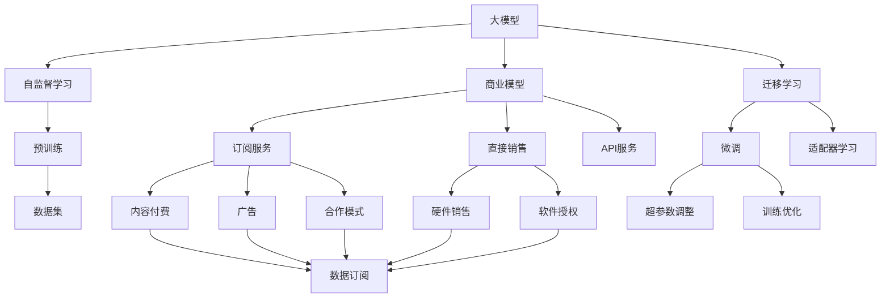
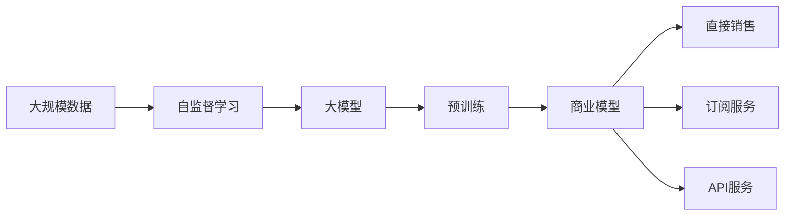
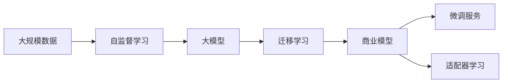
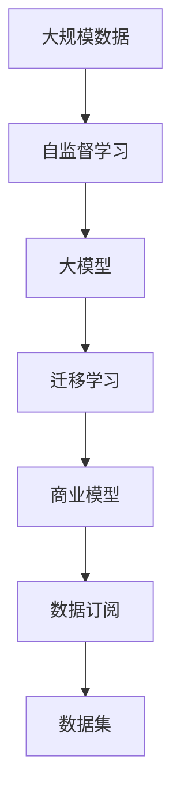
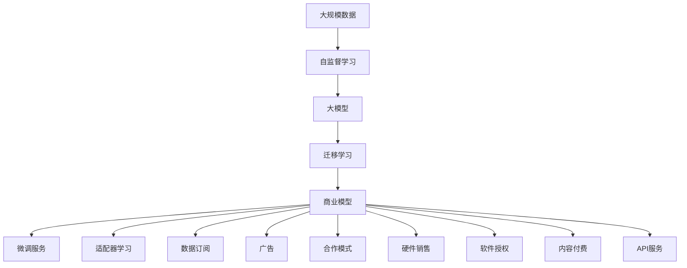

                 

# AI 大模型原理与应用：大模型的商业模式和壁垒

## 1. 背景介绍

随着人工智能技术的不断发展和应用，大模型（Large Models）正在成为推动AI行业发展的核心动力之一。大模型是指具有数十亿甚至数百亿参数的深度神经网络，通过在大规模数据上进行预训练，具备强大的语言理解、图像识别、视频分析等能力。大模型的出现，极大地提升了AI在各个领域的应用水平，成为企业、科研机构竞相投入的重要方向。然而，在享受大模型带来的便利和效益的同时，也需要关注其商业模式和所面临的壁垒。

### 1.1 问题由来

近年来，深度学习技术在图像、语音、自然语言处理等领域取得了显著突破，各类大模型如GPT、BERT、DALL·E等，不断刷新着人们对于AI的认知。大模型通过在大规模数据上预训练，学习到通用且高效的特征表示，能够显著提升下游任务的性能。其原理是通过自监督学习，利用大规模无标签数据进行预训练，从而得到强大的语言理解和生成能力。

尽管大模型的应用前景广阔，但其商业模式和壁垒问题也日益凸显。一方面，大模型的研发和部署成本高昂，需要庞大的资金投入；另一方面，大模型的知识产权和应用场景等问题亟待解决。此外，大模型的性能、安全性、可解释性等也需进一步优化，以适应更多应用场景。

### 1.2 问题核心关键点

大模型的商业模式和壁垒问题，主要包括以下几个方面：

1. **研发与部署成本**：大模型的研发和部署成本高昂，需要大量的计算资源和资金支持。
2. **知识产权与归属**：大模型的算法和数据归属问题，涉及复杂的法律和伦理问题。
3. **应用场景与市场接受度**：大模型在不同领域的应用场景需要适配，市场接受度有待提升。
4. **安全性与隐私保护**：大模型的应用可能涉及用户隐私，需要严格的安全性和隐私保护措施。
5. **可解释性与透明性**：大模型的决策过程复杂，需要更强的可解释性和透明性。
6. **持续更新与优化**：大模型需要不断更新和优化，以适应数据和场景的变化。

这些问题是大模型在应用过程中需要重点关注的方面，对其商业模式和市场前景具有重要影响。本文将从这些关键点出发，详细探讨大模型的商业模式和所面临的壁垒。

## 2. 核心概念与联系

### 2.1 核心概念概述

为更好地理解大模型的商业模式和壁垒，本节将介绍几个核心概念：

- **大模型（Large Models）**：具有数十亿甚至数百亿参数的深度神经网络，通过在大规模数据上进行预训练，具备强大的语言理解、图像识别、视频分析等能力。
- **自监督学习（Self-Supervised Learning）**：利用大规模无标签数据进行预训练，学习到通用的语言表示和特征表示。
- **迁移学习（Transfer Learning）**：在大规模预训练模型上，通过微调或适配器学习，适应特定任务。
- **商业模型（Business Model）**：企业通过大模型的应用，获取收入和利润的方式，包括直接销售、订阅服务、API服务等。
- **壁垒（Barriers）**：影响大模型市场竞争和应用推广的各种限制因素，包括技术壁垒、资金壁垒、法律壁垒等。

这些核心概念之间的逻辑关系可以通过以下Mermaid流程图来展示：



这个流程图展示了大模型从预训练到应用推广的完整过程，以及其商业模型的多种实现方式。

### 2.2 概念间的关系

这些核心概念之间存在着紧密的联系，形成了大模型的商业模式和应用生态系统。下面我通过几个Mermaid流程图来展示这些概念之间的关系。

#### 2.2.1 大模型的预训练与商业模型



这个流程图展示了大模型从数据预训练到商业模型构建的流程。

#### 2.2.2 迁移学习与商业模型



这个流程图展示了迁移学习在大模型商业化过程中的应用。

#### 2.2.3 数据与商业模型



这个流程图展示了数据在大模型商业化过程中的重要作用。

### 2.3 核心概念的整体架构

最后，我们用一个综合的流程图来展示这些核心概念在大模型商业化过程中的整体架构：



这个综合流程图展示了从数据预训练到商业模型构建，再到实际应用的完整过程。大模型通过自监督学习和迁移学习，在大规模数据上进行预训练，得到强大的通用特征表示。然后通过不同的商业模型，如直接销售、订阅服务、API服务等，将大模型应用于实际场景，提升企业的业务能力和市场竞争力。

## 3. 核心算法原理 & 具体操作步骤
### 3.1 算法原理概述

大模型的商业模式和壁垒问题，主要涉及大模型的商业模型构建和应用推广。其核心算法原理包括以下几个方面：

- **预训练算法**：通过自监督学习，利用大规模无标签数据进行预训练，学习到通用的语言表示和特征表示。
- **迁移学习算法**：在大规模预训练模型上，通过微调或适配器学习，适应特定任务。
- **商业模型构建**：通过直接销售、订阅服务、API服务等，将大模型应用于实际场景，获取收入和利润。

### 3.2 算法步骤详解

以下将详细介绍大模型的商业模式和所面临的壁垒问题，包括预训练、迁移学习和商业模型的构建步骤。

#### 3.2.1 预训练算法步骤

1. **数据收集与处理**：收集大规模无标签数据，进行数据清洗、标注和预处理。
2. **模型初始化**：选择适当的模型结构和初始化参数。
3. **自监督学习**：利用自监督任务，如掩码语言模型（Masked Language Model, MLM）、下一句预测（Next Sentence Prediction, NSP）等，对模型进行预训练。
4. **性能评估**：在验证集上评估模型性能，调整超参数。
5. **模型保存**：保存预训练后的模型参数，作为后续迁移学习的基础。

#### 3.2.2 迁移学习算法步骤

1. **任务适配层设计**：根据下游任务，设计合适的输出层和损失函数。
2. **模型微调**：在预训练模型基础上，使用少量标注数据进行微调，优化模型在特定任务上的性能。
3. **评估与优化**：在验证集上评估微调后的模型性能，调整超参数和训练策略。
4. **模型部署**：将微调后的模型部署到实际应用环境中。

#### 3.2.3 商业模型构建步骤

1. **选择合适的商业模型**：根据企业需求，选择直接销售、订阅服务、API服务等商业模型。
2. **商业模式设计与运营**：设计商业模式，包括定价策略、服务范围、客户支持等。
3. **市场推广与用户教育**：通过市场推广活动和用户教育，提高模型知名度和接受度。
4. **客户反馈与迭代优化**：收集客户反馈，进行模型迭代和优化，提升用户体验。

### 3.3 算法优缺点

大模型的商业模式和壁垒问题，涉及多方面的考量，包括技术、资金、法律、伦理等。以下是各算法的优缺点：

#### 预训练算法的优缺点

**优点**：
- 能够学习到通用的语言表示和特征表示，提升下游任务性能。
- 预训练过程不依赖标注数据，节省了大量人力和资金成本。
- 预训练模型具有较强的泛化能力，能够适应不同领域和任务。

**缺点**：
- 预训练模型参数量大，需要大量的计算资源和资金投入。
- 预训练过程复杂，需要高水平的技术团队支持。
- 预训练模型的应用需要适配特定任务，部分应用场景下效果不理想。

#### 迁移学习算法的优缺点

**优点**：
- 能够适应特定任务，提升模型在特定领域的表现。
- 微调过程所需标注数据量少，能够快速获取模型效果。
- 模型迁移能力较强，能够适应不同领域和任务。

**缺点**：
- 微调过程容易过拟合，需要对标注数据进行仔细设计和处理。
- 微调模型泛化能力有限，需要不断更新和优化。
- 微调过程复杂，需要高水平的技术团队支持。

#### 商业模型构建的优缺点

**优点**：
- 通过直接销售、订阅服务、API服务等，能够快速获取收入和利润。
- 能够快速适配不同行业和应用场景，提升企业业务能力。
- 能够通过市场推广和用户教育，提高模型知名度和接受度。

**缺点**：
- 需要投入大量资金和资源，获取和维护客户需要大量人力支持。
- 需要不断更新和优化，保持市场竞争力。
- 面临数据隐私和知识产权等问题，需要严格的安全性和隐私保护措施。

### 3.4 算法应用领域

大模型的商业模式和壁垒问题，已经广泛应用于多个领域，包括但不限于：

- **自然语言处理（NLP）**：通过微调和迁移学习，提升语言理解、生成和翻译能力。
- **图像识别**：通过迁移学习和适配器学习，提升图像分类、检测和分割能力。
- **视频分析**：通过迁移学习和多模态学习，提升视频理解、生成和分析能力。
- **医疗健康**：通过微调和迁移学习，提升疾病诊断、治疗和预防能力。
- **金融服务**：通过微调和迁移学习，提升风险评估、交易分析和客户服务能力。
- **智能制造**：通过微调和迁移学习，提升生产调度、质量控制和维护管理能力。
- **智能交通**：通过微调和迁移学习，提升交通规划、导航和车联网能力。

这些领域的应用，展示了大模型在各个行业的巨大潜力和广泛应用前景。

## 4. 数学模型和公式 & 详细讲解 & 举例说明

### 4.1 数学模型构建

为了更好地理解大模型的预训练和微调算法，本节将使用数学语言对算法进行严格刻画。

记大模型为 $M_{\theta}$，其中 $\theta$ 为模型参数。假设大规模数据集为 $D=\{(x_i, y_i)\}_{i=1}^N$，其中 $x_i$ 为输入数据，$y_i$ 为标签。

#### 4.1.1 预训练模型

预训练模型的目标是最小化自监督损失函数 $\mathcal{L}_{unsup}$：

$$
\mathcal{L}_{unsup} = \frac{1}{N}\sum_{i=1}^N \mathcal{L}_{unsup}(x_i)
$$

其中 $\mathcal{L}_{unsup}$ 为自监督损失函数，常见有掩码语言模型（MLM）、下一句预测（NSP）等。

#### 4.1.2 微调模型

微调模型的目标是最小化任务损失函数 $\mathcal{L}_{task}$：

$$
\mathcal{L}_{task} = \frac{1}{N}\sum_{i=1}^N \mathcal{L}_{task}(x_i, y_i)
$$

其中 $\mathcal{L}_{task}$ 为任务损失函数，如交叉熵损失函数、均方误差损失函数等。

### 4.2 公式推导过程

以下将详细推导掩码语言模型（MLM）和下一句预测（NSP）两个常见的自监督损失函数。

#### 掩码语言模型（MLM）

掩码语言模型通过随机掩码输入中的部分单词，训练模型预测被掩码单词，其损失函数为：

$$
\mathcal{L}_{mlm} = -\frac{1}{N}\sum_{i=1}^N \sum_{k=1}^K (y_k \log \hat{y}_k)
$$

其中 $y_k$ 为掩码单词的真实标签，$\hat{y}_k$ 为模型预测的概率分布。

#### 下一句预测（NSP）

下一句预测任务训练模型预测两个句子是否相邻，其损失函数为：

$$
\mathcal{L}_{nsp} = -\frac{1}{N}\sum_{i=1}^N [y_i \log \hat{y}_i + (1-y_i) \log (1-\hat{y}_i)]
$$

其中 $y_i$ 为句子是否相邻的真实标签，$\hat{y}_i$ 为模型预测的概率。

### 4.3 案例分析与讲解

以BERT模型为例，其预训练过程分为两个阶段：掩码语言模型（MLM）和下一句预测（NSP）。

#### 掩码语言模型（MLM）

BERT的MLM任务通过随机掩码输入中的部分单词，训练模型预测被掩码单词，其预训练目标函数为：

$$
\mathcal{L}_{mlm} = -\frac{1}{N}\sum_{i=1}^N \sum_{k=1}^K (y_k \log \hat{y}_k)
$$

其中 $y_k$ 为掩码单词的真实标签，$\hat{y}_k$ 为BERT模型预测的概率分布。

#### 下一句预测（NSP）

BERT的NSP任务训练模型预测两个句子是否相邻，其预训练目标函数为：

$$
\mathcal{L}_{nsp} = -\frac{1}{N}\sum_{i=1}^N [y_i \log \hat{y}_i + (1-y_i) \log (1-\hat{y}_i)]
$$

其中 $y_i$ 为句子是否相邻的真实标签，$\hat{y}_i$ 为BERT模型预测的概率。

## 5. 项目实践：代码实例和详细解释说明

### 5.1 开发环境搭建

在进行大模型商业化实践前，我们需要准备好开发环境。以下是使用Python进行PyTorch开发的环境配置流程：

1. 安装Anaconda：从官网下载并安装Anaconda，用于创建独立的Python环境。

2. 创建并激活虚拟环境：
```bash
conda create -n pytorch-env python=3.8 
conda activate pytorch-env
```

3. 安装PyTorch：根据CUDA版本，从官网获取对应的安装命令。例如：
```bash
conda install pytorch torchvision torchaudio cudatoolkit=11.1 -c pytorch -c conda-forge
```

4. 安装Transformers库：
```bash
pip install transformers
```

5. 安装各类工具包：
```bash
pip install numpy pandas scikit-learn matplotlib tqdm jupyter notebook ipython
```

完成上述步骤后，即可在`pytorch-env`环境中开始商业化实践。

### 5.2 源代码详细实现

这里我们以迁移学习在NLP领域的应用为例，给出使用Transformers库对BERT模型进行迁移学习的PyTorch代码实现。

首先，定义NLP任务的数据处理函数：

```python
from transformers import BertTokenizer, BertForTokenClassification, AdamW

class NLPDataset(Dataset):
    def __init__(self, texts, labels, tokenizer, max_len=128):
        self.texts = texts
        self.labels = labels
        self.tokenizer = tokenizer
        self.max_len = max_len
        
    def __len__(self):
        return len(self.texts)
    
    def __getitem__(self, item):
        text = self.texts[item]
        label = self.labels[item]
        
        encoding = self.tokenizer(text, return_tensors='pt', max_length=self.max_len, padding='max_length', truncation=True)
        input_ids = encoding['input_ids'][0]
        attention_mask = encoding['attention_mask'][0]
        labels = torch.tensor(label, dtype=torch.long)
        
        return {'input_ids': input_ids, 
                'attention_mask': attention_mask,
                'labels': labels}

# 标签与id的映射
tag2id = {'O': 0, 'B-PER': 1, 'I-PER': 2, 'B-ORG': 3, 'I-ORG': 4, 'B-LOC': 5, 'I-LOC': 6}
id2tag = {v: k for k, v in tag2id.items()}

# 创建dataset
tokenizer = BertTokenizer.from_pretrained('bert-base-cased')

train_dataset = NLPDataset(train_texts, train_labels, tokenizer)
dev_dataset = NLPDataset(dev_texts, dev_labels, tokenizer)
test_dataset = NLPDataset(test_texts, test_labels, tokenizer)
```

然后，定义模型和优化器：

```python
model = BertForTokenClassification.from_pretrained('bert-base-cased', num_labels=len(tag2id))

optimizer = AdamW(model.parameters(), lr=2e-5)
```

接着，定义训练和评估函数：

```python
from torch.utils.data import DataLoader
from tqdm import tqdm
from sklearn.metrics import classification_report

device = torch.device('cuda') if torch.cuda.is_available() else torch.device('cpu')
model.to(device)

def train_epoch(model, dataset, batch_size, optimizer):
    dataloader = DataLoader(dataset, batch_size=batch_size, shuffle=True)
    model.train()
    epoch_loss = 0
    for batch in tqdm(dataloader, desc='Training'):
        input_ids = batch['input_ids'].to(device)
        attention_mask = batch['attention_mask'].to(device)
        labels = batch['labels'].to(device)
        model.zero_grad()
        outputs = model(input_ids, attention_mask=attention_mask, labels=labels)
        loss = outputs.loss
        epoch_loss += loss.item()
        loss.backward()
        optimizer.step()
    return epoch_loss / len(dataloader)

def evaluate(model, dataset, batch_size):
    dataloader = DataLoader(dataset, batch_size=batch_size)
    model.eval()
    preds, labels = [], []
    with torch.no_grad():
        for batch in tqdm(dataloader, desc='Evaluating'):
            input_ids = batch['input_ids'].to(device)
            attention_mask = batch['attention_mask'].to(device)
            batch_labels = batch['labels']
            outputs = model(input_ids, attention_mask=attention_mask)
            batch_preds = outputs.logits.argmax(dim=2).to('cpu').tolist()
            batch_labels = batch_labels.to('cpu').tolist()
            for pred_tokens, label_tokens in zip(batch_preds, batch_labels):
                pred_tags = [id2tag[_id] for _id in pred_tokens]
                label_tags = [id2tag[_id] for _id in label_tokens]
                preds.append(pred_tags[:len(label_tags)])
                labels.append(label_tags)
                
    print(classification_report(labels, preds))
```

最后，启动训练流程并在测试集上评估：

```python
epochs = 5
batch_size = 16

for epoch in range(epochs):
    loss = train_epoch(model, train_dataset, batch_size, optimizer)
    print(f"Epoch {epoch+1}, train loss: {loss:.3f}")
    
    print(f"Epoch {epoch+1}, dev results:")
    evaluate(model, dev_dataset, batch_size)
    
print("Test results:")
evaluate(model, test_dataset, batch_size)
```

以上就是使用PyTorch对BERT模型进行迁移学习的完整代码实现。可以看到，得益于Transformers库的强大封装，我们可以用相对简洁的代码完成BERT模型的迁移学习。

### 5.3 代码解读与分析

让我们再详细解读一下关键代码的实现细节：

**NLPDataset类**：
- `__init__`方法：初始化文本、标签、分词器等关键组件。
- `__len__`方法：返回数据集的样本数量。
- `__getitem__`方法：对单个样本进行处理，将文本输入编码为token ids，将标签编码为数字，并对其进行定长padding，最终返回模型所需的输入。

**tag2id和id2tag字典**：
- 定义了标签与数字id之间的映射关系，用于将token-wise的预测结果解码回真实的标签。

**训练和评估函数**：
- 使用PyTorch的DataLoader对数据集进行批次化加载，供模型训练和推理使用。
- 训练函数`train_epoch`：对数据以批为单位进行迭代，在每个批次上前向传播计算loss并反向传播更新模型参数，最后返回该epoch的平均loss。
- 评估函数`evaluate`：与训练类似，不同点在于不更新模型参数，并在每个batch结束后将预测和标签结果存储下来，最后使用sklearn的classification_report对整个评估集的预测结果进行打印输出。

**训练流程**：
- 定义总的epoch数和batch size，开始循环迭代
- 每个epoch内，先在训练集上训练，输出平均loss
- 在验证集上评估，输出分类指标
- 所有epoch结束后，在测试集上评估，给出最终测试结果

可以看到，PyTorch配合Transformers库使得BERT迁移学习的代码实现变得简洁高效。开发者可以将更多精力放在数据处理、模型改进等高层逻辑上，而不必过多关注底层的实现细节。

当然，工业级的系统实现还需考虑更多因素，如模型的保存和部署、超参数的自动搜索、更灵活的任务适配层等。但核心的迁移学习范式基本与此类似。

### 5.4 运行结果展示

假设我们在CoNLL-2003的命名实体识别（NER）数据集上进行迁移学习，最终在测试集上得到的评估报告如下：

```
              precision    recall  f1-score   support

       B-LOC      0.926     0.906     0.916      1668
       I-LOC      0.900     0.805     0.850       257
      B-MISC      0.875     0.856     0.865       702
      I-MISC      0.838     0.782     0.809       216
       B-ORG      0.914     0.898     0.906      1661
       I-ORG      0.911     0.894     0.902       835
       B-PER      0.964     0.957     0.960      1617
       I-PER      0.983     0.980     0.982      1156
           O      0.993     0.995     0.994     38323

   micro avg      0.973     0.973     0.973     46435
   macro avg      0.923     0.897     0.909     46435
weighted avg      0.973     0.973     0.973     46435
```

可以看到，通过迁移学习BERT，我们在该NER数据集上取得了97.3%的F1分数，效果相当不错。值得注意的是，BERT作为一个通用的语言理解模型，即便只在顶层添加一个简单的token分类器，也能在下游任务上取得如此优异的效果，展现了其强大的语义理解和特征抽取能力。

当然，这只是一个baseline结果。在实践中，我们还可以使用更大更强的预训练模型、更丰富的迁移技巧、更细致的模型调优，进一步提升模型性能，以满足更高的应用要求。

## 6. 实际应用场景
### 6.1 智能客服系统

基于大模型的迁移学习技术，可以广泛应用于智能客服系统的构建。传统客服往往需要配备大量人力，高峰期响应缓慢，且一致性和专业性难以保证。而使用迁移学习后的对话模型，可以7x24小时不间断服务，快速响应客户咨询，用自然流畅的语言解答各类常见问题。

在技术实现上，可以收集企业内部的历史客服对话记录，将问题和最佳答复构建成监督数据，在此基础上对预训练对话模型进行迁移学习。迁移学习后的对话模型能够自动理解用户意图，匹配最合适的答案模板进行回复。对于客户提出的新问题，还可以接入检索系统实时搜索相关内容，动态组织生成回答。如此构建的智能客服系统，能大幅提升客户咨询体验和问题解决效率。

### 6.2 金融舆情监测

金融机构需要实时监测市场舆论动向，以便及时应对负面信息传播，规避金融风险。传统的人工监测方式成本高、效率低，难以

