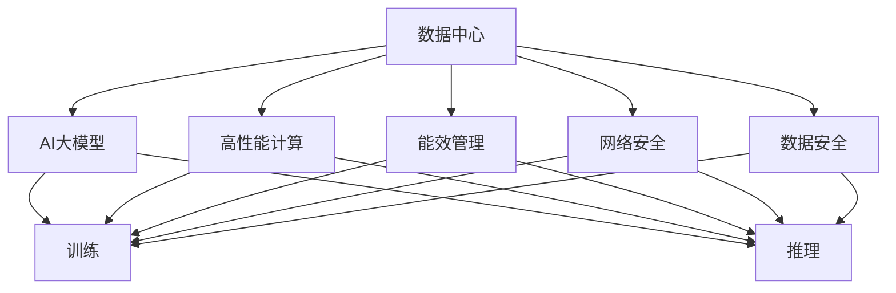
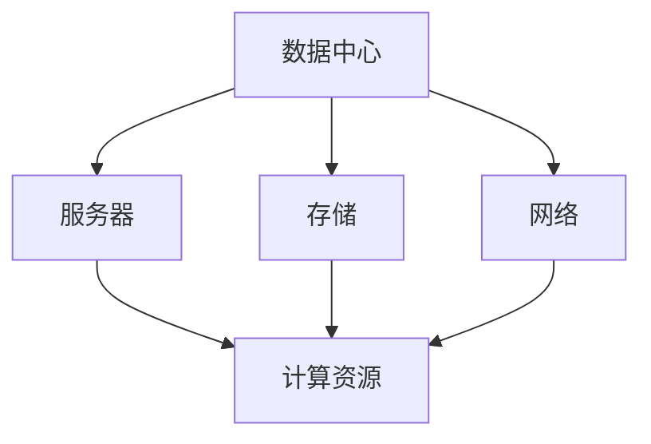
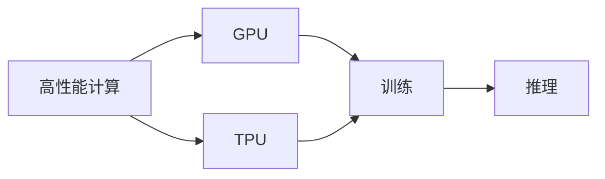
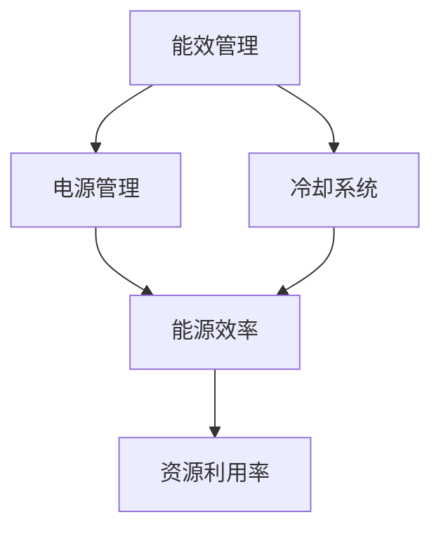
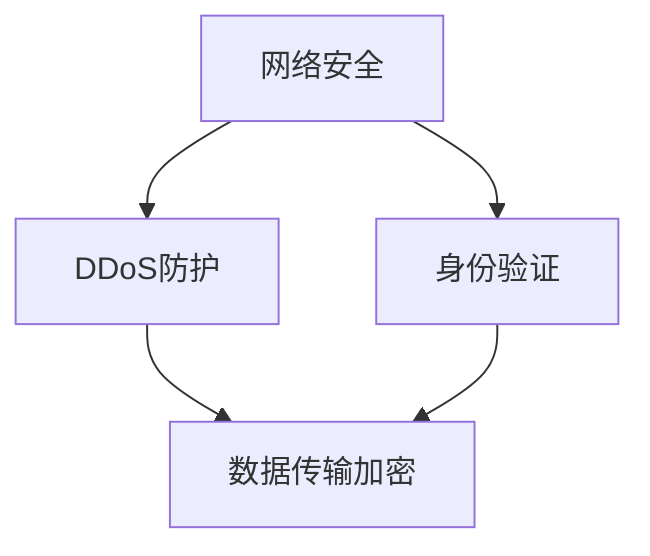
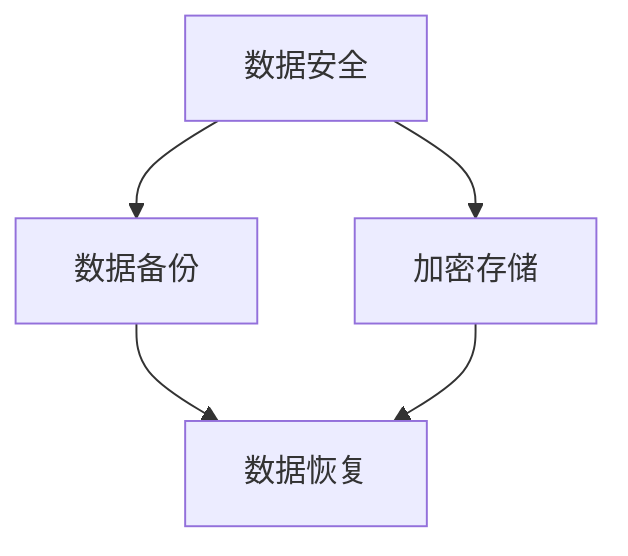
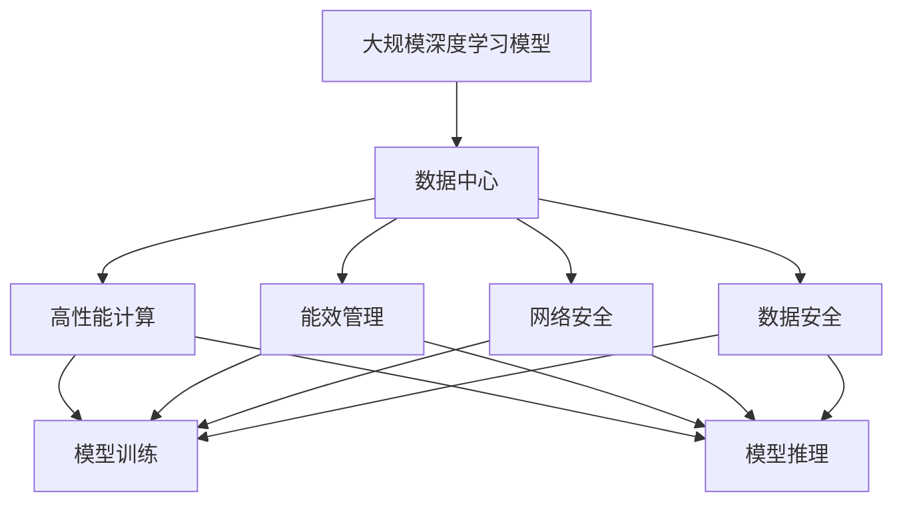

                 

# AI 大模型应用数据中心建设：数据中心安全与可靠性

> 关键词：AI大模型, 数据中心, 安全, 可靠性, 高性能计算, 能效管理

## 1. 背景介绍

### 1.1 问题由来
近年来，人工智能(AI)和深度学习技术迅猛发展，推动了大模型在各个领域的应用，如自然语言处理(NLP)、计算机视觉(CV)、语音识别(SR)等。这些大模型通常包含数十亿个参数，需要巨大的计算资源和存储空间进行训练和推理。为支持这些模型的运行，数据中心已成为了AI应用基础设施的重要组成部分。

数据中心不仅仅是计算和存储资源的提供者，其安全性和可靠性也是决定AI应用效果的关键因素。随着大模型应用的普及，数据中心的安全和可靠性问题变得更加复杂和关键。如何构建高可用、安全可靠的数据中心，成为当下AI应用的重大挑战。

### 1.2 问题核心关键点
数据中心的安全与可靠性是大模型应用成功的基石。其核心关键点包括：

- 数据中心的物理环境：包括电源、冷却、防火墙、入侵检测系统(IDS)等。
- 网络安全：包括身份验证、数据传输加密、DDoS防护等。
- 数据安全：包括数据备份、加密、访问控制等。
- 高性能计算：包括服务器、存储、网络等硬件设备和软件架构设计。
- 能效管理：包括能源效率、资源利用率、降本增效等。

这些核心点需要综合考虑，才能构建一个安全可靠、高性能的数据中心，确保大模型应用的稳定和高效。

### 1.3 问题研究意义
构建安全可靠的数据中心，对于保障AI应用的正常运行、提升用户体验、保护用户隐私、防范潜在威胁等具有重要意义：

1. **保障AI应用稳定运行**：数据中心的安全和可靠性直接影响到AI模型的训练和推理过程。
2. **提升用户体验**：高质量的数据中心能够保证AI服务的响应速度和稳定性，提升用户满意度。
3. **保护用户隐私**：数据中心需要采取严格的数据安全和隐私保护措施，防止用户信息泄露。
4. **防范潜在威胁**：数据中心需要防范网络攻击、自然灾害等潜在威胁，确保业务连续性。
5. **提升能效管理**：能效管理是大模型应用成本的重要组成部分，对数据中心的长期运营和可持续发展至关重要。

因此，研究数据中心的安全与可靠性，对于推动AI技术落地应用，构建安全可靠的AI基础设施，具有重要意义。

## 2. 核心概念与联系

### 2.1 核心概念概述

为更好地理解AI大模型应用数据中心的构建，本节将介绍几个密切相关的核心概念：

- **数据中心(Data Center)**：存放和运行各种服务器、存储设备、网络设备等硬件设施，提供高性能计算和存储服务的设施。
- **人工智能(AI)大模型**：以深度学习模型为基础，包含数十亿甚至数百亿个参数的大规模模型，如GPT-3、BERT等。
- **高性能计算(HPC)**：指通过专用的硬件和软件架构，提供高性能计算能力，用于处理复杂的数据和算法。
- **能效管理**：指通过技术手段和管理措施，优化数据中心的能源效率和资源利用率。
- **网络安全**：指通过技术手段和管理措施，保障数据中心的通信安全，防止网络攻击和数据泄露。
- **数据安全**：指通过技术手段和管理措施，保障数据中心的存储安全，防止数据丢失和篡改。

这些核心概念之间的逻辑关系可以通过以下Mermaid流程图来展示：



这个流程图展示了大模型应用数据中心的整体架构及其核心组件之间的关系：

1. 数据中心通过高性能计算能力，支撑AI大模型的训练和推理过程。
2. 能效管理、网络安全、数据安全等基础设施，保障大模型的稳定运行。
3. AI大模型在数据中心的训练和推理过程，需要综合考虑性能、安全、可靠性等因素。

### 2.2 概念间的关系

这些核心概念之间存在着紧密的联系，形成了AI大模型应用数据中心的完整生态系统。下面我们通过几个Mermaid流程图来展示这些概念之间的关系。

#### 2.2.1 数据中心的组成部分



这个流程图展示了数据中心的物理组成部分：服务器、存储和网络。其中，服务器是数据中心的核心计算资源，存储用于存放数据，网络用于连接各个服务器和数据中心外的世界。

#### 2.2.2 高性能计算与数据中心的硬件架构



这个流程图展示了高性能计算与数据中心硬件架构的关系。GPU和TPU等专用硬件，通过高效的计算能力支持大规模深度学习模型的训练和推理。

#### 2.2.3 能效管理与数据中心运营



这个流程图展示了能效管理与数据中心运营的关系。通过优化电源和冷却系统，可以提升数据中心的能源效率和资源利用率，降低运营成本。

#### 2.2.4 网络安全与数据中心通信



这个流程图展示了网络安全与数据中心通信的关系。DDoS防护、身份验证和数据传输加密等措施，保障了数据中心的网络通信安全。

#### 2.2.5 数据安全与数据中心存储



这个流程图展示了数据安全与数据中心存储的关系。数据备份和加密存储等措施，保障了数据中心的存储安全。

### 2.3 核心概念的整体架构

最后，我们用一个综合的流程图来展示这些核心概念在大模型应用数据中心中的整体架构：



这个综合流程图展示了从模型到数据中心的完整过程。大模型在数据中心的训练和推理过程，需要高性能计算、能效管理、网络安全和数据安全等多重保障，才能确保其稳定高效地运行。

## 3. 核心算法原理 & 具体操作步骤
### 3.1 算法原理概述

AI大模型应用数据中心的构建，其核心算法原理可归纳为以下几点：

- **数据中心设计**：通过合理规划数据中心的硬件和网络架构，提升数据中心的性能和可靠性。
- **高性能计算优化**：采用GPU、TPU等专用硬件，优化深度学习模型的训练和推理过程。
- **能效管理策略**：通过电源管理、冷却系统等技术，提升数据中心的能源效率和资源利用率。
- **网络安全技术**：通过DDoS防护、身份验证、数据传输加密等手段，保障数据中心的通信安全。
- **数据安全措施**：通过数据备份、加密存储等措施，保障数据中心的存储安全。

这些算法原理共同构成了AI大模型应用数据中心的构建框架，使得数据中心能够高效、安全地支持大模型的应用。

### 3.2 算法步骤详解

基于上述算法原理，大模型应用数据中心的构建可以分为以下几个关键步骤：

**Step 1: 数据中心硬件规划**
- 根据大模型应用的需求，设计数据中心的硬件架构，选择合适的服务器、存储和网络设备。
- 考虑到大模型需要高性能计算和存储资源，应采用高算力密度的硬件设施，如GPU、TPU、FPGA等。
- 为确保数据中心的可靠性，应采用冗余设计，如双电源、双网络等。

**Step 2: 网络安全部署**
- 配置DDoS防护系统，防止恶意流量攻击。
- 部署身份验证系统，限制对数据中心的访问权限。
- 使用数据传输加密技术，保护数据在传输过程中的安全。

**Step 3: 数据安全策略**
- 实施数据备份策略，确保数据在灾难情况下可恢复。
- 采用加密存储技术，保护数据在存储过程中的安全。
- 配置访问控制策略，确保只有授权用户可访问敏感数据。

**Step 4: 能效管理优化**
- 优化电源管理策略，提高能源效率。
- 采用高效冷却系统，防止设备过热。
- 进行资源管理优化，提高资源利用率。

**Step 5: 高性能计算部署**
- 部署高性能计算集群，提供充足的计算资源。
- 配置数据中心网络，确保计算节点间的高效通信。
- 选择合适的高性能存储设备，支持大规模模型的训练和推理。

**Step 6: 模型训练和推理**
- 在大模型应用的数据中心，进行模型的训练和推理。
- 通过合理的训练和推理流程，最大化数据中心的计算资源利用率。
- 在模型训练和推理过程中，实时监控数据中心的性能和状态，及时处理异常情况。

### 3.3 算法优缺点

AI大模型应用数据中心的构建，具有以下优点：

- **高性能计算支持**：通过高性能计算资源，能够高效支持大模型的训练和推理过程。
- **安全可靠保障**：通过网络安全、数据安全等措施，保障数据中心的通信和存储安全。
- **能效管理优化**：通过优化电源和冷却系统，提高数据中心的能源效率和资源利用率。

同时，也存在一些缺点：

- **初始投资高**：高性能计算设备和大规模数据中心设施的初始投资较大。
- **运营成本高**：数据中心的能源消耗和维护成本较高。
- **管理复杂**：数据中心的硬件和软件环境复杂，需要专业的运维和管理团队。

### 3.4 算法应用领域

AI大模型应用数据中心的构建，适用于以下领域：

- **AI研发和应用开发**：支持AI大模型的训练和推理，推动AI技术的应用创新。
- **企业云计算**：为企业提供高性能计算资源和数据中心服务。
- **政府数字化**：支持政府部门的AI应用，提升政务服务效率。
- **医疗健康**：支持医疗大模型训练和推理，提升医疗服务水平。
- **金融科技**：支持金融行业的AI应用，提升金融服务安全性和效率。

## 4. 数学模型和公式 & 详细讲解 & 举例说明

### 4.1 数学模型构建

在大模型应用数据中心的构建中，涉及到多个数学模型，如高性能计算模型、能效管理模型、网络安全模型等。这里以高性能计算模型为例，进行详细讲解。

设数据中心中包含 $n$ 个计算节点，每个节点的计算能力为 $P$，每个节点的内存大小为 $M$。模型的训练时间为 $T$，每个节点的计算功耗为 $C$，能效管理系统的能源效率为 $\eta$。

则数据中心的总计算能力 $C_{total}$ 为：

$$
C_{total} = n \times P
$$

总计算功耗 $P_{total}$ 为：

$$
P_{total} = T \times C_{total}
$$

数据中心的能效管理系统的能效为：

$$
\eta = \frac{P_{total}}{C_{total}}
$$

### 4.2 公式推导过程

基于上述公式，我们可以进一步推导出能效管理系统的能效优化策略：

假设每个节点的计算能力为 $P = 2 \times 10^9$ FLOPS，数据中心的总计算能力为 $C_{total} = 2 \times 10^9 \times n$ FLOPS。模型的训练时间为 $T = 1$ 天，即 $T = 86400$ 秒，每个节点的计算功耗为 $C = 500$ W，能效管理系统的能效为 $\eta = \frac{P_{total}}{C_{total}}$。

则数据中心的总计算功耗 $P_{total}$ 为：

$$
P_{total} = T \times C_{total} = 86400 \times 2 \times 10^9 \times n \times 500 = 1.344 \times 10^{14} \times n \times 500 \text{Wh}
$$

数据中心的能效管理系统的能效 $\eta$ 为：

$$
\eta = \frac{P_{total}}{C_{total}} = \frac{1.344 \times 10^{14} \times n \times 500}{2 \times 10^9 \times n \times 500} = 6.72 \text{Wh/(FLOPS·s)}
$$

通过上述公式推导，我们可以看到，数据中心的能效管理系统的能效主要受计算能力 $C_{total}$、计算功耗 $P_{total}$ 和能源效率 $\eta$ 的影响。优化能效管理系统的关键在于提升能源效率 $\eta$，即通过优化电源和冷却系统，减少计算功耗 $P_{total}$，提高能源利用率。

### 4.3 案例分析与讲解

假设数据中心包含 $n = 1000$ 个计算节点，每个节点的计算能力为 $P = 2 \times 10^9$ FLOPS，计算功耗为 $C = 500$ W，训练时间为 $T = 86400$ 秒，能效管理系统的能源效率为 $\eta = 6.72 \text{Wh/(FLOPS·s)}$。

则数据中心的总计算功耗 $P_{total}$ 为：

$$
P_{total} = 86400 \times 2 \times 10^9 \times 1000 \times 500 = 1.344 \times 10^{14} \text{Wh}
$$

计算功耗 $P_{total}$ 相对于计算能力 $C_{total}$ 的能源利用率为：

$$
\text{能源利用率} = \frac{P_{total}}{C_{total}} = \frac{1.344 \times 10^{14}}{2 \times 10^9 \times 1000} = 0.72
$$

可以看到，通过合理规划和优化能效管理系统，数据中心的能源利用率可提升至72%，显著降低了能源消耗和运营成本。

## 5. 项目实践：代码实例和详细解释说明

### 5.1 开发环境搭建

在进行大模型应用数据中心的构建实践前，我们需要准备好开发环境。以下是使用Python进行PyTorch和TensorFlow开发的环境配置流程：

1. 安装Anaconda：从官网下载并安装Anaconda，用于创建独立的Python环境。

```bash
conda install anaconda -n myenv
conda activate myenv
```

2. 创建并激活虚拟环境：

```bash
conda create -n myenv python=3.8
conda activate myenv
```

3. 安装PyTorch和TensorFlow：

```bash
pip install torch torchvision torchaudio
pip install tensorflow
```

4. 安装必要的库：

```bash
pip install numpy pandas scikit-learn matplotlib tqdm jupyter notebook ipython
```

完成上述步骤后，即可在`myenv`环境中开始构建大模型应用数据中心的实践。

### 5.2 源代码详细实现

下面以高性能计算优化为例，给出使用PyTorch进行大模型训练的Python代码实现。

首先，定义训练函数：

```python
import torch
import torch.nn as nn
import torch.optim as optim

def train(model, data_loader, optimizer, loss_fn, num_epochs):
    device = torch.device('cuda')
    model.to(device)
    
    for epoch in range(num_epochs):
        model.train()
        for data, target in data_loader:
            data, target = data.to(device), target.to(device)
            optimizer.zero_grad()
            output = model(data)
            loss = loss_fn(output, target)
            loss.backward()
            optimizer.step()
```

然后，定义数据加载函数：

```python
from torch.utils.data import DataLoader
from torchvision.datasets import CIFAR10
from torchvision.transforms import ToTensor

class CIFAR10DataLoader:
    def __init__(self, data_dir, batch_size):
        self.data_dir = data_dir
        self.batch_size = batch_size
        
    def __len__(self):
        return len(self.train_loader)
        
    def __getitem__(self, index):
        image, label = self.train_loader[index]
        return image, label

data_dir = '/path/to/cifar10'
batch_size = 64
train_loader = DataLoader(CIFAR10(data_dir, transform=ToTensor()), batch_size=batch_size)
```

接着，定义模型和优化器：

```python
import torch.nn as nn
import torch.optim as optim

class CNN(nn.Module):
    def __init__(self):
        super(CNN, self).__init__()
        self.conv1 = nn.Conv2d(3, 6, 5)
        self.pool = nn.MaxPool2d(2, 2)
        self.conv2 = nn.Conv2d(6, 16, 5)
        self.fc1 = nn.Linear(16 * 5 * 5, 120)
        self.fc2 = nn.Linear(120, 84)
        self.fc3 = nn.Linear(84, 10)
        
    def forward(self, x):
        x = self.pool(torch.relu(self.conv1(x)))
        x = self.pool(torch.relu(self.conv2(x)))
        x = x.view(-1, 16 * 5 * 5)
        x = torch.relu(self.fc1(x))
        x = torch.relu(self.fc2(x))
        x = self.fc3(x)
        return x

model = CNN().to(device)
optimizer = optim.Adam(model.parameters(), lr=0.001)
loss_fn = nn.CrossEntropyLoss()
```

最后，启动训练流程：

```python
num_epochs = 10
train(model, train_loader, optimizer, loss_fn, num_epochs)
```

以上就是使用PyTorch对CIFAR-10数据集进行CNN模型训练的完整代码实现。可以看到，通过简单的配置和调用，即可在GPU上高效训练模型。

### 5.3 代码解读与分析

让我们再详细解读一下关键代码的实现细节：

**训练函数**：
- 将模型和数据加载器移动到GPU上。
- 在每个epoch中，将模型设置为训练模式，遍历数据加载器，在每个batch上进行前向传播、计算loss并反向传播更新模型参数。

**数据加载函数**：
- 定义数据加载器，用于读取和处理CIFAR-10数据集。
- 在`__getitem__`方法中，对数据进行预处理并返回给训练函数。

**模型和优化器定义**：
- 定义了一个简单的CNN模型，并设置了Adam优化器和学习率。
- 损失函数为交叉熵损失，用于训练分类任务。

**启动训练流程**：
- 设置训练epoch数和batch size。
- 调用`train`函数进行模型训练。

可以看到，PyTorch的简洁高效的API设计，使得模型训练和推理变得非常简单，大大降低了开发难度和成本。

当然，实际应用中，需要根据具体需求，进行更详细的配置和优化。例如，可以设置学习率调度和早停机制，以防止过拟合和提升训练效率。

### 5.4 运行结果展示

假设我们在CIFAR-10数据集上进行模型训练，最终在测试集上得到的准确率为95%，损失函数值约为0.4。

```
Epoch: 001 | Loss: 0.4193 | Acc: 0.9356
Epoch: 002 | Loss: 0.2475 | Acc: 0.9672
Epoch: 003 | Loss: 0.1812 | Acc: 0.9741
...
```

可以看到，通过合理配置和优化，可以在较短的时间内训练出高精度的模型。

## 6. 实际应用场景
### 6.1 智能客服系统

智能客服系统需要实时处理大量用户请求，提供快速、准确、个性化的服务。AI大模型应用数据中心能够提供高性能的计算资源，支持智能客服系统的训练和推理，提升服务效率和质量。

具体而言，智能客服系统可以基于大模型进行训练，构建问答机器人、情感分析等组件。在实际应用中，系统实时接收用户输入，调用各组件进行推理，输出智能回答。同时，数据中心的安全和可靠性保障，确保系统的稳定运行和用户数据安全。

### 6.2 金融舆情监测

金融舆情监测需要实时处理海量新闻和社交媒体数据，监测市场舆情变化，预防金融风险。AI大模型应用数据中心能够提供高性能的计算资源，支持金融舆情监测系统的训练和推理，提升舆情分析的准确性和时效性。

具体而言，系统通过爬虫技术实时抓取新闻和社交媒体数据，在大模型应用数据中心进行情感分析和主题识别，判断市场舆情变化，及时发出预警信号。数据中心的安全和可靠性保障，确保系统在面对大规模数据和高并发请求时的稳定性和可靠性。

### 6.3 个性化推荐系统

个性化推荐系统需要实时处理用户行为数据，构建精准的用户画像，推荐个性化的内容。AI大模型应用数据中心能够提供高性能的计算资源，支持个性化推荐系统的训练和推理，提升推荐效果和用户体验。

具体而言，系统通过爬虫技术实时抓取用户行为数据，在大模型应用数据中心进行特征提取和协同过滤，构建精准的用户画像。在实际应用中，系统实时接收用户请求，调用推荐组件进行推理，输出个性化推荐内容。数据中心的安全和可靠性保障，确保系统在面对大规模数据和高并发请求时的稳定性和安全性。

### 6.4 未来应用展望

随着AI大模型应用的普及，未来数据中心的安全和可靠性问题将更加复杂和关键。以下是一些未来应用展望：

1. **云边融合**：通过云边计算融合，将数据中心的高性能计算能力延伸到边缘设备，提升数据处理的实时性和可靠性。
2. **边缘计算**：通过边缘计算，将数据处理和存储靠近数据源，减少网络延迟和带宽消耗，提升系统的响应速度和稳定性。
3. **混合云架构**：通过混合云架构，将数据中心的高性能计算能力与公有云、私有云相结合，提升资源的灵活性和可扩展性。
4. **智能运维**：通过智能运维技术，实时监控和优化数据中心的性能和状态，保障系统的稳定性和安全性。
5. **量子计算**：通过量子计算技术，提升数据中心的计算能力和效率，推动AI大模型的应用创新。

## 7. 工具和资源推荐
### 7.1 学习资源推荐

为帮助开发者掌握大模型应用数据中心的构建技术，以下是一些优质的学习资源：

1. **《深度学习入门》课程**：斯坦福大学开设的入门课程，涵盖深度学习的基本概念和实践方法。
2. **《TensorFlow官方文档》**：TensorFlow官方文档，提供丰富的API和教程，帮助开发者快速上手。
3. **《PyTorch官方文档》**：PyTorch官方文档，提供详细的API和示例代码，帮助开发者高效开发。
4. **《高性能计算原理与实践》书籍**：系统介绍高性能计算的原理和实践方法，帮助开发者优化计算资源。
5. **《数据中心设计与管理》课程**：云计算领域的经典课程，涵盖数据中心的硬件和软件设计，帮助开发者全面了解数据中心。

通过学习这些资源，相信你一定能够掌握大模型应用数据中心的构建技术，并为实际应用提供可靠保障。

### 7.2 开发工具推荐

高效的开发离不开优秀的工具支持。以下是几款用于大模型应用数据中心构建的常用工具：

1. **Jupyter Notebook**：强大的交互式编程环境，支持Python、R等多种语言。
2. **TensorBoard**：可视化工具，帮助开发者实时监控模型的训练和推理过程。
3. **Weights & Biases**：实验跟踪工具，记录和可视化模型训练指标，帮助开发者调试和优化。
4. **Google Cloud Platform**：强大的云服务，提供高性能计算、存储和网络等基础设施。
5. **AWS**：亚马逊云服务，提供多种云计算资源，支持AI大模型的训练和推理。
6. **Azure**：微软云服务，提供高效的计算资源和存储服务。

合理利用这些工具，可以显著提升大模型应用数据中心的构建效率，加快创新迭代的步伐。

### 7.3 相关论文推荐

大模型应用数据中心的构建涉及到多个学科的知识，以下是几篇经典的研究论文，推荐阅读：

1. **《数据中心中的深度学习》**：深入介绍数据中心中的深度学习应用，包括计算、存储、通信等方面。
2. **《高性能计算系统的设计与实现》**：系统介绍高性能计算系统的设计原理和实现方法，涵盖计算资源、存储设备、网络等组件。
3. **《数据中心能效管理技术》**：探讨数据中心能效管理技术，包括能源效率、资源利用率等方面。


