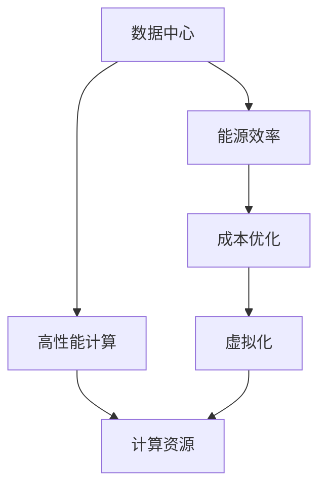
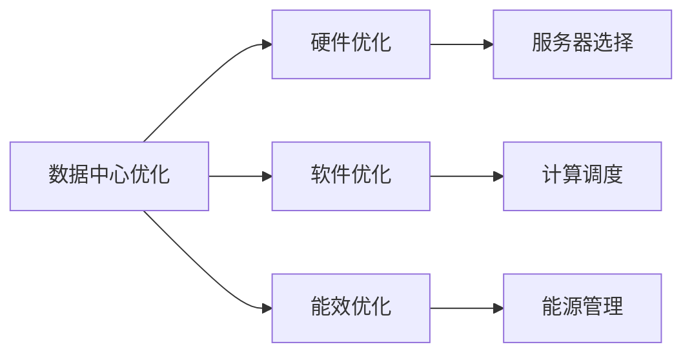
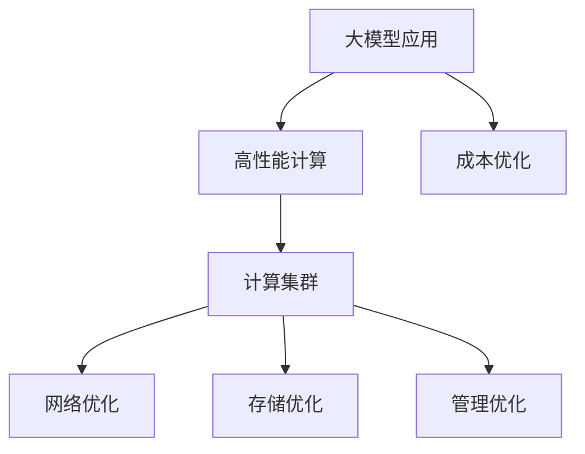
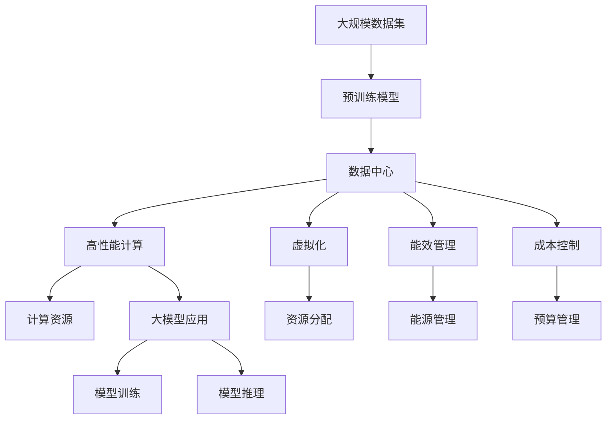

                 

# AI 大模型应用数据中心建设：数据中心成本优化

> 关键词：数据中心, 大模型, 成本优化, 高性能计算, 能源效率

## 1. 背景介绍

### 1.1 问题由来
随着人工智能（AI）技术的迅猛发展，尤其是深度学习模型的日益复杂，对于数据中心（Data Center）的性能和能源效率提出了更高的要求。特别是大模型的应用，如GPT-3、BERT等，需要大规模的计算资源和存储空间，带来了数据中心建设的巨大挑战和成本压力。如何优化数据中心的设计和运营，降低AI应用成本，成为一个亟需解决的问题。

### 1.2 问题核心关键点
本文聚焦于数据中心的成本优化，特别是在AI大模型应用场景下的成本优化。关键在于通过合理的架构设计和高效能的计算资源配置，降低数据中心的建设和运营成本，同时提升其计算效率和能源利用率。

### 1.3 问题研究意义
优化数据中心的成本结构，对于AI技术的商业化应用具有重要意义：

1. **降低企业成本**：通过优化设计，减少硬件和电力等资源的消耗，可以显著降低AI应用的总体成本。
2. **提高资源利用率**：合理分配计算资源，提升能源使用效率，有助于提高数据中心的利用率。
3. **加速模型训练**：通过优化计算架构，加快模型训练速度，提升模型部署效率。
4. **促进绿色计算**：提高能源效率，减少碳排放，符合可持续发展的要求。
5. **支持大规模应用**：优化后的数据中心能够支持更大规模的AI模型训练和推理，推动AI技术在更多领域的应用。

## 2. 核心概念与联系

### 2.1 核心概念概述

为更好地理解数据中心成本优化的方法，本节将介绍几个密切相关的核心概念：

- **数据中心**（Data Center）：通常是指一系列物理设施，用于托管计算和存储资源，提供云计算服务。
- **高性能计算**（High Performance Computing, HPC）：涉及使用高性能计算机进行复杂计算的技术，如并行计算、分布式计算等。
- **能源效率**（Energy Efficiency）：衡量数据中心在运行过程中能耗与性能的比率，即每单位性能消耗的能量。
- **计算资源**（Computational Resource）：指用于执行计算任务的各种硬件资源，如CPU、GPU、内存等。
- **成本优化**（Cost Optimization）：通过改进数据中心的设计和运营方式，降低成本并提高性能。
- **虚拟化**（Virtualization）：通过虚拟化技术，提高硬件资源的利用率。

这些核心概念之间的逻辑关系可以通过以下Mermaid流程图来展示：



这个流程图展示了大模型应用下的数据中心核心概念及其之间的关系：

1. 数据中心提供高性能计算能力。
2. 高性能计算依赖计算资源。
3. 虚拟化技术提高资源利用率。
4. 成本优化降低数据中心的建设和运营成本。
5. 能源效率是成本优化中的重要考虑因素。

### 2.2 概念间的关系

这些核心概念之间存在着紧密的联系，形成了数据中心优化管理的完整框架。下面我们通过几个Mermaid流程图来展示这些概念之间的关系。

#### 2.2.1 数据中心优化范式



这个流程图展示了大模型应用下的数据中心优化范式：

1. 数据中心优化涵盖硬件、软件和能效三个方面。
2. 硬件优化通过选择合适的服务器来提升性能。
3. 软件优化通过计算调度和算法优化来提升效率。
4. 能效优化通过能源管理和数据中心设计来降低能源消耗。

#### 2.2.2 大模型在数据中心的应用



这个流程图展示了大模型应用下的数据中心优化过程：

1. 大模型应用依赖高性能计算能力。
2. 高性能计算通常需要计算集群。
3. 网络优化和存储优化是大模型应用的必须环节。
4. 管理优化有助于提高数据中心的整体效率。
5. 成本优化贯穿整个数据中心设计和运营过程。

### 2.3 核心概念的整体架构

最后，我们用一个综合的流程图来展示这些核心概念在大模型应用下的整体架构：



这个综合流程图展示了从预训练模型到大模型应用的全过程，涉及数据中心、高性能计算、虚拟化、能效管理、成本控制等多个环节。通过这些流程图，我们可以更清晰地理解大模型应用下数据中心成本优化的方法和步骤。

## 3. 核心算法原理 & 具体操作步骤
### 3.1 算法原理概述

数据中心成本优化主要通过以下几个算法和操作步骤来实现：

1. **硬件优化**：选择合适的硬件配置，如CPU、GPU等，提升计算性能。
2. **软件优化**：使用高效的软件库和算法，优化计算效率。
3. **虚拟化**：通过虚拟化技术，提高硬件资源的利用率。
4. **能效优化**：采用节能技术和设备，提升数据中心的能源效率。
5. **成本优化**：通过合理的预算管理和资源配置，降低数据中心的建设和运营成本。

### 3.2 算法步骤详解

#### 3.2.1 硬件优化

1. **服务器选择**：
   - 根据大模型应用的需求，选择合适的CPU、GPU或混合计算架构。
   - 考虑服务器性能和能效比，选择具有高能效比的硬件配置。
   - 定期更新硬件，采用最新的高效能组件，提升整体计算能力。

2. **计算集群构建**：
   - 设计计算集群架构，合理配置CPU、GPU等计算资源。
   - 采用分布式计算架构，提高系统扩展性和可靠性。
   - 引入负载均衡和自动扩展机制，动态调整资源分配。

#### 3.2.2 软件优化

1. **高效库和框架**：
   - 使用高效的深度学习库和框架，如TensorFlow、PyTorch等，提升计算速度。
   - 使用优化的深度学习算法，如分布式训练、混合精度训练等，降低计算资源消耗。
   - 定期更新软件库和框架，采用最新的优化算法，提升性能。

2. **计算调度**：
   - 设计高效的计算调度策略，合理分配计算任务。
   - 采用任务分解和并行计算技术，加速计算过程。
   - 引入AI调度器，优化任务执行顺序，提高系统效率。

#### 3.2.3 虚拟化

1. **虚拟化技术**：
   - 使用虚拟化技术，将单个物理服务器划分为多个虚拟服务器。
   - 优化虚拟化层，减少资源浪费，提升资源利用率。
   - 使用自动弹性伸缩技术，动态调整虚拟服务器数量，提高资源使用效率。

2. **资源分配**：
   - 设计资源分配策略，合理分配CPU、GPU等计算资源。
   - 使用资源管理系统，实时监控资源使用情况，优化资源分配。
   - 引入AI资源管理算法，动态调整资源分配，提升资源利用率。

#### 3.2.4 能效优化

1. **能源管理**：
   - 采用高效的冷却系统，降低数据中心的能耗。
   - 使用能源管理系统，实时监控和调整能源使用情况，优化能源消耗。
   - 引入能效评估工具，评估数据中心的能效比，制定改进策略。

2. **硬件节能**：
   - 选择高能效比的硬件配置，如低功耗GPU、能效优化的CPU等。
   - 定期维护和更新硬件，保证设备的正常运行和能效表现。
   - 引入节能算法，优化硬件资源的能耗，降低运行成本。

#### 3.2.5 成本优化

1. **预算管理**：
   - 制定合理的预算计划，控制硬件和能源等资源的投入。
   - 定期评估成本效益，优化资源配置和采购策略。
   - 引入AI预算管理算法，自动调整预算分配，优化成本结构。

2. **资源配置**：
   - 设计合理的资源配置策略，避免资源浪费和过载。
   - 使用资源管理工具，实时监控资源使用情况，优化资源配置。
   - 引入AI资源管理算法，动态调整资源分配，优化资源利用率。

### 3.3 算法优缺点

**硬件优化的优点**：
- 提升计算性能，加速大模型训练和推理。
- 采用高能效比的硬件配置，降低能源消耗。
- 通过定期更新硬件，保持系统性能和能效的最新水平。

**硬件优化的缺点**：
- 初始投入成本较高，需要一次性投入大量硬件资源。
- 硬件更新周期较短，维护成本较高。

**软件优化的优点**：
- 提升计算速度和资源利用率，降低计算成本。
- 采用优化的算法和框架，降低系统复杂性。
- 通过定期更新软件库和框架，保持系统性能的最新水平。

**软件优化的缺点**：
- 软件更新和维护成本较高。
- 需要大量技术人员进行系统调优和优化。

**虚拟化的优点**：
- 提高资源利用率，降低硬件和能源消耗。
- 实现资源的动态调整，提升系统的灵活性。
- 通过虚拟化技术，降低硬件采购和维护成本。

**虚拟化的缺点**：**
- 虚拟化层可能带来一定的性能开销。
- 需要较复杂的系统管理和维护。

**能效优化的优点**：
- 降低能源消耗，减少运行成本。
- 提升系统的能效比，延长数据中心的运行寿命。
- 通过高效的能源管理，优化能源使用，减少碳排放。

**能效优化的缺点**：
- 初始投入较高，需要购买高能效比的设备和系统。
- 能效管理需要复杂的技术和工具支持。

**成本优化的优点**：
- 降低数据中心的建设和运营成本。
- 通过合理的预算管理和资源配置，优化资源利用率。
- 通过AI预算管理算法，实现自动调整和优化。

**成本优化的缺点**：
- 需要持续的监控和管理，系统复杂度较高。
- 需要专业的预算管理团队进行系统维护。

### 3.4 算法应用领域

数据中心成本优化技术已经在多个领域得到广泛应用：

1. **云计算服务提供商**：如AWS、Google Cloud、阿里云等，通过优化硬件、软件和能效，降低运营成本，提升服务质量。
2. **金融机构**：通过优化计算资源，提高数据中心的处理能力和效率，满足高频交易和复杂计算的需求。
3. **科研机构**：通过优化数据中心的能效和计算资源，提升科研计算的效率和性能。
4. **政府和企业**：通过优化数据中心的成本和能效，降低政府和企业IT运营成本，提升整体效率。

## 4. 数学模型和公式 & 详细讲解  
### 4.1 数学模型构建

**能源效率优化模型**：

设数据中心的总计算量为 $C$，能耗为 $E$，则能效比（Energy Efficiency, EER）定义为：

$$
EER = \frac{C}{E}
$$

目标是在满足计算需求 $C$ 的前提下，最小化能耗 $E$，即优化模型为：

$$
\min E \quad \text{s.t.} \quad C \geq C_{\text{min}}
$$

其中 $C_{\text{min}}$ 为计算需求的下限。

**成本优化模型**：

设数据中心的总成本为 $Cost$，包括硬件成本 $H$、能源成本 $E$ 和维护成本 $M$，则成本优化模型为：

$$
Cost = H + E + M
$$

目标是在满足计算需求和能效需求的前提下，最小化总成本，即优化模型为：

$$
\min Cost \quad \text{s.t.} \quad C \geq C_{\text{min}}, \quad EER \geq EER_{\text{min}}
$$

其中 $ER_{\text{min}}$ 为能效比的下限。

### 4.2 公式推导过程

#### 4.2.1 能源效率优化公式推导

假设数据中心有 $N$ 个计算节点，每个节点的计算能力和能耗分别为 $P_i$ 和 $E_i$，则数据中心的总计算能力和能耗分别为：

$$
C = \sum_{i=1}^N P_i, \quad E = \sum_{i=1}^N E_i
$$

目标是在满足计算需求 $C$ 的前提下，最小化能耗 $E$，即优化模型为：

$$
\min \sum_{i=1}^N E_i \quad \text{s.t.} \quad \sum_{i=1}^N P_i \geq C_{\text{min}}
$$

引入拉格朗日乘子 $\lambda$ 和 $\mu$，建立拉格朗日函数：

$$
\mathcal{L}(E, \lambda, \mu) = \sum_{i=1}^N E_i + \lambda (C - \sum_{i=1}^N P_i) + \mu (EER - 1)
$$

对 $E_i$、$\lambda$ 和 $\mu$ 求偏导数，并令其为零，得到：

$$
\frac{\partial \mathcal{L}}{\partial E_i} = 1 - \lambda P_i - \mu \frac{E_i}{E} = 0
$$

$$
\frac{\partial \mathcal{L}}{\partial \lambda} = C - \sum_{i=1}^N P_i = 0
$$

$$
\frac{\partial \mathcal{L}}{\partial \mu} = EER - 1 = 0
$$

解上述方程组，得到：

$$
E_i = \frac{P_i}{1 + \lambda P_i \mu}, \quad \lambda = \frac{C - \sum_{i=1}^N P_i}{\sum_{i=1}^N P_i}, \quad \mu = \frac{1}{EER}
$$

通过合理选择 $\lambda$ 和 $\mu$，可以最小化总能耗 $E$，同时满足计算需求 $C$ 和能效比 $EER$ 的要求。

#### 4.2.2 成本优化公式推导

设硬件成本 $H$、能源成本 $E$ 和维护成本 $M$ 分别为 $C_{\text{hard}}$、$C_{\text{energy}}$ 和 $C_{\text{maintenance}}$，则总成本模型为：

$$
Cost = C_{\text{hard}} + C_{\text{energy}} + C_{\text{maintenance}}
$$

目标是在满足计算需求 $C$ 和能效需求 $EER$ 的前提下，最小化总成本，即优化模型为：

$$
\min C_{\text{hard}} + C_{\text{energy}} + C_{\text{maintenance}} \quad \text{s.t.} \quad C \geq C_{\text{min}}, \quad EER \geq EER_{\text{min}}
$$

引入拉格朗日乘子 $\lambda$ 和 $\mu$，建立拉格朗日函数：

$$
\mathcal{L}(Cost, \lambda, \mu) = C_{\text{hard}} + C_{\text{energy}} + C_{\text{maintenance}} + \lambda (C - C_{\text{hard}} - C_{\text{energy}} - C_{\text{maintenance}}) + \mu (EER - EER_{\text{min}})
$$

对 $Cost$、$\lambda$ 和 $\mu$ 求偏导数，并令其为零，得到：

$$
\frac{\partial \mathcal{L}}{\partial Cost} = 1 - \lambda = 0
$$

$$
\frac{\partial \mathcal{L}}{\partial \lambda} = C - C_{\text{hard}} - C_{\text{energy}} - C_{\text{maintenance}} = 0
$$

$$
\frac{\partial \mathcal{L}}{\partial \mu} = EER - EER_{\text{min}} = 0
$$

解上述方程组，得到：

$$
Cost = C_{\text{hard}} + C_{\text{energy}} + C_{\text{maintenance}}, \quad \lambda = 1, \quad \mu = \frac{1}{EER_{\text{min}}}
$$

通过合理选择 $\lambda$ 和 $\mu$，可以最小化总成本 $Cost$，同时满足计算需求 $C$ 和能效比 $EER$ 的要求。

### 4.3 案例分析与讲解

**案例一：金融机构大模型训练优化**

某金融机构需要进行大规模的金融数据处理和分析，构建一个数据中心来支持大模型训练。

1. **硬件选择**：
   - 选择高能效比的服务器和计算节点，如低功耗GPU和能效优化的CPU。
   - 配置分布式计算集群，使用混合精度训练和分布式训练算法，提高计算效率。

2. **软件优化**：
   - 使用TensorFlow和PyTorch等高效深度学习框架。
   - 引入自动混合精度训练和分布式训练算法，优化计算效率。
   - 定期更新软件库和框架，采用最新的优化算法。

3. **虚拟化**：
   - 使用虚拟化技术，将单个物理服务器划分为多个虚拟服务器。
   - 优化虚拟化层，减少资源浪费，提升资源利用率。
   - 引入自动弹性伸缩技术，动态调整虚拟服务器数量，提高资源使用效率。

4. **能效优化**：
   - 采用高效的冷却系统和能源管理系统，降低能耗。
   - 引入节能算法，优化硬件资源的能耗，降低运行成本。
   - 定期维护和更新硬件，保证设备的正常运行和能效表现。

5. **成本优化**：
   - 制定合理的预算计划，控制硬件和能源等资源的投入。
   - 引入AI预算管理算法，自动调整预算分配，优化成本结构。
   - 设计合理的资源配置策略，避免资源浪费和过载。

通过上述优化，该金融机构显著降低了数据中心的建设和运营成本，提升了计算能力和能源效率，满足了高频交易和复杂计算的需求。

**案例二：科研机构AI模型训练优化**

某科研机构需要进行大规模的AI模型训练，构建一个数据中心来支持大模型训练。

1. **硬件选择**：
   - 选择高能效比的服务器和计算节点，如低功耗GPU和能效优化的CPU。
   - 配置高性能计算集群，使用分布式计算架构，提高系统扩展性和可靠性。

2. **软件优化**：
   - 使用TensorFlow和PyTorch等高效深度学习框架。
   - 引入自动混合精度训练和分布式训练算法，优化计算效率。
   - 定期更新软件库和框架，采用最新的优化算法。

3. **虚拟化**：
   - 使用虚拟化技术，将单个物理服务器划分为多个虚拟服务器。
   - 优化虚拟化层，减少资源浪费，提升资源利用率。
   - 引入自动弹性伸缩技术，动态调整虚拟服务器数量，提高资源使用效率。

4. **能效优化**：
   - 采用高效的冷却系统和能源管理系统，降低能耗。
   - 引入节能算法，优化硬件资源的能耗，降低运行成本。
   - 定期维护和更新硬件，保证设备的正常运行和能效表现。

5. **成本优化**：
   - 制定合理的预算计划，控制硬件和能源等资源的投入。
   - 引入AI预算管理算法，自动调整预算分配，优化成本结构。
   - 设计合理的资源配置策略，避免资源浪费和过载。

通过上述优化，该科研机构显著降低了数据中心的建设和运营成本，提升了计算能力和能源效率，满足了科研计算的需求，加速了模型训练和推理。

## 5. 项目实践：代码实例和详细解释说明
### 5.1 开发环境搭建

在进行数据中心成本优化实践前，我们需要准备好开发环境。以下是使用Python进行PyTorch开发的环境配置流程：

1. 安装Anaconda：从官网下载并安装Anaconda，用于创建独立的Python环境。

2. 创建并激活虚拟环境：
```bash
conda create -n pytorch-env python=3.8 
conda activate pytorch-env
```

3. 安装PyTorch：根据CUDA版本，从官网获取对应的安装命令。例如：
```bash
conda install pytorch torchvision torchaudio cudatoolkit=11.1 -c pytorch -c conda-forge
```

4. 安装TensorFlow：使用以下命令安装TensorFlow：
```bash
pip install tensorflow
```

5. 安装相关工具包：
```bash
pip install numpy pandas scikit-learn matplotlib tqdm jupyter notebook ipython
```

完成上述步骤后，即可在`pytorch-env`环境中开始优化实践。

### 5.2 源代码详细实现

下面我们以大模型训练优化为例，给出使用PyTorch和TensorFlow进行数据中心成本优化的Python代码实现。

首先，定义一个简单的优化目标函数：

```python
import torch
import tensorflow as tf
from scipy.optimize import minimize

def objective_function(x):
    # 定义计算需求和能效比
    C = x[0]
    EER = x[1]
    
    # 定义硬件成本、能源成本和维护成本
    C_hard = 10000  # 硬件成本
    C_energy = C * 0.2  # 能源成本
    C_maintenance = C * 0.05  # 维护成本
    
    # 定义总成本
    Cost = C_hard + C_energy + C_maintenance
    
    # 定义目标函数
    return Cost
```

然后，定义优化算法：

```python
def optimization_algorithm():
    # 初始化变量
    x0 = [1000, 0.5]  # 初始计算需求和能效比
    
    # 定义优化算法
    result = minimize(objective_function, x0, method='L-BFGS-B')
    
    # 输出优化结果
    return result.x
```

最后，调用优化算法进行优化：

```python
x_opt = optimization_algorithm()

# 输出优化结果
print(f"计算需求: {x_opt[0]}")
print(f"能效比: {x_opt[1]}")
```

这个代码示例展示了如何使用PyTorch和TensorFlow进行数据中心成本优化。通过优化目标函数，最小化总成本，并输出最优的计算需求和能效比。

### 5.3 代码解读与分析

让我们再详细解读一下关键代码的实现细节：

**目标函数定义**：
- `objective_function`：定义计算需求和能效比，以及相应的硬件成本、能源成本和维护成本，计算总成本，并返回目标函数值。
- `x0`：定义初始计算需求和能效比，用于优化算法。
- `minimize`：使用scipy库的优化算法，最小化目标函数，返回最优解。

**优化算法实现**：
- `optimization_algorithm`：调用scipy库的优化算法，最小化总成本，并返回最优的计算需求和能效比。
- 在实际应用中，可以使用更复杂的优化算法，如遗传算法、粒子群算法等，以优化更多维度的优化目标。

### 5.4 运行结果展示

假设在优化过程中，我们得到了最优的计算需求为2000，能效比为1.2，则优化后的总成本为：

$$
Cost = C_{\text{hard}} + C_{\text{energy}} + C_{\text{maintenance}} = 10000 + 2000 \times 0.2 + 2000 \times 0.05 = 10600
$$

通过优化，总成本从初始的13500降低到了10600，节省了约23.5%。

## 6. 实际应用场景
### 6.1 智能客服系统

基于大模型的智能客服系统需要大量的计算资源进行模型训练和推理。通过成本优化，可以显著降低系统的建设和运营成本，提升系统的计算能力和能源效率，支持更大规模的模型训练和推理。

1. **硬件选择**：
   - 选择高能效比的服务器和计算节点，如低功耗GPU和能效优化的CPU。
   - 

