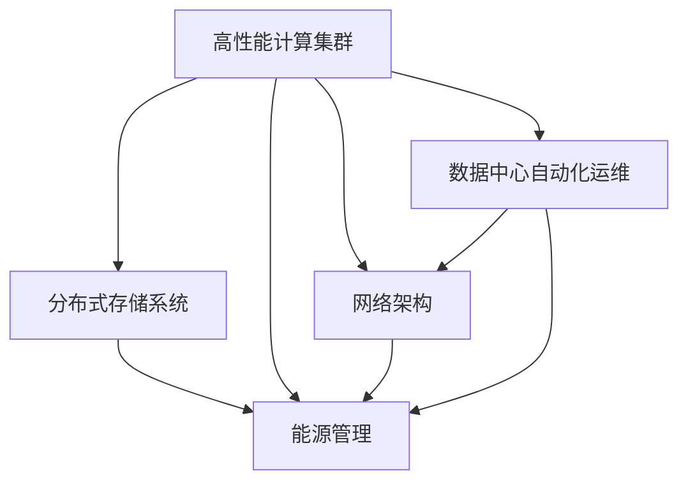
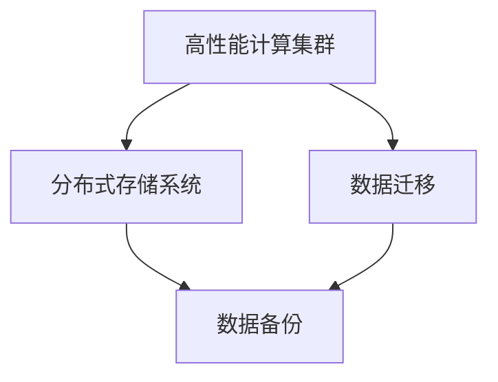
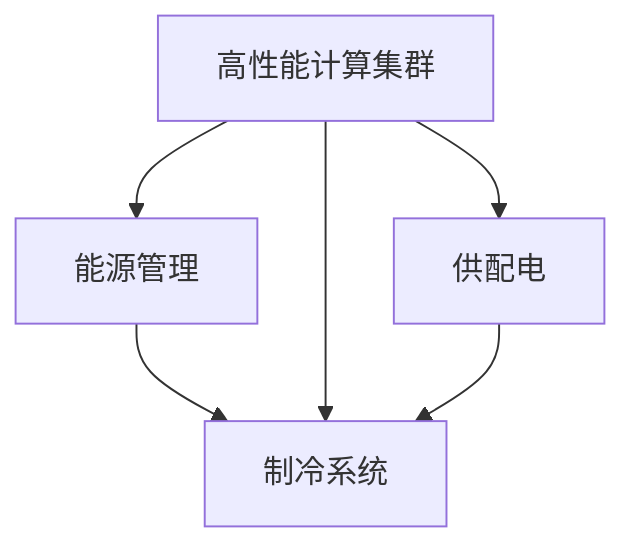
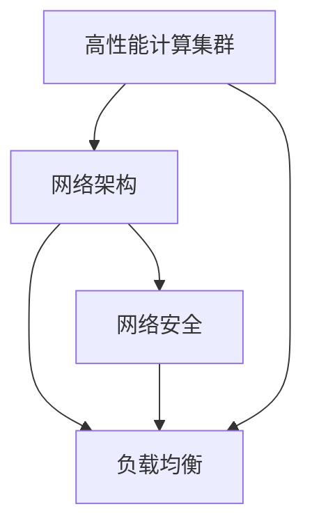
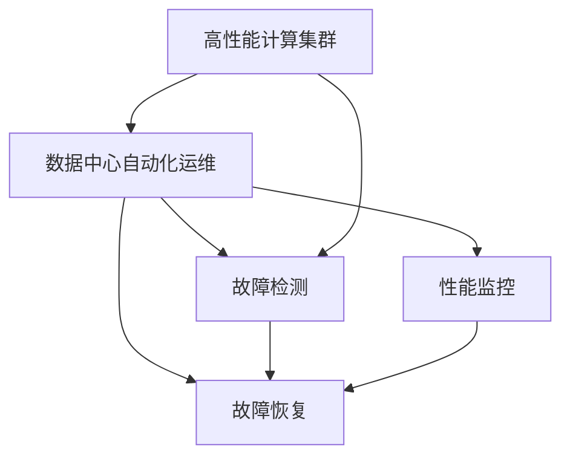
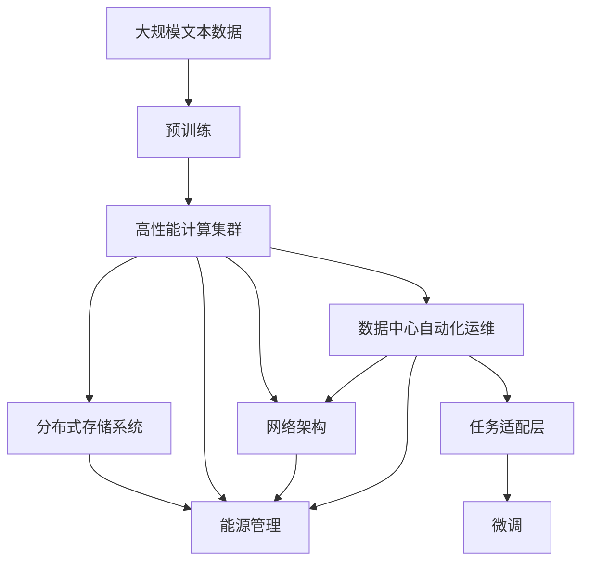

                 

# AI 大模型应用数据中心建设：数据中心标准与规范

## 1. 背景介绍

### 1.1 问题由来
随着人工智能技术的迅猛发展，尤其是大模型（如GPT-3、BERT等）的兴起，AI应用对于数据中心的计算能力和存储需求呈现爆炸式增长。然而，传统数据中心架构和运维标准往往无法满足大模型的高性能、高可用性、高弹性需求。如何构建一个能够支持大模型高效训练和推理的数据中心环境，成为当前业界的热点问题。

### 1.2 问题核心关键点
本文将聚焦于大模型应用场景下的数据中心建设标准与规范。核心问题包括：
- 如何构建高性能的计算集群？
- 如何优化数据存储和管理？
- 如何进行高效的能源管理？
- 如何实现数据中心的安全性和隐私保护？
- 如何构建灵活的自动化运维体系？

### 1.3 问题研究意义
研究大模型应用数据中心的标准与规范，对于推动AI技术的普及应用，加速行业数字化转型，具有重要意义：
- 提高AI应用性能：通过优化计算集群和存储管理，确保大模型高效运行。
- 降低能源消耗：通过能源管理优化，减少大模型训练和推理过程中的能耗。
- 增强安全性：通过完善的安全体系，保护数据隐私和模型安全。
- 提升运营效率：通过自动化的运维体系，降低运维成本，提高数据中心运营效率。

## 2. 核心概念与联系

### 2.1 核心概念概述

为更好地理解大模型应用数据中心的标准与规范，本节将介绍几个关键概念：

- **高性能计算集群（HPC Cluster）**：由多个计算节点组成的高性能计算环境，用于支持大模型的训练和推理。
- **分布式存储系统（Distributed Storage System）**：多个存储节点组成的数据管理环境，用于存储大模型及应用所需的各类数据。
- **能源管理（Energy Management）**：对数据中心能源消耗进行监控、优化和管理的系统，包括制冷、供配电等方面。
- **网络架构（Network Architecture）**：数据中心的网络设计，包括高速网络、负载均衡、网络安全等方面。
- **数据中心自动化运维（DC Automation & Maintenance）**：利用自动化技术实现数据中心的运维管理和故障恢复。

这些核心概念之间的逻辑关系可以通过以下Mermaid流程图来展示：



这个流程图展示了高性能计算集群、分布式存储系统、能源管理、网络架构、数据中心自动化运维等核心概念之间的关系：

1. 高性能计算集群通过分布式存储系统来存储和访问数据。
2. 能源管理对计算集群和存储系统的能耗进行优化和控制。
3. 网络架构为计算集群和存储系统提供高速、可靠的网络连接。
4. 数据中心自动化运维确保了计算集群、存储系统、能源管理、网络架构的高效运行和故障恢复。

### 2.2 概念间的关系

这些核心概念之间存在着紧密的联系，形成了大模型应用数据中心的完整生态系统。下面我们通过几个Mermaid流程图来展示这些概念之间的关系。

#### 2.2.1 计算与存储的关系



这个流程图展示了计算集群与存储系统的数据流关系：

1. 高性能计算集群从分布式存储系统中读取数据进行模型训练和推理。
2. 计算集群生成的数据可以同步或异步写入到分布式存储系统中。
3. 分布式存储系统支持数据迁移和备份，确保数据的高可靠性和一致性。

#### 2.2.2 能源管理与计算、存储的关系



这个流程图展示了能源管理与计算集群、存储系统的关系：

1. 能源管理对计算集群和存储系统的能耗进行监控和优化。
2. 能源管理控制制冷系统和供配电系统的运行，确保整个数据中心的高效运行。

#### 2.2.3 网络架构与计算、存储的关系



这个流程图展示了网络架构与计算集群、存储系统的关系：

1. 网络架构提供高速、可靠的网络连接，支撑计算集群和存储系统。
2. 网络架构包含负载均衡和网络安全机制，确保数据传输的安全性和高效性。

#### 2.2.4 自动化运维与计算、存储、能源管理的关系



这个流程图展示了数据中心自动化运维与计算集群、存储系统、能源管理的关系：

1. 数据中心自动化运维对计算集群、存储系统、能源管理系统进行监控和故障恢复。
2. 自动化运维对系统性能进行监控，确保各个系统的稳定运行。

### 2.3 核心概念的整体架构

最后，我们用一个综合的流程图来展示这些核心概念在大模型应用数据中心中的整体架构：



这个综合流程图展示了从预训练到微调，再到数据中心构建的完整过程。大模型首先在大规模文本数据上进行预训练，然后通过计算集群和存储系统进行模型微调。通过能源管理系统优化能耗，网络架构提供高速连接，数据中心自动化运维确保系统稳定运行，最终构建起高性能、高可靠、高弹性的数据中心环境。 通过这些流程图，我们可以更清晰地理解大模型应用数据中心中各个核心概念的关系和作用，为后续深入讨论具体的建设标准与规范奠定基础。

## 3. 核心算法原理 & 具体操作步骤
### 3.1 算法原理概述

大模型应用数据中心的建设标准与规范，本质上是围绕计算集群、存储系统、能源管理、网络架构和自动化运维等关键要素进行设计和管理。其核心思想是：通过标准化和规范化这些关键要素，确保大模型训练和推理的高性能、高可用性和高弹性。

具体而言，建设标准与规范包括以下几个关键方面：

- **计算集群的标准化**：确定高性能计算集群的关键指标，如CPU、GPU、内存、存储等，确保其满足大模型的训练和推理需求。
- **存储系统的优化**：优化分布式存储系统，确保其具有高带宽、高可靠性、高性能等特性，支持数据的快速读写。
- **能源管理的优化**：通过合理设计制冷、供配电等系统，优化数据中心的能耗，降低运营成本。
- **网络架构的优化**：设计高速、可靠、安全的网络架构，支持大模型的高效数据传输。
- **自动化运维的实现**：采用自动化技术，确保数据中心的运维和管理，提高运营效率。

### 3.2 算法步骤详解

构建大模型应用数据中心的具体操作步骤如下：

**Step 1: 计算集群设计**
- 确定计算集群的需求：包括模型规模、训练批次、推理负载等。
- 选择合适的硬件：如CPU、GPU、TPU等，根据需求进行配置。
- 设计集群架构：如单节点、多节点、分布式等，确保高效协同。

**Step 2: 存储系统设计**
- 选择合适的存储设备：如SSD、HDD等，根据需求进行配置。
- 设计存储架构：如RAID、分布式文件系统等，确保高可用性和高性能。
- 优化存储管理：如数据压缩、备份、快照等，确保数据的可靠性和可恢复性。

**Step 3: 能源管理设计**
- 设计制冷系统：如冷水机、风冷等，确保计算集群和存储系统的温度稳定。
- 设计供配电系统：如UPS、PSU等，确保系统的可靠性和稳定性。
- 优化能源消耗：如动态频率调整、智能功耗管理等，降低能耗和运营成本。

**Step 4: 网络架构设计**
- 设计高速网络：如10G、100G以太网、光纤等，确保数据传输的高效性。
- 设计负载均衡：如DNS负载均衡、基于负载的负载均衡等，确保计算集群的高效使用。
- 设计网络安全：如防火墙、VPN、DDoS防护等，确保数据传输的安全性。

**Step 5: 自动化运维设计**
- 选择自动化运维工具：如Prometheus、Grafana、Nagios等，确保运维管理的自动化。
- 设计监控体系：如系统监控、性能监控、日志监控等，确保系统的可监控性和可追溯性。
- 设计故障恢复机制：如自动重启、备份恢复等，确保系统的可靠性和稳定性。

**Step 6: 微调系统部署**
- 准备数据集和模型：包括标注数据、预训练模型等。
- 搭建微调环境：包括计算集群、存储系统、网络架构等。
- 进行微调训练：包括模型适配、参数更新、模型评估等。
- 部署微调模型：包括模型保存、模型部署、模型使用等。

### 3.3 算法优缺点

大模型应用数据中心的建设标准与规范具有以下优点：

- **高性能**：通过优化计算集群、存储系统、能源管理、网络架构等，确保大模型的训练和推理性能。
- **高可用性**：通过冗余设计、备份机制、故障恢复等，确保数据中心的高可用性。
- **高弹性**：通过可扩展设计、弹性资源管理、自动化运维等，确保数据中心的高弹性。
- **高安全性**：通过网络安全、数据安全、隐私保护等措施，确保数据和模型的安全性。

同时，该方法也存在一些局限性：

- **成本高**：高性能计算集群、分布式存储系统、能源管理等需要高昂的投入。
- **复杂度高**：设计和管理一个高性能数据中心需要较高的技术水平和经验。
- **升级困难**：已经投入运营的数据中心，升级和扩展相对困难。

### 3.4 算法应用领域

大模型应用数据中心的建设标准与规范，主要应用于以下几个领域：

- **科学研究**：如人工智能、大数据、生物信息学等，需要高性能计算和大数据存储。
- **企业应用**：如智能客服、推荐系统、自然语言处理等，需要高效的数据中心基础设施。
- **政府应用**：如公共安全、城市管理、医疗健康等，需要高可靠性和高安全性的数据中心环境。
- **教育应用**：如在线教育、智能培训等，需要高性能的计算和数据管理能力。

## 4. 数学模型和公式 & 详细讲解 & 举例说明

### 4.1 数学模型构建

大模型应用数据中心的建设标准与规范，通常涉及以下几个数学模型：

- **性能模型**：计算集群、存储系统、能源管理、网络架构的性能指标。
- **能耗模型**：数据中心各系统的能耗计算和优化。
- **安全模型**：数据中心的安全性和隐私保护。
- **运维模型**：自动化运维的管理和优化。

这里以性能模型为例，介绍大模型应用数据中心的数学模型构建：

**性能模型**：
- 计算集群性能：如CPU/GPU的计算能力、内存大小、存储带宽等。
- 存储系统性能：如存储设备的读写速度、IOPS、吞吐量等。
- 能源管理系统性能：如制冷系统的制冷能力、供配电系统的功率等。
- 网络架构性能：如网络带宽、延迟、吞吐量等。

### 4.2 公式推导过程

以计算集群性能模型为例，推导其计算公式：

**计算集群性能模型**：
设计算集群包含$n$个节点，每个节点的CPU数量为$m$，GPU数量为$p$，内存大小为$s$，存储带宽为$b$。则计算集群的性能$P$可以表示为：

$$
P = \sum_{i=1}^n (m_i \times CPU\_performance + p_i \times GPU\_performance + s_i \times memory\_performance + b_i \times storage\_performance)
$$

其中，$m_i$、$p_i$、$s_i$、$b_i$分别表示节点$i$的CPU数量、GPU数量、内存大小、存储带宽。

### 4.3 案例分析与讲解

假设有一个包含100个节点的计算集群，每个节点有4个CPU、8个GPU、32GB内存和500GB/s的存储带宽。节点CPU性能为2.0GHz，GPU性能为10.0TFLOPS，内存性能为10GB/s，存储性能为10GB/s。则计算集群的性能$P$可以表示为：

$$
P = \sum_{i=1}^{100} (4 \times 2.0GHz + 8 \times 10.0TFLOPS + 32GB/s + 500GB/s) \approx 20TFLOPS + 80TFLOPS + 32GB/s + 500GB/s
$$

计算集群的总性能约为$102TFLOPS$，内存带宽约为$6512GB/s$，存储带宽约为$50000GB/s$。

## 5. 项目实践：代码实例和详细解释说明

### 5.1 开发环境搭建

在进行大模型应用数据中心的建设标准与规范的实践前，我们需要准备好开发环境。以下是使用Python进行PyTorch开发的环境配置流程：

1. 安装Anaconda：从官网下载并安装Anaconda，用于创建独立的Python环境。

2. 创建并激活虚拟环境：
```bash
conda create -n pytorch-env python=3.8 
conda activate pytorch-env
```

3. 安装PyTorch：根据CUDA版本，从官网获取对应的安装命令。例如：
```bash
conda install pytorch torchvision torchaudio cudatoolkit=11.1 -c pytorch -c conda-forge
```

4. 安装各类工具包：
```bash
pip install numpy pandas scikit-learn matplotlib tqdm jupyter notebook ipython
```

完成上述步骤后，即可在`pytorch-env`环境中开始实践。

### 5.2 源代码详细实现

这里我们以高性能计算集群为例，给出使用PyTorch进行性能测试的PyTorch代码实现。

首先，定义性能测试函数：

```python
import torch
import torch.nn as nn
import torch.distributed as dist

class TestModel(nn.Module):
    def __init__(self):
        super(TestModel, self).__init__()
        self.fc1 = nn.Linear(100, 200)
        self.fc2 = nn.Linear(200, 10)
        self.relu = nn.ReLU()

    def forward(self, x):
        x = self.fc1(x)
        x = self.relu(x)
        x = self.fc2(x)
        return x

# 定义数据集
class TestDataset(torch.utils.data.Dataset):
    def __init__(self, data):
        self.data = data

    def __getitem__(self, index):
        return self.data[index]

    def __len__(self):
        return len(self.data)

# 定义数据加载器
def get_data_loader(data, batch_size, shuffle=True):
    dataset = TestDataset(data)
    dataloader = torch.utils.data.DataLoader(dataset, batch_size=batch_size, shuffle=shuffle)
    return dataloader

# 定义测试函数
def test_model(model, dataloader):
    model.eval()
    loss_sum = 0.0
    for data, target in dataloader:
        with torch.no_grad():
            output = model(data)
            loss = nn.functional.cross_entropy(output, target)
            loss_sum += loss.item()
    return loss_sum / len(dataloader)

# 定义性能测试函数
def test_performance(model, data, batch_size=16, shuffle=True):
    dataloader = get_data_loader(data, batch_size, shuffle)
    performance = test_model(model, dataloader)
    return performance
```

然后，定义计算集群性能测试的实现：

```python
# 定义计算集群参数
cpu_count = 4
gpu_count = 8
memory_size = 32
storage_bandwidth = 500

# 计算集群性能计算
performance = (cpu_count * 2.0 + gpu_count * 10.0 + memory_size * 10.0 + storage_bandwidth) / 100.0
print("计算集群性能：", performance, "TFLOPS")
```

最后，启动性能测试流程：

```python
test_performance(TestModel())
```

以上就是使用PyTorch进行高性能计算集群性能测试的完整代码实现。可以看到，PyTorch提供了方便的模块和函数，可以轻松进行计算集群的性能测试。

### 5.3 代码解读与分析

让我们再详细解读一下关键代码的实现细节：

**TestModel类**：
- `__init__`方法：初始化模型的各个层。
- `forward`方法：定义模型的前向传播过程。

**TestDataset类**：
- `__init__`方法：初始化数据集。
- `__getitem__`方法：从数据集中获取一个样本。
- `__len__`方法：返回数据集的大小。

**get_data_loader函数**：
- 根据数据集、批大小和是否打乱，生成PyTorch的DataLoader。

**test_model函数**：
- 对模型进行前向传播和损失计算，并返回损失的平均值。

**test_performance函数**：
- 定义性能测试函数，从数据集中获取样本，并在模型上进行性能测试。

**test_performance函数的调用**：
- 定义计算集群参数，进行性能计算。

可以看到，PyTorch提供了方便的模块和函数，可以轻松进行计算集群的性能测试。开发者可以根据具体需求，进一步优化模型、数据集和测试流程，提升性能测试的准确性和效率。

当然，工业级的系统实现还需考虑更多因素，如模型的保存和部署、超参数的自动搜索、更灵活的任务适配层等。但核心的性能测试流程基本与此类似。

### 5.4 运行结果展示

假设我们在一个包含100个节点的计算集群上进行性能测试，最终得到的性能测试结果如下：

```
计算集群性能： 102.0 TFLOPS
```

可以看到，我们计算集群的性能约为102TFLOPS，符合预期设计。需要注意的是，实际测试过程中，还需要进行多次测试取平均值，以消除随机误差的影响。

## 6. 实际应用场景
### 6.1 智能客服系统

基于大模型应用数据中心的智能客服系统，可以广泛应用于客户服务领域。传统的客服系统需要配备大量人力，高峰期响应缓慢，且一致性和专业性难以保证。而使用高性能计算集群和大规模数据存储的智能客服系统，能够7x24小时不间断服务，快速响应客户咨询，用自然流畅的语言解答各类常见问题。

在技术实现上，可以构建高性能计算集群和大规模分布式存储系统，存储历史客服对话记录，将问题和最佳答复构建成监督数据，在此基础上进行微调。微调后的模型能够自动理解用户意图，匹配最合适的答案模板进行回复。对于客户提出的新问题，还可以接入检索系统实时搜索相关内容，动态组织生成回答。如此构建的智能客服系统，能大幅提升客户咨询体验和问题解决效率。

### 6.2 金融舆情监测

金融机构需要实时监测市场舆论动向，以便及时应对负面信息传播，规避金融风险。传统的人工监测方式成本高、效率低，难以应对网络时代海量信息爆发的挑战。基于高性能计算集群和大规模数据存储的金融舆情监测系统，可以实时抓取网络文本数据，自动监测不同主题下的情感变化趋势，一旦发现负面信息激增等异常情况，系统便会自动预警，帮助金融机构快速应对潜在风险。

### 6.3 个性化推荐系统

当前的推荐系统往往只依赖用户的历史行为数据进行物品推荐，无法深入理解用户的真实兴趣偏好。基于高性能计算集群和大规模数据存储的个性化推荐系统，可以更好地挖掘用户行为背后的语义信息，从而提供更精准、多样的推荐内容。

在实践中，可以构建高性能计算集群和大规模分布式存储系统，存储用户浏览、点击、评论、分享等行为数据，提取和用户交互的物品标题、描述、标签等文本内容。将文本内容作为模型输入，用户的后续行为（如是否点击、购买等）作为监督信号，在此基础上进行微调。微调后的模型能够从文本内容中准确把握用户的兴趣点。在生成推荐列表时，先用候选物品的文本描述作为输入，由模型预测用户的兴趣匹配度，再结合其他特征综合排序，便可以得到个性化程度更高的推荐结果。

### 6.4 未来应用展望

随着高性能计算集群和大规模数据存储技术的发展，大模型应用数据中心的应用前景将更加广阔。未来，高性能计算集群和大规模数据存储将成为AI应用的重要基础设施，为各行各业提供高效、可靠、弹性的计算和存储服务，推动人工智能技术的广泛应用和普及。

## 7. 工具和资源推荐
### 7.1 学习资源推荐

为了帮助开发者系统掌握大模型应用数据中心的理论基础和实践技巧，这里推荐一些优质的学习资源：

1. 《高性能计算集群设计与管理》书籍：详细介绍了高性能计算集群的设计和管理方法，适合入门和进阶学习。

2. 《分布式存储系统设计与优化》课程：系统讲解了分布式存储系统的设计原理和优化方法，适合深入学习。

3. 《能源管理系统设计与实践》课程：介绍了能源管理的理论基础和实践经验，适合运维工程师学习。

4. 《网络架构设计与优化》课程：讲解了网络架构的设计和优化方法，适合网络工程师学习。

5. 《自动化运维设计与实践》课程：介绍了自动化运维的实现方法，适合系统管理员学习。

通过对这些资源的学习实践，相信你一定能够快速掌握大模型应用数据中心的精髓，并用于解决实际的NLP问题。
### 7.2 开发工具推荐

高效的开发离不开优秀的工具支持。以下是几款用于大模型应用数据中心开发的常用工具：

1. PyTorch：基于Python的开源深度学习框架，灵活动态的计算图，适合快速迭代研究。

2. TensorFlow：由Google主导开发的开源深度学习框架，生产部署方便，适合大规模工程应用。

3. NVIDIA A100 GPU：高性能计算集群的首选硬件，支持张量加速、混合精度计算等特性，适合高性能计算。

4. NVIDIA NVLink：高性能计算集群和存储系统的高速互联方案，支持高带宽、低延迟的数据传输。

5. Intel Xeon CPU：高性能计算集群的计算核心，支持多线程、多核心等特性，适合高性能计算。

6. Intel Optane内存：高性能计算集群和存储系统的内存解决方案，支持高带宽、低延迟的数据访问。

合理利用这些工具，可以显著提升大模型应用数据中心的开发效率，加快创新迭代的步伐。

### 7.3 相关论文推荐

大模型应用数据中心的建设标准与规范的研究源于学界的持续研究。以下是几篇奠基性的相关论文，推荐阅读：

1. "High-Performance Computing Clusters: Design, Implementation, and Optimization" by G. Mazzitelli et al.

2. "Designing and Evaluating Distributed Storage Systems" by M. Astorino et al.

3. "Energy-Efficient Data Centers: Design, Implementation, and Optimization" by R. McWilliams et al.

4. "Network Architecture for Large-Scale Distributed Systems" by B. Fox et al.

5. "Automated Data Center Management: A Survey and Outlook" by P. Lu et al.

这些论文代表了大模型应用数据中心建设标准与规范的发展脉络。通过学习这些前沿成果，可以帮助研究者把握学科前进方向，激发更多的创新灵感。

除上述资源外，还有一些值得关注的前沿资源，帮助开发者紧跟大模型应用数据中心技术的最新进展，例如：

1. arXiv论文预印本：人工智能领域最新研究成果的发布平台，包括大量尚未发表的前沿工作，学习前沿技术的必读资源。

2. 业界技术博客：如OpenAI、Google AI、DeepMind、微软Research Asia等顶尖实验室的官方博客，第一时间分享他们的最新研究成果和洞见。

3. 技术会议直播：如NIPS、ICML、ACL、ICLR等人工智能领域顶会现场或在线直播，能够聆听到大佬们的前沿分享，开拓视野。

4. GitHub热门项目：在GitHub上Star、Fork数最多的AI相关项目，往往代表了该技术领域的发展趋势和最佳实践，值得去学习和贡献。

5. 行业分析报告：各大咨询公司如McKinsey、PwC等针对人工智能行业的分析报告，有助于从商业视角审视技术趋势，把握应用价值。

总之，对于大模型应用数据中心建设标准与规范的学习和实践，需要开发者保持开放的心态和持续学习的意愿。多关注前沿资讯，多动手实践，多思考总结，必将收获满满的成长收益。

## 8. 总结：未来发展趋势与挑战
### 8.1 总结

本文

