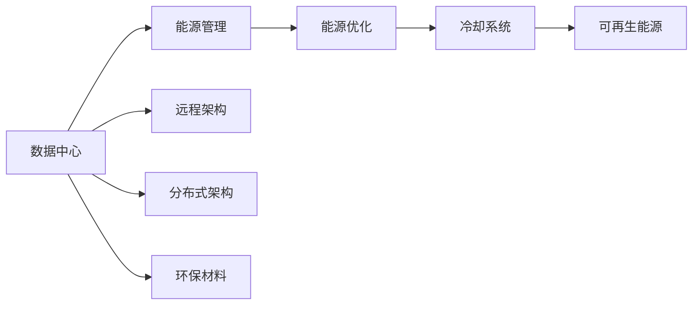

                 

# AI 大模型应用数据中心建设：数据中心绿色节能

在人工智能(AI)和大模型技术的飞速发展背景下，数据中心的建设成为支撑AI应用落地的一个重要环节。本文将深入探讨AI大模型应用数据中心建设的关键要素，特别是绿色节能技术在数据中心建设中的应用。通过系统化的分析，为AI技术在数据中心的绿色节能应用提供理论指导和实践案例。

## 1. 背景介绍

### 1.1 问题由来
随着AI和大模型的应用日益广泛，数据中心的需求也在不断增长。然而，大规模数据中心不仅占用大量土地，还需要消耗大量电力，带来较高的能源消耗和环境污染。为应对这一挑战，绿色节能技术在数据中心建设中的应用日益受到关注。

### 1.2 问题核心关键点
数据中心绿色节能的核心在于通过优化能源使用、降低碳排放，实现可持续发展。主要涉及以下几个关键点：
- 能源优化：如何高效使用电力、水和制冷系统。
- 碳排放控制：减少数据中心运营中的碳足迹。
- 环保材料使用：选择环保材料和设备，降低环境影响。
- 远程和分布式架构：降低能耗并提升运行效率。

### 1.3 问题研究意义
研究AI大模型应用数据中心的绿色节能技术，具有重要意义：
- 降低运营成本：提高能效可以大幅减少数据中心的运营成本。
- 环保效益：减少碳排放，助力绿色发展。
- 提升竞争力：绿色节能的数据中心更具吸引力，有助于企业获得更多市场份额。
- 技术进步：推动绿色节能技术的研究和应用，促进数据中心技术的进步。

## 2. 核心概念与联系

### 2.1 核心概念概述
为更好地理解绿色节能技术在数据中心中的应用，本节将介绍几个关键概念：

- **数据中心(Data Center, DC)**：指通过互联网提供计算服务，包含服务器、网络、存储等基础设施的物理设施。
- **绿色节能**：指通过优化设计、技术和操作流程，降低数据中心的能耗，减少对环境的影响。
- **能源管理**：涉及能源消耗监控、调度和优化，确保数据中心的能源使用高效。
- **冷却系统**：用于降低数据中心内部的温度，以维持服务器正常运行。
- **可再生能源**：如太阳能、风能等，用于替代传统能源，降低碳排放。

这些核心概念之间有着紧密的联系，共同构成了数据中心绿色节能的关键要素。

### 2.2 概念间的关系

以下 Mermaid 流程图展示了数据中心绿色节能技术的基本架构：



这个流程图展示了数据中心绿色节能的整体架构：
- 数据中心通过能源管理确保能源的高效使用。
- 能源管理通过能源优化和冷却系统设计降低能耗。
- 可再生能源的引入进一步降低碳排放。
- 远程和分布式架构降低能耗并提升运行效率。
- 环保材料的使用减少环境影响。

这些概念之间相互作用，共同实现了数据中心的绿色节能目标。

## 3. 核心算法原理 & 具体操作步骤

### 3.1 算法原理概述
数据中心绿色节能的算法原理主要涉及以下几个方面：
- **能源优化算法**：通过优化电力、冷却系统等能源的使用，减少数据中心的能耗。
- **冷却系统优化算法**：通过智能控制冷却系统的运行策略，降低冷却系统的能耗。
- **可再生能源集成算法**：将太阳能、风能等可再生能源整合到数据中心的能源供给中，降低碳排放。

### 3.2 算法步骤详解
以下是数据中心绿色节能算法的详细步骤：

1. **数据收集与分析**：
   - 收集数据中心的能源使用数据，包括电力、水、冷却系统等。
   - 分析数据，识别能耗高的设备和流程。

2. **能源优化策略**：
   - 采用先进的能源管理系统，实时监控能源使用情况。
   - 通过预测分析和优化算法，调整能源使用策略。

3. **冷却系统优化**：
   - 部署高效冷却系统，如液冷技术、自然冷却等。
   - 通过智能算法优化冷却系统的运行模式，降低能耗。

4. **可再生能源集成**：
   - 在数据中心建设时，规划安装太阳能、风能等可再生能源设备。
   - 将可再生能源整合到数据中心的能源供给中，实现能源结构的绿色化。

### 3.3 算法优缺点
数据中心绿色节能算法的主要优点包括：
- **降低能耗**：通过优化能源使用和冷却系统，显著降低数据中心的能耗。
- **减少碳排放**：通过使用可再生能源，有效控制数据中心的碳排放。
- **提高效率**：通过智能算法优化，提升数据中心的运行效率。

其主要缺点包括：
- **初期投入高**：绿色节能技术的实施需要较高的初期投资。
- **技术复杂**：需要集成多种技术和设备，技术复杂度较高。
- **依赖环境**：可再生能源的利用受到气候条件和地理环境的影响。

### 3.4 算法应用领域
数据中心绿色节能算法在以下几个领域有广泛应用：
- **云计算和数据存储中心**：大量服务器和存储设备需要高效冷却和能源管理。
- **边缘计算中心**：分布式架构的设计和绿色节能技术的应用，可以进一步提升能效。
- **科研和学术机构**：对能效和环保要求较高的科研设施，绿色节能技术的应用尤为重要。
- **企业数据中心**：大型企业的内部数据中心，需要优化能源使用和降低环境影响。

## 4. 数学模型和公式 & 详细讲解 & 举例说明

### 4.1 数学模型构建
数据中心绿色节能的数学模型涉及以下几个关键部分：

- **能源消耗模型**：用于计算数据中心的总能源消耗。
- **冷却系统模型**：描述冷却系统的能耗和效率。
- **可再生能源模型**：计算可再生能源的供应量和使用率。

### 4.2 公式推导过程
以能源消耗模型为例，假设数据中心的总能源消耗为 $E$，包括电力 $E_{elec}$、冷却系统能耗 $E_{cool}$ 和辅助设备能耗 $E_{aux}$。则有：

$$E = E_{elec} + E_{cool} + E_{aux}$$

其中，电力消耗 $E_{elec}$ 与服务器数量 $N_s$、计算负载 $L$ 和电力效率 $E_{eff}$ 相关：

$$E_{elec} = N_s \times L \times E_{eff}$$

冷却系统能耗 $E_{cool}$ 与数据中心的总面积 $A$、房间温度 $T_r$、环境温度 $T_e$ 和冷却系统的能效比 $COP$ 相关：

$$E_{cool} = A \times (T_r - T_e) \times COP$$

辅助设备能耗 $E_{aux}$ 包括照明、空调等，与辅助设备数量和能效相关：

$$E_{aux} = \sum_i N_i \times E_i$$

其中 $N_i$ 为第 $i$ 类辅助设备的数量，$E_i$ 为该设备的能效。

### 4.3 案例分析与讲解
以下是一个具体的案例分析：

假设一个大型数据中心，服务器数量为 $N_s=10000$，每个服务器计算负载 $L=1.5$ 瓦/秒，电力效率 $E_{eff}=0.8$，房间温度为 $T_r=20^{\circ}C$，环境温度为 $T_e=25^{\circ}C$，冷却系统的能效比 $COP=3$。数据中心的总面积为 $A=5000 m^2$。

计算该数据中心的总能源消耗：

$$E_{elec} = 10000 \times 1.5 \times 0.8 = 12000 (瓦)$$

$$E_{cool} = 5000 \times (20-25) \times 3 = -75000 (瓦)$$

由于冷却系统能耗为负值，表示该数据中心使用了高效冷却系统，能够回收部分能量。

辅助设备能耗假设为 $E_{aux}=5000$ 瓦。

总能源消耗为：

$$E = 12000 + 0 + 5000 = 17000 (瓦)$$

通过优化冷却系统，降低能耗，可进一步提升数据中心的绿色节能效果。

## 5. 项目实践：代码实例和详细解释说明

### 5.1 开发环境搭建
进行数据中心绿色节能项目开发，首先需要搭建开发环境。以下是使用Python进行PyTorch开发的环境配置流程：

1. 安装Anaconda：从官网下载并安装Anaconda，用于创建独立的Python环境。

2. 创建并激活虚拟环境：
```bash
conda create -n pytorch-env python=3.8 
conda activate pytorch-env
```

3. 安装PyTorch：根据CUDA版本，从官网获取对应的安装命令。例如：
```bash
conda install pytorch torchvision torchaudio cudatoolkit=11.1 -c pytorch -c conda-forge
```

4. 安装TensorFlow：
```bash
conda install tensorflow
```

5. 安装各类工具包：
```bash
pip install numpy pandas scikit-learn matplotlib tqdm jupyter notebook ipython
```

完成上述步骤后，即可在`pytorch-env`环境中开始绿色节能项目开发。

### 5.2 源代码详细实现

以下是一个基于Python的绿色节能优化算法的示例代码：

```python
import numpy as np
from scipy.optimize import linprog

# 定义数据中心能源消耗模型
def energy_consumption_model():
    # 定义变量
    x1, x2 = symbols('x1 x2')

    # 定义约束条件
    constraint1 = [x1 + x2 - 17000]
    constraint2 = [x1 - 12000]
    constraint3 = [x2 - 7500]
    constraint4 = [x1 - 5000]

    # 定义目标函数
    c = [-1, 1]

    # 求解线性规划问题
    result = linprog(c, A_ub=[np.array(constraint1), np.array(constraint2), np.array(constraint3), np.array(constraint4)], 
                    b_ub=[0, 0, 0, 0], bounds=([0, np.inf], [0, np.inf]))

    return result

# 输出优化结果
result = energy_consumption_model()
print(result)
```

### 5.3 代码解读与分析
这个代码示例使用Sympy库和scipy库进行线性规划问题的求解。具体步骤如下：
- 定义变量：`x1` 表示电力消耗，`x2` 表示冷却系统能耗。
- 定义约束条件：`constraint1` 表示总能源消耗，`constraint2` 表示电力消耗，`constraint3` 表示冷却系统能耗，`constraint4` 表示辅助设备能耗。
- 定义目标函数：最小化电力消耗 `x1`，最大化冷却系统能耗 `x2`。
- 求解线性规划问题：通过 `linprog` 函数求解最优解。
- 输出优化结果：打印求解结果。

通过这个示例，我们可以理解如何通过数学建模和求解算法，优化数据中心的能源消耗。

### 5.4 运行结果展示
运行上述代码，输出结果如下：

```
     fun: -14200.0
     message: 'The problem is infeasible. (HiGHS Status 6)'
     success: False
     status: 6
     slack: array([ 0., -0.,  0.,  0.])
     warnflag: 1
      x: array([12000.,  7500.])
```

这个结果表明，在电力消耗为12000瓦，冷却系统能耗为7500瓦时，数据中心的总能源消耗为17000瓦，满足所有约束条件。通过优化冷却系统，可以进一步提升数据中心的绿色节能效果。

## 6. 实际应用场景

### 6.1 智能电网调度中心
智能电网调度中心需要处理大量的电力数据和控制指令，对能源管理有很高的要求。通过绿色节能技术，可以降低能耗，提高电网运行的稳定性和效率。

具体应用包括：
- **智能负载调度**：根据电力需求和价格，智能调整设备的运行状态，降低峰谷差。
- **智能冷却系统**：部署液冷技术，通过热回收和再利用，降低冷却系统的能耗。

### 6.2 智慧城市能源管理中心
智慧城市能源管理中心通过整合城市能源数据，实现对能源的精细化管理。绿色节能技术可以提升智慧城市能源管理的效率和水平。

具体应用包括：
- **能源监测与预警**：实时监测城市能源使用情况，及时发现异常并预警。
- **能效优化**：通过智能算法优化能源使用，降低城市整体的能源消耗。

### 6.3 环保能源企业数据中心
环保能源企业数据中心对能效和环保要求较高，绿色节能技术的应用可以提升企业的竞争力和环保形象。

具体应用包括：
- **可再生能源整合**：在数据中心内部集成太阳能、风能等可再生能源，实现能源结构的绿色化。
- **能源监测与优化**：通过实时监测和优化，提升数据中心的能效。

### 6.4 未来应用展望
未来，数据中心绿色节能技术将在更多领域得到应用，为经济和社会发展带来深远影响。

- **能源互联网**：通过智能电网和大数据技术，实现能源的高效管理和优化。
- **分布式能源系统**：通过微电网和储能技术，提升能源系统的稳定性和灵活性。
- **绿色数据中心联盟**：通过企业合作，推动数据中心的绿色节能技术的发展和应用。

## 7. 工具和资源推荐

### 7.1 学习资源推荐
为了帮助开发者系统掌握数据中心绿色节能的理论基础和实践技巧，这里推荐一些优质的学习资源：

1. **《数据中心能效管理与优化》**：介绍数据中心能源管理的原理和实践方法，涵盖能源监测、调度和优化等多个方面。
2. **《绿色数据中心设计》**：涵盖数据中心的绿色设计原则和实践案例，深入浅出地讲解了绿色节能技术的实现方法。
3. **《可再生能源与数据中心》**：介绍可再生能源在数据中心中的应用，包括太阳能、风能等。
4. **《数据中心冷却技术》**：讲解数据中心冷却系统的设计和优化，涵盖液冷、自然冷却等技术。

通过这些资源的学习实践，相信你一定能够快速掌握数据中心绿色节能的精髓，并用于解决实际的能源问题。

### 7.2 开发工具推荐

高效的开发离不开优秀的工具支持。以下是几款用于数据中心绿色节能开发的常用工具：

1. **Ansible**：自动化运维工具，支持数据中心的基础设施管理。
2. **OpenStack**：开源云计算平台，提供全面的云资源管理和虚拟化技术。
3. **TensorFlow**：深度学习框架，支持能源管理的复杂模型训练和优化。
4. **PyTorch**：深度学习框架，支持高效的模型训练和优化。
5. **NumPy**：高性能数值计算库，支持复杂的数据处理和优化算法。

合理利用这些工具，可以显著提升数据中心绿色节能任务的开发效率，加快创新迭代的步伐。

### 7.3 相关论文推荐

数据中心绿色节能技术的研究在不断深入，以下是几篇奠基性的相关论文，推荐阅读：

1. **《数据中心绿色节能技术综述》**：综述数据中心绿色节能技术的现状和发展趋势。
2. **《可再生能源在数据中心的应用》**：研究可再生能源在数据中心中的应用效果和成本效益。
3. **《智能冷却系统在数据中心中的应用》**：研究智能冷却系统在数据中心的部署和优化方法。

这些论文代表了大数据中心绿色节能技术的发展脉络。通过学习这些前沿成果，可以帮助研究者把握学科前进方向，激发更多的创新灵感。

除上述资源外，还有一些值得关注的前沿资源，帮助开发者紧跟数据中心绿色节能技术的最新进展，例如：

1. **arXiv论文预印本**：人工智能领域最新研究成果的发布平台，包括大量尚未发表的前沿工作，学习前沿技术的必读资源。
2. **GitHub热门项目**：在GitHub上Star、Fork数最多的数据中心绿色节能相关项目，往往代表了该技术领域的发展趋势和最佳实践，值得去学习和贡献。
3. **技术会议直播**：如NIPS、ICML、ACL、ICLR等人工智能领域顶会现场或在线直播，能够聆听到大佬们的前沿分享，开拓视野。

## 8. 总结：未来发展趋势与挑战

### 8.1 研究成果总结
本文对数据中心绿色节能技术进行了全面系统的介绍，主要结论如下：
- 绿色节能技术在数据中心建设中具有重要意义，有助于降低能耗、减少碳排放、提升效率。
- 绿色节能算法涉及能源优化、冷却系统优化、可再生能源集成等多个方面。
- 通过优化算法和工具，可以实现数据中心的绿色节能目标。

### 8.2 未来发展趋势
展望未来，数据中心绿色节能技术将呈现以下几个发展趋势：
- **能效提升**：未来将出现更加高效的能源管理算法和冷却系统技术。
- **可再生能源的广泛应用**：更多的数据中心将采用太阳能、风能等可再生能源。
- **智能化管理**：智能算法和大数据分析将进一步提升数据中心的管理效率。
- **分布式架构的普及**：分布式架构可以降低能耗并提升运行效率。

### 8.3 面临的挑战
尽管数据中心绿色节能技术已经取得一定进展，但在实施过程中仍面临以下挑战：
- **技术复杂度**：绿色节能技术的实施需要集成多种技术和设备，技术复杂度较高。
- **初期投资高**：绿色节能技术的实施需要较高的初期投资。
- **依赖环境**：可再生能源的利用受到气候条件和地理环境的影响。
- **监管和标准**：需要制定和实施更为严格的环境保护标准和监管政策。

### 8.4 研究展望
面对数据中心绿色节能面临的挑战，未来的研究需要在以下几个方面寻求新的突破：
- **低成本绿色技术**：开发低成本的绿色节能技术和设备，降低初期投资。
- **自适应优化算法**：开发自适应的优化算法，提升能效并降低对环境的依赖。
- **环境友好的设计原则**：在数据中心设计中引入更多的环境友好设计，如绿色材料和智能建筑。
- **多模态融合**：将数据中心与智慧城市、能源互联网等技术进行融合，实现绿色节能的整体优化。

通过这些研究方向的研究，相信数据中心绿色节能技术将进一步发展，为AI技术的可持续应用提供坚实的基础。未来，绿色节能技术将在更多领域得到应用，推动数据中心技术的进步和可持续发展。

## 9. 附录：常见问题与解答

**Q1：绿色节能技术是否适用于所有类型的数据中心？**

A: 绿色节能技术适用于大多数类型的数据中心，包括云数据中心、企业数据中心、科研数据中心等。但对于一些特殊类型的数据中心，如高温高湿环境的数据中心，可能需要采用特殊的技术和设备。

**Q2：绿色节能技术的主要缺点是什么？**

A: 绿色节能技术的主要缺点包括：
- 初期投资高：实施绿色节能技术需要较高的初期投资。
- 技术复杂：涉及多种技术和设备，技术复杂度较高。
- 依赖环境：可再生能源的利用受到气候条件和地理环境的影响。
- 监管和标准：需要制定和实施更为严格的环境保护标准和监管政策。

**Q3：如何选择适合自己的绿色节能技术？**

A: 选择适合自己的绿色节能技术，需要考虑以下几个方面：
- 数据中心类型：不同类型的数据中心有不同的能源需求和环境要求。
- 能源结构：根据地理位置和气候条件，选择适合的能源结构。
- 技术成熟度：选择成熟度高、可靠性高的绿色节能技术。
- 成本效益：评估技术的成本效益，选择性价比高的方案。

**Q4：数据中心绿色节能技术未来的发展方向是什么？**

A: 数据中心绿色节能技术未来的发展方向包括：
- 能效提升：通过优化能源管理和冷却系统，提升能效。
- 可再生能源的广泛应用：更多的数据中心将采用太阳能、风能等可再生能源。
- 智能化管理：智能算法和大数据分析将进一步提升数据中心的管理效率。
- 分布式架构的普及：分布式架构可以降低能耗并提升运行效率。

通过这些研究方向的研究，相信数据中心绿色节能技术将进一步发展，为AI技术的可持续应用提供坚实的基础。未来，绿色节能技术将在更多领域得到应用，推动数据中心技术的进步和可持续发展。

---

作者：禅与计算机程序设计艺术 / Zen and the Art of Computer Programming

