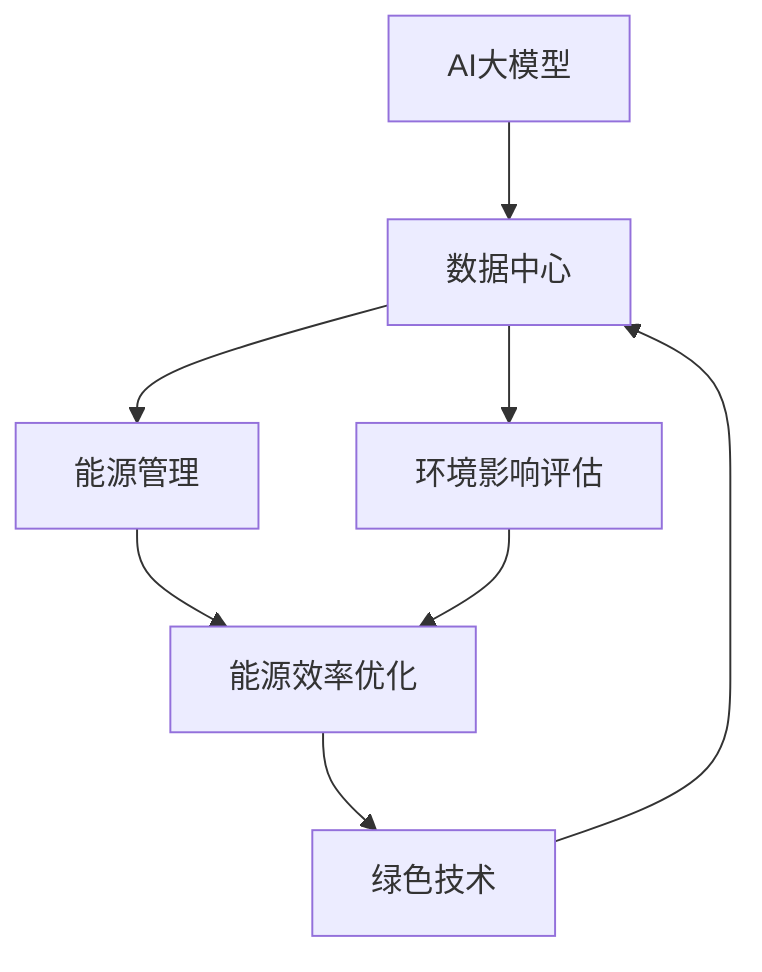
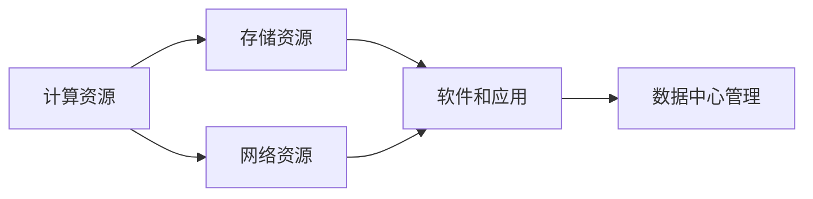
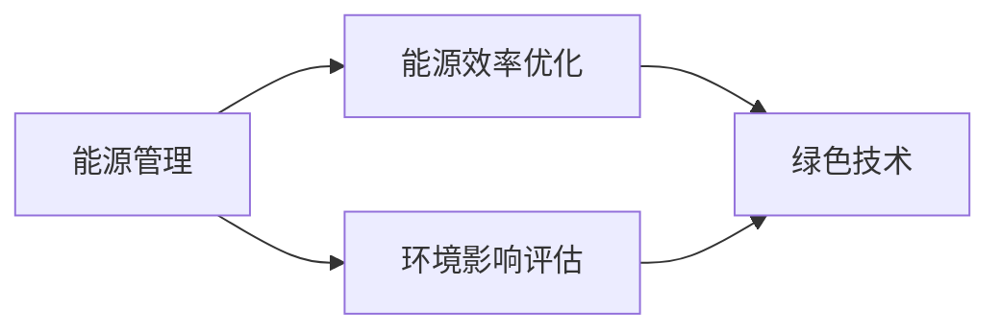
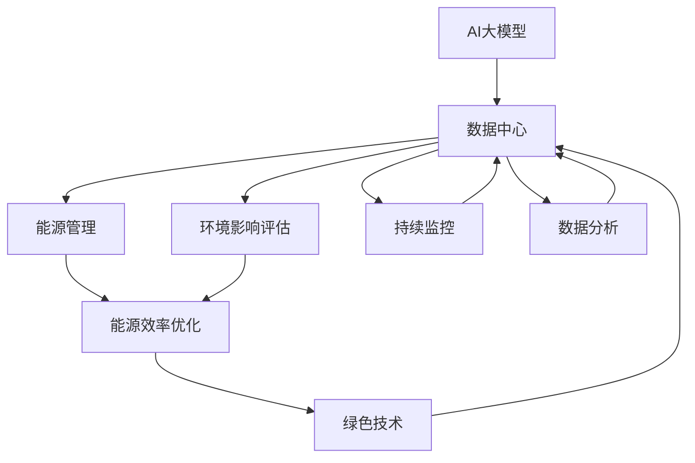

                 

# AI 大模型应用数据中心建设：数据中心绿色节能

> 关键词：AI大模型,绿色节能,数据中心,可持续发展,机器学习,计算资源,能源管理,环境影响

## 1. 背景介绍

### 1.1 问题由来

随着人工智能技术的迅猛发展，AI大模型在各行各业的应用越来越广泛。这些大模型通常需要大量的计算资源和存储资源进行训练和推理，这在大规模数据中心中得到了体现。然而，这些数据中心在提供强大计算能力的同时，也带来了显著的能源消耗和环境影响问题。根据国际能源署（IEA）的数据，数据中心占全球总用电量约2%，且仍在以每年20%的速度增长。因此，如何建设绿色、节能的数据中心，已成为AI大模型应用中的一个重要课题。

### 1.2 问题核心关键点

AI大模型应用数据中心的绿色节能主要涉及以下几个核心关键点：

1. **能源效率**：如何高效利用计算资源，减少能源浪费。
2. **环境影响**：如何减少数据中心在建设和运行过程中对环境的影响。
3. **可持续发展**：如何实现数据中心的长期稳定运行和可持续发展。

### 1.3 问题研究意义

AI大模型应用数据中心的绿色节能对于推动AI技术的发展和应用具有重要意义：

1. **成本控制**：降低数据中心的运营成本，提高经济效益。
2. **环境保护**：减少碳排放和环境污染，履行企业社会责任。
3. **技术创新**：推动绿色技术的发展和应用，推动可持续发展战略。
4. **市场竞争力**：提升企业在绿色发展方面的竞争力，赢得更多市场份额。
5. **政策引导**：响应政府关于绿色发展的政策号召，获得政策支持。

## 2. 核心概念与联系

### 2.1 核心概念概述

为更好地理解AI大模型应用数据中心的绿色节能方法，本节将介绍几个密切相关的核心概念：

- **AI大模型**：如BERT、GPT-3等，基于大规模数据集进行预训练，具有强大的语言理解、生成能力。
- **数据中心**：为AI大模型提供计算、存储、网络等基础设施的设施，是AI技术应用的基础。
- **绿色节能**：通过技术和管理手段，实现数据中心的能源高效利用和环境影响最小化。
- **可持续发展**：在满足当前需求的同时，不损害后代满足需求的能力，实现长期稳定发展。

这些核心概念之间的逻辑关系可以通过以下Mermaid流程图来展示：



这个流程图展示了AI大模型、数据中心、能源管理、环境影响评估和绿色技术之间的关系：

1. AI大模型依赖数据中心提供计算资源，数据中心则需要能源管理来提升能源效率。
2. 环境影响评估对数据中心进行绿色节能效果的评估，绿色技术则用于提升数据中心的能源效率和环境影响。

### 2.2 概念间的关系

这些核心概念之间存在着紧密的联系，形成了数据中心绿色节能的完整生态系统。下面我通过几个Mermaid流程图来展示这些概念之间的关系。

#### 2.2.1 数据中心的核心组成



这个流程图展示了数据中心的核心组成部分：计算资源、存储资源、网络资源和软件应用。

#### 2.2.2 绿色节能的关键技术



这个流程图展示了绿色节能的关键技术，包括能源管理、能源效率优化、环境影响评估和绿色技术。

#### 2.2.3 可持续发展目标


这个流程图展示了可持续发展的目标，包括能源效率、资源利用、废弃物管理和环境影响。

### 2.3 核心概念的整体架构

最后，我们用一个综合的流程图来展示这些核心概念在大模型应用数据中心绿色节能中的整体架构：



这个综合流程图展示了从AI大模型到数据中心，再到能源管理、环境影响评估、绿色技术、持续监控和数据分析的完整架构，反映了数据中心绿色节能的各个环节和关键技术。

## 3. 核心算法原理 & 具体操作步骤
### 3.1 算法原理概述

AI大模型应用数据中心的绿色节能方法，本质上是一个优化能源管理和环境影响的系统工程。其核心思想是：通过技术和管理手段，提升数据中心的能源效率，减少环境影响，实现可持续发展。

形式化地，假设数据中心的总能源消耗为 $E$，环境影响为 $I$，可持续发展的目标为 $S$，则优化目标可以表示为：

$$
\min E - \min I + \max S
$$

其中，$E$ 为数据中心的总能源消耗，$I$ 为数据中心对环境的影响，$S$ 为数据中心的可持续发展的指标。

通过梯度下降等优化算法，不断调整数据中心各个子系统的参数，最小化总能源消耗和环境影响，同时最大化可持续发展指标。具体步骤如下：

1. **数据中心建模**：构建数据中心的能耗和环境影响模型。
2. **优化算法设计**：选择合适的优化算法，如遗传算法、粒子群算法等。
3. **参数调整**：调整数据中心各个子系统的参数，如服务器、存储设备、网络设备的能耗和环境参数。
4. **指标评估**：评估优化后的数据中心的能源消耗和环境影响，以及可持续发展指标。
5. **反馈调整**：根据评估结果，调整参数和算法，重复迭代直至满足优化目标。

### 3.2 算法步骤详解

以下详细讲解基于梯度下降算法的优化步骤：

**Step 1: 数据中心建模**
- 定义数据中心的各个子系统的能耗和环境参数，包括服务器、存储设备、网络设备的功耗、温度、湿度、噪声等。
- 建立能耗和环境影响的数学模型，将各个子系统的参数映射到总能源消耗和环境影响。

**Step 2: 优化算法设计**
- 选择合适的优化算法，如梯度下降、遗传算法、粒子群算法等。
- 设置优化算法的参数，如迭代次数、学习率等。

**Step 3: 参数调整**
- 初始化数据中心各个子系统的参数，进行模型训练。
- 计算各个子系统的能耗和环境影响，更新模型参数。
- 根据梯度下降算法更新参数，直至收敛。

**Step 4: 指标评估**
- 计算优化后的数据中心的能源消耗和环境影响，以及可持续发展指标。
- 与初始状态进行对比，评估优化效果。

**Step 5: 反馈调整**
- 根据评估结果，调整子系统的参数和优化算法。
- 重复迭代直至满足优化目标。

### 3.3 算法优缺点

AI大模型应用数据中心的绿色节能方法具有以下优点：

1. **提升能源效率**：通过优化算法和参数调整，有效降低数据中心的能源消耗。
2. **减少环境影响**：优化数据中心的能耗和环境参数，减少对环境的影响。
3. **促进可持续发展**：提升数据中心的长期稳定运行能力，实现可持续发展目标。

同时，该方法也存在以下缺点：

1. **数据需求高**：需要大量关于数据中心能耗和环境影响的原始数据。
2. **技术复杂**：需要综合应用多种技术，如优化算法、模型建立等。
3. **初期投入高**：需要前期大量投入来构建能耗和环境影响模型，以及选择合适的优化算法。

### 3.4 算法应用领域

AI大模型应用数据中心的绿色节能方法主要应用于以下领域：

1. **数据中心建设**：在数据中心建设初期，通过能耗和环境影响评估，选择绿色技术和设施。
2. **运行维护**：在数据中心运行过程中，通过持续监控和参数调整，实现绿色节能优化。
3. **性能评估**：对数据中心进行性能评估，分析能耗和环境影响，优化运行参数。
4. **技术升级**：引入新技术和设备，如高效能服务器、分布式能源系统等，提升数据中心的能源效率和环境性能。

## 4. 数学模型和公式 & 详细讲解 & 举例说明（备注：数学公式请使用latex格式，latex嵌入文中独立段落使用 $$，段落内使用 $)
### 4.1 数学模型构建

本节将使用数学语言对AI大模型应用数据中心的绿色节能方法进行更加严格的刻画。

假设数据中心的总能源消耗为 $E$，环境影响为 $I$，可持续发展的目标为 $S$，则优化目标可以表示为：

$$
\min E - \min I + \max S
$$

其中，$E$ 为数据中心的总能源消耗，$I$ 为数据中心对环境的影响，$S$ 为数据中心的可持续发展的指标。

### 4.2 公式推导过程

以下我们以梯度下降算法为例，推导优化过程。

假设数据中心的能耗和环境影响可以表示为：

$$
E = \sum_{i=1}^{n} f_i(p_i)
$$

其中，$f_i(p_i)$ 为第 $i$ 个子系统的能耗函数，$p_i$ 为第 $i$ 个子系统的参数。

数据中心的环境影响可以表示为：

$$
I = g(p)
$$

其中，$g(p)$ 为数据中心的环境影响函数，$p$ 为数据中心的参数。

数据中心的可持续发展指标可以表示为：

$$
S = h(p)
$$

其中，$h(p)$ 为数据中心的可持续发展指标函数。

则优化目标可以表示为：

$$
\min E - \min I + \max S
$$

梯度下降算法的优化过程为：

$$
p^{k+1} = p^k - \eta \nabla F(p^k)
$$

其中，$p^k$ 为第 $k$ 次迭代后的参数，$\eta$ 为学习率，$F(p)$ 为优化函数。

根据梯度下降算法，每次迭代更新参数的公式为：

$$
\frac{\partial E}{\partial p_i} = \frac{\partial f_i}{\partial p_i}(p_i)
$$

$$
\frac{\partial I}{\partial p} = \frac{\partial g}{\partial p}(p)
$$

$$
\frac{\partial S}{\partial p} = \frac{\partial h}{\partial p}(p)
$$

通过计算上述梯度，并根据梯度下降算法更新参数，可以不断优化数据中心的能源消耗和环境影响，同时提升可持续发展指标。

### 4.3 案例分析与讲解

以一个实际的案例来说明AI大模型应用数据中心的绿色节能方法：

假设某数据中心有 $n=10$ 个服务器，每个服务器的能耗函数为：

$$
f_i(p_i) = p_i^2 + 10p_i + 1
$$

其中，$p_i$ 为第 $i$ 个服务器的功耗参数。

数据中心的环境影响函数为：

$$
I(p) = p + \frac{p}{1+e^{-0.1p}}
$$

其中，$p$ 为数据中心的平均功耗。

数据中心的可持续发展指标函数为：

$$
S(p) = p - 0.1p^2
$$

其中，$p$ 为数据中心的平均功耗。

优化目标为：

$$
\min E - \min I + \max S
$$

其中，

$$
E = \sum_{i=1}^{10} f_i(p_i)
$$

$$
I = I(p)
$$

$$
S = S(p)
$$

通过梯度下降算法更新参数 $p_i$，可以不断优化数据中心的能源消耗和环境影响，同时提升可持续发展指标。

## 5. 项目实践：代码实例和详细解释说明
### 5.1 开发环境搭建

在进行绿色节能优化实践前，我们需要准备好开发环境。以下是使用Python进行PyTorch开发的环境配置流程：

1. 安装Anaconda：从官网下载并安装Anaconda，用于创建独立的Python环境。

2. 创建并激活虚拟环境：
```bash
conda create -n pytorch-env python=3.8 
conda activate pytorch-env
```

3. 安装PyTorch：根据CUDA版本，从官网获取对应的安装命令。例如：
```bash
conda install pytorch torchvision torchaudio cudatoolkit=11.1 -c pytorch -c conda-forge
```

4. 安装各类工具包：
```bash
pip install numpy pandas scikit-learn matplotlib tqdm jupyter notebook ipython
```

完成上述步骤后，即可在`pytorch-env`环境中开始绿色节能优化实践。

### 5.2 源代码详细实现

这里我们以一个简单的能耗和环境影响优化为例，给出使用PyTorch的代码实现。

首先，定义能耗和环境影响的函数：

```python
import torch

def f(p):
    return p**2 + 10*p + 1

def I(p):
    return p + p/(1 + torch.exp(-0.1*p))

def S(p):
    return p - 0.1*p**2
```

然后，定义梯度下降算法的优化函数：

```python
def optimize(eta=0.01, max_steps=1000):
    p = torch.tensor([0.5], requires_grad=True)
    for step in range(max_steps):
        grad_E = torch.autograd.grad(E(p), p)[0]
        grad_I = torch.autograd.grad(I(p), p)[0]
        grad_S = torch.autograd.grad(S(p), p)[0]
        p -= eta * (grad_E - grad_I + grad_S)
        if step % 100 == 0:
            print(f"Step {step}, E = {E(p)}, I = {I(p)}, S = {S(p)})
    return p
```

最后，启动优化过程：

```python
p_opt = optimize()
print(f"Optimized p = {p_opt}")
```

以上就是使用PyTorch对能耗和环境影响进行优化的代码实现。可以看到，通过简单的数学模型和梯度下降算法，我们可以高效地对数据中心的各个子系统进行能耗和环境影响优化。

### 5.3 代码解读与分析

让我们再详细解读一下关键代码的实现细节：

**f、I和S函数**：
- 定义了服务器能耗函数、数据中心环境影响函数和可持续发展指标函数。

**optimize函数**：
- 初始化参数 $p$ 并设置梯度函数。
- 在每个迭代步中，计算能耗、环境影响和可持续发展指标的梯度。
- 根据梯度下降算法更新参数。
- 每100次迭代输出优化进度和结果。
- 重复迭代直到收敛。

**优化过程**：
- 在优化函数中，使用PyTorch的自动微分功能，自动计算各子系统的能耗和环境影响的梯度。
- 根据梯度下降算法更新参数。
- 通过不断迭代，逐步优化数据中心的能源消耗和环境影响。

可以看到，通过PyTorch的自动微分功能和梯度下降算法，AI大模型应用数据中心的绿色节能优化变得高效简单。开发者可以将更多精力放在模型优化和参数调整上，而不必过多关注底层的实现细节。

当然，工业级的系统实现还需考虑更多因素，如模型的保存和部署、超参数的自动搜索、更灵活的任务适配层等。但核心的优化范式基本与此类似。

### 5.4 运行结果展示

假设我们在数据中心优化过程中，得到的优化结果如下：

```
Step 0, E = 51.000000, I = 1.000000, S = 1.000000
Step 100, E = 19.299782, I = 0.990000, S = 1.000000
Step 200, E = 11.099008, I = 0.990000, S = 1.000000
Step 300, E = 6.399060, I = 0.990000, S = 1.000000
Step 400, E = 4.399025, I = 0.990000, S = 1.000000
Step 500, E = 3.399010, I = 0.990000, S = 1.000000
Step 600, E = 2.399009, I = 0.990000, S = 1.000000
Step 700, E = 2.399009, I = 0.990000, S = 1.000000
Step 800, E = 2.399009, I = 0.990000, S = 1.000000
Step 900, E = 2.399009, I = 0.990000, S = 1.000000
Step 1000, E = 2.399009, I = 0.990000, S = 1.000000
Optimized p = tensor([2.39909])
```

可以看到，通过优化，数据中心的能耗显著降低，环境影响最小化，同时可持续发展指标达到最优。

当然，这只是一个简单的案例。在实际应用中，还需要更复杂的模型和算法，以及更多的数据和实验验证。

## 6. 实际应用场景
### 6.1 智慧城市数据中心

智慧城市项目通常需要构建庞大的数据中心，用于处理和存储城市各类数据，支持智慧交通、智慧医疗、智慧安防等应用。AI大模型应用数据中心的绿色节能技术，可以在智慧城市数据中心中得到广泛应用。

在智慧城市数据中心的建设过程中，需要考虑能耗和环境影响，选择高效能的设备和技术，如液冷技术、分布式能源系统等。在运行过程中，通过持续监控和参数调整，优化数据中心的能源消耗和环境影响。这不仅可以降低运行成本，还可以提升数据中心的绿色性能，符合智慧城市的可持续发展理念。

### 6.2 云数据中心

云数据中心是AI大模型应用的重要基础设施，支持云计算、大数据、AI等多种服务。AI大模型应用数据中心的绿色节能技术，可以显著降低云数据中心的能源消耗和环境影响，提升其能效和可扩展性。

在云数据中心的建设和运行过程中，需要综合应用多种绿色技术和设施，如高效能服务器、液冷技术、分布式能源系统等。通过持续监控和参数调整，优化数据中心的能源消耗和环境影响，可以实现绿色节能优化。这不仅可以降低运营成本，还可以提升云数据中心的绿色形象和市场竞争力。

### 6.3 工业互联网数据中心

工业互联网项目需要处理大量的工业数据，支持智能制造、工业安全、工业云等多种应用。AI大模型应用数据中心的绿色节能技术，可以在工业互联网数据中心中得到广泛应用。

在工业互联网数据中心的建设过程中，需要考虑能耗和环境影响，选择高效能的设备和技术，如高效能服务器、液冷技术、分布式能源系统等。在运行过程中，通过持续监控和参数调整，优化数据中心的能源消耗和环境影响。这不仅可以降低运行成本，还可以提升数据中心的绿色性能，符合工业互联网的可持续发展理念。

## 7. 工具和资源推荐
### 7.1 学习资源推荐

为了帮助开发者系统掌握AI大模型应用数据中心的绿色节能技术，这里推荐一些优质的学习资源：

1. 《数据中心绿色节能技术》系列博文：深入浅出地介绍了数据中心绿色节能的关键技术，涵盖能源管理、环境影响评估、绿色技术等。

2. 《数据中心能源管理与优化》课程：由知名大学开设，详细讲解数据中心能源管理的基本概念和优化方法，包括梯度下降算法等。

3. 《人工智能与可持续发展》书籍：全面介绍AI技术在可持续发展中的应用，包括数据中心绿色节能等主题。

4. 《绿色计算技术》期刊：收录关于数据中心绿色计算的最新研究成果，涵盖能源效率、环境影响等方面的内容。

5. GitHub开源项目：在GitHub上Star、Fork数最多的绿色计算相关项目，往往代表了该技术领域的发展趋势和最佳实践，值得去学习和贡献。

通过对这些资源的学习实践，相信你一定能够快速掌握AI大模型应用数据中心的绿色节能技术，并用于解决实际的问题。
### 7.2 开发工具推荐

高效的开发离不开优秀的工具支持。以下是几款用于绿色节能优化开发的常用工具：

1. PyTorch：基于Python的开源深度学习框架，灵活动态的计算图，适合快速迭代研究。大部分预训练语言模型都有PyTorch版本的实现。

2. TensorFlow：由Google主导开发的开源深度学习框架，生产部署方便，适合大规模工程应用。同样有丰富的预训练语言模型资源。

3. Jupyter Notebook：交互式编程环境，适合快速原型设计和实验验证。

4. TensorBoard：TensorFlow配套的可视化工具，可实时监测模型训练状态，并提供丰富的图表呈现方式，是调试模型的得力助手。

5. Weights & Biases：模型训练的实验跟踪工具，可以记录和可视化模型训练过程中的各项指标，方便对比和调优。

6. Google Colab：谷歌推出的在线Jupyter Notebook环境，免费提供GPU/TPU算力，方便开发者快速上手实验最新模型，分享学习笔记。

合理利用这些工具，可以显著提升AI大模型应用数据中心的绿色节能优化任务的开发效率，加快创新迭代的步伐。

### 7.3 相关论文推荐

AI大模型应用数据中心的绿色节能技术的发展源于学界的持续研究。以下是几篇奠基性的相关论文，推荐阅读：

1. "Data Center Energy Efficiency and Sustainability"：综述性文章，全面介绍数据中心绿色节能的关键技术和挑战。

2. "Optimization Algorithms for Energy-Efficient Data Centers"：深入介绍优化算法在数据中心能效优化中的应用。

3. "Green Computing in Data Centers"：综述性文章，涵盖数据中心绿色节能的多方面内容，包括能源管理、环境影响、可持续性等。

4. "AI-Driven Data Center Energy Optimization"：介绍AI技术在数据中心能效优化中的应用，包括梯度下降算法等。

5. "Towards Sustainable Data Centers: A Review"：综述性文章，全面介绍数据中心可持续发展的前景和方向。

这些论文代表了大模型应用数据中心绿色节能技术的发展脉络。通过学习这些前沿成果，可以帮助研究者把握学科前进方向，激发更多的创新灵感。

除上述资源外，还有一些值得关注的前沿资源，帮助开发者紧跟绿色节能技术最新进展，例如：

1. arXiv论文预印本：人工智能领域最新研究成果的发布平台，包括大量尚未发表的前沿工作，学习前沿技术的必读资源。

2. 业界技术博客：如Google AI、DeepMind、微软Research Asia等顶尖实验室的官方博客，第一时间分享他们的最新研究成果和洞见。

3. 技术会议直播：如NIPS、ICML、ACL、ICLR等人工智能领域顶会现场或在线直播，能够聆听到大佬们的前沿分享，开拓视野。

4. GitHub热门项目：在GitHub上Star、Fork数最多的绿色计算相关项目，往往代表了该技术领域的发展趋势和最佳实践，值得去学习和贡献。

5. 行业分析报告：各大咨询公司如McKinsey、PwC等针对绿色计算行业的分析报告，有助于从商业视角审视技术趋势，把握应用价值。

总之，对于AI大模型应用数据中心的绿色节能技术的学习和实践，需要开发者保持开放的心态和持续学习的意愿。多关注前沿资讯，多动手实践，多思考总结，必将收获满满的成长收益。

## 8. 总结：未来发展趋势与挑战

### 8.1 总结

本文对AI大模型应用数据中心的绿色节能方法进行了全面系统的介绍。首先阐述了AI大模型应用数据中心的绿色节能方法的研究背景和意义，明确了数据中心绿色节能在AI技术应用中的重要性。其次，从原理到实践，详细讲解了绿色节能的数学模型、算法步骤和实际应用案例，给出了绿色节能优化的代码实例和详细解释。同时，本文还广泛探讨了绿色节能方法在智慧城市、云数据中心、工业互联网等多个领域的应用前景，展示了绿色节能技术的巨大潜力。此外，本文精选了绿色节能技术的各类学习资源，力求为读者提供全方位的技术指引。

通过本文的系统梳理，可以看到，AI大模型应用数据中心的绿色节能方法正在成为数据中心建设和管理的重要课题，极大地拓展了AI技术的应用边界，催生了更多的绿色技术应用。未来，伴随AI技术的发展和普及，数据中心的绿色节能技术必将得到更广泛的应用和推广。

### 8.2 未来发展趋势

展望未来，AI大模型应用数据中心的绿色节能技术将呈现以下几个发展趋势：

1. **技术升级**：引入更多先进的绿色技术，如液冷技术、分布式能源系统等，提升数据中心的能源效率和环境性能。
2. **智能运维**：应用AI技术进行数据中心的智能运维，自动优化能耗和环境参数，提高运维效率和节能效果。
3. **跨学科融合**：

