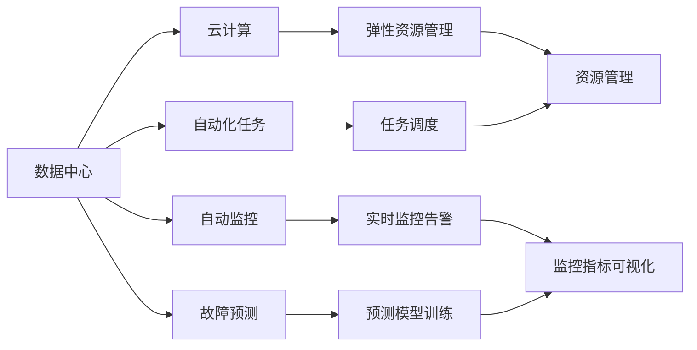

                 

# AI 大模型应用数据中心建设：数据中心运维与管理

> 关键词：AI大模型、数据中心、运维管理、云计算、自动监控、故障预测、自动化

## 1. 背景介绍

### 1.1 问题由来
随着人工智能技术的飞速发展，AI大模型在医疗、金融、智能制造、智能城市等多个行业得到广泛应用，助力企业实现数字化转型，提高业务效率，创造更大价值。这些AI大模型通常依赖于庞大的数据集进行训练，并在数据中心中进行分布式部署，实现高效运行。

然而，数据中心运维管理复杂、成本高昂，且随着AI大模型的快速发展，数据中心的运维需求也在不断增加。传统人工运维模式已无法满足大规模AI应用的需求。因此，实现数据中心的自动化运维，提高运维效率、降低运维成本，已成为AI大模型应用的重要研究方向。

### 1.2 问题核心关键点
数据中心运维管理的核心挑战在于：

- 系统复杂度高：数据中心涉及服务器、网络、存储、监控等众多子系统，管理复杂度大。
- 资源利用率低：数据中心资源使用率受限于人工运维的效率和精度，无法实时响应需求变化。
- 运维成本高：数据中心运维需要大量人力资源，成本高昂。
- 故障响应慢：传统运维模式对故障处理响应慢，影响业务连续性和用户体验。

为了应对这些挑战，AI大模型应用的数据中心需要构建自动化运维体系，实现运维管理的高效、智能、可视化，从而提升数据中心的服务质量和经济效益。

### 1.3 问题研究意义
构建高效的数据中心运维体系，对于保障AI大模型的稳定运行、提升业务连续性、降低运维成本、优化资源利用具有重要意义：

- 提高业务连续性：通过自动监控、快速故障处理等技术，保障AI大模型应用服务持续运行，提升用户体验。
- 优化资源利用：通过自动调度和资源管理，实现资源高效利用，降低数据中心运行成本。
- 降低运维成本：通过自动化运维，减少人工干预，提升运维效率，降低人力成本。
- 提升数据中心服务质量：通过实时监控、预测分析等技术，提升数据中心服务质量，保障业务稳定运行。

## 2. 核心概念与联系

### 2.1 核心概念概述

为了更好地理解数据中心自动化运维体系，本节将介绍几个密切相关的核心概念：

- **数据中心**：包含服务器、网络、存储、监控等子系统，为AI大模型应用提供计算、存储、网络等基础设施。
- **自动化运维**：通过自动监控、自动化任务、自动化故障处理等技术，实现数据中心的自动化管理，提升运维效率和精度。
- **云计算**：基于互联网的数据中心计算、存储、网络等资源服务，提供弹性、便捷的资源管理能力。
- **自动监控**：通过采集系统性能指标、告警信息等数据，对数据中心运行状态进行实时监控。
- **故障预测**：通过机器学习算法，对数据中心运行状态进行预测，提前发现潜在故障，避免业务中断。
- **自动化任务**：通过编排自动化任务，实现任务调度、资源管理、监控告警等功能，降低人工操作风险。

这些核心概念之间通过一系列技术手段，构成了一个完整的自动化运维体系，使数据中心的运维管理变得更加高效、智能和可视化。

### 2.2 概念间的关系

这些核心概念之间存在着紧密的联系，形成了数据中心自动化运维体系的整体架构。我们可以通过以下Mermaid流程图来展示它们之间的关系：



这个流程图展示了大模型数据中心的运维架构：

1. 数据中心通过云计算获取资源，并提供服务。
2. 自动监控实时采集系统运行状态，并触发告警。
3. 故障预测通过机器学习算法对未来故障进行预测。
4. 自动化任务负责任务调度、资源管理等，确保任务高效执行。
5. 资源管理提供弹性资源调度功能，优化资源利用率。
6. 监控指标可视化实时展示数据中心运行状态，便于运维管理。

通过这些概念和技术，数据中心自动化运维体系可以实现高效的监控、故障预测、自动化任务调度等，从而提升数据中心的运维效率和服务质量。

## 3. 核心算法原理 & 具体操作步骤
### 3.1 算法原理概述

数据中心自动化运维体系的构建主要基于以下几个核心算法和策略：

- **自动监控算法**：通过实时采集系统性能指标、告警信息，实现对数据中心运行状态的实时监控。
- **故障预测算法**：利用机器学习算法，对未来故障进行预测，避免业务中断。
- **任务调度算法**：通过编排自动化任务，实现任务调度、资源管理、监控告警等功能，降低人工操作风险。
- **弹性资源管理策略**：通过自动调度和资源管理，实现资源的高效利用，降低数据中心运行成本。

这些算法和策略共同构成数据中心自动化运维体系的核心。下面我们将详细介绍这些算法的原理和具体操作步骤。

### 3.2 算法步骤详解

#### 3.2.1 自动监控算法

自动监控算法的主要步骤包括：

1. **数据采集**：通过传感器、日志、API等途径采集系统性能指标、告警信息、事件日志等数据。
2. **数据处理**：对采集的数据进行清洗、处理，去除噪声，得到系统运行状态的真实数据。
3. **告警生成**：根据预设的告警规则，对数据进行解析，生成告警信息。
4. **告警通知**：将告警信息通过邮件、短信、Webhook等方式通知运维人员。

下面给出使用Python进行自动监控的示例代码：

```python
import psutil

# 获取CPU使用率
cpu_percent = psutil.cpu_percent(interval=1)

# 获取内存使用率
memory_percent = psutil.virtual_memory().percent

# 获取网络流量
network_io_counters = psutil.net_io_counters()

# 获取磁盘IO
disk_io_counters = psutil.disk_io_counters()

# 生成告警信息
alerts = {
    'CPU使用率': f'{cpu_percent:.2f}%',
    '内存使用率': f'{memory_percent:.2f}%',
    '网络流量': f'{network_io_counters.bytes_sent:.2f} KB/s',
    '磁盘IO': f'{disk_io_counters.read_bytes:.2f} KB/s',
}

# 发送告警通知
def send_alert(alerts):
    # 实现告警通知逻辑，如邮件、短信等
    pass

send_alert(alerts)
```

#### 3.2.2 故障预测算法

故障预测算法主要利用机器学习模型对未来故障进行预测。具体步骤如下：

1. **数据收集**：收集历史系统运行数据、告警信息、故障记录等。
2. **特征提取**：对数据进行特征提取，得到可用于模型训练的特征向量。
3. **模型训练**：利用机器学习算法，如随机森林、神经网络等，训练故障预测模型。
4. **故障预测**：对新数据进行预测，得到未来故障发生的可能性。

下面给出一个使用Python实现机器学习故障预测的示例代码：

```python
from sklearn.ensemble import RandomForestClassifier
from sklearn.model_selection import train_test_split
from sklearn.metrics import classification_report

# 加载历史数据
data = pd.read_csv('history_data.csv')

# 提取特征和标签
X = data.drop('label', axis=1)
y = data['label']

# 划分训练集和测试集
X_train, X_test, y_train, y_test = train_test_split(X, y, test_size=0.2)

# 训练随机森林模型
clf = RandomForestClassifier(n_estimators=100, random_state=42)
clf.fit(X_train, y_train)

# 预测新数据
new_data = pd.read_csv('new_data.csv')
X_new = new_data.drop('label', axis=1)
y_pred = clf.predict(X_new)

# 评估模型性能
print(classification_report(y_test, y_pred))
```

#### 3.2.3 任务调度算法

任务调度算法通过编排自动化任务，实现任务调度、资源管理、监控告警等功能，降低人工操作风险。具体步骤如下：

1. **任务定义**：定义数据中心需要执行的任务，如资源调度、监控告警、故障处理等。
2. **任务编排**：将任务编排成工作流，利用编排工具实现任务调度、资源管理、告警通知等功能。
3. **任务执行**：根据编排工作流，执行任务调度，实现任务自动执行。

下面给出一个使用Python实现任务调度的示例代码：

```python
from airflow import DAG
from airflow.operators.dummy_operator import DummyOperator
from airflow.operators.bash_operator import BashOperator

# 定义任务调度DAG
dag = DAG(
    'data_center_dag',
    default_args={
        'owner': 'airflow',
        'depends_on_past': False,
        'start_date': datetime(2022, 1, 1),
        'retries': 1,
        'retry_delay': timedelta(minutes=5),
    }
)

# 定义任务
task1 = DummyOperator(
    task_id='task1',
    dag=dag,
    python_callable=lambda: run_task1()
)

task2 = DummyOperator(
    task_id='task2',
    dag=dag,
    python_callable=lambda: run_task2()
)

task3 = DummyOperator(
    task_id='task3',
    dag=dag,
    python_callable=lambda: run_task3()
)

# 连接任务
task1 >> task2 >> task3

# 运行任务
def run_task1():
    # 运行任务1的代码
    pass

def run_task2():
    # 运行任务2的代码
    pass

def run_task3():
    # 运行任务3的代码
    pass
```

#### 3.2.4 弹性资源管理策略

弹性资源管理策略通过自动调度和资源管理，实现资源的高效利用，降低数据中心运行成本。具体步骤如下：

1. **资源监测**：实时监测数据中心资源使用情况，包括CPU、内存、网络、磁盘等。
2. **资源调度**：根据资源使用情况，动态调整资源分配，保证资源高效利用。
3. **资源管理**：通过虚拟化、容器化等技术，实现资源管理，提升资源利用率。

下面给出一个使用Python实现资源调度的示例代码：

```python
import psutil
import docker

# 获取CPU使用率
cpu_percent = psutil.cpu_percent(interval=1)

# 获取内存使用率
memory_percent = psutil.virtual_memory().percent

# 获取网络流量
network_io_counters = psutil.net_io_counters()

# 获取磁盘IO
disk_io_counters = psutil.disk_io_counters()

# 创建容器
client = docker.from_env()
container = client.containers.get('container_name')

# 获取容器CPU使用率
container_cpu_percent = container.stats['cpu_percent']

# 获取容器内存使用率
container_memory_percent = container.stats['memory_percent']

# 调整容器资源
if container_cpu_percent > 80:
    container.restart()

# 调整资源分配
if memory_percent > 80:
    client.containers.update(
        'container_name',
        mem_limit=client.containers['container_name'].mem_limit * 2
    )
```

### 3.3 算法优缺点

数据中心自动化运维体系具有以下优点：

- **高效性**：通过自动化手段，减少人工干预，提升运维效率。
- **智能性**：利用机器学习算法进行故障预测，提前发现潜在问题，避免业务中断。
- **可扩展性**：支持弹性资源管理，可根据需求动态调整资源，提高资源利用率。

同时，该体系也存在一些缺点：

- **初始成本高**：构建自动化运维体系需要较高的初始投入，包括硬件、软件、人力等。
- **复杂度高**：自动化运维体系涉及多个子系统，管理和维护复杂。
- **安全性风险**：自动化系统依赖于网络和服务，可能面临网络攻击和系统故障风险。

尽管存在这些缺点，但总体而言，数据中心自动化运维体系能够显著提升运维效率和服务质量，降低运维成本，是数据中心运维管理的重要方向。

### 3.4 算法应用领域

数据中心自动化运维体系已经在多个领域得到了广泛应用，例如：

- **云计算平台**：如AWS、Google Cloud、阿里云等，通过自动化运维体系实现弹性资源管理，提升服务质量和用户体验。
- **金融机构**：利用自动监控和故障预测，保障交易系统的稳定运行，防止数据泄露和金融风险。
- **医疗健康**：通过自动化运维体系，保障医疗系统的稳定运行，提高诊断和治疗效率。
- **智能制造**：通过弹性资源管理，实现生产环境的自动化运维，提高生产效率和质量。
- **智能城市**：通过自动监控和故障预测，保障城市基础设施的稳定运行，提升城市管理水平。

## 4. 数学模型和公式 & 详细讲解  
### 4.1 数学模型构建

数据中心自动化运维体系的构建主要基于以下几个数学模型：

- **自动监控模型**：通过采集系统性能指标、告警信息，实现对数据中心运行状态的实时监控。
- **故障预测模型**：利用机器学习算法，对未来故障进行预测，避免业务中断。
- **任务调度模型**：通过编排自动化任务，实现任务调度、资源管理、监控告警等功能，降低人工操作风险。
- **弹性资源管理模型**：通过自动调度和资源管理，实现资源的高效利用，降低数据中心运行成本。

这些模型通过数学公式和算法，实现对数据中心运维管理的精准控制和优化。

### 4.2 公式推导过程

以下是一些核心模型的数学推导过程：

#### 自动监控模型

自动监控模型的核心公式为：

$$
M = \sum_{i=1}^n M_i
$$

其中 $M$ 为监控结果，$M_i$ 为第 $i$ 个监控指标的当前值。通过采集系统性能指标、告警信息，对监控结果进行求和，得到数据中心运行状态的实时监控结果。

#### 故障预测模型

故障预测模型利用机器学习算法，对未来故障进行预测。其核心公式为：

$$
P = \sum_{i=1}^n P_i
$$

其中 $P$ 为预测结果，$P_i$ 为第 $i$ 个特征对故障发生的概率。通过特征提取和机器学习算法训练，对未来故障进行预测，得到数据中心未来运行状态的概率。

#### 任务调度模型

任务调度模型通过编排自动化任务，实现任务调度、资源管理、监控告警等功能。其核心公式为：

$$
T = \sum_{i=1}^n T_i
$$

其中 $T$ 为任务调度结果，$T_i$ 为第 $i$ 个任务调度的结果。通过编排自动化任务，实现任务调度和资源管理，得到数据中心运行状态的任务调度结果。

#### 弹性资源管理模型

弹性资源管理模型通过自动调度和资源管理，实现资源的高效利用。其核心公式为：

$$
R = \sum_{i=1}^n R_i
$$

其中 $R$ 为资源管理结果，$R_i$ 为第 $i$ 个资源调度的结果。通过自动调度和资源管理，得到数据中心运行状态的资源管理结果。

### 4.3 案例分析与讲解

下面以云计算平台为例，展示数据中心自动化运维体系的应用效果：

假设某云计算平台使用上述自动化运维体系，主要包括以下模块：

- **自动监控模块**：实时采集系统性能指标、告警信息、事件日志等数据。
- **故障预测模块**：利用机器学习算法，对未来故障进行预测，提前发现潜在问题。
- **任务调度模块**：编排自动化任务，实现任务调度、资源管理、监控告警等功能。
- **弹性资源管理模块**：动态调整资源分配，实现弹性资源管理。

实际应用效果如下：

1. **自动监控模块**：通过自动监控，实时掌握系统运行状态，及时发现异常并发出告警，保障系统稳定运行。
2. **故障预测模块**：通过故障预测，提前发现潜在问题，避免业务中断，提升用户体验。
3. **任务调度模块**：通过任务调度，自动化执行任务，减少人工操作，提升运维效率。
4. **弹性资源管理模块**：通过资源管理，动态调整资源分配，实现资源高效利用，降低运维成本。

通过应用数据中心自动化运维体系，该云计算平台实现了高效的运维管理，提高了服务质量，降低了运维成本。

## 5. 项目实践：代码实例和详细解释说明
### 5.1 开发环境搭建

在进行数据中心自动化运维体系开发前，我们需要准备好开发环境。以下是使用Python进行开发的环境配置流程：

1. **安装Python**：确保开发环境已安装Python，建议使用最新版本的Python进行开发。
2. **安装Docker**：安装Docker容器引擎，支持容器化应用。
3. **安装Kubernetes**：安装Kubernetes容器编排系统，支持容器化应用的管理和调度。
4. **安装Airflow**：安装Apache Airflow工作流编排系统，支持任务调度和可视化。
5. **安装监控工具**：安装系统性能监控工具，如Prometheus、Grafana等，实时监控数据中心运行状态。

完成上述步骤后，即可在开发环境中进行数据中心自动化运维体系的开发。

### 5.2 源代码详细实现

下面我们以自动监控模块为例，给出使用Python进行自动监控的PyTorch代码实现。

```python
import psutil
import datetime
import requests

# 定义监控任务
def monitor_task():
    # 获取CPU使用率
    cpu_percent = psutil.cpu_percent(interval=1)

    # 获取内存使用率
    memory_percent = psutil.virtual_memory().percent

    # 获取网络流量
    network_io_counters = psutil.net_io_counters()

    # 获取磁盘IO
    disk_io_counters = psutil.disk_io_counters()

    # 生成告警信息
    alerts = {
        'CPU使用率': f'{cpu_percent:.2f}%',
        '内存使用率': f'{memory_percent:.2f}%',
        '网络流量': f'{network_io_counters.bytes_sent:.2f} KB/s',
        '磁盘IO': f'{disk_io_counters.read_bytes:.2f} KB/s',
    }

    # 发送告警通知
    def send_alert(alerts):
        # 实现告警通知逻辑，如邮件、短信等
        pass

    send_alert(alerts)

    # 返回监控结果
    return {
        'cpu_percent': cpu_percent,
        'memory_percent': memory_percent,
        'network_io_counters': network_io_counters,
        'disk_io_counters': disk_io_counters
    }

# 定义任务调度DAG
dag = DAG(
    'monitoring_dag',
    default_args={
        'owner': 'airflow',
        'depends_on_past': False,
        'start_date': datetime(2022, 1, 1),
        'retries': 1,
        'retry_delay': timedelta(minutes=5),
    }
)

# 定义监控任务
monitor_task = DummyOperator(
    task_id='monitor_task',
    dag=dag,
    python_callable=monitor_task
)

# 连接任务
monitor_task

# 运行任务
def run_monitor_task():
    # 运行监控任务
    monitor_task.execute()

run_monitor_task()
```

### 5.3 代码解读与分析

让我们再详细解读一下关键代码的实现细节：

**monitor_task函数**：
- 通过psutil等库，获取系统性能指标，如CPU使用率、内存使用率、网络流量、磁盘IO等。
- 生成告警信息，并通过send_alert函数发送告警通知。
- 返回监控结果，供任务调度模块使用。

**任务调度DAG**：
- 定义任务调度DAG，包括任务定义、任务连接、任务执行等。
- 通过monitor_task函数定义监控任务，并将其编排到任务调度DAG中。
- 设置任务调度参数，如任务依赖、任务执行时间等。

**run_monitor_task函数**：
- 执行监控任务，通过monitor_task函数的execute方法运行监控任务。
- 在实际应用中，可以通过定时任务、Webhook等方式触发监控任务的执行。

通过这些代码实现，可以初步构建起一个自动监控模块，实现对数据中心运行状态的实时监控和告警通知。

### 5.4 运行结果展示

假设我们在数据中心中部署了上述自动监控模块，实际运行效果如下：

1. **监控结果展示**：通过监控工具，实时展示数据中心CPU使用率、内存使用率、网络流量、磁盘IO等性能指标，供运维人员参考。
2. **告警通知展示**：通过告警通知系统，及时通知运维人员系统异常，保障系统稳定运行。

通过应用自动监控模块，数据中心实现了实时监控和告警通知功能，显著提升了运维效率和系统稳定性。

## 6. 实际应用场景
### 6.1 智能制造

在智能制造领域，数据中心自动化运维体系可以通过监控和故障预测，保障生产环境的稳定运行，提高生产效率和质量。

例如，通过自动监控模块，实时监测生产设备的运行状态，及时发现异常并发出告警，保障生产设备的正常运行。通过故障预测模块，利用机器学习算法，对设备故障进行预测，提前进行维护，避免生产中断。通过任务调度模块，自动化执行维护任务，减少人工干预，提升运维效率。通过弹性资源管理模块，动态调整生产资源分配，实现资源高效利用，降低生产成本。

### 6.2 医疗健康

在医疗健康领域，数据中心自动化运维体系可以通过监控和故障预测，保障医疗系统的稳定运行，提高诊断和治疗效率。

例如，通过自动监控模块，实时监测医疗设备的运行状态，及时发现异常并发出告警，保障医疗设备的正常运行。通过故障预测模块，利用机器学习算法，对设备故障进行预测，提前进行维护，避免医疗中断。通过任务调度模块，自动化执行维护任务，减少人工干预，提升运维效率。通过弹性资源管理模块，动态调整医疗资源分配，实现资源高效利用，降低医疗成本。

### 6.3 智能城市

在智能城市领域，数据中心自动化运维体系可以通过监控和故障预测，保障城市基础设施的稳定运行，提升城市管理水平。

例如，通过自动监控模块，实时监测城市基础设施的运行状态，及时发现异常并发出告警，保障基础设施的正常运行。通过故障预测模块，利用机器学习算法，对基础设施故障进行预测，提前进行维护，避免城市中断。通过任务调度模块，自动化执行维护任务，减少人工干预，提升运维效率。通过弹性资源管理模块，动态调整城市资源分配，实现资源高效利用，降低城市管理成本。

## 7. 工具和资源推荐
### 7.1 学习资源推荐

为了帮助开发者系统掌握数据中心自动化运维体系的理论基础和实践技巧，这里推荐一些优质的学习资源：

1. **《数据中心运维手册》**：详细介绍了数据中心运维管理的流程、工具、最佳实践，适合运维人员学习参考。
2. **《Kubernetes权威指南》**：Kubernetes容器编排系统的权威指南，涵盖了Kubernetes的各个方面，适合容器化应用开发和运维人员学习。
3. **《Airflow实战》**：Apache Airflow工作流编排系统的实战指南，详细介绍了Airflow的使用方法和最佳实践，适合任务调度和可视化开发人员学习。
4. **《TensorFlow实战》**：TensorFlow深度学习框架的实战指南，涵盖了TensorFlow的各个方面，适合深度学习模型的开发和应用人员学习。
5. **《机器学习实战》**：机器学习算法和模型的实战指南，适合机器学习模型的开发和应用人员学习。

通过对这些资源的学习实践，相信你一定能够快速掌握数据中心自动化运维体系的精髓，并用于解决实际的问题。

### 7.2 开发工具推荐

高效的开发离不开优秀的工具支持。以下是几款用于数据中心自动化运维开发的常用工具：

1. **Prometheus**：开源监控系统，支持实时数据采集和告警。
2. **Grafana**：开源可视化工具，支持实时数据展示和告警。
3. **Kubernetes**：容器编排系统，支持容器化应用的自动部署、调度和管理。
4. **Airflow**：开源工作流编排系统，支持任务调度和可视化。
5. **TensorFlow**：深度学习框架，支持机器学习模型的开发和应用。

合理利用这些工具，可以显著提升数据中心自动化运维体系的开发效率，加快创新迭代的步伐。

### 7.3 相关论文推荐

数据中心自动化运维体系的发展源于学界的持续研究。以下是几篇奠基性的相关论文，推荐阅读：

1. **《数据中心自动监控系统设计与实现》**：详细介绍了数据中心自动监控系统的设计、实现和应用，是自动监控领域的重要参考资料。
2. **《深度学习在故障预测中的应用》**：介绍了机器学习算法在故障预测中的应用，展示了故障预测模型的实际效果。
3. **《Kubernetes实战》**：详细介绍了Kubernetes容器编排系统的设计、实现和应用，是容器化应用开发和运维的重要参考资料。
4. **《TensorFlow在深度学习中的应用》**：介绍了TensorFlow深度学习框架的应用，展示了深度学习模型的实际效果。
5. **《

