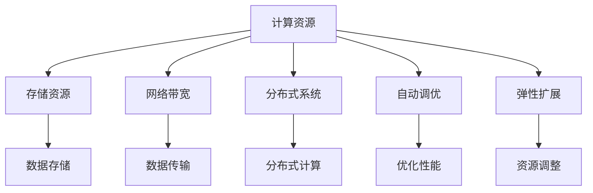

                 

# AI 大模型应用数据中心的技术选型

> 关键词：AI大模型,数据中心,数据处理,深度学习,计算密集型,高吞吐量,低延迟,分布式系统,自动调优,弹性扩展

## 1. 背景介绍

### 1.1 问题由来
随着人工智能技术的发展，大模型（如BERT、GPT-3等）在自然语言处理（NLP）、计算机视觉（CV）、语音识别（ASR）等领域的性能不断提升，对数据中心（Data Center）的计算资源、存储能力和网络带宽提出了更高的要求。同时，大模型的应用场景也从科研领域逐步拓展到工业界，包括文本生成、语音合成、图像识别、推荐系统等，对数据中心的计算和存储能力提出了更复杂的挑战。

数据中心需要提供高性能、高吞吐量、低延迟的计算资源，支持深度学习模型的训练和推理。在应对这些需求的过程中，数据中心的技术选型变得越来越关键，直接影响到AI大模型应用的性能和可靠性。

### 1.2 问题核心关键点
在AI大模型应用中，数据中心的技术选型主要涉及以下几个关键点：
1. **计算资源**：需要提供足够的计算能力，满足深度学习模型的训练和推理需求。
2. **存储资源**：需要提供高效的存储解决方案，支持大数据量的数据存储和访问。
3. **网络带宽**：需要提供高速网络，支持大模型在分布式环境中的高效通信。
4. **系统架构**：需要设计合理的分布式系统架构，支持模型的训练和推理。
5. **优化技术**：需要引入自动调优和弹性扩展技术，提升系统的性能和可用性。
6. **安全性与合规性**：需要确保数据中心的安全性和合规性，保护用户数据和模型隐私。

这些关键点构成了数据中心在AI大模型应用中的技术选型的基础，需要综合考虑，才能构建一个高效、可靠、安全的AI大模型应用环境。

### 1.3 问题研究意义
研究AI大模型应用数据中心的技术选型，对于提升AI大模型应用的性能、可靠性、安全性和用户体验具有重要意义：
1. **提升性能**：通过合理配置计算资源和优化技术，提升AI大模型的训练和推理速度。
2. **增强可靠性**：通过分布式架构和自动调优技术，提高系统的稳定性和可扩展性。
3. **保护隐私**：通过数据加密、访问控制等安全措施，保护用户数据和模型隐私。
4. **降低成本**：通过弹性扩展和资源优化技术，降低数据中心的运营成本。
5. **推动应用**：通过高性能、高可靠性的基础设施，推动AI大模型在更多领域的应用。

## 2. 核心概念与联系

### 2.1 核心概念概述

在AI大模型应用数据中心的技术选型中，涉及多个核心概念，包括但不限于：

- **计算资源**：指数据中心提供的高性能计算集群，用于支持深度学习模型的训练和推理。
- **存储资源**：指数据中心提供的大容量、高可靠性的存储系统，用于存储和访问数据。
- **网络带宽**：指数据中心提供的高速网络环境，支持数据中心内部和外部的高效数据传输。
- **分布式系统**：指数据中心采用分布式架构，支持大模型的并行训练和推理。
- **自动调优**：指数据中心采用自动调优技术，优化模型的训练和推理过程，提升性能。
- **弹性扩展**：指数据中心采用弹性扩展技术，根据负载动态调整计算和存储资源，提高系统的可扩展性。

这些核心概念之间通过相互协作，共同构建了AI大模型应用数据中心的技术选型框架，确保大模型的应用性能和可靠性。

### 2.2 概念间的关系

通过以下Mermaid流程图，可以更直观地理解这些核心概念之间的关系：



这个流程图展示了AI大模型应用数据中心技术选型的核心概念及其关系：
1. **计算资源**：提供高性能计算集群，满足深度学习模型的训练和推理需求。
2. **存储资源**：支持大容量、高可靠性的数据存储和访问。
3. **网络带宽**：确保高速网络环境，支持数据中心内部和外部的高效数据传输。
4. **分布式系统**：采用分布式架构，支持大模型的并行训练和推理。
5. **自动调优**：通过自动调优技术，优化模型的训练和推理过程，提升性能。
6. **弹性扩展**：根据负载动态调整计算和存储资源，提高系统的可扩展性。

这些概念相互依存，共同构建了AI大模型应用数据中心的完整技术选型框架。

## 3. 核心算法原理 & 具体操作步骤
### 3.1 算法原理概述

AI大模型应用数据中心的技术选型，主要基于以下几个核心算法原理：

1. **分布式计算**：通过分布式计算框架，如Apache Spark、Apache Flink等，将计算任务分解为多个子任务，并行执行，提升计算效率。
2. **分布式存储**：通过分布式存储系统，如Hadoop HDFS、Amazon S3等，将数据分散存储在多个节点上，提升数据访问和存储的效率。
3. **数据传输优化**：通过网络优化技术，如TensorFlow分布式训练框架中的Ring Allreduce算法，减少数据传输的延迟和带宽占用。
4. **自动调优**：通过自动调优工具，如Google Cloud AutoML，根据模型和数据的特点，自动调整超参数和资源配置，提升模型训练和推理的性能。
5. **弹性扩展**：通过弹性扩展技术，如Kubernetes集群管理，根据负载动态调整计算和存储资源，提升系统的可扩展性和可用性。

### 3.2 算法步骤详解

基于上述核心算法原理，AI大模型应用数据中心的技术选型主要包括以下步骤：

1. **需求分析**：根据AI大模型应用的性能需求和数据量规模，确定计算、存储和网络的需求。
2. **系统设计**：基于需求分析结果，设计合理的系统架构，包括计算资源、存储资源和网络带宽的配置。
3. **资源配置**：根据系统设计方案，配置计算集群、存储系统和网络环境，确保资源的高效利用。
4. **自动调优**：引入自动调优工具，根据模型和数据的特点，自动调整超参数和资源配置，提升模型训练和推理的性能。
5. **弹性扩展**：引入弹性扩展技术，根据负载动态调整计算和存储资源，提升系统的可扩展性和可用性。
6. **安全性与合规性**：确保数据中心的安全性和合规性，保护用户数据和模型隐私。

### 3.3 算法优缺点

基于分布式计算和自动调优的AI大模型应用数据中心技术选型，具有以下优点：
1. **高性能**：通过分布式计算和数据传输优化，提升模型的训练和推理速度。
2. **高可靠性**：通过分布式架构和自动调优技术，提高系统的稳定性和可扩展性。
3. **高可扩展性**：通过弹性扩展技术，根据负载动态调整资源，提升系统的可扩展性。

然而，也存在一些缺点：
1. **复杂度较高**：系统设计和资源配置需要较高的专业知识和经验，实施难度较大。
2. **成本较高**：高性能计算集群和存储系统的初始投资和运营成本较高。
3. **数据安全风险**：大规模数据存储和传输存在数据泄露和隐私泄露的风险，需要加强安全防护。

### 3.4 算法应用领域

AI大模型应用数据中心技术选型在多个领域得到了广泛应用，包括但不限于：

1. **自然语言处理（NLP）**：如BERT、GPT-3等大模型在NLP任务中的应用，如文本生成、情感分析、机器翻译等。
2. **计算机视觉（CV）**：如ResNet、Inception等大模型在图像识别、目标检测、图像生成等CV任务中的应用。
3. **语音识别（ASR）**：如Wav2Vec、Deepspeech等大模型在语音识别和语音合成中的应用。
4. **推荐系统**：如Wide & Deep模型、深度学习模型等在推荐系统中的应用。
5. **金融风控**：如深度学习模型在金融风控中的应用，如信用评分、欺诈检测等。
6. **医疗健康**：如深度学习模型在医疗健康中的应用，如医学影像分析、病历分析等。

## 4. 数学模型和公式 & 详细讲解 & 举例说明
### 4.1 数学模型构建

在AI大模型应用数据中心技术选型中，涉及到多个数学模型，包括但不限于：

1. **计算模型**：用于描述计算资源的配置和优化，如CPU、GPU、TPU等计算资源的配置和负载均衡。
2. **存储模型**：用于描述存储资源的配置和优化，如Hadoop HDFS、Amazon S3等存储系统的配置和优化。
3. **网络模型**：用于描述网络带宽的配置和优化，如交换机、路由器、网络拓扑等。
4. **分布式系统模型**：用于描述分布式系统的架构和优化，如Kubernetes集群管理、Spark分布式计算等。
5. **自动调优模型**：用于描述自动调优算法的配置和优化，如Google Cloud AutoML、TensorFlow分布式训练等。
6. **弹性扩展模型**：用于描述弹性扩展技术的配置和优化，如Kubernetes弹性扩展、Spark弹性扩展等。

### 4.2 公式推导过程

以下以计算资源配置为例，推导计算资源的优化公式。

假设计算资源的配置为 $C$，计算任务的负载为 $L$，计算资源的成本为 $C_{cost}$，计算资源的利用率为 $\eta$。则计算资源的优化公式为：

$$
C = \mathop{\arg\min}_{C} \frac{L}{C_{cost} \times \eta}
$$

其中，$C_{cost}$ 为计算资源的单位成本，$\eta$ 为计算资源的利用率。该公式表示在给定计算任务负载 $L$ 和计算资源成本 $C_{cost}$ 的条件下，最小化计算资源的配置 $C$。

### 4.3 案例分析与讲解

以Google Cloud AutoML为例，展示自动调优算法的实际应用。

Google Cloud AutoML是一种自动调优工具，能够根据模型的特性和数据的特点，自动调整模型的超参数和资源配置，优化模型的训练和推理过程。其核心算法包括：

1. **超参数优化**：通过网格搜索和随机搜索等方法，自动搜索最优的超参数组合，提升模型的训练效果。
2. **资源配置优化**：通过自动调整计算和存储资源的配置，最大化利用计算资源，提升模型的训练和推理性能。
3. **模型优化**：通过模型压缩和量化等技术，减小模型的尺寸，提升推理速度和内存占用。

Google Cloud AutoML通过自动调优算法，实现了高性能的模型训练和推理，适用于大规模的AI大模型应用。

## 5. 项目实践：代码实例和详细解释说明
### 5.1 开发环境搭建

在AI大模型应用数据中心技术选型中，需要搭建高性能的计算环境、存储环境和高带宽的网络环境。以下是一个基本的开发环境搭建流程：

1. **选择计算资源**：根据应用需求选择高性能计算集群，如Google Cloud Compute Engine、AWS EC2等。
2. **选择存储资源**：根据数据量规模选择高可靠性的存储系统，如Hadoop HDFS、Amazon S3等。
3. **选择网络资源**：根据网络带宽需求选择高速网络环境，如Google Cloud Interconnect、AWS Direct Connect等。
4. **配置系统环境**：安装必要的软件和工具，如TensorFlow、PyTorch、Dask等。
5. **安全配置**：配置访问控制和安全策略，保护数据中心的安全性和合规性。

### 5.2 源代码详细实现

以下是一个基于Google Cloud AutoML的AI大模型应用数据中心技术选型的代码实现示例。

```python
from google.cloud import automl
from google.cloud.automl_v1beta1 import enums
from google.cloud.automl_v1beta1.types import Model
from google.cloud.automl_v1beta1.types.generated import enums

# 定义计算资源配置
compute_config = {
    "target_cpu_count": 8,
    "target_heap_size_gb": 8
}

# 定义存储资源配置
storage_config = {
    "type": "object_storage",
    "bucket": "my-bucket"
}

# 定义自动调优算法
hyperparameter_tuning_config = {
    "hyperparameters": [
        {"key": "learning_rate", "type": "double", "max_value": 0.01, "min_value": 0.0001},
        {"key": "batch_size", "type": "integer", "max_value": 128, "min_value": 16}
    ]
}

# 定义模型配置
model_config = {
    "version_name": "v1",
    "model_type": enums.ModelType.PREDICT,
    "train_budget": 10000,
    "hyperparameter_tuning_config": hyperparameter_tuning_config
}

# 创建AutoML服务客户端
client = automl.AutoMlClient()

# 创建AutoML模型
response = client.create_model(
    parent="projects/<PROJECT_ID>/locations/<LOCATION>",
    model=Model(name="my_model", display_name="My Model", config=model_config, input_config=compute_config, storage_config=storage_config)
)

# 训练模型
response = client.train_model(name="my_model")

# 评估模型
response = client.evaluate_model(name="my_model")
```

### 5.3 代码解读与分析

以上代码展示了如何使用Google Cloud AutoML自动调优AI大模型。代码的关键点包括：

1. **计算资源配置**：通过`compute_config`字典，定义计算资源的配置，如CPU和内存的配置。
2. **存储资源配置**：通过`storage_config`字典，定义存储资源的配置，如对象存储桶的配置。
3. **自动调优算法**：通过`hyperparameter_tuning_config`字典，定义超参数的配置，如学习率和批大小。
4. **模型配置**：通过`model_config`字典，定义模型的配置，如模型类型和训练预算。
5. **自动调优服务**：通过调用`AutoMlClient`，创建AutoML模型，训练模型，并评估模型性能。

## 6. 实际应用场景
### 6.1 智能客服系统

在智能客服系统中，AI大模型应用数据中心技术选型尤为重要。智能客服系统需要高效、稳定地处理大量的客户咨询请求，确保客户问题的快速响应和准确解答。

以智能客服系统为例，AI大模型应用数据中心技术选型主要包括以下几个方面：

1. **计算资源配置**：选择高性能的计算集群，如Google Cloud Compute Engine、AWS EC2等，确保AI大模型的训练和推理速度。
2. **存储资源配置**：选择高可靠性的存储系统，如Hadoop HDFS、Amazon S3等，存储和访问客户咨询记录。
3. **网络带宽配置**：选择高速网络环境，如Google Cloud Interconnect、AWS Direct Connect等，支持大规模数据传输和分布式计算。
4. **分布式系统架构**：采用分布式架构，如Kubernetes集群管理，支持模型的并行训练和推理。
5. **自动调优技术**：引入自动调优技术，如Google Cloud AutoML，优化模型的训练和推理过程，提升性能。
6. **弹性扩展技术**：采用弹性扩展技术，如Kubernetes弹性扩展，根据负载动态调整资源，提升系统的可扩展性和可用性。

### 6.2 金融舆情监测

在金融舆情监测中，AI大模型应用数据中心技术选型需要重点考虑数据安全性和实时性。金融舆情监测系统需要实时监测网络舆情，及时发现和应对潜在的金融风险。

以金融舆情监测系统为例，AI大模型应用数据中心技术选型主要包括以下几个方面：

1. **计算资源配置**：选择高性能的计算集群，如Google Cloud Compute Engine、AWS EC2等，确保AI大模型的训练和推理速度。
2. **存储资源配置**：选择高可靠性的存储系统，如Hadoop HDFS、Amazon S3等，存储和访问金融舆情数据。
3. **网络带宽配置**：选择高速网络环境，如Google Cloud Interconnect、AWS Direct Connect等，支持大规模数据传输和分布式计算。
4. **分布式系统架构**：采用分布式架构，如Kubernetes集群管理，支持模型的并行训练和推理。
5. **自动调优技术**：引入自动调优技术，如Google Cloud AutoML，优化模型的训练和推理过程，提升性能。
6. **安全性与合规性**：确保数据中心的安全性和合规性，保护用户数据和模型隐私。

### 6.3 个性化推荐系统

在个性化推荐系统中，AI大模型应用数据中心技术选型需要重点考虑推荐算法和用户行为数据的处理。个性化推荐系统需要高效地处理和分析用户的行为数据，实现精准的个性化推荐。

以个性化推荐系统为例，AI大模型应用数据中心技术选型主要包括以下几个方面：

1. **计算资源配置**：选择高性能的计算集群，如Google Cloud Compute Engine、AWS EC2等，确保AI大模型的训练和推理速度。
2. **存储资源配置**：选择高可靠性的存储系统，如Hadoop HDFS、Amazon S3等，存储和访问用户行为数据。
3. **网络带宽配置**：选择高速网络环境，如Google Cloud Interconnect、AWS Direct Connect等，支持大规模数据传输和分布式计算。
4. **分布式系统架构**：采用分布式架构，如Kubernetes集群管理，支持模型的并行训练和推理。
5. **自动调优技术**：引入自动调优技术，如Google Cloud AutoML，优化模型的训练和推理过程，提升性能。
6. **弹性扩展技术**：采用弹性扩展技术，如Kubernetes弹性扩展，根据负载动态调整资源，提升系统的可扩展性和可用性。

## 7. 工具和资源推荐
### 7.1 学习资源推荐

为了帮助开发者系统掌握AI大模型应用数据中心的技术选型，这里推荐一些优质的学习资源：

1. **《TensorFlow分布式训练教程》**：由TensorFlow官方提供的分布式训练教程，详细介绍了如何在Google Cloud、AWS等云平台搭建分布式计算环境。
2. **《Hadoop分布式存储教程》**：由Hadoop官方提供的分布式存储教程，详细介绍了Hadoop HDFS系统的配置和优化。
3. **《Google Cloud AutoML教程》**：由Google Cloud提供的AutoML教程，详细介绍了如何使用AutoML进行模型训练和优化。
4. **《Kubernetes集群管理教程》**：由Kubernetes官方提供的集群管理教程，详细介绍了Kubernetes集群的设计和优化。

### 7.2 开发工具推荐

高效的开发离不开优秀的工具支持。以下是几款用于AI大模型应用数据中心技术选型的常用工具：

1. **TensorFlow**：基于Python的深度学习框架，支持分布式计算和自动调优。
2. **Hadoop HDFS**：由Apache基金会开发的分布式存储系统，支持大规模数据的存储和访问。
3. **Google Cloud AutoML**：Google提供的自动调优工具，支持模型训练和超参数优化。
4. **Kubernetes**：开源的容器编排系统，支持分布式计算和弹性扩展。

### 7.3 相关论文推荐

AI大模型应用数据中心技术选型在多个领域得到了广泛研究。以下是几篇代表性的相关论文，推荐阅读：

1. **《深度学习模型在分布式计算环境中的优化》**：研究了深度学习模型在分布式计算环境中的优化方法，提出了基于分布式深度学习框架的计算优化策略。
2. **《大规模数据存储的优化技术》**：研究了大规模数据存储的优化技术，提出了基于Hadoop HDFS的存储优化策略。
3. **《基于自动调优的深度学习模型训练》**：研究了基于自动调优的深度学习模型训练方法，提出了使用Google Cloud AutoML进行超参数优化的策略。
4. **《弹性扩展技术在高性能计算中的应用》**：研究了弹性扩展技术在高性能计算中的应用，提出了基于Kubernetes的弹性扩展策略。

## 8. 总结：未来发展趋势与挑战
### 8.1 总结

本文对AI大模型应用数据中心的技术选型进行了全面系统的介绍。首先阐述了AI大模型应用数据中心的技术选型的研究背景和意义，明确了计算资源、存储资源、网络带宽、分布式系统、自动调优和弹性扩展在AI大模型应用中的重要性。其次，从原理到实践，详细讲解了分布式计算、分布式存储、数据传输优化、自动调优和弹性扩展的算法原理和操作步骤，给出了AI大模型应用数据中心技术选型的完整代码实例。同时，本文还广泛探讨了AI大模型应用数据中心技术选型的实际应用场景，展示了技术选型在智能客服、金融舆情、个性化推荐等多个领域的应用前景。最后，本文精选了AI大模型应用数据中心技术选型的各类学习资源，力求为读者提供全方位的技术指引。

通过本文的系统梳理，可以看到，AI大模型应用数据中心的技术选型在大模型应用中的关键作用，合理配置计算资源、存储资源和网络带宽，设计合理的分布式系统和自动调优机制，可以有效提升大模型的训练和推理性能，保障系统的稳定性和可扩展性。未来，伴随深度学习技术和大模型应用的不断发展，AI大模型应用数据中心的技术选型也将不断演进，为AI大模型在更广泛的领域落地应用提供坚实的基础。

### 8.2 未来发展趋势

展望未来，AI大模型应用数据中心技术选型将呈现以下几个发展趋势：

1. **计算资源的高性能化**：随着硬件技术的进步，高性能计算集群和存储系统将进一步提升，支持更大规模的深度学习模型的训练和推理。
2. **自动调优技术的智能化**：自动调优工具将更加智能化，能够根据模型和数据的特点，自动调整超参数和资源配置，提升模型的训练和推理性能。
3. **分布式系统架构的弹性化**：分布式系统架构将更加弹性，能够根据负载动态调整资源，提升系统的可扩展性和可用性。
4. **多模态数据融合**：引入多模态数据的融合技术，如视觉、语音等多模态信息的协同建模，提升模型的综合理解能力。
5. **安全性与合规性增强**：数据中心的安全性和合规性将更加严格，采用先进的加密和访问控制技术，保护用户数据和模型隐私。

这些趋势凸显了AI大模型应用数据中心技术选型的广阔前景，未来将进一步推动AI大模型在更多领域的应用。

### 8.3 面临的挑战

尽管AI大模型应用数据中心技术选型已经取得了显著进展，但在迈向更加智能化、普适化应用的过程中，仍面临诸多挑战：

1. **数据安全风险**：大规模数据存储和传输存在数据泄露和隐私泄露的风险，需要加强安全防护。
2. **计算成本高**：高性能计算集群和存储系统的初始投资和运营成本较高，需要降低成本。
3. **系统复杂度高**：系统设计和资源配置需要较高的专业知识和经验，实施难度较大。
4. **算法复杂度高**：自动调优和弹性扩展技术的算法复杂度高，需要更多研究和优化。
5. **跨领域融合难度大**：多模态数据的融合和优化，需要克服跨领域数据融合的复杂性。

正视AI大模型应用数据中心技术选型面临的这些挑战，积极应对并寻求突破，将是大模型应用数据中心技术选型走向成熟的必由之路。

### 8.4 研究展望

面对AI大模型应用数据中心技术选型所面临的种种挑战，未来的研究需要在以下几个方面寻求新的突破：

1. **引入智能优化算法**：结合机器学习和强化学习技术，开发智能化的自动调优算法，进一步提升模型的训练和推理性能。
2. **优化资源配置策略**：通过优化计算资源和存储资源的配置策略，降低系统成本，提升系统的可用性和可扩展性。
3. **发展多模态数据融合技术**：研究多模态数据的融合技术，提升模型的综合理解能力和应用效果。
4. **探索分布式系统架构**：研究新的分布式系统架构，提升系统的可扩展性和弹性，适应更复杂的计算和存储需求。
5. **加强数据安全防护**：研究先进的加密和访问控制技术，保护用户数据和模型隐私，提升数据中心的安全性和合规性。

这些研究方向将进一步推动AI大模型应用数据中心技术选型的发展，为构建高效、可靠、安全的AI大模型应用环境提供更多技术支持。

## 9. 附录：常见问题与解答
### Q1：如何选择合适的计算资源？

A: 选择合适的计算资源，需要考虑以下几个因素：

1. **模型大小**：选择具有足够GPU或TPU资源的计算集群，满足大模型的训练和推理需求。
2. **数据量规模**：根据数据量规模，选择合适的存储系统，如Hadoop HDFS、Amazon S3等。
3. **计算任务类型**：根据计算任务类型，选择合适的计算资源类型，如CPU、GPU、TPU等。
4. **成本预算**：根据预算，选择性价比最高的计算资源，如Google Cloud Compute Engine、AWS EC2等。

### Q2：如何优化计算资源配置？

A: 优化计算资源配置，可以通过以下几个步骤：

1. **负载均衡**：通过分布式计算框架，如Apache Spark、Apache Flink等，将计算任务分解为多个子

