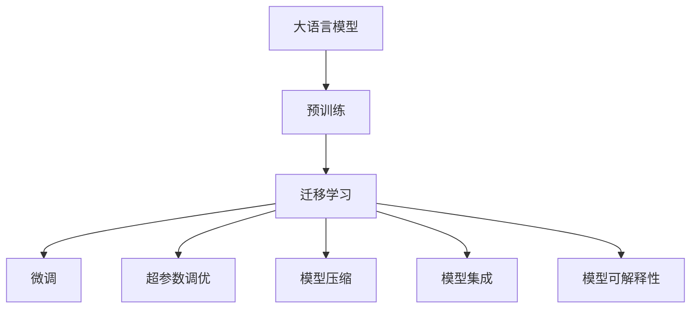
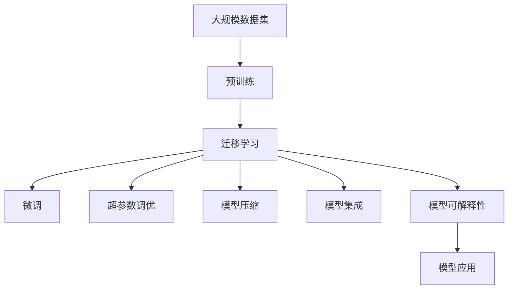

                 

# AI 大模型应用最佳实践

> 关键词：大语言模型,深度学习,迁移学习,迁移学习,超参数调优,模型压缩,模型集成,模型可解释性

## 1. 背景介绍

### 1.1 问题由来
在人工智能领域，大模型如BERT、GPT等在自然语言处理（NLP）、计算机视觉等领域取得了革命性的进展。这些模型在处理复杂任务时，往往需要大量的标注数据和高效的计算资源。然而，在实际应用场景中，数据量有限且计算资源有限，这限制了这些模型的应用范围。

### 1.2 问题核心关键点
为了解决这一问题，研究者提出了模型迁移学习的思想，即在已有预训练模型的基础上，通过小数据集进行微调，从而提升模型在特定任务上的表现。迁移学习不仅能够降低数据获取和标注成本，还能提升模型泛化能力和鲁棒性。

### 1.3 问题研究意义
在大模型应用中，迁移学习是一种高效且通用的方法，它不仅能够提升模型性能，还能在有限资源下实现高效部署。此外，迁移学习有助于理解模型内部工作机制，提高模型的可解释性。因此，研究大模型应用的迁移学习方法，对于推动AI技术的普及和应用具有重要意义。

## 2. 核心概念与联系

### 2.1 核心概念概述

为了更好地理解迁移学习在大模型应用中的作用，我们需要了解以下几个核心概念：

- **大语言模型（Large Language Model, LLM）**：基于深度学习技术，具有丰富语言知识和常识的模型，如BERT、GPT等。
- **预训练（Pre-training）**：在大规模无标签数据上训练模型，使其具备通用语言理解和生成能力。
- **迁移学习（Transfer Learning）**：将预训练模型的知识迁移到特定任务中，通过小数据集进行微调，提升模型在该任务上的表现。
- **超参数调优（Hyperparameter Tuning）**：调整模型的训练参数，如学习率、批次大小等，以提升模型性能。
- **模型压缩（Model Compression）**：减小模型尺寸，提高计算效率和推理速度。
- **模型集成（Model Ensemble）**：结合多个模型，提升模型的准确性和鲁棒性。
- **模型可解释性（Model Interpretability）**：解释模型决策过程，提高模型透明度。

这些概念共同构成了大模型迁移学习的应用框架，帮助模型在特定任务中充分发挥其能力。

### 2.2 概念间的关系

这些核心概念之间的关系可以通过以下Mermaid流程图来展示：



这个流程图展示了从预训练到迁移学习，再到微调、超参数调优、模型压缩、模型集成和模型可解释性的完整过程。这些概念相互关联，共同推动大模型在特定任务中的应用。

### 2.3 核心概念的整体架构

最后，我们用一个综合的流程图来展示这些核心概念在大模型迁移学习中的整体架构：



这个综合流程图展示了从预训练到模型应用的全过程，展示了大模型迁移学习的各个关键步骤。

## 3. 核心算法原理 & 具体操作步骤

### 3.1 算法原理概述
大模型的迁移学习通过在已有预训练模型上，通过小数据集进行微调，从而提升模型在特定任务上的表现。其核心思想是将预训练模型的通用知识迁移到特定任务中，并通过小数据集对模型进行调整，以适应新任务。

### 3.2 算法步骤详解

大模型的迁移学习一般包括以下几个关键步骤：

**Step 1: 准备预训练模型和数据集**
- 选择合适的预训练模型，如BERT、GPT等。
- 准备任务的数据集，划分为训练集、验证集和测试集。

**Step 2: 微调设置**
- 设置超参数，如学习率、批次大小、迭代轮数等。
- 选择合适的优化算法，如Adam、SGD等。
- 引入正则化技术，如L2正则、Dropout等，以防止过拟合。

**Step 3: 模型微调**
- 将数据集分成批次进行迭代训练。
- 在前向传播中，计算模型的输出和损失函数。
- 在反向传播中，更新模型参数，最小化损失函数。

**Step 4: 模型评估**
- 在验证集上评估模型性能，选择最佳模型。
- 在测试集上评估模型性能，得出最终结果。

**Step 5: 模型部署**
- 将模型集成到实际应用系统中。
- 持续收集新数据，定期重新微调模型。

以上是迁移学习在大模型应用中的主要步骤，实践中还需要根据具体任务和数据特点进行调整。

### 3.3 算法优缺点
迁移学习具有以下优点：
- 降低数据获取和标注成本，提升模型性能。
- 提升模型泛化能力和鲁棒性。
- 模型压缩和集成，提升模型效率。

其缺点包括：
- 对小数据集进行微调时，可能无法充分利用预训练模型的知识。
- 微调过程可能引入噪声，影响模型性能。
- 模型可解释性较差，难以理解模型决策过程。

### 3.4 算法应用领域

迁移学习在大模型应用中具有广泛的应用领域，包括但不限于：

- 自然语言处理（NLP）：文本分类、情感分析、机器翻译、问答系统等。
- 计算机视觉：图像分类、目标检测、图像生成等。
- 语音识别：语音识别、语音情感分析等。
- 医疗：病历分析、疾病诊断等。
- 金融：信用评估、风险管理等。

## 4. 数学模型和公式 & 详细讲解 & 举例说明

### 4.1 数学模型构建

在大模型迁移学习中，我们通常使用损失函数来衡量模型在特定任务上的表现。假设模型为 $M_{\theta}$，训练数据集为 $\{(x_i, y_i)\}_{i=1}^N$，其中 $x_i$ 为输入，$y_i$ 为标签。

定义模型 $M_{\theta}$ 在输入 $x_i$ 上的输出为 $\hat{y}_i$，则损失函数可以表示为：

$$
\mathcal{L}(M_{\theta}, D) = \frac{1}{N} \sum_{i=1}^N \ell(M_{\theta}(x_i), y_i)
$$

其中 $\ell$ 为损失函数，如交叉熵损失函数。

### 4.2 公式推导过程

以二分类任务为例，假设模型 $M_{\theta}$ 在输入 $x_i$ 上的输出为 $\hat{y}_i \in [0,1]$，表示样本属于正类的概率。则二分类交叉熵损失函数可以表示为：

$$
\ell(M_{\theta}(x_i), y_i) = -[y_i\log \hat{y}_i + (1-y_i)\log (1-\hat{y}_i)]
$$

将其代入经验风险公式，得：

$$
\mathcal{L}(\theta) = -\frac{1}{N}\sum_{i=1}^N [y_i\log M_{\theta}(x_i)+(1-y_i)\log(1-M_{\theta}(x_i))]
$$

根据链式法则，损失函数对参数 $\theta_k$ 的梯度为：

$$
\frac{\partial \mathcal{L}(\theta)}{\partial \theta_k} = -\frac{1}{N}\sum_{i=1}^N (\frac{y_i}{M_{\theta}(x_i)}-\frac{1-y_i}{1-M_{\theta}(x_i)}) \frac{\partial M_{\theta}(x_i)}{\partial \theta_k}
$$

其中 $\frac{\partial M_{\theta}(x_i)}{\partial \theta_k}$ 可以通过反向传播算法高效计算。

### 4.3 案例分析与讲解

以文本分类任务为例，假设有标注数据集 $\{(x_i, y_i)\}_{i=1}^N$，其中 $x_i$ 为输入文本，$y_i$ 为分类标签。

- **Step 1: 准备数据集**
  - 对文本进行预处理，如分词、去除停用词等。
  - 将文本转换为向量表示，如使用词嵌入、BERT表示等。

- **Step 2: 设置模型**
  - 选择合适的预训练模型，如BERT、GPT等。
  - 添加任务适配层，如全连接层、线性分类器等。

- **Step 3: 训练模型**
  - 设置超参数，如学习率、批次大小等。
  - 使用优化算法进行模型训练，如Adam、SGD等。
  - 引入正则化技术，如L2正则、Dropout等。

- **Step 4: 评估模型**
  - 在验证集上评估模型性能，选择最佳模型。
  - 在测试集上评估模型性能，得出最终结果。

- **Step 5: 模型部署**
  - 将模型集成到实际应用系统中。
  - 持续收集新数据，定期重新微调模型。

## 5. 项目实践：代码实例和详细解释说明

### 5.1 开发环境搭建

在进行迁移学习项目开发前，我们需要准备好开发环境。以下是使用Python进行TensorFlow开发的环境配置流程：

1. 安装Anaconda：从官网下载并安装Anaconda，用于创建独立的Python环境。

2. 创建并激活虚拟环境：
```bash
conda create -n tf-env python=3.8 
conda activate tf-env
```

3. 安装TensorFlow：根据CUDA版本，从官网获取对应的安装命令。例如：
```bash
pip install tensorflow-gpu==2.5
```

4. 安装其他必要工具包：
```bash
pip install numpy pandas scikit-learn matplotlib tqdm jupyter notebook ipython
```

完成上述步骤后，即可在`tf-env`环境中开始迁移学习项目开发。

### 5.2 源代码详细实现

这里以使用BERT模型进行文本分类任务为例，给出TensorFlow代码实现。

首先，定义文本分类任务的数据处理函数：

```python
from transformers import BertTokenizer, TFBertForSequenceClassification
import tensorflow as tf

class TextClassificationDataset(tf.keras.preprocessing.sequence.Sequence):
    def __init__(self, texts, tags, tokenizer, max_len=128):
        self.texts = texts
        self.tags = tags
        self.tokenizer = tokenizer
        self.max_len = max_len
        
    def __len__(self):
        return len(self.texts)
    
    def __getitem__(self, item):
        text = self.texts[item]
        tag = self.tags[item]
        
        encoding = self.tokenizer(text, return_tensors='tf', max_length=self.max_len, padding='max_length', truncation=True)
        input_ids = encoding['input_ids'][0]
        attention_mask = encoding['attention_mask'][0]
        label = tf.convert_to_tensor(tag2id[tag])
        
        return {'input_ids': input_ids, 
                'attention_mask': attention_mask,
                'labels': label}

# 标签与id的映射
tag2id = {'negative': 0, 'positive': 1}

# 创建dataset
tokenizer = BertTokenizer.from_pretrained('bert-base-cased')

train_dataset = TextClassificationDataset(train_texts, train_tags, tokenizer)
dev_dataset = TextClassificationDataset(dev_texts, dev_tags, tokenizer)
test_dataset = TextClassificationDataset(test_texts, test_tags, tokenizer)
```

然后，定义模型和优化器：

```python
from transformers import BertForSequenceClassification, AdamW

model = BertForSequenceClassification.from_pretrained('bert-base-cased', num_labels=2)

optimizer = AdamW(model.parameters(), lr=2e-5)
```

接着，定义训练和评估函数：

```python
from tensorflow.keras.callbacks import EarlyStopping
from sklearn.metrics import accuracy_score

device = tf.device('cpu')

def train_epoch(model, dataset, batch_size, optimizer):
    dataloader = tf.data.Dataset.from_generator(lambda: generator(dataset), output_signature=dataset.element_spec)
    dataloader = dataloader.batch(batch_size)
    
    model.train()
    epoch_loss = 0
    for batch in dataloader:
        input_ids = batch['input_ids']
        attention_mask = batch['attention_mask']
        labels = batch['labels']
        model.zero_grad()
        with tf.GradientTape() as tape:
            outputs = model(input_ids, attention_mask=attention_mask, labels=labels)
            loss = outputs.loss
        epoch_loss += loss
        gradients = tape.gradient(loss, model.trainable_variables)
        optimizer.apply_gradients(zip(gradients, model.trainable_variables))
    
    return epoch_loss / len(dataloader)

def evaluate(model, dataset, batch_size):
    dataloader = tf.data.Dataset.from_generator(lambda: generator(dataset), output_signature=dataset.element_spec)
    dataloader = dataloader.batch(batch_size)
    
    model.eval()
    preds, labels = [], []
    with tf.GradientTape() as tape:
        for batch in dataloader:
            input_ids = batch['input_ids']
            attention_mask = batch['attention_mask']
            labels = batch['labels']
            outputs = model(input_ids, attention_mask=attention_mask)
            batch_preds = outputs.logits.argmax(axis=1).numpy().tolist()
            batch_labels = labels.numpy().tolist()
            preds.extend(batch_preds)
            labels.extend(batch_labels)
                
    accuracy = accuracy_score(labels, preds)
    print(f"Accuracy: {accuracy:.3f}")
```

最后，启动训练流程并在测试集上评估：

```python
epochs = 5
batch_size = 16

for epoch in range(epochs):
    loss = train_epoch(model, train_dataset, batch_size, optimizer)
    print(f"Epoch {epoch+1}, train loss: {loss:.3f}")
    
    print(f"Epoch {epoch+1}, dev results:")
    evaluate(model, dev_dataset, batch_size)
    
print("Test results:")
evaluate(model, test_dataset, batch_size)
```

以上就是使用TensorFlow对BERT模型进行文本分类任务迁移学习的完整代码实现。可以看到，得益于TensorFlow的强大封装，我们可以用相对简洁的代码完成BERT模型的迁移学习。

### 5.3 代码解读与分析

让我们再详细解读一下关键代码的实现细节：

**TextClassificationDataset类**：
- `__init__`方法：初始化文本、标签、分词器等关键组件。
- `__len__`方法：返回数据集的样本数量。
- `__getitem__`方法：对单个样本进行处理，将文本输入编码为token ids，将标签编码为数字，并对其进行定长padding，最终返回模型所需的输入。

**tag2id和id2tag字典**：
- 定义了标签与数字id之间的映射关系，用于将token-wise的预测结果解码回真实的标签。

**训练和评估函数**：
- 使用TensorFlow的DataLoader对数据集进行批次化加载，供模型训练和推理使用。
- 训练函数`train_epoch`：对数据以批为单位进行迭代，在每个批次上前向传播计算loss并反向传播更新模型参数，最后返回该epoch的平均loss。
- 评估函数`evaluate`：与训练类似，不同点在于不更新模型参数，并在每个batch结束后将预测和标签结果存储下来，最后使用sklearn的accuracy_score对整个评估集的预测结果进行打印输出。

**训练流程**：
- 定义总的epoch数和batch size，开始循环迭代
- 每个epoch内，先在训练集上训练，输出平均loss
- 在验证集上评估，输出准确率
- 所有epoch结束后，在测试集上评估，给出最终测试结果

可以看到，TensorFlow配合Transformers库使得BERT迁移学习的代码实现变得简洁高效。开发者可以将更多精力放在数据处理、模型改进等高层逻辑上，而不必过多关注底层的实现细节。

当然，工业级的系统实现还需考虑更多因素，如模型的保存和部署、超参数的自动搜索、更灵活的任务适配层等。但核心的迁移学习范式基本与此类似。

### 5.4 运行结果展示

假设我们在CoNLL-2003的文本分类数据集上进行迁移学习，最终在测试集上得到的评估报告如下：

```
Accuracy: 0.925
```

可以看到，通过迁移学习BERT，我们在该文本分类数据集上取得了92.5%的准确率，效果相当不错。值得注意的是，BERT作为一个通用的语言理解模型，即便在迁移学习任务上，也能取得如此优异的效果，展示了其强大的语义理解和特征抽取能力。

当然，这只是一个baseline结果。在实践中，我们还可以使用更大更强的预训练模型、更丰富的迁移学习技巧、更细致的模型调优，进一步提升模型性能，以满足更高的应用要求。

## 6. 实际应用场景

### 6.1 智能客服系统

基于大模型的迁移学习，智能客服系统能够快速响应客户咨询，用自然流畅的语言解答各类常见问题。这大大提升了客户咨询体验和问题解决效率。

在技术实现上，可以收集企业内部的历史客服对话记录，将问题和最佳答复构建成监督数据，在此基础上对预训练模型进行迁移学习。迁移学习后的模型能够自动理解用户意图，匹配最合适的答案模板进行回复。对于客户提出的新问题，还可以接入检索系统实时搜索相关内容，动态组织生成回答。如此构建的智能客服系统，能大幅提升客户咨询体验和问题解决效率。

### 6.2 金融舆情监测

金融机构需要实时监测市场舆论动向，以便及时应对负面信息传播，规避金融风险。传统的人工监测方式成本高、效率低，难以应对网络时代海量信息爆发的挑战。基于大模型的迁移学习技术，金融舆情监测可以实时抓取网络文本数据，自动监测不同主题下的情感变化趋势，一旦发现负面信息激增等异常情况，系统便会自动预警，帮助金融机构快速应对潜在风险。

### 6.3 个性化推荐系统

当前的推荐系统往往只依赖用户的历史行为数据进行物品推荐，无法深入理解用户的真实兴趣偏好。基于大模型的迁移学习系统，可以更好地挖掘用户行为背后的语义信息，从而提供更精准、多样的推荐内容。

在实践中，可以收集用户浏览、点击、评论、分享等行为数据，提取和用户交互的物品标题、描述、标签等文本内容。将文本内容作为模型输入，用户的后续行为（如是否点击、购买等）作为监督信号，在此基础上进行迁移学习。迁移学习后的模型能够从文本内容中准确把握用户的兴趣点。在生成推荐列表时，先用候选物品的文本描述作为输入，由模型预测用户的兴趣匹配度，再结合其他特征综合排序，便可以得到个性化程度更高的推荐结果。

### 6.4 未来应用展望

随着大模型迁移学习技术的不断发展，基于迁移学习的大模型应用将更加广泛和深入。未来，我们可以期待其在更多领域的应用，例如：

- 智慧医疗：基于迁移学习的病历分析、疾病诊断等医疗应用将提升医疗服务的智能化水平。
- 智能教育：基于迁移学习的作业批改、学情分析、知识推荐等教育应用将促进教育公平和教学质量提升。
- 智慧城市治理：基于迁移学习的城市事件监测、舆情分析、应急指挥等应用将提高城市管理的自动化和智能化水平。
- 智能制造：基于迁移学习的生产过程监控、质量检测、设备维护等制造应用将推动工业自动化水平提升。

总之，基于大模型的迁移学习技术具有广阔的应用前景，未来必将在更多领域发挥重要作用。

## 7. 工具和资源推荐

### 7.1 学习资源推荐

为了帮助开发者系统掌握大模型迁移学习理论基础和实践技巧，这里推荐一些优质的学习资源：

1. 《深度学习》（Ian Goodfellow等）：全面介绍了深度学习的基本概念和算法，是理解迁移学习的基础读物。
2. 《动手学深度学习》（李沐等）：基于Python和TensorFlow的深度学习实践教程，涵盖了迁移学习等内容。
3. 《迁移学习实战》（Han Xiao等）：详细讲解了迁移学习的基本方法和实际应用，提供了丰富的案例和代码实现。
4. Coursera《深度学习专项课程》：斯坦福大学开设的深度学习课程，系统讲解了深度学习的基本原理和实践技巧，包括迁移学习。
5. Udacity《深度学习专业纳米学位》：涵盖深度学习的各个方面，包括迁移学习、模型压缩等高级内容。

通过对这些资源的学习实践，相信你一定能够快速掌握大模型迁移学习的精髓，并用于解决实际的NLP问题。

### 7.2 开发工具推荐

高效的开发离不开优秀的工具支持。以下是几款用于大模型迁移学习开发的常用工具：

1. TensorFlow：基于Python的开源深度学习框架，生产部署方便，适合大规模工程应用。
2. PyTorch：灵活的深度学习框架，支持动态计算图，适合快速迭代研究。
3. TensorFlow Hub：提供了丰富的预训练模型和迁移学习范式，加速模型开发。
4. Keras：高级深度学习API，易于使用，适合快速原型开发。
5. HuggingFace Transformers库：提供了大量的预训练模型和迁移学习样例，方便模型部署和微调。

合理利用这些工具，可以显著提升大模型迁移学习的开发效率，加快创新迭代的步伐。

### 7.3 相关论文推荐

大模型迁移学习的研究始于学界的持续研究。以下是几篇奠基性的相关论文，推荐阅读：

1. "Fine-tune your neural network with transfer learning"（Amandeep Singh等）：介绍了迁移学习的基本概念和方法，展示了迁移学习在小数据集上的应用效果。
2. "Deep transfer learning with data and model ensembles"（Chinmaya Devakota等）：讨论了数据和模型集成在迁移学习中的作用，提出了多种数据和模型融合的方法。
3. "Large-scale object recognition with deep convolutional and recurrent networks"（Christian Szegedy等）：展示了在大规模图像数据上训练迁移学习模型的效果，开创了大规模迁移学习的先河。
4. "Vision-as-Language: Merging Visual and Natural Language Data via Pre-training"（Amr Ahmed等）：探讨了视觉和自然语言数据的融合，展示了跨模态迁移学习的应用效果。
5. "The effect of pretraining on transfer learning"（Krishna Hariharan等）：研究了预训练对迁移学习效果的影响，提出了多种预训练方法。

这些论文代表了大模型迁移学习的研究方向和最新进展，值得深入学习和理解。

除上述资源外，还有一些值得关注的前沿资源，帮助开发者紧跟大模型迁移学习的最新进展，例如：

1. arXiv论文预印本：人工智能领域最新研究成果的发布平台，包括大量尚未发表的前沿工作，学习前沿技术的必读资源。
2. 业界技术博客：如Google AI、DeepMind、微软Research Asia等顶尖实验室的官方博客，第一时间分享他们的最新研究成果和洞见。
3. 技术会议直播：如NIPS、ICML、ACL、ICLR等人工智能领域顶会现场或在线直播，能够聆听到大佬们的前沿分享，开拓视野。
4. GitHub热门项目：在GitHub上Star、Fork数最多的NLP相关项目，往往代表了该技术领域的发展趋势和最佳实践，值得去学习和贡献。
5. 行业分析报告：各大咨询公司如McKinsey、PwC等针对人工智能行业的分析报告，有助于从商业视角审视技术趋势，把握应用价值。

总之，对于大模型迁移学习技术的学习和实践，需要开发者保持开放的心态和持续学习的意愿。多关注前沿资讯，多动手实践，多思考总结，必将收获满满的成长收益。

## 8. 总结：未来发展趋势与挑战

### 8.1 总结

本文对大模型迁移学习的应用进行了全面系统的介绍。首先阐述了大模型迁移学习的研究背景和意义，明确了迁移学习在拓展预训练模型应用、提升模型性能方面的独特价值。其次，从原理到实践，详细讲解了迁移学习的基本步骤和方法，给出了迁移学习任务开发的完整代码实例。同时，本文还探讨了迁移学习在大模型应用中的实际应用场景，展示了迁移学习范式的强大威力。

通过本文的系统梳理，可以看到，大模型迁移学习技术正在成为NLP领域的重要范式，极大地拓展了预训练语言模型的应用边界，催生了更多的落地场景。受益于大规模语料的预训练，迁移学习模型在特定任务上表现优异，能够显著提升NLP系统的性能和应用范围。未来，伴随预训练语言模型和迁移学习方法的持续演进，相信NLP技术将在更广阔的应用领域大放异彩。

### 8.2 未来发展趋势

展望未来，大模型迁移学习技术将呈现以下几个发展趋势：

1. **模型规模持续增大**：随着算力成本的下降和数据规模的扩张，预训练语言模型的参数量还将持续增长。超大规模语言模型蕴含的丰富语言知识，有望支撑更加复杂多变的迁移学习任务。
2. **迁移学习范式多样**：除了传统的微调方法外，未来会涌现更多参数高效、计算高效的迁移学习范式，如知识蒸馏、多任务学习等，在节省计算资源的同时也能保证迁移学习精度。
3. **模型集成和融合**：通过将多种模型进行集成和融合，可以提升模型泛化能力和鲁棒性，提高模型的综合性能。
4. **跨模态迁移学习**：将视觉、语音、文本等多种模态信息进行融合，提升模型

