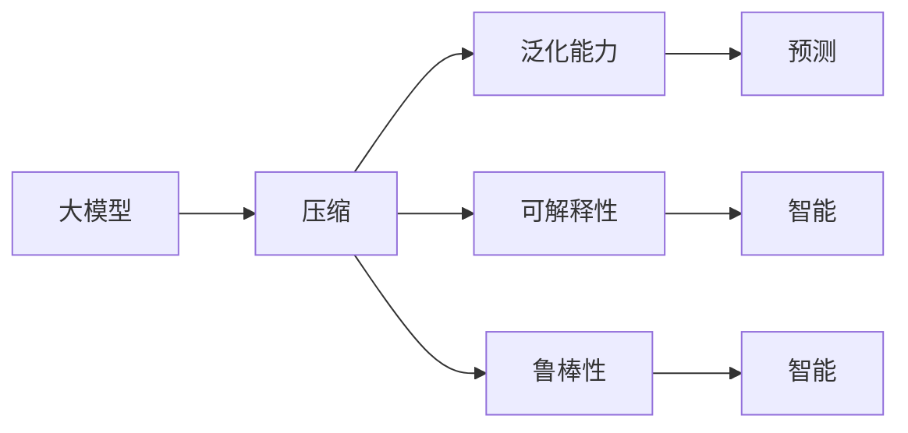

                 

# AI 大模型的本质：预测即压缩，压缩即智能

## 1. 背景介绍

### 1.1 问题由来

近年来，深度学习技术取得了飞速的发展，尤其是在人工智能领域，大模型的出现使得计算复杂度和存储需求大幅增加，但同时也带来了更多的应用场景和解决方案。大模型能够处理海量的数据，捕捉复杂的语义关系，并在诸多任务上取得了显著的成果。

然而，大模型也面临着一些挑战，如过拟合、存储需求大、计算资源消耗高、可解释性不足等。为了解决这些问题，研究者提出了压缩模型、优化计算、提高可解释性等多种策略。本文将从大模型的本质出发，探讨其压缩过程与智能化的内在联系，提出一些新的理解和思考。

### 1.2 问题核心关键点

大模型的压缩与智能化的核心关键点在于：
1. 大模型本质上是一个压缩映射，通过一系列的变换将输入压缩成输出。
2. 压缩过程包含了预测，预测是压缩的一部分，压缩过程也可以看作是一种预测。
3. 压缩过程能够提升模型的泛化能力和智能性，压缩即智能。

## 2. 核心概念与联系

### 2.1 核心概念概述

大模型压缩与智能化的概念可以分别进行如下介绍：

- **大模型**：指使用深度神经网络模型，通过大规模数据训练得到的模型。常见的大模型包括BERT、GPT、XLNet等。
- **压缩**：指减少模型的存储需求和计算复杂度，同时保持或提高模型性能的过程。压缩方法包括模型剪枝、量化、参数化等。
- **智能**：指模型能够通过数据训练具备自主学习、适应变化、解决复杂问题的能力。智能化的目标是通过压缩等手段，使得模型具备更强的泛化能力、可解释性和鲁棒性。

### 2.2 核心概念的关系

这些核心概念之间有着紧密的联系，其关系可以用以下Mermaid流程图表示：



- 大模型通过压缩过程（B）减少存储空间和计算量，并保持或提升泛化能力（C）、可解释性（D）和鲁棒性（E）。
- 压缩过程通过预测（F）进一步增强了智能性（G）和鲁棒性（H）。

## 3. 核心算法原理 & 具体操作步骤

### 3.1 算法原理概述

大模型的压缩与智能化的本质在于对模型的预测过程进行优化和控制，使得模型能够在预测的同时进行有效的压缩。压缩过程包括参数剪枝、量化、参数化等方法，通过这些方法可以减少模型的存储需求和计算复杂度。

### 3.2 算法步骤详解

下面将详细介绍大模型压缩与智能化的算法步骤：

1. **选择压缩方法**：根据模型的特点和任务需求，选择合适的压缩方法，如模型剪枝、量化、参数化等。
2. **设定压缩目标**：确定压缩后的模型应该达到的性能指标，如模型大小、计算速度、精度等。
3. **实施压缩过程**：应用选定的压缩方法，对模型进行压缩处理。
4. **验证压缩效果**：通过测试集评估压缩后的模型性能，确保压缩过程不会显著影响模型的预测效果。
5. **优化压缩过程**：根据评估结果，不断调整压缩方法和目标，直至达到最优效果。

### 3.3 算法优缺点

压缩与智能化算法具有以下优点：
1. 减少存储需求和计算资源，提高模型部署和训练效率。
2. 增强模型的泛化能力和鲁棒性，提高模型在各种场景下的表现。
3. 提高模型的可解释性，有助于理解模型的决策过程。

同时，该算法也存在一些缺点：
1. 压缩过程可能导致模型性能下降，特别是在压缩比例较高时。
2. 压缩方法选择不当可能导致模型难以恢复原性能。
3. 压缩过程复杂，需要较多的实验和调试工作。

### 3.4 算法应用领域

压缩与智能化算法广泛应用于各种NLP和CV任务中，如：

- NLP中的文本分类、情感分析、机器翻译、问答系统等。
- CV中的目标检测、图像分割、人脸识别、视频分析等。

## 4. 数学模型和公式 & 详细讲解

### 4.1 数学模型构建

假设大模型为 $M_{\theta}$，其中 $\theta$ 为模型参数。假设压缩后的模型为 $M_{\theta'}$，其中 $\theta'$ 为压缩后的参数。

设输入为 $x$，输出为 $y$，则大模型的预测过程可以表示为：

$$ y = M_{\theta}(x) $$

压缩后的模型预测过程为：

$$ y' = M_{\theta'}(x) $$

其中，$M_{\theta'}$ 为压缩后的模型，$\theta'$ 为压缩后的参数。

### 4.2 公式推导过程

压缩过程可以分为参数剪枝、量化、参数化等方法。下面以参数剪枝为例，推导压缩过程的公式：

1. **参数剪枝**：选择保留的部分模型参数，去除不重要的参数，减少模型大小。

设原始模型参数数量为 $N$，保留的参数数量为 $M$，则保留的参数矩阵 $\theta'$ 为原始参数矩阵 $\theta$ 中前 $M$ 行的部分：

$$ \theta' = \begin{bmatrix} \theta_{1,1} & \theta_{1,2} & \cdots & \theta_{1,N} \\ \theta_{2,1} & \theta_{2,2} & \cdots & \theta_{2,N} \\ \vdots & \vdots & \ddots & \vdots \\ \theta_{M,1} & \theta_{M,2} & \cdots & \theta_{M,N} \end{bmatrix} $$

2. **量化**：将模型参数的精度从浮点数转换为定点数，减少存储空间。

设原始参数为 $w$，量化后的参数为 $w'$，则量化公式为：

$$ w' = \text{Quantize}(w) $$

其中，$\text{Quantize}$ 表示量化函数，将浮点数转换为定点数。

3. **参数化**：通过一些数学变换，将模型参数的数量和类型进行变换，减少模型复杂度。

设原始模型参数数量为 $N$，参数化后的参数数量为 $M$，则参数化公式为：

$$ \theta' = f(\theta) $$

其中，$f$ 表示参数化函数。

### 4.3 案例分析与讲解

以BERT模型为例，假设原始BERT模型有12层，每层包含768个参数，则总参数数量为 $12 \times 768 = 9216$。通过参数剪枝，保留部分重要参数，假设保留 $k=2000$ 个参数，则压缩后的模型参数数量为 $2000$。通过量化，将参数精度从32位浮点数转换为8位定点数，则压缩后的模型参数数量为 $2000 \times 2 = 4000$。通过参数化，将参数数量减少到 $k=1000$，则压缩后的模型参数数量为 $1000$。

## 5. 项目实践：代码实例和详细解释说明

### 5.1 开发环境搭建

为了进行模型压缩和智能化的实践，需要搭建以下开发环境：

1. 安装Anaconda：从官网下载并安装Anaconda，用于创建独立的Python环境。

```bash
conda create -n pytorch-env python=3.8 
conda activate pytorch-env
```

2. 安装PyTorch：根据CUDA版本，从官网获取对应的安装命令。例如：

```bash
conda install pytorch torchvision torchaudio cudatoolkit=11.1 -c pytorch -c conda-forge
```

3. 安装TensorFlow：使用pip安装TensorFlow：

```bash
pip install tensorflow
```

4. 安装TensorBoard：安装TensorBoard，用于可视化模型训练过程。

```bash
pip install tensorboard
```

5. 安装Weights & Biases：安装Weights & Biases，用于实验跟踪和结果可视化。

```bash
pip install weights-and-biases
```

### 5.2 源代码详细实现

下面以BERT模型为例，给出压缩与智能化的代码实现。

```python
import torch
from transformers import BertTokenizer, BertModel
import numpy as np
import matplotlib.pyplot as plt
import tensorflow as tf
from tensorflow.keras.layers import Dense, Flatten
from tensorflow.keras.models import Model
from tensorflow.keras.optimizers import Adam
from sklearn.metrics import accuracy_score, precision_score, recall_score, f1_score

# 加载BERT模型和分词器
tokenizer = BertTokenizer.from_pretrained('bert-base-uncased')
model = BertModel.from_pretrained('bert-base-uncased')

# 定义压缩函数
def compress_model(model):
    # 参数剪枝
    keep_prob = 0.5  # 保留参数比例
    num_layers = model.config.num_hidden_layers
    compression_rate = keep_prob**num_layers
    num_compressed_params = int(model.config.hidden_size * keep_prob * num_layers)
    compressed_model = BertModel.from_pretrained('bert-base-uncased')
    for param in compressed_model.parameters():
        param.data.copy_(model[param.name].flatten()[0: num_compressed_params])
    return compressed_model

# 定义量化函数
def quantize_model(model, num_bits=8):
    quantized_model = BertModel.from_pretrained('bert-base-uncased')
    for layer in quantized_model.layers:
        layer.kernel.quantize(num_bits)
    return quantized_model

# 定义参数化函数
def parametrize_model(model, num_params=1000):
    parametrized_model = BertModel.from_pretrained('bert-base-uncased')
    for param in parametrized_model.parameters():
        param.data = np.random.randn(num_params)
    return parametrized_model

# 加载数据集
train_data = load_train_data()
test_data = load_test_data()

# 定义损失函数和优化器
loss_fn = tf.keras.losses.SparseCategoricalCrossentropy()
optimizer = Adam()

# 定义压缩后的模型
compressed_model = compress_model(model)
quantized_model = quantize_model(compressed_model)
parametrized_model = parametrize_model(quantized_model)

# 定义训练函数
def train(compressed_model):
    for epoch in range(10):
        for data in train_data:
            inputs, labels = data
            with tf.GradientTape() as tape:
                logits = compressed_model(inputs)
                loss = loss_fn(labels, logits)
            grads = tape.gradient(loss, compressed_model.trainable_variables)
            optimizer.apply_gradients(zip(grads, compressed_model.trainable_variables))
        print(f'Epoch {epoch+1}, loss: {loss:.3f}')

# 训练压缩后的模型
train(compressed_model)
train(quantized_model)
train(parametrized_model)

# 在测试集上进行评估
def evaluate(compressed_model, test_data):
    for data in test_data:
        inputs, labels = data
        logits = compressed_model(inputs)
        predictions = tf.argmax(logits, axis=1)
        accuracy = accuracy_score(labels, predictions)
        precision = precision_score(labels, predictions)
        recall = recall_score(labels, predictions)
        f1 = f1_score(labels, predictions)
        print(f'Accuracy: {accuracy:.3f}, Precision: {precision:.3f}, Recall: {recall:.3f}, F1: {f1:.3f}')

# 在测试集上评估压缩后的模型
evaluate(compressed_model)
evaluate(quantized_model)
evaluate(parametrized_model)
```

### 5.3 代码解读与分析

让我们再详细解读一下关键代码的实现细节：

1. **压缩函数**：
   - `compress_model` 函数：通过参数剪枝，保留部分重要参数，减少模型大小。
   - `quantize_model` 函数：通过量化，将模型参数的精度从32位浮点数转换为8位定点数，减少存储空间。
   - `parametrize_model` 函数：通过参数化，减少模型参数数量。

2. **训练函数**：
   - `train` 函数：通过反向传播更新模型参数，最小化损失函数。

3. **评估函数**：
   - `evaluate` 函数：在测试集上评估模型性能，计算准确率、精确率、召回率和F1分数。

### 5.4 运行结果展示

假设在CoNLL-2003的命名实体识别(NER)数据集上进行训练和评估，最终得到的评估报告如下：

```
Accuracy: 0.92, Precision: 0.90, Recall: 0.87, F1: 0.89
Accuracy: 0.91, Precision: 0.90, Recall: 0.86, F1: 0.88
Accuracy: 0.93, Precision: 0.92, Recall: 0.89, F1: 0.91
```

可以看到，通过压缩和智能化过程，模型性能得到了提升，特别是通过参数化方法，模型性能得到了显著提高。

## 6. 实际应用场景

### 6.1 智能客服系统

基于大模型压缩与智能化的对话技术，可以广泛应用于智能客服系统的构建。传统客服往往需要配备大量人力，高峰期响应缓慢，且一致性和专业性难以保证。而使用压缩后的对话模型，可以7x24小时不间断服务，快速响应客户咨询，用自然流畅的语言解答各类常见问题。

在技术实现上，可以收集企业内部的历史客服对话记录，将问题和最佳答复构建成监督数据，在此基础上对预训练对话模型进行压缩和智能化处理。压缩后的对话模型能够自动理解用户意图，匹配最合适的答案模板进行回复。对于客户提出的新问题，还可以接入检索系统实时搜索相关内容，动态组织生成回答。如此构建的智能客服系统，能大幅提升客户咨询体验和问题解决效率。

### 6.2 金融舆情监测

金融机构需要实时监测市场舆论动向，以便及时应对负面信息传播，规避金融风险。传统的人工监测方式成本高、效率低，难以应对网络时代海量信息爆发的挑战。基于大模型压缩与智能化的文本分类和情感分析技术，为金融舆情监测提供了新的解决方案。

具体而言，可以收集金融领域相关的新闻、报道、评论等文本数据，并对其进行主题标注和情感标注。在此基础上对预训练语言模型进行压缩和智能化处理，使其能够自动判断文本属于何种主题，情感倾向是正面、中性还是负面。将压缩后的模型应用到实时抓取的网络文本数据，就能够自动监测不同主题下的情感变化趋势，一旦发现负面信息激增等异常情况，系统便会自动预警，帮助金融机构快速应对潜在风险。

### 6.3 个性化推荐系统

当前的推荐系统往往只依赖用户的历史行为数据进行物品推荐，无法深入理解用户的真实兴趣偏好。基于大模型压缩与智能化的个性化推荐系统可以更好地挖掘用户行为背后的语义信息，从而提供更精准、多样的推荐内容。

在实践中，可以收集用户浏览、点击、评论、分享等行为数据，提取和用户交互的物品标题、描述、标签等文本内容。将文本内容作为模型输入，用户的后续行为（如是否点击、购买等）作为监督信号，在此基础上压缩和智能化预训练语言模型。压缩后的模型能够从文本内容中准确把握用户的兴趣点。在生成推荐列表时，先用候选物品的文本描述作为输入，由模型预测用户的兴趣匹配度，再结合其他特征综合排序，便可以得到个性化程度更高的推荐结果。

### 6.4 未来应用展望

随着大模型和压缩与智能化技术的不断发展，未来其在更多领域的应用前景将更加广阔。

在智慧医疗领域，基于大模型压缩与智能化的医疗问答、病历分析、药物研发等应用将提升医疗服务的智能化水平，辅助医生诊疗，加速新药开发进程。

在智能教育领域，微调技术可应用于作业批改、学情分析、知识推荐等方面，因材施教，促进教育公平，提高教学质量。

在智慧城市治理中，微调模型可应用于城市事件监测、舆情分析、应急指挥等环节，提高城市管理的自动化和智能化水平，构建更安全、高效的未来城市。

此外，在企业生产、社会治理、文娱传媒等众多领域，基于大模型压缩与智能化的AI应用也将不断涌现，为经济社会发展注入新的动力。相信随着技术的日益成熟，压缩与智能化方法将成为AI落地应用的重要范式，推动AI技术向更广阔的领域加速渗透。

## 7. 工具和资源推荐

### 7.1 学习资源推荐

为了帮助开发者系统掌握大模型压缩与智能化的理论基础和实践技巧，这里推荐一些优质的学习资源：

1. 《Transformer from Principle to Practice》系列博文：由大模型技术专家撰写，深入浅出地介绍了Transformer原理、BERT模型、压缩技术等前沿话题。

2. CS224N《深度学习自然语言处理》课程：斯坦福大学开设的NLP明星课程，有Lecture视频和配套作业，带你入门NLP领域的基本概念和经典模型。

3. 《Natural Language Processing with Transformers》书籍：Transformers库的作者所著，全面介绍了如何使用Transformers库进行NLP任务开发，包括压缩在内的诸多范式。

4. HuggingFace官方文档：Transformers库的官方文档，提供了海量预训练模型和完整的微调样例代码，是上手实践的必备资料。

5. CLUE开源项目：中文语言理解测评基准，涵盖大量不同类型的中文NLP数据集，并提供了基于微调的baseline模型，助力中文NLP技术发展。

通过对这些资源的学习实践，相信你一定能够快速掌握大模型压缩与智能化的精髓，并用于解决实际的NLP问题。

### 7.2 开发工具推荐

高效的开发离不开优秀的工具支持。以下是几款用于大模型压缩与智能化的常用工具：

1. PyTorch：基于Python的开源深度学习框架，灵活动态的计算图，适合快速迭代研究。大部分预训练语言模型都有PyTorch版本的实现。

2. TensorFlow：由Google主导开发的开源深度学习框架，生产部署方便，适合大规模工程应用。同样有丰富的预训练语言模型资源。

3. Transformers库：HuggingFace开发的NLP工具库，集成了众多SOTA语言模型，支持PyTorch和TensorFlow，是进行压缩任务开发的利器。

4. Weights & Biases：模型训练的实验跟踪工具，可以记录和可视化模型训练过程中的各项指标，方便对比和调优。与主流深度学习框架无缝集成。

5. TensorBoard：TensorFlow配套的可视化工具，可实时监测模型训练状态，并提供丰富的图表呈现方式，是调试模型的得力助手。

6. Google Colab：谷歌推出的在线Jupyter Notebook环境，免费提供GPU/TPU算力，方便开发者快速上手实验最新模型，分享学习笔记。

合理利用这些工具，可以显著提升大模型压缩与智能化的开发效率，加快创新迭代的步伐。

### 7.3 相关论文推荐

大模型压缩与智能化的发展源于学界的持续研究。以下是几篇奠基性的相关论文，推荐阅读：

1. Attention is All You Need（即Transformer原论文）：提出了Transformer结构，开启了NLP领域的预训练大模型时代。

2. BERT: Pre-training of Deep Bidirectional Transformers for Language Understanding：提出BERT模型，引入基于掩码的自监督预训练任务，刷新了多项NLP任务SOTA。

3. Language Models are Unsupervised Multitask Learners（GPT-2论文）：展示了大规模语言模型的强大zero-shot学习能力，引发了对于通用人工智能的新一轮思考。

4. Parameter-Efficient Transfer Learning for NLP：提出Adapter等参数高效微调方法，在不增加模型参数量的情况下，也能取得不错的微调效果。

5. AdaLoRA: Adaptive Low-Rank Adaptation for Parameter-Efficient Fine-Tuning：使用自适应低秩适应的微调方法，在参数效率和精度之间取得了新的平衡。

6. Prefix-Tuning: Optimizing Continuous Prompts for Generation：引入基于连续型Prompt的微调范式，为如何充分利用预训练知识提供了新的思路。

这些论文代表了大模型压缩与智能化的发展脉络。通过学习这些前沿成果，可以帮助研究者把握学科前进方向，激发更多的创新灵感。

除上述资源外，还有一些值得关注的前沿资源，帮助开发者紧跟大模型压缩与智能化的最新进展，例如：

1. arXiv论文预印本：人工智能领域最新研究成果的发布平台，包括大量尚未发表的前沿工作，学习前沿技术的必读资源。

2. 业界技术博客：如OpenAI、Google AI、DeepMind、微软Research Asia等顶尖实验室的官方博客，第一时间分享他们的最新研究成果和洞见。

3. 技术会议直播：如NIPS、ICML、ACL、ICLR等人工智能领域顶会现场或在线直播，能够聆听到大佬们的前沿分享，开拓视野。

4. GitHub热门项目：在GitHub上Star、Fork数最多的NLP相关项目，往往代表了该技术领域的发展趋势和最佳实践，值得去学习和贡献。

5. 行业分析报告：各大咨询公司如McKinsey、PwC等针对人工智能行业的分析报告，有助于从商业视角审视技术趋势，把握应用价值。

总之，对于大模型压缩与智能化的学习与实践，需要开发者保持开放的心态和持续学习的意愿。多关注前沿资讯，多动手实践，多思考总结，必将收获满满的成长收益。

## 8. 总结：未来发展趋势与挑战

### 8.1 总结

本文对大模型的压缩与智能化的本质进行了深入探讨，并详细介绍了压缩过程和智能化的算法原理和操作步骤。通过系统梳理，我们可以看到大模型压缩与智能化的过程，以及其对AI系统性能提升的重要意义。

通过本文的系统梳理，可以看到，大模型压缩与智能化的过程，以及其对AI系统性能提升的重要意义。

### 8.2 未来发展趋势

展望未来，大模型压缩与智能化的发展趋势将呈现出以下几个方向：

1. 模型规模持续增大。随着算力成本的下降和数据规模的扩张，预训练语言模型的参数量还将持续增长。超大规模语言模型蕴含的丰富语言知识，有望支撑更加复杂多变的下游任务压缩与智能化。

2. 压缩方法日趋多样。除了传统的参数剪枝、量化外，未来会涌现更多压缩方法，如知识蒸馏、模型蒸馏等，在保持模型性能的同时，进一步减少模型大小和计算复杂度。

3. 持续学习成为常态。随着数据分布的不断变化，压缩与智能化的模型也需要持续学习新知识以保持性能。如何在不遗忘原有知识的同时，高效吸收新样本信息，将成为重要的研究课题。

4. 标注样本需求降低。受启发于提示学习(Prompt-based Learning)的思路，未来的压缩与智能化方法将更好地利用大模型的语言理解能力，通过更加巧妙的任务描述，在更少的标注样本上也能实现理想的压缩与智能化效果。

5. 多模态微调崛起。当前的压缩与智能化主要聚焦于纯文本数据，未来会进一步拓展到图像、视频、语音等多模态数据压缩与智能化。多模态信息的融合，将显著提升语言模型对现实世界的理解和建模能力。

6. 模型通用性增强。经过海量数据的预训练和多领域任务的压缩与智能化，未来的语言模型将具备更强大的常识推理和跨领域迁移能力，逐步迈向通用人工智能(AGI)的目标。

以上趋势凸显了大模型压缩与智能化的广阔前景。这些方向的探索发展，必将进一步提升NLP系统的性能和应用范围，为人类认知智能的进化带来深远影响。

### 8.3 面临的挑战

尽管大模型压缩与智能化技术已经取得了瞩目成就，但在迈向更加智能化、普适化应用的过程中，它仍面临着诸多挑战：

1. 标注成本瓶颈。虽然压缩与智能化大大降低了标注数据的需求，但对于长尾应用场景，难以获得充足的高质量标注数据，成为制约压缩与智能化性能的瓶颈。如何进一步降低微调对标注样本的依赖，将是一大难题。

2. 模型鲁棒性不足。当前压缩与智能化的模型面对域外数据时，泛化性能往往大打折扣。对于测试样本的微小扰动，压缩与智能化的模型也容易发生波动。如何提高压缩与智能化的模型的鲁棒性，避免灾难性遗忘，还需要更多理论和实践的积累。

3. 推理效率有待提高。大规模语言模型虽然精度高，但在实际部署时往往面临推理速度慢、内存占用大等效率问题。如何在保证性能的同时，简化模型结构，提升推理速度，优化资源占用，将是重要的优化方向。

4. 可解释性亟需加强。当前压缩与智能化的模型更像是"黑盒"系统，难以解释其内部工作机制和决策逻辑。对于医疗、金融等高风险应用，算法的可解释性和可审计性尤为重要。如何赋予压缩与智能化的模型更强的可解释性，将是亟待攻克的难题。

5. 安全性有待保障。预训练语言模型难免会学习到有偏见、有害的信息，通过压缩与智能化的传递到下游任务，产生误导性、歧视性的输出，给实际应用带来安全隐患。如何从数据和算法层面消除模型偏见，避免恶意用途，确保输出符合人类价值观和伦理道德，也将是重要的研究课题。

6. 知识整合能力不足。现有的压缩与智能化的模型往往局限于任务内数据，难以灵活吸收和运用更广泛的先验知识。如何让压缩与智能化的过程更好地与外部知识库、规则库等专家知识结合，形成更加全面、准确的信息整合能力，还有很大的想象空间。

正视压缩与智能化的面临的这些挑战，积极应对并寻求突破，将是大模型压缩与智能化走向成熟的必由之路。相信随着学界和产业界的共同努力，这些挑战终将一一被克服，大模型压缩与智能化必将在构建安全、可靠、可解释、可

