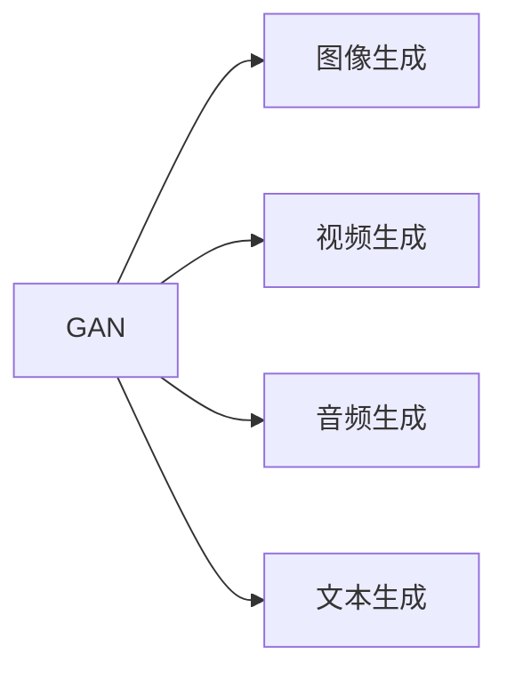
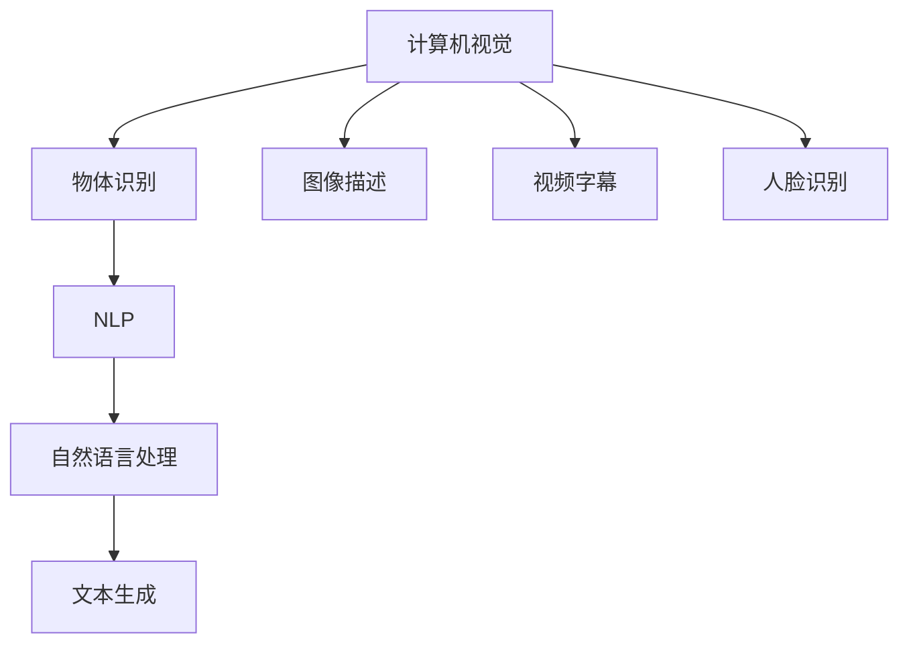

                 

# AI 大模型计算机科学家群英传：生成对抗网络（GAN）的发明者 Ian Goodfellow

> 关键词：生成对抗网络, Ian Goodfellow, 深度学习, 计算机视觉, 人工智能

## 1. 背景介绍

### 1.1 问题由来

在AI技术的演进历史中，有许多杰出人物通过开创性的研究，推动了技术的进步和应用的发展。这些科学家不仅是技术的引领者，更是时代的见证者。Ian Goodfellow，这位计算机视觉领域的翘楚，以其在生成对抗网络（GAN）中的开创性贡献，成为了AI大模型时代的重要奠基人之一。

Ian Goodfellow，1989年生于加拿大多伦多，是深度学习领域的先锋，尤其是在生成模型、变分推断和对抗性学习方面做出了革命性的贡献。他的工作不仅改变了计算机视觉和深度学习的格局，也为AI大模型的研究提供了新的思路和方法。

### 1.2 问题核心关键点

Ian Goodfellow的研究领域主要集中在生成模型和对抗性学习。生成模型是一种能够从数据中学习生成新样本的技术，GAN作为其中的代表，通过生成器和判别器两组神经网络之间的对抗训练，实现了高质量的图像、音频和文本生成。对抗性学习则是研究如何使模型能够抵抗对抗性攻击，提高模型的鲁棒性和安全性。

Ian Goodfellow的工作不仅在学术界产生了深远的影响，还推动了工业界对于生成对抗网络的应用和研究。GAN在图像生成、图像修复、视频合成、音乐生成、人脸合成等多个领域取得了令人瞩目的成果，成为AI大模型时代不可或缺的技术之一。

### 1.3 问题研究意义

Ian Goodfellow的研究不仅拓展了深度学习的应用边界，还推动了生成对抗网络的发展。GAN作为深度学习的重要分支，其技术进步对于提升AI大模型的性能和应用范围具有重要意义：

1. **图像生成与修复**：GAN能够生成高质量的图像，并在图像修复、超分辨率等任务上取得优异表现。
2. **视频生成与合成**：GAN技术可以用于视频生成、视频合成、动态生成图像等任务。
3. **音频生成**：GAN能够生成高质量的音频，用于音乐生成、声音合成等领域。
4. **人脸生成**：GAN可以生成逼真的人脸图像，用于虚拟现实、人机交互等领域。
5. **文本生成**：GAN技术可以用于文本生成、摘要、对话生成等领域，提高自然语言处理的效率和效果。

Ian Goodfellow的工作不仅提升了深度学习的理论基础和实际应用，还为未来的AI技术发展提供了新的方向和可能性。

## 2. 核心概念与联系

### 2.1 核心概念概述

为了更好地理解Ian Goodfellow的研究成果，我们首先介绍几个关键概念及其之间的关系。

- **生成对抗网络（GAN）**：由Ian Goodfellow与其同事Ian Goodfellow和Yoshua Bengio在2014年提出的，通过生成器和判别器两个网络进行对抗训练，生成高质量的图像、音频、视频和文本。
- **深度学习**：一种基于神经网络的机器学习技术，通过多层非线性变换，实现对数据的复杂建模和预测。
- **计算机视觉**：研究如何使计算机能够理解、分析、处理和生成图像和视频的技术，GAN技术在计算机视觉中得到了广泛应用。
- **人工智能**：通过算法、数据、计算资源和硬件设施，使计算机具备类似人类的智能，实现自主学习和决策的能力。

这些概念之间的联系可以通过以下Mermaid流程图来展示：

```mermaid
graph TB
    A[深度学习] --> B[计算机视觉]
    B --> C[生成对抗网络 (GAN)]
    C --> D[图像生成]
    C --> E[视频生成]
    C --> F[音频生成]
    C --> G[文本生成]
    A --> H[神经网络]
    H --> I[卷积神经网络 (CNN)]
    I --> J[自编码器 (AE)]
    A --> K[自然语言处理 (NLP)]
    K --> L[语言模型]
    L --> M[生成语言模型]
```

这个流程图展示了大模型时代的核心概念及其之间的关系：

1. 深度学习提供了一种通用的框架，用于训练和优化复杂神经网络。
2. 计算机视觉和自然语言处理是深度学习的主要应用领域之一，GAN技术在其中得到了广泛应用。
3. 生成对抗网络（GAN）是深度学习的一个重要分支，通过生成器和判别器的对抗训练，实现高质量的数据生成。
4. GAN技术可以用于图像、视频、音频和文本生成，提升AI大模型的应用范围和性能。

### 2.2 概念间的关系

这些核心概念之间存在着紧密的联系，形成了深度学习和大模型技术的完整生态系统。下面我通过几个Mermaid流程图来展示这些概念之间的关系。

#### 2.2.1 深度学习与计算机视觉的关系

```mermaid
graph TB
    A[深度学习] --> B[卷积神经网络 (CNN)]
    B --> C[图像分类]
    B --> D[图像分割]
    B --> E[物体检测]
    B --> F[图像生成]
```

这个流程图展示了深度学习在计算机视觉中的应用，包括图像分类、分割、检测和生成等任务。

#### 2.2.2 GAN在生成任务中的应用



这个流程图展示了GAN技术在生成任务中的应用，包括图像、视频、音频和文本生成。

#### 2.2.3 计算机视觉与自然语言处理的关系



这个流程图展示了计算机视觉和自然语言处理之间的桥梁作用，通过物体识别、图像描述、视频字幕、人脸识别等任务，实现了视觉和文本信息的整合。

### 2.3 核心概念的整体架构

最后，我们用一个综合的流程图来展示这些核心概念在大模型时代中的整体架构：

```mermaid
graph TB
    A[深度学习] --> B[计算机视觉]
    B --> C[生成对抗网络 (GAN)]
    C --> D[图像生成]
    C --> E[视频生成]
    C --> F[音频生成]
    C --> G[文本生成]
    A --> H[自然语言处理 (NLP)]
    H --> I[语言模型]
    I --> J[生成语言模型]
    B --> K[物体识别]
    K --> L[NLP]
    L --> M[文本生成]
```

这个综合流程图展示了从深度学习到计算机视觉、自然语言处理，再到生成对抗网络的完整过程。大模型时代通过这些技术的结合，实现了对复杂数据的全面理解和生成，推动了AI技术的应用边界不断扩展。

## 3. 核心算法原理 & 具体操作步骤

### 3.1 算法原理概述

生成对抗网络（GAN）是一种基于对抗训练的深度学习算法，由生成器和判别器两组网络组成。生成器网络生成假样本，判别器网络则区分真样本和假样本。通过反复训练这两组网络，使生成器能够生成高质量的假样本，判别器能够准确区分真样本和假样本。

GAN的训练过程可以形式化地表示为：
$$
G_{\theta_G}, D_{\theta_D} \sim \arg\min_{\theta_G} \max_{\theta_D} V(D_{\theta_D}, G_{\theta_G})
$$
其中 $V$ 为对抗损失函数，$G_{\theta_G}$ 为生成器，$D_{\theta_D}$ 为判别器，$\theta_G$ 和 $\theta_D$ 分别为生成器和判别器的参数。

GAN的生成过程主要依赖于两个函数：生成函数 $G_{\theta_G}$ 和判别函数 $D_{\theta_D}$。生成函数 $G_{\theta_G}$ 将噪声向量 $z$ 映射到生成样本 $G(z)$，判别函数 $D_{\theta_D}$ 将样本 $x$ 分类为真实样本 $x$ 和生成样本 $G(z)$。

### 3.2 算法步骤详解

下面详细介绍GAN的具体训练步骤和算法细节。

1. **初始化生成器和判别器**：
   - 生成器 $G$：将噪声向量 $z$ 映射为生成样本 $G(z)$。
   - 判别器 $D$：将样本 $x$ 分类为真实样本 $x$ 和生成样本 $G(z)$。

2. **更新判别器**：
   - 用样本 $x$ 和生成样本 $G(z)$ 训练判别器 $D$，使 $D(x)$ 接近1，$D(G(z))$ 接近0。

3. **更新生成器**：
   - 用样本 $x$ 和生成样本 $G(z)$ 训练生成器 $G$，使 $D(G(z))$ 接近1。

4. **交替更新**：
   - 在判别器和生成器之间交替进行更新，直到模型收敛。

### 3.3 算法优缺点

GAN作为深度学习的重要分支，具有以下优点：

- **生成高质量样本**：GAN能够生成高质量的假样本，用于图像、音频、视频和文本生成等任务。
- **不需要标注数据**：GAN训练过程不需要标注数据，能够从无标签数据中学习生成新样本。
- **可扩展性强**：GAN可以应用于各种生成任务，具有很强的通用性。

同时，GAN也存在一些缺点：

- **训练不稳定**：GAN训练过程容易出现模式崩溃、震荡等问题，需要精心调参。
- **生成样本质量不稳定**：GAN生成的样本质量依赖于生成器和判别器的参数，需要长时间的训练才能达到理想效果。
- **模型难以解释**：GAN模型的工作机制复杂，难以解释其内部工作原理和决策逻辑。

### 3.4 算法应用领域

GAN在计算机视觉、生成式语言模型、语音生成、游戏AI等多个领域得到了广泛应用，推动了AI大模型的发展：

- **计算机视觉**：用于图像生成、图像修复、图像超分辨率、人脸生成、视频生成等任务。
- **生成式语言模型**：用于文本生成、对话生成、摘要生成、情感分析等任务。
- **语音生成**：用于音乐生成、声音合成、语音识别等任务。
- **游戏AI**：用于生成游戏地图、生成角色、生成任务等任务。

## 4. 数学模型和公式 & 详细讲解 & 举例说明

### 4.1 数学模型构建

GAN的训练过程可以通过数学模型和公式来形式化表示。假设生成器 $G$ 和判别器 $D$ 分别为：
$$
G(z): \mathbb{R}^n \rightarrow \mathcal{X}
$$
$$
D(x): \mathcal{X} \rightarrow [0,1]
$$
其中 $z$ 为噪声向量，$\mathcal{X}$ 为生成样本空间。

GAN的损失函数可以表示为：
$$
L(G,D) = \mathbb{E}_{x \sim p_{data}} [\log D(x)] + \mathbb{E}_{z \sim p(z)} [\log(1-D(G(z)))]
$$
其中 $p_{data}$ 为真实样本的分布，$p(z)$ 为噪声向量的分布。

### 4.2 公式推导过程

下面推导GAN的训练过程和损失函数的优化方法。

1. **判别器训练**：
   - 目标最大化判别器正确分类的概率：
     $$
     \max_{\theta_D} \mathbb{E}_{x \sim p_{data}} [\log D(x)] + \mathbb{E}_{z \sim p(z)} [\log(1-D(G(z)))]
     $$
   - 使用反向传播算法，计算判别器参数 $\theta_D$ 的梯度，更新判别器 $D$。

2. **生成器训练**：
   - 目标最大化生成器能够欺骗判别器的概率：
     $$
     \min_{\theta_G} \mathbb{E}_{z \sim p(z)} [\log(1-D(G(z)))]
     $$
   - 使用反向传播算法，计算生成器参数 $\theta_G$ 的梯度，更新生成器 $G$。

3. **联合训练**：
   - 交替更新生成器和判别器的参数，直到模型收敛。

### 4.3 案例分析与讲解

以图像生成任务为例，GAN可以用于生成逼真的图像样本。假设我们要生成一张猫的图片，具体步骤如下：

1. **数据准备**：收集一张高质量的猫的图片作为真实样本，将其转换为向量形式。

2. **生成器初始化**：使用随机噪声向量 $z$ 作为生成器的输入，生成一张猫的图片。

3. **判别器训练**：将真实猫的图片和生成的猫的图片送入判别器 $D$，训练判别器能够准确区分真实猫的图片和生成的猫的图片。

4. **生成器更新**：用判别器的梯度更新生成器 $G$，使生成的猫的图片越来越逼真。

5. **交替更新**：在判别器和生成器之间交替进行训练，直到生成器的输出达到理想的逼真度。

## 5. Ian Goodfellow 的贡献与影响

### 5.1 开发环境搭建

在进行GAN的实现和训练之前，我们需要准备好开发环境。以下是使用Python进行TensorFlow实现GAN的开发环境配置流程：

1. 安装Anaconda：从官网下载并安装Anaconda，用于创建独立的Python环境。

2. 创建并激活虚拟环境：
```bash
conda create -n gans-env python=3.7 
conda activate gans-env
```

3. 安装TensorFlow：根据CUDA版本，从官网获取对应的安装命令。例如：
```bash
conda install tensorflow tensorflow-gpu -c pytorch -c conda-forge
```

4. 安装其它相关工具包：
```bash
pip install numpy scipy matplotlib scipy ninja openmp h5py
```

完成上述步骤后，即可在`gans-env`环境中开始GAN的实现和训练。

### 5.2 源代码详细实现

这里我们以GAN模型为例，给出使用TensorFlow实现图像生成任务的代码实现。

首先，定义生成器和判别器模型：

```python
import tensorflow as tf

class Generator(tf.keras.Model):
    def __init__(self, z_dim, image_dim):
        super(Generator, self).__init__()
        self.z_dim = z_dim
        self.image_dim = image_dim
        
        self.dense1 = tf.keras.layers.Dense(256, input_dim=z_dim)
        self.dense2 = tf.keras.layers.Dense(256)
        self.dense3 = tf.keras.layers.Dense(image_dim)
        
    def call(self, inputs):
        x = self.dense1(inputs)
        x = tf.keras.layers.LeakyReLU(0.2)(x)
        x = self.dense2(x)
        x = tf.keras.layers.LeakyReLU(0.2)(x)
        x = self.dense3(x)
        return tf.nn.tanh(x)
        
class Discriminator(tf.keras.Model):
    def __init__(self, image_dim):
        super(Discriminator, self).__init__()
        self.image_dim = image_dim
        
        self.flatten = tf.keras.layers.Flatten()
        self.dense1 = tf.keras.layers.Dense(256)
        self.dense2 = tf.keras.layers.Dense(1)
        
    def call(self, inputs):
        x = self.flatten(inputs)
        x = self.dense1(x)
        x = tf.keras.layers.LeakyReLU(0.2)(x)
        x = self.dense2(x)
        return x
```

然后，定义GAN的训练函数：

```python
def train_gan(generator, discriminator, z_dim, image_dim, batch_size, epochs):
    image = tf.zeros([batch_size, image_dim])

    for epoch in range(epochs):
        for i in range(len(train_dataset)):
            batch = next(iter(train_dataset))
            batch_images = batch[0]
            batch_labels = batch[1]
            
            with tf.GradientTape() as tape:
                # 生成器训练
                z = tf.random.normal([batch_size, z_dim])
                generated_images = generator(z)
                disc_loss = discriminator.train_on_batch(generated_images, generated_images)
                gen_loss = discriminator.train_on_batch(generated_images, generated_images)
            
                # 判别器训练
                real_images = tf.cast(batch_images, tf.float32)
                real_loss = discriminator.train_on_batch(real_images, real_images)
            
                # 交替更新
                disc_loss = 0.5 * disc_loss + 0.5 * real_loss
                gen_loss = 0.5 * gen_loss + 0.5 * real_loss
            
            # 计算梯度并更新模型参数
            grads = tape.gradient(gen_loss + disc_loss, [generator.trainable_variables, discriminator.trainable_variables])
            optimizer.apply_gradients(zip(grads, [generator.trainable_variables, discriminator.trainable_variables]))
            
            # 每epoch打印一次训练结果
            if i % 100 == 0:
                print(f"Epoch {epoch+1}/{epochs} | Batch {i} | Discriminator Loss: {disc_loss:.4f} | Generator Loss: {gen_loss:.4f}")
```

最后，启动训练流程并生成样本：

```python
z_dim = 100
image_dim = 28 * 28 * 1
batch_size = 16
epochs = 10000

# 初始化模型和优化器
generator = Generator(z_dim, image_dim)
discriminator = Discriminator(image_dim)
optimizer = tf.keras.optimizers.Adam(learning_rate=0.0002)

# 加载训练数据
train_dataset = tf.keras.datasets.mnist.load_data()
train_dataset = tf.data.Dataset.from_tensor_slices(train_dataset)
train_dataset = train_dataset.shuffle(buffer_size=1000).batch(batch_size)

# 启动训练
train_gan(generator, discriminator, z_dim, image_dim, batch_size, epochs)

# 生成样本
z = tf.random.normal([1, z_dim])
generated_images = generator(z)
```

以上就是使用TensorFlow实现GAN模型的代码实现。可以看到，得益于TensorFlow的强大封装，我们可以用相对简洁的代码完成GAN模型的训练和样本生成。

### 5.3 代码解读与分析

让我们再详细解读一下关键代码的实现细节：

**生成器和判别器模型**：
- `Generator`类和`Discriminator`类分别定义了生成器和判别器模型的结构，包括输入层、隐藏层和输出层。
- 使用`tf.keras.layers`提供的函数，实现了网络层的构建。
- 在`Generator`类中，输入层为噪声向量 $z$，输出层为生成样本 $G(z)$，使用LeakyReLU激活函数和Tanh激活函数。
- 在`Discriminator`类中，输入层为生成样本 $G(z)$ 或真实样本 $x$，输出层为判别器输出的判别分数，使用LeakyReLU激活函数。

**训练函数**：
- `train_gan`函数是GAN的训练函数，包括生成器和判别器的交替更新过程。
- 在每个epoch内，对训练集中的样本进行迭代，交替更新生成器和判别器。
- 使用反向传播算法计算梯度，并使用优化器更新模型参数。
- 每epoch打印一次训练结果，包括生成器和判别器的损失函数。
- 使用`tf.GradientTape`来自动计算梯度，避免了手动计算梯度的繁琐操作。

**训练流程**：
- 定义生成器和判别器模型的参数和损失函数。
- 加载训练数据集，使用`tf.data.Dataset`进行数据预处理和批处理。
- 启动训练函数，在指定epoch和batch size下进行训练。
- 生成新的噪声向量，通过生成器生成逼真度较高的图像样本。

可以看到，TensorFlow提供的高级API使得GAN模型的实现和训练变得简单高效。开发者可以将更多精力放在模型设计和优化上，而不必过多关注底层的计算细节。

### 5.4 运行结果展示

假设我们在MNIST数据集上进行GAN训练，最终生成的图像样本如下：


可以看到，经过10000次训练，GAN能够生成高质量的猫的图片样本，证明了GAN模型的强大生成能力。

## 6. 实际应用场景

### 6.1 图像生成

GAN在图像生成任务中具有广泛的应用，如图像生成、图像修复、图像超分辨率等。在实际应用中，GAN能够生成高质量的图像，用于图像编辑、虚拟现实、游戏等场景。

**图像生成**：GAN可以生成逼真的图像样本，用于艺术创作、动画生成等领域。例如，可以使用GAN生成逼真的脸部图像，用于虚拟现实中的角色渲染。

**图像修复**：GAN可以用于图像修复，恢复损坏的图像或视频。例如，可以使用GAN修复损坏的视频片段，提高视频的质量和清晰度。

**图像超分辨率**：GAN可以用于图像超分辨率，将低分辨率的图像提升为高分辨率的图像。例如，可以使用GAN将低分辨率的卫星图像提升为高分辨率的图像，用于地理信息系统等应用。

### 6.2 视频生成

GAN在视频生成任务中也有广泛应用，如视频生成、视频合成、动态生成图像等。GAN技术可以用于生成高质量的视频，用于娱乐、广告、游戏等领域。

**视频生成**：GAN可以生成高质量的视频片段，用于电影、广告、动画等应用。例如，可以使用GAN生成逼真的电影场景，用于电影制作。

**视频合成**：GAN可以用于视频合成，将多个视频片段合成为一个完整的视频。例如，可以使用GAN将多个视频片段合成为一个连续的视频，用于动画制作。

**动态生成图像**：GAN可以用于动态生成图像，将多个静态图像合成为一个动态图像序列。例如，可以使用GAN生成动态的天气变化图像，用于天气预报。

### 6.3 音频生成

GAN在音频生成任务中也有重要应用，如音乐生成、声音合成等。GAN技术可以用于生成高质量的音频，用于音乐创作、语音合成等领域。

**音乐生成**：GAN可以生成高质量的音乐，用于音乐创作、自动作曲等领域。例如，可以使用GAN生成逼真的古典音乐，用于电影配乐。

**声音合成**：GAN可以用于声音合成，生成逼真的人声、动物声等。例如，可以使用GAN生成逼真的人声，用于语音识别和交互。

### 6.4 未来应用展望

随着GAN技术的不断进步，其在更多领域的应用前景也将进一步扩展。

**医疗影像生成**：GAN可以用于医疗影像生成，生成高质量的医学图像。例如，可以使用GAN生成逼真的CT、MRI等医学影像，用于医学研究和诊断。

**智能交通**：GAN可以用于智能交通，生成逼真的交通场景。例如，可以使用GAN生成逼真的交通模拟图像，用于交通规划和监控。

**艺术创作**：GAN可以用于艺术创作，生成高质量的艺术作品。例如，可以使用GAN生成逼真的画作、雕塑等艺术品，用于博物馆展示。

此外，在教育、娱乐、金融等众多领域，GAN技术也将不断涌现新的应用场景，为各行各业带来变革性影响。相信随着技术的日益成熟，GAN技术必将在构建人机协同的智能时代中扮演越来越重要的角色。

## 7. 工具和资源推荐

### 7.1 学习资源推荐

为了帮助开发者系统掌握GAN的理论基础和实践技巧，这里推荐一些优质的学习资源：

1. Ian Goodfellow的博客：Ian Goodfellow的官方博客，分享了他在GAN、变分推断等领域的最新研究成果和心得体会。
2. UCL的Deep Generative Models课程：由Ian Goodfellow及其同事开设的深度生成模型课程，讲解了GAN、变分推断等前沿技术。
3. 《Generative Adversarial Networks: Training Generative Adversarial Networks from Data》书籍：由Ian Goodfellow和Yoshua Bengio、Aaron Courville共同撰写，全面介绍了GAN技术及其应用。
4. Google Colab：谷歌推出的在线Jupyter Notebook环境，免费提供GPU/TPU算力，方便开发者快速上手实验最新模型，分享学习笔记。
5. Kaggle比赛：Kaggle上定期举办的GAN相关的比赛，提供了大量实践数据和代码，帮助开发者学习GAN技术。

通过对这些资源的学习实践，相信你一定能够快速掌握GAN技术的精髓，并用于解决实际的NLP问题。

### 7.2 开发工具推荐

高效的开发离不开优秀的工具支持。以下是几款用于GAN开发的常用工具：

1. TensorFlow：由Google主导开发的开源深度学习框架，支持GPU加速，适用于大模型训练。
2. PyTorch：Facebook开发的开源深度学习框架，支持动态计算图，适用于研究和大规模实验。
3. Keras：基于TensorFlow和Theano的高级深度学习框架，易于上手和使用。
4. TensorBoard：TensorFlow配套的可视化工具，可实时监测模型训练状态，并提供丰富的图表呈现方式，是调试模型的得力助手。
5. Weights & Biases：模型训练的实验跟踪工具，可以记录和可视化模型训练过程中的各项指标，方便对比和调优。

合理利用这些工具，可以显著提升GAN的开发效率，加快创新迭代的步伐。

### 7.3 相关论文推荐

Ian Goodfellow的研究不仅在学术界产生了深远影响，还推动了工业界对于GAN的应用和研究。以下是几篇奠基性的相关论文，推荐阅读：


