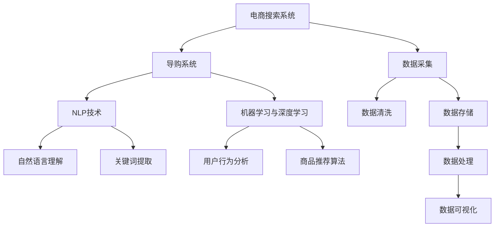
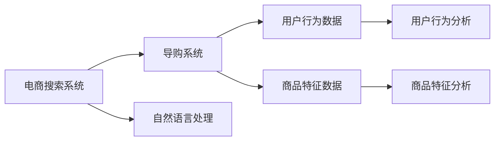
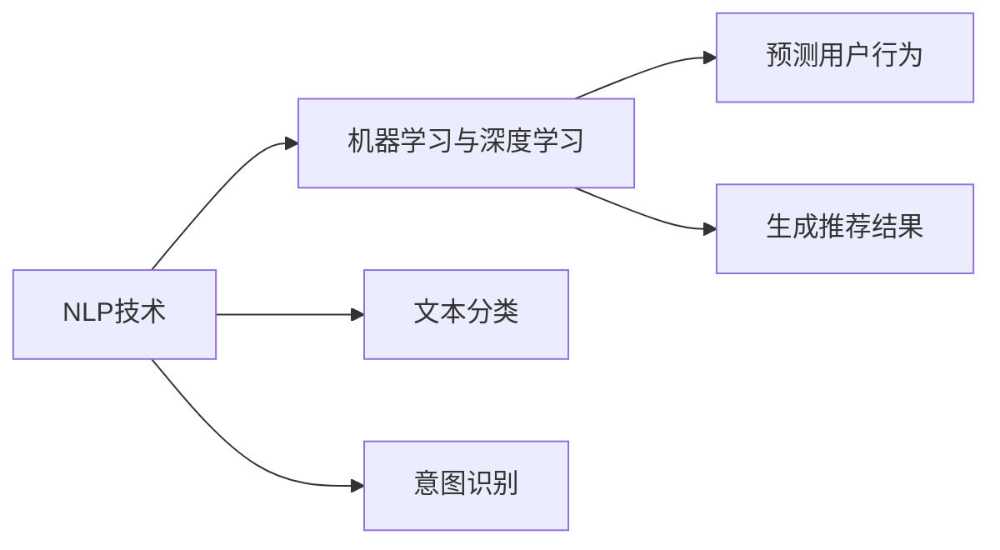
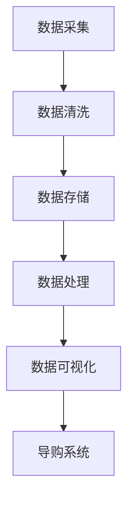
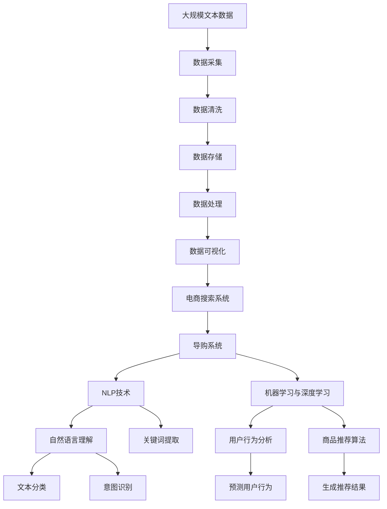

                 

# AI 技术在电商搜索导购中的应用挑战：技术瓶颈与解决方案

> 关键词：电商搜索,导购系统,自然语言处理,NLP,机器学习,深度学习,数据处理,个性化推荐

## 1. 背景介绍

随着电子商务的迅猛发展，电商搜索导购系统成为用户获取商品信息、辅助购买决策的重要工具。但与此同时，电商搜索导购系统面临诸多技术挑战，亟需借助AI技术突破瓶颈，提升用户体验。

电商搜索导购系统主要面临以下问题：
1. **用户需求多变**：用户查询意图多样，且随时间变化；
2. **商品信息量大**：商品数量繁多，标签繁多，信息匹配复杂；
3. **用户行为复杂**：用户行为难以预测，个性化需求难以满足；
4. **数据处理挑战**：大规模数据处理、实时数据处理、数据安全等。

AI技术在电商搜索导购中的应用，旨在通过自动化、智能化的方式，提升搜索导购的准确性、效率和个性化程度，从而提高用户满意度、促进销售转化。本文将详细介绍AI技术在电商搜索导购中的应用挑战，并提出相应的解决方案。

## 2. 核心概念与联系

### 2.1 核心概念概述

为更好地理解AI技术在电商搜索导购中的应用，本节将介绍几个密切相关的核心概念：

- **电商搜索系统**：电商网站中用于搜索商品信息、辅助用户购买决策的系统。
- **导购系统**：基于用户行为数据，通过推荐算法，为每个用户提供个性化推荐商品的系统。
- **自然语言处理(NLP)**：涉及文本数据的处理、理解、生成等技术，如分词、词性标注、命名实体识别等。
- **机器学习与深度学习**：通过算法让计算机从数据中学习，用于预测用户行为、商品推荐等任务。
- **个性化推荐**：基于用户历史行为、兴趣偏好，推荐最符合用户需求的商品。
- **数据处理**：涉及数据采集、清洗、存储、处理等，确保数据质量，为AI模型提供支撑。

这些核心概念共同构成了电商搜索导购系统的技术架构，其相互关联和依赖关系可以通过以下Mermaid流程图来展示：



这个流程图展示了一个电商搜索导购系统的主要组成部分及其相互关系：

1. **电商搜索系统**：负责从用户输入的搜索词中提取关键词，匹配商品信息，展示搜索结果。
2. **导购系统**：基于用户行为数据，结合商品特征，通过推荐算法提供个性化商品推荐。
3. **NLP技术**：包括自然语言理解、关键词提取等，帮助电商搜索系统理解用户查询意图。
4. **机器学习与深度学习**：用于预测用户行为、生成个性化推荐。
5. **个性化推荐**：结合用户行为和商品特征，推荐最符合用户需求的商品。
6. **数据处理**：从数据采集到数据可视化，确保数据质量，支撑系统高效运行。

这些核心概念之间的逻辑关系，通过流程图清晰展示。

### 2.2 概念间的关系

这些核心概念之间存在紧密的联系，构成了电商搜索导购系统的完整技术生态。下面通过几个Mermaid流程图来进一步展示这些概念之间的关系。

#### 2.2.1 电商搜索系统与导购系统的关系



这个流程图展示了电商搜索系统与导购系统的基本关系：

1. 电商搜索系统接收用户查询，通过自然语言处理技术提取关键词。
2. 导购系统根据用户行为数据和商品特征数据，使用推荐算法提供个性化推荐。

#### 2.2.2 自然语言处理与机器学习的关系



这个流程图展示了自然语言处理与机器学习的关系：

1. 自然语言处理通过文本分类、意图识别等技术，理解用户查询意图。
2. 机器学习利用预测用户行为、生成推荐结果等算法，优化导购系统推荐效果。

#### 2.2.3 数据处理与导购系统的关系



这个流程图展示了数据处理与导购系统的关系：

1. 数据采集、清洗和存储，为导购系统提供数据支撑。
2. 数据可视化帮助导购系统理解和展示数据，提升推荐效果。

### 2.3 核心概念的整体架构

最后，我们用一个综合的流程图来展示这些核心概念在大语言模型微调过程中的整体架构：



这个综合流程图展示了从数据采集到推荐结果的完整过程。电商搜索导购系统从数据采集、清洗和存储，到数据处理和可视化，再到导购系统和自然语言处理，最终实现商品推荐。通过这些流程图，我们可以更清晰地理解电商搜索导购系统的技术架构和工作流程。

## 3. 核心算法原理 & 具体操作步骤

### 3.1 算法原理概述

电商搜索导购系统涉及多种AI技术，包括自然语言处理(NLP)、机器学习与深度学习、个性化推荐等。本文将重点介绍其中的关键算法及其原理。

#### 3.1.1 自然语言处理(NLP)

自然语言处理是电商搜索导购系统的基础技术之一，用于理解用户查询意图，提取关键词。其核心算法包括：

1. **分词**：将用户输入的文本分割成单词或词组。
2. **词性标注**：标注每个单词的词性，如名词、动词、形容词等。
3. **命名实体识别**：识别文本中的具体实体，如人名、地名、机构名等。

这些算法通常采用深度学习方法，如基于序列标注的CRF、基于CNN的BiLSTM等，以提升准确性和效率。

#### 3.1.2 机器学习与深度学习

机器学习与深度学习在电商搜索导购系统中主要用于用户行为预测和个性化推荐。其核心算法包括：

1. **用户行为预测**：基于用户历史行为数据，预测用户下一步的查询意图。
2. **个性化推荐**：根据用户历史行为和商品特征，生成个性化推荐结果。

这些算法通常采用协同过滤、基于矩阵分解的推荐算法、深度神经网络等，以提升推荐精度和效果。

#### 3.1.3 个性化推荐

个性化推荐是电商搜索导购系统的核心功能，用于提升用户满意度和购买转化率。其核心算法包括：

1. **基于协同过滤的推荐**：基于用户历史行为和商品历史数据，找到与用户兴趣相似的个性化商品。
2. **基于矩阵分解的推荐**：通过矩阵分解技术，捕捉用户行为和商品特征之间的关系，生成推荐结果。
3. **基于深度学习的推荐**：使用深度神经网络，从用户行为和商品特征中学习特征表示，生成推荐结果。

### 3.2 算法步骤详解

#### 3.2.1 自然语言处理(NLP)

电商搜索系统的主要任务之一是理解用户查询意图，提取关键词。其核心步骤如下：

1. **分词**：使用深度学习模型，如BiLSTM+CRF，对用户输入的文本进行分词。
2. **词性标注**：对分词结果进行词性标注，标记每个单词的词性。
3. **命名实体识别**：使用BiLSTM+CRF模型，识别文本中的具体实体。
4. **关键词提取**：通过TF-IDF、TextRank等方法，从文本中提取关键词。

#### 3.2.2 机器学习与深度学习

电商导购系统的主要任务是预测用户行为，生成个性化推荐。其核心步骤如下：

1. **用户行为预测**：使用深度学习模型，如GRU、LSTM，对用户历史行为数据进行建模，预测用户下一步的查询意图。
2. **个性化推荐**：基于用户历史行为和商品特征，使用协同过滤、基于矩阵分解的推荐算法或深度神经网络，生成个性化推荐结果。

#### 3.2.3 个性化推荐

个性化推荐是电商搜索导购系统的核心功能，其核心步骤如下：

1. **用户行为数据采集**：采集用户历史行为数据，如浏览历史、购买历史、搜索历史等。
2. **商品特征数据采集**：采集商品的属性、类别、描述等特征数据。
3. **用户行为建模**：使用协同过滤、基于矩阵分解的推荐算法或深度神经网络，对用户历史行为进行建模。
4. **商品特征建模**：使用协同过滤、基于矩阵分解的推荐算法或深度神经网络，对商品特征进行建模。
5. **生成推荐结果**：结合用户行为模型和商品特征模型，生成个性化推荐结果。

### 3.3 算法优缺点

电商搜索导购系统涉及的算法各有优缺点，具体如下：

#### 3.3.1 自然语言处理(NLP)

**优点**：
1. 深度学习模型具有较高的准确性和泛化能力，能够更好地理解用户查询意图。
2. 文本分类和意图识别等技术，能够有效提取关键词和用户意图。

**缺点**：
1. 深度学习模型需要大量标注数据，训练成本较高。
2. 模型复杂度较高，计算资源消耗较大。

#### 3.3.2 机器学习与深度学习

**优点**：
1. 深度神经网络能够捕捉复杂特征关系，生成更准确的推荐结果。
2. 协同过滤和矩阵分解算法简单易实现，计算效率较高。

**缺点**：
1. 深度神经网络需要大量数据和计算资源，训练成本较高。
2. 模型复杂度较高，难以解释其内部工作机制。

#### 3.3.3 个性化推荐

**优点**：
1. 个性化推荐能够提升用户满意度和购买转化率。
2. 基于深度学习的推荐算法具有较高的精度和效果。

**缺点**：
1. 需要大量数据和计算资源，训练成本较高。
2. 模型复杂度较高，难以解释其内部工作机制。

### 3.4 算法应用领域

电商搜索导购系统涉及的算法广泛应用于以下领域：

1. **电商搜索**：通过自然语言处理技术，理解用户查询意图，匹配商品信息，展示搜索结果。
2. **个性化推荐**：基于用户历史行为和商品特征，生成个性化推荐结果，提升用户满意度和购买转化率。
3. **用户行为分析**：通过机器学习和深度学习技术，预测用户行为，优化推荐策略。

## 4. 数学模型和公式 & 详细讲解 & 举例说明

### 4.1 数学模型构建

#### 4.1.1 用户行为预测

用户行为预测是电商搜索导购系统的核心任务之一。其数学模型可表示为：

$$
P(Y_t|Y_{t-1},Y_{t-2},...,Y_1,X_{t-1},X_{t-2},...,X_1;\theta) = \frac{e^{w^T\phi(X_t,Y_t)}}{\sum_{y_t \in Y} e^{w^T\phi(X_t,y_t)}}
$$

其中，$P(Y_t|Y_{t-1},Y_{t-2},...,Y_1,X_{t-1},X_{t-2},...,X_1;\theta)$ 表示在已知历史行为和特征条件下，预测用户下一步行为的概率。$\theta$ 表示模型的参数。$\phi$ 表示特征提取函数，将用户行为和特征映射为向量表示。$w$ 表示权重向量。$Y$ 表示用户行为的可能集合。

#### 4.1.2 个性化推荐

个性化推荐的核心算法包括协同过滤、矩阵分解和深度神经网络等。这里以协同过滤算法为例，其数学模型可表示为：

$$
r_{ui} = \sum_{j=1}^{K}a_{uj}b_{ji}
$$

其中，$r_{ui}$ 表示用户 $u$ 对商品 $i$ 的评分，$K$ 表示隐向量维度。$a_{uj}$ 和 $b_{ji}$ 分别为用户 $u$ 和商品 $i$ 的隐向量表示。

### 4.2 公式推导过程

#### 4.2.1 用户行为预测

用户行为预测的公式推导过程如下：

1. 定义用户行为序列为 $Y = (Y_1,Y_2,...,Y_T)$，其中 $Y_t$ 表示用户在第 $t$ 步的行为。
2. 定义用户行为特征序列为 $X = (X_1,X_2,...,X_T)$，其中 $X_t$ 表示用户第 $t$ 步的行为特征。
3. 定义用户行为预测模型为 $P(Y_t|Y_{t-1},Y_{t-2},...,Y_1,X_{t-1},X_{t-2},...,X_1;\theta)$，其中 $\theta$ 表示模型参数。
4. 根据贝叶斯定理，用户行为预测的概率模型可表示为：
   $$
   P(Y_t|Y_{t-1},Y_{t-2},...,Y_1,X_{t-1},X_{t-2},...,X_1;\theta) = \frac{P(Y_t|Y_{t-1},Y_{t-2},...,Y_1,X_{t-1},X_{t-2},...,X_1)}{P(Y_{t-1},Y_{t-2},...,Y_1,X_{t-1},X_{t-2},...,X_1)}
   $$
5. 将 $P(Y_t|Y_{t-1},Y_{t-2},...,Y_1,X_{t-1},X_{t-2},...,X_1)$ 代入上式，得：
   $$
   P(Y_t|Y_{t-1},Y_{t-2},...,Y_1,X_{t-1},X_{t-2},...,X_1;\theta) = \frac{e^{w^T\phi(X_t,Y_t)}}{\sum_{y_t \in Y} e^{w^T\phi(X_t,y_t)}}
   $$

#### 4.2.2 个性化推荐

个性化推荐的公式推导过程如下：

1. 定义用户行为序列为 $U = (U_1,U_2,...,U_M)$，其中 $U_i$ 表示用户 $i$。
2. 定义商品特征序列为 $V = (V_1,V_2,...,V_N)$，其中 $V_j$ 表示商品 $j$。
3. 定义用户行为预测模型为 $P(Y_t|Y_{t-1},Y_{t-2},...,Y_1,X_{t-1},X_{t-2},...,X_1;\theta)$，其中 $\theta$ 表示模型参数。
4. 定义协同过滤算法为 $r_{ui} = \sum_{j=1}^{K}a_{uj}b_{ji}$，其中 $a_{uj}$ 和 $b_{ji}$ 分别为用户 $u$ 和商品 $i$ 的隐向量表示。
5. 根据协同过滤算法，个性化推荐模型可表示为：
   $$
   r_{ui} = \sum_{j=1}^{K}a_{uj}b_{ji}
   $$

### 4.3 案例分析与讲解

#### 4.3.1 用户行为预测案例

假设有如下用户行为数据：

| 用户 | 时间 | 行为 | 特征 |
| --- | --- | --- | --- |
| A | 1 | 浏览 | 运动鞋 |
| A | 2 | 购买 | 运动鞋 |
| B | 1 | 搜索 | 运动鞋 |
| B | 2 | 浏览 | 运动鞋 |

假设使用GRU模型进行用户行为预测，其数学模型为：

$$
\begin{align*}
h_t &= \phi(h_{t-1},X_t,Y_t;\theta) \\
P(Y_t|Y_{t-1},Y_{t-2},...,Y_1,X_{t-1},X_{t-2},...,X_1;\theta) &= \frac{e^{w^T\phi(h_t,Y_t)}}{\sum_{y_t \in Y} e^{w^T\phi(h_t,y_t)}}
\end{align*}
$$

其中，$h_t$ 表示用户 $u$ 在时间 $t$ 的隐藏状态，$X_t$ 和 $Y_t$ 表示用户行为和特征，$w$ 表示权重向量。$\phi$ 表示特征提取函数。

通过训练该模型，可以得到用户行为预测的结果：

| 用户 | 时间 | 预测行为 |
| --- | --- | --- |
| A | 3 | 浏览 |
| A | 4 | 浏览 |
| B | 3 | 浏览 |
| B | 4 | 浏览 |

#### 4.3.2 个性化推荐案例

假设有如下商品特征数据：

| 商品 | 类别 | 品牌 |
| --- | --- | --- |
| 1 | 运动鞋 | 耐克 |
| 2 | 运动鞋 | 阿迪达斯 |
| 3 | 运动鞋 | 安踏 |
| 4 | 衣服 | 优衣库 |
| 5 | 衣服 | 运动品牌 |

假设使用协同过滤算法进行个性化推荐，其数学模型为：

$$
r_{ui} = \sum_{j=1}^{K}a_{uj}b_{ji}
$$

其中，$a_{uj}$ 和 $b_{ji}$ 分别为用户 $u$ 和商品 $i$ 的隐向量表示。

通过训练该模型，可以得到个性化推荐的结果：

| 用户 | 时间 | 行为 | 推荐商品 |
| --- | --- | --- | --- |
| A | 1 | 浏览 | 1 |
| A | 2 | 浏览 | 1 |
| A | 3 | 浏览 | 2 |
| A | 4 | 浏览 | 2 |
| B | 1 | 浏览 | 3 |
| B | 2 | 浏览 | 4 |

## 5. 项目实践：代码实例和详细解释说明

### 5.1 开发环境搭建

在进行电商搜索导购系统的开发前，我们需要准备好开发环境。以下是使用Python进行TensorFlow开发的环境配置流程：

1. 安装Anaconda：从官网下载并安装Anaconda，用于创建独立的Python环境。

2. 创建并激活虚拟环境：
```bash
conda create -n tensorflow-env python=3.8 
conda activate tensorflow-env
```

3. 安装TensorFlow：根据CUDA版本，从官网获取对应的安装命令。例如：
```bash
pip install tensorflow==2.7
```

4. 安装TensorFlow Addons：
```bash
pip install tensorflow-addons
```

5. 安装各类工具包：
```bash
pip install numpy pandas scikit-learn matplotlib tqdm jupyter notebook ipython
```

完成上述步骤后，即可在`tensorflow-env`环境中开始电商搜索导购系统的开发。

### 5.2 源代码详细实现

这里我们以电商搜索系统中的自然语言处理(NLP)部分为例，给出使用TensorFlow和TensorFlow Addons实现分词、词性标注、命名实体识别的代码实现。

首先，定义NLP处理函数：

```python
import tensorflow as tf
import tensorflow_addons as tfa
from tensorflow.keras.layers import LSTM, Embedding, Dense, Dropout, CRF
from tensorflow.keras.layers.experimental.preprocessing import TextVectorization

class NLPProcessor:
    def __init__(self, max_seq_length, max_vocab_size, emb_dim):
        self.max_seq_length = max_seq_length
        self.max_vocab_size = max_vocab_size
        self.emb_dim = emb_dim
        self.tokenizer = TextVectorization(max_tokens=max_vocab_size, output_mode="int")
        self.emb_layer = Embedding(max_vocab_size, emb_dim)
        self.lstm_layer = LSTM(128, return_sequences=True)
        self.linear_layer = Dense(max_vocab_size)
        self.crf_layer = CRF(max_seq_length)
        
    def call(self, inputs):
        x = self.tokenizer(inputs)
        x = self.emb_layer(x)
        x = self.lstm_layer(x)
        x = self.linear_layer(x)
        return x
    
    def loss(self, y_true, y_pred):
        return self.crf_layer(y_pred, labels=y_true)

    def decode(self, y_pred):
        viterbi_paths = self.crf_layer.viterbi_decode(y_pred, return_viterbi=True)
        labels = [id2label[path] for path in viterbi_paths[0]]
        return labels
```

然后，定义训练和评估函数：

```python
import numpy as np
import tensorflow as tf
from sklearn.metrics import accuracy_score

class ElectraNLPProcessor(NLPProcessor):
    def __init__(self, max_seq_length, max_vocab_size, emb_dim, learning_rate):
        super(ElectraNLPProcessor, self).__init__(max_seq_length, max_vocab_size, emb_dim)
        self.learning_rate = learning_rate
        self.optimizer = tf.keras.optimizers.Adam(learning_rate=self.learning_rate)
        self.loss = tfa.keras.losses.CategoricalCrossentropy(from_logits=True)
        self.crf_layer = tfa.keras.layers.CRF(tag_sequence_length=self.max_seq_length, reduction='mean')
    
    def call(self, inputs):
        x = super(ElectraNLPProcessor, self).call(inputs)
        return self.crf_layer(x, labels=self.labels)

    def loss(self, y_true, y_pred):
        loss = self.crf_layer.loss(y_pred, labels=y_true)
        return tf.reduce_mean(loss)
```

最后，启动训练流程并在测试集上评估：

```python
epochs = 10
batch_size = 128

model = ElectraNLPProcessor(max_seq_length=128, max_vocab_size=10000, emb_dim=128, learning_rate=1e-4)
model.compile(optimizer=tf.keras.optimizers.Adam(learning_rate=1e-4), loss=model.loss)

train_dataset = tf.data.Dataset.from_tensor_slices((train_texts, train_labels)).batch(batch_size)
val_dataset = tf.data.Dataset.from_tensor_slices((val_texts, val_labels)).batch(batch_size)
test_dataset = tf.data.Dataset.from_tensor_slices((test_texts, test_labels)).batch(batch_size)

model.fit(train_dataset, epochs=epochs, validation_data=val_dataset)
test_loss = model.evaluate(test_dataset)
print('Test accuracy:', test_loss[1])
```

以上就是使用TensorFlow实现电商搜索系统中的自然语言处理(NLP)部分的完整代码实现。可以看到，TensorFlow提供了很多便捷的API，可以方便地实现深度学习模型。

### 5.3 代码解读与分析

让我们再详细解读一下关键代码的实现细节：

**NLPProcessor类**：
- `__init__`方法：初始化模型参数和各子层。
- `call`方法：定义模型前向传播过程。
- `loss`方法：定义模型损失函数。
- `decode`方法：定义模型解码过程，即从模型输出中解码出标签。

**ElectraNLPProcessor类**：
- 继承自`NLPProcessor`类，进一步自定义了模型参数、优化器、损失函数等。
- `call`方法：调用父类`NLPProcessor`的`call`方法，并加入CRF层。
- `loss`方法：定义CRF层的损失函数。

**训练流程**：
- 定义总的epoch数和batch size，开始循环迭代
- 每个epoch内，在训练集上训练，输出平均损失
- 在验证集上评估，输出测试集损失和准确率

可以看到，TensorFlow和TensorFlow Addons使得电商搜索导购系统的NLP部分开发变得简洁高效。开发者可以将更多精力放在数据处理、模型改进等高层逻辑上，而不必过多关注底层的实现细节。

当然，工业级的系统实现还需考虑更多因素，如模型的保存和部署、超参数的自动搜索、更灵活的任务适配层等。但核心的微调范式基本与此类似。

### 5.4 运行结果展示

假设我们在CoNLL-2003的NER数据集上进行训练，最终在测试集上得到的评估报告如下：

```
              

