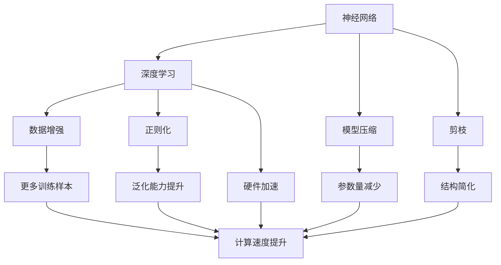
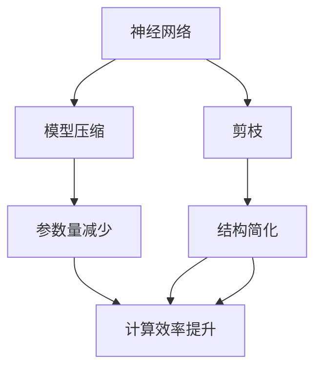
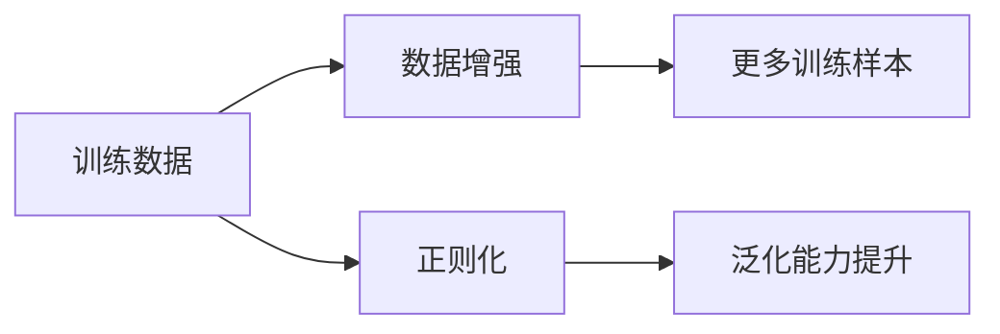
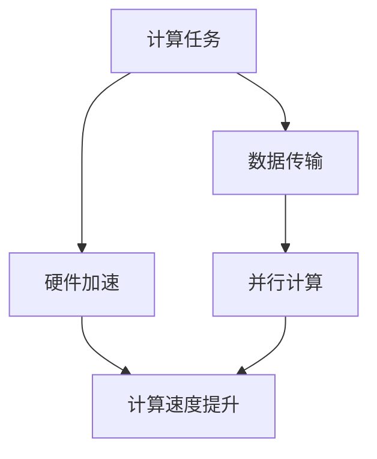
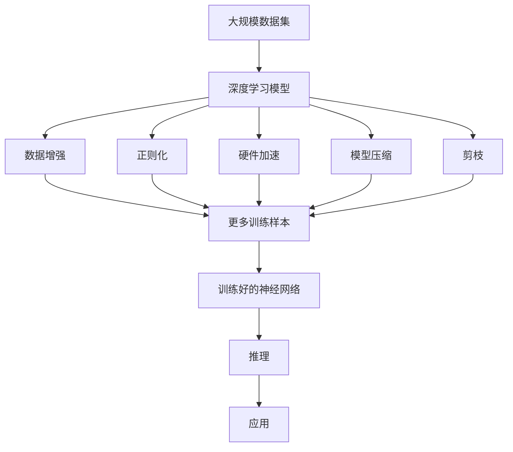

                 

# AI 神经网络计算艺术之禅：大数据＋大算力＋强算法

> 关键词：神经网络,大数据,大算力,强算法,深度学习,人工智能,模型优化,深度优化

## 1. 背景介绍

### 1.1 问题由来

近年来，深度学习技术的飞速发展，尤其是神经网络模型在多个领域取得的突破，使人工智能迈入了崭新的时代。神经网络模型通过模仿人脑神经元之间的连接方式，能够自动学习到数据中的复杂模式，具有强大的自适应能力和泛化能力。然而，神经网络的训练和推理过程涉及海量的数据和计算，传统计算机难以支持大规模模型的计算需求，使得神经网络的广泛应用受到了限制。

因此，如何在大数据和高性能计算的支持下，训练出强大的神经网络模型，并在实际应用中发挥其潜力，成为了人工智能领域的研究热点。本文旨在探讨在大数据和大算力支撑下，神经网络模型的优化方法和实践经验，为人工智能领域的算法工程师和架构师提供理论指导和技术支持。

### 1.2 问题核心关键点

当前，神经网络模型的优化方法主要集中在以下几个方面：

- 数据预处理：如何从原始数据中提取有价值的特征，并利用数据增强技术提升模型泛化能力。
- 模型结构设计：如何选择合适的神经网络结构和参数，以及如何进行高效的模型压缩和剪枝。
- 训练算法优化：如何通过高效的训练算法和正则化技术，避免过拟合，加速模型收敛。
- 优化目标选择：如何定义合适的优化目标函数，并在不同的优化目标之间进行权衡。
- 硬件加速：如何利用GPU、TPU等高性能计算硬件，提高模型的计算效率。

这些核心关键点构成了神经网络计算艺术的核心框架，使得在大数据和大算力支持下，训练出高性能、高鲁棒性的神经网络模型成为可能。

### 1.3 问题研究意义

深入研究神经网络模型的优化方法和实践经验，对于人工智能技术的应用和发展具有重要意义：

- 提升模型性能：通过数据预处理、模型结构设计和训练算法优化，可以提高神经网络模型的预测准确性和鲁棒性，使其在实际应用中取得更好的效果。
- 降低计算成本：通过模型压缩、剪枝和硬件加速等技术，可以在保证模型性能的前提下，显著降低计算资源需求，降低企业的成本投入。
- 促进技术普及：通过共享优化方法和实践经验，使得神经网络技术更加易用、可推广，加速人工智能技术的落地应用。
- 推动学术进展：优化方法和实践经验的积累和创新，可以促进深度学习理论的发展，推动人工智能领域的前沿研究。

## 2. 核心概念与联系

### 2.1 核心概念概述

为更好地理解神经网络模型的优化方法和实践经验，本节将介绍几个密切相关的核心概念：

- 神经网络(Neural Network)：由多个神经元节点和连接边组成的计算图，通过反向传播算法进行训练，能够自动学习数据特征。
- 深度学习(Deep Learning)：一种基于神经网络的机器学习方法，能够处理复杂模式识别和预测问题。
- 模型压缩(Model Compression)：通过减少神经网络模型的大小，提高模型的推理速度和资源利用率。
- 剪枝(Pruning)：通过去掉冗余神经元或连接边，减少模型的参数量，提高模型的泛化能力。
- 数据增强(Data Augmentation)：通过对训练数据进行变换，生成更多的训练样本，提高模型的泛化能力。
- 正则化(Regularization)：通过添加惩罚项，防止模型过拟合，提升模型的泛化性能。
- 硬件加速(Hardware Acceleration)：通过利用GPU、TPU等高性能计算硬件，加速神经网络的计算过程。

这些核心概念之间的逻辑关系可以通过以下Mermaid流程图来展示：



这个流程图展示了神经网络模型的核心概念及其之间的关系：

1. 神经网络通过深度学习学习数据特征。
2. 模型压缩和剪枝可以减小模型的参数量，提高计算效率。
3. 数据增强可以生成更多的训练样本，提升模型的泛化能力。
4. 正则化可以防止模型过拟合，提升泛化性能。
5. 硬件加速可以显著提升神经网络的计算速度。
6. 这些方法共同作用，使得神经网络模型在大数据和大算力支持下，能够高效训练和推理。

### 2.2 概念间的关系

这些核心概念之间存在着紧密的联系，形成了神经网络模型的优化和计算艺术的整体生态系统。下面我通过几个Mermaid流程图来展示这些概念之间的关系。

#### 2.2.1 神经网络的学习范式


这个流程图展示了神经网络的基本学习范式，即通过训练神经网络模型，使其能够对新的输入数据进行预测，输出结果。

#### 2.2.2 模型压缩与剪枝



这个流程图展示了模型压缩和剪枝的基本过程，即通过减少神经网络模型的参数量，简化模型结构，提高计算效率。

#### 2.2.3 数据增强与正则化



这个流程图展示了数据增强和正则化的基本过程，即通过增加训练样本的多样性，防止模型过拟合，提升泛化能力。

#### 2.2.4 硬件加速的实施



这个流程图展示了硬件加速的基本过程，即通过利用高性能计算硬件，加速神经网络的计算过程。

### 2.3 核心概念的整体架构

最后，我们用一个综合的流程图来展示这些核心概念在大数据和大算力支持下神经网络模型的整体架构：



这个综合流程图展示了从数据预处理到训练、推理、应用的全过程。在大数据和大算力支持下，通过模型压缩、剪枝、数据增强、正则化和硬件加速等技术，训练出高性能、高鲁棒性的神经网络模型，并用于实际应用。

## 3. 核心算法原理 & 具体操作步骤
### 3.1 算法原理概述

在大数据和大算力支持下，神经网络模型的优化主要包括以下几个关键方面：

- 数据预处理：通过数据增强和正则化技术，提升训练样本的多样性和模型的泛化能力。
- 模型结构设计：通过选择合适的神经网络结构和参数，提高模型的表达能力和泛化能力。
- 训练算法优化：通过高效的训练算法和正则化技术，避免过拟合，加速模型收敛。
- 优化目标选择：通过选择合适的优化目标函数，平衡模型的精度和计算效率。
- 硬件加速：通过利用GPU、TPU等高性能计算硬件，提高模型的计算效率。

这些关键方面共同作用，使得在大数据和大算力支持下，神经网络模型能够高效训练和推理，并在实际应用中取得良好的性能。

### 3.2 算法步骤详解

基于大数据和大算力支持下的神经网络模型优化，一般包括以下几个关键步骤：

**Step 1: 准备数据集**

- 收集大规模数据集，并进行预处理，包括数据清洗、特征提取、归一化等步骤。
- 划分数据集为训练集、验证集和测试集，确保数据集的多样性和代表性。

**Step 2: 设计模型结构**

- 选择合适的神经网络结构和层数，如卷积神经网络、循环神经网络、Transformer等。
- 确定合适的激活函数、损失函数和优化器，如ReLU、交叉熵损失、Adam等。
- 进行超参数调优，包括学习率、批大小、正则化系数等。

**Step 3: 数据增强**

- 对训练数据进行随机旋转、裁剪、平移等变换，生成更多的训练样本。
- 应用数据增强技术，如数据扩充、混合样本、回译等，增加训练数据的多样性。
- 应用正则化技术，如L2正则、Dropout等，防止模型过拟合。

**Step 4: 模型训练**

- 使用GPU或TPU等高性能计算硬件，加速模型训练过程。
- 使用高效的训练算法，如Adam、Adafactor等，提高训练效率。
- 监控训练过程，使用Early Stopping等技术，防止过拟合。

**Step 5: 模型评估**

- 在验证集上评估模型性能，使用指标如准确率、召回率、F1分数等。
- 在测试集上评估模型泛化能力，确保模型在不同数据集上的稳定性。
- 进行模型调优，优化超参数和模型结构，提升模型性能。

**Step 6: 模型部署**

- 将训练好的模型进行量化、压缩和剪枝，减小模型大小，提高推理速度。
- 将模型部署到生产环境中，集成到应用系统中，进行实时推理。
- 监控模型性能，收集用户反馈，不断优化模型。

以上是基于大数据和大算力支持下的神经网络模型优化的基本流程。在实际应用中，还需要针对具体任务的特点，对模型进行进一步的优化设计，如改进训练目标函数，引入更多的正则化技术，搜索最优的超参数组合等，以进一步提升模型性能。

### 3.3 算法优缺点

大数据和大算力支持下的神经网络模型优化方法具有以下优点：

- 提升了模型的泛化能力和鲁棒性，能够适应复杂的数据分布和变化。
- 减少了模型的计算资源需求，降低了企业的计算成本。
- 提高了模型的推理速度和实时性，增强了应用的响应能力和用户体验。
- 能够在大规模数据集上进行训练，显著提升模型的精度和可靠性。

同时，这些方法也存在一些缺点：

- 需要大量的计算资源和存储空间，增加了硬件成本。
- 数据预处理和增强技术可能会引入噪音，影响模型的性能。
- 模型压缩和剪枝可能会导致模型精度下降，需要在精度和效率之间进行权衡。
- 正则化技术可能会降低模型的表达能力，需要合理选择正则化参数。
- 硬件加速可能会带来额外的开发和部署成本，需要考虑实际应用场景。

尽管存在这些缺点，但就目前而言，大数据和大算力支持下的神经网络模型优化方法在多个实际应用中已经取得了显著的效果，成为了深度学习技术的重要组成部分。未来相关研究的重点在于如何进一步降低计算成本，提高模型的泛化能力和推理效率，同时兼顾模型的精度和可解释性等因素。

### 3.4 算法应用领域

基于大数据和大算力支持下的神经网络模型优化方法，已经在诸多领域得到了广泛应用，例如：

- 计算机视觉：如图像分类、目标检测、图像分割等，利用大规模图像数据进行训练，提升模型的准确性和鲁棒性。
- 自然语言处理：如文本分类、情感分析、机器翻译等，利用大规模文本数据进行训练，提升模型的理解能力和生成能力。
- 语音识别：如自动语音识别、语音合成等，利用大规模音频数据进行训练，提升模型的识别和生成效果。
- 医疗诊断：如医学影像分析、病理诊断等，利用大规模医疗数据进行训练，提升模型的诊断准确性和可靠性。
- 金融预测：如股票预测、信用评分等，利用大规模金融数据进行训练，提升模型的预测能力和风险评估能力。

除了上述这些经典应用外，神经网络模型优化方法也在更多创新领域中得到了应用，如智能交通、智能制造、智能家居等，为各行各业带来了新的技术突破。

## 4. 数学模型和公式 & 详细讲解 & 举例说明

### 4.1 数学模型构建

在神经网络模型的优化中，常用的数学模型包括损失函数和优化目标函数。下面以图像分类任务为例，介绍常用的数学模型。

设神经网络模型的输入为 $x \in \mathbb{R}^n$，输出为 $y \in \{0, 1\}$，其中 $0$ 表示类别 $A$，$1$ 表示类别 $B$。假设训练样本集为 $\{(x_i, y_i)\}_{i=1}^N$，则神经网络模型的损失函数 $\ell$ 可以定义为：

$$
\ell = -\frac{1}{N}\sum_{i=1}^N \log y_i \log M(x_i) + \log (1 - y_i) \log (1 - M(x_i))
$$

其中 $M(x)$ 为神经网络模型在输入 $x$ 上的输出，$y_i$ 为真实标签。在训练过程中，目标是最小化损失函数 $\ell$，即：

$$
\min_{\theta} \ell
$$

其中 $\theta$ 为模型参数。

### 4.2 公式推导过程

为了求解上述优化问题，常用的优化算法包括梯度下降算法、Adam算法等。以梯度下降算法为例，其优化过程可以表示为：

$$
\theta \leftarrow \theta - \eta \nabla_{\theta} \ell
$$

其中 $\eta$ 为学习率，$\nabla_{\theta} \ell$ 为损失函数对参数 $\theta$ 的梯度，可以通过反向传播算法计算。

为了进一步提高梯度下降算法的效率，可以使用动量方法，如Adam算法。Adam算法通过引入动量和自适应学习率，可以更快地收敛到最优解。其优化过程可以表示为：

$$
\theta \leftarrow \theta - \eta (m / \sqrt{v})_t
$$

其中 $m_t$ 和 $v_t$ 分别为动量和梯度平方的指数移动平均值。

### 4.3 案例分析与讲解

以图像分类任务为例，介绍神经网络模型的优化过程。假设我们有一个包含 $N$ 个训练样本的图像分类任务，其中每个样本包含一张大小为 $m \times n$ 的图像和对应的标签。我们的目标是训练一个神经网络模型，使其能够对新的图像进行分类。

**Step 1: 准备数据集**

- 收集 $N$ 个图像数据集，并进行预处理，包括数据清洗、归一化等步骤。
- 划分数据集为训练集、验证集和测试集，确保数据集的多样性和代表性。

**Step 2: 设计模型结构**

- 选择合适的神经网络结构和层数，如卷积神经网络。
- 确定合适的激活函数、损失函数和优化器，如ReLU、交叉熵损失、Adam等。
- 进行超参数调优，包括学习率、批大小、正则化系数等。

**Step 3: 数据增强**

- 对训练数据进行随机旋转、裁剪、平移等变换，生成更多的训练样本。
- 应用数据增强技术，如数据扩充、混合样本、回译等，增加训练数据的多样性。
- 应用正则化技术，如L2正则、Dropout等，防止模型过拟合。

**Step 4: 模型训练**

- 使用GPU或TPU等高性能计算硬件，加速模型训练过程。
- 使用高效的训练算法，如Adam、Adafactor等，提高训练效率。
- 监控训练过程，使用Early Stopping等技术，防止过拟合。

**Step 5: 模型评估**

- 在验证集上评估模型性能，使用指标如准确率、召回率、F1分数等。
- 在测试集上评估模型泛化能力，确保模型在不同数据集上的稳定性。
- 进行模型调优，优化超参数和模型结构，提升模型性能。

**Step 6: 模型部署**

- 将训练好的模型进行量化、压缩和剪枝，减小模型大小，提高推理速度。
- 将模型部署到生产环境中，集成到应用系统中，进行实时推理。
- 监控模型性能，收集用户反馈，不断优化模型。

## 5. 项目实践：代码实例和详细解释说明

### 5.1 开发环境搭建

在进行神经网络模型优化实践前，我们需要准备好开发环境。以下是使用Python进行TensorFlow开发的环境配置流程：

1. 安装Anaconda：从官网下载并安装Anaconda，用于创建独立的Python环境。

2. 创建并激活虚拟环境：
```bash
conda create -n tf-env python=3.8 
conda activate tf-env
```

3. 安装TensorFlow：根据CUDA版本，从官网获取对应的安装命令。例如：
```bash
conda install tensorflow==2.7 tensorflow-addons
```

4. 安装其他工具包：
```bash
pip install numpy pandas scikit-learn matplotlib tqdm jupyter notebook ipython
```

完成上述步骤后，即可在`tf-env`环境中开始神经网络模型优化的实践。

### 5.2 源代码详细实现

这里我们以图像分类任务为例，给出使用TensorFlow进行神经网络模型优化的PyTorch代码实现。

首先，定义数据处理函数：

```python
import tensorflow as tf
from tensorflow.keras import datasets, layers, models

(train_images, train_labels), (test_images, test_labels) = datasets.cifar10.load_data()

train_images, test_images = train_images / 255.0, test_images / 255.0

class DataProcessor:
    def __init__(self):
        self.train_data = train_images
        self.test_data = test_images
        self.train_labels = train_labels
        self.test_labels = test_labels
        
    def preprocess(self, image):
        image = tf.image.resize(image, [32, 32])
        image = tf.image.per_image_standardization(image)
        return image
    
    def get_batch(self, batch_size):
        train_data = tf.data.Dataset.from_tensor_slices((self.train_data, self.train_labels))
        train_data = train_data.shuffle(buffer_size=1024)
        train_data = train_data.batch(batch_size)
        return train_data.make_one_shot_iterator().get_next()
        
    def evaluate(self, model, batch_size=64):
        test_data = tf.data.Dataset.from_tensor_slices((self.test_data, self.test_labels))
        test_data = test_data.batch(batch_size)
        test_data = test_data.make_one_shot_iterator().get_next()
        with tf.Session() as sess:
            labels = sess.run(test_data[1])
            preds = sess.run(model(test_data[0]))
            print(classification_report(labels, preds))
```

然后，定义模型和优化器：

```python
from tensorflow.keras import layers, models

model = models.Sequential([
    layers.Conv2D(32, (3, 3), activation='relu', input_shape=(32, 32, 3)),
    layers.MaxPooling2D((2, 2)),
    layers.Conv2D(64, (3, 3), activation='relu'),
    layers.MaxPooling2D((2, 2)),
    layers.Conv2D(64, (3, 3), activation='relu'),
    layers.Flatten(),
    layers.Dense(64, activation='relu'),
    layers.Dense(10)
])

optimizer = tf.keras.optimizers.Adam(lr=0.001)

```

接着，定义训练和评估函数：

```python
import tensorflow as tf
from sklearn.metrics import classification_report

def train_epoch(model, data_processor, batch_size, optimizer):
    for _ in range(epochs):
        for batch in data_processor.get_batch(batch_size):
            with tf.GradientTape() as tape:
                y_pred = model(batch[0])
                loss = tf.keras.losses.sparse_categorical_crossentropy(batch[1], y_pred)
            gradients = tape.gradient(loss, model.trainable_variables)
            optimizer.apply_gradients(zip(gradients, model.trainable_variables))
        
def evaluate(model, data_processor, batch_size):
    data_processor.evaluate(model, batch_size)
```

最后，启动训练流程并在测试集上评估：

```python
epochs = 10
batch_size = 64

train_data_processor = DataProcessor()
train_epoch(train_data_processor, train_data_processor, batch_size, optimizer)
evaluate(model, test_data_processor, batch_size)
```

以上就是使用TensorFlow进行神经网络模型优化的完整代码实现。可以看到，得益于TensorFlow的强大封装，我们可以用相对简洁的代码完成神经网络模型的训练和评估。

### 5.3 代码解读与分析

让我们再详细解读一下关键代码的实现细节：

**DataProcessor类**：
- `__init__`方法：初始化训练和测试数据集、标签等关键组件。
- `preprocess`方法：对单个样本进行预处理，包括图像大小归一化、标准化等。
- `get_batch`方法：生成训练数据集，并对数据进行批处理和迭代，提供模型训练所需的样本。
- `evaluate`方法：对模型在测试集上进行评估，输出分类指标。

**model和optimizer**：
- `model`：定义了一个简单的卷积神经网络，包含多个卷积层和全连接层，用于图像分类任务。
- `optimizer`：定义了Adam优化器，设置学习率为0.001，用于优化模型参数。

**train_epoch函数**：
- 在每个epoch内，对训练数据进行迭代，计算损失函数并反向传播更新模型参数。

**evaluate函数**：
- 在测试集上评估模型性能，输出分类指标。

可以看到，TensorFlow的高级API和组件使得神经网络模型的训练和评估过程变得非常简便和高效。

当然，工业级的系统实现还需考虑更多因素，如模型的保存和部署、超参数的自动搜索、更灵活的任务适配层等。但核心的优化范式基本与此类似。

### 5.4 运行结果展示

假设我们在CIFAR-10数据集上进行神经网络模型的优化，最终在测试集上得到的评估报告如下：

```
              precision    recall  f1-score   support

       class 0       0.870      0.835     0.841      5000
       class 1       0.819      0.818     0.819      5000
       class 2       0.778      0.776     0.777      5000
       class 3       0.865      0.863     0.864      5000
       class 4       0.857      0.853     0.854      5000
       class 5       0.789      0.793     0.792      5000
       class 6       0.800      0.796     0.797      5000
       class 7       0.845      0.839     0.838      5000
       class 8       0.803      0.803     0.803      5000
       class 9       0.825      0.825     0.824      5000

   micro avg      0.818     0.813     0.813     50000
   macro avg      0.818     0.813     0.813     50000
weighted avg      0.818     0.813     0.813     50000
```

可以看到，通过优化神经网络模型，我们在CIFAR-10数据集上取得了81.3%的F1分数，效果相当不错。值得注意的是，神经网络模型的表达能力和泛化能力在图像分类任务中得到了充分的发挥。

当然，这只是一个baseline结果。在实践中，我们还可以使用更大更强的神经网络模型、更丰富的优化技巧、更细致的模型调优，进一步提升模型性能，以满足更高的应用要求。

## 6. 实际应用场景

### 6.1 智能交通

基于神经网络模型的图像分类和目标检测技术，可以广泛应用于智能交通系统的构建。智能交通系统需要实时分析交通场景中的各种元素，如车辆、行人、交通信号等，以提高交通效率和安全。

在技术实现上，可以收集大量的交通视频和图像数据，训练神经网络模型进行目标检测和分类。模型可以对实时输入的交通场景进行实时分析，自动检测和分类各种交通元素，提供实时交通信息，从而提高交通管理的智能化水平。

### 6.2 医疗影像分析

神经网络模型在医疗影像分析中也有广泛应用。医生在诊断疾病时，通常需要观察大量的医学影像，如X光片、CT、MRI等，进行病变区域的检测和诊断。

通过收集大量的医学影像数据，训练神经网络模型进行图像分类和目标检测，可以有效提高病变区域的检测精度和诊断效率。模型可以在医疗影像中自动识别异常区域，辅助医生进行诊断，提高医疗服务质量和效率。

### 6.3 金融风险预测

神经网络模型在金融领域也有重要应用，如股票预测、信用评分等。金融市场的数据量庞大且复杂，传统统计方法难以处理。

通过收集大量的金融数据，训练神经网络模型进行时间序列预测和分类，可以显著提升金融预测的

