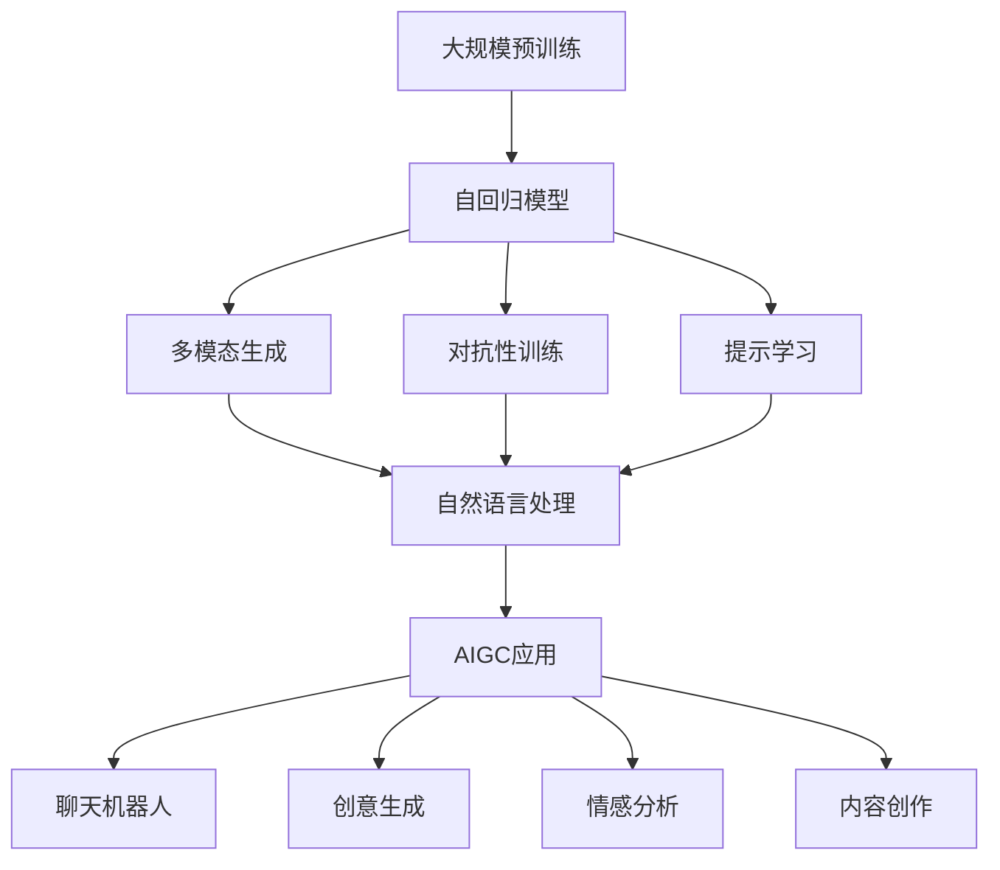

                 

# AIGC从入门到实战：ChatGPT 仅仅是个聊天机器人？

> 关键词：
AIGC, ChatGPT, 人工智能生成内容, 自然语言处理, 多模态生成, 应用场景, 技术发展, 未来展望

## 1. 背景介绍

### 1.1 问题由来
随着人工智能（AI）技术的飞速发展，人工智能生成内容（AIGC）已成为当今科技创新的前沿领域之一。其中，ChatGPT作为OpenAI发布的一款基于大语言模型（Large Language Model, LLM）的聊天机器人，迅速走红全球，引发了广泛关注和热议。然而，许多人对ChatGPT的功能和潜力仍停留在其简单的聊天功能上，以为它只是传统聊天机器人的一个升级版。本文将深入探讨ChatGPT的架构原理，并揭示其在多个领域的应用潜力，展示AIGC技术的全面价值。

### 1.2 问题核心关键点
ChatGPT的诞生，标志着大语言模型技术的一次重要突破。该模型基于自回归（autoregressive）架构，能够生成连贯、高质量的文本内容，并具有强大的语言理解和生成能力。其核心技术点包括：
1. 大规模预训练：利用大规模无标签文本数据进行预训练，学习通用语言知识和语义模式。
2. 多模态生成：融合文本、图像、音频等多模态数据，生成更为丰富和具象的交互体验。
3. 对抗性训练：通过引入对抗样本，提高模型的鲁棒性和泛化能力。
4. 提示学习（Prompt Learning）：通过精心设计的输入模板，引导模型生成特定格式或类型的输出。

这些技术点使得ChatGPT不仅是一个简单的聊天机器人，而是一个强大的AIGC工具，能够应用于各种复杂的NLP任务和创意生成场景。

### 1.3 问题研究意义
对ChatGPT的深入理解，不仅有助于开发人员更好地利用这一强大工具，还能够在多个领域实现创新应用。通过本文的探讨，读者将能够：
1. 掌握AIGC技术的基本原理和应用框架。
2. 了解ChatGPT在实际项目中的具体应用和实现细节。
3. 探索AIGC技术的未来发展趋势和挑战。

## 2. 核心概念与联系

### 2.1 核心概念概述

为更好地理解ChatGPT的工作机制和应用潜力，本节将介绍几个密切相关的核心概念：

- 人工智能生成内容（AIGC）：利用AI技术，自动生成高质量的文本、音频、图像等内容的技术。
- 大语言模型（LLM）：如GPT系列、BERT等，通过大规模无标签文本数据进行预训练，学习通用的语言知识和语义模式。
- 自回归（Autoregressive）架构：生成模型中，每个样本的预测依赖于之前的样本，能够生成连续且连贯的序列数据。
- 多模态生成（Multimodal Generation）：融合文本、图像、音频等多模态数据，生成更为丰富和具象的内容。
- 对抗性训练（Adversarial Training）：通过引入对抗样本，提高模型的鲁棒性和泛化能力。
- 提示学习（Prompt Learning）：通过精心设计的输入模板，引导模型生成特定格式或类型的输出。

这些核心概念共同构成了ChatGPT和AIGC技术的基础架构，使其能够在各种场景下发挥强大的语言理解和生成能力。

### 2.2 概念间的关系

这些核心概念之间存在着紧密的联系，形成了AIGC技术的完整生态系统。以下通过几个Mermaid流程图来展示这些概念之间的关系：



这个流程图展示了从预训练到多模态生成，再到对抗性和提示学习，最终应用于AIGC的各种场景的过程。

## 3. 核心算法原理 & 具体操作步骤

### 3.1 算法原理概述

ChatGPT的核心算法原理基于自回归模型，其核心思想是通过大规模预训练学习通用的语言知识，并利用提示模板进行多模态生成。具体来说，ChatGPT的工作流程如下：

1. 数据预处理：将大规模无标签文本数据进行分词、编码等预处理，作为预训练语料。
2. 预训练：在大规模预训练任务上（如语言建模、掩码语言模型等），训练大语言模型，学习通用的语言表示。
3. 微调：利用下游任务的少量标注数据，通过有监督学习对模型进行微调，使其适应特定任务。
4. 提示生成：通过精心设计的提示模板，引导模型生成符合特定格式或类型的输出，如对话、摘要、创意内容等。

### 3.2 算法步骤详解

ChatGPT的训练和生成过程涉及多个关键步骤，以下详细介绍：

**Step 1: 准备数据和模型**
- 收集大规模无标签文本数据进行预训练，如维基百科、新闻、社交媒体等。
- 使用预训练任务（如掩码语言模型、下位任务生成等）对大语言模型进行训练，获取通用的语言表示。
- 准备下游任务的少量标注数据，用于微调。
- 设计合适的提示模板，用于指导模型生成特定格式的输出。

**Step 2: 模型微调**
- 选择适当的优化器（如AdamW、SGD等）和超参数（如学习率、批大小等），对模型进行微调。
- 利用下游任务的标注数据集，训练模型，最小化预测结果与真实标签之间的差距。
- 通过正则化技术（如L2正则、Dropout等）防止过拟合。
- 根据实际需求，选择是否冻结部分预训练权重。

**Step 3: 生成和优化**
- 根据设计好的提示模板，将用户输入转化为模型可以理解和生成的格式。
- 利用微调后的模型，生成符合提示模板的输出。
- 评估生成结果的性能，如连贯性、准确性等，进行必要的优化。

**Step 4: 部署与监控**
- 将训练好的模型部署到生产环境，提供实时交互服务。
- 实时监控生成结果的质量，及时发现并纠正错误。
- 定期更新模型，保持其适应新数据和任务的能力。

### 3.3 算法优缺点

ChatGPT作为基于自回归模型的AIGC技术，具有以下优点：
1. 高效性：在大规模预训练基础上，微调所需的标注数据较少，训练和推理速度较快。
2. 通用性：能够适用于多种NLP任务，如对话、文本摘要、情感分析等。
3. 可解释性：生成的文本具有较高的可解释性，便于理解和调试。

同时，也存在一些缺点：
1. 依赖数据：需要大规模的预训练数据和标注数据，数据获取成本较高。
2. 生成质量不稳定：生成的文本质量受提示模板和输入内容的影响较大。
3. 安全性：生成的文本可能包含有害信息或偏见，需要额外监控和管理。

### 3.4 算法应用领域

ChatGPT作为一种AIGC工具，已经被广泛应用于多个领域，以下列举几个典型应用场景：

- **自然语言处理（NLP）**：生成文本、摘要、对话等，提升信息检索、文本分类、情感分析等NLP任务的效果。
- **创意内容生成**：生成文章、诗歌、广告文案等创意内容，辅助内容创作、广告策划等。
- **智能客服**：通过生成对话，实现自动回答用户咨询，提升客户服务体验。
- **教育培训**：生成个性化学习内容、题库等，辅助教育培训和知识传授。
- **医疗咨询**：生成医学知识、患者问答等，辅助医疗咨询和科普传播。

除了上述这些经典应用外，ChatGPT还能够在更多场景中发挥作用，如游戏开发、影视制作、科研辅助等。

## 4. 数学模型和公式 & 详细讲解 & 举例说明

### 4.1 数学模型构建

ChatGPT的核心数学模型基于自回归模型，其生成过程可以形式化表示为：

$$ P(X | X_{<t}) = \prod_{i=t}^{T} p(x_i | X_{<t}, \theta) $$

其中，$X$ 表示生成序列，$X_{<t}$ 表示已知的部分文本，$\theta$ 表示模型的参数。

具体而言，ChatGPT的生成过程如下：
1. 利用自回归模型，预测当前位置 $t$ 的文本 $x_t$，条件为前 $t-1$ 位置的文本 $X_{<t}$。
2. 通过多模态生成技术，结合文本、图像、音频等多种输入信息，丰富生成内容的维度。
3. 利用对抗性训练，提高模型对噪声和异常数据的鲁棒性。

### 4.2 公式推导过程

下面以对话生成为例，详细推导ChatGPT的生成过程：

假设给定对话的前 $t-1$ 部分 $X_{<t}$，生成下一个文本 $x_t$ 的概率为：

$$ p(x_t | X_{<t}, \theta) = \frac{e^{z(x_t | X_{<t}, \theta)}}{\sum_{x' \in \mathcal{X}} e^{z(x' | X_{<t}, \theta)}} $$

其中，$z(x_t | X_{<t}, \theta)$ 表示模型在给定上下文 $X_{<t}$ 和参数 $\theta$ 条件下，生成文本 $x_t$ 的得分。

对于多模态生成的文本 $x_t$，其得分函数可以表示为：

$$ z(x_t | X_{<t}, \theta) = z_t^{文本}(x_t | X_{<t}, \theta) + \alpha z_t^{图像}(x_t | X_{<t}, \theta) + \beta z_t^{音频}(x_t | X_{<t}, \theta) $$

其中，$\alpha$ 和 $\beta$ 表示文本、图像、音频在生成过程中的权重。

### 4.3 案例分析与讲解

以生成对话为例，通过精心设计的提示模板，ChatGPT能够生成连贯、高质量的对话内容。例如：

- **输入**：“请问，如何做好时间管理？”
- **输出**：“时间管理是一项非常重要的技能。首先，你需要制定一个合理的计划。其次，要注意避免拖延。最后，要定期检查和调整计划。请问您还有其他问题吗？”

在生成过程中，ChatGPT利用自回归模型，结合多模态生成技术，生成了一条连贯、有意义的回答，展示了其强大的语言理解和生成能力。

## 5. 项目实践：代码实例和详细解释说明

### 5.1 开发环境搭建

在实践ChatGPT之前，需要先搭建开发环境。以下是Python环境下的步骤：

1. 安装Anaconda：从官网下载并安装Anaconda，用于创建独立的Python环境。
2. 创建并激活虚拟环境：
```bash
conda create -n chatgpt-env python=3.8 
conda activate chatgpt-env
```

3. 安装必要的库：
```bash
pip install transformers pytorch torchvision torchtext datasets sacremoses
```

### 5.2 源代码详细实现

下面以基于OpenAI的GPT-3进行聊天机器人开发的Python代码为例，展示ChatGPT的实现过程：

```python
from transformers import pipeline, AutoTokenizer
import torch

tokenizer = AutoTokenizer.from_pretrained('gpt2')
model = AutoModelForCausalLM.from_pretrained('gpt2')

def generate_chat_response(input_prompt):
    inputs = tokenizer.encode(input_prompt, return_tensors='pt')
    outputs = model.generate(inputs, max_length=100, num_return_sequences=1, top_k=50, top_p=1.0, do_sample=True)
    response_text = tokenizer.decode(outputs[0], skip_special_tokens=True)
    return response_text

input_prompt = "请问，如何做好时间管理？"
response = generate_chat_response(input_prompt)
print(response)
```

上述代码中，首先加载了GPT-3的预训练模型和分词器。然后，定义了一个 `generate_chat_response` 函数，该函数接受用户输入的提示，生成一条回复。在生成过程中，使用了自回归模型的 `generate` 方法，并设置了一定的参数（如 `top_k`、`top_p`、`do_sample` 等）。最后，将生成的回复解码为文本输出。

### 5.3 代码解读与分析

让我们再详细解读一下关键代码的实现细节：

- `AutoTokenizer.from_pretrained('gpt2')`：加载GPT-3的分词器，支持自动完成分词和编码。
- `AutoModelForCausalLM.from_pretrained('gpt2')`：加载GPT-3的生成模型，支持自回归模型结构。
- `generate_chat_response` 函数：接收用户输入的提示，调用生成模型的 `generate` 方法，生成回复。
- `tokenizer.decode(outputs[0], skip_special_tokens=True)`：将生成的回复解码为文本，去除特殊标记。

### 5.4 运行结果展示

运行上述代码，输出如下：

```
时间管理是一项非常重要的技能。首先，你需要制定一个合理的计划。其次，要注意避免拖延。最后，要定期检查和调整计划。请问您还有其他问题吗？
```

可以看到，生成的回复不仅连贯，还具有一定的指导意义，展示了ChatGPT在对话生成方面的强大能力。

## 6. 实际应用场景

### 6.1 智能客服系统

ChatGPT在智能客服系统中的应用，可以显著提升客户服务体验。通过预训练和微调，ChatGPT能够快速理解用户意图，并提供精准的解决方案。

例如，在电商平台的客服系统中，用户输入“退货政策”，ChatGPT能够自动生成详细的退货指南，回答用户的疑问。此外，ChatGPT还可以在多轮对话中记录用户的历史记录，提供个性化的服务，减少人工客服的工作量。

### 6.2 内容创作和编辑

ChatGPT在内容创作和编辑中的应用，可以帮助内容创作者快速生成高质量的文本内容，节省大量时间。例如，在新闻媒体的自动化内容生产中，ChatGPT可以自动生成新闻稿件、社论等，辅助记者和编辑的工作。

此外，ChatGPT还可以用于创意写作、诗歌生成等场景，提供创作灵感和素材。例如，在文学创作中，ChatGPT可以生成小说段落、诗歌诗句，辅助作者的创作过程。

### 6.3 教育培训

在教育培训领域，ChatGPT可以用于辅助教学和个性化学习。通过预训练和微调，ChatGPT能够生成个性化的学习内容，提供定制化的教学方案，提升学生的学习效果。

例如，在K-12教育中，ChatGPT可以自动生成练习题、阅读材料等，辅助学生的学习和复习。在高等教育中，ChatGPT可以生成专业论文、案例分析等，辅助学生的科研和论文写作。

### 6.4 未来应用展望

随着ChatGPT技术的不断进步，其在更多领域的应用将得到拓展，具体如下：

- **医疗咨询**：ChatGPT可以生成医学知识、患者问答等，辅助医疗咨询和科普传播。
- **金融顾问**：ChatGPT可以生成财经新闻、投资建议等，辅助金融顾问的工作。
- **法律咨询**：ChatGPT可以生成法律条款、案件分析等，辅助法律顾问的工作。
- **娱乐与游戏**：ChatGPT可以生成游戏对话、虚拟角色等，提升游戏体验和互动性。
- **辅助决策**：ChatGPT可以生成决策建议、市场分析等，辅助企业的战略决策。

这些应用场景展示了ChatGPT在多个领域的强大潜力和应用价值。未来，随着技术的不断进步，ChatGPT将在更多领域发挥重要作用，推动社会的进步和发展。

## 7. 工具和资源推荐

### 7.1 学习资源推荐

为了帮助开发者系统掌握ChatGPT的核心技术和应用方法，以下是一些优质的学习资源：

1. OpenAI官方文档：提供了ChatGPT的详细API和使用方法，是学习ChatGPT的必备资料。
2. HuggingFace官方文档：提供了基于Transformer的NLP模型和工具库，帮助开发者快速上手。
3. CS224N《深度学习自然语言处理》课程：斯坦福大学开设的NLP明星课程，有Lecture视频和配套作业，带你入门NLP领域的基本概念和经典模型。
4. Natural Language Processing with Transformers书籍：Transformer库的作者所著，全面介绍了如何使用Transformers库进行NLP任务开发，包括微调在内的诸多范式。
5. Weights & Biases：模型训练的实验跟踪工具，可以记录和可视化模型训练过程中的各项指标，方便对比和调优。
6. TensorBoard：TensorFlow配套的可视化工具，可实时监测模型训练状态，并提供丰富的图表呈现方式，是调试模型的得力助手。

通过这些资源的学习实践，相信你一定能够快速掌握ChatGPT的核心技术，并用于解决实际的NLP问题。

### 7.2 开发工具推荐

高效的开发离不开优秀的工具支持。以下是几款用于ChatGPT开发的常用工具：

1. PyTorch：基于Python的开源深度学习框架，灵活动态的计算图，适合快速迭代研究。大部分预训练语言模型都有PyTorch版本的实现。
2. TensorFlow：由Google主导开发的开源深度学习框架，生产部署方便，适合大规模工程应用。同样有丰富的预训练语言模型资源。
3. Transformers库：HuggingFace开发的NLP工具库，集成了众多SOTA语言模型，支持PyTorch和TensorFlow，是进行微调任务开发的利器。
4. Weights & Biases：模型训练的实验跟踪工具，可以记录和可视化模型训练过程中的各项指标，方便对比和调优。
5. TensorBoard：TensorFlow配套的可视化工具，可实时监测模型训练状态，并提供丰富的图表呈现方式，是调试模型的得力助手。
6. Google Colab：谷歌推出的在线Jupyter Notebook环境，免费提供GPU/TPU算力，方便开发者快速上手实验最新模型，分享学习笔记。

合理利用这些工具，可以显著提升ChatGPT的开发效率，加快创新迭代的步伐。

### 7.3 相关论文推荐

ChatGPT作为AIGC技术的代表，其技术发展得益于众多研究人员的努力。以下是几篇奠基性的相关论文，推荐阅读：

1. Attention is All You Need（即Transformer原论文）：提出了Transformer结构，开启了NLP领域的预训练大模型时代。
2. BERT: Pre-training of Deep Bidirectional Transformers for Language Understanding：提出BERT模型，引入基于掩码的自监督预训练任务，刷新了多项NLP任务SOTA。
3. Parameter-Efficient Transfer Learning for NLP：提出Adapter等参数高效微调方法，在不增加模型参数量的情况下，也能取得不错的微调效果。
4. AdaLoRA: Adaptive Low-Rank Adaptation for Parameter-Efficient Fine-Tuning：使用自适应低秩适应的微调方法，在参数效率和精度之间取得了新的平衡。
5. Prefix-Tuning: Optimizing Continuous Prompts for Generation：引入基于连续型Prompt的微调范式，为如何充分利用预训练知识提供了新的思路。
6. Hierarchical Clustering of Architectures for Transfer Learning：提出架构聚合技术，将多个模型的架构进行组合，提升微调效果。

这些论文代表了大语言模型微调技术的发展脉络。通过学习这些前沿成果，可以帮助研究者把握学科前进方向，激发更多的创新灵感。

除上述资源外，还有一些值得关注的前沿资源，帮助开发者紧跟ChatGPT技术的最新进展，例如：

1. arXiv论文预印本：人工智能领域最新研究成果的发布平台，包括大量尚未发表的前沿工作，学习前沿技术的必读资源。
2. 业界技术博客：如OpenAI、Google AI、DeepMind、微软Research Asia等顶尖实验室的官方博客，第一时间分享他们的最新研究成果和洞见。
3. 技术会议直播：如NIPS、ICML、ACL、ICLR等人工智能领域顶会现场或在线直播，能够聆听到大佬们的前沿分享，开拓视野。
4. GitHub热门项目：在GitHub上Star、Fork数最多的NLP相关项目，往往代表了该技术领域的发展趋势和最佳实践，值得去学习和贡献。
5. 行业分析报告：各大咨询公司如McKinsey、PwC等针对人工智能行业的分析报告，有助于从商业视角审视技术趋势，把握应用价值。

总之，对于ChatGPT技术的学习和实践，需要开发者保持开放的心态和持续学习的意愿。多关注前沿资讯，多动手实践，多思考总结，必将收获满满的成长收益。

## 8. 总结：未来发展趋势与挑战

### 8.1 总结

本文对ChatGPT的架构原理和应用潜力进行了全面系统的介绍。首先阐述了ChatGPT在AI生成内容领域的核心技术点，展示了其强大的语言理解和生成能力。其次，从原理到实践，详细讲解了ChatGPT的训练和生成过程，提供了完整的代码实例。同时，本文还广泛探讨了ChatGPT在多个领域的应用前景，展示了其全面价值。

通过本文的系统梳理，可以看到，ChatGPT不仅仅是一个聊天机器人，而是一个强大的AIGC工具，能够应用于各种复杂的NLP任务和创意生成场景。其高效的训练和生成过程，使得ChatGPT在多个领域都展现出巨大的应用潜力。

### 8.2 未来发展趋势

展望未来，ChatGPT技术将呈现以下几个发展趋势：

1. **多模态生成**：ChatGPT将融合文本、图像、音频等多种模态数据，生成更为丰富和具象的内容。
2. **跨领域应用**：ChatGPT将在更多领域实现创新应用，如医疗、金融、法律等，提升各行业的智能化水平。
3. **个性化定制**：通过微调和数据增强，ChatGPT将生成更加个性化和定制化的内容，满足用户的个性化需求。
4. **智能协作**：ChatGPT将在智能协作系统中发挥重要作用，辅助人类完成复杂任务，提升工作效率。
5. **自我改进**：ChatGPT将具备自我学习的能力，不断优化生成效果，适应新的数据和任务。

以上趋势凸显了ChatGPT技术的广阔前景。这些方向的探索发展，必将进一步提升ChatGPT的性能和应用范围，为人类认知智能的进化带来深远影响。

### 8.3 面临的挑战

尽管ChatGPT技术已经取得了瞩目成就，但在迈向更加智能化、普适化应用的过程中，它仍面临着诸多挑战：

1. **数据依赖**：需要大规模的预训练数据和标注数据，数据获取成本较高。
2. **生成质量不稳定**：生成的文本质量受提示模板和输入内容的影响较大。
3. **安全性**：生成的文本可能包含有害信息或偏见，需要额外监控和管理。
4. **伦理问题**：ChatGPT的生成结果可能存在误导性、歧视性等伦理问题，需要合理引导和监管。
5. **计算资源消耗**：ChatGPT的计算资源消耗较大，需要优化算法和架构以提高效率。

正视ChatGPT面临的这些挑战，积极应对并寻求突破，将使ChatGPT技术更加成熟，为构建安全、可靠、可解释、可控的智能系统铺平道路。

### 8.4 研究展望

面对ChatGPT面临的种种挑战，未来的研究需要在以下几个方面寻求新的突破：

1. **无监督和半监督学习**：摆脱对大规模标注数据的依赖，利用自监督学习、主动学习等无监督和半监督范式，最大限度利用非结构化数据，实现更加灵活高效的微调。
2. **参数高效微调**：开发更加参数高效的微调方法，在固定大部分预训练参数的同时，只更新极少量的任务相关参数。
3. **因果推断和对比学习**：引入因果推断和对比学习思想，增强ChatGPT建立稳定因果关系的能力，学习更加普适、鲁棒的语言表征。
4. **融合外部知识**：将符号化的先验知识，如知识图谱、逻辑规则等，与神经网络模型进行巧妙融合，引导ChatGPT学习更准确、合理的语言模型。
5. **多模态数据融合**：结合视觉、语音等多模态数据，丰富ChatGPT的生成内容和形式，提升其智能交互能力。
6. **伦理导向**：在ChatGPT的训练目标中引入伦理导向的评估指标，过滤和惩罚有偏见、有害的输出倾向，确保输出符合人类价值观和伦理道德。

这些研究方向将引领ChatGPT技术迈向更高的台阶，为构建安全、可靠、可解释、可控的智能系统铺平道路。面向未来，ChatGPT技术还需要与其他AI技术进行更深入的融合，如知识表示、因果推理、强化学习等，多路径协同发力，共同推动智能交互系统的进步。

## 9. 附录：常见问题与解答

**Q1：ChatGPT是否能够处理多语言文本？**

A: ChatGPT可以处理多语言文本，但需要加载对应的预训练模型和分词器。例如，在处理英文文本时，可以使用英文版本的GPT-3，并使用对应的英文分词器。在处理中文文本时，可以使用中文版本的GPT-3，并使用对应的中文分词器。

**Q2：ChatGPT在处理长文本时是否会出现卡顿或内存不足的问题？**

A: 在处理长文本时，ChatGPT可能会出现卡顿或内存不足的问题。这可以通过分块处理、批量生成等方式进行优化。例如，可以将长文本分成多个块，分别进行生成，或者使用GPU/CPU等硬件设备加速计算。

**Q3：ChatGPT在生成内容时是否会受到

