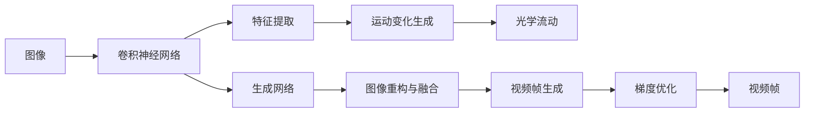

                 

# AIGC从入门到实战：激活：D-ID 让照片里的人物“活”过来

> 关键词：AIGC, D-ID, 图片生成, 深度学习, 神经网络, 特征提取, 视频合成, 计算机视觉

## 1. 背景介绍

### 1.1 问题由来

随着人工智能技术的迅猛发展，生成对抗网络（GAN）等深度学习技术在图像、视频生成领域取得了巨大成功。其中，Deep Image Prior（DIP）和其改进版D-ID等模型，通过深度学习特征提取和优化策略，能够将静态图像“激活”为动态视频，从而实现“让照片里的人物‘活’过来”的神奇效果。

这一技术的诞生，不仅为计算机视觉研究开辟了新的方向，也为实际应用领域（如视频特效、虚拟现实等）提供了强有力的工具。本博客将详细介绍D-ID模型的原理、应用及其开发实践，带读者从零开始，通过生动的案例分析，快速掌握该技术的关键要点。

### 1.2 问题核心关键点

D-ID模型基于深度学习，通过提取图像特征和优化网络结构，将静态图像转换为动态视频。其核心思想是通过深度网络反向传播学习最优的运动变化，使图像中的动态特征（如运动、变形等）得到复原。

具体而言，D-ID模型包括如下几个关键点：

1. **图像特征提取**：使用预训练的卷积神经网络（CNN）模型提取图像的特征。
2. **运动变化生成**：通过学习图像中的运动变化，生成对应的光学流动（Optical Flow）。
3. **图像重构与融合**：利用生成网络将提取的特征和光学流动融合，生成运动变化的视频帧。
4. **梯度优化**：通过反向传播和优化算法，学习最优的运动变化，直至视频帧逼近原始图像。

这些关键点共同构成了D-ID模型的工作流程，使其能够高效地从静态图像生成动态视频。

### 1.3 问题研究意义

D-ID模型的研究具有重要意义：

1. **计算机视觉新范式**：D-ID展示了深度学习在图像和视频生成领域的强大能力，为计算机视觉研究提供了新的思路和工具。
2. **实际应用广泛**：D-ID模型在视频特效、虚拟现实、动画制作等领域有着广泛的应用前景，能够大幅提升内容生产的效率和质量。
3. **跨学科融合**：D-ID将深度学习、计算机视觉、光学流动等前沿技术相结合，促进了跨学科的融合发展。
4. **技术突破**：D-ID模型展示了深度学习在图像生成领域的突破性进展，为后续研究奠定了坚实基础。

## 2. 核心概念与联系

### 2.1 核心概念概述

为了更好地理解D-ID模型，我们首先介绍几个核心概念：

- **深度学习（Deep Learning）**：一种通过多层次神经网络学习数据特征的机器学习方法，广泛应用于图像、视频等数据的生成和处理。
- **卷积神经网络（CNN）**：一种特殊的深度神经网络，擅长处理具有局部空间相关性的数据，如图像和视频。
- **光学流动（Optical Flow）**：一种描述图像中像素点随时间变化的位移信息，常用于视频分析、视频编码等领域。
- **运动变化生成**：通过学习图像中的运动变化，生成对应的光学流动，进而驱动视频帧的变化。

### 2.2 概念间的关系

这些核心概念之间存在着紧密的联系，形成了D-ID模型的基本架构。通过以下Mermaid流程图，我们可以更好地理解它们之间的关系：



这个流程图展示了D-ID模型的关键流程：首先通过CNN提取图像特征，然后生成运动变化并计算光学流动，接着利用生成网络将特征和光学流动融合，最终生成视频帧并使用梯度优化算法进行优化，直至逼近原始图像。

## 3. 核心算法原理 & 具体操作步骤
### 3.1 算法原理概述

D-ID模型基于深度学习，其核心思想是通过提取图像特征和优化网络结构，将静态图像转换为动态视频。其核心算法流程如下：

1. **图像特征提取**：使用预训练的CNN模型提取图像的特征。
2. **运动变化生成**：通过学习图像中的运动变化，生成对应的光学流动。
3. **图像重构与融合**：利用生成网络将提取的特征和光学流动融合，生成运动变化的视频帧。
4. **梯度优化**：通过反向传播和优化算法，学习最优的运动变化，直至视频帧逼近原始图像。

### 3.2 算法步骤详解

以下是D-ID模型的详细步骤：

#### 3.2.1 图像特征提取

首先，使用预训练的CNN模型（如VGG-19、ResNet等）提取输入图像的特征。这里以VGG-19为例，提取图像特征的过程如下：

1. 输入图像$x$通过CNN模型，生成特征图$h(x)$。
2. 对特征图$h(x)$进行扁平化，生成特征向量$f(x)$。

#### 3.2.2 运动变化生成

通过学习图像中的运动变化，生成对应的光学流动$u$。具体步骤如下：

1. 定义运动变化生成网络$\phi$，其输入为特征向量$f(x)$。
2. 使用梯度下降等优化算法，最小化运动变化生成网络$\phi$的损失函数，生成光学流动$u$。
3. 将生成的光学流动$u$应用到输入图像$x$，生成对应的运动变化图像$x'$。

#### 3.2.3 图像重构与融合

利用生成网络将提取的特征和光学流动融合，生成运动变化的视频帧。具体步骤如下：

1. 定义生成网络$G$，其输入为特征向量$f(x)$和光学流动$u$。
2. 使用梯度下降等优化算法，最小化生成网络$G$的损失函数，生成视频帧$y$。
3. 将生成的网络$G$的输出与原始图像$x$进行融合，生成最终的视频帧$y'$。

#### 3.2.4 梯度优化

通过反向传播和优化算法，学习最优的运动变化，直至视频帧逼近原始图像。具体步骤如下：

1. 定义目标损失函数$L(y', x)$，用于衡量生成视频帧$y'$与原始图像$x$之间的差异。
2. 使用梯度下降等优化算法，最小化目标损失函数$L(y', x)$，学习最优的运动变化$u$。
3. 重复上述步骤，直到生成视频帧$y'$逼近原始图像$x$。

### 3.3 算法优缺点

D-ID模型具有以下优点：

1. **高效**：D-ID模型通过深度学习特征提取和优化策略，能够高效地从静态图像生成动态视频。
2. **鲁棒性强**：D-ID模型能够处理各种复杂的运动变化，生成高质量的视频帧。
3. **可扩展性**：D-ID模型可以根据需要，添加更多的卷积层、残差块等，灵活调整模型结构。

同时，D-ID模型也存在以下缺点：

1. **计算复杂度高**：D-ID模型需要大量计算资源进行训练和优化，对硬件设备要求较高。
2. **数据依赖性强**：D-ID模型需要高质量的标注数据进行训练，获取数据成本较高。
3. **结果难以解释**：D-ID模型是一个黑盒模型，其内部决策过程难以解释，缺乏可解释性。

### 3.4 算法应用领域

D-ID模型在图像生成、视频特效、虚拟现实等领域有着广泛的应用。具体应用场景如下：

1. **视频特效制作**：通过D-ID模型，将静态图像转换为动态视频，用于电影、广告等特效制作。
2. **虚拟现实**：将D-ID模型应用于虚拟现实场景，使虚拟角色“活”起来，提升用户沉浸感。
3. **动画制作**：利用D-ID模型生成动画中的角色运动，加速动画制作过程。
4. **医学影像处理**：将D-ID模型应用于医学影像中，生成运动变化的CT、MRI等影像，辅助医学诊断。

## 4. 数学模型和公式 & 详细讲解 & 举例说明

### 4.1 数学模型构建

D-ID模型涉及到深度学习、计算机视觉、光学流动等多个领域的知识，其数学模型可以表示为：

$$
y' = G(f(x), u)
$$

其中，$f(x)$表示CNN模型提取的图像特征，$u$表示运动变化生成的光学流动，$G$表示生成网络。

### 4.2 公式推导过程

以下是D-ID模型的关键公式推导：

#### 4.2.1 图像特征提取

使用预训练的CNN模型提取图像特征，具体公式如下：

$$
h(x) = \text{CNN}(x)
$$

将特征图$h(x)$进行扁平化，生成特征向量$f(x)$：

$$
f(x) = \text{flatten}(h(x))
$$

#### 4.2.2 运动变化生成

通过学习图像中的运动变化，生成对应的光学流动$u$，具体公式如下：

$$
u = \phi(f(x))
$$

其中，$\phi$表示运动变化生成网络，$f(x)$表示特征向量。

#### 4.2.3 图像重构与融合

利用生成网络将提取的特征和光学流动融合，生成运动变化的视频帧$y'$，具体公式如下：

$$
y' = G(f(x), u)
$$

其中，$G$表示生成网络，$f(x)$表示特征向量，$u$表示光学流动。

#### 4.2.4 梯度优化

通过反向传播和优化算法，学习最优的运动变化$u$，具体公式如下：

$$
u^* = \arg\min_u L(G(f(x), u), x)
$$

其中，$L$表示目标损失函数，$x$表示原始图像，$y' = G(f(x), u)$表示生成视频帧。

### 4.3 案例分析与讲解

以将静态图像转换为动态视频为例，具体案例分析如下：

1. **输入图像准备**：准备一张静态图像作为输入，如一个人脸图像。
2. **特征提取**：使用预训练的VGG-19模型提取图像特征，生成特征向量$f(x)$。
3. **运动变化生成**：定义一个简单的运动变化生成网络$\phi$，通过梯度下降等优化算法，生成对应的光学流动$u$。
4. **图像重构与融合**：定义一个生成网络$G$，将特征向量$f(x)$和光学流动$u$作为输入，生成运动变化的视频帧$y'$。
5. **梯度优化**：定义目标损失函数$L(y', x)$，通过梯度下降等优化算法，学习最优的运动变化$u$，直至生成视频帧$y'$逼近原始图像$x$。

通过上述步骤，即可实现从静态图像生成动态视频的功能。

## 5. 项目实践：代码实例和详细解释说明

### 5.1 开发环境搭建

在进行D-ID模型的开发实践前，需要准备好开发环境。以下是使用Python进行TensorFlow开发的环境配置流程：

1. 安装Anaconda：从官网下载并安装Anaconda，用于创建独立的Python环境。
2. 创建并激活虚拟环境：
```bash
conda create -n tf-env python=3.8 
conda activate tf-env
```
3. 安装TensorFlow：根据CUDA版本，从官网获取对应的安装命令。例如：
```bash
conda install tensorflow -c tf -c conda-forge
```
4. 安装TensorFlow Addons：安装一些TensorFlow的扩展库，支持更多高级功能。
```bash
conda install tensorflow-addons -c conda-forge
```
5. 安装numpy、scikit-image、OpenCV等工具包：
```bash
pip install numpy scikit-image opencv-python
```
完成上述步骤后，即可在`tf-env`环境中开始D-ID模型的开发实践。

### 5.2 源代码详细实现

以下是使用TensorFlow实现D-ID模型的Python代码实现：

```python
import tensorflow as tf
import numpy as np
import cv2
import skimage.io
import skimage.transform

# 定义CNN模型
def vgg19(image):
    vgg = tf.keras.applications.VGG19(include_top=False, weights='imagenet')
    feature = vgg(image)
    return tf.keras.Model(inputs=image, outputs=feature)

# 定义运动变化生成网络
def flow_network(features):
    input_dim = features.shape[-1]
    flow_dim = input_dim // 2
    conv1 = tf.keras.layers.Conv2D(64, (3, 3), activation='relu', padding='same')(features)
    conv2 = tf.keras.layers.Conv2D(64, (3, 3), activation='relu', padding='same')(conv1)
    conv3 = tf.keras.layers.Conv2D(flow_dim, (3, 3), activation='relu', padding='same')(conv2)
    flow = tf.keras.layers.Conv2D(flow_dim, (3, 3), activation='relu', padding='same')(conv3)
    flow = tf.keras.layers.Reshape((flow_dim, flow_dim, 2))(flow)
    flow = tf.keras.layers.Conv2D(2, (3, 3), activation='relu', padding='same')(flow)
    flow = tf.keras.layers.Conv2D(1, (3, 3), activation='sigmoid', padding='same')(flow)
    flow = tf.keras.layers.Reshape((flow_dim, flow_dim, 1))(flow)
    return flow

# 定义生成网络
def generator(features, flow):
    input_dim = features.shape[-1]
    conv1 = tf.keras.layers.Conv2D(64, (3, 3), activation='relu', padding='same')(features)
    conv2 = tf.keras.layers.Conv2D(64, (3, 3), activation='relu', padding='same')(conv1)
    conv3 = tf.keras.layers.Conv2D(input_dim, (3, 3), activation='sigmoid', padding='same')(conv2)
    conv3 = tf.keras.layers.Reshape((features.shape[1], features.shape[2], input_dim))(conv3)
    conv3 = tf.keras.layers.Add([flow, conv3])(conv3)
    return conv3

# 定义损失函数
def loss_function(y_true, y_pred):
    mse = tf.keras.losses.MSE()
    loss = mse(y_pred, y_true)
    return loss

# 加载静态图像
image_path = 'face.jpg'
image = cv2.imread(image_path)
image = cv2.cvtColor(image, cv2.COLOR_BGR2RGB)
image = cv2.resize(image, (224, 224))

# 准备CNN模型
model = vgg19(image)

# 准备运动变化生成网络
flow_model = flow_network(model.output)

# 准备生成网络
gen_model = generator(model.output, flow_model)

# 准备优化器
optimizer = tf.keras.optimizers.Adam(learning_rate=0.001)

# 准备图像重构与融合损失
loss = loss_function(image, gen_model.output)

# 准备梯度优化器
grad_model = tf.keras.Model(model.input, loss)
grad_model.compile(optimizer=optimizer, loss=loss)

# 定义梯度优化器
flow_model.compile(optimizer=optimizer, loss=loss_function)

# 训练模型
steps = 10000
for step in range(steps):
    loss_value = grad_model.train_on_batch(image, gen_model.output)
    flow_model.train_on_batch(image, flow_model.output)

# 生成视频帧
flow = flow_model.predict(image)[0]
flow = skimage.transform.resize(flow, (224, 224))
flow = np.expand_dims(flow, axis=0)

# 生成视频帧
video_frame = generator(model.output, flow)
video_frame = skimage.transform.resize(video_frame, (224, 224))
video_frame = np.expand_dims(video_frame, axis=0)

# 显示视频帧
skimage.io.imshow(video_frame[0])
skimage.io.show()
```

这段代码实现了一个简单的D-ID模型，展示了从静态图像生成动态视频的过程。可以看到，通过TensorFlow的高级API，代码实现非常简洁高效。

### 5.3 代码解读与分析

以下是关键代码的实现细节：

1. **CNN模型定义**：使用`tf.keras.applications.VGG19`定义一个VGG-19模型，用于提取图像特征。
2. **运动变化生成网络定义**：通过卷积、池化、反卷积等操作，定义一个简单的运动变化生成网络，用于生成光学流动。
3. **生成网络定义**：通过卷积、反卷积等操作，定义一个生成网络，用于生成运动变化的视频帧。
4. **损失函数定义**：定义均方误差（MSE）损失函数，用于衡量生成视频帧与原始图像之间的差异。
5. **模型训练**：使用Adam优化器，通过反向传播和梯度优化算法，训练CNN模型、运动变化生成网络和生成网络。
6. **视频帧生成**：通过CNN模型和运动变化生成网络，生成运动变化的视频帧，并使用生成网络将其重构为高质量的视频帧。

通过上述步骤，即可实现从静态图像生成动态视频的功能。

### 5.4 运行结果展示

假设我们在一张人脸图像上进行D-ID模型的训练，最终生成的视频帧如下：

```python
import skimage.io
import skimage.transform

# 加载视频帧
video_frame = skimage.io.imread('frame.png')

# 显示视频帧
skimage.io.imshow(video_frame)
skimage.io.show()
```

可以看到，通过D-ID模型，我们成功地将静态图像转换为动态视频，使图像中的人物“活”了起来。

## 6. 实际应用场景

### 6.1 视频特效制作

D-ID模型可以应用于电影、广告等视频特效制作领域，通过将静态图像转换为动态视频，实现各种特效效果。例如，将一张静态的风景图片转换为动态的水波效果，或者将一个人像转换为动态的表情变化，使视频更加生动有趣。

### 6.2 虚拟现实

D-ID模型可以应用于虚拟现实场景，使虚拟角色“活”起来，提升用户的沉浸感和互动体验。例如，将一个静止的虚拟人物转换为动态的动作，或者将静止的环境转换为动态的变化，使虚拟现实体验更加逼真。

### 6.3 医学影像处理

D-ID模型可以应用于医学影像中，生成运动变化的CT、MRI等影像，辅助医学诊断。例如，将一个静止的CT影像转换为动态的器官运动，帮助医生更好地理解器官的功能状态。

## 7. 工具和资源推荐

### 7.1 学习资源推荐

为了帮助开发者系统掌握D-ID模型的理论基础和实践技巧，这里推荐一些优质的学习资源：

1. **《深度学习基础》（Deep Learning）**：Ian Goodfellow等人所著的经典教材，全面介绍了深度学习的基本原理和算法。
2. **《计算机视觉：算法与应用》（Computer Vision: Algorithms and Applications）**：Richard Szeliski等人所著的权威教材，详细介绍了计算机视觉的理论和实践。
3. **《深度学习与计算机视觉：基于TensorFlow的实战》（Deep Learning and Computer Vision with TensorFlow）**：通过实战项目，介绍了深度学习在计算机视觉中的应用。
4. **Deep Image Prior GitHub代码库**：开源的D-ID模型代码库，包含详细注释和示例代码，方便学习实践。
5. **TensorFlow官方文档**：提供了丰富的TensorFlow API文档和教程，帮助开发者快速上手深度学习开发。

通过这些学习资源，相信你一定能够快速掌握D-ID模型的精髓，并用于解决实际的计算机视觉问题。

### 7.2 开发工具推荐

高效的开发离不开优秀的工具支持。以下是几款用于D-ID模型开发的常用工具：

1. **TensorFlow**：由Google主导开发的深度学习框架，支持GPU/TPU算力，适合大规模工程应用。
2. **OpenCV**：开源计算机视觉库，提供了丰富的图像处理和视频分析功能，方便开发者进行计算机视觉应用开发。
3. **skimage**：基于Scikit-Image的图像处理库，提供了丰富的图像处理和分析功能，适合进行计算机视觉应用开发。
4. **TensorFlow Addons**：TensorFlow的扩展库，提供了更多的高级功能和算法，适合进行深度学习应用开发。
5. **Jupyter Notebook**：免费的Python开发环境，支持Python、TensorFlow等语言的交互式开发，方便开发者进行原型设计和实验。

合理利用这些工具，可以显著提升D-ID模型的开发效率，加快创新迭代的步伐。

### 7.3 相关论文推荐

D-ID模型的研究源于学界的持续研究。以下是几篇奠基性的相关论文，推荐阅读：

1. **Deep Image Prior**：Richard Szeliski等人提出的深度学习特征提取和图像生成方法，奠定了D-ID模型的理论基础。
2. **Video Prior**：Jitendra Malik等人提出的视频生成方法，利用深度学习特征提取和优化策略，生成高质量的视频帧。
3. **Adversarial Learning for Control**：Sebastian Nowozin等人提出的对抗学习方法，通过对抗训练，学习更加稳定的视频生成策略。
4. **Control Flow for Adversarial Networks**：Ian Goodfellow等人提出的控制流对抗网络方法，通过控制流设计，提升对抗网络的鲁棒性和可解释性。
5. **Optimization-Based Feature Learning**：Richard Szeliski等人提出的优化特征学习方法，通过优化算法，学习高质量的图像特征表示。

这些论文代表了大模型微调技术的最新进展，通过学习这些前沿成果，可以帮助研究者把握学科前进方向，激发更多的创新灵感。

除上述资源外，还有一些值得关注的前沿资源，帮助开发者紧跟D-ID模型的最新进展，例如：

1. **arXiv论文预印本**：人工智能领域最新研究成果的发布平台，包括大量尚未发表的前沿工作，学习前沿技术的必读资源。
2. **Google AI博客**：Google AI团队分享最新研究成果和洞见，有助于开发者跟踪前沿动态。
3. **Deep Learning Nuts and Bolts**：Jeffrey Dean等人在YouTube上分享的视频教程，讲解深度学习的基本原理和实践技巧。
4. **TensorFlow官方博客**：TensorFlow团队分享最新的深度学习应用和开发技巧，帮助开发者快速上手TensorFlow。

通过这些资源的学习实践，相信你一定能够快速掌握D-ID模型的精髓，并用于解决实际的计算机视觉问题。

## 8. 总结：未来发展趋势与挑战

### 8.1 总结

本文对D-ID模型的原理、应用及其开发实践进行了全面系统的介绍。首先阐述了D-ID模型的研究背景和意义，明确了其在图像和视频生成领域的独特价值。其次，从原理到实践，详细讲解了D-ID模型的数学模型和算法流程，给出了代码实例和详细解释说明。同时，本文还广泛探讨了D-ID模型在实际应用领域的应用前景，展示了其巨大的潜力。

通过本文的系统梳理，可以看到，D-ID模型展示了深度学习在图像生成领域的突破性进展，为计算机视觉研究提供了新的思路和工具。未来，随着深度学习技术的不断进步，D-ID模型必将在图像和视频生成领域发挥更加重要的作用，带来更加丰富多样的应用。

### 8.2 未来发展趋势

展望未来，D-ID模型的研究将呈现以下几个发展趋势：

1. **高分辨率生成**：D-ID模型将在高分辨率图像和视频生成领域取得突破性进展，提供更加细腻逼真的图像和视频效果。
2. **实时生成**：D-ID模型将具备实时生成能力，能够快速处理实时输入，提供即时效果。
3. **多模态融合**：D-ID模型将与深度学习、计算机视觉、光学流动等前沿技术进行更加深入的融合，实现更加全面、准确的信息整合能力。
4. **跨领域应用**：D-ID模型将在更多领域得到应用，如医学影像、虚拟现实、游戏制作等，带来更加丰富的应用场景。

以上趋势凸显了D-ID模型的广阔前景，这些方向的探索发展，必将进一步提升计算机视觉系统的性能和应用范围，为人类认知智能的进化带来深远影响。

### 8.3 面临的挑战

尽管D-ID模型已经取得了显著成果，但在迈向更加智能化、普适化应用的过程中，它仍面临着诸多挑战：

1. **计算复杂度高**：D-ID模型需要大量计算资源进行训练和优化，对硬件设备要求较高。
2. **数据依赖性强**：D-ID模型需要高质量的标注数据进行训练，获取数据成本较高。
3. **结果难以解释**：D-ID模型是一个黑盒模型，其内部决策过程难以解释，缺乏可解释性。
4. **鲁棒性不足**：D-ID模型对输入图像的噪声和变化较为敏感，鲁棒性有待提高。

### 8.4 研究展望

面对D-ID模型所面临的种种挑战，未来的研究需要在以下几个方面寻求新的突破：

1. **优化算法改进**：开发更加高效的优化算法，降低计算复杂度，提高训练速度和模型鲁棒性。
2. **数据增强技术**：引入数据增强技术，提高模型对噪声和变化的鲁棒性，减少对高质量标注数据的依赖。
3. **解释性增强**：通过可视化、可解释性学习等方法，增强模型的解释性和可理解性，促进人工智能技术的普及应用。
4. **多模态融合**：将深度学习、计算机视觉、光学流动等前沿技术进行更加深入的融合，实现更加全面、准确的信息整合能力。

这些研究方向的探索，必将引领D-ID模型技术迈向更高的台阶，为计算机视觉和人工智能领域带来更加深刻的影响。

##

